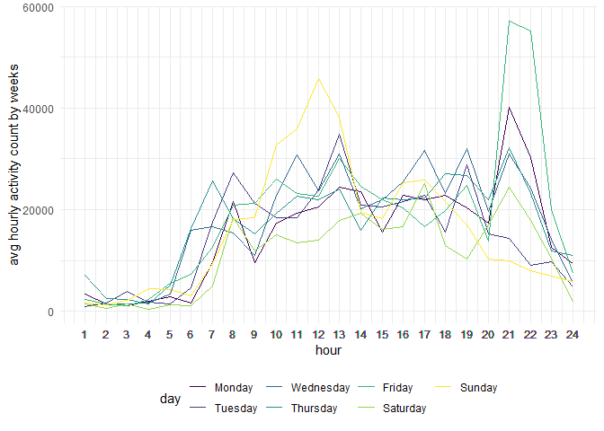
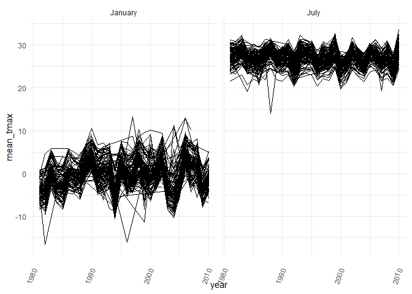

p8105\_hw3\_ps3194
================
Pangsibo Shen
10/9/2020

## Problem 1

``` r
data("instacart")
```

###### how many aisles, and which are most items from?

``` r
instacart %>%
  count(aisle) %>%
  arrange(desc(n))
```

    ## # A tibble: 134 x 2
    ##    aisle                              n
    ##    <chr>                          <int>
    ##  1 fresh vegetables              150609
    ##  2 fresh fruits                  150473
    ##  3 packaged vegetables fruits     78493
    ##  4 yogurt                         55240
    ##  5 packaged cheese                41699
    ##  6 water seltzer sparkling water  36617
    ##  7 milk                           32644
    ##  8 chips pretzels                 31269
    ##  9 soy lactosefree                26240
    ## 10 bread                          23635
    ## # ... with 124 more rows

###### Let’s make a plot

``` r
instacart %>%
  count(aisle) %>%
  filter(n > 10000) %>%
  mutate(
    aisle = factor(aisle),
    aisle = fct_reorder(aisle, n)
  ) %>%
  ggplot(aes(x = aisle, y = n)) +
  geom_point() +
  theme(axis.text.x = element_text(angle = 90, vjust = 0.5, hjust = 1))
```

<!-- -->
\#\#\#\#\#\# Let’s make a table\!

``` r
instacart %>%
  filter(aisle %in% c("baking ingredients","dog food care", "packaged vegetables fruits")) %>%
  group_by(aisle) %>%
  count(product_name) %>%
  mutate(rank = min_rank(desc(n))) %>%
  filter(rank < 4) %>%
  arrange(aisle, rank) %>%
  knitr::kable()
```

| aisle                      | product\_name                                 |    n | rank |
| :------------------------- | :-------------------------------------------- | ---: | ---: |
| baking ingredients         | Light Brown Sugar                             |  499 |    1 |
| baking ingredients         | Pure Baking Soda                              |  387 |    2 |
| baking ingredients         | Cane Sugar                                    |  336 |    3 |
| dog food care              | Snack Sticks Chicken & Rice Recipe Dog Treats |   30 |    1 |
| dog food care              | Organix Chicken & Brown Rice Recipe           |   28 |    2 |
| dog food care              | Small Dog Biscuits                            |   26 |    3 |
| packaged vegetables fruits | Organic Baby Spinach                          | 9784 |    1 |
| packaged vegetables fruits | Organic Raspberries                           | 5546 |    2 |
| packaged vegetables fruits | Organic Blueberries                           | 4966 |    3 |

###### Apples vs ice cream.

``` r
instacart %>%
  filter(product_name %in% c("Pink Lady Apples", "Coffee Ice Cream")) %>%
  group_by(product_name, order_dow) %>%
  summarise(mean_hour = mean(order_hour_of_day)) %>%
  pivot_wider(
    names_from = order_dow,
    values_from = mean_hour
  )
```

    ## `summarise()` regrouping output by 'product_name' (override with `.groups` argument)

    ## # A tibble: 2 x 8
    ## # Groups:   product_name [2]
    ##   product_name       `0`   `1`   `2`   `3`   `4`   `5`   `6`
    ##   <chr>            <dbl> <dbl> <dbl> <dbl> <dbl> <dbl> <dbl>
    ## 1 Coffee Ice Cream  13.8  14.3  15.4  15.3  15.2  12.3  13.8
    ## 2 Pink Lady Apples  13.4  11.4  11.7  14.2  11.6  12.8  11.9

## Problem 2

###### load and tidy the data

``` r
accel = read_csv("./data/accel_data.csv") %>%
  janitor::clean_names() %>%
  pivot_longer(
    activity_1:activity_1440,
    names_to = "minute",
    names_prefix = "activity_",
    values_to = "activity_count"
  ) %>%
  transform(
    minute = as.numeric(minute),
    #day = as_factor(day),
    week = as.factor(week)
  ) %>%
  mutate(weekday = case_when(
    day %in% c("Monday","Tuesday","Wednesday","Thursday","Friday") ~ "weekday",
    day %in% c("Saturday","Sunday") ~ "weekend")
  ) %>%
  transform(
    weekday = as.factor(weekday)
  )
```

    ## Parsed with column specification:
    ## cols(
    ##   .default = col_double(),
    ##   day = col_character()
    ## )

    ## See spec(...) for full column specifications.

``` r
head(accel)
```

    ##   week day_id    day minute activity_count weekday
    ## 1    1      1 Friday      1       88.37778 weekday
    ## 2    1      1 Friday      2       82.24444 weekday
    ## 3    1      1 Friday      3       64.44444 weekday
    ## 4    1      1 Friday      4       70.04444 weekday
    ## 5    1      1 Friday      5       75.04444 weekday
    ## 6    1      1 Friday      6       66.26667 weekday

The resulting dataset has 6 variables: week, day\_id, day, minute,
activity\_count and weekday. The weekday variable has two levels:
weekday and weekend. There are 50400 observations from the dataset.

###### relevel the day variable to chronological order

``` r
accel$day = factor(accel$day, c("Monday","Tuesday","Wednesday","Thursday","Friday","Saturday","Sunday"))
```

###### create a table showing the sum count for each day

``` r
accel %>%
  group_by(week, day_id, day) %>%
  summarise(
    sum_count = sum(activity_count)
  ) %>%
  arrange(week,day) %>%
  knitr::kable(align = 'c')
```

    ## `summarise()` regrouping output by 'week', 'day_id' (override with `.groups` argument)

| week | day\_id |    day    | sum\_count |
| :--: | :-----: | :-------: | :--------: |
|  1   |    2    |  Monday   |  78828.07  |
|  1   |    6    |  Tuesday  | 307094.24  |
|  1   |    7    | Wednesday | 340115.01  |
|  1   |    5    | Thursday  | 355923.64  |
|  1   |    1    |  Friday   | 480542.62  |
|  1   |    3    | Saturday  | 376254.00  |
|  1   |    4    |  Sunday   | 631105.00  |
|  2   |    9    |  Monday   | 295431.00  |
|  2   |   13    |  Tuesday  | 423245.00  |
|  2   |   14    | Wednesday | 440962.00  |
|  2   |   12    | Thursday  | 474048.00  |
|  2   |    8    |  Friday   | 568839.00  |
|  2   |   10    | Saturday  | 607175.00  |
|  2   |   11    |  Sunday   | 422018.00  |
|  3   |   16    |  Monday   | 685910.00  |
|  3   |   20    |  Tuesday  | 381507.00  |
|  3   |   21    | Wednesday | 468869.00  |
|  3   |   19    | Thursday  | 371230.00  |
|  3   |   15    |  Friday   | 467420.00  |
|  3   |   17    | Saturday  | 382928.00  |
|  3   |   18    |  Sunday   | 467052.00  |
|  4   |   23    |  Monday   | 409450.00  |
|  4   |   27    |  Tuesday  | 319568.00  |
|  4   |   28    | Wednesday | 434460.00  |
|  4   |   26    | Thursday  | 340291.00  |
|  4   |   22    |  Friday   | 154049.00  |
|  4   |   24    | Saturday  |  1440.00   |
|  4   |   25    |  Sunday   | 260617.00  |
|  5   |   30    |  Monday   | 389080.00  |
|  5   |   34    |  Tuesday  | 367824.00  |
|  5   |   35    | Wednesday | 445366.00  |
|  5   |   33    | Thursday  | 549658.00  |
|  5   |   29    |  Friday   | 620860.00  |
|  5   |   31    | Saturday  |  1440.00   |
|  5   |   32    |  Sunday   | 138421.00  |

For the first weeks, the patient’s daily total activity counts generally
had increased from Monday to Sunday.For week 4, the patient’s daily
total activity counts had decreased from Monday to Saturday. For week 5,
the patient’s daily total activity counts had increased from Monday to
Friday.

##### wrangling the date for the plot

``` r
accel = accel %>%
  mutate(hour = case_when(
    minute %in% 1:60 ~ 1,
    minute %in% 61:120 ~ 2,
    minute %in% 121:180 ~ 3,
    minute %in% 181:240 ~ 4,
    minute %in% 241:300 ~ 5,
    minute %in% 301:360 ~ 6,
    minute %in% 361:420 ~ 7,
    minute %in% 421:480 ~ 8,
    minute %in% 481:540 ~ 9,
    minute %in% 541:600 ~ 10,
    minute %in% 601:660 ~ 11,
    minute %in% 661:720 ~ 12,
    minute %in% 721:800 ~ 13,
    minute %in% 801:860 ~ 14,
    minute %in% 861:920 ~ 15,
    minute %in% 921:980 ~ 16,
    minute %in% 981:1040 ~ 17,
    minute %in% 1041:1100 ~ 18,
    minute %in% 1101:1160 ~ 19,
    minute %in% 1161:1200 ~ 20,
    minute %in% 1201:1260 ~ 21,
    minute %in% 1261:1320 ~ 22,
    minute %in% 1321:1380 ~ 23,
    minute %in% 1381:1440 ~ 24,
    )) %>%
  group_by(week, day_id, day, hour) %>%
  summarise(
    hour_count = sum(activity_count)
  )
```

    ## `summarise()` regrouping output by 'week', 'day_id', 'day' (override with `.groups` argument)

###### plot showing 24 hour activity

``` r
accel %>%
  group_by(day, hour) %>%
  summarise(avg_hour_count = mean(hour_count)) %>%
  ggplot(aes(x = hour, y = avg_hour_count, color = day)) +
  geom_line(alpha = 10) +
  scale_x_continuous(breaks = accel$hour) + 
  ylab("avg hourly activity count by weeks") +
  guides(fill = guide_legend(title = "Week"))
```

    ## `summarise()` regrouping output by 'day' (override with `.groups` argument)

<!-- -->
This is a graph showing the 5 weeks average 24-hour activity count for
each day in the week. From the graph, we noticed that the patient
started to become active around 7 am (the patient wakes up). The
activity count peaks around 13 pm and 21 pm and the peaks might be
explained by exercising activities such as walking after lunch and
before bed.

## Problem 3

###### load dataset

``` r
data("ny_noaa")
```

###### data cleaning and separate the date

``` r
ny_noaa_tidy = ny_noaa %>%
  na.omit() %>%
  separate(date,
           c("year","month","day"),
           sep = "-") %>%
  transform(
    tmax = as.numeric(tmax),
    tmin = as.numeric(tmin),
    snow = as.character(snow)
  ) %>%
  mutate(
   prcp = prcp/10,
   tmax = tmax/10,
   tmin = tmin/10
  )

head(ny_noaa_tidy)
```

    ##            id year month day prcp snow snwd  tmax  tmin
    ## 1 USC00300023 1981    01  03    0    0    0 -12.2 -20.6
    ## 2 USC00300023 1981    01  05    0    0    0  -5.6 -17.8
    ## 3 USC00300023 1981    01  12    0    0    0 -12.2 -30.6
    ## 4 USC00300023 1981    01  13    0    0    0  -6.7 -28.9
    ## 5 USC00300023 1981    01  15    0    0    0  -5.0 -10.6
    ## 6 USC00300023 1981    01  17    0    0    0  -1.1 -15.0

###### the most commonly observed values for snowfall

``` r
ny_noaa_tidy %>%
  count(snow) %>%
  arrange(desc(n)) %>%
  head()
```

    ##   snow       n
    ## 1    0 1112758
    ## 2   25   15809
    ## 3   13   12460
    ## 4   51    9252
    ## 5    5    5669
    ## 6    8    5380

Other than days without snow (snowfall is 0), the most commonly observed
value for snowfall is 25 mm.

``` r
ny_noaa_tidy %>%
  filter(month %in% c("01","07")) %>%
  transform(year = as.numeric(year),
            id = as.factor(id)) %>%
  mutate(month = recode(month, "01" = "January", "07" = "July")) %>%
  group_by(id, year, month) %>%
  summarise(mean_tmax = mean(tmax)) %>%
  ggplot(aes(x = year, y = mean_tmax, group =id)) +
  geom_line() +
  theme(axis.text.x = element_text(angle = 70, vjust = 0.5, hjust = 1)) +
  facet_grid(cols = vars(month))
```

    ## `summarise()` regrouping output by 'id', 'year' (override with `.groups` argument)

<!-- -->
