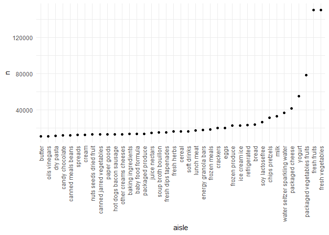
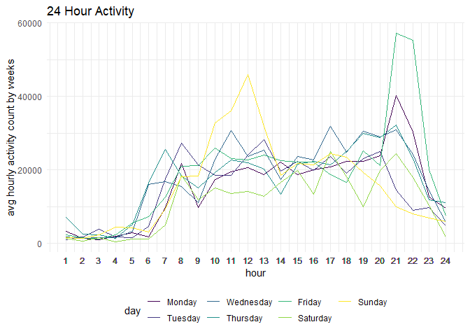
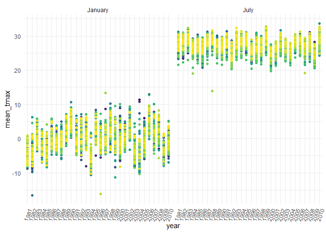
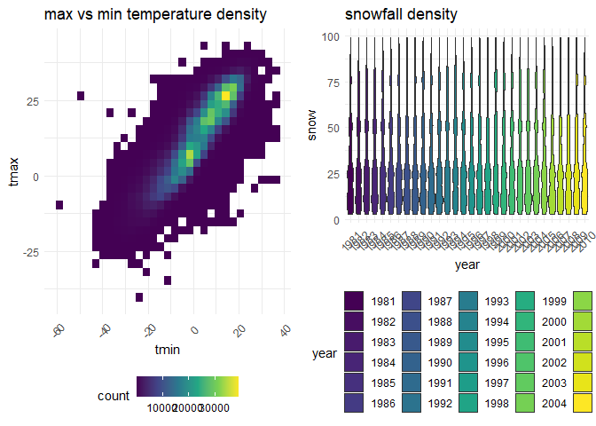

## Problem 1


```r
data("instacart")
```

###### how many aisles, and which are most items from?


```r
instacart %>%
  count(aisle) %>%
  arrange(desc(n))
```

```
## # A tibble: 134 x 2
##    aisle                              n
##    <chr>                          <int>
##  1 fresh vegetables              150609
##  2 fresh fruits                  150473
##  3 packaged vegetables fruits     78493
##  4 yogurt                         55240
##  5 packaged cheese                41699
##  6 water seltzer sparkling water  36617
##  7 milk                           32644
##  8 chips pretzels                 31269
##  9 soy lactosefree                26240
## 10 bread                          23635
## # ... with 124 more rows
```

There are 134 aisles, the the fresh vegetables aisle is the most items from. 

###### Let's make a plot


```r
instacart %>%
  count(aisle) %>%
  filter(n > 10000) %>%
  mutate(
    aisle = factor(aisle),
    aisle = fct_reorder(aisle, n)
  ) %>%
  ggplot(aes(x = aisle, y = n)) +
  geom_point() +
  theme(axis.text.x = element_text(angle = 90, vjust = 0.5, hjust = 1))
```

<!-- -->
###### Let's make a table!

```r
instacart %>%
  filter(aisle %in% c("baking ingredients","dog food care", "packaged vegetables fruits")) %>%
  group_by(aisle) %>%
  count(product_name) %>%
  mutate(rank = min_rank(desc(n))) %>%
  filter(rank < 4) %>%
  arrange(aisle, rank) %>%
  knitr::kable()
```


|aisle                      |product_name                                  |    n| rank|
|:--------------------------|:---------------------------------------------|----:|----:|
|baking ingredients         |Light Brown Sugar                             |  499|    1|
|baking ingredients         |Pure Baking Soda                              |  387|    2|
|baking ingredients         |Cane Sugar                                    |  336|    3|
|dog food care              |Snack Sticks Chicken & Rice Recipe Dog Treats |   30|    1|
|dog food care              |Organix Chicken & Brown Rice Recipe           |   28|    2|
|dog food care              |Small Dog Biscuits                            |   26|    3|
|packaged vegetables fruits |Organic Baby Spinach                          | 9784|    1|
|packaged vegetables fruits |Organic Raspberries                           | 5546|    2|
|packaged vegetables fruits |Organic Blueberries                           | 4966|    3|

###### Apples vs ice cream.


```r
instacart %>%
  filter(product_name %in% c("Pink Lady Apples", "Coffee Ice Cream")) %>%
  group_by(product_name, order_dow) %>%
  summarise(mean_hour = mean(order_hour_of_day)) %>%
  pivot_wider(
    names_from = order_dow,
    values_from = mean_hour
  )
```

```
## `summarise()` regrouping output by 'product_name' (override with `.groups` argument)
```

```
## # A tibble: 2 x 8
## # Groups:   product_name [2]
##   product_name       `0`   `1`   `2`   `3`   `4`   `5`   `6`
##   <chr>            <dbl> <dbl> <dbl> <dbl> <dbl> <dbl> <dbl>
## 1 Coffee Ice Cream  13.8  14.3  15.4  15.3  15.2  12.3  13.8
## 2 Pink Lady Apples  13.4  11.4  11.7  14.2  11.6  12.8  11.9
```

## Problem 2

###### load and tidy the data

```r
accel = read_csv("./data/accel_data.csv") %>%
  janitor::clean_names() %>%
  pivot_longer(
    activity_1:activity_1440,
    names_to = "minute",
    names_prefix = "activity_",
    values_to = "activity_count"
  ) %>%
  transform(
    minute = as.numeric(minute),
    #day = as_factor(day),
    week = as.factor(week)
  ) %>%
  mutate(weekday = case_when(
    day %in% c("Monday","Tuesday","Wednesday","Thursday","Friday") ~ "weekday",
    day %in% c("Saturday","Sunday") ~ "weekend")
  ) %>%
  transform(
    weekday = as.factor(weekday)
  )
```

```
## Parsed with column specification:
## cols(
##   .default = col_double(),
##   day = col_character()
## )
```

```
## See spec(...) for full column specifications.
```

```r
head(accel)
```

```
##   week day_id    day minute activity_count weekday
## 1    1      1 Friday      1       88.37778 weekday
## 2    1      1 Friday      2       82.24444 weekday
## 3    1      1 Friday      3       64.44444 weekday
## 4    1      1 Friday      4       70.04444 weekday
## 5    1      1 Friday      5       75.04444 weekday
## 6    1      1 Friday      6       66.26667 weekday
```

The resulting dataset has 6 variables: week, day_id, day, minute, activity_count and weekday. The weekday variable has two levels: weekday and weekend. There are 50400 observations from the dataset.

###### relevel the day variable to chronological order

```r
accel$day = factor(accel$day, c("Monday","Tuesday","Wednesday","Thursday","Friday","Saturday","Sunday"))
```

###### create a table showing the sum count for each day

```r
accel %>%
  group_by(week, day_id, day) %>%
  summarise(
    sum_count = sum(activity_count)
  ) %>%
  arrange(week,day) %>%
  knitr::kable(align = 'c')
```

```
## `summarise()` regrouping output by 'week', 'day_id' (override with `.groups` argument)
```


| week | day_id |    day    | sum_count |
|:----:|:------:|:---------:|:---------:|
|  1   |   2    |  Monday   | 78828.07  |
|  1   |   6    |  Tuesday  | 307094.24 |
|  1   |   7    | Wednesday | 340115.01 |
|  1   |   5    | Thursday  | 355923.64 |
|  1   |   1    |  Friday   | 480542.62 |
|  1   |   3    | Saturday  | 376254.00 |
|  1   |   4    |  Sunday   | 631105.00 |
|  2   |   9    |  Monday   | 295431.00 |
|  2   |   13   |  Tuesday  | 423245.00 |
|  2   |   14   | Wednesday | 440962.00 |
|  2   |   12   | Thursday  | 474048.00 |
|  2   |   8    |  Friday   | 568839.00 |
|  2   |   10   | Saturday  | 607175.00 |
|  2   |   11   |  Sunday   | 422018.00 |
|  3   |   16   |  Monday   | 685910.00 |
|  3   |   20   |  Tuesday  | 381507.00 |
|  3   |   21   | Wednesday | 468869.00 |
|  3   |   19   | Thursday  | 371230.00 |
|  3   |   15   |  Friday   | 467420.00 |
|  3   |   17   | Saturday  | 382928.00 |
|  3   |   18   |  Sunday   | 467052.00 |
|  4   |   23   |  Monday   | 409450.00 |
|  4   |   27   |  Tuesday  | 319568.00 |
|  4   |   28   | Wednesday | 434460.00 |
|  4   |   26   | Thursday  | 340291.00 |
|  4   |   22   |  Friday   | 154049.00 |
|  4   |   24   | Saturday  |  1440.00  |
|  4   |   25   |  Sunday   | 260617.00 |
|  5   |   30   |  Monday   | 389080.00 |
|  5   |   34   |  Tuesday  | 367824.00 |
|  5   |   35   | Wednesday | 445366.00 |
|  5   |   33   | Thursday  | 549658.00 |
|  5   |   29   |  Friday   | 620860.00 |
|  5   |   31   | Saturday  |  1440.00  |
|  5   |   32   |  Sunday   | 138421.00 |
For the first weeks, the patient's daily total activity counts generally had increased from Monday to Sunday.For week 4, the patient's daily total activity counts had decreased from Monday to Saturday. For week 5, the patient's daily total activity counts had increased from Monday to Friday.

##### wrangling the date for the plot

```r
accel = accel %>%
  mutate(hour = case_when(
    minute %in% 1:60 ~ 1,
    minute %in% 61:120 ~ 2,
    minute %in% 121:180 ~ 3,
    minute %in% 181:240 ~ 4,
    minute %in% 241:300 ~ 5,
    minute %in% 301:360 ~ 6,
    minute %in% 361:420 ~ 7,
    minute %in% 421:480 ~ 8,
    minute %in% 481:540 ~ 9,
    minute %in% 541:600 ~ 10,
    minute %in% 601:660 ~ 11,
    minute %in% 661:720 ~ 12,
    minute %in% 721:780 ~ 13,
    minute %in% 781:840 ~ 14,
    minute %in% 841:900 ~ 15,
    minute %in% 901:960 ~ 16,
    minute %in% 961:1020 ~ 17,
    minute %in% 1021:1080 ~ 18,
    minute %in% 1081:1140 ~ 19,
    minute %in% 1141:1200 ~ 20,
    minute %in% 1201:1260 ~ 21,
    minute %in% 1261:1320 ~ 22,
    minute %in% 1321:1380 ~ 23,
    minute %in% 1381:1440 ~ 24,
    )) %>%
  group_by(week, day_id, day, hour) %>%
  summarise(
    hour_count = sum(activity_count)
  )
```

```
## `summarise()` regrouping output by 'week', 'day_id', 'day' (override with `.groups` argument)
```
###### plot showing 24 hour activity

```r
accel %>%
  group_by(day, hour) %>%
  summarise(avg_hour_count = mean(hour_count)) %>%
  ggplot(aes(x = hour, y = avg_hour_count, color = day)) +
  geom_line(alpha = 10) +
  scale_x_continuous(breaks = accel$hour) + 
  ylab("avg hourly activity count by weeks") +
  ggtitle("24 Hour Activity") +
  guides(fill = guide_legend(title = "Week"))
```

```
## `summarise()` regrouping output by 'day' (override with `.groups` argument)
```

<!-- -->
This is a graph showing the 5 weeks average 24-hour activity count for each day in the week. From the graph, we noticed that the patient started to become active around 7 am (the patient wakes up). The activity count peaks around 13 pm and 21 pm and the peaks might be explained by exercising activities such as walking after lunch and before bed.   


## Problem 3

###### load dataset

```r
data("ny_noaa")
```

###### data cleaning and separate the date

```r
ny_noaa_tidy = ny_noaa %>%
  na.omit() %>%
  separate(date,
           c("year","month","day"),
           sep = "-") %>%
  transform(
    tmax = as.numeric(tmax),
    tmin = as.numeric(tmin),
    snow = as.character(snow)
  ) %>%
  mutate(
   prcp = prcp/10,
   tmax = tmax/10,
   tmin = tmin/10
  )

head(ny_noaa_tidy)
```

```
##            id year month day prcp snow snwd  tmax  tmin
## 1 USC00300023 1981    01  03    0    0    0 -12.2 -20.6
## 2 USC00300023 1981    01  05    0    0    0  -5.6 -17.8
## 3 USC00300023 1981    01  12    0    0    0 -12.2 -30.6
## 4 USC00300023 1981    01  13    0    0    0  -6.7 -28.9
## 5 USC00300023 1981    01  15    0    0    0  -5.0 -10.6
## 6 USC00300023 1981    01  17    0    0    0  -1.1 -15.0
```
######  the most commonly observed values for snowfall

```r
ny_noaa_tidy %>%
  count(snow) %>%
  arrange(desc(n)) %>%
  head()
```

```
##   snow       n
## 1    0 1112758
## 2   25   15809
## 3   13   12460
## 4   51    9252
## 5    5    5669
## 6    8    5380
```
Other than days without snow (snowfall is 0), the most commonly observed value for snowfall is 25 mm.
 

```r
ny_noaa_tidy_fig = ny_noaa_tidy %>%
  filter(month %in% c("01","07")) %>%
  mutate(month = recode(month, "01" = "January", "07" = "July")) %>%
  group_by(id, year, month) %>%
  summarise(mean_tmax = mean(tmax)) %>%
  ggplot(aes(x = year, y = mean_tmax, group = id)) +
  geom_point(aes(color = id), show.legend = F) +
  theme(axis.text.x = element_text(angle = 70, vjust = 0.5, hjust = 0.5)) +
  theme(axis.title.x = element_text(margin = margin(0,0,0,0))) +
  facet_grid(cols = vars(month))
```

```
## `summarise()` regrouping output by 'id', 'year' (override with `.groups` argument)
```

```r
ny_noaa_tidy_fig
```

<!-- -->
From the graph, we can see the average max temperature for those weather stations across years. The average max temperature in July is significantly higher than that in January. Also, the variation for average max temperature in January is larger than that in July. I don't see a particular trend that indicates global warming from the figure. On the other hand, there are too many lines overlaid with each other due to the large amount of Weather station ID. Hence ggplot is not very informative to show the which particular stations having extreme temperatures than others across years (outliers). In order to address this problem, a ggplotly() is used. 


```r
ggplotly(
  ny_noaa_tidy %>%
  filter(month %in% c("01","07")) %>%
  mutate(month = recode(month, "01" = "January", "07" = "July")) %>%
  group_by(id, year, month) %>%
  summarise(mean_tmax = mean(tmax)) %>%
  ggplot(aes(x = year, y = mean_tmax, group = id)) +
  geom_point(aes(color = id)) +
  geom_path(aes(color = id), alpha = 0.2) +
  theme(axis.text.x = element_text(angle = 50, vjust = 0.5, hjust = 1)) +
  theme(axis.title.x = element_text(margin = margin(10,0,0,0))) +
  facet_grid(cols = vars(month))
)
```

```
## `summarise()` regrouping output by 'id', 'year' (override with `.groups` argument)
```

```
## Warning: `group_by_()` is deprecated as of dplyr 0.7.0.
## Please use `group_by()` instead.
## See vignette('programming') for more help
## This warning is displayed once every 8 hours.
## Call `lifecycle::last_warnings()` to see where this warning was generated.
```

<!--html_preserve--><div id="htmlwidget-fd8a1d8922f0a9b4d061" style="width:672px;height:480px;" class="plotly html-widget"></div>
<script type="application/json" data-for="htmlwidget-fd8a1d8922f0a9b4d061">{"x":{"data":[{"x":[1,3,5,10,17,18,19,20,21,22,23,24,25,26,27,28,29,30],"y":[-2.11333333333333,1.07586206896552,-0.155555555555556,4.92258064516129,0.779166666666667,2.87142857142857,0.480645161290323,-0.907407407407407,0.572,4.52142857142857,-2.85161290322581,-3.26129032258065,-1.04137931034483,6.39,2.88846153846154,0.8625,-3.04827586206897,0.172413793103448],"text":["id: USC00300023<br />year: 1981<br />mean_tmax: -2.113333e+00<br />id: USC00300023","id: USC00300023<br />year: 1983<br />mean_tmax:  1.075862e+00<br />id: USC00300023","id: USC00300023<br />year: 1985<br />mean_tmax: -1.555556e-01<br />id: USC00300023","id: USC00300023<br />year: 1990<br />mean_tmax:  4.922581e+00<br />id: USC00300023","id: USC00300023<br />year: 1997<br />mean_tmax:  7.791667e-01<br />id: USC00300023","id: USC00300023<br />year: 1998<br />mean_tmax:  2.871429e+00<br />id: USC00300023","id: USC00300023<br />year: 1999<br />mean_tmax:  4.806452e-01<br />id: USC00300023","id: USC00300023<br />year: 2000<br />mean_tmax: -9.074074e-01<br />id: USC00300023","id: USC00300023<br />year: 2001<br />mean_tmax:  5.720000e-01<br />id: USC00300023","id: USC00300023<br />year: 2002<br />mean_tmax:  4.521429e+00<br />id: USC00300023","id: USC00300023<br />year: 2003<br />mean_tmax: -2.851613e+00<br />id: USC00300023","id: USC00300023<br />year: 2004<br />mean_tmax: -3.261290e+00<br />id: USC00300023","id: USC00300023<br />year: 2005<br />mean_tmax: -1.041379e+00<br />id: USC00300023","id: USC00300023<br />year: 2006<br />mean_tmax:  6.390000e+00<br />id: USC00300023","id: USC00300023<br />year: 2007<br />mean_tmax:  2.888462e+00<br />id: USC00300023","id: USC00300023<br />year: 2008<br />mean_tmax:  8.625000e-01<br />id: USC00300023","id: USC00300023<br />year: 2009<br />mean_tmax: -3.048276e+00<br />id: USC00300023","id: USC00300023<br />year: 2010<br />mean_tmax:  1.724138e-01<br />id: USC00300023"],"type":"scatter","mode":"markers+lines","marker":{"autocolorscale":false,"color":"rgba(68,1,84,1)","opacity":1,"size":5.66929133858268,"symbol":"circle","line":{"width":1.88976377952756,"color":"rgba(68,1,84,1)"}},"hoveron":"points","name":"USC00300023","legendgroup":"USC00300023","showlegend":true,"xaxis":"x","yaxis":"y","hoverinfo":"text","line":{"width":1.88976377952756,"color":"rgba(68,1,84,0.2)","dash":"solid"},"frame":null},{"x":[1,3,4,9,10,11,17,18,19,20,21,22,23,24,25,27,28,29,30],"y":[28.4888888888889,29.8387096774194,27.1774193548387,27.1322580645161,27.0354838709677,28.4064516129032,26.6354838709677,26.6967741935484,29.5967741935484,24.8677419354839,26.3741935483871,28.3903225806452,26.52,25.4,29.0645161290323,27.7064516129032,29.0733333333333,24.3206896551724,30.1857142857143],"text":["id: USC00300023<br />year: 1981<br />mean_tmax:  2.848889e+01<br />id: USC00300023","id: USC00300023<br />year: 1983<br />mean_tmax:  2.983871e+01<br />id: USC00300023","id: USC00300023<br />year: 1984<br />mean_tmax:  2.717742e+01<br />id: USC00300023","id: USC00300023<br />year: 1989<br />mean_tmax:  2.713226e+01<br />id: USC00300023","id: USC00300023<br />year: 1990<br />mean_tmax:  2.703548e+01<br />id: USC00300023","id: USC00300023<br />year: 1991<br />mean_tmax:  2.840645e+01<br />id: USC00300023","id: USC00300023<br />year: 1997<br />mean_tmax:  2.663548e+01<br />id: USC00300023","id: USC00300023<br />year: 1998<br />mean_tmax:  2.669677e+01<br />id: USC00300023","id: USC00300023<br />year: 1999<br />mean_tmax:  2.959677e+01<br />id: USC00300023","id: USC00300023<br />year: 2000<br />mean_tmax:  2.486774e+01<br />id: USC00300023","id: USC00300023<br />year: 2001<br />mean_tmax:  2.637419e+01<br />id: USC00300023","id: USC00300023<br />year: 2002<br />mean_tmax:  2.839032e+01<br />id: USC00300023","id: USC00300023<br />year: 2003<br />mean_tmax:  2.652000e+01<br />id: USC00300023","id: USC00300023<br />year: 2004<br />mean_tmax:  2.540000e+01<br />id: USC00300023","id: USC00300023<br />year: 2005<br />mean_tmax:  2.906452e+01<br />id: USC00300023","id: USC00300023<br />year: 2007<br />mean_tmax:  2.770645e+01<br />id: USC00300023","id: USC00300023<br />year: 2008<br />mean_tmax:  2.907333e+01<br />id: USC00300023","id: USC00300023<br />year: 2009<br />mean_tmax:  2.432069e+01<br />id: USC00300023","id: USC00300023<br />year: 2010<br />mean_tmax:  3.018571e+01<br />id: USC00300023"],"type":"scatter","mode":"markers+lines","marker":{"autocolorscale":false,"color":"rgba(68,1,84,1)","opacity":1,"size":5.66929133858268,"symbol":"circle","line":{"width":1.88976377952756,"color":"rgba(68,1,84,1)"}},"hoveron":"points","name":"USC00300023","legendgroup":"USC00300023","showlegend":false,"xaxis":"x2","yaxis":"y","hoverinfo":"text","line":{"width":1.88976377952756,"color":"rgba(68,1,84,0.2)","dash":"solid"},"frame":null},{"x":[6,7,8],"y":[25.2833333333333,27.3483870967742,29.2366666666667],"text":["id: USC00300028<br />year: 1986<br />mean_tmax:  2.528333e+01<br />id: USC00300028","id: USC00300028<br />year: 1987<br />mean_tmax:  2.734839e+01<br />id: USC00300028","id: USC00300028<br />year: 1988<br />mean_tmax:  2.923667e+01<br />id: USC00300028"],"type":"scatter","mode":"markers+lines","marker":{"autocolorscale":false,"color":"rgba(68,2,86,1)","opacity":1,"size":5.66929133858268,"symbol":"circle","line":{"width":1.88976377952756,"color":"rgba(68,2,86,1)"}},"hoveron":"points","name":"USC00300028","legendgroup":"USC00300028","showlegend":true,"xaxis":"x2","yaxis":"y","hoverinfo":"text","line":{"width":1.88976377952756,"color":"rgba(68,2,86,0.2)","dash":"solid"},"frame":null},{"x":[1,2,3,4,5,6,7,8,9,10,11,12,13,15,16,17,18,19,20,21,22,23,24,25,26,27,28,29,30],"y":[-4.28387096774194,-3.52592592592593,1.18064516129032,-3.10588235294118,-1.06190476190476,0.0700000000000001,0.642857142857143,0.22962962962963,4.2962962962963,4.96206896551724,-0.271428571428571,2.3,1.27857142857143,2.26538461538462,-0.192307692307692,2.26923076923077,3.88846153846154,-0.25,2.52857142857143,0.488461538461539,3.89615384615385,-3.71923076923077,-2.53125,-0.834615384615385,6.10416666666667,3.50909090909091,3.41111111111111,-2.5,-1.41052631578947],"text":["id: USC00300055<br />year: 1981<br />mean_tmax: -4.283871e+00<br />id: USC00300055","id: USC00300055<br />year: 1982<br />mean_tmax: -3.525926e+00<br />id: USC00300055","id: USC00300055<br />year: 1983<br />mean_tmax:  1.180645e+00<br />id: USC00300055","id: USC00300055<br />year: 1984<br />mean_tmax: -3.105882e+00<br />id: USC00300055","id: USC00300055<br />year: 1985<br />mean_tmax: -1.061905e+00<br />id: USC00300055","id: USC00300055<br />year: 1986<br />mean_tmax:  7.000000e-02<br />id: USC00300055","id: USC00300055<br />year: 1987<br />mean_tmax:  6.428571e-01<br />id: USC00300055","id: USC00300055<br />year: 1988<br />mean_tmax:  2.296296e-01<br />id: USC00300055","id: USC00300055<br />year: 1989<br />mean_tmax:  4.296296e+00<br />id: USC00300055","id: USC00300055<br />year: 1990<br />mean_tmax:  4.962069e+00<br />id: USC00300055","id: USC00300055<br />year: 1991<br />mean_tmax: -2.714286e-01<br />id: USC00300055","id: USC00300055<br />year: 1992<br />mean_tmax:  2.300000e+00<br />id: USC00300055","id: USC00300055<br />year: 1993<br />mean_tmax:  1.278571e+00<br />id: USC00300055","id: USC00300055<br />year: 1995<br />mean_tmax:  2.265385e+00<br />id: USC00300055","id: USC00300055<br />year: 1996<br />mean_tmax: -1.923077e-01<br />id: USC00300055","id: USC00300055<br />year: 1997<br />mean_tmax:  2.269231e+00<br />id: USC00300055","id: USC00300055<br />year: 1998<br />mean_tmax:  3.888462e+00<br />id: USC00300055","id: USC00300055<br />year: 1999<br />mean_tmax: -2.500000e-01<br />id: USC00300055","id: USC00300055<br />year: 2000<br />mean_tmax:  2.528571e+00<br />id: USC00300055","id: USC00300055<br />year: 2001<br />mean_tmax:  4.884615e-01<br />id: USC00300055","id: USC00300055<br />year: 2002<br />mean_tmax:  3.896154e+00<br />id: USC00300055","id: USC00300055<br />year: 2003<br />mean_tmax: -3.719231e+00<br />id: USC00300055","id: USC00300055<br />year: 2004<br />mean_tmax: -2.531250e+00<br />id: USC00300055","id: USC00300055<br />year: 2005<br />mean_tmax: -8.346154e-01<br />id: USC00300055","id: USC00300055<br />year: 2006<br />mean_tmax:  6.104167e+00<br />id: USC00300055","id: USC00300055<br />year: 2007<br />mean_tmax:  3.509091e+00<br />id: USC00300055","id: USC00300055<br />year: 2008<br />mean_tmax:  3.411111e+00<br />id: USC00300055","id: USC00300055<br />year: 2009<br />mean_tmax: -2.500000e+00<br />id: USC00300055","id: USC00300055<br />year: 2010<br />mean_tmax: -1.410526e+00<br />id: USC00300055"],"type":"scatter","mode":"markers+lines","marker":{"autocolorscale":false,"color":"rgba(69,4,88,1)","opacity":1,"size":5.66929133858268,"symbol":"circle","line":{"width":1.88976377952756,"color":"rgba(69,4,88,1)"}},"hoveron":"points","name":"USC00300055","legendgroup":"USC00300055","showlegend":true,"xaxis":"x","yaxis":"y","hoverinfo":"text","line":{"width":1.88976377952756,"color":"rgba(69,4,88,0.2)","dash":"solid"},"frame":null},{"x":[1,2,3,4,5,6,7,8,9,10,11,12,13,14,15,16,17,18,19,20,21,22,23,24,25,26,27,28,29,30],"y":[27.7258064516129,28.6129032258065,30.5225806451613,27.7322580645161,27.9709677419355,27.7354838709677,29.2677419354839,27.5,28.4903225806452,27.3709677419355,28.8741935483871,23.158064516129,27.8129032258065,28.5612903225806,28.7258064516129,26.3064516129032,27.6193548387097,27.6903225806452,30.9870967741935,25.4516129032258,27.1838709677419,29.5516129032258,27.1129032258065,25.4483870967742,29.8741935483871,28.4258064516129,25.9645161290323,26.8096774193548,24.1032258064516,28],"text":["id: USC00300055<br />year: 1981<br />mean_tmax:  2.772581e+01<br />id: USC00300055","id: USC00300055<br />year: 1982<br />mean_tmax:  2.861290e+01<br />id: USC00300055","id: USC00300055<br />year: 1983<br />mean_tmax:  3.052258e+01<br />id: USC00300055","id: USC00300055<br />year: 1984<br />mean_tmax:  2.773226e+01<br />id: USC00300055","id: USC00300055<br />year: 1985<br />mean_tmax:  2.797097e+01<br />id: USC00300055","id: USC00300055<br />year: 1986<br />mean_tmax:  2.773548e+01<br />id: USC00300055","id: USC00300055<br />year: 1987<br />mean_tmax:  2.926774e+01<br />id: USC00300055","id: USC00300055<br />year: 1988<br />mean_tmax:  2.750000e+01<br />id: USC00300055","id: USC00300055<br />year: 1989<br />mean_tmax:  2.849032e+01<br />id: USC00300055","id: USC00300055<br />year: 1990<br />mean_tmax:  2.737097e+01<br />id: USC00300055","id: USC00300055<br />year: 1991<br />mean_tmax:  2.887419e+01<br />id: USC00300055","id: USC00300055<br />year: 1992<br />mean_tmax:  2.315806e+01<br />id: USC00300055","id: USC00300055<br />year: 1993<br />mean_tmax:  2.781290e+01<br />id: USC00300055","id: USC00300055<br />year: 1994<br />mean_tmax:  2.856129e+01<br />id: USC00300055","id: USC00300055<br />year: 1995<br />mean_tmax:  2.872581e+01<br />id: USC00300055","id: USC00300055<br />year: 1996<br />mean_tmax:  2.630645e+01<br />id: USC00300055","id: USC00300055<br />year: 1997<br />mean_tmax:  2.761935e+01<br />id: USC00300055","id: USC00300055<br />year: 1998<br />mean_tmax:  2.769032e+01<br />id: USC00300055","id: USC00300055<br />year: 1999<br />mean_tmax:  3.098710e+01<br />id: USC00300055","id: USC00300055<br />year: 2000<br />mean_tmax:  2.545161e+01<br />id: USC00300055","id: USC00300055<br />year: 2001<br />mean_tmax:  2.718387e+01<br />id: USC00300055","id: USC00300055<br />year: 2002<br />mean_tmax:  2.955161e+01<br />id: USC00300055","id: USC00300055<br />year: 2003<br />mean_tmax:  2.711290e+01<br />id: USC00300055","id: USC00300055<br />year: 2004<br />mean_tmax:  2.544839e+01<br />id: USC00300055","id: USC00300055<br />year: 2005<br />mean_tmax:  2.987419e+01<br />id: USC00300055","id: USC00300055<br />year: 2006<br />mean_tmax:  2.842581e+01<br />id: USC00300055","id: USC00300055<br />year: 2007<br />mean_tmax:  2.596452e+01<br />id: USC00300055","id: USC00300055<br />year: 2008<br />mean_tmax:  2.680968e+01<br />id: USC00300055","id: USC00300055<br />year: 2009<br />mean_tmax:  2.410323e+01<br />id: USC00300055","id: USC00300055<br />year: 2010<br />mean_tmax:  2.800000e+01<br />id: USC00300055"],"type":"scatter","mode":"markers+lines","marker":{"autocolorscale":false,"color":"rgba(69,4,88,1)","opacity":1,"size":5.66929133858268,"symbol":"circle","line":{"width":1.88976377952756,"color":"rgba(69,4,88,1)"}},"hoveron":"points","name":"USC00300055","legendgroup":"USC00300055","showlegend":false,"xaxis":"x2","yaxis":"y","hoverinfo":"text","line":{"width":1.88976377952756,"color":"rgba(69,4,88,0.2)","dash":"solid"},"frame":null},{"x":[6,9,12,18,19,20,22,26,29,30],"y":[0.888,1.09333333333333,1.67083333333333,4.9375,-0.172413793103448,6.40769230769231,3.77,12.9666666666667,-2.42222222222222,0.376666666666667],"text":["id: USC00300063<br />year: 1986<br />mean_tmax:  8.880000e-01<br />id: USC00300063","id: USC00300063<br />year: 1989<br />mean_tmax:  1.093333e+00<br />id: USC00300063","id: USC00300063<br />year: 1992<br />mean_tmax:  1.670833e+00<br />id: USC00300063","id: USC00300063<br />year: 1998<br />mean_tmax:  4.937500e+00<br />id: USC00300063","id: USC00300063<br />year: 1999<br />mean_tmax: -1.724138e-01<br />id: USC00300063","id: USC00300063<br />year: 2000<br />mean_tmax:  6.407692e+00<br />id: USC00300063","id: USC00300063<br />year: 2002<br />mean_tmax:  3.770000e+00<br />id: USC00300063","id: USC00300063<br />year: 2006<br />mean_tmax:  1.296667e+01<br />id: USC00300063","id: USC00300063<br />year: 2009<br />mean_tmax: -2.422222e+00<br />id: USC00300063","id: USC00300063<br />year: 2010<br />mean_tmax:  3.766667e-01<br />id: USC00300063"],"type":"scatter","mode":"markers+lines","marker":{"autocolorscale":false,"color":"rgba(70,6,90,1)","opacity":1,"size":5.66929133858268,"symbol":"circle","line":{"width":1.88976377952756,"color":"rgba(70,6,90,1)"}},"hoveron":"points","name":"USC00300063","legendgroup":"USC00300063","showlegend":true,"xaxis":"x","yaxis":"y","hoverinfo":"text","line":{"width":1.88976377952756,"color":"rgba(70,6,90,0.2)","dash":"solid"},"frame":null},{"x":[1,2,3,4,5,6,7,8,9,10,11,13,14,15,17,19,20,21,22,24,25,26,27,28,29,30],"y":[27.4903225806452,24.0677419354839,29.1516129032258,27.858064516129,28.4064516129032,26.6774193548387,25.89375,28.1,25.2266666666667,26.3387096774194,26.7838709677419,27.8451612903226,27.4692307692308,28.1225806451613,26.4677419354839,27.6347826086957,23.0451612903226,25.3967741935484,27.6903225806452,24.7322580645161,27.1,27.3064516129032,25.3838709677419,27.8032258064516,24.38,28.7666666666667],"text":["id: USC00300063<br />year: 1981<br />mean_tmax:  2.749032e+01<br />id: USC00300063","id: USC00300063<br />year: 1982<br />mean_tmax:  2.406774e+01<br />id: USC00300063","id: USC00300063<br />year: 1983<br />mean_tmax:  2.915161e+01<br />id: USC00300063","id: USC00300063<br />year: 1984<br />mean_tmax:  2.785806e+01<br />id: USC00300063","id: USC00300063<br />year: 1985<br />mean_tmax:  2.840645e+01<br />id: USC00300063","id: USC00300063<br />year: 1986<br />mean_tmax:  2.667742e+01<br />id: USC00300063","id: USC00300063<br />year: 1987<br />mean_tmax:  2.589375e+01<br />id: USC00300063","id: USC00300063<br />year: 1988<br />mean_tmax:  2.810000e+01<br />id: USC00300063","id: USC00300063<br />year: 1989<br />mean_tmax:  2.522667e+01<br />id: USC00300063","id: USC00300063<br />year: 1990<br />mean_tmax:  2.633871e+01<br />id: USC00300063","id: USC00300063<br />year: 1991<br />mean_tmax:  2.678387e+01<br />id: USC00300063","id: USC00300063<br />year: 1993<br />mean_tmax:  2.784516e+01<br />id: USC00300063","id: USC00300063<br />year: 1994<br />mean_tmax:  2.746923e+01<br />id: USC00300063","id: USC00300063<br />year: 1995<br />mean_tmax:  2.812258e+01<br />id: USC00300063","id: USC00300063<br />year: 1997<br />mean_tmax:  2.646774e+01<br />id: USC00300063","id: USC00300063<br />year: 1999<br />mean_tmax:  2.763478e+01<br />id: USC00300063","id: USC00300063<br />year: 2000<br />mean_tmax:  2.304516e+01<br />id: USC00300063","id: USC00300063<br />year: 2001<br />mean_tmax:  2.539677e+01<br />id: USC00300063","id: USC00300063<br />year: 2002<br />mean_tmax:  2.769032e+01<br />id: USC00300063","id: USC00300063<br />year: 2004<br />mean_tmax:  2.473226e+01<br />id: USC00300063","id: USC00300063<br />year: 2005<br />mean_tmax:  2.710000e+01<br />id: USC00300063","id: USC00300063<br />year: 2006<br />mean_tmax:  2.730645e+01<br />id: USC00300063","id: USC00300063<br />year: 2007<br />mean_tmax:  2.538387e+01<br />id: USC00300063","id: USC00300063<br />year: 2008<br />mean_tmax:  2.780323e+01<br />id: USC00300063","id: USC00300063<br />year: 2009<br />mean_tmax:  2.438000e+01<br />id: USC00300063","id: USC00300063<br />year: 2010<br />mean_tmax:  2.876667e+01<br />id: USC00300063"],"type":"scatter","mode":"markers+lines","marker":{"autocolorscale":false,"color":"rgba(70,6,90,1)","opacity":1,"size":5.66929133858268,"symbol":"circle","line":{"width":1.88976377952756,"color":"rgba(70,6,90,1)"}},"hoveron":"points","name":"USC00300063","legendgroup":"USC00300063","showlegend":false,"xaxis":"x2","yaxis":"y","hoverinfo":"text","line":{"width":1.88976377952756,"color":"rgba(70,6,90,0.2)","dash":"solid"},"frame":null},{"x":[1,2,3,4,5,6,7,9,10,11,13,20,23],"y":[-3.94516129032258,-4.46129032258064,-0.183870967741935,-2.61290322580645,-3.0741935483871,-0.196774193548387,-1.05806451612903,2.15,3.4375,0.409677419354839,1.57666666666667,1.3,-3.96],"text":["id: USC00300085<br />year: 1981<br />mean_tmax: -3.945161e+00<br />id: USC00300085","id: USC00300085<br />year: 1982<br />mean_tmax: -4.461290e+00<br />id: USC00300085","id: USC00300085<br />year: 1983<br />mean_tmax: -1.838710e-01<br />id: USC00300085","id: USC00300085<br />year: 1984<br />mean_tmax: -2.612903e+00<br />id: USC00300085","id: USC00300085<br />year: 1985<br />mean_tmax: -3.074194e+00<br />id: USC00300085","id: USC00300085<br />year: 1986<br />mean_tmax: -1.967742e-01<br />id: USC00300085","id: USC00300085<br />year: 1987<br />mean_tmax: -1.058065e+00<br />id: USC00300085","id: USC00300085<br />year: 1989<br />mean_tmax:  2.150000e+00<br />id: USC00300085","id: USC00300085<br />year: 1990<br />mean_tmax:  3.437500e+00<br />id: USC00300085","id: USC00300085<br />year: 1991<br />mean_tmax:  4.096774e-01<br />id: USC00300085","id: USC00300085<br />year: 1993<br />mean_tmax:  1.576667e+00<br />id: USC00300085","id: USC00300085<br />year: 2000<br />mean_tmax:  1.300000e+00<br />id: USC00300085","id: USC00300085<br />year: 2003<br />mean_tmax: -3.960000e+00<br />id: USC00300085"],"type":"scatter","mode":"markers+lines","marker":{"autocolorscale":false,"color":"rgba(70,8,92,1)","opacity":1,"size":5.66929133858268,"symbol":"circle","line":{"width":1.88976377952756,"color":"rgba(70,8,92,1)"}},"hoveron":"points","name":"USC00300085","legendgroup":"USC00300085","showlegend":true,"xaxis":"x","yaxis":"y","hoverinfo":"text","line":{"width":1.88976377952756,"color":"rgba(70,8,92,0.2)","dash":"solid"},"frame":null},{"x":[1,2,3,4,5,6,7,8,9,10,11,12,13,15,16,17,18,19,20,21,22,23,24,25,26,28,29],"y":[24.7096774193548,25.8096774193548,27.2064516129032,24.7290322580645,24.8387096774194,24.9935483870968,27.4064516129032,29.2064516129032,26.9387096774194,26.8870967741935,27.9741935483871,24.358064516129,28.6290322580645,28.4064516129032,25.8714285714286,24.8777777777778,26.4774193548387,29.3741935483871,25.8741935483871,25.8483870967742,28.0258064516129,25.8411764705882,25.0967741935484,29.0870967741935,26.9,26.9333333333333,24.2193548387097],"text":["id: USC00300085<br />year: 1981<br />mean_tmax:  2.470968e+01<br />id: USC00300085","id: USC00300085<br />year: 1982<br />mean_tmax:  2.580968e+01<br />id: USC00300085","id: USC00300085<br />year: 1983<br />mean_tmax:  2.720645e+01<br />id: USC00300085","id: USC00300085<br />year: 1984<br />mean_tmax:  2.472903e+01<br />id: USC00300085","id: USC00300085<br />year: 1985<br />mean_tmax:  2.483871e+01<br />id: USC00300085","id: USC00300085<br />year: 1986<br />mean_tmax:  2.499355e+01<br />id: USC00300085","id: USC00300085<br />year: 1987<br />mean_tmax:  2.740645e+01<br />id: USC00300085","id: USC00300085<br />year: 1988<br />mean_tmax:  2.920645e+01<br />id: USC00300085","id: USC00300085<br />year: 1989<br />mean_tmax:  2.693871e+01<br />id: USC00300085","id: USC00300085<br />year: 1990<br />mean_tmax:  2.688710e+01<br />id: USC00300085","id: USC00300085<br />year: 1991<br />mean_tmax:  2.797419e+01<br />id: USC00300085","id: USC00300085<br />year: 1992<br />mean_tmax:  2.435806e+01<br />id: USC00300085","id: USC00300085<br />year: 1993<br />mean_tmax:  2.862903e+01<br />id: USC00300085","id: USC00300085<br />year: 1995<br />mean_tmax:  2.840645e+01<br />id: USC00300085","id: USC00300085<br />year: 1996<br />mean_tmax:  2.587143e+01<br />id: USC00300085","id: USC00300085<br />year: 1997<br />mean_tmax:  2.487778e+01<br />id: USC00300085","id: USC00300085<br />year: 1998<br />mean_tmax:  2.647742e+01<br />id: USC00300085","id: USC00300085<br />year: 1999<br />mean_tmax:  2.937419e+01<br />id: USC00300085","id: USC00300085<br />year: 2000<br />mean_tmax:  2.587419e+01<br />id: USC00300085","id: USC00300085<br />year: 2001<br />mean_tmax:  2.584839e+01<br />id: USC00300085","id: USC00300085<br />year: 2002<br />mean_tmax:  2.802581e+01<br />id: USC00300085","id: USC00300085<br />year: 2003<br />mean_tmax:  2.584118e+01<br />id: USC00300085","id: USC00300085<br />year: 2004<br />mean_tmax:  2.509677e+01<br />id: USC00300085","id: USC00300085<br />year: 2005<br />mean_tmax:  2.908710e+01<br />id: USC00300085","id: USC00300085<br />year: 2006<br />mean_tmax:  2.690000e+01<br />id: USC00300085","id: USC00300085<br />year: 2008<br />mean_tmax:  2.693333e+01<br />id: USC00300085","id: USC00300085<br />year: 2009<br />mean_tmax:  2.421935e+01<br />id: USC00300085"],"type":"scatter","mode":"markers+lines","marker":{"autocolorscale":false,"color":"rgba(70,8,92,1)","opacity":1,"size":5.66929133858268,"symbol":"circle","line":{"width":1.88976377952756,"color":"rgba(70,8,92,1)"}},"hoveron":"points","name":"USC00300085","legendgroup":"USC00300085","showlegend":false,"xaxis":"x2","yaxis":"y","hoverinfo":"text","line":{"width":1.88976377952756,"color":"rgba(70,8,92,0.2)","dash":"solid"},"frame":null},{"x":[2,7,8,9,11,12,13,15,16,17,18,19,20,21,22,23,24,25,26,27,29,30],"y":[-1.2,-1.7,0.0956521739130434,2.25185185185185,0.352631578947368,2.465,1.425,2.86,-3.44615384615385,-1.47,1.87692307692308,-0.286206896551724,-1.03333333333333,-0.603571428571429,0.828571428571429,-4.68333333333333,-3.60333333333333,2.3,3.89565217391304,2.04642857142857,-3.93461538461538,-0.572727272727273],"text":["id: USC00300093<br />year: 1982<br />mean_tmax: -1.200000e+00<br />id: USC00300093","id: USC00300093<br />year: 1987<br />mean_tmax: -1.700000e+00<br />id: USC00300093","id: USC00300093<br />year: 1988<br />mean_tmax:  9.565217e-02<br />id: USC00300093","id: USC00300093<br />year: 1989<br />mean_tmax:  2.251852e+00<br />id: USC00300093","id: USC00300093<br />year: 1991<br />mean_tmax:  3.526316e-01<br />id: USC00300093","id: USC00300093<br />year: 1992<br />mean_tmax:  2.465000e+00<br />id: USC00300093","id: USC00300093<br />year: 1993<br />mean_tmax:  1.425000e+00<br />id: USC00300093","id: USC00300093<br />year: 1995<br />mean_tmax:  2.860000e+00<br />id: USC00300093","id: USC00300093<br />year: 1996<br />mean_tmax: -3.446154e+00<br />id: USC00300093","id: USC00300093<br />year: 1997<br />mean_tmax: -1.470000e+00<br />id: USC00300093","id: USC00300093<br />year: 1998<br />mean_tmax:  1.876923e+00<br />id: USC00300093","id: USC00300093<br />year: 1999<br />mean_tmax: -2.862069e-01<br />id: USC00300093","id: USC00300093<br />year: 2000<br />mean_tmax: -1.033333e+00<br />id: USC00300093","id: USC00300093<br />year: 2001<br />mean_tmax: -6.035714e-01<br />id: USC00300093","id: USC00300093<br />year: 2002<br />mean_tmax:  8.285714e-01<br />id: USC00300093","id: USC00300093<br />year: 2003<br />mean_tmax: -4.683333e+00<br />id: USC00300093","id: USC00300093<br />year: 2004<br />mean_tmax: -3.603333e+00<br />id: USC00300093","id: USC00300093<br />year: 2005<br />mean_tmax:  2.300000e+00<br />id: USC00300093","id: USC00300093<br />year: 2006<br />mean_tmax:  3.895652e+00<br />id: USC00300093","id: USC00300093<br />year: 2007<br />mean_tmax:  2.046429e+00<br />id: USC00300093","id: USC00300093<br />year: 2009<br />mean_tmax: -3.934615e+00<br />id: USC00300093","id: USC00300093<br />year: 2010<br />mean_tmax: -5.727273e-01<br />id: USC00300093"],"type":"scatter","mode":"markers+lines","marker":{"autocolorscale":false,"color":"rgba(70,10,93,1)","opacity":1,"size":5.66929133858268,"symbol":"circle","line":{"width":1.88976377952756,"color":"rgba(70,10,93,1)"}},"hoveron":"points","name":"USC00300093","legendgroup":"USC00300093","showlegend":true,"xaxis":"x","yaxis":"y","hoverinfo":"text","line":{"width":1.88976377952756,"color":"rgba(70,10,93,0.2)","dash":"solid"},"frame":null},{"x":[1,2,3,4,5,6,7,8,9,10,11,12,13,14,15,16,17,18,19,20,21,23,24,26,28,29,30],"y":[26.2366666666667,26.5322580645161,26.7516129032258,24.6965517241379,25.0612903225806,24.4096774193548,26.8129032258065,28.0806451612903,26.6870967741935,25.3709677419355,26.4933333333333,23.5241379310345,26.8193548387097,25.8225806451613,26.6322580645161,24.3741935483871,24.5451612903226,24.9322580645161,27.4709677419355,23.5903225806452,24.6838709677419,24.7,23.4741935483871,26.0387096774194,25.59,21.3129032258065,26.7774193548387],"text":["id: USC00300093<br />year: 1981<br />mean_tmax:  2.623667e+01<br />id: USC00300093","id: USC00300093<br />year: 1982<br />mean_tmax:  2.653226e+01<br />id: USC00300093","id: USC00300093<br />year: 1983<br />mean_tmax:  2.675161e+01<br />id: USC00300093","id: USC00300093<br />year: 1984<br />mean_tmax:  2.469655e+01<br />id: USC00300093","id: USC00300093<br />year: 1985<br />mean_tmax:  2.506129e+01<br />id: USC00300093","id: USC00300093<br />year: 1986<br />mean_tmax:  2.440968e+01<br />id: USC00300093","id: USC00300093<br />year: 1987<br />mean_tmax:  2.681290e+01<br />id: USC00300093","id: USC00300093<br />year: 1988<br />mean_tmax:  2.808065e+01<br />id: USC00300093","id: USC00300093<br />year: 1989<br />mean_tmax:  2.668710e+01<br />id: USC00300093","id: USC00300093<br />year: 1990<br />mean_tmax:  2.537097e+01<br />id: USC00300093","id: USC00300093<br />year: 1991<br />mean_tmax:  2.649333e+01<br />id: USC00300093","id: USC00300093<br />year: 1992<br />mean_tmax:  2.352414e+01<br />id: USC00300093","id: USC00300093<br />year: 1993<br />mean_tmax:  2.681935e+01<br />id: USC00300093","id: USC00300093<br />year: 1994<br />mean_tmax:  2.582258e+01<br />id: USC00300093","id: USC00300093<br />year: 1995<br />mean_tmax:  2.663226e+01<br />id: USC00300093","id: USC00300093<br />year: 1996<br />mean_tmax:  2.437419e+01<br />id: USC00300093","id: USC00300093<br />year: 1997<br />mean_tmax:  2.454516e+01<br />id: USC00300093","id: USC00300093<br />year: 1998<br />mean_tmax:  2.493226e+01<br />id: USC00300093","id: USC00300093<br />year: 1999<br />mean_tmax:  2.747097e+01<br />id: USC00300093","id: USC00300093<br />year: 2000<br />mean_tmax:  2.359032e+01<br />id: USC00300093","id: USC00300093<br />year: 2001<br />mean_tmax:  2.468387e+01<br />id: USC00300093","id: USC00300093<br />year: 2003<br />mean_tmax:  2.470000e+01<br />id: USC00300093","id: USC00300093<br />year: 2004<br />mean_tmax:  2.347419e+01<br />id: USC00300093","id: USC00300093<br />year: 2006<br />mean_tmax:  2.603871e+01<br />id: USC00300093","id: USC00300093<br />year: 2008<br />mean_tmax:  2.559000e+01<br />id: USC00300093","id: USC00300093<br />year: 2009<br />mean_tmax:  2.131290e+01<br />id: USC00300093","id: USC00300093<br />year: 2010<br />mean_tmax:  2.677742e+01<br />id: USC00300093"],"type":"scatter","mode":"markers+lines","marker":{"autocolorscale":false,"color":"rgba(70,10,93,1)","opacity":1,"size":5.66929133858268,"symbol":"circle","line":{"width":1.88976377952756,"color":"rgba(70,10,93,1)"}},"hoveron":"points","name":"USC00300093","legendgroup":"USC00300093","showlegend":false,"xaxis":"x2","yaxis":"y","hoverinfo":"text","line":{"width":1.88976377952756,"color":"rgba(70,10,93,0.2)","dash":"solid"},"frame":null},{"x":[1,3,4,5,6,7,8,9,10,11,12,13,14,15,16,17,18,19,20,21,22,23,24,25,26,27,28,29],"y":[-2.99677419354839,0.33,-3.01935483870968,-2.93913043478261,-1.4258064516129,-1.81290322580645,-1.04516129032258,2.7,3.89032258064516,-0.432258064516129,0.593548387096774,1.53666666666667,-4.75483870967742,1.88064516129032,-2.81612903225806,-0.406451612903226,3.90666666666667,-0.629032258064516,-0.535483870967742,-0.425806451612903,3.18387096774194,-4.46451612903226,-4.73225806451613,-1.70322580645161,4.81935483870968,1.49032258064516,0.512903225806452,-3.73548387096774],"text":["id: USC00300183<br />year: 1981<br />mean_tmax: -2.996774e+00<br />id: USC00300183","id: USC00300183<br />year: 1983<br />mean_tmax:  3.300000e-01<br />id: USC00300183","id: USC00300183<br />year: 1984<br />mean_tmax: -3.019355e+00<br />id: USC00300183","id: USC00300183<br />year: 1985<br />mean_tmax: -2.939130e+00<br />id: USC00300183","id: USC00300183<br />year: 1986<br />mean_tmax: -1.425806e+00<br />id: USC00300183","id: USC00300183<br />year: 1987<br />mean_tmax: -1.812903e+00<br />id: USC00300183","id: USC00300183<br />year: 1988<br />mean_tmax: -1.045161e+00<br />id: USC00300183","id: USC00300183<br />year: 1989<br />mean_tmax:  2.700000e+00<br />id: USC00300183","id: USC00300183<br />year: 1990<br />mean_tmax:  3.890323e+00<br />id: USC00300183","id: USC00300183<br />year: 1991<br />mean_tmax: -4.322581e-01<br />id: USC00300183","id: USC00300183<br />year: 1992<br />mean_tmax:  5.935484e-01<br />id: USC00300183","id: USC00300183<br />year: 1993<br />mean_tmax:  1.536667e+00<br />id: USC00300183","id: USC00300183<br />year: 1994<br />mean_tmax: -4.754839e+00<br />id: USC00300183","id: USC00300183<br />year: 1995<br />mean_tmax:  1.880645e+00<br />id: USC00300183","id: USC00300183<br />year: 1996<br />mean_tmax: -2.816129e+00<br />id: USC00300183","id: USC00300183<br />year: 1997<br />mean_tmax: -4.064516e-01<br />id: USC00300183","id: USC00300183<br />year: 1998<br />mean_tmax:  3.906667e+00<br />id: USC00300183","id: USC00300183<br />year: 1999<br />mean_tmax: -6.290323e-01<br />id: USC00300183","id: USC00300183<br />year: 2000<br />mean_tmax: -5.354839e-01<br />id: USC00300183","id: USC00300183<br />year: 2001<br />mean_tmax: -4.258065e-01<br />id: USC00300183","id: USC00300183<br />year: 2002<br />mean_tmax:  3.183871e+00<br />id: USC00300183","id: USC00300183<br />year: 2003<br />mean_tmax: -4.464516e+00<br />id: USC00300183","id: USC00300183<br />year: 2004<br />mean_tmax: -4.732258e+00<br />id: USC00300183","id: USC00300183<br />year: 2005<br />mean_tmax: -1.703226e+00<br />id: USC00300183","id: USC00300183<br />year: 2006<br />mean_tmax:  4.819355e+00<br />id: USC00300183","id: USC00300183<br />year: 2007<br />mean_tmax:  1.490323e+00<br />id: USC00300183","id: USC00300183<br />year: 2008<br />mean_tmax:  5.129032e-01<br />id: USC00300183","id: USC00300183<br />year: 2009<br />mean_tmax: -3.735484e+00<br />id: USC00300183"],"type":"scatter","mode":"markers+lines","marker":{"autocolorscale":false,"color":"rgba(70,12,95,1)","opacity":1,"size":5.66929133858268,"symbol":"circle","line":{"width":1.88976377952756,"color":"rgba(70,12,95,1)"}},"hoveron":"points","name":"USC00300183","legendgroup":"USC00300183","showlegend":true,"xaxis":"x","yaxis":"y","hoverinfo":"text","line":{"width":1.88976377952756,"color":"rgba(70,12,95,0.2)","dash":"solid"},"frame":null},{"x":[1,2,3,4,5,6,7,8,9,10,11,12,13,14,15,16,17,18,19,20,21,22,23,24,25,26,27,28,29],"y":[25.8612903225806,26.0935483870968,27.4,24.0129032258065,24.2222222222222,24.1709677419355,26.2233333333333,28,25.2774193548387,26.0548387096774,28.0709677419355,23.5709677419355,27.9741935483871,27.7714285714286,27.6032258064516,23.2709677419355,25.8935483870968,26.3935483870968,27.9483870967742,25.0709677419355,25.4,26.941935483871,25.8451612903226,25.4064516129032,28.6548387096774,26.1322580645161,24.3516129032258,25.1741935483871,22.3709677419355],"text":["id: USC00300183<br />year: 1981<br />mean_tmax:  2.586129e+01<br />id: USC00300183","id: USC00300183<br />year: 1982<br />mean_tmax:  2.609355e+01<br />id: USC00300183","id: USC00300183<br />year: 1983<br />mean_tmax:  2.740000e+01<br />id: USC00300183","id: USC00300183<br />year: 1984<br />mean_tmax:  2.401290e+01<br />id: USC00300183","id: USC00300183<br />year: 1985<br />mean_tmax:  2.422222e+01<br />id: USC00300183","id: USC00300183<br />year: 1986<br />mean_tmax:  2.417097e+01<br />id: USC00300183","id: USC00300183<br />year: 1987<br />mean_tmax:  2.622333e+01<br />id: USC00300183","id: USC00300183<br />year: 1988<br />mean_tmax:  2.800000e+01<br />id: USC00300183","id: USC00300183<br />year: 1989<br />mean_tmax:  2.527742e+01<br />id: USC00300183","id: USC00300183<br />year: 1990<br />mean_tmax:  2.605484e+01<br />id: USC00300183","id: USC00300183<br />year: 1991<br />mean_tmax:  2.807097e+01<br />id: USC00300183","id: USC00300183<br />year: 1992<br />mean_tmax:  2.357097e+01<br />id: USC00300183","id: USC00300183<br />year: 1993<br />mean_tmax:  2.797419e+01<br />id: USC00300183","id: USC00300183<br />year: 1994<br />mean_tmax:  2.777143e+01<br />id: USC00300183","id: USC00300183<br />year: 1995<br />mean_tmax:  2.760323e+01<br />id: USC00300183","id: USC00300183<br />year: 1996<br />mean_tmax:  2.327097e+01<br />id: USC00300183","id: USC00300183<br />year: 1997<br />mean_tmax:  2.589355e+01<br />id: USC00300183","id: USC00300183<br />year: 1998<br />mean_tmax:  2.639355e+01<br />id: USC00300183","id: USC00300183<br />year: 1999<br />mean_tmax:  2.794839e+01<br />id: USC00300183","id: USC00300183<br />year: 2000<br />mean_tmax:  2.507097e+01<br />id: USC00300183","id: USC00300183<br />year: 2001<br />mean_tmax:  2.540000e+01<br />id: USC00300183","id: USC00300183<br />year: 2002<br />mean_tmax:  2.694194e+01<br />id: USC00300183","id: USC00300183<br />year: 2003<br />mean_tmax:  2.584516e+01<br />id: USC00300183","id: USC00300183<br />year: 2004<br />mean_tmax:  2.540645e+01<br />id: USC00300183","id: USC00300183<br />year: 2005<br />mean_tmax:  2.865484e+01<br />id: USC00300183","id: USC00300183<br />year: 2006<br />mean_tmax:  2.613226e+01<br />id: USC00300183","id: USC00300183<br />year: 2007<br />mean_tmax:  2.435161e+01<br />id: USC00300183","id: USC00300183<br />year: 2008<br />mean_tmax:  2.517419e+01<br />id: USC00300183","id: USC00300183<br />year: 2009<br />mean_tmax:  2.237097e+01<br />id: USC00300183"],"type":"scatter","mode":"markers+lines","marker":{"autocolorscale":false,"color":"rgba(70,12,95,1)","opacity":1,"size":5.66929133858268,"symbol":"circle","line":{"width":1.88976377952756,"color":"rgba(70,12,95,1)"}},"hoveron":"points","name":"USC00300183","legendgroup":"USC00300183","showlegend":false,"xaxis":"x2","yaxis":"y","hoverinfo":"text","line":{"width":1.88976377952756,"color":"rgba(70,12,95,0.2)","dash":"solid"},"frame":null},{"x":[1,2,3,4,5,6,7,8,9,10,11,12,13,14,15],"y":[-4.56129032258065,-4.25483870967742,0.3,-3.49677419354839,-3.65806451612903,-0.674193548387097,-1.33548387096774,-1.05483870967742,1.75806451612903,3.06774193548387,-0.612903225806452,0.164516129032258,0.683333333333333,-5.25862068965517,1.29032258064516],"text":["id: USC00300220<br />year: 1981<br />mean_tmax: -4.561290e+00<br />id: USC00300220","id: USC00300220<br />year: 1982<br />mean_tmax: -4.254839e+00<br />id: USC00300220","id: USC00300220<br />year: 1983<br />mean_tmax:  3.000000e-01<br />id: USC00300220","id: USC00300220<br />year: 1984<br />mean_tmax: -3.496774e+00<br />id: USC00300220","id: USC00300220<br />year: 1985<br />mean_tmax: -3.658065e+00<br />id: USC00300220","id: USC00300220<br />year: 1986<br />mean_tmax: -6.741935e-01<br />id: USC00300220","id: USC00300220<br />year: 1987<br />mean_tmax: -1.335484e+00<br />id: USC00300220","id: USC00300220<br />year: 1988<br />mean_tmax: -1.054839e+00<br />id: USC00300220","id: USC00300220<br />year: 1989<br />mean_tmax:  1.758065e+00<br />id: USC00300220","id: USC00300220<br />year: 1990<br />mean_tmax:  3.067742e+00<br />id: USC00300220","id: USC00300220<br />year: 1991<br />mean_tmax: -6.129032e-01<br />id: USC00300220","id: USC00300220<br />year: 1992<br />mean_tmax:  1.645161e-01<br />id: USC00300220","id: USC00300220<br />year: 1993<br />mean_tmax:  6.833333e-01<br />id: USC00300220","id: USC00300220<br />year: 1994<br />mean_tmax: -5.258621e+00<br />id: USC00300220","id: USC00300220<br />year: 1995<br />mean_tmax:  1.290323e+00<br />id: USC00300220"],"type":"scatter","mode":"markers+lines","marker":{"autocolorscale":false,"color":"rgba(71,14,97,1)","opacity":1,"size":5.66929133858268,"symbol":"circle","line":{"width":1.88976377952756,"color":"rgba(71,14,97,1)"}},"hoveron":"points","name":"USC00300220","legendgroup":"USC00300220","showlegend":true,"xaxis":"x","yaxis":"y","hoverinfo":"text","line":{"width":1.88976377952756,"color":"rgba(71,14,97,0.2)","dash":"solid"},"frame":null},{"x":[1,2,3,4,5,6,7,8,9,10,11,12,13,14,15],"y":[25.3967741935484,26.258064516129,27.5096774193548,25.0645161290323,25.7903225806452,25.8677419354839,26.8322580645161,29.3,25.5741935483871,26.2516129032258,27.1516129032258,23.1645161290323,26.5451612903226,26.2322580645161,26.6451612903226],"text":["id: USC00300220<br />year: 1981<br />mean_tmax:  2.539677e+01<br />id: USC00300220","id: USC00300220<br />year: 1982<br />mean_tmax:  2.625806e+01<br />id: USC00300220","id: USC00300220<br />year: 1983<br />mean_tmax:  2.750968e+01<br />id: USC00300220","id: USC00300220<br />year: 1984<br />mean_tmax:  2.506452e+01<br />id: USC00300220","id: USC00300220<br />year: 1985<br />mean_tmax:  2.579032e+01<br />id: USC00300220","id: USC00300220<br />year: 1986<br />mean_tmax:  2.586774e+01<br />id: USC00300220","id: USC00300220<br />year: 1987<br />mean_tmax:  2.683226e+01<br />id: USC00300220","id: USC00300220<br />year: 1988<br />mean_tmax:  2.930000e+01<br />id: USC00300220","id: USC00300220<br />year: 1989<br />mean_tmax:  2.557419e+01<br />id: USC00300220","id: USC00300220<br />year: 1990<br />mean_tmax:  2.625161e+01<br />id: USC00300220","id: USC00300220<br />year: 1991<br />mean_tmax:  2.715161e+01<br />id: USC00300220","id: USC00300220<br />year: 1992<br />mean_tmax:  2.316452e+01<br />id: USC00300220","id: USC00300220<br />year: 1993<br />mean_tmax:  2.654516e+01<br />id: USC00300220","id: USC00300220<br />year: 1994<br />mean_tmax:  2.623226e+01<br />id: USC00300220","id: USC00300220<br />year: 1995<br />mean_tmax:  2.664516e+01<br />id: USC00300220"],"type":"scatter","mode":"markers+lines","marker":{"autocolorscale":false,"color":"rgba(71,14,97,1)","opacity":1,"size":5.66929133858268,"symbol":"circle","line":{"width":1.88976377952756,"color":"rgba(71,14,97,1)"}},"hoveron":"points","name":"USC00300220","legendgroup":"USC00300220","showlegend":false,"xaxis":"x2","yaxis":"y","hoverinfo":"text","line":{"width":1.88976377952756,"color":"rgba(71,14,97,0.2)","dash":"solid"},"frame":null},{"x":[5,6,7,10,11,12,13,14,24,25,26,27,28,29,30],"y":[-2.52903225806452,-0.335483870967742,-0.864516129032258,5.34516129032258,-0.62258064516129,0.0290322580645161,1.4,-5.49677419354839,-3.95483870967742,-1.95806451612903,4.53870967741936,2.68333333333333,2.94193548387097,-3.76129032258065,-0.98],"text":["id: USC00300321<br />year: 1985<br />mean_tmax: -2.529032e+00<br />id: USC00300321","id: USC00300321<br />year: 1986<br />mean_tmax: -3.354839e-01<br />id: USC00300321","id: USC00300321<br />year: 1987<br />mean_tmax: -8.645161e-01<br />id: USC00300321","id: USC00300321<br />year: 1990<br />mean_tmax:  5.345161e+00<br />id: USC00300321","id: USC00300321<br />year: 1991<br />mean_tmax: -6.225806e-01<br />id: USC00300321","id: USC00300321<br />year: 1992<br />mean_tmax:  2.903226e-02<br />id: USC00300321","id: USC00300321<br />year: 1993<br />mean_tmax:  1.400000e+00<br />id: USC00300321","id: USC00300321<br />year: 1994<br />mean_tmax: -5.496774e+00<br />id: USC00300321","id: USC00300321<br />year: 2004<br />mean_tmax: -3.954839e+00<br />id: USC00300321","id: USC00300321<br />year: 2005<br />mean_tmax: -1.958065e+00<br />id: USC00300321","id: USC00300321<br />year: 2006<br />mean_tmax:  4.538710e+00<br />id: USC00300321","id: USC00300321<br />year: 2007<br />mean_tmax:  2.683333e+00<br />id: USC00300321","id: USC00300321<br />year: 2008<br />mean_tmax:  2.941935e+00<br />id: USC00300321","id: USC00300321<br />year: 2009<br />mean_tmax: -3.761290e+00<br />id: USC00300321","id: USC00300321<br />year: 2010<br />mean_tmax: -9.800000e-01<br />id: USC00300321"],"type":"scatter","mode":"markers+lines","marker":{"autocolorscale":false,"color":"rgba(71,16,99,1)","opacity":1,"size":5.66929133858268,"symbol":"circle","line":{"width":1.88976377952756,"color":"rgba(71,16,99,1)"}},"hoveron":"points","name":"USC00300321","legendgroup":"USC00300321","showlegend":true,"xaxis":"x","yaxis":"y","hoverinfo":"text","line":{"width":1.88976377952756,"color":"rgba(71,16,99,0.2)","dash":"solid"},"frame":null},{"x":[6,7,9,10,11,12,13,20,23,24,25,26,27,28,29,30],"y":[26.0612903225806,28.1612903225806,28.4258064516129,28.141935483871,28.1451612903226,23.7935483870968,27.741935483871,24.15,26.6612903225806,25.4838709677419,28.7612903225806,28.4032258064516,26.341935483871,27.4322580645161,25.0193548387097,28.7806451612903],"text":["id: USC00300321<br />year: 1986<br />mean_tmax:  2.606129e+01<br />id: USC00300321","id: USC00300321<br />year: 1987<br />mean_tmax:  2.816129e+01<br />id: USC00300321","id: USC00300321<br />year: 1989<br />mean_tmax:  2.842581e+01<br />id: USC00300321","id: USC00300321<br />year: 1990<br />mean_tmax:  2.814194e+01<br />id: USC00300321","id: USC00300321<br />year: 1991<br />mean_tmax:  2.814516e+01<br />id: USC00300321","id: USC00300321<br />year: 1992<br />mean_tmax:  2.379355e+01<br />id: USC00300321","id: USC00300321<br />year: 1993<br />mean_tmax:  2.774194e+01<br />id: USC00300321","id: USC00300321<br />year: 2000<br />mean_tmax:  2.415000e+01<br />id: USC00300321","id: USC00300321<br />year: 2003<br />mean_tmax:  2.666129e+01<br />id: USC00300321","id: USC00300321<br />year: 2004<br />mean_tmax:  2.548387e+01<br />id: USC00300321","id: USC00300321<br />year: 2005<br />mean_tmax:  2.876129e+01<br />id: USC00300321","id: USC00300321<br />year: 2006<br />mean_tmax:  2.840323e+01<br />id: USC00300321","id: USC00300321<br />year: 2007<br />mean_tmax:  2.634194e+01<br />id: USC00300321","id: USC00300321<br />year: 2008<br />mean_tmax:  2.743226e+01<br />id: USC00300321","id: USC00300321<br />year: 2009<br />mean_tmax:  2.501935e+01<br />id: USC00300321","id: USC00300321<br />year: 2010<br />mean_tmax:  2.878065e+01<br />id: USC00300321"],"type":"scatter","mode":"markers+lines","marker":{"autocolorscale":false,"color":"rgba(71,16,99,1)","opacity":1,"size":5.66929133858268,"symbol":"circle","line":{"width":1.88976377952756,"color":"rgba(71,16,99,1)"}},"hoveron":"points","name":"USC00300321","legendgroup":"USC00300321","showlegend":false,"xaxis":"x2","yaxis":"y","hoverinfo":"text","line":{"width":1.88976377952756,"color":"rgba(71,16,99,0.2)","dash":"solid"},"frame":null},{"x":[1,2,3,4,5,6,7,8,9,10,11,12,13,14,15,16,17,18,19,20,21,22,23,24,25,26,27,28,29,30],"y":[-4.06774193548387,-5,-0.0322580645161291,-2.26451612903226,-2.5258064516129,0.480645161290323,-0.425806451612903,-1.00645161290323,2.88333333333333,4.6,0.119354838709677,1.46296296296296,2.28333333333333,-4.50967741935484,2.45806451612903,-1.62222222222222,-0.488888888888889,2.24444444444444,-0.128571428571429,-1.08076923076923,0.141935483870968,4.035,-3.65172413793103,-4.4,-0.677272727272727,5.92857142857143,3.21851851851852,2.70384615384615,-3.0125,-1.49333333333333],"text":["id: USC00300331<br />year: 1981<br />mean_tmax: -4.067742e+00<br />id: USC00300331","id: USC00300331<br />year: 1982<br />mean_tmax: -5.000000e+00<br />id: USC00300331","id: USC00300331<br />year: 1983<br />mean_tmax: -3.225806e-02<br />id: USC00300331","id: USC00300331<br />year: 1984<br />mean_tmax: -2.264516e+00<br />id: USC00300331","id: USC00300331<br />year: 1985<br />mean_tmax: -2.525806e+00<br />id: USC00300331","id: USC00300331<br />year: 1986<br />mean_tmax:  4.806452e-01<br />id: USC00300331","id: USC00300331<br />year: 1987<br />mean_tmax: -4.258065e-01<br />id: USC00300331","id: USC00300331<br />year: 1988<br />mean_tmax: -1.006452e+00<br />id: USC00300331","id: USC00300331<br />year: 1989<br />mean_tmax:  2.883333e+00<br />id: USC00300331","id: USC00300331<br />year: 1990<br />mean_tmax:  4.600000e+00<br />id: USC00300331","id: USC00300331<br />year: 1991<br />mean_tmax:  1.193548e-01<br />id: USC00300331","id: USC00300331<br />year: 1992<br />mean_tmax:  1.462963e+00<br />id: USC00300331","id: USC00300331<br />year: 1993<br />mean_tmax:  2.283333e+00<br />id: USC00300331","id: USC00300331<br />year: 1994<br />mean_tmax: -4.509677e+00<br />id: USC00300331","id: USC00300331<br />year: 1995<br />mean_tmax:  2.458065e+00<br />id: USC00300331","id: USC00300331<br />year: 1996<br />mean_tmax: -1.622222e+00<br />id: USC00300331","id: USC00300331<br />year: 1997<br />mean_tmax: -4.888889e-01<br />id: USC00300331","id: USC00300331<br />year: 1998<br />mean_tmax:  2.244444e+00<br />id: USC00300331","id: USC00300331<br />year: 1999<br />mean_tmax: -1.285714e-01<br />id: USC00300331","id: USC00300331<br />year: 2000<br />mean_tmax: -1.080769e+00<br />id: USC00300331","id: USC00300331<br />year: 2001<br />mean_tmax:  1.419355e-01<br />id: USC00300331","id: USC00300331<br />year: 2002<br />mean_tmax:  4.035000e+00<br />id: USC00300331","id: USC00300331<br />year: 2003<br />mean_tmax: -3.651724e+00<br />id: USC00300331","id: USC00300331<br />year: 2004<br />mean_tmax: -4.400000e+00<br />id: USC00300331","id: USC00300331<br />year: 2005<br />mean_tmax: -6.772727e-01<br />id: USC00300331","id: USC00300331<br />year: 2006<br />mean_tmax:  5.928571e+00<br />id: USC00300331","id: USC00300331<br />year: 2007<br />mean_tmax:  3.218519e+00<br />id: USC00300331","id: USC00300331<br />year: 2008<br />mean_tmax:  2.703846e+00<br />id: USC00300331","id: USC00300331<br />year: 2009<br />mean_tmax: -3.012500e+00<br />id: USC00300331","id: USC00300331<br />year: 2010<br />mean_tmax: -1.493333e+00<br />id: USC00300331"],"type":"scatter","mode":"markers+lines","marker":{"autocolorscale":false,"color":"rgba(71,17,100,1)","opacity":1,"size":5.66929133858268,"symbol":"circle","line":{"width":1.88976377952756,"color":"rgba(71,17,100,1)"}},"hoveron":"points","name":"USC00300331","legendgroup":"USC00300331","showlegend":true,"xaxis":"x","yaxis":"y","hoverinfo":"text","line":{"width":1.88976377952756,"color":"rgba(71,17,100,0.2)","dash":"solid"},"frame":null},{"x":[1,2,3,4,5,6,7,8,9,10,11,12,13,15,16,17,18,19,20,21,22,23,24,25,26,27,28,29,30],"y":[27.2903225806452,28.7516129032258,29.4741935483871,26.341935483871,27.4,26.4354838709677,29.3466666666667,30.1633333333333,28.1709677419355,28.3967741935484,29.9096774193548,24.7032258064516,28.741935483871,28.1833333333333,25.5032258064516,25.6064516129032,25.8258064516129,29.4633333333333,25.3645161290323,25.3903225806452,27.82,26.4838709677419,25.1967741935484,28.9709677419355,28.2129032258065,25.8548387096774,26.9451612903226,25.3636363636364,27.7709677419355],"text":["id: USC00300331<br />year: 1981<br />mean_tmax:  2.729032e+01<br />id: USC00300331","id: USC00300331<br />year: 1982<br />mean_tmax:  2.875161e+01<br />id: USC00300331","id: USC00300331<br />year: 1983<br />mean_tmax:  2.947419e+01<br />id: USC00300331","id: USC00300331<br />year: 1984<br />mean_tmax:  2.634194e+01<br />id: USC00300331","id: USC00300331<br />year: 1985<br />mean_tmax:  2.740000e+01<br />id: USC00300331","id: USC00300331<br />year: 1986<br />mean_tmax:  2.643548e+01<br />id: USC00300331","id: USC00300331<br />year: 1987<br />mean_tmax:  2.934667e+01<br />id: USC00300331","id: USC00300331<br />year: 1988<br />mean_tmax:  3.016333e+01<br />id: USC00300331","id: USC00300331<br />year: 1989<br />mean_tmax:  2.817097e+01<br />id: USC00300331","id: USC00300331<br />year: 1990<br />mean_tmax:  2.839677e+01<br />id: USC00300331","id: USC00300331<br />year: 1991<br />mean_tmax:  2.990968e+01<br />id: USC00300331","id: USC00300331<br />year: 1992<br />mean_tmax:  2.470323e+01<br />id: USC00300331","id: USC00300331<br />year: 1993<br />mean_tmax:  2.874194e+01<br />id: USC00300331","id: USC00300331<br />year: 1995<br />mean_tmax:  2.818333e+01<br />id: USC00300331","id: USC00300331<br />year: 1996<br />mean_tmax:  2.550323e+01<br />id: USC00300331","id: USC00300331<br />year: 1997<br />mean_tmax:  2.560645e+01<br />id: USC00300331","id: USC00300331<br />year: 1998<br />mean_tmax:  2.582581e+01<br />id: USC00300331","id: USC00300331<br />year: 1999<br />mean_tmax:  2.946333e+01<br />id: USC00300331","id: USC00300331<br />year: 2000<br />mean_tmax:  2.536452e+01<br />id: USC00300331","id: USC00300331<br />year: 2001<br />mean_tmax:  2.539032e+01<br />id: USC00300331","id: USC00300331<br />year: 2002<br />mean_tmax:  2.782000e+01<br />id: USC00300331","id: USC00300331<br />year: 2003<br />mean_tmax:  2.648387e+01<br />id: USC00300331","id: USC00300331<br />year: 2004<br />mean_tmax:  2.519677e+01<br />id: USC00300331","id: USC00300331<br />year: 2005<br />mean_tmax:  2.897097e+01<br />id: USC00300331","id: USC00300331<br />year: 2006<br />mean_tmax:  2.821290e+01<br />id: USC00300331","id: USC00300331<br />year: 2007<br />mean_tmax:  2.585484e+01<br />id: USC00300331","id: USC00300331<br />year: 2008<br />mean_tmax:  2.694516e+01<br />id: USC00300331","id: USC00300331<br />year: 2009<br />mean_tmax:  2.536364e+01<br />id: USC00300331","id: USC00300331<br />year: 2010<br />mean_tmax:  2.777097e+01<br />id: USC00300331"],"type":"scatter","mode":"markers+lines","marker":{"autocolorscale":false,"color":"rgba(71,17,100,1)","opacity":1,"size":5.66929133858268,"symbol":"circle","line":{"width":1.88976377952756,"color":"rgba(71,17,100,1)"}},"hoveron":"points","name":"USC00300331","legendgroup":"USC00300331","showlegend":false,"xaxis":"x2","yaxis":"y","hoverinfo":"text","line":{"width":1.88976377952756,"color":"rgba(71,17,100,0.2)","dash":"solid"},"frame":null},{"x":[2,3,4,5,6,7,8,9,10,11,12,13,14,15,16,17,18,19,20,21,22,23,24,25,26,27,28,29,30],"y":[-3.07096774193548,0.916129032258065,-2.17096774193548,-2.40967741935484,1.3258064516129,0.0838709677419355,0.0580645161290322,3.35161290322581,4.80967741935484,0.0870967741935484,0.783870967741935,2.72857142857143,-4.85806451612903,2.48709677419355,-0.241935483870968,-0.0903225806451614,3.11612903225806,-0.193548387096774,-0.161290322580645,-0.00322580645161288,3.63225806451613,-3.43225806451613,-3.89354838709677,-1.33225806451613,6.11935483870968,2.02258064516129,2.22,-3.11612903225806,-0.68],"text":["id: USC00300343<br />year: 1982<br />mean_tmax: -3.070968e+00<br />id: USC00300343","id: USC00300343<br />year: 1983<br />mean_tmax:  9.161290e-01<br />id: USC00300343","id: USC00300343<br />year: 1984<br />mean_tmax: -2.170968e+00<br />id: USC00300343","id: USC00300343<br />year: 1985<br />mean_tmax: -2.409677e+00<br />id: USC00300343","id: USC00300343<br />year: 1986<br />mean_tmax:  1.325806e+00<br />id: USC00300343","id: USC00300343<br />year: 1987<br />mean_tmax:  8.387097e-02<br />id: USC00300343","id: USC00300343<br />year: 1988<br />mean_tmax:  5.806452e-02<br />id: USC00300343","id: USC00300343<br />year: 1989<br />mean_tmax:  3.351613e+00<br />id: USC00300343","id: USC00300343<br />year: 1990<br />mean_tmax:  4.809677e+00<br />id: USC00300343","id: USC00300343<br />year: 1991<br />mean_tmax:  8.709677e-02<br />id: USC00300343","id: USC00300343<br />year: 1992<br />mean_tmax:  7.838710e-01<br />id: USC00300343","id: USC00300343<br />year: 1993<br />mean_tmax:  2.728571e+00<br />id: USC00300343","id: USC00300343<br />year: 1994<br />mean_tmax: -4.858065e+00<br />id: USC00300343","id: USC00300343<br />year: 1995<br />mean_tmax:  2.487097e+00<br />id: USC00300343","id: USC00300343<br />year: 1996<br />mean_tmax: -2.419355e-01<br />id: USC00300343","id: USC00300343<br />year: 1997<br />mean_tmax: -9.032258e-02<br />id: USC00300343","id: USC00300343<br />year: 1998<br />mean_tmax:  3.116129e+00<br />id: USC00300343","id: USC00300343<br />year: 1999<br />mean_tmax: -1.935484e-01<br />id: USC00300343","id: USC00300343<br />year: 2000<br />mean_tmax: -1.612903e-01<br />id: USC00300343","id: USC00300343<br />year: 2001<br />mean_tmax: -3.225806e-03<br />id: USC00300343","id: USC00300343<br />year: 2002<br />mean_tmax:  3.632258e+00<br />id: USC00300343","id: USC00300343<br />year: 2003<br />mean_tmax: -3.432258e+00<br />id: USC00300343","id: USC00300343<br />year: 2004<br />mean_tmax: -3.893548e+00<br />id: USC00300343","id: USC00300343<br />year: 2005<br />mean_tmax: -1.332258e+00<br />id: USC00300343","id: USC00300343<br />year: 2006<br />mean_tmax:  6.119355e+00<br />id: USC00300343","id: USC00300343<br />year: 2007<br />mean_tmax:  2.022581e+00<br />id: USC00300343","id: USC00300343<br />year: 2008<br />mean_tmax:  2.220000e+00<br />id: USC00300343","id: USC00300343<br />year: 2009<br />mean_tmax: -3.116129e+00<br />id: USC00300343","id: USC00300343<br />year: 2010<br />mean_tmax: -6.800000e-01<br />id: USC00300343"],"type":"scatter","mode":"markers+lines","marker":{"autocolorscale":false,"color":"rgba(71,19,101,1)","opacity":1,"size":5.66929133858268,"symbol":"circle","line":{"width":1.88976377952756,"color":"rgba(71,19,101,1)"}},"hoveron":"points","name":"USC00300343","legendgroup":"USC00300343","showlegend":true,"xaxis":"x","yaxis":"y","hoverinfo":"text","line":{"width":1.88976377952756,"color":"rgba(71,19,101,0.2)","dash":"solid"},"frame":null},{"x":[2,3,4,5,6,7,8,9,10,11,12,13,14,15,16,17,18,19,20,21,22,23,24,25,26,27,28,29,30],"y":[28.7290322580645,29.9161290322581,26.9709677419355,27.4064516129032,26.8935483870968,28.2903225806452,29.4258064516129,27.8354838709677,27.0967741935484,28.3709677419355,24.4806451612903,28.2935483870968,28.3645161290323,27.9258064516129,26.2354838709677,26.1806451612903,26.4322580645161,29.858064516129,25.0225806451613,26.8354838709677,28.6258064516129,26.8548387096774,25.3032258064516,29.5129032258065,28.3096774193548,26.241935483871,27.6033333333333,24.7,28.941935483871],"text":["id: USC00300343<br />year: 1982<br />mean_tmax:  2.872903e+01<br />id: USC00300343","id: USC00300343<br />year: 1983<br />mean_tmax:  2.991613e+01<br />id: USC00300343","id: USC00300343<br />year: 1984<br />mean_tmax:  2.697097e+01<br />id: USC00300343","id: USC00300343<br />year: 1985<br />mean_tmax:  2.740645e+01<br />id: USC00300343","id: USC00300343<br />year: 1986<br />mean_tmax:  2.689355e+01<br />id: USC00300343","id: USC00300343<br />year: 1987<br />mean_tmax:  2.829032e+01<br />id: USC00300343","id: USC00300343<br />year: 1988<br />mean_tmax:  2.942581e+01<br />id: USC00300343","id: USC00300343<br />year: 1989<br />mean_tmax:  2.783548e+01<br />id: USC00300343","id: USC00300343<br />year: 1990<br />mean_tmax:  2.709677e+01<br />id: USC00300343","id: USC00300343<br />year: 1991<br />mean_tmax:  2.837097e+01<br />id: USC00300343","id: USC00300343<br />year: 1992<br />mean_tmax:  2.448065e+01<br />id: USC00300343","id: USC00300343<br />year: 1993<br />mean_tmax:  2.829355e+01<br />id: USC00300343","id: USC00300343<br />year: 1994<br />mean_tmax:  2.836452e+01<br />id: USC00300343","id: USC00300343<br />year: 1995<br />mean_tmax:  2.792581e+01<br />id: USC00300343","id: USC00300343<br />year: 1996<br />mean_tmax:  2.623548e+01<br />id: USC00300343","id: USC00300343<br />year: 1997<br />mean_tmax:  2.618065e+01<br />id: USC00300343","id: USC00300343<br />year: 1998<br />mean_tmax:  2.643226e+01<br />id: USC00300343","id: USC00300343<br />year: 1999<br />mean_tmax:  2.985806e+01<br />id: USC00300343","id: USC00300343<br />year: 2000<br />mean_tmax:  2.502258e+01<br />id: USC00300343","id: USC00300343<br />year: 2001<br />mean_tmax:  2.683548e+01<br />id: USC00300343","id: USC00300343<br />year: 2002<br />mean_tmax:  2.862581e+01<br />id: USC00300343","id: USC00300343<br />year: 2003<br />mean_tmax:  2.685484e+01<br />id: USC00300343","id: USC00300343<br />year: 2004<br />mean_tmax:  2.530323e+01<br />id: USC00300343","id: USC00300343<br />year: 2005<br />mean_tmax:  2.951290e+01<br />id: USC00300343","id: USC00300343<br />year: 2006<br />mean_tmax:  2.830968e+01<br />id: USC00300343","id: USC00300343<br />year: 2007<br />mean_tmax:  2.624194e+01<br />id: USC00300343","id: USC00300343<br />year: 2008<br />mean_tmax:  2.760333e+01<br />id: USC00300343","id: USC00300343<br />year: 2009<br />mean_tmax:  2.470000e+01<br />id: USC00300343","id: USC00300343<br />year: 2010<br />mean_tmax:  2.894194e+01<br />id: USC00300343"],"type":"scatter","mode":"markers+lines","marker":{"autocolorscale":false,"color":"rgba(71,19,101,1)","opacity":1,"size":5.66929133858268,"symbol":"circle","line":{"width":1.88976377952756,"color":"rgba(71,19,101,1)"}},"hoveron":"points","name":"USC00300343","legendgroup":"USC00300343","showlegend":false,"xaxis":"x2","yaxis":"y","hoverinfo":"text","line":{"width":1.88976377952756,"color":"rgba(71,19,101,0.2)","dash":"solid"},"frame":null},{"x":[4,5,6,7,8,9,10,11,12],"y":[-2.63,-2.9,-0.0733333333333333,-2.98571428571429,-1.91935483870968,1.81290322580645,4.08928571428571,-0.1,0.18],"text":["id: USC00300360<br />year: 1984<br />mean_tmax: -2.630000e+00<br />id: USC00300360","id: USC00300360<br />year: 1985<br />mean_tmax: -2.900000e+00<br />id: USC00300360","id: USC00300360<br />year: 1986<br />mean_tmax: -7.333333e-02<br />id: USC00300360","id: USC00300360<br />year: 1987<br />mean_tmax: -2.985714e+00<br />id: USC00300360","id: USC00300360<br />year: 1988<br />mean_tmax: -1.919355e+00<br />id: USC00300360","id: USC00300360<br />year: 1989<br />mean_tmax:  1.812903e+00<br />id: USC00300360","id: USC00300360<br />year: 1990<br />mean_tmax:  4.089286e+00<br />id: USC00300360","id: USC00300360<br />year: 1991<br />mean_tmax: -1.000000e-01<br />id: USC00300360","id: USC00300360<br />year: 1992<br />mean_tmax:  1.800000e-01<br />id: USC00300360"],"type":"scatter","mode":"markers+lines","marker":{"autocolorscale":false,"color":"rgba(72,21,104,1)","opacity":1,"size":5.66929133858268,"symbol":"circle","line":{"width":1.88976377952756,"color":"rgba(72,21,104,1)"}},"hoveron":"points","name":"USC00300360","legendgroup":"USC00300360","showlegend":true,"xaxis":"x","yaxis":"y","hoverinfo":"text","line":{"width":1.88976377952756,"color":"rgba(72,21,104,0.2)","dash":"solid"},"frame":null},{"x":[4,5,6,7,8,9,10,11,12],"y":[25.6225806451613,26.8677419354839,25.8612903225806,27.1935483870968,28.875,26.8258064516129,26.6032258064516,27.0741935483871,24.7290322580645],"text":["id: USC00300360<br />year: 1984<br />mean_tmax:  2.562258e+01<br />id: USC00300360","id: USC00300360<br />year: 1985<br />mean_tmax:  2.686774e+01<br />id: USC00300360","id: USC00300360<br />year: 1986<br />mean_tmax:  2.586129e+01<br />id: USC00300360","id: USC00300360<br />year: 1987<br />mean_tmax:  2.719355e+01<br />id: USC00300360","id: USC00300360<br />year: 1988<br />mean_tmax:  2.887500e+01<br />id: USC00300360","id: USC00300360<br />year: 1989<br />mean_tmax:  2.682581e+01<br />id: USC00300360","id: USC00300360<br />year: 1990<br />mean_tmax:  2.660323e+01<br />id: USC00300360","id: USC00300360<br />year: 1991<br />mean_tmax:  2.707419e+01<br />id: USC00300360","id: USC00300360<br />year: 1992<br />mean_tmax:  2.472903e+01<br />id: USC00300360"],"type":"scatter","mode":"markers+lines","marker":{"autocolorscale":false,"color":"rgba(72,21,104,1)","opacity":1,"size":5.66929133858268,"symbol":"circle","line":{"width":1.88976377952756,"color":"rgba(72,21,104,1)"}},"hoveron":"points","name":"USC00300360","legendgroup":"USC00300360","showlegend":false,"xaxis":"x2","yaxis":"y","hoverinfo":"text","line":{"width":1.88976377952756,"color":"rgba(72,21,104,0.2)","dash":"solid"},"frame":null},{"x":[2,3,4,5,6,7],"y":[-9.67586206896552,-3.60322580645161,-4.89354838709677,-7.65483870967742,-1.92258064516129,-3.96129032258065],"text":["id: USC00300424<br />year: 1982<br />mean_tmax: -9.675862e+00<br />id: USC00300424","id: USC00300424<br />year: 1983<br />mean_tmax: -3.603226e+00<br />id: USC00300424","id: USC00300424<br />year: 1984<br />mean_tmax: -4.893548e+00<br />id: USC00300424","id: USC00300424<br />year: 1985<br />mean_tmax: -7.654839e+00<br />id: USC00300424","id: USC00300424<br />year: 1986<br />mean_tmax: -1.922581e+00<br />id: USC00300424","id: USC00300424<br />year: 1987<br />mean_tmax: -3.961290e+00<br />id: USC00300424"],"type":"scatter","mode":"markers+lines","marker":{"autocolorscale":false,"color":"rgba(72,23,105,1)","opacity":1,"size":5.66929133858268,"symbol":"circle","line":{"width":1.88976377952756,"color":"rgba(72,23,105,1)"}},"hoveron":"points","name":"USC00300424","legendgroup":"USC00300424","showlegend":true,"xaxis":"x","yaxis":"y","hoverinfo":"text","line":{"width":1.88976377952756,"color":"rgba(72,23,105,0.2)","dash":"solid"},"frame":null},{"x":[1,2,3,5,6],"y":[23.6709677419355,23.3516129032258,25.0105263157895,23.0548387096774,22.1958333333333],"text":["id: USC00300424<br />year: 1981<br />mean_tmax:  2.367097e+01<br />id: USC00300424","id: USC00300424<br />year: 1982<br />mean_tmax:  2.335161e+01<br />id: USC00300424","id: USC00300424<br />year: 1983<br />mean_tmax:  2.501053e+01<br />id: USC00300424","id: USC00300424<br />year: 1985<br />mean_tmax:  2.305484e+01<br />id: USC00300424","id: USC00300424<br />year: 1986<br />mean_tmax:  2.219583e+01<br />id: USC00300424"],"type":"scatter","mode":"markers+lines","marker":{"autocolorscale":false,"color":"rgba(72,23,105,1)","opacity":1,"size":5.66929133858268,"symbol":"circle","line":{"width":1.88976377952756,"color":"rgba(72,23,105,1)"}},"hoveron":"points","name":"USC00300424","legendgroup":"USC00300424","showlegend":false,"xaxis":"x2","yaxis":"y","hoverinfo":"text","line":{"width":1.88976377952756,"color":"rgba(72,23,105,0.2)","dash":"solid"},"frame":null},{"x":[3,4,6,7,8,9,10,11,12,13,14,15,16,17,18,19,20,21,22,23,24,25,26,27,28,29,30],"y":[1.35806451612903,-2.53225806451613,0.353333333333333,-0.312903225806452,0.625806451612903,4.1741935483871,5.38,-0.287096774193548,0.244827586206897,1.38928571428571,-4.63870967741935,0.292592592592593,0.395238095238095,1.01666666666667,4.19,-2.56875,1.91578947368421,-1.07692307692308,5.03529411764706,-5.06666666666667,11.3,5.91428571428571,7.6,2.404,4.41578947368421,-4.01612903225806,-5.10588235294118],"text":["id: USC00300443<br />year: 1983<br />mean_tmax:  1.358065e+00<br />id: USC00300443","id: USC00300443<br />year: 1984<br />mean_tmax: -2.532258e+00<br />id: USC00300443","id: USC00300443<br />year: 1986<br />mean_tmax:  3.533333e-01<br />id: USC00300443","id: USC00300443<br />year: 1987<br />mean_tmax: -3.129032e-01<br />id: USC00300443","id: USC00300443<br />year: 1988<br />mean_tmax:  6.258065e-01<br />id: USC00300443","id: USC00300443<br />year: 1989<br />mean_tmax:  4.174194e+00<br />id: USC00300443","id: USC00300443<br />year: 1990<br />mean_tmax:  5.380000e+00<br />id: USC00300443","id: USC00300443<br />year: 1991<br />mean_tmax: -2.870968e-01<br />id: USC00300443","id: USC00300443<br />year: 1992<br />mean_tmax:  2.448276e-01<br />id: USC00300443","id: USC00300443<br />year: 1993<br />mean_tmax:  1.389286e+00<br />id: USC00300443","id: USC00300443<br />year: 1994<br />mean_tmax: -4.638710e+00<br />id: USC00300443","id: USC00300443<br />year: 1995<br />mean_tmax:  2.925926e-01<br />id: USC00300443","id: USC00300443<br />year: 1996<br />mean_tmax:  3.952381e-01<br />id: USC00300443","id: USC00300443<br />year: 1997<br />mean_tmax:  1.016667e+00<br />id: USC00300443","id: USC00300443<br />year: 1998<br />mean_tmax:  4.190000e+00<br />id: USC00300443","id: USC00300443<br />year: 1999<br />mean_tmax: -2.568750e+00<br />id: USC00300443","id: USC00300443<br />year: 2000<br />mean_tmax:  1.915789e+00<br />id: USC00300443","id: USC00300443<br />year: 2001<br />mean_tmax: -1.076923e+00<br />id: USC00300443","id: USC00300443<br />year: 2002<br />mean_tmax:  5.035294e+00<br />id: USC00300443","id: USC00300443<br />year: 2003<br />mean_tmax: -5.066667e+00<br />id: USC00300443","id: USC00300443<br />year: 2004<br />mean_tmax:  1.130000e+01<br />id: USC00300443","id: USC00300443<br />year: 2005<br />mean_tmax:  5.914286e+00<br />id: USC00300443","id: USC00300443<br />year: 2006<br />mean_tmax:  7.600000e+00<br />id: USC00300443","id: USC00300443<br />year: 2007<br />mean_tmax:  2.404000e+00<br />id: USC00300443","id: USC00300443<br />year: 2008<br />mean_tmax:  4.415789e+00<br />id: USC00300443","id: USC00300443<br />year: 2009<br />mean_tmax: -4.016129e+00<br />id: USC00300443","id: USC00300443<br />year: 2010<br />mean_tmax: -5.105882e+00<br />id: USC00300443"],"type":"scatter","mode":"markers+lines","marker":{"autocolorscale":false,"color":"rgba(72,24,106,1)","opacity":1,"size":5.66929133858268,"symbol":"circle","line":{"width":1.88976377952756,"color":"rgba(72,24,106,1)"}},"hoveron":"points","name":"USC00300443","legendgroup":"USC00300443","showlegend":true,"xaxis":"x","yaxis":"y","hoverinfo":"text","line":{"width":1.88976377952756,"color":"rgba(72,24,106,0.2)","dash":"solid"},"frame":null},{"x":[1,2,3,4,5,6,7,8,9,10,11,12,13,14,15,16,17,18,19,20,21,22,23,24,25,26,27,28,29,30],"y":[28.4645161290323,28.4967741935484,29.4709677419355,26.2129032258064,26.8935483870968,26.4193548387097,28.3225806451613,29.7193548387097,27.9161290322581,27.3677419354839,27.8724137931034,23.4870967741935,28.2064516129032,28.2064516129032,27.7428571428571,26.3935483870968,26.3258064516129,26.7064516129032,29.5096774193548,24.7451612903226,26.4129032258065,29.16,24.0785714285714,25.5677419354839,28.5882352941176,28.158064516129,26.6290322580645,27.2709677419355,23.7709677419355,27.7741935483871],"text":["id: USC00300443<br />year: 1981<br />mean_tmax:  2.846452e+01<br />id: USC00300443","id: USC00300443<br />year: 1982<br />mean_tmax:  2.849677e+01<br />id: USC00300443","id: USC00300443<br />year: 1983<br />mean_tmax:  2.947097e+01<br />id: USC00300443","id: USC00300443<br />year: 1984<br />mean_tmax:  2.621290e+01<br />id: USC00300443","id: USC00300443<br />year: 1985<br />mean_tmax:  2.689355e+01<br />id: USC00300443","id: USC00300443<br />year: 1986<br />mean_tmax:  2.641935e+01<br />id: USC00300443","id: USC00300443<br />year: 1987<br />mean_tmax:  2.832258e+01<br />id: USC00300443","id: USC00300443<br />year: 1988<br />mean_tmax:  2.971935e+01<br />id: USC00300443","id: USC00300443<br />year: 1989<br />mean_tmax:  2.791613e+01<br />id: USC00300443","id: USC00300443<br />year: 1990<br />mean_tmax:  2.736774e+01<br />id: USC00300443","id: USC00300443<br />year: 1991<br />mean_tmax:  2.787241e+01<br />id: USC00300443","id: USC00300443<br />year: 1992<br />mean_tmax:  2.348710e+01<br />id: USC00300443","id: USC00300443<br />year: 1993<br />mean_tmax:  2.820645e+01<br />id: USC00300443","id: USC00300443<br />year: 1994<br />mean_tmax:  2.820645e+01<br />id: USC00300443","id: USC00300443<br />year: 1995<br />mean_tmax:  2.774286e+01<br />id: USC00300443","id: USC00300443<br />year: 1996<br />mean_tmax:  2.639355e+01<br />id: USC00300443","id: USC00300443<br />year: 1997<br />mean_tmax:  2.632581e+01<br />id: USC00300443","id: USC00300443<br />year: 1998<br />mean_tmax:  2.670645e+01<br />id: USC00300443","id: USC00300443<br />year: 1999<br />mean_tmax:  2.950968e+01<br />id: USC00300443","id: USC00300443<br />year: 2000<br />mean_tmax:  2.474516e+01<br />id: USC00300443","id: USC00300443<br />year: 2001<br />mean_tmax:  2.641290e+01<br />id: USC00300443","id: USC00300443<br />year: 2002<br />mean_tmax:  2.916000e+01<br />id: USC00300443","id: USC00300443<br />year: 2003<br />mean_tmax:  2.407857e+01<br />id: USC00300443","id: USC00300443<br />year: 2004<br />mean_tmax:  2.556774e+01<br />id: USC00300443","id: USC00300443<br />year: 2005<br />mean_tmax:  2.858824e+01<br />id: USC00300443","id: USC00300443<br />year: 2006<br />mean_tmax:  2.815806e+01<br />id: USC00300443","id: USC00300443<br />year: 2007<br />mean_tmax:  2.662903e+01<br />id: USC00300443","id: USC00300443<br />year: 2008<br />mean_tmax:  2.727097e+01<br />id: USC00300443","id: USC00300443<br />year: 2009<br />mean_tmax:  2.377097e+01<br />id: USC00300443","id: USC00300443<br />year: 2010<br />mean_tmax:  2.777419e+01<br />id: USC00300443"],"type":"scatter","mode":"markers+lines","marker":{"autocolorscale":false,"color":"rgba(72,24,106,1)","opacity":1,"size":5.66929133858268,"symbol":"circle","line":{"width":1.88976377952756,"color":"rgba(72,24,106,1)"}},"hoveron":"points","name":"USC00300443","legendgroup":"USC00300443","showlegend":false,"xaxis":"x2","yaxis":"y","hoverinfo":"text","line":{"width":1.88976377952756,"color":"rgba(72,24,106,0.2)","dash":"solid"},"frame":null},{"x":[1,2,3,4,5,6,7,8,9,10,11,12,13,14,15,16,18,19,20,21,22,23,24,25,26,27,28,29,30],"y":[-3.48888888888889,-3.73225806451613,2.02173913043478,-3.84516129032258,-2.24137931034483,0.185714285714286,-0.311111111111111,-1.02258064516129,2.7,4.67096774193548,-0.0200000000000001,0.433333333333333,1.91935483870968,-5.6,2.47931034482759,-1.06129032258065,3.20967741935484,0.359259259259259,-0.792307692307692,0.61,3.98064516129032,-3.42758620689655,-3.85,-0.704166666666667,5.45,2.33846153846154,2.22857142857143,-2.54193548387097,0.253571428571429],"text":["id: USC00300448<br />year: 1981<br />mean_tmax: -3.488889e+00<br />id: USC00300448","id: USC00300448<br />year: 1982<br />mean_tmax: -3.732258e+00<br />id: USC00300448","id: USC00300448<br />year: 1983<br />mean_tmax:  2.021739e+00<br />id: USC00300448","id: USC00300448<br />year: 1984<br />mean_tmax: -3.845161e+00<br />id: USC00300448","id: USC00300448<br />year: 1985<br />mean_tmax: -2.241379e+00<br />id: USC00300448","id: USC00300448<br />year: 1986<br />mean_tmax:  1.857143e-01<br />id: USC00300448","id: USC00300448<br />year: 1987<br />mean_tmax: -3.111111e-01<br />id: USC00300448","id: USC00300448<br />year: 1988<br />mean_tmax: -1.022581e+00<br />id: USC00300448","id: USC00300448<br />year: 1989<br />mean_tmax:  2.700000e+00<br />id: USC00300448","id: USC00300448<br />year: 1990<br />mean_tmax:  4.670968e+00<br />id: USC00300448","id: USC00300448<br />year: 1991<br />mean_tmax: -2.000000e-02<br />id: USC00300448","id: USC00300448<br />year: 1992<br />mean_tmax:  4.333333e-01<br />id: USC00300448","id: USC00300448<br />year: 1993<br />mean_tmax:  1.919355e+00<br />id: USC00300448","id: USC00300448<br />year: 1994<br />mean_tmax: -5.600000e+00<br />id: USC00300448","id: USC00300448<br />year: 1995<br />mean_tmax:  2.479310e+00<br />id: USC00300448","id: USC00300448<br />year: 1996<br />mean_tmax: -1.061290e+00<br />id: USC00300448","id: USC00300448<br />year: 1998<br />mean_tmax:  3.209677e+00<br />id: USC00300448","id: USC00300448<br />year: 1999<br />mean_tmax:  3.592593e-01<br />id: USC00300448","id: USC00300448<br />year: 2000<br />mean_tmax: -7.923077e-01<br />id: USC00300448","id: USC00300448<br />year: 2001<br />mean_tmax:  6.100000e-01<br />id: USC00300448","id: USC00300448<br />year: 2002<br />mean_tmax:  3.980645e+00<br />id: USC00300448","id: USC00300448<br />year: 2003<br />mean_tmax: -3.427586e+00<br />id: USC00300448","id: USC00300448<br />year: 2004<br />mean_tmax: -3.850000e+00<br />id: USC00300448","id: USC00300448<br />year: 2005<br />mean_tmax: -7.041667e-01<br />id: USC00300448","id: USC00300448<br />year: 2006<br />mean_tmax:  5.450000e+00<br />id: USC00300448","id: USC00300448<br />year: 2007<br />mean_tmax:  2.338462e+00<br />id: USC00300448","id: USC00300448<br />year: 2008<br />mean_tmax:  2.228571e+00<br />id: USC00300448","id: USC00300448<br />year: 2009<br />mean_tmax: -2.541935e+00<br />id: USC00300448","id: USC00300448<br />year: 2010<br />mean_tmax:  2.535714e-01<br />id: USC00300448"],"type":"scatter","mode":"markers+lines","marker":{"autocolorscale":false,"color":"rgba(72,26,108,1)","opacity":1,"size":5.66929133858268,"symbol":"circle","line":{"width":1.88976377952756,"color":"rgba(72,26,108,1)"}},"hoveron":"points","name":"USC00300448","legendgroup":"USC00300448","showlegend":true,"xaxis":"x","yaxis":"y","hoverinfo":"text","line":{"width":1.88976377952756,"color":"rgba(72,26,108,0.2)","dash":"solid"},"frame":null},{"x":[1,2,3,5,6,7,8,9,10,11,12,13,14,15,16,17,18,19,20,21,22,23,24,25,26,27,28,29,30],"y":[26.2266666666667,26.048,28.56,26.4612903225806,25.7354838709677,28.9633333333333,28.9612903225806,26.8483870967742,26.0935483870968,27.9129032258065,24.1096774193548,29.3516129032258,28.2193548387097,28.5483870967742,25.9612903225806,26.4,26.8806451612903,29.3,24.7,26.3466666666667,28.4066666666667,26.6096774193548,25.1967741935484,29.9045454545455,28.6793103448276,27.8,28.0241379310345,25.3193548387097,30.3709677419355],"text":["id: USC00300448<br />year: 1981<br />mean_tmax:  2.622667e+01<br />id: USC00300448","id: USC00300448<br />year: 1982<br />mean_tmax:  2.604800e+01<br />id: USC00300448","id: USC00300448<br />year: 1983<br />mean_tmax:  2.856000e+01<br />id: USC00300448","id: USC00300448<br />year: 1985<br />mean_tmax:  2.646129e+01<br />id: USC00300448","id: USC00300448<br />year: 1986<br />mean_tmax:  2.573548e+01<br />id: USC00300448","id: USC00300448<br />year: 1987<br />mean_tmax:  2.896333e+01<br />id: USC00300448","id: USC00300448<br />year: 1988<br />mean_tmax:  2.896129e+01<br />id: USC00300448","id: USC00300448<br />year: 1989<br />mean_tmax:  2.684839e+01<br />id: USC00300448","id: USC00300448<br />year: 1990<br />mean_tmax:  2.609355e+01<br />id: USC00300448","id: USC00300448<br />year: 1991<br />mean_tmax:  2.791290e+01<br />id: USC00300448","id: USC00300448<br />year: 1992<br />mean_tmax:  2.410968e+01<br />id: USC00300448","id: USC00300448<br />year: 1993<br />mean_tmax:  2.935161e+01<br />id: USC00300448","id: USC00300448<br />year: 1994<br />mean_tmax:  2.821935e+01<br />id: USC00300448","id: USC00300448<br />year: 1995<br />mean_tmax:  2.854839e+01<br />id: USC00300448","id: USC00300448<br />year: 1996<br />mean_tmax:  2.596129e+01<br />id: USC00300448","id: USC00300448<br />year: 1997<br />mean_tmax:  2.640000e+01<br />id: USC00300448","id: USC00300448<br />year: 1998<br />mean_tmax:  2.688065e+01<br />id: USC00300448","id: USC00300448<br />year: 1999<br />mean_tmax:  2.930000e+01<br />id: USC00300448","id: USC00300448<br />year: 2000<br />mean_tmax:  2.470000e+01<br />id: USC00300448","id: USC00300448<br />year: 2001<br />mean_tmax:  2.634667e+01<br />id: USC00300448","id: USC00300448<br />year: 2002<br />mean_tmax:  2.840667e+01<br />id: USC00300448","id: USC00300448<br />year: 2003<br />mean_tmax:  2.660968e+01<br />id: USC00300448","id: USC00300448<br />year: 2004<br />mean_tmax:  2.519677e+01<br />id: USC00300448","id: USC00300448<br />year: 2005<br />mean_tmax:  2.990455e+01<br />id: USC00300448","id: USC00300448<br />year: 2006<br />mean_tmax:  2.867931e+01<br />id: USC00300448","id: USC00300448<br />year: 2007<br />mean_tmax:  2.780000e+01<br />id: USC00300448","id: USC00300448<br />year: 2008<br />mean_tmax:  2.802414e+01<br />id: USC00300448","id: USC00300448<br />year: 2009<br />mean_tmax:  2.531935e+01<br />id: USC00300448","id: USC00300448<br />year: 2010<br />mean_tmax:  3.037097e+01<br />id: USC00300448"],"type":"scatter","mode":"markers+lines","marker":{"autocolorscale":false,"color":"rgba(72,26,108,1)","opacity":1,"size":5.66929133858268,"symbol":"circle","line":{"width":1.88976377952756,"color":"rgba(72,26,108,1)"}},"hoveron":"points","name":"USC00300448","legendgroup":"USC00300448","showlegend":false,"xaxis":"x2","yaxis":"y","hoverinfo":"text","line":{"width":1.88976377952756,"color":"rgba(72,26,108,0.2)","dash":"solid"},"frame":null},{"x":[1],"y":[-5.62758620689655],"text":"id: USC00300505<br />year: 1981<br />mean_tmax: -5.627586e+00<br />id: USC00300505","type":"scatter","mode":"markers+lines","marker":{"autocolorscale":false,"color":"rgba(72,27,109,1)","opacity":1,"size":5.66929133858268,"symbol":"circle","line":{"width":1.88976377952756,"color":"rgba(72,27,109,1)"}},"hoveron":"points","name":"USC00300505","legendgroup":"USC00300505","showlegend":true,"xaxis":"x","yaxis":"y","hoverinfo":"text","line":{"width":1.88976377952756,"color":"rgba(72,27,109,0.2)","dash":"solid"},"frame":null},{"x":[13,14,15,16,17,18,19,20,22,23,24,25,26,27,29,30],"y":[-1.23548387096774,-7.21612903225806,0.338709677419355,-2.94193548387097,-3.07096774193548,0.667741935483871,-2.46129032258065,-4.26129032258065,0.645161290322581,-6.14516129032258,-7.79655172413793,-2.93571428571429,2.31612903225806,-0.36,-5.09677419354839,-2.76129032258065],"text":["id: USC00300668<br />year: 1993<br />mean_tmax: -1.235484e+00<br />id: USC00300668","id: USC00300668<br />year: 1994<br />mean_tmax: -7.216129e+00<br />id: USC00300668","id: USC00300668<br />year: 1995<br />mean_tmax:  3.387097e-01<br />id: USC00300668","id: USC00300668<br />year: 1996<br />mean_tmax: -2.941935e+00<br />id: USC00300668","id: USC00300668<br />year: 1997<br />mean_tmax: -3.070968e+00<br />id: USC00300668","id: USC00300668<br />year: 1998<br />mean_tmax:  6.677419e-01<br />id: USC00300668","id: USC00300668<br />year: 1999<br />mean_tmax: -2.461290e+00<br />id: USC00300668","id: USC00300668<br />year: 2000<br />mean_tmax: -4.261290e+00<br />id: USC00300668","id: USC00300668<br />year: 2002<br />mean_tmax:  6.451613e-01<br />id: USC00300668","id: USC00300668<br />year: 2003<br />mean_tmax: -6.145161e+00<br />id: USC00300668","id: USC00300668<br />year: 2004<br />mean_tmax: -7.796552e+00<br />id: USC00300668","id: USC00300668<br />year: 2005<br />mean_tmax: -2.935714e+00<br />id: USC00300668","id: USC00300668<br />year: 2006<br />mean_tmax:  2.316129e+00<br />id: USC00300668","id: USC00300668<br />year: 2007<br />mean_tmax: -3.600000e-01<br />id: USC00300668","id: USC00300668<br />year: 2009<br />mean_tmax: -5.096774e+00<br />id: USC00300668","id: USC00300668<br />year: 2010<br />mean_tmax: -2.761290e+00<br />id: USC00300668"],"type":"scatter","mode":"markers+lines","marker":{"autocolorscale":false,"color":"rgba(72,29,111,1)","opacity":1,"size":5.66929133858268,"symbol":"circle","line":{"width":1.88976377952756,"color":"rgba(72,29,111,1)"}},"hoveron":"points","name":"USC00300668","legendgroup":"USC00300668","showlegend":true,"xaxis":"x","yaxis":"y","hoverinfo":"text","line":{"width":1.88976377952756,"color":"rgba(72,29,111,0.2)","dash":"solid"},"frame":null},{"x":[12,13,14,15,16,17,18,19,20,21,22,23,24,25,26,27,28,29,30],"y":[22.8193548387097,25.7838709677419,24.2548387096774,27.1677419354839,24.6709677419355,25.4,25.4709677419355,27.4322580645161,23.4806451612903,24.641935483871,27.5903225806452,26.0766666666667,24.3935483870968,27.1096774193548,26.9967741935484,24.5034482758621,25.3322580645161,23.241935483871,27.3290322580645],"text":["id: USC00300668<br />year: 1992<br />mean_tmax:  2.281935e+01<br />id: USC00300668","id: USC00300668<br />year: 1993<br />mean_tmax:  2.578387e+01<br />id: USC00300668","id: USC00300668<br />year: 1994<br />mean_tmax:  2.425484e+01<br />id: USC00300668","id: USC00300668<br />year: 1995<br />mean_tmax:  2.716774e+01<br />id: USC00300668","id: USC00300668<br />year: 1996<br />mean_tmax:  2.467097e+01<br />id: USC00300668","id: USC00300668<br />year: 1997<br />mean_tmax:  2.540000e+01<br />id: USC00300668","id: USC00300668<br />year: 1998<br />mean_tmax:  2.547097e+01<br />id: USC00300668","id: USC00300668<br />year: 1999<br />mean_tmax:  2.743226e+01<br />id: USC00300668","id: USC00300668<br />year: 2000<br />mean_tmax:  2.348065e+01<br />id: USC00300668","id: USC00300668<br />year: 2001<br />mean_tmax:  2.464194e+01<br />id: USC00300668","id: USC00300668<br />year: 2002<br />mean_tmax:  2.759032e+01<br />id: USC00300668","id: USC00300668<br />year: 2003<br />mean_tmax:  2.607667e+01<br />id: USC00300668","id: USC00300668<br />year: 2004<br />mean_tmax:  2.439355e+01<br />id: USC00300668","id: USC00300668<br />year: 2005<br />mean_tmax:  2.710968e+01<br />id: USC00300668","id: USC00300668<br />year: 2006<br />mean_tmax:  2.699677e+01<br />id: USC00300668","id: USC00300668<br />year: 2007<br />mean_tmax:  2.450345e+01<br />id: USC00300668","id: USC00300668<br />year: 2008<br />mean_tmax:  2.533226e+01<br />id: USC00300668","id: USC00300668<br />year: 2009<br />mean_tmax:  2.324194e+01<br />id: USC00300668","id: USC00300668<br />year: 2010<br />mean_tmax:  2.732903e+01<br />id: USC00300668"],"type":"scatter","mode":"markers+lines","marker":{"autocolorscale":false,"color":"rgba(72,29,111,1)","opacity":1,"size":5.66929133858268,"symbol":"circle","line":{"width":1.88976377952756,"color":"rgba(72,29,111,1)"}},"hoveron":"points","name":"USC00300668","legendgroup":"USC00300668","showlegend":false,"xaxis":"x2","yaxis":"y","hoverinfo":"text","line":{"width":1.88976377952756,"color":"rgba(72,29,111,0.2)","dash":"solid"},"frame":null},{"x":[29,30],"y":[-2.44193548387097,0.312903225806452],"text":["id: USC00300732<br />year: 2009<br />mean_tmax: -2.441935e+00<br />id: USC00300732","id: USC00300732<br />year: 2010<br />mean_tmax:  3.129032e-01<br />id: USC00300732"],"type":"scatter","mode":"markers+lines","marker":{"autocolorscale":false,"color":"rgba(72,31,112,1)","opacity":1,"size":5.66929133858268,"symbol":"circle","line":{"width":1.88976377952756,"color":"rgba(72,31,112,1)"}},"hoveron":"points","name":"USC00300732","legendgroup":"USC00300732","showlegend":true,"xaxis":"x","yaxis":"y","hoverinfo":"text","line":{"width":1.88976377952756,"color":"rgba(72,31,112,0.2)","dash":"solid"},"frame":null},{"x":[29,30],"y":[25.058064516129,29.8064516129032],"text":["id: USC00300732<br />year: 2009<br />mean_tmax:  2.505806e+01<br />id: USC00300732","id: USC00300732<br />year: 2010<br />mean_tmax:  2.980645e+01<br />id: USC00300732"],"type":"scatter","mode":"markers+lines","marker":{"autocolorscale":false,"color":"rgba(72,31,112,1)","opacity":1,"size":5.66929133858268,"symbol":"circle","line":{"width":1.88976377952756,"color":"rgba(72,31,112,1)"}},"hoveron":"points","name":"USC00300732","legendgroup":"USC00300732","showlegend":false,"xaxis":"x2","yaxis":"y","hoverinfo":"text","line":{"width":1.88976377952756,"color":"rgba(72,31,112,0.2)","dash":"solid"},"frame":null},{"x":[1,2,3,4,5,6,7,8,9,10,11,12,13,14,15,16,17,18,19],"y":[-3.47741935483871,-4.2741935483871,0.119354838709677,-2.71935483870968,-3.61935483870968,-0.170967741935484,-1.13870967741935,-1.44193548387097,2.28064516129032,3.89032258064516,-0.303225806451613,0.656666666666667,1.35806451612903,-4.39655172413793,1.59677419354839,-0.812903225806452,-0.57,2.72413793103448,0.666666666666667],"text":["id: USC00300766<br />year: 1981<br />mean_tmax: -3.477419e+00<br />id: USC00300766","id: USC00300766<br />year: 1982<br />mean_tmax: -4.274194e+00<br />id: USC00300766","id: USC00300766<br />year: 1983<br />mean_tmax:  1.193548e-01<br />id: USC00300766","id: USC00300766<br />year: 1984<br />mean_tmax: -2.719355e+00<br />id: USC00300766","id: USC00300766<br />year: 1985<br />mean_tmax: -3.619355e+00<br />id: USC00300766","id: USC00300766<br />year: 1986<br />mean_tmax: -1.709677e-01<br />id: USC00300766","id: USC00300766<br />year: 1987<br />mean_tmax: -1.138710e+00<br />id: USC00300766","id: USC00300766<br />year: 1988<br />mean_tmax: -1.441935e+00<br />id: USC00300766","id: USC00300766<br />year: 1989<br />mean_tmax:  2.280645e+00<br />id: USC00300766","id: USC00300766<br />year: 1990<br />mean_tmax:  3.890323e+00<br />id: USC00300766","id: USC00300766<br />year: 1991<br />mean_tmax: -3.032258e-01<br />id: USC00300766","id: USC00300766<br />year: 1992<br />mean_tmax:  6.566667e-01<br />id: USC00300766","id: USC00300766<br />year: 1993<br />mean_tmax:  1.358065e+00<br />id: USC00300766","id: USC00300766<br />year: 1994<br />mean_tmax: -4.396552e+00<br />id: USC00300766","id: USC00300766<br />year: 1995<br />mean_tmax:  1.596774e+00<br />id: USC00300766","id: USC00300766<br />year: 1996<br />mean_tmax: -8.129032e-01<br />id: USC00300766","id: USC00300766<br />year: 1997<br />mean_tmax: -5.700000e-01<br />id: USC00300766","id: USC00300766<br />year: 1998<br />mean_tmax:  2.724138e+00<br />id: USC00300766","id: USC00300766<br />year: 1999<br />mean_tmax:  6.666667e-01<br />id: USC00300766"],"type":"scatter","mode":"markers+lines","marker":{"autocolorscale":false,"color":"rgba(72,32,113,1)","opacity":1,"size":5.66929133858268,"symbol":"circle","line":{"width":1.88976377952756,"color":"rgba(72,32,113,1)"}},"hoveron":"points","name":"USC00300766","legendgroup":"USC00300766","showlegend":true,"xaxis":"x","yaxis":"y","hoverinfo":"text","line":{"width":1.88976377952756,"color":"rgba(72,32,113,0.2)","dash":"solid"},"frame":null},{"x":[1,2,3,4,5,6,7,8,9,10,11,12,13,14,15,16,17,18,19],"y":[25.2193548387097,25.7096774193548,27.3516129032258,24.6612903225806,24.941935483871,25.1645161290323,27.1766666666667,28.4,26.5032258064516,25.4354838709677,27.0064516129032,23.9322580645161,27.2741935483871,26.8096774193548,27.0129032258065,25.0032258064516,25.4645161290323,25.758064516129,28.4387096774194],"text":["id: USC00300766<br />year: 1981<br />mean_tmax:  2.521935e+01<br />id: USC00300766","id: USC00300766<br />year: 1982<br />mean_tmax:  2.570968e+01<br />id: USC00300766","id: USC00300766<br />year: 1983<br />mean_tmax:  2.735161e+01<br />id: USC00300766","id: USC00300766<br />year: 1984<br />mean_tmax:  2.466129e+01<br />id: USC00300766","id: USC00300766<br />year: 1985<br />mean_tmax:  2.494194e+01<br />id: USC00300766","id: USC00300766<br />year: 1986<br />mean_tmax:  2.516452e+01<br />id: USC00300766","id: USC00300766<br />year: 1987<br />mean_tmax:  2.717667e+01<br />id: USC00300766","id: USC00300766<br />year: 1988<br />mean_tmax:  2.840000e+01<br />id: USC00300766","id: USC00300766<br />year: 1989<br />mean_tmax:  2.650323e+01<br />id: USC00300766","id: USC00300766<br />year: 1990<br />mean_tmax:  2.543548e+01<br />id: USC00300766","id: USC00300766<br />year: 1991<br />mean_tmax:  2.700645e+01<br />id: USC00300766","id: USC00300766<br />year: 1992<br />mean_tmax:  2.393226e+01<br />id: USC00300766","id: USC00300766<br />year: 1993<br />mean_tmax:  2.727419e+01<br />id: USC00300766","id: USC00300766<br />year: 1994<br />mean_tmax:  2.680968e+01<br />id: USC00300766","id: USC00300766<br />year: 1995<br />mean_tmax:  2.701290e+01<br />id: USC00300766","id: USC00300766<br />year: 1996<br />mean_tmax:  2.500323e+01<br />id: USC00300766","id: USC00300766<br />year: 1997<br />mean_tmax:  2.546452e+01<br />id: USC00300766","id: USC00300766<br />year: 1998<br />mean_tmax:  2.575806e+01<br />id: USC00300766","id: USC00300766<br />year: 1999<br />mean_tmax:  2.843871e+01<br />id: USC00300766"],"type":"scatter","mode":"markers+lines","marker":{"autocolorscale":false,"color":"rgba(72,32,113,1)","opacity":1,"size":5.66929133858268,"symbol":"circle","line":{"width":1.88976377952756,"color":"rgba(72,32,113,1)"}},"hoveron":"points","name":"USC00300766","legendgroup":"USC00300766","showlegend":false,"xaxis":"x2","yaxis":"y","hoverinfo":"text","line":{"width":1.88976377952756,"color":"rgba(72,32,113,0.2)","dash":"solid"},"frame":null},{"x":[1,2,3,4,5,6,7,8,9,10,11,12,13,14,15,16,17,18,19,20,21,22,23,24,25,26,27,28,29,30],"y":[-7.08387096774194,-8.44193548387097,-2.98064516129032,-5.58709677419355,-6.61290322580645,-3.60645161290323,-4.39354838709677,-4.78387096774194,-1.66666666666667,0.290322580645161,-4.29677419354839,-3.52903225806452,-2.13870967741935,-8.63333333333333,-0.696774193548387,-4.28965517241379,-4.09333333333333,-0.283870967741935,-3.7,-4.80322580645161,-3.74193548387097,-0.57741935483871,-8.10666666666667,-9.45806451612903,-5.93,2.1,-2.54333333333333,-2.96785714285714,-7.25806451612903,-4.34838709677419],"text":["id: USC00300785<br />year: 1981<br />mean_tmax: -7.083871e+00<br />id: USC00300785","id: USC00300785<br />year: 1982<br />mean_tmax: -8.441935e+00<br />id: USC00300785","id: USC00300785<br />year: 1983<br />mean_tmax: -2.980645e+00<br />id: USC00300785","id: USC00300785<br />year: 1984<br />mean_tmax: -5.587097e+00<br />id: USC00300785","id: USC00300785<br />year: 1985<br />mean_tmax: -6.612903e+00<br />id: USC00300785","id: USC00300785<br />year: 1986<br />mean_tmax: -3.606452e+00<br />id: USC00300785","id: USC00300785<br />year: 1987<br />mean_tmax: -4.393548e+00<br />id: USC00300785","id: USC00300785<br />year: 1988<br />mean_tmax: -4.783871e+00<br />id: USC00300785","id: USC00300785<br />year: 1989<br />mean_tmax: -1.666667e+00<br />id: USC00300785","id: USC00300785<br />year: 1990<br />mean_tmax:  2.903226e-01<br />id: USC00300785","id: USC00300785<br />year: 1991<br />mean_tmax: -4.296774e+00<br />id: USC00300785","id: USC00300785<br />year: 1992<br />mean_tmax: -3.529032e+00<br />id: USC00300785","id: USC00300785<br />year: 1993<br />mean_tmax: -2.138710e+00<br />id: USC00300785","id: USC00300785<br />year: 1994<br />mean_tmax: -8.633333e+00<br />id: USC00300785","id: USC00300785<br />year: 1995<br />mean_tmax: -6.967742e-01<br />id: USC00300785","id: USC00300785<br />year: 1996<br />mean_tmax: -4.289655e+00<br />id: USC00300785","id: USC00300785<br />year: 1997<br />mean_tmax: -4.093333e+00<br />id: USC00300785","id: USC00300785<br />year: 1998<br />mean_tmax: -2.838710e-01<br />id: USC00300785","id: USC00300785<br />year: 1999<br />mean_tmax: -3.700000e+00<br />id: USC00300785","id: USC00300785<br />year: 2000<br />mean_tmax: -4.803226e+00<br />id: USC00300785","id: USC00300785<br />year: 2001<br />mean_tmax: -3.741935e+00<br />id: USC00300785","id: USC00300785<br />year: 2002<br />mean_tmax: -5.774194e-01<br />id: USC00300785","id: USC00300785<br />year: 2003<br />mean_tmax: -8.106667e+00<br />id: USC00300785","id: USC00300785<br />year: 2004<br />mean_tmax: -9.458065e+00<br />id: USC00300785","id: USC00300785<br />year: 2005<br />mean_tmax: -5.930000e+00<br />id: USC00300785","id: USC00300785<br />year: 2006<br />mean_tmax:  2.100000e+00<br />id: USC00300785","id: USC00300785<br />year: 2007<br />mean_tmax: -2.543333e+00<br />id: USC00300785","id: USC00300785<br />year: 2008<br />mean_tmax: -2.967857e+00<br />id: USC00300785","id: USC00300785<br />year: 2009<br />mean_tmax: -7.258065e+00<br />id: USC00300785","id: USC00300785<br />year: 2010<br />mean_tmax: -4.348387e+00<br />id: USC00300785"],"type":"scatter","mode":"markers+lines","marker":{"autocolorscale":false,"color":"rgba(72,34,115,1)","opacity":1,"size":5.66929133858268,"symbol":"circle","line":{"width":1.88976377952756,"color":"rgba(72,34,115,1)"}},"hoveron":"points","name":"USC00300785","legendgroup":"USC00300785","showlegend":true,"xaxis":"x","yaxis":"y","hoverinfo":"text","line":{"width":1.88976377952756,"color":"rgba(72,34,115,0.2)","dash":"solid"},"frame":null},{"x":[1,2,3,4,5,6,7,8,9,10,11,12,13,14,15,16,17,18,19,20,21,22,23,24,25,26,27,28,29,30],"y":[24.5193548387097,24.5096774193548,25.5354838709677,23.3612903225806,23.6709677419355,23.2870967741936,25.2290322580645,26.358064516129,24.641935483871,23.7193548387097,23.9774193548387,20.8096774193548,24.3258064516129,24.5709677419355,24.9322580645161,22.4741935483871,22.8677419354839,23.1516129032258,25.2806451612903,21.4129032258065,22.7096774193548,24.4935483870968,23.5935483870968,22.7333333333333,25.5612903225806,25.0322580645161,22.4136363636364,23.5677419354839,21.3064516129032,25.4903225806452],"text":["id: USC00300785<br />year: 1981<br />mean_tmax:  2.451935e+01<br />id: USC00300785","id: USC00300785<br />year: 1982<br />mean_tmax:  2.450968e+01<br />id: USC00300785","id: USC00300785<br />year: 1983<br />mean_tmax:  2.553548e+01<br />id: USC00300785","id: USC00300785<br />year: 1984<br />mean_tmax:  2.336129e+01<br />id: USC00300785","id: USC00300785<br />year: 1985<br />mean_tmax:  2.367097e+01<br />id: USC00300785","id: USC00300785<br />year: 1986<br />mean_tmax:  2.328710e+01<br />id: USC00300785","id: USC00300785<br />year: 1987<br />mean_tmax:  2.522903e+01<br />id: USC00300785","id: USC00300785<br />year: 1988<br />mean_tmax:  2.635806e+01<br />id: USC00300785","id: USC00300785<br />year: 1989<br />mean_tmax:  2.464194e+01<br />id: USC00300785","id: USC00300785<br />year: 1990<br />mean_tmax:  2.371935e+01<br />id: USC00300785","id: USC00300785<br />year: 1991<br />mean_tmax:  2.397742e+01<br />id: USC00300785","id: USC00300785<br />year: 1992<br />mean_tmax:  2.080968e+01<br />id: USC00300785","id: USC00300785<br />year: 1993<br />mean_tmax:  2.432581e+01<br />id: USC00300785","id: USC00300785<br />year: 1994<br />mean_tmax:  2.457097e+01<br />id: USC00300785","id: USC00300785<br />year: 1995<br />mean_tmax:  2.493226e+01<br />id: USC00300785","id: USC00300785<br />year: 1996<br />mean_tmax:  2.247419e+01<br />id: USC00300785","id: USC00300785<br />year: 1997<br />mean_tmax:  2.286774e+01<br />id: USC00300785","id: USC00300785<br />year: 1998<br />mean_tmax:  2.315161e+01<br />id: USC00300785","id: USC00300785<br />year: 1999<br />mean_tmax:  2.528065e+01<br />id: USC00300785","id: USC00300785<br />year: 2000<br />mean_tmax:  2.141290e+01<br />id: USC00300785","id: USC00300785<br />year: 2001<br />mean_tmax:  2.270968e+01<br />id: USC00300785","id: USC00300785<br />year: 2002<br />mean_tmax:  2.449355e+01<br />id: USC00300785","id: USC00300785<br />year: 2003<br />mean_tmax:  2.359355e+01<br />id: USC00300785","id: USC00300785<br />year: 2004<br />mean_tmax:  2.273333e+01<br />id: USC00300785","id: USC00300785<br />year: 2005<br />mean_tmax:  2.556129e+01<br />id: USC00300785","id: USC00300785<br />year: 2006<br />mean_tmax:  2.503226e+01<br />id: USC00300785","id: USC00300785<br />year: 2007<br />mean_tmax:  2.241364e+01<br />id: USC00300785","id: USC00300785<br />year: 2008<br />mean_tmax:  2.356774e+01<br />id: USC00300785","id: USC00300785<br />year: 2009<br />mean_tmax:  2.130645e+01<br />id: USC00300785","id: USC00300785<br />year: 2010<br />mean_tmax:  2.549032e+01<br />id: USC00300785"],"type":"scatter","mode":"markers+lines","marker":{"autocolorscale":false,"color":"rgba(72,34,115,1)","opacity":1,"size":5.66929133858268,"symbol":"circle","line":{"width":1.88976377952756,"color":"rgba(72,34,115,1)"}},"hoveron":"points","name":"USC00300785","legendgroup":"USC00300785","showlegend":false,"xaxis":"x2","yaxis":"y","hoverinfo":"text","line":{"width":1.88976377952756,"color":"rgba(72,34,115,0.2)","dash":"solid"},"frame":null},{"x":[29,30],"y":[-3.81724137931035,-1.25909090909091],"text":["id: USC00300870<br />year: 2009<br />mean_tmax: -3.817241e+00<br />id: USC00300870","id: USC00300870<br />year: 2010<br />mean_tmax: -1.259091e+00<br />id: USC00300870"],"type":"scatter","mode":"markers+lines","marker":{"autocolorscale":false,"color":"rgba(72,36,116,1)","opacity":1,"size":5.66929133858268,"symbol":"circle","line":{"width":1.88976377952756,"color":"rgba(72,36,116,1)"}},"hoveron":"points","name":"USC00300870","legendgroup":"USC00300870","showlegend":true,"xaxis":"x","yaxis":"y","hoverinfo":"text","line":{"width":1.88976377952756,"color":"rgba(72,36,116,0.2)","dash":"solid"},"frame":null},{"x":[29,30],"y":[24.8064516129032,28.358064516129],"text":["id: USC00300870<br />year: 2009<br />mean_tmax:  2.480645e+01<br />id: USC00300870","id: USC00300870<br />year: 2010<br />mean_tmax:  2.835806e+01<br />id: USC00300870"],"type":"scatter","mode":"markers+lines","marker":{"autocolorscale":false,"color":"rgba(72,36,116,1)","opacity":1,"size":5.66929133858268,"symbol":"circle","line":{"width":1.88976377952756,"color":"rgba(72,36,116,1)"}},"hoveron":"points","name":"USC00300870","legendgroup":"USC00300870","showlegend":false,"xaxis":"x2","yaxis":"y","hoverinfo":"text","line":{"width":1.88976377952756,"color":"rgba(72,36,116,0.2)","dash":"solid"},"frame":null},{"x":[1,2,4,5,6,7,8,9,10,11,12,13,14,15,16,17,18,19,20,21,22,23,24,25,26,27,28,29,30],"y":[-0.716666666666667,0.37741935483871,2.24838709677419,0.932258064516129,4.81935483870968,3.09677419354839,2.26,6.05483870967742,6.98064516129032,5.04838709677419,4.78709677419355,4.66451612903226,1.47666666666667,6.00322580645161,1.83636363636364,3.57096774193548,6.6741935483871,5.10967741935484,2.17096774193548,3.02258064516129,6.96451612903226,0.77,-0.174193548387097,2.50322580645161,7.68620689655172,6.68064516129032,4.91,1.32258064516129,3.12413793103448],"text":["id: USC00300889<br />year: 1981<br />mean_tmax: -7.166667e-01<br />id: USC00300889","id: USC00300889<br />year: 1982<br />mean_tmax:  3.774194e-01<br />id: USC00300889","id: USC00300889<br />year: 1984<br />mean_tmax:  2.248387e+00<br />id: USC00300889","id: USC00300889<br />year: 1985<br />mean_tmax:  9.322581e-01<br />id: USC00300889","id: USC00300889<br />year: 1986<br />mean_tmax:  4.819355e+00<br />id: USC00300889","id: USC00300889<br />year: 1987<br />mean_tmax:  3.096774e+00<br />id: USC00300889","id: USC00300889<br />year: 1988<br />mean_tmax:  2.260000e+00<br />id: USC00300889","id: USC00300889<br />year: 1989<br />mean_tmax:  6.054839e+00<br />id: USC00300889","id: USC00300889<br />year: 1990<br />mean_tmax:  6.980645e+00<br />id: USC00300889","id: USC00300889<br />year: 1991<br />mean_tmax:  5.048387e+00<br />id: USC00300889","id: USC00300889<br />year: 1992<br />mean_tmax:  4.787097e+00<br />id: USC00300889","id: USC00300889<br />year: 1993<br />mean_tmax:  4.664516e+00<br />id: USC00300889","id: USC00300889<br />year: 1994<br />mean_tmax:  1.476667e+00<br />id: USC00300889","id: USC00300889<br />year: 1995<br />mean_tmax:  6.003226e+00<br />id: USC00300889","id: USC00300889<br />year: 1996<br />mean_tmax:  1.836364e+00<br />id: USC00300889","id: USC00300889<br />year: 1997<br />mean_tmax:  3.570968e+00<br />id: USC00300889","id: USC00300889<br />year: 1998<br />mean_tmax:  6.674194e+00<br />id: USC00300889","id: USC00300889<br />year: 1999<br />mean_tmax:  5.109677e+00<br />id: USC00300889","id: USC00300889<br />year: 2000<br />mean_tmax:  2.170968e+00<br />id: USC00300889","id: USC00300889<br />year: 2001<br />mean_tmax:  3.022581e+00<br />id: USC00300889","id: USC00300889<br />year: 2002<br />mean_tmax:  6.964516e+00<br />id: USC00300889","id: USC00300889<br />year: 2003<br />mean_tmax:  7.700000e-01<br />id: USC00300889","id: USC00300889<br />year: 2004<br />mean_tmax: -1.741935e-01<br />id: USC00300889","id: USC00300889<br />year: 2005<br />mean_tmax:  2.503226e+00<br />id: USC00300889","id: USC00300889<br />year: 2006<br />mean_tmax:  7.686207e+00<br />id: USC00300889","id: USC00300889<br />year: 2007<br />mean_tmax:  6.680645e+00<br />id: USC00300889","id: USC00300889<br />year: 2008<br />mean_tmax:  4.910000e+00<br />id: USC00300889","id: USC00300889<br />year: 2009<br />mean_tmax:  1.322581e+00<br />id: USC00300889","id: USC00300889<br />year: 2010<br />mean_tmax:  3.124138e+00<br />id: USC00300889"],"type":"scatter","mode":"markers+lines","marker":{"autocolorscale":false,"color":"rgba(72,37,118,1)","opacity":1,"size":5.66929133858268,"symbol":"circle","line":{"width":1.88976377952756,"color":"rgba(72,37,118,1)"}},"hoveron":"points","name":"USC00300889","legendgroup":"USC00300889","showlegend":true,"xaxis":"x","yaxis":"y","hoverinfo":"text","line":{"width":1.88976377952756,"color":"rgba(72,37,118,0.2)","dash":"solid"},"frame":null},{"x":[1,2,3,4,5,6,7,8,9,10,11,12,13,14,15,16,17,18,19,20,21,22,23,24,25,26,27,28,29,30],"y":[28.1548387096774,27.2193548387097,27.6903225806452,25.9,26.9225806451613,25.958064516129,26.8354838709677,27.5903225806452,25.9741935483871,26.0903225806452,28.6967741935484,26.0193548387097,29.6741935483871,29.3129032258065,27.4774193548387,24.741935483871,28.2935483870968,27.1870967741935,29.3161290322581,25.1677419354839,24.7838709677419,28.7516129032258,27.1290322580645,25.0967741935484,27.4387096774194,28.0516129032258,26.9733333333333,28.5935483870968,26.1096774193548,29.8774193548387],"text":["id: USC00300889<br />year: 1981<br />mean_tmax:  2.815484e+01<br />id: USC00300889","id: USC00300889<br />year: 1982<br />mean_tmax:  2.721935e+01<br />id: USC00300889","id: USC00300889<br />year: 1983<br />mean_tmax:  2.769032e+01<br />id: USC00300889","id: USC00300889<br />year: 1984<br />mean_tmax:  2.590000e+01<br />id: USC00300889","id: USC00300889<br />year: 1985<br />mean_tmax:  2.692258e+01<br />id: USC00300889","id: USC00300889<br />year: 1986<br />mean_tmax:  2.595806e+01<br />id: USC00300889","id: USC00300889<br />year: 1987<br />mean_tmax:  2.683548e+01<br />id: USC00300889","id: USC00300889<br />year: 1988<br />mean_tmax:  2.759032e+01<br />id: USC00300889","id: USC00300889<br />year: 1989<br />mean_tmax:  2.597419e+01<br />id: USC00300889","id: USC00300889<br />year: 1990<br />mean_tmax:  2.609032e+01<br />id: USC00300889","id: USC00300889<br />year: 1991<br />mean_tmax:  2.869677e+01<br />id: USC00300889","id: USC00300889<br />year: 1992<br />mean_tmax:  2.601935e+01<br />id: USC00300889","id: USC00300889<br />year: 1993<br />mean_tmax:  2.967419e+01<br />id: USC00300889","id: USC00300889<br />year: 1994<br />mean_tmax:  2.931290e+01<br />id: USC00300889","id: USC00300889<br />year: 1995<br />mean_tmax:  2.747742e+01<br />id: USC00300889","id: USC00300889<br />year: 1996<br />mean_tmax:  2.474194e+01<br />id: USC00300889","id: USC00300889<br />year: 1997<br />mean_tmax:  2.829355e+01<br />id: USC00300889","id: USC00300889<br />year: 1998<br />mean_tmax:  2.718710e+01<br />id: USC00300889","id: USC00300889<br />year: 1999<br />mean_tmax:  2.931613e+01<br />id: USC00300889","id: USC00300889<br />year: 2000<br />mean_tmax:  2.516774e+01<br />id: USC00300889","id: USC00300889<br />year: 2001<br />mean_tmax:  2.478387e+01<br />id: USC00300889","id: USC00300889<br />year: 2002<br />mean_tmax:  2.875161e+01<br />id: USC00300889","id: USC00300889<br />year: 2003<br />mean_tmax:  2.712903e+01<br />id: USC00300889","id: USC00300889<br />year: 2004<br />mean_tmax:  2.509677e+01<br />id: USC00300889","id: USC00300889<br />year: 2005<br />mean_tmax:  2.743871e+01<br />id: USC00300889","id: USC00300889<br />year: 2006<br />mean_tmax:  2.805161e+01<br />id: USC00300889","id: USC00300889<br />year: 2007<br />mean_tmax:  2.697333e+01<br />id: USC00300889","id: USC00300889<br />year: 2008<br />mean_tmax:  2.859355e+01<br />id: USC00300889","id: USC00300889<br />year: 2009<br />mean_tmax:  2.610968e+01<br />id: USC00300889","id: USC00300889<br />year: 2010<br />mean_tmax:  2.987742e+01<br />id: USC00300889"],"type":"scatter","mode":"markers+lines","marker":{"autocolorscale":false,"color":"rgba(72,37,118,1)","opacity":1,"size":5.66929133858268,"symbol":"circle","line":{"width":1.88976377952756,"color":"rgba(72,37,118,1)"}},"hoveron":"points","name":"USC00300889","legendgroup":"USC00300889","showlegend":false,"xaxis":"x2","yaxis":"y","hoverinfo":"text","line":{"width":1.88976377952756,"color":"rgba(72,37,118,0.2)","dash":"solid"},"frame":null},{"x":[1,2,3,5,6,7,8,9,10,11],"y":[-3.9,-2.49565217391304,2.30384615384615,-0.482352941176471,1.46875,0.289285714285714,2.13225806451613,4.52413793103448,4.95161290322581,0.820833333333333],"text":["id: USC00300937<br />year: 1981<br />mean_tmax: -3.900000e+00<br />id: USC00300937","id: USC00300937<br />year: 1982<br />mean_tmax: -2.495652e+00<br />id: USC00300937","id: USC00300937<br />year: 1983<br />mean_tmax:  2.303846e+00<br />id: USC00300937","id: USC00300937<br />year: 1985<br />mean_tmax: -4.823529e-01<br />id: USC00300937","id: USC00300937<br />year: 1986<br />mean_tmax:  1.468750e+00<br />id: USC00300937","id: USC00300937<br />year: 1987<br />mean_tmax:  2.892857e-01<br />id: USC00300937","id: USC00300937<br />year: 1988<br />mean_tmax:  2.132258e+00<br />id: USC00300937","id: USC00300937<br />year: 1989<br />mean_tmax:  4.524138e+00<br />id: USC00300937","id: USC00300937<br />year: 1990<br />mean_tmax:  4.951613e+00<br />id: USC00300937","id: USC00300937<br />year: 1991<br />mean_tmax:  8.208333e-01<br />id: USC00300937"],"type":"scatter","mode":"markers+lines","marker":{"autocolorscale":false,"color":"rgba(72,38,119,1)","opacity":1,"size":5.66929133858268,"symbol":"circle","line":{"width":1.88976377952756,"color":"rgba(72,38,119,1)"}},"hoveron":"points","name":"USC00300937","legendgroup":"USC00300937","showlegend":true,"xaxis":"x","yaxis":"y","hoverinfo":"text","line":{"width":1.88976377952756,"color":"rgba(72,38,119,0.2)","dash":"solid"},"frame":null},{"x":[1,2,3,4,5,6,7,9,10,11,12],"y":[26.9709677419355,27.9935483870968,29.2645161290323,26.558064516129,26.9161290322581,26.0451612903226,29.5870967741935,27.6714285714286,27.2645161290323,27.8064516129032,23.3740740740741],"text":["id: USC00300937<br />year: 1981<br />mean_tmax:  2.697097e+01<br />id: USC00300937","id: USC00300937<br />year: 1982<br />mean_tmax:  2.799355e+01<br />id: USC00300937","id: USC00300937<br />year: 1983<br />mean_tmax:  2.926452e+01<br />id: USC00300937","id: USC00300937<br />year: 1984<br />mean_tmax:  2.655806e+01<br />id: USC00300937","id: USC00300937<br />year: 1985<br />mean_tmax:  2.691613e+01<br />id: USC00300937","id: USC00300937<br />year: 1986<br />mean_tmax:  2.604516e+01<br />id: USC00300937","id: USC00300937<br />year: 1987<br />mean_tmax:  2.958710e+01<br />id: USC00300937","id: USC00300937<br />year: 1989<br />mean_tmax:  2.767143e+01<br />id: USC00300937","id: USC00300937<br />year: 1990<br />mean_tmax:  2.726452e+01<br />id: USC00300937","id: USC00300937<br />year: 1991<br />mean_tmax:  2.780645e+01<br />id: USC00300937","id: USC00300937<br />year: 1992<br />mean_tmax:  2.337407e+01<br />id: USC00300937"],"type":"scatter","mode":"markers+lines","marker":{"autocolorscale":false,"color":"rgba(72,38,119,1)","opacity":1,"size":5.66929133858268,"symbol":"circle","line":{"width":1.88976377952756,"color":"rgba(72,38,119,1)"}},"hoveron":"points","name":"USC00300937","legendgroup":"USC00300937","showlegend":false,"xaxis":"x2","yaxis":"y","hoverinfo":"text","line":{"width":1.88976377952756,"color":"rgba(72,38,119,0.2)","dash":"solid"},"frame":null},{"x":[22,23,24,25,26,27,28,29,30],"y":[7.89354838709677,0.787096774193548,-0.474193548387097,2.21935483870968,8.20645161290323,6.41290322580645,6,1.03225806451613,3.43870967741936],"text":["id: USC00300961<br />year: 2002<br />mean_tmax:  7.893548e+00<br />id: USC00300961","id: USC00300961<br />year: 2003<br />mean_tmax:  7.870968e-01<br />id: USC00300961","id: USC00300961<br />year: 2004<br />mean_tmax: -4.741935e-01<br />id: USC00300961","id: USC00300961<br />year: 2005<br />mean_tmax:  2.219355e+00<br />id: USC00300961","id: USC00300961<br />year: 2006<br />mean_tmax:  8.206452e+00<br />id: USC00300961","id: USC00300961<br />year: 2007<br />mean_tmax:  6.412903e+00<br />id: USC00300961","id: USC00300961<br />year: 2008<br />mean_tmax:  6.000000e+00<br />id: USC00300961","id: USC00300961<br />year: 2009<br />mean_tmax:  1.032258e+00<br />id: USC00300961","id: USC00300961<br />year: 2010<br />mean_tmax:  3.438710e+00<br />id: USC00300961"],"type":"scatter","mode":"markers+lines","marker":{"autocolorscale":false,"color":"rgba(72,40,120,1)","opacity":1,"size":5.66929133858268,"symbol":"circle","line":{"width":1.88976377952756,"color":"rgba(72,40,120,1)"}},"hoveron":"points","name":"USC00300961","legendgroup":"USC00300961","showlegend":true,"xaxis":"x","yaxis":"y","hoverinfo":"text","line":{"width":1.88976377952756,"color":"rgba(72,40,120,0.2)","dash":"solid"},"frame":null},{"x":[23,24,25,26,27,28,29,30],"y":[28.7741935483871,27.7870967741936,29.9935483870968,31.2516129032258,29.3387096774194,31.0548387096774,28.1709677419355,32.2709677419355],"text":["id: USC00300961<br />year: 2003<br />mean_tmax:  2.877419e+01<br />id: USC00300961","id: USC00300961<br />year: 2004<br />mean_tmax:  2.778710e+01<br />id: USC00300961","id: USC00300961<br />year: 2005<br />mean_tmax:  2.999355e+01<br />id: USC00300961","id: USC00300961<br />year: 2006<br />mean_tmax:  3.125161e+01<br />id: USC00300961","id: USC00300961<br />year: 2007<br />mean_tmax:  2.933871e+01<br />id: USC00300961","id: USC00300961<br />year: 2008<br />mean_tmax:  3.105484e+01<br />id: USC00300961","id: USC00300961<br />year: 2009<br />mean_tmax:  2.817097e+01<br />id: USC00300961","id: USC00300961<br />year: 2010<br />mean_tmax:  3.227097e+01<br />id: USC00300961"],"type":"scatter","mode":"markers+lines","marker":{"autocolorscale":false,"color":"rgba(72,40,120,1)","opacity":1,"size":5.66929133858268,"symbol":"circle","line":{"width":1.88976377952756,"color":"rgba(72,40,120,1)"}},"hoveron":"points","name":"USC00300961","legendgroup":"USC00300961","showlegend":false,"xaxis":"x2","yaxis":"y","hoverinfo":"text","line":{"width":1.88976377952756,"color":"rgba(72,40,120,0.2)","dash":"solid"},"frame":null},{"x":[1,2,3,4,5,6,7,8,9,10,11,13,14,16,17,18,19,20,21,22,23,24,25,26,28,29,30],"y":[-4.07096774193548,-4.95333333333333,1.1258064516129,-1.59666666666667,-0.2,0.57741935483871,-0.445161290322581,-1.76451612903226,3.08387096774194,4.99,0.467741935483871,1.76666666666667,-4.15666666666667,-0.0322580645161291,-2.14,3.6,2.735,0.765384615384616,0.769230769230769,5.33333333333333,-2.98965517241379,-3.52222222222222,-2.86111111111111,4.02857142857143,2.712,-1.36923076923077,0.815384615384615],"text":["id: USC00301095<br />year: 1981<br />mean_tmax: -4.070968e+00<br />id: USC00301095","id: USC00301095<br />year: 1982<br />mean_tmax: -4.953333e+00<br />id: USC00301095","id: USC00301095<br />year: 1983<br />mean_tmax:  1.125806e+00<br />id: USC00301095","id: USC00301095<br />year: 1984<br />mean_tmax: -1.596667e+00<br />id: USC00301095","id: USC00301095<br />year: 1985<br />mean_tmax: -2.000000e-01<br />id: USC00301095","id: USC00301095<br />year: 1986<br />mean_tmax:  5.774194e-01<br />id: USC00301095","id: USC00301095<br />year: 1987<br />mean_tmax: -4.451613e-01<br />id: USC00301095","id: USC00301095<br />year: 1988<br />mean_tmax: -1.764516e+00<br />id: USC00301095","id: USC00301095<br />year: 1989<br />mean_tmax:  3.083871e+00<br />id: USC00301095","id: USC00301095<br />year: 1990<br />mean_tmax:  4.990000e+00<br />id: USC00301095","id: USC00301095<br />year: 1991<br />mean_tmax:  4.677419e-01<br />id: USC00301095","id: USC00301095<br />year: 1993<br />mean_tmax:  1.766667e+00<br />id: USC00301095","id: USC00301095<br />year: 1994<br />mean_tmax: -4.156667e+00<br />id: USC00301095","id: USC00301095<br />year: 1996<br />mean_tmax: -3.225806e-02<br />id: USC00301095","id: USC00301095<br />year: 1997<br />mean_tmax: -2.140000e+00<br />id: USC00301095","id: USC00301095<br />year: 1998<br />mean_tmax:  3.600000e+00<br />id: USC00301095","id: USC00301095<br />year: 1999<br />mean_tmax:  2.735000e+00<br />id: USC00301095","id: USC00301095<br />year: 2000<br />mean_tmax:  7.653846e-01<br />id: USC00301095","id: USC00301095<br />year: 2001<br />mean_tmax:  7.692308e-01<br />id: USC00301095","id: USC00301095<br />year: 2002<br />mean_tmax:  5.333333e+00<br />id: USC00301095","id: USC00301095<br />year: 2003<br />mean_tmax: -2.989655e+00<br />id: USC00301095","id: USC00301095<br />year: 2004<br />mean_tmax: -3.522222e+00<br />id: USC00301095","id: USC00301095<br />year: 2005<br />mean_tmax: -2.861111e+00<br />id: USC00301095","id: USC00301095<br />year: 2006<br />mean_tmax:  4.028571e+00<br />id: USC00301095","id: USC00301095<br />year: 2008<br />mean_tmax:  2.712000e+00<br />id: USC00301095","id: USC00301095<br />year: 2009<br />mean_tmax: -1.369231e+00<br />id: USC00301095","id: USC00301095<br />year: 2010<br />mean_tmax:  8.153846e-01<br />id: USC00301095"],"type":"scatter","mode":"markers+lines","marker":{"autocolorscale":false,"color":"rgba(72,41,122,1)","opacity":1,"size":5.66929133858268,"symbol":"circle","line":{"width":1.88976377952756,"color":"rgba(72,41,122,1)"}},"hoveron":"points","name":"USC00301095","legendgroup":"USC00301095","showlegend":true,"xaxis":"x","yaxis":"y","hoverinfo":"text","line":{"width":1.88976377952756,"color":"rgba(72,41,122,0.2)","dash":"solid"},"frame":null},{"x":[1,2,3,4,5,6,7,8,9,10,11,12,13,14,15,16,17,18,19,20,21,22,23,24,25,26,27,28,29,30],"y":[26.5903225806452,27.5709677419355,28.6967741935484,28.258064516129,27.5709677419355,27.0516129032258,28.63,29.7677419354839,27.3161290322581,27.7,28.26,25.7387096774194,29.6,28.5766666666667,29.7677419354839,26.2741935483871,28.3233333333333,27.7,29.9833333333333,25.2483870967742,27.53,29.741935483871,28.3870967741935,26.4838709677419,28.9611111111111,28.9925925925926,27.7,29.5103448275862,26.9083333333333,31.3105263157895],"text":["id: USC00301095<br />year: 1981<br />mean_tmax:  2.659032e+01<br />id: USC00301095","id: USC00301095<br />year: 1982<br />mean_tmax:  2.757097e+01<br />id: USC00301095","id: USC00301095<br />year: 1983<br />mean_tmax:  2.869677e+01<br />id: USC00301095","id: USC00301095<br />year: 1984<br />mean_tmax:  2.825806e+01<br />id: USC00301095","id: USC00301095<br />year: 1985<br />mean_tmax:  2.757097e+01<br />id: USC00301095","id: USC00301095<br />year: 1986<br />mean_tmax:  2.705161e+01<br />id: USC00301095","id: USC00301095<br />year: 1987<br />mean_tmax:  2.863000e+01<br />id: USC00301095","id: USC00301095<br />year: 1988<br />mean_tmax:  2.976774e+01<br />id: USC00301095","id: USC00301095<br />year: 1989<br />mean_tmax:  2.731613e+01<br />id: USC00301095","id: USC00301095<br />year: 1990<br />mean_tmax:  2.770000e+01<br />id: USC00301095","id: USC00301095<br />year: 1991<br />mean_tmax:  2.826000e+01<br />id: USC00301095","id: USC00301095<br />year: 1992<br />mean_tmax:  2.573871e+01<br />id: USC00301095","id: USC00301095<br />year: 1993<br />mean_tmax:  2.960000e+01<br />id: USC00301095","id: USC00301095<br />year: 1994<br />mean_tmax:  2.857667e+01<br />id: USC00301095","id: USC00301095<br />year: 1995<br />mean_tmax:  2.976774e+01<br />id: USC00301095","id: USC00301095<br />year: 1996<br />mean_tmax:  2.627419e+01<br />id: USC00301095","id: USC00301095<br />year: 1997<br />mean_tmax:  2.832333e+01<br />id: USC00301095","id: USC00301095<br />year: 1998<br />mean_tmax:  2.770000e+01<br />id: USC00301095","id: USC00301095<br />year: 1999<br />mean_tmax:  2.998333e+01<br />id: USC00301095","id: USC00301095<br />year: 2000<br />mean_tmax:  2.524839e+01<br />id: USC00301095","id: USC00301095<br />year: 2001<br />mean_tmax:  2.753000e+01<br />id: USC00301095","id: USC00301095<br />year: 2002<br />mean_tmax:  2.974194e+01<br />id: USC00301095","id: USC00301095<br />year: 2003<br />mean_tmax:  2.838710e+01<br />id: USC00301095","id: USC00301095<br />year: 2004<br />mean_tmax:  2.648387e+01<br />id: USC00301095","id: USC00301095<br />year: 2005<br />mean_tmax:  2.896111e+01<br />id: USC00301095","id: USC00301095<br />year: 2006<br />mean_tmax:  2.899259e+01<br />id: USC00301095","id: USC00301095<br />year: 2007<br />mean_tmax:  2.770000e+01<br />id: USC00301095","id: USC00301095<br />year: 2008<br />mean_tmax:  2.951034e+01<br />id: USC00301095","id: USC00301095<br />year: 2009<br />mean_tmax:  2.690833e+01<br />id: USC00301095","id: USC00301095<br />year: 2010<br />mean_tmax:  3.131053e+01<br />id: USC00301095"],"type":"scatter","mode":"markers+lines","marker":{"autocolorscale":false,"color":"rgba(72,41,122,1)","opacity":1,"size":5.66929133858268,"symbol":"circle","line":{"width":1.88976377952756,"color":"rgba(72,41,122,1)"}},"hoveron":"points","name":"USC00301095","legendgroup":"USC00301095","showlegend":false,"xaxis":"x2","yaxis":"y","hoverinfo":"text","line":{"width":1.88976377952756,"color":"rgba(72,41,122,0.2)","dash":"solid"},"frame":null},{"x":[1,2,3,4,5,6,7,8,9,10,11,12,13,14,15,22,23,24,25,26,27,28,29,30],"y":[-4.65666666666667,-5.06774193548387,-1.21935483870968,-2.74516129032258,-3.80967741935484,-0.806451612903226,-1.83225806451613,-2.38387096774194,0.606451612903226,2.54516129032258,-1.85238095238095,-2.3,-0.0444444444444445,-6.59032258064516,1.36,2.0258064516129,-5.47741935483871,-7.06129032258065,-3.43548387096774,2.62258064516129,1.1695652173913,0.425806451612903,-5.4258064516129,-2.48709677419355],"text":["id: USC00301110<br />year: 1981<br />mean_tmax: -4.656667e+00<br />id: USC00301110","id: USC00301110<br />year: 1982<br />mean_tmax: -5.067742e+00<br />id: USC00301110","id: USC00301110<br />year: 1983<br />mean_tmax: -1.219355e+00<br />id: USC00301110","id: USC00301110<br />year: 1984<br />mean_tmax: -2.745161e+00<br />id: USC00301110","id: USC00301110<br />year: 1985<br />mean_tmax: -3.809677e+00<br />id: USC00301110","id: USC00301110<br />year: 1986<br />mean_tmax: -8.064516e-01<br />id: USC00301110","id: USC00301110<br />year: 1987<br />mean_tmax: -1.832258e+00<br />id: USC00301110","id: USC00301110<br />year: 1988<br />mean_tmax: -2.383871e+00<br />id: USC00301110","id: USC00301110<br />year: 1989<br />mean_tmax:  6.064516e-01<br />id: USC00301110","id: USC00301110<br />year: 1990<br />mean_tmax:  2.545161e+00<br />id: USC00301110","id: USC00301110<br />year: 1991<br />mean_tmax: -1.852381e+00<br />id: USC00301110","id: USC00301110<br />year: 1992<br />mean_tmax: -2.300000e+00<br />id: USC00301110","id: USC00301110<br />year: 1993<br />mean_tmax: -4.444444e-02<br />id: USC00301110","id: USC00301110<br />year: 1994<br />mean_tmax: -6.590323e+00<br />id: USC00301110","id: USC00301110<br />year: 1995<br />mean_tmax:  1.360000e+00<br />id: USC00301110","id: USC00301110<br />year: 2002<br />mean_tmax:  2.025806e+00<br />id: USC00301110","id: USC00301110<br />year: 2003<br />mean_tmax: -5.477419e+00<br />id: USC00301110","id: USC00301110<br />year: 2004<br />mean_tmax: -7.061290e+00<br />id: USC00301110","id: USC00301110<br />year: 2005<br />mean_tmax: -3.435484e+00<br />id: USC00301110","id: USC00301110<br />year: 2006<br />mean_tmax:  2.622581e+00<br />id: USC00301110","id: USC00301110<br />year: 2007<br />mean_tmax:  1.169565e+00<br />id: USC00301110","id: USC00301110<br />year: 2008<br />mean_tmax:  4.258065e-01<br />id: USC00301110","id: USC00301110<br />year: 2009<br />mean_tmax: -5.425806e+00<br />id: USC00301110","id: USC00301110<br />year: 2010<br />mean_tmax: -2.487097e+00<br />id: USC00301110"],"type":"scatter","mode":"markers+lines","marker":{"autocolorscale":false,"color":"rgba(71,43,122,1)","opacity":1,"size":5.66929133858268,"symbol":"circle","line":{"width":1.88976377952756,"color":"rgba(71,43,122,1)"}},"hoveron":"points","name":"USC00301110","legendgroup":"USC00301110","showlegend":true,"xaxis":"x","yaxis":"y","hoverinfo":"text","line":{"width":1.88976377952756,"color":"rgba(71,43,122,0.2)","dash":"solid"},"frame":null},{"x":[1,2,3,4,5,6,7,8,9,11,12,13,15,22,23,24,25,28,29,30],"y":[26.6677419354839,27.758064516129,29.0533333333333,26.6322580645161,27.0032258064516,25.9413793103448,27.6903225806452,28.1516129032258,26.9838709677419,25.62,24.3633333333333,27.4483870967742,27.1533333333333,27.3366666666667,26.2129032258064,25.3,28.6612903225806,26.63,24.3645161290323,27.5258064516129],"text":["id: USC00301110<br />year: 1981<br />mean_tmax:  2.666774e+01<br />id: USC00301110","id: USC00301110<br />year: 1982<br />mean_tmax:  2.775806e+01<br />id: USC00301110","id: USC00301110<br />year: 1983<br />mean_tmax:  2.905333e+01<br />id: USC00301110","id: USC00301110<br />year: 1984<br />mean_tmax:  2.663226e+01<br />id: USC00301110","id: USC00301110<br />year: 1985<br />mean_tmax:  2.700323e+01<br />id: USC00301110","id: USC00301110<br />year: 1986<br />mean_tmax:  2.594138e+01<br />id: USC00301110","id: USC00301110<br />year: 1987<br />mean_tmax:  2.769032e+01<br />id: USC00301110","id: USC00301110<br />year: 1988<br />mean_tmax:  2.815161e+01<br />id: USC00301110","id: USC00301110<br />year: 1989<br />mean_tmax:  2.698387e+01<br />id: USC00301110","id: USC00301110<br />year: 1991<br />mean_tmax:  2.562000e+01<br />id: USC00301110","id: USC00301110<br />year: 1992<br />mean_tmax:  2.436333e+01<br />id: USC00301110","id: USC00301110<br />year: 1993<br />mean_tmax:  2.744839e+01<br />id: USC00301110","id: USC00301110<br />year: 1995<br />mean_tmax:  2.715333e+01<br />id: USC00301110","id: USC00301110<br />year: 2002<br />mean_tmax:  2.733667e+01<br />id: USC00301110","id: USC00301110<br />year: 2003<br />mean_tmax:  2.621290e+01<br />id: USC00301110","id: USC00301110<br />year: 2004<br />mean_tmax:  2.530000e+01<br />id: USC00301110","id: USC00301110<br />year: 2005<br />mean_tmax:  2.866129e+01<br />id: USC00301110","id: USC00301110<br />year: 2008<br />mean_tmax:  2.663000e+01<br />id: USC00301110","id: USC00301110<br />year: 2009<br />mean_tmax:  2.436452e+01<br />id: USC00301110","id: USC00301110<br />year: 2010<br />mean_tmax:  2.752581e+01<br />id: USC00301110"],"type":"scatter","mode":"markers+lines","marker":{"autocolorscale":false,"color":"rgba(71,43,122,1)","opacity":1,"size":5.66929133858268,"symbol":"circle","line":{"width":1.88976377952756,"color":"rgba(71,43,122,1)"}},"hoveron":"points","name":"USC00301110","legendgroup":"USC00301110","showlegend":false,"xaxis":"x2","yaxis":"y","hoverinfo":"text","line":{"width":1.88976377952756,"color":"rgba(71,43,122,0.2)","dash":"solid"},"frame":null},{"x":[9,12,17,18,19,20,21,22,24,25,26,27,28,29],"y":[1.25,6.20909090909091,8.73333333333333,3.11111111111111,-2.85,8.90909090909091,-0.35,5.34814814814815,10.825,4.99333333333333,6.40689655172414,7.3,4.38095238095238,-0.608333333333333],"text":["id: USC00301152<br />year: 1989<br />mean_tmax:  1.250000e+00<br />id: USC00301152","id: USC00301152<br />year: 1992<br />mean_tmax:  6.209091e+00<br />id: USC00301152","id: USC00301152<br />year: 1997<br />mean_tmax:  8.733333e+00<br />id: USC00301152","id: USC00301152<br />year: 1998<br />mean_tmax:  3.111111e+00<br />id: USC00301152","id: USC00301152<br />year: 1999<br />mean_tmax: -2.850000e+00<br />id: USC00301152","id: USC00301152<br />year: 2000<br />mean_tmax:  8.909091e+00<br />id: USC00301152","id: USC00301152<br />year: 2001<br />mean_tmax: -3.500000e-01<br />id: USC00301152","id: USC00301152<br />year: 2002<br />mean_tmax:  5.348148e+00<br />id: USC00301152","id: USC00301152<br />year: 2004<br />mean_tmax:  1.082500e+01<br />id: USC00301152","id: USC00301152<br />year: 2005<br />mean_tmax:  4.993333e+00<br />id: USC00301152","id: USC00301152<br />year: 2006<br />mean_tmax:  6.406897e+00<br />id: USC00301152","id: USC00301152<br />year: 2007<br />mean_tmax:  7.300000e+00<br />id: USC00301152","id: USC00301152<br />year: 2008<br />mean_tmax:  4.380952e+00<br />id: USC00301152","id: USC00301152<br />year: 2009<br />mean_tmax: -6.083333e-01<br />id: USC00301152"],"type":"scatter","mode":"markers+lines","marker":{"autocolorscale":false,"color":"rgba(71,45,123,1)","opacity":1,"size":5.66929133858268,"symbol":"circle","line":{"width":1.88976377952756,"color":"rgba(71,45,123,1)"}},"hoveron":"points","name":"USC00301152","legendgroup":"USC00301152","showlegend":true,"xaxis":"x","yaxis":"y","hoverinfo":"text","line":{"width":1.88976377952756,"color":"rgba(71,45,123,0.2)","dash":"solid"},"frame":null},{"x":[1,2,3,4,5,6,7,8,9,10,12,13,14,15,16,17,18,19,20,21,22,23,24,25,26,27,28,29,30],"y":[27.8677419354839,28.6225806451613,30.5935483870968,26.9903225806452,26.6612903225806,26.1,28.1516129032258,29.9193548387097,27.4,26.7451612903226,23.7096774193548,28.2225806451613,28.4483870967742,27.8258064516129,25.8903225806452,26.3741935483871,26.4129032258065,29.8633333333333,24.8,26.22,28.5612903225806,26.6322580645161,25.0258064516129,28.4967741935484,28.2225806451613,26.2034482758621,27.4612903225806,24.7838709677419,28.6354838709677],"text":["id: USC00301152<br />year: 1981<br />mean_tmax:  2.786774e+01<br />id: USC00301152","id: USC00301152<br />year: 1982<br />mean_tmax:  2.862258e+01<br />id: USC00301152","id: USC00301152<br />year: 1983<br />mean_tmax:  3.059355e+01<br />id: USC00301152","id: USC00301152<br />year: 1984<br />mean_tmax:  2.699032e+01<br />id: USC00301152","id: USC00301152<br />year: 1985<br />mean_tmax:  2.666129e+01<br />id: USC00301152","id: USC00301152<br />year: 1986<br />mean_tmax:  2.610000e+01<br />id: USC00301152","id: USC00301152<br />year: 1987<br />mean_tmax:  2.815161e+01<br />id: USC00301152","id: USC00301152<br />year: 1988<br />mean_tmax:  2.991935e+01<br />id: USC00301152","id: USC00301152<br />year: 1989<br />mean_tmax:  2.740000e+01<br />id: USC00301152","id: USC00301152<br />year: 1990<br />mean_tmax:  2.674516e+01<br />id: USC00301152","id: USC00301152<br />year: 1992<br />mean_tmax:  2.370968e+01<br />id: USC00301152","id: USC00301152<br />year: 1993<br />mean_tmax:  2.822258e+01<br />id: USC00301152","id: USC00301152<br />year: 1994<br />mean_tmax:  2.844839e+01<br />id: USC00301152","id: USC00301152<br />year: 1995<br />mean_tmax:  2.782581e+01<br />id: USC00301152","id: USC00301152<br />year: 1996<br />mean_tmax:  2.589032e+01<br />id: USC00301152","id: USC00301152<br />year: 1997<br />mean_tmax:  2.637419e+01<br />id: USC00301152","id: USC00301152<br />year: 1998<br />mean_tmax:  2.641290e+01<br />id: USC00301152","id: USC00301152<br />year: 1999<br />mean_tmax:  2.986333e+01<br />id: USC00301152","id: USC00301152<br />year: 2000<br />mean_tmax:  2.480000e+01<br />id: USC00301152","id: USC00301152<br />year: 2001<br />mean_tmax:  2.622000e+01<br />id: USC00301152","id: USC00301152<br />year: 2002<br />mean_tmax:  2.856129e+01<br />id: USC00301152","id: USC00301152<br />year: 2003<br />mean_tmax:  2.663226e+01<br />id: USC00301152","id: USC00301152<br />year: 2004<br />mean_tmax:  2.502581e+01<br />id: USC00301152","id: USC00301152<br />year: 2005<br />mean_tmax:  2.849677e+01<br />id: USC00301152","id: USC00301152<br />year: 2006<br />mean_tmax:  2.822258e+01<br />id: USC00301152","id: USC00301152<br />year: 2007<br />mean_tmax:  2.620345e+01<br />id: USC00301152","id: USC00301152<br />year: 2008<br />mean_tmax:  2.746129e+01<br />id: USC00301152","id: USC00301152<br />year: 2009<br />mean_tmax:  2.478387e+01<br />id: USC00301152","id: USC00301152<br />year: 2010<br />mean_tmax:  2.863548e+01<br />id: USC00301152"],"type":"scatter","mode":"markers+lines","marker":{"autocolorscale":false,"color":"rgba(71,45,123,1)","opacity":1,"size":5.66929133858268,"symbol":"circle","line":{"width":1.88976377952756,"color":"rgba(71,45,123,1)"}},"hoveron":"points","name":"USC00301152","legendgroup":"USC00301152","showlegend":false,"xaxis":"x2","yaxis":"y","hoverinfo":"text","line":{"width":1.88976377952756,"color":"rgba(71,45,123,0.2)","dash":"solid"},"frame":null},{"x":[13],"y":[3.33225806451613],"text":"id: USC00301207<br />year: 1993<br />mean_tmax:  3.332258e+00<br />id: USC00301207","type":"scatter","mode":"markers+lines","marker":{"autocolorscale":false,"color":"rgba(71,46,124,1)","opacity":1,"size":5.66929133858268,"symbol":"circle","line":{"width":1.88976377952756,"color":"rgba(71,46,124,1)"}},"hoveron":"points","name":"USC00301207","legendgroup":"USC00301207","showlegend":true,"xaxis":"x","yaxis":"y","hoverinfo":"text","line":{"width":1.88976377952756,"color":"rgba(71,46,124,0.2)","dash":"solid"},"frame":null},{"x":[1,12,13],"y":[29.54,26.7935483870968,30.3064516129032],"text":["id: USC00301207<br />year: 1981<br />mean_tmax:  2.954000e+01<br />id: USC00301207","id: USC00301207<br />year: 1992<br />mean_tmax:  2.679355e+01<br />id: USC00301207","id: USC00301207<br />year: 1993<br />mean_tmax:  3.030645e+01<br />id: USC00301207"],"type":"scatter","mode":"markers+lines","marker":{"autocolorscale":false,"color":"rgba(71,46,124,1)","opacity":1,"size":5.66929133858268,"symbol":"circle","line":{"width":1.88976377952756,"color":"rgba(71,46,124,1)"}},"hoveron":"points","name":"USC00301207","legendgroup":"USC00301207","showlegend":false,"xaxis":"x2","yaxis":"y","hoverinfo":"text","line":{"width":1.88976377952756,"color":"rgba(71,46,124,0.2)","dash":"solid"},"frame":null},{"x":[24,25,26,27,28,29,30],"y":[-3.41612903225806,-1.19354838709677,5.35161290322581,3.70333333333333,2.73225806451613,-2.30322580645161,-1.33172552846395e-16],"text":["id: USC00301211<br />year: 2004<br />mean_tmax: -3.416129e+00<br />id: USC00301211","id: USC00301211<br />year: 2005<br />mean_tmax: -1.193548e+00<br />id: USC00301211","id: USC00301211<br />year: 2006<br />mean_tmax:  5.351613e+00<br />id: USC00301211","id: USC00301211<br />year: 2007<br />mean_tmax:  3.703333e+00<br />id: USC00301211","id: USC00301211<br />year: 2008<br />mean_tmax:  2.732258e+00<br />id: USC00301211","id: USC00301211<br />year: 2009<br />mean_tmax: -2.303226e+00<br />id: USC00301211","id: USC00301211<br />year: 2010<br />mean_tmax: -1.331726e-16<br />id: USC00301211"],"type":"scatter","mode":"markers+lines","marker":{"autocolorscale":false,"color":"rgba(71,47,125,1)","opacity":1,"size":5.66929133858268,"symbol":"circle","line":{"width":1.88976377952756,"color":"rgba(71,47,125,1)"}},"hoveron":"points","name":"USC00301211","legendgroup":"USC00301211","showlegend":true,"xaxis":"x","yaxis":"y","hoverinfo":"text","line":{"width":1.88976377952756,"color":"rgba(71,47,125,0.2)","dash":"solid"},"frame":null},{"x":[24,25,26,27,28],"y":[25.1387096774194,26.758064516129,26.9354838709677,25.4870967741935,26.3935483870968],"text":["id: USC00301211<br />year: 2004<br />mean_tmax:  2.513871e+01<br />id: USC00301211","id: USC00301211<br />year: 2005<br />mean_tmax:  2.675806e+01<br />id: USC00301211","id: USC00301211<br />year: 2006<br />mean_tmax:  2.693548e+01<br />id: USC00301211","id: USC00301211<br />year: 2007<br />mean_tmax:  2.548710e+01<br />id: USC00301211","id: USC00301211<br />year: 2008<br />mean_tmax:  2.639355e+01<br />id: USC00301211"],"type":"scatter","mode":"markers+lines","marker":{"autocolorscale":false,"color":"rgba(71,47,125,1)","opacity":1,"size":5.66929133858268,"symbol":"circle","line":{"width":1.88976377952756,"color":"rgba(71,47,125,1)"}},"hoveron":"points","name":"USC00301211","legendgroup":"USC00301211","showlegend":false,"xaxis":"x2","yaxis":"y","hoverinfo":"text","line":{"width":1.88976377952756,"color":"rgba(71,47,125,0.2)","dash":"solid"},"frame":null},{"x":[24,25,26,27,28,29,30],"y":[-1.66666666666667,1.4448275862069,4.86666666666667,7.82777777777778,4.79333333333333,0.352380952380952,2.21290322580645],"text":["id: USC00301309<br />year: 2004<br />mean_tmax: -1.666667e+00<br />id: USC00301309","id: USC00301309<br />year: 2005<br />mean_tmax:  1.444828e+00<br />id: USC00301309","id: USC00301309<br />year: 2006<br />mean_tmax:  4.866667e+00<br />id: USC00301309","id: USC00301309<br />year: 2007<br />mean_tmax:  7.827778e+00<br />id: USC00301309","id: USC00301309<br />year: 2008<br />mean_tmax:  4.793333e+00<br />id: USC00301309","id: USC00301309<br />year: 2009<br />mean_tmax:  3.523810e-01<br />id: USC00301309","id: USC00301309<br />year: 2010<br />mean_tmax:  2.212903e+00<br />id: USC00301309"],"type":"scatter","mode":"markers+lines","marker":{"autocolorscale":false,"color":"rgba(70,49,126,1)","opacity":1,"size":5.66929133858268,"symbol":"circle","line":{"width":1.88976377952756,"color":"rgba(70,49,126,1)"}},"hoveron":"points","name":"USC00301309","legendgroup":"USC00301309","showlegend":true,"xaxis":"x","yaxis":"y","hoverinfo":"text","line":{"width":1.88976377952756,"color":"rgba(70,49,126,0.2)","dash":"solid"},"frame":null},{"x":[23,24,25,26,27,28,29,30],"y":[27.6741935483871,26.558064516129,27.8677419354839,28.758064516129,27.3096774193548,28.82,25.9111111111111,30.5064516129032],"text":["id: USC00301309<br />year: 2003<br />mean_tmax:  2.767419e+01<br />id: USC00301309","id: USC00301309<br />year: 2004<br />mean_tmax:  2.655806e+01<br />id: USC00301309","id: USC00301309<br />year: 2005<br />mean_tmax:  2.786774e+01<br />id: USC00301309","id: USC00301309<br />year: 2006<br />mean_tmax:  2.875806e+01<br />id: USC00301309","id: USC00301309<br />year: 2007<br />mean_tmax:  2.730968e+01<br />id: USC00301309","id: USC00301309<br />year: 2008<br />mean_tmax:  2.882000e+01<br />id: USC00301309","id: USC00301309<br />year: 2009<br />mean_tmax:  2.591111e+01<br />id: USC00301309","id: USC00301309<br />year: 2010<br />mean_tmax:  3.050645e+01<br />id: USC00301309"],"type":"scatter","mode":"markers+lines","marker":{"autocolorscale":false,"color":"rgba(70,49,126,1)","opacity":1,"size":5.66929133858268,"symbol":"circle","line":{"width":1.88976377952756,"color":"rgba(70,49,126,1)"}},"hoveron":"points","name":"USC00301309","legendgroup":"USC00301309","showlegend":false,"xaxis":"x2","yaxis":"y","hoverinfo":"text","line":{"width":1.88976377952756,"color":"rgba(70,49,126,0.2)","dash":"solid"},"frame":null},{"x":[1,2,3,4,5,6,7,8,9,10,11,12,13,14,15],"y":[-7.40322580645161,-5.24827586206897,-1.72903225806452,-3.2,-6.22258064516129,-2.16451612903226,-3.71612903225806,-1.26451612903226,1.06129032258065,1.50967741935484,-4.47096774193548,-3.76333333333333,-8.13333333333333,-8.89333333333333,2.75806451612903],"text":["id: USC00301387<br />year: 1981<br />mean_tmax: -7.403226e+00<br />id: USC00301387","id: USC00301387<br />year: 1982<br />mean_tmax: -5.248276e+00<br />id: USC00301387","id: USC00301387<br />year: 1983<br />mean_tmax: -1.729032e+00<br />id: USC00301387","id: USC00301387<br />year: 1984<br />mean_tmax: -3.200000e+00<br />id: USC00301387","id: USC00301387<br />year: 1985<br />mean_tmax: -6.222581e+00<br />id: USC00301387","id: USC00301387<br />year: 1986<br />mean_tmax: -2.164516e+00<br />id: USC00301387","id: USC00301387<br />year: 1987<br />mean_tmax: -3.716129e+00<br />id: USC00301387","id: USC00301387<br />year: 1988<br />mean_tmax: -1.264516e+00<br />id: USC00301387","id: USC00301387<br />year: 1989<br />mean_tmax:  1.061290e+00<br />id: USC00301387","id: USC00301387<br />year: 1990<br />mean_tmax:  1.509677e+00<br />id: USC00301387","id: USC00301387<br />year: 1991<br />mean_tmax: -4.470968e+00<br />id: USC00301387","id: USC00301387<br />year: 1992<br />mean_tmax: -3.763333e+00<br />id: USC00301387","id: USC00301387<br />year: 1993<br />mean_tmax: -8.133333e+00<br />id: USC00301387","id: USC00301387<br />year: 1994<br />mean_tmax: -8.893333e+00<br />id: USC00301387","id: USC00301387<br />year: 1995<br />mean_tmax:  2.758065e+00<br />id: USC00301387"],"type":"scatter","mode":"markers+lines","marker":{"autocolorscale":false,"color":"rgba(70,51,127,1)","opacity":1,"size":5.66929133858268,"symbol":"circle","line":{"width":1.88976377952756,"color":"rgba(70,51,127,1)"}},"hoveron":"points","name":"USC00301387","legendgroup":"USC00301387","showlegend":true,"xaxis":"x","yaxis":"y","hoverinfo":"text","line":{"width":1.88976377952756,"color":"rgba(70,51,127,0.2)","dash":"solid"},"frame":null},{"x":[1,2,3,4,5,6,7,8,9,10,11,12,13,14],"y":[26.5548387096774,27.2290322580645,26.958064516129,27.1857142857143,25.3645161290323,24.0258064516129,26.1483870967742,26.6806451612903,25.8709677419355,23.5838709677419,25.4258064516129,22.8161290322581,25.9,26.8967741935484],"text":["id: USC00301387<br />year: 1981<br />mean_tmax:  2.655484e+01<br />id: USC00301387","id: USC00301387<br />year: 1982<br />mean_tmax:  2.722903e+01<br />id: USC00301387","id: USC00301387<br />year: 1983<br />mean_tmax:  2.695806e+01<br />id: USC00301387","id: USC00301387<br />year: 1984<br />mean_tmax:  2.718571e+01<br />id: USC00301387","id: USC00301387<br />year: 1985<br />mean_tmax:  2.536452e+01<br />id: USC00301387","id: USC00301387<br />year: 1986<br />mean_tmax:  2.402581e+01<br />id: USC00301387","id: USC00301387<br />year: 1987<br />mean_tmax:  2.614839e+01<br />id: USC00301387","id: USC00301387<br />year: 1988<br />mean_tmax:  2.668065e+01<br />id: USC00301387","id: USC00301387<br />year: 1989<br />mean_tmax:  2.587097e+01<br />id: USC00301387","id: USC00301387<br />year: 1990<br />mean_tmax:  2.358387e+01<br />id: USC00301387","id: USC00301387<br />year: 1991<br />mean_tmax:  2.542581e+01<br />id: USC00301387","id: USC00301387<br />year: 1992<br />mean_tmax:  2.281613e+01<br />id: USC00301387","id: USC00301387<br />year: 1993<br />mean_tmax:  2.590000e+01<br />id: USC00301387","id: USC00301387<br />year: 1994<br />mean_tmax:  2.689677e+01<br />id: USC00301387"],"type":"scatter","mode":"markers+lines","marker":{"autocolorscale":false,"color":"rgba(70,51,127,1)","opacity":1,"size":5.66929133858268,"symbol":"circle","line":{"width":1.88976377952756,"color":"rgba(70,51,127,1)"}},"hoveron":"points","name":"USC00301387","legendgroup":"USC00301387","showlegend":false,"xaxis":"x2","yaxis":"y","hoverinfo":"text","line":{"width":1.88976377952756,"color":"rgba(70,51,127,0.2)","dash":"solid"},"frame":null},{"x":[2,3,4,6,7,8,9,10,12,13,14,15,16,17,18,19,20,22,23,26,27,28,30],"y":[-2.78571428571429,-1.736,-4.65,-3.11818181818182,-3.956,-0.794736842105263,1.8,3.30416666666667,-1.28636363636364,-1.916,-9.19583333333333,-4.93333333333333,-2.92083333333333,-2.60714285714286,-2.05666666666667,-3.00526315789474,-6.49,2.5,-7.04782608695652,3.29230769230769,2.04,1.57368421052632,-0.557142857142857],"text":["id: USC00301401<br />year: 1982<br />mean_tmax: -2.785714e+00<br />id: USC00301401","id: USC00301401<br />year: 1983<br />mean_tmax: -1.736000e+00<br />id: USC00301401","id: USC00301401<br />year: 1984<br />mean_tmax: -4.650000e+00<br />id: USC00301401","id: USC00301401<br />year: 1986<br />mean_tmax: -3.118182e+00<br />id: USC00301401","id: USC00301401<br />year: 1987<br />mean_tmax: -3.956000e+00<br />id: USC00301401","id: USC00301401<br />year: 1988<br />mean_tmax: -7.947368e-01<br />id: USC00301401","id: USC00301401<br />year: 1989<br />mean_tmax:  1.800000e+00<br />id: USC00301401","id: USC00301401<br />year: 1990<br />mean_tmax:  3.304167e+00<br />id: USC00301401","id: USC00301401<br />year: 1992<br />mean_tmax: -1.286364e+00<br />id: USC00301401","id: USC00301401<br />year: 1993<br />mean_tmax: -1.916000e+00<br />id: USC00301401","id: USC00301401<br />year: 1994<br />mean_tmax: -9.195833e+00<br />id: USC00301401","id: USC00301401<br />year: 1995<br />mean_tmax: -4.933333e+00<br />id: USC00301401","id: USC00301401<br />year: 1996<br />mean_tmax: -2.920833e+00<br />id: USC00301401","id: USC00301401<br />year: 1997<br />mean_tmax: -2.607143e+00<br />id: USC00301401","id: USC00301401<br />year: 1998<br />mean_tmax: -2.056667e+00<br />id: USC00301401","id: USC00301401<br />year: 1999<br />mean_tmax: -3.005263e+00<br />id: USC00301401","id: USC00301401<br />year: 2000<br />mean_tmax: -6.490000e+00<br />id: USC00301401","id: USC00301401<br />year: 2002<br />mean_tmax:  2.500000e+00<br />id: USC00301401","id: USC00301401<br />year: 2003<br />mean_tmax: -7.047826e+00<br />id: USC00301401","id: USC00301401<br />year: 2006<br />mean_tmax:  3.292308e+00<br />id: USC00301401","id: USC00301401<br />year: 2007<br />mean_tmax:  2.040000e+00<br />id: USC00301401","id: USC00301401<br />year: 2008<br />mean_tmax:  1.573684e+00<br />id: USC00301401","id: USC00301401<br />year: 2010<br />mean_tmax: -5.571429e-01<br />id: USC00301401"],"type":"scatter","mode":"markers+lines","marker":{"autocolorscale":false,"color":"rgba(70,52,128,1)","opacity":1,"size":5.66929133858268,"symbol":"circle","line":{"width":1.88976377952756,"color":"rgba(70,52,128,1)"}},"hoveron":"points","name":"USC00301401","legendgroup":"USC00301401","showlegend":true,"xaxis":"x","yaxis":"y","hoverinfo":"text","line":{"width":1.88976377952756,"color":"rgba(70,52,128,0.2)","dash":"solid"},"frame":null},{"x":[1,2,3,4,5,6,7,8,9,10,11,12,13,14,15,16,17,18,19,20,21,22,23,24,25,26,28,29,30],"y":[27.3,27.9967741935484,27.8,27.1548387096774,25.7967741935484,25.3451612903226,26.2709677419355,27.6645161290323,27.7225806451613,26.4838709677419,27.8677419354839,23.9774193548387,26.9483870967742,26.9709677419355,28.041935483871,25.1612903225806,26.5903225806452,26.0387096774194,28.5161290322581,24.9322580645161,25.5870967741935,27.6066666666667,25.8333333333333,26.1555555555556,27.4451612903226,28.6935483870968,27.7322580645161,25.4,28.4233333333333],"text":["id: USC00301401<br />year: 1981<br />mean_tmax:  2.730000e+01<br />id: USC00301401","id: USC00301401<br />year: 1982<br />mean_tmax:  2.799677e+01<br />id: USC00301401","id: USC00301401<br />year: 1983<br />mean_tmax:  2.780000e+01<br />id: USC00301401","id: USC00301401<br />year: 1984<br />mean_tmax:  2.715484e+01<br />id: USC00301401","id: USC00301401<br />year: 1985<br />mean_tmax:  2.579677e+01<br />id: USC00301401","id: USC00301401<br />year: 1986<br />mean_tmax:  2.534516e+01<br />id: USC00301401","id: USC00301401<br />year: 1987<br />mean_tmax:  2.627097e+01<br />id: USC00301401","id: USC00301401<br />year: 1988<br />mean_tmax:  2.766452e+01<br />id: USC00301401","id: USC00301401<br />year: 1989<br />mean_tmax:  2.772258e+01<br />id: USC00301401","id: USC00301401<br />year: 1990<br />mean_tmax:  2.648387e+01<br />id: USC00301401","id: USC00301401<br />year: 1991<br />mean_tmax:  2.786774e+01<br />id: USC00301401","id: USC00301401<br />year: 1992<br />mean_tmax:  2.397742e+01<br />id: USC00301401","id: USC00301401<br />year: 1993<br />mean_tmax:  2.694839e+01<br />id: USC00301401","id: USC00301401<br />year: 1994<br />mean_tmax:  2.697097e+01<br />id: USC00301401","id: USC00301401<br />year: 1995<br />mean_tmax:  2.804194e+01<br />id: USC00301401","id: USC00301401<br />year: 1996<br />mean_tmax:  2.516129e+01<br />id: USC00301401","id: USC00301401<br />year: 1997<br />mean_tmax:  2.659032e+01<br />id: USC00301401","id: USC00301401<br />year: 1998<br />mean_tmax:  2.603871e+01<br />id: USC00301401","id: USC00301401<br />year: 1999<br />mean_tmax:  2.851613e+01<br />id: USC00301401","id: USC00301401<br />year: 2000<br />mean_tmax:  2.493226e+01<br />id: USC00301401","id: USC00301401<br />year: 2001<br />mean_tmax:  2.558710e+01<br />id: USC00301401","id: USC00301401<br />year: 2002<br />mean_tmax:  2.760667e+01<br />id: USC00301401","id: USC00301401<br />year: 2003<br />mean_tmax:  2.583333e+01<br />id: USC00301401","id: USC00301401<br />year: 2004<br />mean_tmax:  2.615556e+01<br />id: USC00301401","id: USC00301401<br />year: 2005<br />mean_tmax:  2.744516e+01<br />id: USC00301401","id: USC00301401<br />year: 2006<br />mean_tmax:  2.869355e+01<br />id: USC00301401","id: USC00301401<br />year: 2008<br />mean_tmax:  2.773226e+01<br />id: USC00301401","id: USC00301401<br />year: 2009<br />mean_tmax:  2.540000e+01<br />id: USC00301401","id: USC00301401<br />year: 2010<br />mean_tmax:  2.842333e+01<br />id: USC00301401"],"type":"scatter","mode":"markers+lines","marker":{"autocolorscale":false,"color":"rgba(70,52,128,1)","opacity":1,"size":5.66929133858268,"symbol":"circle","line":{"width":1.88976377952756,"color":"rgba(70,52,128,1)"}},"hoveron":"points","name":"USC00301401","legendgroup":"USC00301401","showlegend":false,"xaxis":"x2","yaxis":"y","hoverinfo":"text","line":{"width":1.88976377952756,"color":"rgba(70,52,128,0.2)","dash":"solid"},"frame":null},{"x":[30],"y":[0.390322580645161],"text":"id: USC00301413<br />year: 2010<br />mean_tmax:  3.903226e-01<br />id: USC00301413","type":"scatter","mode":"markers+lines","marker":{"autocolorscale":false,"color":"rgba(69,53,129,1)","opacity":1,"size":5.66929133858268,"symbol":"circle","line":{"width":1.88976377952756,"color":"rgba(69,53,129,1)"}},"hoveron":"points","name":"USC00301413","legendgroup":"USC00301413","showlegend":true,"xaxis":"x","yaxis":"y","hoverinfo":"text","line":{"width":1.88976377952756,"color":"rgba(69,53,129,0.2)","dash":"solid"},"frame":null},{"x":[29,30],"y":[26.0612903225806,30.288],"text":["id: USC00301413<br />year: 2009<br />mean_tmax:  2.606129e+01<br />id: USC00301413","id: USC00301413<br />year: 2010<br />mean_tmax:  3.028800e+01<br />id: USC00301413"],"type":"scatter","mode":"markers+lines","marker":{"autocolorscale":false,"color":"rgba(69,53,129,1)","opacity":1,"size":5.66929133858268,"symbol":"circle","line":{"width":1.88976377952756,"color":"rgba(69,53,129,1)"}},"hoveron":"points","name":"USC00301413","legendgroup":"USC00301413","showlegend":false,"xaxis":"x2","yaxis":"y","hoverinfo":"text","line":{"width":1.88976377952756,"color":"rgba(69,53,129,0.2)","dash":"solid"},"frame":null},{"x":[1,2,3,4,5,6,7,8,10,11,12,13,14,15,16,17,19,20,21,22,23,24,25,26,27,30],"y":[-6.2258064516129,-5.02916666666667,-2.00967741935484,-1.55454545454545,-4.244,-0.695833333333333,-2.72258064516129,-2.72258064516129,3.17586206896552,-2.41785714285714,-0.71875,-0.403703703703704,-4.73333333333333,1.97,-5.51538461538462,1.0125,-3.97142857142857,-1.52222222222222,-1.57368421052632,3,0.2,-8.4,-0.430769230769231,1.325,1.2,-2.74838709677419],"text":["id: USC00301436<br />year: 1981<br />mean_tmax: -6.225806e+00<br />id: USC00301436","id: USC00301436<br />year: 1982<br />mean_tmax: -5.029167e+00<br />id: USC00301436","id: USC00301436<br />year: 1983<br />mean_tmax: -2.009677e+00<br />id: USC00301436","id: USC00301436<br />year: 1984<br />mean_tmax: -1.554545e+00<br />id: USC00301436","id: USC00301436<br />year: 1985<br />mean_tmax: -4.244000e+00<br />id: USC00301436","id: USC00301436<br />year: 1986<br />mean_tmax: -6.958333e-01<br />id: USC00301436","id: USC00301436<br />year: 1987<br />mean_tmax: -2.722581e+00<br />id: USC00301436","id: USC00301436<br />year: 1988<br />mean_tmax: -2.722581e+00<br />id: USC00301436","id: USC00301436<br />year: 1990<br />mean_tmax:  3.175862e+00<br />id: USC00301436","id: USC00301436<br />year: 1991<br />mean_tmax: -2.417857e+00<br />id: USC00301436","id: USC00301436<br />year: 1992<br />mean_tmax: -7.187500e-01<br />id: USC00301436","id: USC00301436<br />year: 1993<br />mean_tmax: -4.037037e-01<br />id: USC00301436","id: USC00301436<br />year: 1994<br />mean_tmax: -4.733333e+00<br />id: USC00301436","id: USC00301436<br />year: 1995<br />mean_tmax:  1.970000e+00<br />id: USC00301436","id: USC00301436<br />year: 1996<br />mean_tmax: -5.515385e+00<br />id: USC00301436","id: USC00301436<br />year: 1997<br />mean_tmax:  1.012500e+00<br />id: USC00301436","id: USC00301436<br />year: 1999<br />mean_tmax: -3.971429e+00<br />id: USC00301436","id: USC00301436<br />year: 2000<br />mean_tmax: -1.522222e+00<br />id: USC00301436","id: USC00301436<br />year: 2001<br />mean_tmax: -1.573684e+00<br />id: USC00301436","id: USC00301436<br />year: 2002<br />mean_tmax:  3.000000e+00<br />id: USC00301436","id: USC00301436<br />year: 2003<br />mean_tmax:  2.000000e-01<br />id: USC00301436","id: USC00301436<br />year: 2004<br />mean_tmax: -8.400000e+00<br />id: USC00301436","id: USC00301436<br />year: 2005<br />mean_tmax: -4.307692e-01<br />id: USC00301436","id: USC00301436<br />year: 2006<br />mean_tmax:  1.325000e+00<br />id: USC00301436","id: USC00301436<br />year: 2007<br />mean_tmax:  1.200000e+00<br />id: USC00301436","id: USC00301436<br />year: 2010<br />mean_tmax: -2.748387e+00<br />id: USC00301436"],"type":"scatter","mode":"markers+lines","marker":{"autocolorscale":false,"color":"rgba(69,56,129,1)","opacity":1,"size":5.66929133858268,"symbol":"circle","line":{"width":1.88976377952756,"color":"rgba(69,56,129,1)"}},"hoveron":"points","name":"USC00301436","legendgroup":"USC00301436","showlegend":true,"xaxis":"x","yaxis":"y","hoverinfo":"text","line":{"width":1.88976377952756,"color":"rgba(69,56,129,0.2)","dash":"solid"},"frame":null},{"x":[1,3,4,5,6,7,8,9,10,11,12,13,14,15,16,17,18,19,20,21,22,23,24,25,26,27,30],"y":[25.0870967741935,27.1129032258065,25.1870967741935,25.0870967741935,24.2387096774194,26.2193548387097,27.7096774193548,25.6064516129032,25.7645161290323,25.6677419354839,22.6290322580645,26.041935483871,26.5451612903226,27.2129032258064,24.2516129032258,25.2451612903226,24.3774193548387,27.2387096774194,22.7677419354839,24.0548387096774,27.3,25.558064516129,24.6225806451613,27.4,26.0903225806452,24.2935483870968,26.9],"text":["id: USC00301436<br />year: 1981<br />mean_tmax:  2.508710e+01<br />id: USC00301436","id: USC00301436<br />year: 1983<br />mean_tmax:  2.711290e+01<br />id: USC00301436","id: USC00301436<br />year: 1984<br />mean_tmax:  2.518710e+01<br />id: USC00301436","id: USC00301436<br />year: 1985<br />mean_tmax:  2.508710e+01<br />id: USC00301436","id: USC00301436<br />year: 1986<br />mean_tmax:  2.423871e+01<br />id: USC00301436","id: USC00301436<br />year: 1987<br />mean_tmax:  2.621935e+01<br />id: USC00301436","id: USC00301436<br />year: 1988<br />mean_tmax:  2.770968e+01<br />id: USC00301436","id: USC00301436<br />year: 1989<br />mean_tmax:  2.560645e+01<br />id: USC00301436","id: USC00301436<br />year: 1990<br />mean_tmax:  2.576452e+01<br />id: USC00301436","id: USC00301436<br />year: 1991<br />mean_tmax:  2.566774e+01<br />id: USC00301436","id: USC00301436<br />year: 1992<br />mean_tmax:  2.262903e+01<br />id: USC00301436","id: USC00301436<br />year: 1993<br />mean_tmax:  2.604194e+01<br />id: USC00301436","id: USC00301436<br />year: 1994<br />mean_tmax:  2.654516e+01<br />id: USC00301436","id: USC00301436<br />year: 1995<br />mean_tmax:  2.721290e+01<br />id: USC00301436","id: USC00301436<br />year: 1996<br />mean_tmax:  2.425161e+01<br />id: USC00301436","id: USC00301436<br />year: 1997<br />mean_tmax:  2.524516e+01<br />id: USC00301436","id: USC00301436<br />year: 1998<br />mean_tmax:  2.437742e+01<br />id: USC00301436","id: USC00301436<br />year: 1999<br />mean_tmax:  2.723871e+01<br />id: USC00301436","id: USC00301436<br />year: 2000<br />mean_tmax:  2.276774e+01<br />id: USC00301436","id: USC00301436<br />year: 2001<br />mean_tmax:  2.405484e+01<br />id: USC00301436","id: USC00301436<br />year: 2002<br />mean_tmax:  2.730000e+01<br />id: USC00301436","id: USC00301436<br />year: 2003<br />mean_tmax:  2.555806e+01<br />id: USC00301436","id: USC00301436<br />year: 2004<br />mean_tmax:  2.462258e+01<br />id: USC00301436","id: USC00301436<br />year: 2005<br />mean_tmax:  2.740000e+01<br />id: USC00301436","id: USC00301436<br />year: 2006<br />mean_tmax:  2.609032e+01<br />id: USC00301436","id: USC00301436<br />year: 2007<br />mean_tmax:  2.429355e+01<br />id: USC00301436","id: USC00301436<br />year: 2010<br />mean_tmax:  2.690000e+01<br />id: USC00301436"],"type":"scatter","mode":"markers+lines","marker":{"autocolorscale":false,"color":"rgba(69,56,129,1)","opacity":1,"size":5.66929133858268,"symbol":"circle","line":{"width":1.88976377952756,"color":"rgba(69,56,129,1)"}},"hoveron":"points","name":"USC00301436","legendgroup":"USC00301436","showlegend":false,"xaxis":"x2","yaxis":"y","hoverinfo":"text","line":{"width":1.88976377952756,"color":"rgba(69,56,129,0.2)","dash":"solid"},"frame":null},{"x":[1,2,3,4,5,6],"y":[-5.10967741935484,-5.45806451612903,-0.72,-2.68064516129032,-2.92258064516129,-0.8],"text":["id: USC00301593<br />year: 1981<br />mean_tmax: -5.109677e+00<br />id: USC00301593","id: USC00301593<br />year: 1982<br />mean_tmax: -5.458065e+00<br />id: USC00301593","id: USC00301593<br />year: 1983<br />mean_tmax: -7.200000e-01<br />id: USC00301593","id: USC00301593<br />year: 1984<br />mean_tmax: -2.680645e+00<br />id: USC00301593","id: USC00301593<br />year: 1985<br />mean_tmax: -2.922581e+00<br />id: USC00301593","id: USC00301593<br />year: 1986<br />mean_tmax: -8.000000e-01<br />id: USC00301593"],"type":"scatter","mode":"markers+lines","marker":{"autocolorscale":false,"color":"rgba(68,57,131,1)","opacity":1,"size":5.66929133858268,"symbol":"circle","line":{"width":1.88976377952756,"color":"rgba(68,57,131,1)"}},"hoveron":"points","name":"USC00301593","legendgroup":"USC00301593","showlegend":true,"xaxis":"x","yaxis":"y","hoverinfo":"text","line":{"width":1.88976377952756,"color":"rgba(68,57,131,0.2)","dash":"solid"},"frame":null},{"x":[1,2,3,4,5,6],"y":[26.841935483871,28.2032258064516,28.6709677419355,26.8451612903226,27.0612903225806,26.3105263157895],"text":["id: USC00301593<br />year: 1981<br />mean_tmax:  2.684194e+01<br />id: USC00301593","id: USC00301593<br />year: 1982<br />mean_tmax:  2.820323e+01<br />id: USC00301593","id: USC00301593<br />year: 1983<br />mean_tmax:  2.867097e+01<br />id: USC00301593","id: USC00301593<br />year: 1984<br />mean_tmax:  2.684516e+01<br />id: USC00301593","id: USC00301593<br />year: 1985<br />mean_tmax:  2.706129e+01<br />id: USC00301593","id: USC00301593<br />year: 1986<br />mean_tmax:  2.631053e+01<br />id: USC00301593"],"type":"scatter","mode":"markers+lines","marker":{"autocolorscale":false,"color":"rgba(68,57,131,1)","opacity":1,"size":5.66929133858268,"symbol":"circle","line":{"width":1.88976377952756,"color":"rgba(68,57,131,1)"}},"hoveron":"points","name":"USC00301593","legendgroup":"USC00301593","showlegend":false,"xaxis":"x2","yaxis":"y","hoverinfo":"text","line":{"width":1.88976377952756,"color":"rgba(68,57,131,0.2)","dash":"solid"},"frame":null},{"x":[8,9,10,11,12,13,14,15,16,17,18,19,20,21,22,23,24,25,26,27,28,29,30],"y":[-1.004,2.33225806451613,4.39354838709677,-0.532258064516129,-0.280645161290323,0.429032258064516,-5.19677419354839,2.86774193548387,-1.24838709677419,-0.180645161290323,2.25483870967742,0.903448275862069,-1.66451612903226,-0.7,3.04516129032258,-4.74137931034483,-5.81935483870968,3.74545454545455,4.20322580645161,1.81379310344828,-0.7,-4.18965517241379,-1.03571428571429],"text":["id: USC00301595<br />year: 1988<br />mean_tmax: -1.004000e+00<br />id: USC00301595","id: USC00301595<br />year: 1989<br />mean_tmax:  2.332258e+00<br />id: USC00301595","id: USC00301595<br />year: 1990<br />mean_tmax:  4.393548e+00<br />id: USC00301595","id: USC00301595<br />year: 1991<br />mean_tmax: -5.322581e-01<br />id: USC00301595","id: USC00301595<br />year: 1992<br />mean_tmax: -2.806452e-01<br />id: USC00301595","id: USC00301595<br />year: 1993<br />mean_tmax:  4.290323e-01<br />id: USC00301595","id: USC00301595<br />year: 1994<br />mean_tmax: -5.196774e+00<br />id: USC00301595","id: USC00301595<br />year: 1995<br />mean_tmax:  2.867742e+00<br />id: USC00301595","id: USC00301595<br />year: 1996<br />mean_tmax: -1.248387e+00<br />id: USC00301595","id: USC00301595<br />year: 1997<br />mean_tmax: -1.806452e-01<br />id: USC00301595","id: USC00301595<br />year: 1998<br />mean_tmax:  2.254839e+00<br />id: USC00301595","id: USC00301595<br />year: 1999<br />mean_tmax:  9.034483e-01<br />id: USC00301595","id: USC00301595<br />year: 2000<br />mean_tmax: -1.664516e+00<br />id: USC00301595","id: USC00301595<br />year: 2001<br />mean_tmax: -7.000000e-01<br />id: USC00301595","id: USC00301595<br />year: 2002<br />mean_tmax:  3.045161e+00<br />id: USC00301595","id: USC00301595<br />year: 2003<br />mean_tmax: -4.741379e+00<br />id: USC00301595","id: USC00301595<br />year: 2004<br />mean_tmax: -5.819355e+00<br />id: USC00301595","id: USC00301595<br />year: 2005<br />mean_tmax:  3.745455e+00<br />id: USC00301595","id: USC00301595<br />year: 2006<br />mean_tmax:  4.203226e+00<br />id: USC00301595","id: USC00301595<br />year: 2007<br />mean_tmax:  1.813793e+00<br />id: USC00301595","id: USC00301595<br />year: 2008<br />mean_tmax: -7.000000e-01<br />id: USC00301595","id: USC00301595<br />year: 2009<br />mean_tmax: -4.189655e+00<br />id: USC00301595","id: USC00301595<br />year: 2010<br />mean_tmax: -1.035714e+00<br />id: USC00301595"],"type":"scatter","mode":"markers+lines","marker":{"autocolorscale":false,"color":"rgba(68,58,131,1)","opacity":1,"size":5.66929133858268,"symbol":"circle","line":{"width":1.88976377952756,"color":"rgba(68,58,131,1)"}},"hoveron":"points","name":"USC00301595","legendgroup":"USC00301595","showlegend":true,"xaxis":"x","yaxis":"y","hoverinfo":"text","line":{"width":1.88976377952756,"color":"rgba(68,58,131,0.2)","dash":"solid"},"frame":null},{"x":[8,9,10,11,12,13,14,15,16,17,18,19,20,21,22,23,24,25,26,27,28,29,30],"y":[28.34,27.7290322580645,27.2064516129032,26.1322580645161,24.2290322580645,27.2258064516129,27.92,27.5483870967742,25.2354838709677,26.4225806451613,25.7483870967742,28.4548387096774,23.4967741935484,25.158064516129,27.87,26.4161290322581,24.9741935483871,27.6666666666667,27.47,24.9806451612903,26.6322580645161,23.8518518518519,28.02],"text":["id: USC00301595<br />year: 1988<br />mean_tmax:  2.834000e+01<br />id: USC00301595","id: USC00301595<br />year: 1989<br />mean_tmax:  2.772903e+01<br />id: USC00301595","id: USC00301595<br />year: 1990<br />mean_tmax:  2.720645e+01<br />id: USC00301595","id: USC00301595<br />year: 1991<br />mean_tmax:  2.613226e+01<br />id: USC00301595","id: USC00301595<br />year: 1992<br />mean_tmax:  2.422903e+01<br />id: USC00301595","id: USC00301595<br />year: 1993<br />mean_tmax:  2.722581e+01<br />id: USC00301595","id: USC00301595<br />year: 1994<br />mean_tmax:  2.792000e+01<br />id: USC00301595","id: USC00301595<br />year: 1995<br />mean_tmax:  2.754839e+01<br />id: USC00301595","id: USC00301595<br />year: 1996<br />mean_tmax:  2.523548e+01<br />id: USC00301595","id: USC00301595<br />year: 1997<br />mean_tmax:  2.642258e+01<br />id: USC00301595","id: USC00301595<br />year: 1998<br />mean_tmax:  2.574839e+01<br />id: USC00301595","id: USC00301595<br />year: 1999<br />mean_tmax:  2.845484e+01<br />id: USC00301595","id: USC00301595<br />year: 2000<br />mean_tmax:  2.349677e+01<br />id: USC00301595","id: USC00301595<br />year: 2001<br />mean_tmax:  2.515806e+01<br />id: USC00301595","id: USC00301595<br />year: 2002<br />mean_tmax:  2.787000e+01<br />id: USC00301595","id: USC00301595<br />year: 2003<br />mean_tmax:  2.641613e+01<br />id: USC00301595","id: USC00301595<br />year: 2004<br />mean_tmax:  2.497419e+01<br />id: USC00301595","id: USC00301595<br />year: 2005<br />mean_tmax:  2.766667e+01<br />id: USC00301595","id: USC00301595<br />year: 2006<br />mean_tmax:  2.747000e+01<br />id: USC00301595","id: USC00301595<br />year: 2007<br />mean_tmax:  2.498065e+01<br />id: USC00301595","id: USC00301595<br />year: 2008<br />mean_tmax:  2.663226e+01<br />id: USC00301595","id: USC00301595<br />year: 2009<br />mean_tmax:  2.385185e+01<br />id: USC00301595","id: USC00301595<br />year: 2010<br />mean_tmax:  2.802000e+01<br />id: USC00301595"],"type":"scatter","mode":"markers+lines","marker":{"autocolorscale":false,"color":"rgba(68,58,131,1)","opacity":1,"size":5.66929133858268,"symbol":"circle","line":{"width":1.88976377952756,"color":"rgba(68,58,131,1)"}},"hoveron":"points","name":"USC00301595","legendgroup":"USC00301595","showlegend":false,"xaxis":"x2","yaxis":"y","hoverinfo":"text","line":{"width":1.88976377952756,"color":"rgba(68,58,131,0.2)","dash":"solid"},"frame":null},{"x":[1,2,3,4,5,6,7,8,9,10,11,12,13,14,15,16,17,18,19,20,21,22],"y":[-4.56774193548387,-4.04838709677419,0.387096774193548,-3.23870967741935,-2.99677419354839,-0.409677419354839,-0.445161290322581,-2.42258064516129,2.67741935483871,3.55483870967742,-0.97741935483871,0.809677419354839,1.38064516129032,-4.89032258064516,1.57741935483871,-1.07096774193548,-1.39677419354839,2.75161290322581,-0.754838709677419,3.28181818181818,-1,2.85357142857143],"text":["id: USC00301623<br />year: 1981<br />mean_tmax: -4.567742e+00<br />id: USC00301623","id: USC00301623<br />year: 1982<br />mean_tmax: -4.048387e+00<br />id: USC00301623","id: USC00301623<br />year: 1983<br />mean_tmax:  3.870968e-01<br />id: USC00301623","id: USC00301623<br />year: 1984<br />mean_tmax: -3.238710e+00<br />id: USC00301623","id: USC00301623<br />year: 1985<br />mean_tmax: -2.996774e+00<br />id: USC00301623","id: USC00301623<br />year: 1986<br />mean_tmax: -4.096774e-01<br />id: USC00301623","id: USC00301623<br />year: 1987<br />mean_tmax: -4.451613e-01<br />id: USC00301623","id: USC00301623<br />year: 1988<br />mean_tmax: -2.422581e+00<br />id: USC00301623","id: USC00301623<br />year: 1989<br />mean_tmax:  2.677419e+00<br />id: USC00301623","id: USC00301623<br />year: 1990<br />mean_tmax:  3.554839e+00<br />id: USC00301623","id: USC00301623<br />year: 1991<br />mean_tmax: -9.774194e-01<br />id: USC00301623","id: USC00301623<br />year: 1992<br />mean_tmax:  8.096774e-01<br />id: USC00301623","id: USC00301623<br />year: 1993<br />mean_tmax:  1.380645e+00<br />id: USC00301623","id: USC00301623<br />year: 1994<br />mean_tmax: -4.890323e+00<br />id: USC00301623","id: USC00301623<br />year: 1995<br />mean_tmax:  1.577419e+00<br />id: USC00301623","id: USC00301623<br />year: 1996<br />mean_tmax: -1.070968e+00<br />id: USC00301623","id: USC00301623<br />year: 1997<br />mean_tmax: -1.396774e+00<br />id: USC00301623","id: USC00301623<br />year: 1998<br />mean_tmax:  2.751613e+00<br />id: USC00301623","id: USC00301623<br />year: 1999<br />mean_tmax: -7.548387e-01<br />id: USC00301623","id: USC00301623<br />year: 2000<br />mean_tmax:  3.281818e+00<br />id: USC00301623","id: USC00301623<br />year: 2001<br />mean_tmax: -1.000000e+00<br />id: USC00301623","id: USC00301623<br />year: 2002<br />mean_tmax:  2.853571e+00<br />id: USC00301623"],"type":"scatter","mode":"markers+lines","marker":{"autocolorscale":false,"color":"rgba(68,59,132,1)","opacity":1,"size":5.66929133858268,"symbol":"circle","line":{"width":1.88976377952756,"color":"rgba(68,59,132,1)"}},"hoveron":"points","name":"USC00301623","legendgroup":"USC00301623","showlegend":true,"xaxis":"x","yaxis":"y","hoverinfo":"text","line":{"width":1.88976377952756,"color":"rgba(68,59,132,0.2)","dash":"solid"},"frame":null},{"x":[1,2,3,4,6,7,8,9,10,11,12,13,14,15,16,17,18,19,20,21,22],"y":[25.9142857142857,26.6129032258065,27.9709677419355,25.2935483870968,25.6483870967742,24.9862068965517,29.84,27.041935483871,25.7354838709677,26.7129032258064,23.5387096774194,26.7548387096774,26.0290322580645,26.0741935483871,24.5,24.3,25.2451612903226,27.6193548387097,23.241935483871,24.7137931034483,26.6709677419355],"text":["id: USC00301623<br />year: 1981<br />mean_tmax:  2.591429e+01<br />id: USC00301623","id: USC00301623<br />year: 1982<br />mean_tmax:  2.661290e+01<br />id: USC00301623","id: USC00301623<br />year: 1983<br />mean_tmax:  2.797097e+01<br />id: USC00301623","id: USC00301623<br />year: 1984<br />mean_tmax:  2.529355e+01<br />id: USC00301623","id: USC00301623<br />year: 1986<br />mean_tmax:  2.564839e+01<br />id: USC00301623","id: USC00301623<br />year: 1987<br />mean_tmax:  2.498621e+01<br />id: USC00301623","id: USC00301623<br />year: 1988<br />mean_tmax:  2.984000e+01<br />id: USC00301623","id: USC00301623<br />year: 1989<br />mean_tmax:  2.704194e+01<br />id: USC00301623","id: USC00301623<br />year: 1990<br />mean_tmax:  2.573548e+01<br />id: USC00301623","id: USC00301623<br />year: 1991<br />mean_tmax:  2.671290e+01<br />id: USC00301623","id: USC00301623<br />year: 1992<br />mean_tmax:  2.353871e+01<br />id: USC00301623","id: USC00301623<br />year: 1993<br />mean_tmax:  2.675484e+01<br />id: USC00301623","id: USC00301623<br />year: 1994<br />mean_tmax:  2.602903e+01<br />id: USC00301623","id: USC00301623<br />year: 1995<br />mean_tmax:  2.607419e+01<br />id: USC00301623","id: USC00301623<br />year: 1996<br />mean_tmax:  2.450000e+01<br />id: USC00301623","id: USC00301623<br />year: 1997<br />mean_tmax:  2.430000e+01<br />id: USC00301623","id: USC00301623<br />year: 1998<br />mean_tmax:  2.524516e+01<br />id: USC00301623","id: USC00301623<br />year: 1999<br />mean_tmax:  2.761935e+01<br />id: USC00301623","id: USC00301623<br />year: 2000<br />mean_tmax:  2.324194e+01<br />id: USC00301623","id: USC00301623<br />year: 2001<br />mean_tmax:  2.471379e+01<br />id: USC00301623","id: USC00301623<br />year: 2002<br />mean_tmax:  2.667097e+01<br />id: USC00301623"],"type":"scatter","mode":"markers+lines","marker":{"autocolorscale":false,"color":"rgba(68,59,132,1)","opacity":1,"size":5.66929133858268,"symbol":"circle","line":{"width":1.88976377952756,"color":"rgba(68,59,132,1)"}},"hoveron":"points","name":"USC00301623","legendgroup":"USC00301623","showlegend":false,"xaxis":"x2","yaxis":"y","hoverinfo":"text","line":{"width":1.88976377952756,"color":"rgba(68,59,132,0.2)","dash":"solid"},"frame":null},{"x":[26,27,28,29,30],"y":[4.13225806451613,0.696774193548387,0.2,-4.74838709677419,-2.65161290322581],"text":["id: USC00301625<br />year: 2006<br />mean_tmax:  4.132258e+00<br />id: USC00301625","id: USC00301625<br />year: 2007<br />mean_tmax:  6.967742e-01<br />id: USC00301625","id: USC00301625<br />year: 2008<br />mean_tmax:  2.000000e-01<br />id: USC00301625","id: USC00301625<br />year: 2009<br />mean_tmax: -4.748387e+00<br />id: USC00301625","id: USC00301625<br />year: 2010<br />mean_tmax: -2.651613e+00<br />id: USC00301625"],"type":"scatter","mode":"markers+lines","marker":{"autocolorscale":false,"color":"rgba(67,61,132,1)","opacity":1,"size":5.66929133858268,"symbol":"circle","line":{"width":1.88976377952756,"color":"rgba(67,61,132,1)"}},"hoveron":"points","name":"USC00301625","legendgroup":"USC00301625","showlegend":true,"xaxis":"x","yaxis":"y","hoverinfo":"text","line":{"width":1.88976377952756,"color":"rgba(67,61,132,0.2)","dash":"solid"},"frame":null},{"x":[25,26,27,28,29,30],"y":[26.8806451612903,25.858064516129,24.0129032258065,25.1258064516129,22.0733333333333,26.558064516129],"text":["id: USC00301625<br />year: 2005<br />mean_tmax:  2.688065e+01<br />id: USC00301625","id: USC00301625<br />year: 2006<br />mean_tmax:  2.585806e+01<br />id: USC00301625","id: USC00301625<br />year: 2007<br />mean_tmax:  2.401290e+01<br />id: USC00301625","id: USC00301625<br />year: 2008<br />mean_tmax:  2.512581e+01<br />id: USC00301625","id: USC00301625<br />year: 2009<br />mean_tmax:  2.207333e+01<br />id: USC00301625","id: USC00301625<br />year: 2010<br />mean_tmax:  2.655806e+01<br />id: USC00301625"],"type":"scatter","mode":"markers+lines","marker":{"autocolorscale":false,"color":"rgba(67,61,132,1)","opacity":1,"size":5.66929133858268,"symbol":"circle","line":{"width":1.88976377952756,"color":"rgba(67,61,132,1)"}},"hoveron":"points","name":"USC00301625","legendgroup":"USC00301625","showlegend":false,"xaxis":"x2","yaxis":"y","hoverinfo":"text","line":{"width":1.88976377952756,"color":"rgba(67,61,132,0.2)","dash":"solid"},"frame":null},{"x":[1,2,3,4,5,6,7,8,9,10,11,12,13,14,15,16,17,18,19,20,21,22,23,24,25,28,29,30],"y":[-4.26774193548387,-5.77241379310345,-0.345161290322581,-2.38387096774194,-3.06521739130435,-1.09666666666667,-1.16363636363636,-1.94838709677419,1.17241379310345,1.8,-2.1,-1.12903225806452,-0.432258064516129,-6.40333333333333,1.18387096774194,-2.16333333333333,-2.73571428571429,0.37741935483871,-1.38148148148148,-2.51290322580645,-0.566666666666667,2.6,-5.50454545454545,-6.59333333333333,-2.80714285714286,0.461111111111111,-3.68421052631579,-0.552631578947368],"text":["id: USC00301708<br />year: 1981<br />mean_tmax: -4.267742e+00<br />id: USC00301708","id: USC00301708<br />year: 1982<br />mean_tmax: -5.772414e+00<br />id: USC00301708","id: USC00301708<br />year: 1983<br />mean_tmax: -3.451613e-01<br />id: USC00301708","id: USC00301708<br />year: 1984<br />mean_tmax: -2.383871e+00<br />id: USC00301708","id: USC00301708<br />year: 1985<br />mean_tmax: -3.065217e+00<br />id: USC00301708","id: USC00301708<br />year: 1986<br />mean_tmax: -1.096667e+00<br />id: USC00301708","id: USC00301708<br />year: 1987<br />mean_tmax: -1.163636e+00<br />id: USC00301708","id: USC00301708<br />year: 1988<br />mean_tmax: -1.948387e+00<br />id: USC00301708","id: USC00301708<br />year: 1989<br />mean_tmax:  1.172414e+00<br />id: USC00301708","id: USC00301708<br />year: 1990<br />mean_tmax:  1.800000e+00<br />id: USC00301708","id: USC00301708<br />year: 1991<br />mean_tmax: -2.100000e+00<br />id: USC00301708","id: USC00301708<br />year: 1992<br />mean_tmax: -1.129032e+00<br />id: USC00301708","id: USC00301708<br />year: 1993<br />mean_tmax: -4.322581e-01<br />id: USC00301708","id: USC00301708<br />year: 1994<br />mean_tmax: -6.403333e+00<br />id: USC00301708","id: USC00301708<br />year: 1995<br />mean_tmax:  1.183871e+00<br />id: USC00301708","id: USC00301708<br />year: 1996<br />mean_tmax: -2.163333e+00<br />id: USC00301708","id: USC00301708<br />year: 1997<br />mean_tmax: -2.735714e+00<br />id: USC00301708","id: USC00301708<br />year: 1998<br />mean_tmax:  3.774194e-01<br />id: USC00301708","id: USC00301708<br />year: 1999<br />mean_tmax: -1.381481e+00<br />id: USC00301708","id: USC00301708<br />year: 2000<br />mean_tmax: -2.512903e+00<br />id: USC00301708","id: USC00301708<br />year: 2001<br />mean_tmax: -5.666667e-01<br />id: USC00301708","id: USC00301708<br />year: 2002<br />mean_tmax:  2.600000e+00<br />id: USC00301708","id: USC00301708<br />year: 2003<br />mean_tmax: -5.504545e+00<br />id: USC00301708","id: USC00301708<br />year: 2004<br />mean_tmax: -6.593333e+00<br />id: USC00301708","id: USC00301708<br />year: 2005<br />mean_tmax: -2.807143e+00<br />id: USC00301708","id: USC00301708<br />year: 2008<br />mean_tmax:  4.611111e-01<br />id: USC00301708","id: USC00301708<br />year: 2009<br />mean_tmax: -3.684211e+00<br />id: USC00301708","id: USC00301708<br />year: 2010<br />mean_tmax: -5.526316e-01<br />id: USC00301708"],"type":"scatter","mode":"markers+lines","marker":{"autocolorscale":false,"color":"rgba(66,63,133,1)","opacity":1,"size":5.66929133858268,"symbol":"circle","line":{"width":1.88976377952756,"color":"rgba(66,63,133,1)"}},"hoveron":"points","name":"USC00301708","legendgroup":"USC00301708","showlegend":true,"xaxis":"x","yaxis":"y","hoverinfo":"text","line":{"width":1.88976377952756,"color":"rgba(66,63,133,0.2)","dash":"solid"},"frame":null},{"x":[1,2,3,4,5,6,7,8,9,10,11,12,13,14,15,16,17,18,19,20,21,22,23,24,25,28,29,30],"y":[26.8774193548387,27.4677419354839,28.6645161290323,25.8709677419355,25.5741935483871,24.8,26.2935483870968,27.3935483870968,24.7225806451613,25.5258064516129,25.741935483871,22.741935483871,26.4451612903226,25.8903225806452,27.0161290322581,23.9612903225806,24.8548387096774,25.7516129032258,27.2290322580645,23.2774193548387,24.4838709677419,26.645,25.7952380952381,23.6941176470588,27.1333333333333,25.4967741935484,23.0258064516129,26.9548387096774],"text":["id: USC00301708<br />year: 1981<br />mean_tmax:  2.687742e+01<br />id: USC00301708","id: USC00301708<br />year: 1982<br />mean_tmax:  2.746774e+01<br />id: USC00301708","id: USC00301708<br />year: 1983<br />mean_tmax:  2.866452e+01<br />id: USC00301708","id: USC00301708<br />year: 1984<br />mean_tmax:  2.587097e+01<br />id: USC00301708","id: USC00301708<br />year: 1985<br />mean_tmax:  2.557419e+01<br />id: USC00301708","id: USC00301708<br />year: 1986<br />mean_tmax:  2.480000e+01<br />id: USC00301708","id: USC00301708<br />year: 1987<br />mean_tmax:  2.629355e+01<br />id: USC00301708","id: USC00301708<br />year: 1988<br />mean_tmax:  2.739355e+01<br />id: USC00301708","id: USC00301708<br />year: 1989<br />mean_tmax:  2.472258e+01<br />id: USC00301708","id: USC00301708<br />year: 1990<br />mean_tmax:  2.552581e+01<br />id: USC00301708","id: USC00301708<br />year: 1991<br />mean_tmax:  2.574194e+01<br />id: USC00301708","id: USC00301708<br />year: 1992<br />mean_tmax:  2.274194e+01<br />id: USC00301708","id: USC00301708<br />year: 1993<br />mean_tmax:  2.644516e+01<br />id: USC00301708","id: USC00301708<br />year: 1994<br />mean_tmax:  2.589032e+01<br />id: USC00301708","id: USC00301708<br />year: 1995<br />mean_tmax:  2.701613e+01<br />id: USC00301708","id: USC00301708<br />year: 1996<br />mean_tmax:  2.396129e+01<br />id: USC00301708","id: USC00301708<br />year: 1997<br />mean_tmax:  2.485484e+01<br />id: USC00301708","id: USC00301708<br />year: 1998<br />mean_tmax:  2.575161e+01<br />id: USC00301708","id: USC00301708<br />year: 1999<br />mean_tmax:  2.722903e+01<br />id: USC00301708","id: USC00301708<br />year: 2000<br />mean_tmax:  2.327742e+01<br />id: USC00301708","id: USC00301708<br />year: 2001<br />mean_tmax:  2.448387e+01<br />id: USC00301708","id: USC00301708<br />year: 2002<br />mean_tmax:  2.664500e+01<br />id: USC00301708","id: USC00301708<br />year: 2003<br />mean_tmax:  2.579524e+01<br />id: USC00301708","id: USC00301708<br />year: 2004<br />mean_tmax:  2.369412e+01<br />id: USC00301708","id: USC00301708<br />year: 2005<br />mean_tmax:  2.713333e+01<br />id: USC00301708","id: USC00301708<br />year: 2008<br />mean_tmax:  2.549677e+01<br />id: USC00301708","id: USC00301708<br />year: 2009<br />mean_tmax:  2.302581e+01<br />id: USC00301708","id: USC00301708<br />year: 2010<br />mean_tmax:  2.695484e+01<br />id: USC00301708"],"type":"scatter","mode":"markers+lines","marker":{"autocolorscale":false,"color":"rgba(66,63,133,1)","opacity":1,"size":5.66929133858268,"symbol":"circle","line":{"width":1.88976377952756,"color":"rgba(66,63,133,1)"}},"hoveron":"points","name":"USC00301708","legendgroup":"USC00301708","showlegend":false,"xaxis":"x2","yaxis":"y","hoverinfo":"text","line":{"width":1.88976377952756,"color":"rgba(66,63,133,0.2)","dash":"solid"},"frame":null},{"x":[1],"y":[26.088],"text":"id: USC00301723<br />year: 1981<br />mean_tmax:  2.608800e+01<br />id: USC00301723","type":"scatter","mode":"markers+lines","marker":{"autocolorscale":false,"color":"rgba(66,64,134,1)","opacity":1,"size":5.66929133858268,"symbol":"circle","line":{"width":1.88976377952756,"color":"rgba(66,64,134,1)"}},"hoveron":"points","name":"USC00301723","legendgroup":"USC00301723","showlegend":true,"xaxis":"x2","yaxis":"y","hoverinfo":"text","line":{"width":1.88976377952756,"color":"rgba(66,64,134,0.2)","dash":"solid"},"frame":null},{"x":[26,27],"y":[2.63548387096774,-0.0870967741935484],"text":["id: USC00301732<br />year: 2006<br />mean_tmax:  2.635484e+00<br />id: USC00301732","id: USC00301732<br />year: 2007<br />mean_tmax: -8.709677e-02<br />id: USC00301732"],"type":"scatter","mode":"markers+lines","marker":{"autocolorscale":false,"color":"rgba(66,65,134,1)","opacity":1,"size":5.66929133858268,"symbol":"circle","line":{"width":1.88976377952756,"color":"rgba(66,65,134,1)"}},"hoveron":"points","name":"USC00301732","legendgroup":"USC00301732","showlegend":true,"xaxis":"x","yaxis":"y","hoverinfo":"text","line":{"width":1.88976377952756,"color":"rgba(66,65,134,0.2)","dash":"solid"},"frame":null},{"x":[26,27],"y":[27.52,25.1967741935484],"text":["id: USC00301732<br />year: 2006<br />mean_tmax:  2.752000e+01<br />id: USC00301732","id: USC00301732<br />year: 2007<br />mean_tmax:  2.519677e+01<br />id: USC00301732"],"type":"scatter","mode":"markers+lines","marker":{"autocolorscale":false,"color":"rgba(66,65,134,1)","opacity":1,"size":5.66929133858268,"symbol":"circle","line":{"width":1.88976377952756,"color":"rgba(66,65,134,1)"}},"hoveron":"points","name":"USC00301732","legendgroup":"USC00301732","showlegend":false,"xaxis":"x2","yaxis":"y","hoverinfo":"text","line":{"width":1.88976377952756,"color":"rgba(66,65,134,0.2)","dash":"solid"},"frame":null},{"x":[1,2,3,4,5,6,7,8,9,10,11,12,13,14,15,16,17,18,19,20,21,22,23,24,25,26,27,28,29,30],"y":[-4.30322580645161,-3.91612903225806,-0.0806451612903225,-2.30645161290323,-2.84838709677419,0.0935483870967742,-0.967741935483871,-0.367741935483871,2.73548387096774,4.46451612903226,-0.735483870967742,-0.209677419354839,0.103225806451613,-5.8741935483871,1.97741935483871,-1.1,-1.14838709677419,1.85161290322581,-0.774193548387097,-2.51935483870968,-0.62,2.59032258064516,-3.92258064516129,-7.17222222222222,-3.38333333333333,3.54516129032258,2.70645161290323,1.67857142857143,-3.7741935483871,-3.17],"text":["id: USC00301752<br />year: 1981<br />mean_tmax: -4.303226e+00<br />id: USC00301752","id: USC00301752<br />year: 1982<br />mean_tmax: -3.916129e+00<br />id: USC00301752","id: USC00301752<br />year: 1983<br />mean_tmax: -8.064516e-02<br />id: USC00301752","id: USC00301752<br />year: 1984<br />mean_tmax: -2.306452e+00<br />id: USC00301752","id: USC00301752<br />year: 1985<br />mean_tmax: -2.848387e+00<br />id: USC00301752","id: USC00301752<br />year: 1986<br />mean_tmax:  9.354839e-02<br />id: USC00301752","id: USC00301752<br />year: 1987<br />mean_tmax: -9.677419e-01<br />id: USC00301752","id: USC00301752<br />year: 1988<br />mean_tmax: -3.677419e-01<br />id: USC00301752","id: USC00301752<br />year: 1989<br />mean_tmax:  2.735484e+00<br />id: USC00301752","id: USC00301752<br />year: 1990<br />mean_tmax:  4.464516e+00<br />id: USC00301752","id: USC00301752<br />year: 1991<br />mean_tmax: -7.354839e-01<br />id: USC00301752","id: USC00301752<br />year: 1992<br />mean_tmax: -2.096774e-01<br />id: USC00301752","id: USC00301752<br />year: 1993<br />mean_tmax:  1.032258e-01<br />id: USC00301752","id: USC00301752<br />year: 1994<br />mean_tmax: -5.874194e+00<br />id: USC00301752","id: USC00301752<br />year: 1995<br />mean_tmax:  1.977419e+00<br />id: USC00301752","id: USC00301752<br />year: 1996<br />mean_tmax: -1.100000e+00<br />id: USC00301752","id: USC00301752<br />year: 1997<br />mean_tmax: -1.148387e+00<br />id: USC00301752","id: USC00301752<br />year: 1998<br />mean_tmax:  1.851613e+00<br />id: USC00301752","id: USC00301752<br />year: 1999<br />mean_tmax: -7.741935e-01<br />id: USC00301752","id: USC00301752<br />year: 2000<br />mean_tmax: -2.519355e+00<br />id: USC00301752","id: USC00301752<br />year: 2001<br />mean_tmax: -6.200000e-01<br />id: USC00301752","id: USC00301752<br />year: 2002<br />mean_tmax:  2.590323e+00<br />id: USC00301752","id: USC00301752<br />year: 2003<br />mean_tmax: -3.922581e+00<br />id: USC00301752","id: USC00301752<br />year: 2004<br />mean_tmax: -7.172222e+00<br />id: USC00301752","id: USC00301752<br />year: 2005<br />mean_tmax: -3.383333e+00<br />id: USC00301752","id: USC00301752<br />year: 2006<br />mean_tmax:  3.545161e+00<br />id: USC00301752","id: USC00301752<br />year: 2007<br />mean_tmax:  2.706452e+00<br />id: USC00301752","id: USC00301752<br />year: 2008<br />mean_tmax:  1.678571e+00<br />id: USC00301752","id: USC00301752<br />year: 2009<br />mean_tmax: -3.774194e+00<br />id: USC00301752","id: USC00301752<br />year: 2010<br />mean_tmax: -3.170000e+00<br />id: USC00301752"],"type":"scatter","mode":"markers+lines","marker":{"autocolorscale":false,"color":"rgba(65,66,135,1)","opacity":1,"size":5.66929133858268,"symbol":"circle","line":{"width":1.88976377952756,"color":"rgba(65,66,135,1)"}},"hoveron":"points","name":"USC00301752","legendgroup":"USC00301752","showlegend":true,"xaxis":"x","yaxis":"y","hoverinfo":"text","line":{"width":1.88976377952756,"color":"rgba(65,66,135,0.2)","dash":"solid"},"frame":null},{"x":[1,2,3,4,5,6,7,8,9,10,11,12,13,14,15,16,17,18,19,20,21,22,23,24,25,26,27,28,29,30],"y":[25.9806451612903,26.9225806451613,28.2645161290323,25.6967741935484,25.9903225806452,25.6322580645161,27.3806451612903,28.8,26.3032258064516,26.5322580645161,26.5806451612903,23.4806451612903,26.8709677419355,27.4451612903226,27.8129032258065,24.7645161290323,26.6838709677419,25.8225806451613,28.0689655172414,23.9806451612903,24.8612903225806,27.9129032258065,26.5612903225806,26.3736842105263,29.1258064516129,28.3892857142857,26.48,27.4903225806452,23.7290322580645,26.951724137931],"text":["id: USC00301752<br />year: 1981<br />mean_tmax:  2.598065e+01<br />id: USC00301752","id: USC00301752<br />year: 1982<br />mean_tmax:  2.692258e+01<br />id: USC00301752","id: USC00301752<br />year: 1983<br />mean_tmax:  2.826452e+01<br />id: USC00301752","id: USC00301752<br />year: 1984<br />mean_tmax:  2.569677e+01<br />id: USC00301752","id: USC00301752<br />year: 1985<br />mean_tmax:  2.599032e+01<br />id: USC00301752","id: USC00301752<br />year: 1986<br />mean_tmax:  2.563226e+01<br />id: USC00301752","id: USC00301752<br />year: 1987<br />mean_tmax:  2.738065e+01<br />id: USC00301752","id: USC00301752<br />year: 1988<br />mean_tmax:  2.880000e+01<br />id: USC00301752","id: USC00301752<br />year: 1989<br />mean_tmax:  2.630323e+01<br />id: USC00301752","id: USC00301752<br />year: 1990<br />mean_tmax:  2.653226e+01<br />id: USC00301752","id: USC00301752<br />year: 1991<br />mean_tmax:  2.658065e+01<br />id: USC00301752","id: USC00301752<br />year: 1992<br />mean_tmax:  2.348065e+01<br />id: USC00301752","id: USC00301752<br />year: 1993<br />mean_tmax:  2.687097e+01<br />id: USC00301752","id: USC00301752<br />year: 1994<br />mean_tmax:  2.744516e+01<br />id: USC00301752","id: USC00301752<br />year: 1995<br />mean_tmax:  2.781290e+01<br />id: USC00301752","id: USC00301752<br />year: 1996<br />mean_tmax:  2.476452e+01<br />id: USC00301752","id: USC00301752<br />year: 1997<br />mean_tmax:  2.668387e+01<br />id: USC00301752","id: USC00301752<br />year: 1998<br />mean_tmax:  2.582258e+01<br />id: USC00301752","id: USC00301752<br />year: 1999<br />mean_tmax:  2.806897e+01<br />id: USC00301752","id: USC00301752<br />year: 2000<br />mean_tmax:  2.398065e+01<br />id: USC00301752","id: USC00301752<br />year: 2001<br />mean_tmax:  2.486129e+01<br />id: USC00301752","id: USC00301752<br />year: 2002<br />mean_tmax:  2.791290e+01<br />id: USC00301752","id: USC00301752<br />year: 2003<br />mean_tmax:  2.656129e+01<br />id: USC00301752","id: USC00301752<br />year: 2004<br />mean_tmax:  2.637368e+01<br />id: USC00301752","id: USC00301752<br />year: 2005<br />mean_tmax:  2.912581e+01<br />id: USC00301752","id: USC00301752<br />year: 2006<br />mean_tmax:  2.838929e+01<br />id: USC00301752","id: USC00301752<br />year: 2007<br />mean_tmax:  2.648000e+01<br />id: USC00301752","id: USC00301752<br />year: 2008<br />mean_tmax:  2.749032e+01<br />id: USC00301752","id: USC00301752<br />year: 2009<br />mean_tmax:  2.372903e+01<br />id: USC00301752","id: USC00301752<br />year: 2010<br />mean_tmax:  2.695172e+01<br />id: USC00301752"],"type":"scatter","mode":"markers+lines","marker":{"autocolorscale":false,"color":"rgba(65,66,135,1)","opacity":1,"size":5.66929133858268,"symbol":"circle","line":{"width":1.88976377952756,"color":"rgba(65,66,135,1)"}},"hoveron":"points","name":"USC00301752","legendgroup":"USC00301752","showlegend":false,"xaxis":"x2","yaxis":"y","hoverinfo":"text","line":{"width":1.88976377952756,"color":"rgba(65,66,135,0.2)","dash":"solid"},"frame":null},{"x":[9,10,11,12,13,14,15,16,17,18,19,20,21,22,23,24,25,26,28,29,30],"y":[2.36451612903226,4.88709677419355,0.754838709677419,0.945161290322581,1.70333333333333,-3.29677419354839,3.3741935483871,0.109677419354839,-0.0166666666666668,3.67931034482759,2.34838709677419,0.387096774193548,1.97741935483871,4.82758620689655,-2.02903225806452,-4.27241379310345,-1.31034482758621,4.72777777777778,1.23333333333333,-2.16923076923077,-0.6],"text":["id: USC00301761<br />year: 1989<br />mean_tmax:  2.364516e+00<br />id: USC00301761","id: USC00301761<br />year: 1990<br />mean_tmax:  4.887097e+00<br />id: USC00301761","id: USC00301761<br />year: 1991<br />mean_tmax:  7.548387e-01<br />id: USC00301761","id: USC00301761<br />year: 1992<br />mean_tmax:  9.451613e-01<br />id: USC00301761","id: USC00301761<br />year: 1993<br />mean_tmax:  1.703333e+00<br />id: USC00301761","id: USC00301761<br />year: 1994<br />mean_tmax: -3.296774e+00<br />id: USC00301761","id: USC00301761<br />year: 1995<br />mean_tmax:  3.374194e+00<br />id: USC00301761","id: USC00301761<br />year: 1996<br />mean_tmax:  1.096774e-01<br />id: USC00301761","id: USC00301761<br />year: 1997<br />mean_tmax: -1.666667e-02<br />id: USC00301761","id: USC00301761<br />year: 1998<br />mean_tmax:  3.679310e+00<br />id: USC00301761","id: USC00301761<br />year: 1999<br />mean_tmax:  2.348387e+00<br />id: USC00301761","id: USC00301761<br />year: 2000<br />mean_tmax:  3.870968e-01<br />id: USC00301761","id: USC00301761<br />year: 2001<br />mean_tmax:  1.977419e+00<br />id: USC00301761","id: USC00301761<br />year: 2002<br />mean_tmax:  4.827586e+00<br />id: USC00301761","id: USC00301761<br />year: 2003<br />mean_tmax: -2.029032e+00<br />id: USC00301761","id: USC00301761<br />year: 2004<br />mean_tmax: -4.272414e+00<br />id: USC00301761","id: USC00301761<br />year: 2005<br />mean_tmax: -1.310345e+00<br />id: USC00301761","id: USC00301761<br />year: 2006<br />mean_tmax:  4.727778e+00<br />id: USC00301761","id: USC00301761<br />year: 2008<br />mean_tmax:  1.233333e+00<br />id: USC00301761","id: USC00301761<br />year: 2009<br />mean_tmax: -2.169231e+00<br />id: USC00301761","id: USC00301761<br />year: 2010<br />mean_tmax: -6.000000e-01<br />id: USC00301761"],"type":"scatter","mode":"markers+lines","marker":{"autocolorscale":false,"color":"rgba(65,69,135,1)","opacity":1,"size":5.66929133858268,"symbol":"circle","line":{"width":1.88976377952756,"color":"rgba(65,69,135,1)"}},"hoveron":"points","name":"USC00301761","legendgroup":"USC00301761","showlegend":true,"xaxis":"x","yaxis":"y","hoverinfo":"text","line":{"width":1.88976377952756,"color":"rgba(65,69,135,0.2)","dash":"solid"},"frame":null},{"x":[8,9,10,11,12,13,14,15,16,17,18,19,20,21,22,23,24,25,26,27,28,29,30],"y":[29.9741935483871,27.958064516129,27.9387096774194,28.9161290322581,26.058064516129,29.1612903225806,29.258064516129,30.5096774193548,26.9684210526316,29.1225806451613,28.2645161290323,30.6838709677419,25.7225806451613,27.1483870967742,30.4458333333333,28.4541666666667,26.1869565217391,29.6,26.3352941176471,23.89,27.0214285714286,24.7571428571429,28.1583333333333],"text":["id: USC00301761<br />year: 1988<br />mean_tmax:  2.997419e+01<br />id: USC00301761","id: USC00301761<br />year: 1989<br />mean_tmax:  2.795806e+01<br />id: USC00301761","id: USC00301761<br />year: 1990<br />mean_tmax:  2.793871e+01<br />id: USC00301761","id: USC00301761<br />year: 1991<br />mean_tmax:  2.891613e+01<br />id: USC00301761","id: USC00301761<br />year: 1992<br />mean_tmax:  2.605806e+01<br />id: USC00301761","id: USC00301761<br />year: 1993<br />mean_tmax:  2.916129e+01<br />id: USC00301761","id: USC00301761<br />year: 1994<br />mean_tmax:  2.925806e+01<br />id: USC00301761","id: USC00301761<br />year: 1995<br />mean_tmax:  3.050968e+01<br />id: USC00301761","id: USC00301761<br />year: 1996<br />mean_tmax:  2.696842e+01<br />id: USC00301761","id: USC00301761<br />year: 1997<br />mean_tmax:  2.912258e+01<br />id: USC00301761","id: USC00301761<br />year: 1998<br />mean_tmax:  2.826452e+01<br />id: USC00301761","id: USC00301761<br />year: 1999<br />mean_tmax:  3.068387e+01<br />id: USC00301761","id: USC00301761<br />year: 2000<br />mean_tmax:  2.572258e+01<br />id: USC00301761","id: USC00301761<br />year: 2001<br />mean_tmax:  2.714839e+01<br />id: USC00301761","id: USC00301761<br />year: 2002<br />mean_tmax:  3.044583e+01<br />id: USC00301761","id: USC00301761<br />year: 2003<br />mean_tmax:  2.845417e+01<br />id: USC00301761","id: USC00301761<br />year: 2004<br />mean_tmax:  2.618696e+01<br />id: USC00301761","id: USC00301761<br />year: 2005<br />mean_tmax:  2.960000e+01<br />id: USC00301761","id: USC00301761<br />year: 2006<br />mean_tmax:  2.633529e+01<br />id: USC00301761","id: USC00301761<br />year: 2007<br />mean_tmax:  2.389000e+01<br />id: USC00301761","id: USC00301761<br />year: 2008<br />mean_tmax:  2.702143e+01<br />id: USC00301761","id: USC00301761<br />year: 2009<br />mean_tmax:  2.475714e+01<br />id: USC00301761","id: USC00301761<br />year: 2010<br />mean_tmax:  2.815833e+01<br />id: USC00301761"],"type":"scatter","mode":"markers+lines","marker":{"autocolorscale":false,"color":"rgba(65,69,135,1)","opacity":1,"size":5.66929133858268,"symbol":"circle","line":{"width":1.88976377952756,"color":"rgba(65,69,135,1)"}},"hoveron":"points","name":"USC00301761","legendgroup":"USC00301761","showlegend":false,"xaxis":"x2","yaxis":"y","hoverinfo":"text","line":{"width":1.88976377952756,"color":"rgba(65,69,135,0.2)","dash":"solid"},"frame":null},{"x":[13,14,15,16,17,18,19,20,21,22,23,24,25,26,27,28,29,30],"y":[1.53870967741935,-4.24838709677419,2.79354838709677,-1.04516129032258,-0.283870967741935,3.55806451612903,0.412903225806452,-0.290322580645161,1.00322580645161,4.08064516129032,-3.24516129032258,-4.14193548387097,-0.935483870967742,4.08709677419355,2.11935483870968,0.321428571428571,-4.65483870967742,-2.45483870967742],"text":["id: USC00301787<br />year: 1993<br />mean_tmax:  1.538710e+00<br />id: USC00301787","id: USC00301787<br />year: 1994<br />mean_tmax: -4.248387e+00<br />id: USC00301787","id: USC00301787<br />year: 1995<br />mean_tmax:  2.793548e+00<br />id: USC00301787","id: USC00301787<br />year: 1996<br />mean_tmax: -1.045161e+00<br />id: USC00301787","id: USC00301787<br />year: 1997<br />mean_tmax: -2.838710e-01<br />id: USC00301787","id: USC00301787<br />year: 1998<br />mean_tmax:  3.558065e+00<br />id: USC00301787","id: USC00301787<br />year: 1999<br />mean_tmax:  4.129032e-01<br />id: USC00301787","id: USC00301787<br />year: 2000<br />mean_tmax: -2.903226e-01<br />id: USC00301787","id: USC00301787<br />year: 2001<br />mean_tmax:  1.003226e+00<br />id: USC00301787","id: USC00301787<br />year: 2002<br />mean_tmax:  4.080645e+00<br />id: USC00301787","id: USC00301787<br />year: 2003<br />mean_tmax: -3.245161e+00<br />id: USC00301787","id: USC00301787<br />year: 2004<br />mean_tmax: -4.141935e+00<br />id: USC00301787","id: USC00301787<br />year: 2005<br />mean_tmax: -9.354839e-01<br />id: USC00301787","id: USC00301787<br />year: 2006<br />mean_tmax:  4.087097e+00<br />id: USC00301787","id: USC00301787<br />year: 2007<br />mean_tmax:  2.119355e+00<br />id: USC00301787","id: USC00301787<br />year: 2008<br />mean_tmax:  3.214286e-01<br />id: USC00301787","id: USC00301787<br />year: 2009<br />mean_tmax: -4.654839e+00<br />id: USC00301787","id: USC00301787<br />year: 2010<br />mean_tmax: -2.454839e+00<br />id: USC00301787"],"type":"scatter","mode":"markers+lines","marker":{"autocolorscale":false,"color":"rgba(64,70,136,1)","opacity":1,"size":5.66929133858268,"symbol":"circle","line":{"width":1.88976377952756,"color":"rgba(64,70,136,1)"}},"hoveron":"points","name":"USC00301787","legendgroup":"USC00301787","showlegend":true,"xaxis":"x","yaxis":"y","hoverinfo":"text","line":{"width":1.88976377952756,"color":"rgba(64,70,136,0.2)","dash":"solid"},"frame":null},{"x":[12,13,14,15,16,17,18,19,20,21,22,23,24,25,26,27,28,29,30],"y":[24.1677419354839,28.1516129032258,27.4935483870968,27.65,25.3741935483871,27.5354838709677,27.3774193548387,31.0741935483871,25.9741935483871,27.0806451612903,29.3129032258065,27.2161290322581,25.858064516129,28.2935483870968,27.8,25.3838709677419,26.0032258064516,23.2645161290323,26.7379310344828],"text":["id: USC00301787<br />year: 1992<br />mean_tmax:  2.416774e+01<br />id: USC00301787","id: USC00301787<br />year: 1993<br />mean_tmax:  2.815161e+01<br />id: USC00301787","id: USC00301787<br />year: 1994<br />mean_tmax:  2.749355e+01<br />id: USC00301787","id: USC00301787<br />year: 1995<br />mean_tmax:  2.765000e+01<br />id: USC00301787","id: USC00301787<br />year: 1996<br />mean_tmax:  2.537419e+01<br />id: USC00301787","id: USC00301787<br />year: 1997<br />mean_tmax:  2.753548e+01<br />id: USC00301787","id: USC00301787<br />year: 1998<br />mean_tmax:  2.737742e+01<br />id: USC00301787","id: USC00301787<br />year: 1999<br />mean_tmax:  3.107419e+01<br />id: USC00301787","id: USC00301787<br />year: 2000<br />mean_tmax:  2.597419e+01<br />id: USC00301787","id: USC00301787<br />year: 2001<br />mean_tmax:  2.708065e+01<br />id: USC00301787","id: USC00301787<br />year: 2002<br />mean_tmax:  2.931290e+01<br />id: USC00301787","id: USC00301787<br />year: 2003<br />mean_tmax:  2.721613e+01<br />id: USC00301787","id: USC00301787<br />year: 2004<br />mean_tmax:  2.585806e+01<br />id: USC00301787","id: USC00301787<br />year: 2005<br />mean_tmax:  2.829355e+01<br />id: USC00301787","id: USC00301787<br />year: 2006<br />mean_tmax:  2.780000e+01<br />id: USC00301787","id: USC00301787<br />year: 2007<br />mean_tmax:  2.538387e+01<br />id: USC00301787","id: USC00301787<br />year: 2008<br />mean_tmax:  2.600323e+01<br />id: USC00301787","id: USC00301787<br />year: 2009<br />mean_tmax:  2.326452e+01<br />id: USC00301787","id: USC00301787<br />year: 2010<br />mean_tmax:  2.673793e+01<br />id: USC00301787"],"type":"scatter","mode":"markers+lines","marker":{"autocolorscale":false,"color":"rgba(64,70,136,1)","opacity":1,"size":5.66929133858268,"symbol":"circle","line":{"width":1.88976377952756,"color":"rgba(64,70,136,1)"}},"hoveron":"points","name":"USC00301787","legendgroup":"USC00301787","showlegend":false,"xaxis":"x2","yaxis":"y","hoverinfo":"text","line":{"width":1.88976377952756,"color":"rgba(64,70,136,0.2)","dash":"solid"},"frame":null},{"x":[1,2,3,4,5,6,7,8,9,10,11,12,13,14,15,16,17,18,19,20],"y":[-4.19032258064516,-4.7,-0.216129032258065,-2.14838709677419,-3.16451612903226,0.164516129032258,-0.693548387096774,-0.748387096774194,2.63548387096774,4.22903225806452,-1.07333333333333,0.685185185185185,0.44,-5.5,1.99032258064516,-1.23870967741935,-2.10645161290323,2.33225806451613,-0.319354838709677,-2.11363636363636],"text":["id: USC00301799<br />year: 1981<br />mean_tmax: -4.190323e+00<br />id: USC00301799","id: USC00301799<br />year: 1982<br />mean_tmax: -4.700000e+00<br />id: USC00301799","id: USC00301799<br />year: 1983<br />mean_tmax: -2.161290e-01<br />id: USC00301799","id: USC00301799<br />year: 1984<br />mean_tmax: -2.148387e+00<br />id: USC00301799","id: USC00301799<br />year: 1985<br />mean_tmax: -3.164516e+00<br />id: USC00301799","id: USC00301799<br />year: 1986<br />mean_tmax:  1.645161e-01<br />id: USC00301799","id: USC00301799<br />year: 1987<br />mean_tmax: -6.935484e-01<br />id: USC00301799","id: USC00301799<br />year: 1988<br />mean_tmax: -7.483871e-01<br />id: USC00301799","id: USC00301799<br />year: 1989<br />mean_tmax:  2.635484e+00<br />id: USC00301799","id: USC00301799<br />year: 1990<br />mean_tmax:  4.229032e+00<br />id: USC00301799","id: USC00301799<br />year: 1991<br />mean_tmax: -1.073333e+00<br />id: USC00301799","id: USC00301799<br />year: 1992<br />mean_tmax:  6.851852e-01<br />id: USC00301799","id: USC00301799<br />year: 1993<br />mean_tmax:  4.400000e-01<br />id: USC00301799","id: USC00301799<br />year: 1994<br />mean_tmax: -5.500000e+00<br />id: USC00301799","id: USC00301799<br />year: 1995<br />mean_tmax:  1.990323e+00<br />id: USC00301799","id: USC00301799<br />year: 1996<br />mean_tmax: -1.238710e+00<br />id: USC00301799","id: USC00301799<br />year: 1997<br />mean_tmax: -2.106452e+00<br />id: USC00301799","id: USC00301799<br />year: 1998<br />mean_tmax:  2.332258e+00<br />id: USC00301799","id: USC00301799<br />year: 1999<br />mean_tmax: -3.193548e-01<br />id: USC00301799","id: USC00301799<br />year: 2000<br />mean_tmax: -2.113636e+00<br />id: USC00301799"],"type":"scatter","mode":"markers+lines","marker":{"autocolorscale":false,"color":"rgba(63,71,136,1)","opacity":1,"size":5.66929133858268,"symbol":"circle","line":{"width":1.88976377952756,"color":"rgba(63,71,136,1)"}},"hoveron":"points","name":"USC00301799","legendgroup":"USC00301799","showlegend":true,"xaxis":"x","yaxis":"y","hoverinfo":"text","line":{"width":1.88976377952756,"color":"rgba(63,71,136,0.2)","dash":"solid"},"frame":null},{"x":[1,2,3,4,5,6,7,8,9,10,11,12,13,14,15,16,17,18,19,20],"y":[26.3612903225806,27.6451612903226,28.2483870967742,25.6806451612903,26.3096774193548,26.7096774193548,29.1,29.9096774193548,27.9612903225806,26.9516129032258,27.958064516129,23.8870967741935,28.0322580645161,28.2838709677419,28.4806451612903,25.5677419354839,26.2566666666667,26.2290322580645,29.5,25.1677419354839],"text":["id: USC00301799<br />year: 1981<br />mean_tmax:  2.636129e+01<br />id: USC00301799","id: USC00301799<br />year: 1982<br />mean_tmax:  2.764516e+01<br />id: USC00301799","id: USC00301799<br />year: 1983<br />mean_tmax:  2.824839e+01<br />id: USC00301799","id: USC00301799<br />year: 1984<br />mean_tmax:  2.568065e+01<br />id: USC00301799","id: USC00301799<br />year: 1985<br />mean_tmax:  2.630968e+01<br />id: USC00301799","id: USC00301799<br />year: 1986<br />mean_tmax:  2.670968e+01<br />id: USC00301799","id: USC00301799<br />year: 1987<br />mean_tmax:  2.910000e+01<br />id: USC00301799","id: USC00301799<br />year: 1988<br />mean_tmax:  2.990968e+01<br />id: USC00301799","id: USC00301799<br />year: 1989<br />mean_tmax:  2.796129e+01<br />id: USC00301799","id: USC00301799<br />year: 1990<br />mean_tmax:  2.695161e+01<br />id: USC00301799","id: USC00301799<br />year: 1991<br />mean_tmax:  2.795806e+01<br />id: USC00301799","id: USC00301799<br />year: 1992<br />mean_tmax:  2.388710e+01<br />id: USC00301799","id: USC00301799<br />year: 1993<br />mean_tmax:  2.803226e+01<br />id: USC00301799","id: USC00301799<br />year: 1994<br />mean_tmax:  2.828387e+01<br />id: USC00301799","id: USC00301799<br />year: 1995<br />mean_tmax:  2.848065e+01<br />id: USC00301799","id: USC00301799<br />year: 1996<br />mean_tmax:  2.556774e+01<br />id: USC00301799","id: USC00301799<br />year: 1997<br />mean_tmax:  2.625667e+01<br />id: USC00301799","id: USC00301799<br />year: 1998<br />mean_tmax:  2.622903e+01<br />id: USC00301799","id: USC00301799<br />year: 1999<br />mean_tmax:  2.950000e+01<br />id: USC00301799","id: USC00301799<br />year: 2000<br />mean_tmax:  2.516774e+01<br />id: USC00301799"],"type":"scatter","mode":"markers+lines","marker":{"autocolorscale":false,"color":"rgba(63,71,136,1)","opacity":1,"size":5.66929133858268,"symbol":"circle","line":{"width":1.88976377952756,"color":"rgba(63,71,136,1)"}},"hoveron":"points","name":"USC00301799","legendgroup":"USC00301799","showlegend":false,"xaxis":"x2","yaxis":"y","hoverinfo":"text","line":{"width":1.88976377952756,"color":"rgba(63,71,136,0.2)","dash":"solid"},"frame":null},{"x":[8,10,12,17,20,21,22,23,25,27],"y":[-5.9125,4.225,3.45,-3.27,-6.08888888888889,-1.9375,0.4,-4.45,4.83333333333333,4.2],"text":["id: USC00301966<br />year: 1988<br />mean_tmax: -5.912500e+00<br />id: USC00301966","id: USC00301966<br />year: 1990<br />mean_tmax:  4.225000e+00<br />id: USC00301966","id: USC00301966<br />year: 1992<br />mean_tmax:  3.450000e+00<br />id: USC00301966","id: USC00301966<br />year: 1997<br />mean_tmax: -3.270000e+00<br />id: USC00301966","id: USC00301966<br />year: 2000<br />mean_tmax: -6.088889e+00<br />id: USC00301966","id: USC00301966<br />year: 2001<br />mean_tmax: -1.937500e+00<br />id: USC00301966","id: USC00301966<br />year: 2002<br />mean_tmax:  4.000000e-01<br />id: USC00301966","id: USC00301966<br />year: 2003<br />mean_tmax: -4.450000e+00<br />id: USC00301966","id: USC00301966<br />year: 2005<br />mean_tmax:  4.833333e+00<br />id: USC00301966","id: USC00301966<br />year: 2007<br />mean_tmax:  4.200000e+00<br />id: USC00301966"],"type":"scatter","mode":"markers+lines","marker":{"autocolorscale":false,"color":"rgba(63,72,137,1)","opacity":1,"size":5.66929133858268,"symbol":"circle","line":{"width":1.88976377952756,"color":"rgba(63,72,137,1)"}},"hoveron":"points","name":"USC00301966","legendgroup":"USC00301966","showlegend":true,"xaxis":"x","yaxis":"y","hoverinfo":"text","line":{"width":1.88976377952756,"color":"rgba(63,72,137,0.2)","dash":"solid"},"frame":null},{"x":[1,2,3,4,5,6,7,8,9,10,11,12,13,14,15,16,17,18,19,20,21,22,23,24,25,26,27,28,29,30],"y":[27.6032258064516,27.741935483871,27.7032258064516,26.525,24.9129032258065,24.2516129032258,26.2096774193548,26.7,26.1333333333333,24.8322580645161,26.1548387096774,22.5451612903226,25.5774193548387,25.8516129032258,26.8064516129032,23.8193548387097,24.5258064516129,24.6032258064516,26.9612903225806,21.4290322580645,24.0161290322581,26.4322580645161,25.1741935483871,24.158064516129,25.9612903225806,27.2064516129032,24.3161290322581,25.1193548387097,23.2193548387097,27.1032258064516],"text":["id: USC00301966<br />year: 1981<br />mean_tmax:  2.760323e+01<br />id: USC00301966","id: USC00301966<br />year: 1982<br />mean_tmax:  2.774194e+01<br />id: USC00301966","id: USC00301966<br />year: 1983<br />mean_tmax:  2.770323e+01<br />id: USC00301966","id: USC00301966<br />year: 1984<br />mean_tmax:  2.652500e+01<br />id: USC00301966","id: USC00301966<br />year: 1985<br />mean_tmax:  2.491290e+01<br />id: USC00301966","id: USC00301966<br />year: 1986<br />mean_tmax:  2.425161e+01<br />id: USC00301966","id: USC00301966<br />year: 1987<br />mean_tmax:  2.620968e+01<br />id: USC00301966","id: USC00301966<br />year: 1988<br />mean_tmax:  2.670000e+01<br />id: USC00301966","id: USC00301966<br />year: 1989<br />mean_tmax:  2.613333e+01<br />id: USC00301966","id: USC00301966<br />year: 1990<br />mean_tmax:  2.483226e+01<br />id: USC00301966","id: USC00301966<br />year: 1991<br />mean_tmax:  2.615484e+01<br />id: USC00301966","id: USC00301966<br />year: 1992<br />mean_tmax:  2.254516e+01<br />id: USC00301966","id: USC00301966<br />year: 1993<br />mean_tmax:  2.557742e+01<br />id: USC00301966","id: USC00301966<br />year: 1994<br />mean_tmax:  2.585161e+01<br />id: USC00301966","id: USC00301966<br />year: 1995<br />mean_tmax:  2.680645e+01<br />id: USC00301966","id: USC00301966<br />year: 1996<br />mean_tmax:  2.381935e+01<br />id: USC00301966","id: USC00301966<br />year: 1997<br />mean_tmax:  2.452581e+01<br />id: USC00301966","id: USC00301966<br />year: 1998<br />mean_tmax:  2.460323e+01<br />id: USC00301966","id: USC00301966<br />year: 1999<br />mean_tmax:  2.696129e+01<br />id: USC00301966","id: USC00301966<br />year: 2000<br />mean_tmax:  2.142903e+01<br />id: USC00301966","id: USC00301966<br />year: 2001<br />mean_tmax:  2.401613e+01<br />id: USC00301966","id: USC00301966<br />year: 2002<br />mean_tmax:  2.643226e+01<br />id: USC00301966","id: USC00301966<br />year: 2003<br />mean_tmax:  2.517419e+01<br />id: USC00301966","id: USC00301966<br />year: 2004<br />mean_tmax:  2.415806e+01<br />id: USC00301966","id: USC00301966<br />year: 2005<br />mean_tmax:  2.596129e+01<br />id: USC00301966","id: USC00301966<br />year: 2006<br />mean_tmax:  2.720645e+01<br />id: USC00301966","id: USC00301966<br />year: 2007<br />mean_tmax:  2.431613e+01<br />id: USC00301966","id: USC00301966<br />year: 2008<br />mean_tmax:  2.511935e+01<br />id: USC00301966","id: USC00301966<br />year: 2009<br />mean_tmax:  2.321935e+01<br />id: USC00301966","id: USC00301966<br />year: 2010<br />mean_tmax:  2.710323e+01<br />id: USC00301966"],"type":"scatter","mode":"markers+lines","marker":{"autocolorscale":false,"color":"rgba(63,72,137,1)","opacity":1,"size":5.66929133858268,"symbol":"circle","line":{"width":1.88976377952756,"color":"rgba(63,72,137,1)"}},"hoveron":"points","name":"USC00301966","legendgroup":"USC00301966","showlegend":false,"xaxis":"x2","yaxis":"y","hoverinfo":"text","line":{"width":1.88976377952756,"color":"rgba(63,72,137,0.2)","dash":"solid"},"frame":null},{"x":[1,2,3,4,5,6,7,8,9,10,12,16,17,18,20,21,22,23,24,25,26,27,28,29,30],"y":[-2.64838709677419,-2.57741935483871,1.48709677419355,-1.12258064516129,-1.95161290322581,1.33548387096774,0.106451612903226,0.429032258064516,4.79032258064516,6.42142857142857,-5.12,2.95,2.47647058823529,4.66666666666667,5.09285714285714,1.81153846153846,6.04736842105263,-2.78461538461538,1.47777777777778,4.27857142857143,6.93703703703704,3.68260869565217,3.6047619047619,-2.28888888888889,-0.108],"text":["id: USC00301974<br />year: 1981<br />mean_tmax: -2.648387e+00<br />id: USC00301974","id: USC00301974<br />year: 1982<br />mean_tmax: -2.577419e+00<br />id: USC00301974","id: USC00301974<br />year: 1983<br />mean_tmax:  1.487097e+00<br />id: USC00301974","id: USC00301974<br />year: 1984<br />mean_tmax: -1.122581e+00<br />id: USC00301974","id: USC00301974<br />year: 1985<br />mean_tmax: -1.951613e+00<br />id: USC00301974","id: USC00301974<br />year: 1986<br />mean_tmax:  1.335484e+00<br />id: USC00301974","id: USC00301974<br />year: 1987<br />mean_tmax:  1.064516e-01<br />id: USC00301974","id: USC00301974<br />year: 1988<br />mean_tmax:  4.290323e-01<br />id: USC00301974","id: USC00301974<br />year: 1989<br />mean_tmax:  4.790323e+00<br />id: USC00301974","id: USC00301974<br />year: 1990<br />mean_tmax:  6.421429e+00<br />id: USC00301974","id: USC00301974<br />year: 1992<br />mean_tmax: -5.120000e+00<br />id: USC00301974","id: USC00301974<br />year: 1996<br />mean_tmax:  2.950000e+00<br />id: USC00301974","id: USC00301974<br />year: 1997<br />mean_tmax:  2.476471e+00<br />id: USC00301974","id: USC00301974<br />year: 1998<br />mean_tmax:  4.666667e+00<br />id: USC00301974","id: USC00301974<br />year: 2000<br />mean_tmax:  5.092857e+00<br />id: USC00301974","id: USC00301974<br />year: 2001<br />mean_tmax:  1.811538e+00<br />id: USC00301974","id: USC00301974<br />year: 2002<br />mean_tmax:  6.047368e+00<br />id: USC00301974","id: USC00301974<br />year: 2003<br />mean_tmax: -2.784615e+00<br />id: USC00301974","id: USC00301974<br />year: 2004<br />mean_tmax:  1.477778e+00<br />id: USC00301974","id: USC00301974<br />year: 2005<br />mean_tmax:  4.278571e+00<br />id: USC00301974","id: USC00301974<br />year: 2006<br />mean_tmax:  6.937037e+00<br />id: USC00301974","id: USC00301974<br />year: 2007<br />mean_tmax:  3.682609e+00<br />id: USC00301974","id: USC00301974<br />year: 2008<br />mean_tmax:  3.604762e+00<br />id: USC00301974","id: USC00301974<br />year: 2009<br />mean_tmax: -2.288889e+00<br />id: USC00301974","id: USC00301974<br />year: 2010<br />mean_tmax: -1.080000e-01<br />id: USC00301974"],"type":"scatter","mode":"markers+lines","marker":{"autocolorscale":false,"color":"rgba(62,73,137,1)","opacity":1,"size":5.66929133858268,"symbol":"circle","line":{"width":1.88976377952756,"color":"rgba(62,73,137,1)"}},"hoveron":"points","name":"USC00301974","legendgroup":"USC00301974","showlegend":true,"xaxis":"x","yaxis":"y","hoverinfo":"text","line":{"width":1.88976377952756,"color":"rgba(62,73,137,0.2)","dash":"solid"},"frame":null},{"x":[1,2,3,4,5,6,8,9,10,11,12,13,14,15,16,17,18,19,20,21,22,23,24,25,26,27,28,29],"y":[27.5096774193548,28.4,30.0838709677419,27.3161290322581,28.0806451612903,26.7774193548387,30.3,28.4838709677419,27.2967741935484,29.2,24.6774193548387,29.7,28.61,28.9290322580645,27.2967741935484,26.2193548387097,26.8612903225806,29.8548387096774,25.3387096774194,26.82,28.8903225806452,26.9258064516129,26.0709677419355,29.1838709677419,28.658064516129,26.9387096774194,27.9645161290323,25.6096774193548],"text":["id: USC00301974<br />year: 1981<br />mean_tmax:  2.750968e+01<br />id: USC00301974","id: USC00301974<br />year: 1982<br />mean_tmax:  2.840000e+01<br />id: USC00301974","id: USC00301974<br />year: 1983<br />mean_tmax:  3.008387e+01<br />id: USC00301974","id: USC00301974<br />year: 1984<br />mean_tmax:  2.731613e+01<br />id: USC00301974","id: USC00301974<br />year: 1985<br />mean_tmax:  2.808065e+01<br />id: USC00301974","id: USC00301974<br />year: 1986<br />mean_tmax:  2.677742e+01<br />id: USC00301974","id: USC00301974<br />year: 1988<br />mean_tmax:  3.030000e+01<br />id: USC00301974","id: USC00301974<br />year: 1989<br />mean_tmax:  2.848387e+01<br />id: USC00301974","id: USC00301974<br />year: 1990<br />mean_tmax:  2.729677e+01<br />id: USC00301974","id: USC00301974<br />year: 1991<br />mean_tmax:  2.920000e+01<br />id: USC00301974","id: USC00301974<br />year: 1992<br />mean_tmax:  2.467742e+01<br />id: USC00301974","id: USC00301974<br />year: 1993<br />mean_tmax:  2.970000e+01<br />id: USC00301974","id: USC00301974<br />year: 1994<br />mean_tmax:  2.861000e+01<br />id: USC00301974","id: USC00301974<br />year: 1995<br />mean_tmax:  2.892903e+01<br />id: USC00301974","id: USC00301974<br />year: 1996<br />mean_tmax:  2.729677e+01<br />id: USC00301974","id: USC00301974<br />year: 1997<br />mean_tmax:  2.621935e+01<br />id: USC00301974","id: USC00301974<br />year: 1998<br />mean_tmax:  2.686129e+01<br />id: USC00301974","id: USC00301974<br />year: 1999<br />mean_tmax:  2.985484e+01<br />id: USC00301974","id: USC00301974<br />year: 2000<br />mean_tmax:  2.533871e+01<br />id: USC00301974","id: USC00301974<br />year: 2001<br />mean_tmax:  2.682000e+01<br />id: USC00301974","id: USC00301974<br />year: 2002<br />mean_tmax:  2.889032e+01<br />id: USC00301974","id: USC00301974<br />year: 2003<br />mean_tmax:  2.692581e+01<br />id: USC00301974","id: USC00301974<br />year: 2004<br />mean_tmax:  2.607097e+01<br />id: USC00301974","id: USC00301974<br />year: 2005<br />mean_tmax:  2.918387e+01<br />id: USC00301974","id: USC00301974<br />year: 2006<br />mean_tmax:  2.865806e+01<br />id: USC00301974","id: USC00301974<br />year: 2007<br />mean_tmax:  2.693871e+01<br />id: USC00301974","id: USC00301974<br />year: 2008<br />mean_tmax:  2.796452e+01<br />id: USC00301974","id: USC00301974<br />year: 2009<br />mean_tmax:  2.560968e+01<br />id: USC00301974"],"type":"scatter","mode":"markers+lines","marker":{"autocolorscale":false,"color":"rgba(62,73,137,1)","opacity":1,"size":5.66929133858268,"symbol":"circle","line":{"width":1.88976377952756,"color":"rgba(62,73,137,1)"}},"hoveron":"points","name":"USC00301974","legendgroup":"USC00301974","showlegend":false,"xaxis":"x2","yaxis":"y","hoverinfo":"text","line":{"width":1.88976377952756,"color":"rgba(62,73,137,0.2)","dash":"solid"},"frame":null},{"x":[26,27,28,29,30],"y":[3.13548387096774,0.492592592592593,1.45333333333333,-4.06551724137931,-0.935714285714286],"text":["id: USC00302031<br />year: 2006<br />mean_tmax:  3.135484e+00<br />id: USC00302031","id: USC00302031<br />year: 2007<br />mean_tmax:  4.925926e-01<br />id: USC00302031","id: USC00302031<br />year: 2008<br />mean_tmax:  1.453333e+00<br />id: USC00302031","id: USC00302031<br />year: 2009<br />mean_tmax: -4.065517e+00<br />id: USC00302031","id: USC00302031<br />year: 2010<br />mean_tmax: -9.357143e-01<br />id: USC00302031"],"type":"scatter","mode":"markers+lines","marker":{"autocolorscale":false,"color":"rgba(62,75,138,1)","opacity":1,"size":5.66929133858268,"symbol":"circle","line":{"width":1.88976377952756,"color":"rgba(62,75,138,1)"}},"hoveron":"points","name":"USC00302031","legendgroup":"USC00302031","showlegend":true,"xaxis":"x","yaxis":"y","hoverinfo":"text","line":{"width":1.88976377952756,"color":"rgba(62,75,138,0.2)","dash":"solid"},"frame":null},{"x":[25,26,27,28,29,30],"y":[28.6,27.3954545454545,27.0608695652174,26.2230769230769,24.1032258064516,28.7133333333333],"text":["id: USC00302031<br />year: 2005<br />mean_tmax:  2.860000e+01<br />id: USC00302031","id: USC00302031<br />year: 2006<br />mean_tmax:  2.739545e+01<br />id: USC00302031","id: USC00302031<br />year: 2007<br />mean_tmax:  2.706087e+01<br />id: USC00302031","id: USC00302031<br />year: 2008<br />mean_tmax:  2.622308e+01<br />id: USC00302031","id: USC00302031<br />year: 2009<br />mean_tmax:  2.410323e+01<br />id: USC00302031","id: USC00302031<br />year: 2010<br />mean_tmax:  2.871333e+01<br />id: USC00302031"],"type":"scatter","mode":"markers+lines","marker":{"autocolorscale":false,"color":"rgba(62,75,138,1)","opacity":1,"size":5.66929133858268,"symbol":"circle","line":{"width":1.88976377952756,"color":"rgba(62,75,138,1)"}},"hoveron":"points","name":"USC00302031","legendgroup":"USC00302031","showlegend":false,"xaxis":"x2","yaxis":"y","hoverinfo":"text","line":{"width":1.88976377952756,"color":"rgba(62,75,138,0.2)","dash":"solid"},"frame":null},{"x":[2,3,4,5,6,7,8,9,10,11,12,13,14,16,17,18,19,20,21,22,23,24,25,26,27,28,29,30],"y":[-4.23214285714286,-0.306451612903226,-2.60967741935484,-3.49032258064516,0.97741935483871,-1.23225806451613,-1.28064516129032,1.80666666666667,4.03548387096774,-0.303225806451613,0.106896551724138,1.09310344827586,-4.4741935483871,-1.13448275862069,-0.216666666666667,2.67307692307692,1.09047619047619,-0.821428571428571,-0.735483870967742,2.536,-6.21,-6.94444444444444,-1.15,3.46470588235294,-0.77,-1.51666666666667,-3.725,-1.35806451612903],"text":["id: USC00302036<br />year: 1982<br />mean_tmax: -4.232143e+00<br />id: USC00302036","id: USC00302036<br />year: 1983<br />mean_tmax: -3.064516e-01<br />id: USC00302036","id: USC00302036<br />year: 1984<br />mean_tmax: -2.609677e+00<br />id: USC00302036","id: USC00302036<br />year: 1985<br />mean_tmax: -3.490323e+00<br />id: USC00302036","id: USC00302036<br />year: 1986<br />mean_tmax:  9.774194e-01<br />id: USC00302036","id: USC00302036<br />year: 1987<br />mean_tmax: -1.232258e+00<br />id: USC00302036","id: USC00302036<br />year: 1988<br />mean_tmax: -1.280645e+00<br />id: USC00302036","id: USC00302036<br />year: 1989<br />mean_tmax:  1.806667e+00<br />id: USC00302036","id: USC00302036<br />year: 1990<br />mean_tmax:  4.035484e+00<br />id: USC00302036","id: USC00302036<br />year: 1991<br />mean_tmax: -3.032258e-01<br />id: USC00302036","id: USC00302036<br />year: 1992<br />mean_tmax:  1.068966e-01<br />id: USC00302036","id: USC00302036<br />year: 1993<br />mean_tmax:  1.093103e+00<br />id: USC00302036","id: USC00302036<br />year: 1994<br />mean_tmax: -4.474194e+00<br />id: USC00302036","id: USC00302036<br />year: 1996<br />mean_tmax: -1.134483e+00<br />id: USC00302036","id: USC00302036<br />year: 1997<br />mean_tmax: -2.166667e-01<br />id: USC00302036","id: USC00302036<br />year: 1998<br />mean_tmax:  2.673077e+00<br />id: USC00302036","id: USC00302036<br />year: 1999<br />mean_tmax:  1.090476e+00<br />id: USC00302036","id: USC00302036<br />year: 2000<br />mean_tmax: -8.214286e-01<br />id: USC00302036","id: USC00302036<br />year: 2001<br />mean_tmax: -7.354839e-01<br />id: USC00302036","id: USC00302036<br />year: 2002<br />mean_tmax:  2.536000e+00<br />id: USC00302036","id: USC00302036<br />year: 2003<br />mean_tmax: -6.210000e+00<br />id: USC00302036","id: USC00302036<br />year: 2004<br />mean_tmax: -6.944444e+00<br />id: USC00302036","id: USC00302036<br />year: 2005<br />mean_tmax: -1.150000e+00<br />id: USC00302036","id: USC00302036<br />year: 2006<br />mean_tmax:  3.464706e+00<br />id: USC00302036","id: USC00302036<br />year: 2007<br />mean_tmax: -7.700000e-01<br />id: USC00302036","id: USC00302036<br />year: 2008<br />mean_tmax: -1.516667e+00<br />id: USC00302036","id: USC00302036<br />year: 2009<br />mean_tmax: -3.725000e+00<br />id: USC00302036","id: USC00302036<br />year: 2010<br />mean_tmax: -1.358065e+00<br />id: USC00302036"],"type":"scatter","mode":"markers+lines","marker":{"autocolorscale":false,"color":"rgba(61,77,138,1)","opacity":1,"size":5.66929133858268,"symbol":"circle","line":{"width":1.88976377952756,"color":"rgba(61,77,138,1)"}},"hoveron":"points","name":"USC00302036","legendgroup":"USC00302036","showlegend":true,"xaxis":"x","yaxis":"y","hoverinfo":"text","line":{"width":1.88976377952756,"color":"rgba(61,77,138,0.2)","dash":"solid"},"frame":null},{"x":[1,2,3,4,5,6,7,8,9,10,11,12,13,14,15,16,17,18,19,20,21,22,23,24,25,26,27,28,29,30],"y":[25.9129032258065,26.6903225806452,26.1677419354839,24.3387096774194,25.8290322580645,26.3827586206897,27.5870967741935,28.7967741935484,26.4714285714286,26.6466666666667,26.3806451612903,24.1322580645161,26.8032258064516,27.3354838709677,27.5967741935484,24.4967741935484,26.3387096774194,25.2516129032258,27.7967741935484,23.8193548387097,25.9590909090909,27.4032258064516,25.9,24.9290322580645,28.1225806451613,26.9692307692308,24.2785714285714,27.4923076923077,24.0709677419355,28.1096774193548],"text":["id: USC00302036<br />year: 1981<br />mean_tmax:  2.591290e+01<br />id: USC00302036","id: USC00302036<br />year: 1982<br />mean_tmax:  2.669032e+01<br />id: USC00302036","id: USC00302036<br />year: 1983<br />mean_tmax:  2.616774e+01<br />id: USC00302036","id: USC00302036<br />year: 1984<br />mean_tmax:  2.433871e+01<br />id: USC00302036","id: USC00302036<br />year: 1985<br />mean_tmax:  2.582903e+01<br />id: USC00302036","id: USC00302036<br />year: 1986<br />mean_tmax:  2.638276e+01<br />id: USC00302036","id: USC00302036<br />year: 1987<br />mean_tmax:  2.758710e+01<br />id: USC00302036","id: USC00302036<br />year: 1988<br />mean_tmax:  2.879677e+01<br />id: USC00302036","id: USC00302036<br />year: 1989<br />mean_tmax:  2.647143e+01<br />id: USC00302036","id: USC00302036<br />year: 1990<br />mean_tmax:  2.664667e+01<br />id: USC00302036","id: USC00302036<br />year: 1991<br />mean_tmax:  2.638065e+01<br />id: USC00302036","id: USC00302036<br />year: 1992<br />mean_tmax:  2.413226e+01<br />id: USC00302036","id: USC00302036<br />year: 1993<br />mean_tmax:  2.680323e+01<br />id: USC00302036","id: USC00302036<br />year: 1994<br />mean_tmax:  2.733548e+01<br />id: USC00302036","id: USC00302036<br />year: 1995<br />mean_tmax:  2.759677e+01<br />id: USC00302036","id: USC00302036<br />year: 1996<br />mean_tmax:  2.449677e+01<br />id: USC00302036","id: USC00302036<br />year: 1997<br />mean_tmax:  2.633871e+01<br />id: USC00302036","id: USC00302036<br />year: 1998<br />mean_tmax:  2.525161e+01<br />id: USC00302036","id: USC00302036<br />year: 1999<br />mean_tmax:  2.779677e+01<br />id: USC00302036","id: USC00302036<br />year: 2000<br />mean_tmax:  2.381935e+01<br />id: USC00302036","id: USC00302036<br />year: 2001<br />mean_tmax:  2.595909e+01<br />id: USC00302036","id: USC00302036<br />year: 2002<br />mean_tmax:  2.740323e+01<br />id: USC00302036","id: USC00302036<br />year: 2003<br />mean_tmax:  2.590000e+01<br />id: USC00302036","id: USC00302036<br />year: 2004<br />mean_tmax:  2.492903e+01<br />id: USC00302036","id: USC00302036<br />year: 2005<br />mean_tmax:  2.812258e+01<br />id: USC00302036","id: USC00302036<br />year: 2006<br />mean_tmax:  2.696923e+01<br />id: USC00302036","id: USC00302036<br />year: 2007<br />mean_tmax:  2.427857e+01<br />id: USC00302036","id: USC00302036<br />year: 2008<br />mean_tmax:  2.749231e+01<br />id: USC00302036","id: USC00302036<br />year: 2009<br />mean_tmax:  2.407097e+01<br />id: USC00302036","id: USC00302036<br />year: 2010<br />mean_tmax:  2.810968e+01<br />id: USC00302036"],"type":"scatter","mode":"markers+lines","marker":{"autocolorscale":false,"color":"rgba(61,77,138,1)","opacity":1,"size":5.66929133858268,"symbol":"circle","line":{"width":1.88976377952756,"color":"rgba(61,77,138,1)"}},"hoveron":"points","name":"USC00302036","legendgroup":"USC00302036","showlegend":false,"xaxis":"x2","yaxis":"y","hoverinfo":"text","line":{"width":1.88976377952756,"color":"rgba(61,77,138,0.2)","dash":"solid"},"frame":null},{"x":[29,30],"y":[-2.06666666666667,0.2625],"text":["id: USC00302047<br />year: 2009<br />mean_tmax: -2.066667e+00<br />id: USC00302047","id: USC00302047<br />year: 2010<br />mean_tmax:  2.625000e-01<br />id: USC00302047"],"type":"scatter","mode":"markers+lines","marker":{"autocolorscale":false,"color":"rgba(61,78,138,1)","opacity":1,"size":5.66929133858268,"symbol":"circle","line":{"width":1.88976377952756,"color":"rgba(61,78,138,1)"}},"hoveron":"points","name":"USC00302047","legendgroup":"USC00302047","showlegend":true,"xaxis":"x","yaxis":"y","hoverinfo":"text","line":{"width":1.88976377952756,"color":"rgba(61,78,138,0.2)","dash":"solid"},"frame":null},{"x":[29,30],"y":[24.62,28.1483870967742],"text":["id: USC00302047<br />year: 2009<br />mean_tmax:  2.462000e+01<br />id: USC00302047","id: USC00302047<br />year: 2010<br />mean_tmax:  2.814839e+01<br />id: USC00302047"],"type":"scatter","mode":"markers+lines","marker":{"autocolorscale":false,"color":"rgba(61,78,138,1)","opacity":1,"size":5.66929133858268,"symbol":"circle","line":{"width":1.88976377952756,"color":"rgba(61,78,138,1)"}},"hoveron":"points","name":"USC00302047","legendgroup":"USC00302047","showlegend":false,"xaxis":"x2","yaxis":"y","hoverinfo":"text","line":{"width":1.88976377952756,"color":"rgba(61,78,138,0.2)","dash":"solid"},"frame":null},{"x":[1,2,3,4,5,6,7,9,12,18,19,20,22,23,27,28,29],"y":[-3.1258064516129,0.116666666666667,1.15217391304348,-1.30333333333333,-1.93103448275862,-0.32,-1.1,3.71034482758621,2.88235294117647,3.34137931034483,-8.3,5.43076923076923,3.73,-0.56,6.37647058823529,-0.0285714285714286,-2.8],"text":["id: USC00302060<br />year: 1981<br />mean_tmax: -3.125806e+00<br />id: USC00302060","id: USC00302060<br />year: 1982<br />mean_tmax:  1.166667e-01<br />id: USC00302060","id: USC00302060<br />year: 1983<br />mean_tmax:  1.152174e+00<br />id: USC00302060","id: USC00302060<br />year: 1984<br />mean_tmax: -1.303333e+00<br />id: USC00302060","id: USC00302060<br />year: 1985<br />mean_tmax: -1.931034e+00<br />id: USC00302060","id: USC00302060<br />year: 1986<br />mean_tmax: -3.200000e-01<br />id: USC00302060","id: USC00302060<br />year: 1987<br />mean_tmax: -1.100000e+00<br />id: USC00302060","id: USC00302060<br />year: 1989<br />mean_tmax:  3.710345e+00<br />id: USC00302060","id: USC00302060<br />year: 1992<br />mean_tmax:  2.882353e+00<br />id: USC00302060","id: USC00302060<br />year: 1998<br />mean_tmax:  3.341379e+00<br />id: USC00302060","id: USC00302060<br />year: 1999<br />mean_tmax: -8.300000e+00<br />id: USC00302060","id: USC00302060<br />year: 2000<br />mean_tmax:  5.430769e+00<br />id: USC00302060","id: USC00302060<br />year: 2002<br />mean_tmax:  3.730000e+00<br />id: USC00302060","id: USC00302060<br />year: 2003<br />mean_tmax: -5.600000e-01<br />id: USC00302060","id: USC00302060<br />year: 2007<br />mean_tmax:  6.376471e+00<br />id: USC00302060","id: USC00302060<br />year: 2008<br />mean_tmax: -2.857143e-02<br />id: USC00302060","id: USC00302060<br />year: 2009<br />mean_tmax: -2.800000e+00<br />id: USC00302060"],"type":"scatter","mode":"markers+lines","marker":{"autocolorscale":false,"color":"rgba(60,79,138,1)","opacity":1,"size":5.66929133858268,"symbol":"circle","line":{"width":1.88976377952756,"color":"rgba(60,79,138,1)"}},"hoveron":"points","name":"USC00302060","legendgroup":"USC00302060","showlegend":true,"xaxis":"x","yaxis":"y","hoverinfo":"text","line":{"width":1.88976377952756,"color":"rgba(60,79,138,0.2)","dash":"solid"},"frame":null},{"x":[1,2,3,4,5,6,7,8,9,10,11,12,13,14,15,16,17,18,19,20,21,22,23,24,25,26,27,28,29,30],"y":[26.9516129032258,27.2258064516129,28.2129032258065,26.0451612903226,26.3225806451613,21.3258064516129,27.1193548387097,29.6612903225806,27.1741935483871,27.2806451612903,27.8387096774194,24.8903225806452,28.1612903225806,28.1354838709677,28.9774193548387,25.6290322580645,27.1161290322581,26.0645161290323,28.758064516129,24.6774193548387,25.5806451612903,28.2967741935484,26.4516129032258,25.0258064516129,28.4258064516129,28.3333333333333,26.2387096774194,27.7258064516129,24.7516129032258,29.5903225806452],"text":["id: USC00302060<br />year: 1981<br />mean_tmax:  2.695161e+01<br />id: USC00302060","id: USC00302060<br />year: 1982<br />mean_tmax:  2.722581e+01<br />id: USC00302060","id: USC00302060<br />year: 1983<br />mean_tmax:  2.821290e+01<br />id: USC00302060","id: USC00302060<br />year: 1984<br />mean_tmax:  2.604516e+01<br />id: USC00302060","id: USC00302060<br />year: 1985<br />mean_tmax:  2.632258e+01<br />id: USC00302060","id: USC00302060<br />year: 1986<br />mean_tmax:  2.132581e+01<br />id: USC00302060","id: USC00302060<br />year: 1987<br />mean_tmax:  2.711935e+01<br />id: USC00302060","id: USC00302060<br />year: 1988<br />mean_tmax:  2.966129e+01<br />id: USC00302060","id: USC00302060<br />year: 1989<br />mean_tmax:  2.717419e+01<br />id: USC00302060","id: USC00302060<br />year: 1990<br />mean_tmax:  2.728065e+01<br />id: USC00302060","id: USC00302060<br />year: 1991<br />mean_tmax:  2.783871e+01<br />id: USC00302060","id: USC00302060<br />year: 1992<br />mean_tmax:  2.489032e+01<br />id: USC00302060","id: USC00302060<br />year: 1993<br />mean_tmax:  2.816129e+01<br />id: USC00302060","id: USC00302060<br />year: 1994<br />mean_tmax:  2.813548e+01<br />id: USC00302060","id: USC00302060<br />year: 1995<br />mean_tmax:  2.897742e+01<br />id: USC00302060","id: USC00302060<br />year: 1996<br />mean_tmax:  2.562903e+01<br />id: USC00302060","id: USC00302060<br />year: 1997<br />mean_tmax:  2.711613e+01<br />id: USC00302060","id: USC00302060<br />year: 1998<br />mean_tmax:  2.606452e+01<br />id: USC00302060","id: USC00302060<br />year: 1999<br />mean_tmax:  2.875806e+01<br />id: USC00302060","id: USC00302060<br />year: 2000<br />mean_tmax:  2.467742e+01<br />id: USC00302060","id: USC00302060<br />year: 2001<br />mean_tmax:  2.558065e+01<br />id: USC00302060","id: USC00302060<br />year: 2002<br />mean_tmax:  2.829677e+01<br />id: USC00302060","id: USC00302060<br />year: 2003<br />mean_tmax:  2.645161e+01<br />id: USC00302060","id: USC00302060<br />year: 2004<br />mean_tmax:  2.502581e+01<br />id: USC00302060","id: USC00302060<br />year: 2005<br />mean_tmax:  2.842581e+01<br />id: USC00302060","id: USC00302060<br />year: 2006<br />mean_tmax:  2.833333e+01<br />id: USC00302060","id: USC00302060<br />year: 2007<br />mean_tmax:  2.623871e+01<br />id: USC00302060","id: USC00302060<br />year: 2008<br />mean_tmax:  2.772581e+01<br />id: USC00302060","id: USC00302060<br />year: 2009<br />mean_tmax:  2.475161e+01<br />id: USC00302060","id: USC00302060<br />year: 2010<br />mean_tmax:  2.959032e+01<br />id: USC00302060"],"type":"scatter","mode":"markers+lines","marker":{"autocolorscale":false,"color":"rgba(60,79,138,1)","opacity":1,"size":5.66929133858268,"symbol":"circle","line":{"width":1.88976377952756,"color":"rgba(60,79,138,1)"}},"hoveron":"points","name":"USC00302060","legendgroup":"USC00302060","showlegend":false,"xaxis":"x2","yaxis":"y","hoverinfo":"text","line":{"width":1.88976377952756,"color":"rgba(60,79,138,0.2)","dash":"solid"},"frame":null},{"x":[8,9,10,11],"y":[1.76774193548387,6.33793103448276,7.53225806451613,4.51612903225806],"text":["id: USC00302091<br />year: 1988<br />mean_tmax:  1.767742e+00<br />id: USC00302091","id: USC00302091<br />year: 1989<br />mean_tmax:  6.337931e+00<br />id: USC00302091","id: USC00302091<br />year: 1990<br />mean_tmax:  7.532258e+00<br />id: USC00302091","id: USC00302091<br />year: 1991<br />mean_tmax:  4.516129e+00<br />id: USC00302091"],"type":"scatter","mode":"markers+lines","marker":{"autocolorscale":false,"color":"rgba(59,81,139,1)","opacity":1,"size":5.66929133858268,"symbol":"circle","line":{"width":1.88976377952756,"color":"rgba(59,81,139,1)"}},"hoveron":"points","name":"USC00302091","legendgroup":"USC00302091","showlegend":true,"xaxis":"x","yaxis":"y","hoverinfo":"text","line":{"width":1.88976377952756,"color":"rgba(59,81,139,0.2)","dash":"solid"},"frame":null},{"x":[8,9,10,11],"y":[28.841935483871,27.9161290322581,27.241935483871,28.6],"text":["id: USC00302091<br />year: 1988<br />mean_tmax:  2.884194e+01<br />id: USC00302091","id: USC00302091<br />year: 1989<br />mean_tmax:  2.791613e+01<br />id: USC00302091","id: USC00302091<br />year: 1990<br />mean_tmax:  2.724194e+01<br />id: USC00302091","id: USC00302091<br />year: 1991<br />mean_tmax:  2.860000e+01<br />id: USC00302091"],"type":"scatter","mode":"markers+lines","marker":{"autocolorscale":false,"color":"rgba(59,81,139,1)","opacity":1,"size":5.66929133858268,"symbol":"circle","line":{"width":1.88976377952756,"color":"rgba(59,81,139,1)"}},"hoveron":"points","name":"USC00302091","legendgroup":"USC00302091","showlegend":false,"xaxis":"x2","yaxis":"y","hoverinfo":"text","line":{"width":1.88976377952756,"color":"rgba(59,81,139,0.2)","dash":"solid"},"frame":null},{"x":[1,2,3,4,5,6,7,8,9,10,11,12,13,14,15,16,17,18,19,20,21,22,23,24,25,26,27,28,29,30],"y":[-0.196774193548387,-0.264516129032258,3.89032258064516,1,0.948387096774194,4.49677419354839,2.68387096774194,2.31290322580645,6.3741935483871,7.54838709677419,4.68064516129032,5.64838709677419,5.29032258064516,0.580645161290323,5.93548387096774,3.03870967741935,3.4,3.48571428571429,4.37333333333333,3.79677419354839,4.45161290322581,7.76129032258065,0.37741935483871,-0.403225806451613,2.2258064516129,7.69354838709677,6.51612903225806,5.66129032258065,0.656666666666667,3.53793103448276],"text":["id: USC00302129<br />year: 1981<br />mean_tmax: -1.967742e-01<br />id: USC00302129","id: USC00302129<br />year: 1982<br />mean_tmax: -2.645161e-01<br />id: USC00302129","id: USC00302129<br />year: 1983<br />mean_tmax:  3.890323e+00<br />id: USC00302129","id: USC00302129<br />year: 1984<br />mean_tmax:  1.000000e+00<br />id: USC00302129","id: USC00302129<br />year: 1985<br />mean_tmax:  9.483871e-01<br />id: USC00302129","id: USC00302129<br />year: 1986<br />mean_tmax:  4.496774e+00<br />id: USC00302129","id: USC00302129<br />year: 1987<br />mean_tmax:  2.683871e+00<br />id: USC00302129","id: USC00302129<br />year: 1988<br />mean_tmax:  2.312903e+00<br />id: USC00302129","id: USC00302129<br />year: 1989<br />mean_tmax:  6.374194e+00<br />id: USC00302129","id: USC00302129<br />year: 1990<br />mean_tmax:  7.548387e+00<br />id: USC00302129","id: USC00302129<br />year: 1991<br />mean_tmax:  4.680645e+00<br />id: USC00302129","id: USC00302129<br />year: 1992<br />mean_tmax:  5.648387e+00<br />id: USC00302129","id: USC00302129<br />year: 1993<br />mean_tmax:  5.290323e+00<br />id: USC00302129","id: USC00302129<br />year: 1994<br />mean_tmax:  5.806452e-01<br />id: USC00302129","id: USC00302129<br />year: 1995<br />mean_tmax:  5.935484e+00<br />id: USC00302129","id: USC00302129<br />year: 1996<br />mean_tmax:  3.038710e+00<br />id: USC00302129","id: USC00302129<br />year: 1997<br />mean_tmax:  3.400000e+00<br />id: USC00302129","id: USC00302129<br />year: 1998<br />mean_tmax:  3.485714e+00<br />id: USC00302129","id: USC00302129<br />year: 1999<br />mean_tmax:  4.373333e+00<br />id: USC00302129","id: USC00302129<br />year: 2000<br />mean_tmax:  3.796774e+00<br />id: USC00302129","id: USC00302129<br />year: 2001<br />mean_tmax:  4.451613e+00<br />id: USC00302129","id: USC00302129<br />year: 2002<br />mean_tmax:  7.761290e+00<br />id: USC00302129","id: USC00302129<br />year: 2003<br />mean_tmax:  3.774194e-01<br />id: USC00302129","id: USC00302129<br />year: 2004<br />mean_tmax: -4.032258e-01<br />id: USC00302129","id: USC00302129<br />year: 2005<br />mean_tmax:  2.225806e+00<br />id: USC00302129","id: USC00302129<br />year: 2006<br />mean_tmax:  7.693548e+00<br />id: USC00302129","id: USC00302129<br />year: 2007<br />mean_tmax:  6.516129e+00<br />id: USC00302129","id: USC00302129<br />year: 2008<br />mean_tmax:  5.661290e+00<br />id: USC00302129","id: USC00302129<br />year: 2009<br />mean_tmax:  6.566667e-01<br />id: USC00302129","id: USC00302129<br />year: 2010<br />mean_tmax:  3.537931e+00<br />id: USC00302129"],"type":"scatter","mode":"markers+lines","marker":{"autocolorscale":false,"color":"rgba(59,82,139,1)","opacity":1,"size":5.66929133858268,"symbol":"circle","line":{"width":1.88976377952756,"color":"rgba(59,82,139,1)"}},"hoveron":"points","name":"USC00302129","legendgroup":"USC00302129","showlegend":true,"xaxis":"x","yaxis":"y","hoverinfo":"text","line":{"width":1.88976377952756,"color":"rgba(59,82,139,0.2)","dash":"solid"},"frame":null},{"x":[1,2,3,4,5,6,7,8,9,10,11,12,13,14,15,16,18,19,20,21,22,24,26,27,28,29,30],"y":[30.6354838709677,30.3677419354839,31.5774193548387,28.658064516129,29.2258064516129,28.4838709677419,29.4806451612903,30.5096774193548,28.1,28.4612903225806,29.9193548387097,27.4387096774194,31.1225806451613,30.4322580645161,30.341935483871,27.4032258064516,29.6258064516129,32.0935483870968,26.26,26.5322580645161,29.8935483870968,27.9275862068966,30.5451612903226,28.6903225806452,30.5266666666667,27.1096774193548,31.5193548387097],"text":["id: USC00302129<br />year: 1981<br />mean_tmax:  3.063548e+01<br />id: USC00302129","id: USC00302129<br />year: 1982<br />mean_tmax:  3.036774e+01<br />id: USC00302129","id: USC00302129<br />year: 1983<br />mean_tmax:  3.157742e+01<br />id: USC00302129","id: USC00302129<br />year: 1984<br />mean_tmax:  2.865806e+01<br />id: USC00302129","id: USC00302129<br />year: 1985<br />mean_tmax:  2.922581e+01<br />id: USC00302129","id: USC00302129<br />year: 1986<br />mean_tmax:  2.848387e+01<br />id: USC00302129","id: USC00302129<br />year: 1987<br />mean_tmax:  2.948065e+01<br />id: USC00302129","id: USC00302129<br />year: 1988<br />mean_tmax:  3.050968e+01<br />id: USC00302129","id: USC00302129<br />year: 1989<br />mean_tmax:  2.810000e+01<br />id: USC00302129","id: USC00302129<br />year: 1990<br />mean_tmax:  2.846129e+01<br />id: USC00302129","id: USC00302129<br />year: 1991<br />mean_tmax:  2.991935e+01<br />id: USC00302129","id: USC00302129<br />year: 1992<br />mean_tmax:  2.743871e+01<br />id: USC00302129","id: USC00302129<br />year: 1993<br />mean_tmax:  3.112258e+01<br />id: USC00302129","id: USC00302129<br />year: 1994<br />mean_tmax:  3.043226e+01<br />id: USC00302129","id: USC00302129<br />year: 1995<br />mean_tmax:  3.034194e+01<br />id: USC00302129","id: USC00302129<br />year: 1996<br />mean_tmax:  2.740323e+01<br />id: USC00302129","id: USC00302129<br />year: 1998<br />mean_tmax:  2.962581e+01<br />id: USC00302129","id: USC00302129<br />year: 1999<br />mean_tmax:  3.209355e+01<br />id: USC00302129","id: USC00302129<br />year: 2000<br />mean_tmax:  2.626000e+01<br />id: USC00302129","id: USC00302129<br />year: 2001<br />mean_tmax:  2.653226e+01<br />id: USC00302129","id: USC00302129<br />year: 2002<br />mean_tmax:  2.989355e+01<br />id: USC00302129","id: USC00302129<br />year: 2004<br />mean_tmax:  2.792759e+01<br />id: USC00302129","id: USC00302129<br />year: 2006<br />mean_tmax:  3.054516e+01<br />id: USC00302129","id: USC00302129<br />year: 2007<br />mean_tmax:  2.869032e+01<br />id: USC00302129","id: USC00302129<br />year: 2008<br />mean_tmax:  3.052667e+01<br />id: USC00302129","id: USC00302129<br />year: 2009<br />mean_tmax:  2.710968e+01<br />id: USC00302129","id: USC00302129<br />year: 2010<br />mean_tmax:  3.151935e+01<br />id: USC00302129"],"type":"scatter","mode":"markers+lines","marker":{"autocolorscale":false,"color":"rgba(59,82,139,1)","opacity":1,"size":5.66929133858268,"symbol":"circle","line":{"width":1.88976377952756,"color":"rgba(59,82,139,1)"}},"hoveron":"points","name":"USC00302129","legendgroup":"USC00302129","showlegend":false,"xaxis":"x2","yaxis":"y","hoverinfo":"text","line":{"width":1.88976377952756,"color":"rgba(59,82,139,0.2)","dash":"solid"},"frame":null},{"x":[1,2,3,4,5,6,7,30],"y":[-3.2625,-4.61379310344828,0.463333333333333,-2.16153846153846,-1.96875,0.0366666666666667,-0.716129032258065,-0.65],"text":["id: USC00302169<br />year: 1981<br />mean_tmax: -3.262500e+00<br />id: USC00302169","id: USC00302169<br />year: 1982<br />mean_tmax: -4.613793e+00<br />id: USC00302169","id: USC00302169<br />year: 1983<br />mean_tmax:  4.633333e-01<br />id: USC00302169","id: USC00302169<br />year: 1984<br />mean_tmax: -2.161538e+00<br />id: USC00302169","id: USC00302169<br />year: 1985<br />mean_tmax: -1.968750e+00<br />id: USC00302169","id: USC00302169<br />year: 1986<br />mean_tmax:  3.666667e-02<br />id: USC00302169","id: USC00302169<br />year: 1987<br />mean_tmax: -7.161290e-01<br />id: USC00302169","id: USC00302169<br />year: 2010<br />mean_tmax: -6.500000e-01<br />id: USC00302169"],"type":"scatter","mode":"markers+lines","marker":{"autocolorscale":false,"color":"rgba(58,83,139,1)","opacity":1,"size":5.66929133858268,"symbol":"circle","line":{"width":1.88976377952756,"color":"rgba(58,83,139,1)"}},"hoveron":"points","name":"USC00302169","legendgroup":"USC00302169","showlegend":true,"xaxis":"x","yaxis":"y","hoverinfo":"text","line":{"width":1.88976377952756,"color":"rgba(58,83,139,0.2)","dash":"solid"},"frame":null},{"x":[1,2,3,4,5,6,7,29,30],"y":[26.6903225806452,27.5935483870968,27.7258064516129,25.2322580645161,26.0354838709677,25.3967741935484,28.2625,26.8428571428571,28.9333333333333],"text":["id: USC00302169<br />year: 1981<br />mean_tmax:  2.669032e+01<br />id: USC00302169","id: USC00302169<br />year: 1982<br />mean_tmax:  2.759355e+01<br />id: USC00302169","id: USC00302169<br />year: 1983<br />mean_tmax:  2.772581e+01<br />id: USC00302169","id: USC00302169<br />year: 1984<br />mean_tmax:  2.523226e+01<br />id: USC00302169","id: USC00302169<br />year: 1985<br />mean_tmax:  2.603548e+01<br />id: USC00302169","id: USC00302169<br />year: 1986<br />mean_tmax:  2.539677e+01<br />id: USC00302169","id: USC00302169<br />year: 1987<br />mean_tmax:  2.826250e+01<br />id: USC00302169","id: USC00302169<br />year: 2009<br />mean_tmax:  2.684286e+01<br />id: USC00302169","id: USC00302169<br />year: 2010<br />mean_tmax:  2.893333e+01<br />id: USC00302169"],"type":"scatter","mode":"markers+lines","marker":{"autocolorscale":false,"color":"rgba(58,83,139,1)","opacity":1,"size":5.66929133858268,"symbol":"circle","line":{"width":1.88976377952756,"color":"rgba(58,83,139,1)"}},"hoveron":"points","name":"USC00302169","legendgroup":"USC00302169","showlegend":false,"xaxis":"x2","yaxis":"y","hoverinfo":"text","line":{"width":1.88976377952756,"color":"rgba(58,83,139,0.2)","dash":"solid"},"frame":null},{"x":[22,23,24,25,26,27,28,29],"y":[3.08666666666667,-4.90967741935484,-6.29666666666667,-3.78260869565217,3.732,1.85185185185185,2.61304347826087,-4.18387096774194],"text":["id: USC00302286<br />year: 2002<br />mean_tmax:  3.086667e+00<br />id: USC00302286","id: USC00302286<br />year: 2003<br />mean_tmax: -4.909677e+00<br />id: USC00302286","id: USC00302286<br />year: 2004<br />mean_tmax: -6.296667e+00<br />id: USC00302286","id: USC00302286<br />year: 2005<br />mean_tmax: -3.782609e+00<br />id: USC00302286","id: USC00302286<br />year: 2006<br />mean_tmax:  3.732000e+00<br />id: USC00302286","id: USC00302286<br />year: 2007<br />mean_tmax:  1.851852e+00<br />id: USC00302286","id: USC00302286<br />year: 2008<br />mean_tmax:  2.613043e+00<br />id: USC00302286","id: USC00302286<br />year: 2009<br />mean_tmax: -4.183871e+00<br />id: USC00302286"],"type":"scatter","mode":"markers+lines","marker":{"autocolorscale":false,"color":"rgba(58,84,140,1)","opacity":1,"size":5.66929133858268,"symbol":"circle","line":{"width":1.88976377952756,"color":"rgba(58,84,140,1)"}},"hoveron":"points","name":"USC00302286","legendgroup":"USC00302286","showlegend":true,"xaxis":"x","yaxis":"y","hoverinfo":"text","line":{"width":1.88976377952756,"color":"rgba(58,84,140,0.2)","dash":"solid"},"frame":null},{"x":[21,22,23,24,25,26,27,28],"y":[26.0333333333333,28.2709677419355,26.0347826086957,26.248275862069,27.816,28.1411764705882,26.647619047619,26.965],"text":["id: USC00302286<br />year: 2001<br />mean_tmax:  2.603333e+01<br />id: USC00302286","id: USC00302286<br />year: 2002<br />mean_tmax:  2.827097e+01<br />id: USC00302286","id: USC00302286<br />year: 2003<br />mean_tmax:  2.603478e+01<br />id: USC00302286","id: USC00302286<br />year: 2004<br />mean_tmax:  2.624828e+01<br />id: USC00302286","id: USC00302286<br />year: 2005<br />mean_tmax:  2.781600e+01<br />id: USC00302286","id: USC00302286<br />year: 2006<br />mean_tmax:  2.814118e+01<br />id: USC00302286","id: USC00302286<br />year: 2007<br />mean_tmax:  2.664762e+01<br />id: USC00302286","id: USC00302286<br />year: 2008<br />mean_tmax:  2.696500e+01<br />id: USC00302286"],"type":"scatter","mode":"markers+lines","marker":{"autocolorscale":false,"color":"rgba(58,84,140,1)","opacity":1,"size":5.66929133858268,"symbol":"circle","line":{"width":1.88976377952756,"color":"rgba(58,84,140,1)"}},"hoveron":"points","name":"USC00302286","legendgroup":"USC00302286","showlegend":false,"xaxis":"x2","yaxis":"y","hoverinfo":"text","line":{"width":1.88976377952756,"color":"rgba(58,84,140,0.2)","dash":"solid"},"frame":null},{"x":[7,8,9,10,11,12,13,14,15,16,17,18,19,20,21,22,23,24,25,26,27,28,29,30],"y":[-1.725,0.433333333333333,1.76451612903226,4.67916666666667,0.485714285714286,0.421428571428571,0.5,-4.11578947368421,2.63,-0.22,-0.203333333333333,1.81071428571429,1.68076923076923,-2.12857142857143,-0.1,3.05862068965517,-5.1037037037037,-5.97666666666667,-3.284,3.94074074074074,2.38333333333333,0.776666666666667,-4.01612903225806,-0.525806451612903],"text":["id: USC00302366<br />year: 1987<br />mean_tmax: -1.725000e+00<br />id: USC00302366","id: USC00302366<br />year: 1988<br />mean_tmax:  4.333333e-01<br />id: USC00302366","id: USC00302366<br />year: 1989<br />mean_tmax:  1.764516e+00<br />id: USC00302366","id: USC00302366<br />year: 1990<br />mean_tmax:  4.679167e+00<br />id: USC00302366","id: USC00302366<br />year: 1991<br />mean_tmax:  4.857143e-01<br />id: USC00302366","id: USC00302366<br />year: 1992<br />mean_tmax:  4.214286e-01<br />id: USC00302366","id: USC00302366<br />year: 1993<br />mean_tmax:  5.000000e-01<br />id: USC00302366","id: USC00302366<br />year: 1994<br />mean_tmax: -4.115789e+00<br />id: USC00302366","id: USC00302366<br />year: 1995<br />mean_tmax:  2.630000e+00<br />id: USC00302366","id: USC00302366<br />year: 1996<br />mean_tmax: -2.200000e-01<br />id: USC00302366","id: USC00302366<br />year: 1997<br />mean_tmax: -2.033333e-01<br />id: USC00302366","id: USC00302366<br />year: 1998<br />mean_tmax:  1.810714e+00<br />id: USC00302366","id: USC00302366<br />year: 1999<br />mean_tmax:  1.680769e+00<br />id: USC00302366","id: USC00302366<br />year: 2000<br />mean_tmax: -2.128571e+00<br />id: USC00302366","id: USC00302366<br />year: 2001<br />mean_tmax: -1.000000e-01<br />id: USC00302366","id: USC00302366<br />year: 2002<br />mean_tmax:  3.058621e+00<br />id: USC00302366","id: USC00302366<br />year: 2003<br />mean_tmax: -5.103704e+00<br />id: USC00302366","id: USC00302366<br />year: 2004<br />mean_tmax: -5.976667e+00<br />id: USC00302366","id: USC00302366<br />year: 2005<br />mean_tmax: -3.284000e+00<br />id: USC00302366","id: USC00302366<br />year: 2006<br />mean_tmax:  3.940741e+00<br />id: USC00302366","id: USC00302366<br />year: 2007<br />mean_tmax:  2.383333e+00<br />id: USC00302366","id: USC00302366<br />year: 2008<br />mean_tmax:  7.766667e-01<br />id: USC00302366","id: USC00302366<br />year: 2009<br />mean_tmax: -4.016129e+00<br />id: USC00302366","id: USC00302366<br />year: 2010<br />mean_tmax: -5.258065e-01<br />id: USC00302366"],"type":"scatter","mode":"markers+lines","marker":{"autocolorscale":false,"color":"rgba(57,85,140,1)","opacity":1,"size":5.66929133858268,"symbol":"circle","line":{"width":1.88976377952756,"color":"rgba(57,85,140,1)"}},"hoveron":"points","name":"USC00302366","legendgroup":"USC00302366","showlegend":true,"xaxis":"x","yaxis":"y","hoverinfo":"text","line":{"width":1.88976377952756,"color":"rgba(57,85,140,0.2)","dash":"solid"},"frame":null},{"x":[6,7,8,9,10,11,12,13,14,15,16,17,18,19,20,21,22,23,24,25,26,27,28,29,30],"y":[24.4612903225806,25.7161290322581,27.7741935483871,24.9806451612903,24.9387096774194,25.3258064516129,23.8225806451613,27.0096774193548,26.6741935483871,25.756,24.1709677419355,26.44,24.5709677419355,27.3064516129032,22.3892857142857,23.8354838709677,26.9,24.6769230769231,23.7653846153846,26.4814814814815,26.5612903225806,24.4096774193548,25.8612903225806,23.9555555555556,27.2466666666667],"text":["id: USC00302366<br />year: 1986<br />mean_tmax:  2.446129e+01<br />id: USC00302366","id: USC00302366<br />year: 1987<br />mean_tmax:  2.571613e+01<br />id: USC00302366","id: USC00302366<br />year: 1988<br />mean_tmax:  2.777419e+01<br />id: USC00302366","id: USC00302366<br />year: 1989<br />mean_tmax:  2.498065e+01<br />id: USC00302366","id: USC00302366<br />year: 1990<br />mean_tmax:  2.493871e+01<br />id: USC00302366","id: USC00302366<br />year: 1991<br />mean_tmax:  2.532581e+01<br />id: USC00302366","id: USC00302366<br />year: 1992<br />mean_tmax:  2.382258e+01<br />id: USC00302366","id: USC00302366<br />year: 1993<br />mean_tmax:  2.700968e+01<br />id: USC00302366","id: USC00302366<br />year: 1994<br />mean_tmax:  2.667419e+01<br />id: USC00302366","id: USC00302366<br />year: 1995<br />mean_tmax:  2.575600e+01<br />id: USC00302366","id: USC00302366<br />year: 1996<br />mean_tmax:  2.417097e+01<br />id: USC00302366","id: USC00302366<br />year: 1997<br />mean_tmax:  2.644000e+01<br />id: USC00302366","id: USC00302366<br />year: 1998<br />mean_tmax:  2.457097e+01<br />id: USC00302366","id: USC00302366<br />year: 1999<br />mean_tmax:  2.730645e+01<br />id: USC00302366","id: USC00302366<br />year: 2000<br />mean_tmax:  2.238929e+01<br />id: USC00302366","id: USC00302366<br />year: 2001<br />mean_tmax:  2.383548e+01<br />id: USC00302366","id: USC00302366<br />year: 2002<br />mean_tmax:  2.690000e+01<br />id: USC00302366","id: USC00302366<br />year: 2003<br />mean_tmax:  2.467692e+01<br />id: USC00302366","id: USC00302366<br />year: 2004<br />mean_tmax:  2.376538e+01<br />id: USC00302366","id: USC00302366<br />year: 2005<br />mean_tmax:  2.648148e+01<br />id: USC00302366","id: USC00302366<br />year: 2006<br />mean_tmax:  2.656129e+01<br />id: USC00302366","id: USC00302366<br />year: 2007<br />mean_tmax:  2.440968e+01<br />id: USC00302366","id: USC00302366<br />year: 2008<br />mean_tmax:  2.586129e+01<br />id: USC00302366","id: USC00302366<br />year: 2009<br />mean_tmax:  2.395556e+01<br />id: USC00302366","id: USC00302366<br />year: 2010<br />mean_tmax:  2.724667e+01<br />id: USC00302366"],"type":"scatter","mode":"markers+lines","marker":{"autocolorscale":false,"color":"rgba(57,85,140,1)","opacity":1,"size":5.66929133858268,"symbol":"circle","line":{"width":1.88976377952756,"color":"rgba(57,85,140,1)"}},"hoveron":"points","name":"USC00302366","legendgroup":"USC00302366","showlegend":false,"xaxis":"x2","yaxis":"y","hoverinfo":"text","line":{"width":1.88976377952756,"color":"rgba(57,85,140,0.2)","dash":"solid"},"frame":null},{"x":[26,27,28,29,30],"y":[3.18571428571429,-1.54,-1.7,-2.72,-3.45],"text":["id: USC00302454<br />year: 2006<br />mean_tmax:  3.185714e+00<br />id: USC00302454","id: USC00302454<br />year: 2007<br />mean_tmax: -1.540000e+00<br />id: USC00302454","id: USC00302454<br />year: 2008<br />mean_tmax: -1.700000e+00<br />id: USC00302454","id: USC00302454<br />year: 2009<br />mean_tmax: -2.720000e+00<br />id: USC00302454","id: USC00302454<br />year: 2010<br />mean_tmax: -3.450000e+00<br />id: USC00302454"],"type":"scatter","mode":"markers+lines","marker":{"autocolorscale":false,"color":"rgba(56,87,140,1)","opacity":1,"size":5.66929133858268,"symbol":"circle","line":{"width":1.88976377952756,"color":"rgba(56,87,140,1)"}},"hoveron":"points","name":"USC00302454","legendgroup":"USC00302454","showlegend":true,"xaxis":"x","yaxis":"y","hoverinfo":"text","line":{"width":1.88976377952756,"color":"rgba(56,87,140,0.2)","dash":"solid"},"frame":null},{"x":[30],"y":[28.9645161290323],"text":"id: USC00302454<br />year: 2010<br />mean_tmax:  2.896452e+01<br />id: USC00302454","type":"scatter","mode":"markers+lines","marker":{"autocolorscale":false,"color":"rgba(56,87,140,1)","opacity":1,"size":5.66929133858268,"symbol":"circle","line":{"width":1.88976377952756,"color":"rgba(56,87,140,1)"}},"hoveron":"points","name":"USC00302454","legendgroup":"USC00302454","showlegend":false,"xaxis":"x2","yaxis":"y","hoverinfo":"text","line":{"width":1.88976377952756,"color":"rgba(56,87,140,0.2)","dash":"solid"},"frame":null},{"x":[1,2,3,4,5,6,7,8,9,10,11,12,13],"y":[-5.13913043478261,-3.50666666666667,0.357894736842105,-3.80526315789474,-3.73225806451613,-1.268,-1.25769230769231,-1.48709677419355,1.38620689655172,3.8625,-1.57222222222222,-6.25,-0.3],"text":["id: USC00302554<br />year: 1981<br />mean_tmax: -5.139130e+00<br />id: USC00302554","id: USC00302554<br />year: 1982<br />mean_tmax: -3.506667e+00<br />id: USC00302554","id: USC00302554<br />year: 1983<br />mean_tmax:  3.578947e-01<br />id: USC00302554","id: USC00302554<br />year: 1984<br />mean_tmax: -3.805263e+00<br />id: USC00302554","id: USC00302554<br />year: 1985<br />mean_tmax: -3.732258e+00<br />id: USC00302554","id: USC00302554<br />year: 1986<br />mean_tmax: -1.268000e+00<br />id: USC00302554","id: USC00302554<br />year: 1987<br />mean_tmax: -1.257692e+00<br />id: USC00302554","id: USC00302554<br />year: 1988<br />mean_tmax: -1.487097e+00<br />id: USC00302554","id: USC00302554<br />year: 1989<br />mean_tmax:  1.386207e+00<br />id: USC00302554","id: USC00302554<br />year: 1990<br />mean_tmax:  3.862500e+00<br />id: USC00302554","id: USC00302554<br />year: 1991<br />mean_tmax: -1.572222e+00<br />id: USC00302554","id: USC00302554<br />year: 1992<br />mean_tmax: -6.250000e+00<br />id: USC00302554","id: USC00302554<br />year: 1993<br />mean_tmax: -3.000000e-01<br />id: USC00302554"],"type":"scatter","mode":"markers+lines","marker":{"autocolorscale":false,"color":"rgba(56,89,140,1)","opacity":1,"size":5.66929133858268,"symbol":"circle","line":{"width":1.88976377952756,"color":"rgba(56,89,140,1)"}},"hoveron":"points","name":"USC00302554","legendgroup":"USC00302554","showlegend":true,"xaxis":"x","yaxis":"y","hoverinfo":"text","line":{"width":1.88976377952756,"color":"rgba(56,89,140,0.2)","dash":"solid"},"frame":null},{"x":[1,2,3,4,5,6,7,8,9,10,11,12,13],"y":[27.2258064516129,28.1709677419355,28.2096774193548,26.8,27.5483870967742,25.6258064516129,28.5612903225806,28.3483870967742,27.7290322580645,27.3903225806452,28.7,24.9774193548387,28.4903225806452],"text":["id: USC00302554<br />year: 1981<br />mean_tmax:  2.722581e+01<br />id: USC00302554","id: USC00302554<br />year: 1982<br />mean_tmax:  2.817097e+01<br />id: USC00302554","id: USC00302554<br />year: 1983<br />mean_tmax:  2.820968e+01<br />id: USC00302554","id: USC00302554<br />year: 1984<br />mean_tmax:  2.680000e+01<br />id: USC00302554","id: USC00302554<br />year: 1985<br />mean_tmax:  2.754839e+01<br />id: USC00302554","id: USC00302554<br />year: 1986<br />mean_tmax:  2.562581e+01<br />id: USC00302554","id: USC00302554<br />year: 1987<br />mean_tmax:  2.856129e+01<br />id: USC00302554","id: USC00302554<br />year: 1988<br />mean_tmax:  2.834839e+01<br />id: USC00302554","id: USC00302554<br />year: 1989<br />mean_tmax:  2.772903e+01<br />id: USC00302554","id: USC00302554<br />year: 1990<br />mean_tmax:  2.739032e+01<br />id: USC00302554","id: USC00302554<br />year: 1991<br />mean_tmax:  2.870000e+01<br />id: USC00302554","id: USC00302554<br />year: 1992<br />mean_tmax:  2.497742e+01<br />id: USC00302554","id: USC00302554<br />year: 1993<br />mean_tmax:  2.849032e+01<br />id: USC00302554"],"type":"scatter","mode":"markers+lines","marker":{"autocolorscale":false,"color":"rgba(56,89,140,1)","opacity":1,"size":5.66929133858268,"symbol":"circle","line":{"width":1.88976377952756,"color":"rgba(56,89,140,1)"}},"hoveron":"points","name":"USC00302554","legendgroup":"USC00302554","showlegend":false,"xaxis":"x2","yaxis":"y","hoverinfo":"text","line":{"width":1.88976377952756,"color":"rgba(56,89,140,0.2)","dash":"solid"},"frame":null},{"x":[1,2,3,4,5,6,7,8,9,10,11,12,13,14,15,16,17,18,19,20,22,23,24,25,26,27,28,29,30],"y":[-2.18387096774194,-2.34615384615385,0.664516129032258,-2.1258064516129,-1.66538461538462,1.225,-0.112903225806452,0.0870967741935484,4.08709677419355,5.64666666666667,0.951612903225806,1.91612903225806,2.63,-3.73333333333333,3.09032258064516,-0.0870967741935484,0.683870967741936,3.76,1.05185185185185,-0.673913043478261,3.94516129032258,-3.275,-3.84666666666667,-1.46896551724138,5.68461538461538,2.55666666666667,1.78518518518519,-3.26129032258065,-0.370967741935484],"text":["id: USC00302610<br />year: 1981<br />mean_tmax: -2.183871e+00<br />id: USC00302610","id: USC00302610<br />year: 1982<br />mean_tmax: -2.346154e+00<br />id: USC00302610","id: USC00302610<br />year: 1983<br />mean_tmax:  6.645161e-01<br />id: USC00302610","id: USC00302610<br />year: 1984<br />mean_tmax: -2.125806e+00<br />id: USC00302610","id: USC00302610<br />year: 1985<br />mean_tmax: -1.665385e+00<br />id: USC00302610","id: USC00302610<br />year: 1986<br />mean_tmax:  1.225000e+00<br />id: USC00302610","id: USC00302610<br />year: 1987<br />mean_tmax: -1.129032e-01<br />id: USC00302610","id: USC00302610<br />year: 1988<br />mean_tmax:  8.709677e-02<br />id: USC00302610","id: USC00302610<br />year: 1989<br />mean_tmax:  4.087097e+00<br />id: USC00302610","id: USC00302610<br />year: 1990<br />mean_tmax:  5.646667e+00<br />id: USC00302610","id: USC00302610<br />year: 1991<br />mean_tmax:  9.516129e-01<br />id: USC00302610","id: USC00302610<br />year: 1992<br />mean_tmax:  1.916129e+00<br />id: USC00302610","id: USC00302610<br />year: 1993<br />mean_tmax:  2.630000e+00<br />id: USC00302610","id: USC00302610<br />year: 1994<br />mean_tmax: -3.733333e+00<br />id: USC00302610","id: USC00302610<br />year: 1995<br />mean_tmax:  3.090323e+00<br />id: USC00302610","id: USC00302610<br />year: 1996<br />mean_tmax: -8.709677e-02<br />id: USC00302610","id: USC00302610<br />year: 1997<br />mean_tmax:  6.838710e-01<br />id: USC00302610","id: USC00302610<br />year: 1998<br />mean_tmax:  3.760000e+00<br />id: USC00302610","id: USC00302610<br />year: 1999<br />mean_tmax:  1.051852e+00<br />id: USC00302610","id: USC00302610<br />year: 2000<br />mean_tmax: -6.739130e-01<br />id: USC00302610","id: USC00302610<br />year: 2002<br />mean_tmax:  3.945161e+00<br />id: USC00302610","id: USC00302610<br />year: 2003<br />mean_tmax: -3.275000e+00<br />id: USC00302610","id: USC00302610<br />year: 2004<br />mean_tmax: -3.846667e+00<br />id: USC00302610","id: USC00302610<br />year: 2005<br />mean_tmax: -1.468966e+00<br />id: USC00302610","id: USC00302610<br />year: 2006<br />mean_tmax:  5.684615e+00<br />id: USC00302610","id: USC00302610<br />year: 2007<br />mean_tmax:  2.556667e+00<br />id: USC00302610","id: USC00302610<br />year: 2008<br />mean_tmax:  1.785185e+00<br />id: USC00302610","id: USC00302610<br />year: 2009<br />mean_tmax: -3.261290e+00<br />id: USC00302610","id: USC00302610<br />year: 2010<br />mean_tmax: -3.709677e-01<br />id: USC00302610"],"type":"scatter","mode":"markers+lines","marker":{"autocolorscale":false,"color":"rgba(55,90,140,1)","opacity":1,"size":5.66929133858268,"symbol":"circle","line":{"width":1.88976377952756,"color":"rgba(55,90,140,1)"}},"hoveron":"points","name":"USC00302610","legendgroup":"USC00302610","showlegend":true,"xaxis":"x","yaxis":"y","hoverinfo":"text","line":{"width":1.88976377952756,"color":"rgba(55,90,140,0.2)","dash":"solid"},"frame":null},{"x":[1,2,3,4,5,6,7,8,9,10,11,12,13,14,15,16,17,18,19,20,21,22,23,24,25,26,27,28,29,30],"y":[27.3233333333333,28.3903225806452,30.5733333333333,26.9193548387097,27.3677419354839,27.4806451612903,29.4225806451613,30.9354838709677,27.8838709677419,27.958064516129,29.1774193548387,25.5290322580645,29.358064516129,29.1064516129032,29.3387096774194,26.8967741935484,27.4258064516129,27.2548387096774,30.0935483870968,25.1451612903226,27,28.7774193548387,26.9548387096774,25.6516129032258,29.2290322580645,28.3225806451613,26.8967741935484,27.5838709677419,24.9612903225806,29.7129032258064],"text":["id: USC00302610<br />year: 1981<br />mean_tmax:  2.732333e+01<br />id: USC00302610","id: USC00302610<br />year: 1982<br />mean_tmax:  2.839032e+01<br />id: USC00302610","id: USC00302610<br />year: 1983<br />mean_tmax:  3.057333e+01<br />id: USC00302610","id: USC00302610<br />year: 1984<br />mean_tmax:  2.691935e+01<br />id: USC00302610","id: USC00302610<br />year: 1985<br />mean_tmax:  2.736774e+01<br />id: USC00302610","id: USC00302610<br />year: 1986<br />mean_tmax:  2.748065e+01<br />id: USC00302610","id: USC00302610<br />year: 1987<br />mean_tmax:  2.942258e+01<br />id: USC00302610","id: USC00302610<br />year: 1988<br />mean_tmax:  3.093548e+01<br />id: USC00302610","id: USC00302610<br />year: 1989<br />mean_tmax:  2.788387e+01<br />id: USC00302610","id: USC00302610<br />year: 1990<br />mean_tmax:  2.795806e+01<br />id: USC00302610","id: USC00302610<br />year: 1991<br />mean_tmax:  2.917742e+01<br />id: USC00302610","id: USC00302610<br />year: 1992<br />mean_tmax:  2.552903e+01<br />id: USC00302610","id: USC00302610<br />year: 1993<br />mean_tmax:  2.935806e+01<br />id: USC00302610","id: USC00302610<br />year: 1994<br />mean_tmax:  2.910645e+01<br />id: USC00302610","id: USC00302610<br />year: 1995<br />mean_tmax:  2.933871e+01<br />id: USC00302610","id: USC00302610<br />year: 1996<br />mean_tmax:  2.689677e+01<br />id: USC00302610","id: USC00302610<br />year: 1997<br />mean_tmax:  2.742581e+01<br />id: USC00302610","id: USC00302610<br />year: 1998<br />mean_tmax:  2.725484e+01<br />id: USC00302610","id: USC00302610<br />year: 1999<br />mean_tmax:  3.009355e+01<br />id: USC00302610","id: USC00302610<br />year: 2000<br />mean_tmax:  2.514516e+01<br />id: USC00302610","id: USC00302610<br />year: 2001<br />mean_tmax:  2.700000e+01<br />id: USC00302610","id: USC00302610<br />year: 2002<br />mean_tmax:  2.877742e+01<br />id: USC00302610","id: USC00302610<br />year: 2003<br />mean_tmax:  2.695484e+01<br />id: USC00302610","id: USC00302610<br />year: 2004<br />mean_tmax:  2.565161e+01<br />id: USC00302610","id: USC00302610<br />year: 2005<br />mean_tmax:  2.922903e+01<br />id: USC00302610","id: USC00302610<br />year: 2006<br />mean_tmax:  2.832258e+01<br />id: USC00302610","id: USC00302610<br />year: 2007<br />mean_tmax:  2.689677e+01<br />id: USC00302610","id: USC00302610<br />year: 2008<br />mean_tmax:  2.758387e+01<br />id: USC00302610","id: USC00302610<br />year: 2009<br />mean_tmax:  2.496129e+01<br />id: USC00302610","id: USC00302610<br />year: 2010<br />mean_tmax:  2.971290e+01<br />id: USC00302610"],"type":"scatter","mode":"markers+lines","marker":{"autocolorscale":false,"color":"rgba(55,90,140,1)","opacity":1,"size":5.66929133858268,"symbol":"circle","line":{"width":1.88976377952756,"color":"rgba(55,90,140,1)"}},"hoveron":"points","name":"USC00302610","legendgroup":"USC00302610","showlegend":false,"xaxis":"x2","yaxis":"y","hoverinfo":"text","line":{"width":1.88976377952756,"color":"rgba(55,90,140,0.2)","dash":"solid"},"frame":null},{"x":[9,11,12,16,20,21,22,24],"y":[3.78125,1.48333333333333,4.49,4.35384615384615,6.725,-2.8,4.7,7.35],"text":["id: USC00302627<br />year: 1989<br />mean_tmax:  3.781250e+00<br />id: USC00302627","id: USC00302627<br />year: 1991<br />mean_tmax:  1.483333e+00<br />id: USC00302627","id: USC00302627<br />year: 1992<br />mean_tmax:  4.490000e+00<br />id: USC00302627","id: USC00302627<br />year: 1996<br />mean_tmax:  4.353846e+00<br />id: USC00302627","id: USC00302627<br />year: 2000<br />mean_tmax:  6.725000e+00<br />id: USC00302627","id: USC00302627<br />year: 2001<br />mean_tmax: -2.800000e+00<br />id: USC00302627","id: USC00302627<br />year: 2002<br />mean_tmax:  4.700000e+00<br />id: USC00302627","id: USC00302627<br />year: 2004<br />mean_tmax:  7.350000e+00<br />id: USC00302627"],"type":"scatter","mode":"markers+lines","marker":{"autocolorscale":false,"color":"rgba(55,91,141,1)","opacity":1,"size":5.66929133858268,"symbol":"circle","line":{"width":1.88976377952756,"color":"rgba(55,91,141,1)"}},"hoveron":"points","name":"USC00302627","legendgroup":"USC00302627","showlegend":true,"xaxis":"x","yaxis":"y","hoverinfo":"text","line":{"width":1.88976377952756,"color":"rgba(55,91,141,0.2)","dash":"solid"},"frame":null},{"x":[6,7,8,9,10,11,12,13,14,15,16,17,19,21,22,23,24],"y":[26.3354838709677,28.5322580645161,29.508,27.6354838709677,27.2483870967742,28.5806451612903,25.0354838709677,28.3709677419355,28.85,29.3225806451613,25.941935483871,27.328,29.7615384615385,26.284,28.8461538461538,27.128,26.0409090909091],"text":["id: USC00302627<br />year: 1986<br />mean_tmax:  2.633548e+01<br />id: USC00302627","id: USC00302627<br />year: 1987<br />mean_tmax:  2.853226e+01<br />id: USC00302627","id: USC00302627<br />year: 1988<br />mean_tmax:  2.950800e+01<br />id: USC00302627","id: USC00302627<br />year: 1989<br />mean_tmax:  2.763548e+01<br />id: USC00302627","id: USC00302627<br />year: 1990<br />mean_tmax:  2.724839e+01<br />id: USC00302627","id: USC00302627<br />year: 1991<br />mean_tmax:  2.858065e+01<br />id: USC00302627","id: USC00302627<br />year: 1992<br />mean_tmax:  2.503548e+01<br />id: USC00302627","id: USC00302627<br />year: 1993<br />mean_tmax:  2.837097e+01<br />id: USC00302627","id: USC00302627<br />year: 1994<br />mean_tmax:  2.885000e+01<br />id: USC00302627","id: USC00302627<br />year: 1995<br />mean_tmax:  2.932258e+01<br />id: USC00302627","id: USC00302627<br />year: 1996<br />mean_tmax:  2.594194e+01<br />id: USC00302627","id: USC00302627<br />year: 1997<br />mean_tmax:  2.732800e+01<br />id: USC00302627","id: USC00302627<br />year: 1999<br />mean_tmax:  2.976154e+01<br />id: USC00302627","id: USC00302627<br />year: 2001<br />mean_tmax:  2.628400e+01<br />id: USC00302627","id: USC00302627<br />year: 2002<br />mean_tmax:  2.884615e+01<br />id: USC00302627","id: USC00302627<br />year: 2003<br />mean_tmax:  2.712800e+01<br />id: USC00302627","id: USC00302627<br />year: 2004<br />mean_tmax:  2.604091e+01<br />id: USC00302627"],"type":"scatter","mode":"markers+lines","marker":{"autocolorscale":false,"color":"rgba(55,91,141,1)","opacity":1,"size":5.66929133858268,"symbol":"circle","line":{"width":1.88976377952756,"color":"rgba(55,91,141,1)"}},"hoveron":"points","name":"USC00302627","legendgroup":"USC00302627","showlegend":false,"xaxis":"x2","yaxis":"y","hoverinfo":"text","line":{"width":1.88976377952756,"color":"rgba(55,91,141,0.2)","dash":"solid"},"frame":null},{"x":[15],"y":[8.34545454545455],"text":"id: USC00302686<br />year: 1995<br />mean_tmax:  8.345455e+00<br />id: USC00302686","type":"scatter","mode":"markers+lines","marker":{"autocolorscale":false,"color":"rgba(54,93,141,1)","opacity":1,"size":5.66929133858268,"symbol":"circle","line":{"width":1.88976377952756,"color":"rgba(54,93,141,1)"}},"hoveron":"points","name":"USC00302686","legendgroup":"USC00302686","showlegend":true,"xaxis":"x","yaxis":"y","hoverinfo":"text","line":{"width":1.88976377952756,"color":"rgba(54,93,141,0.2)","dash":"solid"},"frame":null},{"x":[12,13,14,15],"y":[24.6736842105263,27.3964285714286,27.8857142857143,27.4703703703704],"text":["id: USC00302686<br />year: 1992<br />mean_tmax:  2.467368e+01<br />id: USC00302686","id: USC00302686<br />year: 1993<br />mean_tmax:  2.739643e+01<br />id: USC00302686","id: USC00302686<br />year: 1994<br />mean_tmax:  2.788571e+01<br />id: USC00302686","id: USC00302686<br />year: 1995<br />mean_tmax:  2.747037e+01<br />id: USC00302686"],"type":"scatter","mode":"markers+lines","marker":{"autocolorscale":false,"color":"rgba(54,93,141,1)","opacity":1,"size":5.66929133858268,"symbol":"circle","line":{"width":1.88976377952756,"color":"rgba(54,93,141,1)"}},"hoveron":"points","name":"USC00302686","legendgroup":"USC00302686","showlegend":false,"xaxis":"x2","yaxis":"y","hoverinfo":"text","line":{"width":1.88976377952756,"color":"rgba(54,93,141,0.2)","dash":"solid"},"frame":null},{"x":[1],"y":[-8.74615384615385],"text":"id: USC00302720<br />year: 1981<br />mean_tmax: -8.746154e+00<br />id: USC00302720","type":"scatter","mode":"markers+lines","marker":{"autocolorscale":false,"color":"rgba(53,94,141,1)","opacity":1,"size":5.66929133858268,"symbol":"circle","line":{"width":1.88976377952756,"color":"rgba(53,94,141,1)"}},"hoveron":"points","name":"USC00302720","legendgroup":"USC00302720","showlegend":true,"xaxis":"x","yaxis":"y","hoverinfo":"text","line":{"width":1.88976377952756,"color":"rgba(53,94,141,0.2)","dash":"solid"},"frame":null},{"x":[1],"y":[24.1586206896552],"text":"id: USC00302720<br />year: 1981<br />mean_tmax:  2.415862e+01<br />id: USC00302720","type":"scatter","mode":"markers+lines","marker":{"autocolorscale":false,"color":"rgba(53,94,141,1)","opacity":1,"size":5.66929133858268,"symbol":"circle","line":{"width":1.88976377952756,"color":"rgba(53,94,141,1)"}},"hoveron":"points","name":"USC00302720","legendgroup":"USC00302720","showlegend":false,"xaxis":"x2","yaxis":"y","hoverinfo":"text","line":{"width":1.88976377952756,"color":"rgba(53,94,141,0.2)","dash":"solid"},"frame":null},{"x":[1,2,3,4,5],"y":[-7.31333333333333,-8.988,-1.12903225806452,-4.67741935483871,-4.08064516129032],"text":["id: USC00302934<br />year: 1981<br />mean_tmax: -7.313333e+00<br />id: USC00302934","id: USC00302934<br />year: 1982<br />mean_tmax: -8.988000e+00<br />id: USC00302934","id: USC00302934<br />year: 1983<br />mean_tmax: -1.129032e+00<br />id: USC00302934","id: USC00302934<br />year: 1984<br />mean_tmax: -4.677419e+00<br />id: USC00302934","id: USC00302934<br />year: 1985<br />mean_tmax: -4.080645e+00<br />id: USC00302934"],"type":"scatter","mode":"markers+lines","marker":{"autocolorscale":false,"color":"rgba(53,95,141,1)","opacity":1,"size":5.66929133858268,"symbol":"circle","line":{"width":1.88976377952756,"color":"rgba(53,95,141,1)"}},"hoveron":"points","name":"USC00302934","legendgroup":"USC00302934","showlegend":true,"xaxis":"x","yaxis":"y","hoverinfo":"text","line":{"width":1.88976377952756,"color":"rgba(53,95,141,0.2)","dash":"solid"},"frame":null},{"x":[1,2,3,4,5],"y":[25.9,27.6161290322581,28.1451612903226,26.6290322580645,26.5354838709677],"text":["id: USC00302934<br />year: 1981<br />mean_tmax:  2.590000e+01<br />id: USC00302934","id: USC00302934<br />year: 1982<br />mean_tmax:  2.761613e+01<br />id: USC00302934","id: USC00302934<br />year: 1983<br />mean_tmax:  2.814516e+01<br />id: USC00302934","id: USC00302934<br />year: 1984<br />mean_tmax:  2.662903e+01<br />id: USC00302934","id: USC00302934<br />year: 1985<br />mean_tmax:  2.653548e+01<br />id: USC00302934"],"type":"scatter","mode":"markers+lines","marker":{"autocolorscale":false,"color":"rgba(53,95,141,1)","opacity":1,"size":5.66929133858268,"symbol":"circle","line":{"width":1.88976377952756,"color":"rgba(53,95,141,1)"}},"hoveron":"points","name":"USC00302934","legendgroup":"USC00302934","showlegend":false,"xaxis":"x2","yaxis":"y","hoverinfo":"text","line":{"width":1.88976377952756,"color":"rgba(53,95,141,0.2)","dash":"solid"},"frame":null},{"x":[1,2,3,4,5,6,7,8,9,10,11,12,13,14,15,16,17,18,19,20,21,22,23,24,25,26,27,28,29,30],"y":[-5.46451612903226,-5.51,0.387096774193548,-4.12903225806452,-4.59032258064516,-1.69032258064516,-0.954838709677419,-1.60645161290323,1.81612903225806,2.96666666666667,-1.32903225806452,0.0129032258064517,0.790322580645161,-5.41935483870968,1.01290322580645,-1.89032258064516,-1.79354838709677,3.20967741935484,-0.867741935483871,-1.46129032258065,-1.45161290322581,2.20645161290323,-4.98709677419355,-4.92258064516129,-1.76774193548387,4.4,-1.96666666666667,0.283870967741935,-4.78709677419355,-2.09677419354839],"text":["id: USC00303025<br />year: 1981<br />mean_tmax: -5.464516e+00<br />id: USC00303025","id: USC00303025<br />year: 1982<br />mean_tmax: -5.510000e+00<br />id: USC00303025","id: USC00303025<br />year: 1983<br />mean_tmax:  3.870968e-01<br />id: USC00303025","id: USC00303025<br />year: 1984<br />mean_tmax: -4.129032e+00<br />id: USC00303025","id: USC00303025<br />year: 1985<br />mean_tmax: -4.590323e+00<br />id: USC00303025","id: USC00303025<br />year: 1986<br />mean_tmax: -1.690323e+00<br />id: USC00303025","id: USC00303025<br />year: 1987<br />mean_tmax: -9.548387e-01<br />id: USC00303025","id: USC00303025<br />year: 1988<br />mean_tmax: -1.606452e+00<br />id: USC00303025","id: USC00303025<br />year: 1989<br />mean_tmax:  1.816129e+00<br />id: USC00303025","id: USC00303025<br />year: 1990<br />mean_tmax:  2.966667e+00<br />id: USC00303025","id: USC00303025<br />year: 1991<br />mean_tmax: -1.329032e+00<br />id: USC00303025","id: USC00303025<br />year: 1992<br />mean_tmax:  1.290323e-02<br />id: USC00303025","id: USC00303025<br />year: 1993<br />mean_tmax:  7.903226e-01<br />id: USC00303025","id: USC00303025<br />year: 1994<br />mean_tmax: -5.419355e+00<br />id: USC00303025","id: USC00303025<br />year: 1995<br />mean_tmax:  1.012903e+00<br />id: USC00303025","id: USC00303025<br />year: 1996<br />mean_tmax: -1.890323e+00<br />id: USC00303025","id: USC00303025<br />year: 1997<br />mean_tmax: -1.793548e+00<br />id: USC00303025","id: USC00303025<br />year: 1998<br />mean_tmax:  3.209677e+00<br />id: USC00303025","id: USC00303025<br />year: 1999<br />mean_tmax: -8.677419e-01<br />id: USC00303025","id: USC00303025<br />year: 2000<br />mean_tmax: -1.461290e+00<br />id: USC00303025","id: USC00303025<br />year: 2001<br />mean_tmax: -1.451613e+00<br />id: USC00303025","id: USC00303025<br />year: 2002<br />mean_tmax:  2.206452e+00<br />id: USC00303025","id: USC00303025<br />year: 2003<br />mean_tmax: -4.987097e+00<br />id: USC00303025","id: USC00303025<br />year: 2004<br />mean_tmax: -4.922581e+00<br />id: USC00303025","id: USC00303025<br />year: 2005<br />mean_tmax: -1.767742e+00<br />id: USC00303025","id: USC00303025<br />year: 2006<br />mean_tmax:  4.400000e+00<br />id: USC00303025","id: USC00303025<br />year: 2007<br />mean_tmax: -1.966667e+00<br />id: USC00303025","id: USC00303025<br />year: 2008<br />mean_tmax:  2.838710e-01<br />id: USC00303025","id: USC00303025<br />year: 2009<br />mean_tmax: -4.787097e+00<br />id: USC00303025","id: USC00303025<br />year: 2010<br />mean_tmax: -2.096774e+00<br />id: USC00303025"],"type":"scatter","mode":"markers+lines","marker":{"autocolorscale":false,"color":"rgba(52,96,141,1)","opacity":1,"size":5.66929133858268,"symbol":"circle","line":{"width":1.88976377952756,"color":"rgba(52,96,141,1)"}},"hoveron":"points","name":"USC00303025","legendgroup":"USC00303025","showlegend":true,"xaxis":"x","yaxis":"y","hoverinfo":"text","line":{"width":1.88976377952756,"color":"rgba(52,96,141,0.2)","dash":"solid"},"frame":null},{"x":[1,2,3,4,5,6,7,8,9,10,11,12,13,14,15,16,17,18,19,20,21,22,23,24,25,26,27,28,29,30],"y":[23.9935483870968,25.2935483870968,26.6612903225806,24.5806451612903,24.2096774193548,24.9129032258065,27.2193548387097,28.4225806451613,25.9161290322581,25.3967741935484,26.541935483871,23.3870967741935,26.6354838709677,26.0451612903226,26.9903225806452,24.8612903225806,24.6451612903226,25.61,27.8451612903226,23.4645161290323,24.3258064516129,26.7612903225806,24.7548387096774,24.0838709677419,27.4161290322581,26.3645161290323,24.9516129032258,25.7903225806452,22.6032258064516,27.3677419354839],"text":["id: USC00303025<br />year: 1981<br />mean_tmax:  2.399355e+01<br />id: USC00303025","id: USC00303025<br />year: 1982<br />mean_tmax:  2.529355e+01<br />id: USC00303025","id: USC00303025<br />year: 1983<br />mean_tmax:  2.666129e+01<br />id: USC00303025","id: USC00303025<br />year: 1984<br />mean_tmax:  2.458065e+01<br />id: USC00303025","id: USC00303025<br />year: 1985<br />mean_tmax:  2.420968e+01<br />id: USC00303025","id: USC00303025<br />year: 1986<br />mean_tmax:  2.491290e+01<br />id: USC00303025","id: USC00303025<br />year: 1987<br />mean_tmax:  2.721935e+01<br />id: USC00303025","id: USC00303025<br />year: 1988<br />mean_tmax:  2.842258e+01<br />id: USC00303025","id: USC00303025<br />year: 1989<br />mean_tmax:  2.591613e+01<br />id: USC00303025","id: USC00303025<br />year: 1990<br />mean_tmax:  2.539677e+01<br />id: USC00303025","id: USC00303025<br />year: 1991<br />mean_tmax:  2.654194e+01<br />id: USC00303025","id: USC00303025<br />year: 1992<br />mean_tmax:  2.338710e+01<br />id: USC00303025","id: USC00303025<br />year: 1993<br />mean_tmax:  2.663548e+01<br />id: USC00303025","id: USC00303025<br />year: 1994<br />mean_tmax:  2.604516e+01<br />id: USC00303025","id: USC00303025<br />year: 1995<br />mean_tmax:  2.699032e+01<br />id: USC00303025","id: USC00303025<br />year: 1996<br />mean_tmax:  2.486129e+01<br />id: USC00303025","id: USC00303025<br />year: 1997<br />mean_tmax:  2.464516e+01<br />id: USC00303025","id: USC00303025<br />year: 1998<br />mean_tmax:  2.561000e+01<br />id: USC00303025","id: USC00303025<br />year: 1999<br />mean_tmax:  2.784516e+01<br />id: USC00303025","id: USC00303025<br />year: 2000<br />mean_tmax:  2.346452e+01<br />id: USC00303025","id: USC00303025<br />year: 2001<br />mean_tmax:  2.432581e+01<br />id: USC00303025","id: USC00303025<br />year: 2002<br />mean_tmax:  2.676129e+01<br />id: USC00303025","id: USC00303025<br />year: 2003<br />mean_tmax:  2.475484e+01<br />id: USC00303025","id: USC00303025<br />year: 2004<br />mean_tmax:  2.408387e+01<br />id: USC00303025","id: USC00303025<br />year: 2005<br />mean_tmax:  2.741613e+01<br />id: USC00303025","id: USC00303025<br />year: 2006<br />mean_tmax:  2.636452e+01<br />id: USC00303025","id: USC00303025<br />year: 2007<br />mean_tmax:  2.495161e+01<br />id: USC00303025","id: USC00303025<br />year: 2008<br />mean_tmax:  2.579032e+01<br />id: USC00303025","id: USC00303025<br />year: 2009<br />mean_tmax:  2.260323e+01<br />id: USC00303025","id: USC00303025<br />year: 2010<br />mean_tmax:  2.736774e+01<br />id: USC00303025"],"type":"scatter","mode":"markers+lines","marker":{"autocolorscale":false,"color":"rgba(52,96,141,1)","opacity":1,"size":5.66929133858268,"symbol":"circle","line":{"width":1.88976377952756,"color":"rgba(52,96,141,1)"}},"hoveron":"points","name":"USC00303025","legendgroup":"USC00303025","showlegend":false,"xaxis":"x2","yaxis":"y","hoverinfo":"text","line":{"width":1.88976377952756,"color":"rgba(52,96,141,0.2)","dash":"solid"},"frame":null},{"x":[1,2,3,4,5,6,7,8,9,10,11,12,13,14,15,16,17,18,19,20,21,22,23,24,25,26,27,28,29,30],"y":[-3.39677419354839,-4.01935483870968,2.09677419354839,-2.41612903225806,-3.48666666666667,0.37741935483871,0.754838709677419,1.20967741935484,4.53666666666667,6.17241379310345,0.661290322580645,1.93548387096774,2.41612903225806,-3.11612903225806,2.91071428571429,0.156666666666667,2.15909090909091,4.445,0.0227272727272727,0.194736842105263,-1.19090909090909,5.32631578947368,-2.56666666666667,-1.87142857142857,3.55714285714286,8.5875,2.31052631578947,4.43333333333333,0.49,-5.85],"text":["id: USC00303033<br />year: 1981<br />mean_tmax: -3.396774e+00<br />id: USC00303033","id: USC00303033<br />year: 1982<br />mean_tmax: -4.019355e+00<br />id: USC00303033","id: USC00303033<br />year: 1983<br />mean_tmax:  2.096774e+00<br />id: USC00303033","id: USC00303033<br />year: 1984<br />mean_tmax: -2.416129e+00<br />id: USC00303033","id: USC00303033<br />year: 1985<br />mean_tmax: -3.486667e+00<br />id: USC00303033","id: USC00303033<br />year: 1986<br />mean_tmax:  3.774194e-01<br />id: USC00303033","id: USC00303033<br />year: 1987<br />mean_tmax:  7.548387e-01<br />id: USC00303033","id: USC00303033<br />year: 1988<br />mean_tmax:  1.209677e+00<br />id: USC00303033","id: USC00303033<br />year: 1989<br />mean_tmax:  4.536667e+00<br />id: USC00303033","id: USC00303033<br />year: 1990<br />mean_tmax:  6.172414e+00<br />id: USC00303033","id: USC00303033<br />year: 1991<br />mean_tmax:  6.612903e-01<br />id: USC00303033","id: USC00303033<br />year: 1992<br />mean_tmax:  1.935484e+00<br />id: USC00303033","id: USC00303033<br />year: 1993<br />mean_tmax:  2.416129e+00<br />id: USC00303033","id: USC00303033<br />year: 1994<br />mean_tmax: -3.116129e+00<br />id: USC00303033","id: USC00303033<br />year: 1995<br />mean_tmax:  2.910714e+00<br />id: USC00303033","id: USC00303033<br />year: 1996<br />mean_tmax:  1.566667e-01<br />id: USC00303033","id: USC00303033<br />year: 1997<br />mean_tmax:  2.159091e+00<br />id: USC00303033","id: USC00303033<br />year: 1998<br />mean_tmax:  4.445000e+00<br />id: USC00303033","id: USC00303033<br />year: 1999<br />mean_tmax:  2.272727e-02<br />id: USC00303033","id: USC00303033<br />year: 2000<br />mean_tmax:  1.947368e-01<br />id: USC00303033","id: USC00303033<br />year: 2001<br />mean_tmax: -1.190909e+00<br />id: USC00303033","id: USC00303033<br />year: 2002<br />mean_tmax:  5.326316e+00<br />id: USC00303033","id: USC00303033<br />year: 2003<br />mean_tmax: -2.566667e+00<br />id: USC00303033","id: USC00303033<br />year: 2004<br />mean_tmax: -1.871429e+00<br />id: USC00303033","id: USC00303033<br />year: 2005<br />mean_tmax:  3.557143e+00<br />id: USC00303033","id: USC00303033<br />year: 2006<br />mean_tmax:  8.587500e+00<br />id: USC00303033","id: USC00303033<br />year: 2007<br />mean_tmax:  2.310526e+00<br />id: USC00303033","id: USC00303033<br />year: 2008<br />mean_tmax:  4.433333e+00<br />id: USC00303033","id: USC00303033<br />year: 2009<br />mean_tmax:  4.900000e-01<br />id: USC00303033","id: USC00303033<br />year: 2010<br />mean_tmax: -5.850000e+00<br />id: USC00303033"],"type":"scatter","mode":"markers+lines","marker":{"autocolorscale":false,"color":"rgba(52,97,141,1)","opacity":1,"size":5.66929133858268,"symbol":"circle","line":{"width":1.88976377952756,"color":"rgba(52,97,141,1)"}},"hoveron":"points","name":"USC00303033","legendgroup":"USC00303033","showlegend":true,"xaxis":"x","yaxis":"y","hoverinfo":"text","line":{"width":1.88976377952756,"color":"rgba(52,97,141,0.2)","dash":"solid"},"frame":null},{"x":[1,2,3,4,5,6,7,9,10,11,12,13,14,15,16,17,18,19,20,21,22,23,24,25,26,27,28,29,30],"y":[27.6516129032258,26.2322580645161,28.0483870967742,25.2451612903226,26.0387096774194,26.1290322580645,27.2225806451613,27.3806451612903,26.6548387096774,27.0225806451613,23.5193548387097,27.6677419354839,26.658064516129,27.3483870967742,25.8935483870968,25.1,26.2161290322581,29.0354838709677,24.825,26.1935483870968,28.3548387096774,25.9387096774194,24.9774193548387,29.3,27.9225806451613,25.758064516129,26.5290322580645,23.7483870967742,28.2354838709677],"text":["id: USC00303033<br />year: 1981<br />mean_tmax:  2.765161e+01<br />id: USC00303033","id: USC00303033<br />year: 1982<br />mean_tmax:  2.623226e+01<br />id: USC00303033","id: USC00303033<br />year: 1983<br />mean_tmax:  2.804839e+01<br />id: USC00303033","id: USC00303033<br />year: 1984<br />mean_tmax:  2.524516e+01<br />id: USC00303033","id: USC00303033<br />year: 1985<br />mean_tmax:  2.603871e+01<br />id: USC00303033","id: USC00303033<br />year: 1986<br />mean_tmax:  2.612903e+01<br />id: USC00303033","id: USC00303033<br />year: 1987<br />mean_tmax:  2.722258e+01<br />id: USC00303033","id: USC00303033<br />year: 1989<br />mean_tmax:  2.738065e+01<br />id: USC00303033","id: USC00303033<br />year: 1990<br />mean_tmax:  2.665484e+01<br />id: USC00303033","id: USC00303033<br />year: 1991<br />mean_tmax:  2.702258e+01<br />id: USC00303033","id: USC00303033<br />year: 1992<br />mean_tmax:  2.351935e+01<br />id: USC00303033","id: USC00303033<br />year: 1993<br />mean_tmax:  2.766774e+01<br />id: USC00303033","id: USC00303033<br />year: 1994<br />mean_tmax:  2.665806e+01<br />id: USC00303033","id: USC00303033<br />year: 1995<br />mean_tmax:  2.734839e+01<br />id: USC00303033","id: USC00303033<br />year: 1996<br />mean_tmax:  2.589355e+01<br />id: USC00303033","id: USC00303033<br />year: 1997<br />mean_tmax:  2.510000e+01<br />id: USC00303033","id: USC00303033<br />year: 1998<br />mean_tmax:  2.621613e+01<br />id: USC00303033","id: USC00303033<br />year: 1999<br />mean_tmax:  2.903548e+01<br />id: USC00303033","id: USC00303033<br />year: 2000<br />mean_tmax:  2.482500e+01<br />id: USC00303033","id: USC00303033<br />year: 2001<br />mean_tmax:  2.619355e+01<br />id: USC00303033","id: USC00303033<br />year: 2002<br />mean_tmax:  2.835484e+01<br />id: USC00303033","id: USC00303033<br />year: 2003<br />mean_tmax:  2.593871e+01<br />id: USC00303033","id: USC00303033<br />year: 2004<br />mean_tmax:  2.497742e+01<br />id: USC00303033","id: USC00303033<br />year: 2005<br />mean_tmax:  2.930000e+01<br />id: USC00303033","id: USC00303033<br />year: 2006<br />mean_tmax:  2.792258e+01<br />id: USC00303033","id: USC00303033<br />year: 2007<br />mean_tmax:  2.575806e+01<br />id: USC00303033","id: USC00303033<br />year: 2008<br />mean_tmax:  2.652903e+01<br />id: USC00303033","id: USC00303033<br />year: 2009<br />mean_tmax:  2.374839e+01<br />id: USC00303033","id: USC00303033<br />year: 2010<br />mean_tmax:  2.823548e+01<br />id: USC00303033"],"type":"scatter","mode":"markers+lines","marker":{"autocolorscale":false,"color":"rgba(52,97,141,1)","opacity":1,"size":5.66929133858268,"symbol":"circle","line":{"width":1.88976377952756,"color":"rgba(52,97,141,1)"}},"hoveron":"points","name":"USC00303033","legendgroup":"USC00303033","showlegend":false,"xaxis":"x2","yaxis":"y","hoverinfo":"text","line":{"width":1.88976377952756,"color":"rgba(52,97,141,0.2)","dash":"solid"},"frame":null},{"x":[30],"y":[-1.32857142857143],"text":"id: USC00303050<br />year: 2010<br />mean_tmax: -1.328571e+00<br />id: USC00303050","type":"scatter","mode":"markers+lines","marker":{"autocolorscale":false,"color":"rgba(51,99,141,1)","opacity":1,"size":5.66929133858268,"symbol":"circle","line":{"width":1.88976377952756,"color":"rgba(51,99,141,1)"}},"hoveron":"points","name":"USC00303050","legendgroup":"USC00303050","showlegend":true,"xaxis":"x","yaxis":"y","hoverinfo":"text","line":{"width":1.88976377952756,"color":"rgba(51,99,141,0.2)","dash":"solid"},"frame":null},{"x":[29,30],"y":[24.6096774193548,27.7],"text":["id: USC00303050<br />year: 2009<br />mean_tmax:  2.460968e+01<br />id: USC00303050","id: USC00303050<br />year: 2010<br />mean_tmax:  2.770000e+01<br />id: USC00303050"],"type":"scatter","mode":"markers+lines","marker":{"autocolorscale":false,"color":"rgba(51,99,141,1)","opacity":1,"size":5.66929133858268,"symbol":"circle","line":{"width":1.88976377952756,"color":"rgba(51,99,141,1)"}},"hoveron":"points","name":"USC00303050","legendgroup":"USC00303050","showlegend":false,"xaxis":"x2","yaxis":"y","hoverinfo":"text","line":{"width":1.88976377952756,"color":"rgba(51,99,141,0.2)","dash":"solid"},"frame":null},{"x":[30],"y":[-1.80588235294118],"text":"id: USC00303087<br />year: 2010<br />mean_tmax: -1.805882e+00<br />id: USC00303087","type":"scatter","mode":"markers+lines","marker":{"autocolorscale":false,"color":"rgba(50,100,142,1)","opacity":1,"size":5.66929133858268,"symbol":"circle","line":{"width":1.88976377952756,"color":"rgba(50,100,142,1)"}},"hoveron":"points","name":"USC00303087","legendgroup":"USC00303087","showlegend":true,"xaxis":"x","yaxis":"y","hoverinfo":"text","line":{"width":1.88976377952756,"color":"rgba(50,100,142,0.2)","dash":"solid"},"frame":null},{"x":[1,2,3,4,5,6,7,8,9,10,11,12,13,14,15,16,17,18],"y":[-6.01935483870968,-4.8,-1.66666666666667,-5.57619047619048,-4.675,-1.45172413793103,-2.82222222222222,-1.46538461538462,1.85666666666667,2.73571428571429,-0.5,-1.04193548387097,-0.457142857142857,-6.59666666666667,0.474074074074074,-2.088,-4.465,0.414814814814815],"text":["id: USC00303124<br />year: 1981<br />mean_tmax: -6.019355e+00<br />id: USC00303124","id: USC00303124<br />year: 1982<br />mean_tmax: -4.800000e+00<br />id: USC00303124","id: USC00303124<br />year: 1983<br />mean_tmax: -1.666667e+00<br />id: USC00303124","id: USC00303124<br />year: 1984<br />mean_tmax: -5.576190e+00<br />id: USC00303124","id: USC00303124<br />year: 1985<br />mean_tmax: -4.675000e+00<br />id: USC00303124","id: USC00303124<br />year: 1986<br />mean_tmax: -1.451724e+00<br />id: USC00303124","id: USC00303124<br />year: 1987<br />mean_tmax: -2.822222e+00<br />id: USC00303124","id: USC00303124<br />year: 1988<br />mean_tmax: -1.465385e+00<br />id: USC00303124","id: USC00303124<br />year: 1989<br />mean_tmax:  1.856667e+00<br />id: USC00303124","id: USC00303124<br />year: 1990<br />mean_tmax:  2.735714e+00<br />id: USC00303124","id: USC00303124<br />year: 1991<br />mean_tmax: -5.000000e-01<br />id: USC00303124","id: USC00303124<br />year: 1992<br />mean_tmax: -1.041935e+00<br />id: USC00303124","id: USC00303124<br />year: 1993<br />mean_tmax: -4.571429e-01<br />id: USC00303124","id: USC00303124<br />year: 1994<br />mean_tmax: -6.596667e+00<br />id: USC00303124","id: USC00303124<br />year: 1995<br />mean_tmax:  4.740741e-01<br />id: USC00303124","id: USC00303124<br />year: 1996<br />mean_tmax: -2.088000e+00<br />id: USC00303124","id: USC00303124<br />year: 1997<br />mean_tmax: -4.465000e+00<br />id: USC00303124","id: USC00303124<br />year: 1998<br />mean_tmax:  4.148148e-01<br />id: USC00303124"],"type":"scatter","mode":"markers+lines","marker":{"autocolorscale":false,"color":"rgba(50,101,142,1)","opacity":1,"size":5.66929133858268,"symbol":"circle","line":{"width":1.88976377952756,"color":"rgba(50,101,142,1)"}},"hoveron":"points","name":"USC00303124","legendgroup":"USC00303124","showlegend":true,"xaxis":"x","yaxis":"y","hoverinfo":"text","line":{"width":1.88976377952756,"color":"rgba(50,101,142,0.2)","dash":"solid"},"frame":null},{"x":[1,2,3,4,5,6,7,8,9,10,11,12,13,14,15,16,17],"y":[23.3,23.8666666666667,26.0612903225806,23.5,23.6838709677419,23.0516129032258,24.6193548387097,25.7161290322581,23.858064516129,24.2,25.5551724137931,21.5645161290323,25.8483870967742,25.5354838709677,25.6833333333333,22.9935483870968,23.4964285714286],"text":["id: USC00303124<br />year: 1981<br />mean_tmax:  2.330000e+01<br />id: USC00303124","id: USC00303124<br />year: 1982<br />mean_tmax:  2.386667e+01<br />id: USC00303124","id: USC00303124<br />year: 1983<br />mean_tmax:  2.606129e+01<br />id: USC00303124","id: USC00303124<br />year: 1984<br />mean_tmax:  2.350000e+01<br />id: USC00303124","id: USC00303124<br />year: 1985<br />mean_tmax:  2.368387e+01<br />id: USC00303124","id: USC00303124<br />year: 1986<br />mean_tmax:  2.305161e+01<br />id: USC00303124","id: USC00303124<br />year: 1987<br />mean_tmax:  2.461935e+01<br />id: USC00303124","id: USC00303124<br />year: 1988<br />mean_tmax:  2.571613e+01<br />id: USC00303124","id: USC00303124<br />year: 1989<br />mean_tmax:  2.385806e+01<br />id: USC00303124","id: USC00303124<br />year: 1990<br />mean_tmax:  2.420000e+01<br />id: USC00303124","id: USC00303124<br />year: 1991<br />mean_tmax:  2.555517e+01<br />id: USC00303124","id: USC00303124<br />year: 1992<br />mean_tmax:  2.156452e+01<br />id: USC00303124","id: USC00303124<br />year: 1993<br />mean_tmax:  2.584839e+01<br />id: USC00303124","id: USC00303124<br />year: 1994<br />mean_tmax:  2.553548e+01<br />id: USC00303124","id: USC00303124<br />year: 1995<br />mean_tmax:  2.568333e+01<br />id: USC00303124","id: USC00303124<br />year: 1996<br />mean_tmax:  2.299355e+01<br />id: USC00303124","id: USC00303124<br />year: 1997<br />mean_tmax:  2.349643e+01<br />id: USC00303124"],"type":"scatter","mode":"markers+lines","marker":{"autocolorscale":false,"color":"rgba(50,101,142,1)","opacity":1,"size":5.66929133858268,"symbol":"circle","line":{"width":1.88976377952756,"color":"rgba(50,101,142,1)"}},"hoveron":"points","name":"USC00303124","legendgroup":"USC00303124","showlegend":false,"xaxis":"x2","yaxis":"y","hoverinfo":"text","line":{"width":1.88976377952756,"color":"rgba(50,101,142,0.2)","dash":"solid"},"frame":null},{"x":[4,5,6,7,8,9],"y":[0.893548387096774,0.5,3.74,2.06451612903226,1.8,6.35483870967742],"text":["id: USC00303152<br />year: 1984<br />mean_tmax:  8.935484e-01<br />id: USC00303152","id: USC00303152<br />year: 1985<br />mean_tmax:  5.000000e-01<br />id: USC00303152","id: USC00303152<br />year: 1986<br />mean_tmax:  3.740000e+00<br />id: USC00303152","id: USC00303152<br />year: 1987<br />mean_tmax:  2.064516e+00<br />id: USC00303152","id: USC00303152<br />year: 1988<br />mean_tmax:  1.800000e+00<br />id: USC00303152","id: USC00303152<br />year: 1989<br />mean_tmax:  6.354839e+00<br />id: USC00303152"],"type":"scatter","mode":"markers+lines","marker":{"autocolorscale":false,"color":"rgba(49,102,142,1)","opacity":1,"size":5.66929133858268,"symbol":"circle","line":{"width":1.88976377952756,"color":"rgba(49,102,142,1)"}},"hoveron":"points","name":"USC00303152","legendgroup":"USC00303152","showlegend":true,"xaxis":"x","yaxis":"y","hoverinfo":"text","line":{"width":1.88976377952756,"color":"rgba(49,102,142,0.2)","dash":"solid"},"frame":null},{"x":[4,5,6,7,8],"y":[28.2677419354839,28.8645161290323,27.9709677419355,29.9935483870968,31.2774193548387],"text":["id: USC00303152<br />year: 1984<br />mean_tmax:  2.826774e+01<br />id: USC00303152","id: USC00303152<br />year: 1985<br />mean_tmax:  2.886452e+01<br />id: USC00303152","id: USC00303152<br />year: 1986<br />mean_tmax:  2.797097e+01<br />id: USC00303152","id: USC00303152<br />year: 1987<br />mean_tmax:  2.999355e+01<br />id: USC00303152","id: USC00303152<br />year: 1988<br />mean_tmax:  3.127742e+01<br />id: USC00303152"],"type":"scatter","mode":"markers+lines","marker":{"autocolorscale":false,"color":"rgba(49,102,142,1)","opacity":1,"size":5.66929133858268,"symbol":"circle","line":{"width":1.88976377952756,"color":"rgba(49,102,142,1)"}},"hoveron":"points","name":"USC00303152","legendgroup":"USC00303152","showlegend":false,"xaxis":"x2","yaxis":"y","hoverinfo":"text","line":{"width":1.88976377952756,"color":"rgba(49,102,142,0.2)","dash":"solid"},"frame":null},{"x":[1,2,3,4,5,6,7,8,9,11,12,13,14,15,16,17,18,19,20,21,22,23,24,25,26,27,28,29,30],"y":[-4.41290322580645,-3.94838709677419,-0.067741935483871,-2.35161290322581,-3.41612903225806,0.213333333333333,-0.780645161290323,-1.25161290322581,2.57741935483871,-0.664516129032258,0.235483870967742,1.38333333333333,-5.22,4.56818181818182,-1.79333333333333,-1.976,1.7448275862069,-0.357142857142857,0.548275862068966,-0.513333333333333,3.06190476190476,-4.17333333333333,-4.39677419354839,-2.06451612903226,4.64,1.50322580645161,1.41111111111111,-3.38333333333333,-2.45],"text":["id: USC00303184<br />year: 1981<br />mean_tmax: -4.412903e+00<br />id: USC00303184","id: USC00303184<br />year: 1982<br />mean_tmax: -3.948387e+00<br />id: USC00303184","id: USC00303184<br />year: 1983<br />mean_tmax: -6.774194e-02<br />id: USC00303184","id: USC00303184<br />year: 1984<br />mean_tmax: -2.351613e+00<br />id: USC00303184","id: USC00303184<br />year: 1985<br />mean_tmax: -3.416129e+00<br />id: USC00303184","id: USC00303184<br />year: 1986<br />mean_tmax:  2.133333e-01<br />id: USC00303184","id: USC00303184<br />year: 1987<br />mean_tmax: -7.806452e-01<br />id: USC00303184","id: USC00303184<br />year: 1988<br />mean_tmax: -1.251613e+00<br />id: USC00303184","id: USC00303184<br />year: 1989<br />mean_tmax:  2.577419e+00<br />id: USC00303184","id: USC00303184<br />year: 1991<br />mean_tmax: -6.645161e-01<br />id: USC00303184","id: USC00303184<br />year: 1992<br />mean_tmax:  2.354839e-01<br />id: USC00303184","id: USC00303184<br />year: 1993<br />mean_tmax:  1.383333e+00<br />id: USC00303184","id: USC00303184<br />year: 1994<br />mean_tmax: -5.220000e+00<br />id: USC00303184","id: USC00303184<br />year: 1995<br />mean_tmax:  4.568182e+00<br />id: USC00303184","id: USC00303184<br />year: 1996<br />mean_tmax: -1.793333e+00<br />id: USC00303184","id: USC00303184<br />year: 1997<br />mean_tmax: -1.976000e+00<br />id: USC00303184","id: USC00303184<br />year: 1998<br />mean_tmax:  1.744828e+00<br />id: USC00303184","id: USC00303184<br />year: 1999<br />mean_tmax: -3.571429e-01<br />id: USC00303184","id: USC00303184<br />year: 2000<br />mean_tmax:  5.482759e-01<br />id: USC00303184","id: USC00303184<br />year: 2001<br />mean_tmax: -5.133333e-01<br />id: USC00303184","id: USC00303184<br />year: 2002<br />mean_tmax:  3.061905e+00<br />id: USC00303184","id: USC00303184<br />year: 2003<br />mean_tmax: -4.173333e+00<br />id: USC00303184","id: USC00303184<br />year: 2004<br />mean_tmax: -4.396774e+00<br />id: USC00303184","id: USC00303184<br />year: 2005<br />mean_tmax: -2.064516e+00<br />id: USC00303184","id: USC00303184<br />year: 2006<br />mean_tmax:  4.640000e+00<br />id: USC00303184","id: USC00303184<br />year: 2007<br />mean_tmax:  1.503226e+00<br />id: USC00303184","id: USC00303184<br />year: 2008<br />mean_tmax:  1.411111e+00<br />id: USC00303184","id: USC00303184<br />year: 2009<br />mean_tmax: -3.383333e+00<br />id: USC00303184","id: USC00303184<br />year: 2010<br />mean_tmax: -2.450000e+00<br />id: USC00303184"],"type":"scatter","mode":"markers+lines","marker":{"autocolorscale":false,"color":"rgba(49,104,142,1)","opacity":1,"size":5.66929133858268,"symbol":"circle","line":{"width":1.88976377952756,"color":"rgba(49,104,142,1)"}},"hoveron":"points","name":"USC00303184","legendgroup":"USC00303184","showlegend":true,"xaxis":"x","yaxis":"y","hoverinfo":"text","line":{"width":1.88976377952756,"color":"rgba(49,104,142,0.2)","dash":"solid"},"frame":null},{"x":[1,2,3,4,5,6,7,8,9,10,11,12,13,14,15,16,17,18,19,20,21,22,23,24,25,26,27,28,29,30],"y":[26.8774193548387,27.4806451612903,28.8,26.1233333333333,26.0032258064516,25.3129032258065,27.5166666666667,28.7258064516129,26.6870967741935,26.0612903225806,27.7533333333333,23.1354838709677,27.5032258064516,27.741935483871,27.7903225806452,25.641935483871,25.8870967741935,25.9354838709677,28.9258064516129,24.4290322580645,25.7193548387097,27.9258064516129,26.2709677419355,24.8935483870968,28.1032258064516,27.7774193548387,26.0774193548387,26.8161290322581,24.3967741935484,28.3633333333333],"text":["id: USC00303184<br />year: 1981<br />mean_tmax:  2.687742e+01<br />id: USC00303184","id: USC00303184<br />year: 1982<br />mean_tmax:  2.748065e+01<br />id: USC00303184","id: USC00303184<br />year: 1983<br />mean_tmax:  2.880000e+01<br />id: USC00303184","id: USC00303184<br />year: 1984<br />mean_tmax:  2.612333e+01<br />id: USC00303184","id: USC00303184<br />year: 1985<br />mean_tmax:  2.600323e+01<br />id: USC00303184","id: USC00303184<br />year: 1986<br />mean_tmax:  2.531290e+01<br />id: USC00303184","id: USC00303184<br />year: 1987<br />mean_tmax:  2.751667e+01<br />id: USC00303184","id: USC00303184<br />year: 1988<br />mean_tmax:  2.872581e+01<br />id: USC00303184","id: USC00303184<br />year: 1989<br />mean_tmax:  2.668710e+01<br />id: USC00303184","id: USC00303184<br />year: 1990<br />mean_tmax:  2.606129e+01<br />id: USC00303184","id: USC00303184<br />year: 1991<br />mean_tmax:  2.775333e+01<br />id: USC00303184","id: USC00303184<br />year: 1992<br />mean_tmax:  2.313548e+01<br />id: USC00303184","id: USC00303184<br />year: 1993<br />mean_tmax:  2.750323e+01<br />id: USC00303184","id: USC00303184<br />year: 1994<br />mean_tmax:  2.774194e+01<br />id: USC00303184","id: USC00303184<br />year: 1995<br />mean_tmax:  2.779032e+01<br />id: USC00303184","id: USC00303184<br />year: 1996<br />mean_tmax:  2.564194e+01<br />id: USC00303184","id: USC00303184<br />year: 1997<br />mean_tmax:  2.588710e+01<br />id: USC00303184","id: USC00303184<br />year: 1998<br />mean_tmax:  2.593548e+01<br />id: USC00303184","id: USC00303184<br />year: 1999<br />mean_tmax:  2.892581e+01<br />id: USC00303184","id: USC00303184<br />year: 2000<br />mean_tmax:  2.442903e+01<br />id: USC00303184","id: USC00303184<br />year: 2001<br />mean_tmax:  2.571935e+01<br />id: USC00303184","id: USC00303184<br />year: 2002<br />mean_tmax:  2.792581e+01<br />id: USC00303184","id: USC00303184<br />year: 2003<br />mean_tmax:  2.627097e+01<br />id: USC00303184","id: USC00303184<br />year: 2004<br />mean_tmax:  2.489355e+01<br />id: USC00303184","id: USC00303184<br />year: 2005<br />mean_tmax:  2.810323e+01<br />id: USC00303184","id: USC00303184<br />year: 2006<br />mean_tmax:  2.777742e+01<br />id: USC00303184","id: USC00303184<br />year: 2007<br />mean_tmax:  2.607742e+01<br />id: USC00303184","id: USC00303184<br />year: 2008<br />mean_tmax:  2.681613e+01<br />id: USC00303184","id: USC00303184<br />year: 2009<br />mean_tmax:  2.439677e+01<br />id: USC00303184","id: USC00303184<br />year: 2010<br />mean_tmax:  2.836333e+01<br />id: USC00303184"],"type":"scatter","mode":"markers+lines","marker":{"autocolorscale":false,"color":"rgba(49,104,142,1)","opacity":1,"size":5.66929133858268,"symbol":"circle","line":{"width":1.88976377952756,"color":"rgba(49,104,142,1)"}},"hoveron":"points","name":"USC00303184","legendgroup":"USC00303184","showlegend":false,"xaxis":"x2","yaxis":"y","hoverinfo":"text","line":{"width":1.88976377952756,"color":"rgba(49,104,142,0.2)","dash":"solid"},"frame":null},{"x":[1,2,3,4,5,6,7,8,9,10,11,12,13,14,16],"y":[-0.983870967741935,-2.02258064516129,2.9,0.7,-0.530434782608696,3.2741935483871,2.04838709677419,2.46129032258065,5.33225806451613,7.53333333333333,3.11481481481481,4.15161290322581,5.01290322580645,-3.26538461538462,1.03333333333333],"text":["id: USC00303259<br />year: 1981<br />mean_tmax: -9.838710e-01<br />id: USC00303259","id: USC00303259<br />year: 1982<br />mean_tmax: -2.022581e+00<br />id: USC00303259","id: USC00303259<br />year: 1983<br />mean_tmax:  2.900000e+00<br />id: USC00303259","id: USC00303259<br />year: 1984<br />mean_tmax:  7.000000e-01<br />id: USC00303259","id: USC00303259<br />year: 1985<br />mean_tmax: -5.304348e-01<br />id: USC00303259","id: USC00303259<br />year: 1986<br />mean_tmax:  3.274194e+00<br />id: USC00303259","id: USC00303259<br />year: 1987<br />mean_tmax:  2.048387e+00<br />id: USC00303259","id: USC00303259<br />year: 1988<br />mean_tmax:  2.461290e+00<br />id: USC00303259","id: USC00303259<br />year: 1989<br />mean_tmax:  5.332258e+00<br />id: USC00303259","id: USC00303259<br />year: 1990<br />mean_tmax:  7.533333e+00<br />id: USC00303259","id: USC00303259<br />year: 1991<br />mean_tmax:  3.114815e+00<br />id: USC00303259","id: USC00303259<br />year: 1992<br />mean_tmax:  4.151613e+00<br />id: USC00303259","id: USC00303259<br />year: 1993<br />mean_tmax:  5.012903e+00<br />id: USC00303259","id: USC00303259<br />year: 1994<br />mean_tmax: -3.265385e+00<br />id: USC00303259","id: USC00303259<br />year: 1996<br />mean_tmax:  1.033333e+00<br />id: USC00303259"],"type":"scatter","mode":"markers+lines","marker":{"autocolorscale":false,"color":"rgba(48,105,142,1)","opacity":1,"size":5.66929133858268,"symbol":"circle","line":{"width":1.88976377952756,"color":"rgba(48,105,142,1)"}},"hoveron":"points","name":"USC00303259","legendgroup":"USC00303259","showlegend":true,"xaxis":"x","yaxis":"y","hoverinfo":"text","line":{"width":1.88976377952756,"color":"rgba(48,105,142,0.2)","dash":"solid"},"frame":null},{"x":[1,2,3,4,5,6,7,8,9,10,11,12,13,14,15,16],"y":[30.4838709677419,30.0774193548387,31.3774193548387,28.958064516129,30.3806451612903,29.5225806451613,31.2774193548387,31.1774193548387,30.0161290322581,29.2387096774194,31.3806451612903,28.7322580645161,31.2709677419355,29.0322580645161,29.5387096774194,26.6064516129032],"text":["id: USC00303259<br />year: 1981<br />mean_tmax:  3.048387e+01<br />id: USC00303259","id: USC00303259<br />year: 1982<br />mean_tmax:  3.007742e+01<br />id: USC00303259","id: USC00303259<br />year: 1983<br />mean_tmax:  3.137742e+01<br />id: USC00303259","id: USC00303259<br />year: 1984<br />mean_tmax:  2.895806e+01<br />id: USC00303259","id: USC00303259<br />year: 1985<br />mean_tmax:  3.038065e+01<br />id: USC00303259","id: USC00303259<br />year: 1986<br />mean_tmax:  2.952258e+01<br />id: USC00303259","id: USC00303259<br />year: 1987<br />mean_tmax:  3.127742e+01<br />id: USC00303259","id: USC00303259<br />year: 1988<br />mean_tmax:  3.117742e+01<br />id: USC00303259","id: USC00303259<br />year: 1989<br />mean_tmax:  3.001613e+01<br />id: USC00303259","id: USC00303259<br />year: 1990<br />mean_tmax:  2.923871e+01<br />id: USC00303259","id: USC00303259<br />year: 1991<br />mean_tmax:  3.138065e+01<br />id: USC00303259","id: USC00303259<br />year: 1992<br />mean_tmax:  2.873226e+01<br />id: USC00303259","id: USC00303259<br />year: 1993<br />mean_tmax:  3.127097e+01<br />id: USC00303259","id: USC00303259<br />year: 1994<br />mean_tmax:  2.903226e+01<br />id: USC00303259","id: USC00303259<br />year: 1995<br />mean_tmax:  2.953871e+01<br />id: USC00303259","id: USC00303259<br />year: 1996<br />mean_tmax:  2.660645e+01<br />id: USC00303259"],"type":"scatter","mode":"markers+lines","marker":{"autocolorscale":false,"color":"rgba(48,105,142,1)","opacity":1,"size":5.66929133858268,"symbol":"circle","line":{"width":1.88976377952756,"color":"rgba(48,105,142,1)"}},"hoveron":"points","name":"USC00303259","legendgroup":"USC00303259","showlegend":false,"xaxis":"x2","yaxis":"y","hoverinfo":"text","line":{"width":1.88976377952756,"color":"rgba(48,105,142,0.2)","dash":"solid"},"frame":null},{"x":[1,2,3,4,5,6,7,8,9,10,11,12,13,14,15,16,17,18,19,20,22,23,24,25,26,28,29,30],"y":[-4.18064516129032,-6.23225806451613,-0.745161290322581,-2.60645161290323,-3.40322580645161,-0.632258064516129,-0.67741935483871,0.00645161290322579,3.11290322580645,3.79310344827586,-0.00967741935483872,0.129032258064516,0.996551724137931,-4.88,2.17666666666667,-1.27096774193548,-1.44074074074074,2.40967741935484,-1.38888888888889,0.7375,3.13333333333333,-4.59354838709677,-6.32758620689655,-1.82758620689655,3.7,1.80645161290323,-2.17586206896552,-1.42258064516129],"text":["id: USC00303284<br />year: 1981<br />mean_tmax: -4.180645e+00<br />id: USC00303284","id: USC00303284<br />year: 1982<br />mean_tmax: -6.232258e+00<br />id: USC00303284","id: USC00303284<br />year: 1983<br />mean_tmax: -7.451613e-01<br />id: USC00303284","id: USC00303284<br />year: 1984<br />mean_tmax: -2.606452e+00<br />id: USC00303284","id: USC00303284<br />year: 1985<br />mean_tmax: -3.403226e+00<br />id: USC00303284","id: USC00303284<br />year: 1986<br />mean_tmax: -6.322581e-01<br />id: USC00303284","id: USC00303284<br />year: 1987<br />mean_tmax: -6.774194e-01<br />id: USC00303284","id: USC00303284<br />year: 1988<br />mean_tmax:  6.451613e-03<br />id: USC00303284","id: USC00303284<br />year: 1989<br />mean_tmax:  3.112903e+00<br />id: USC00303284","id: USC00303284<br />year: 1990<br />mean_tmax:  3.793103e+00<br />id: USC00303284","id: USC00303284<br />year: 1991<br />mean_tmax: -9.677419e-03<br />id: USC00303284","id: USC00303284<br />year: 1992<br />mean_tmax:  1.290323e-01<br />id: USC00303284","id: USC00303284<br />year: 1993<br />mean_tmax:  9.965517e-01<br />id: USC00303284","id: USC00303284<br />year: 1994<br />mean_tmax: -4.880000e+00<br />id: USC00303284","id: USC00303284<br />year: 1995<br />mean_tmax:  2.176667e+00<br />id: USC00303284","id: USC00303284<br />year: 1996<br />mean_tmax: -1.270968e+00<br />id: USC00303284","id: USC00303284<br />year: 1997<br />mean_tmax: -1.440741e+00<br />id: USC00303284","id: USC00303284<br />year: 1998<br />mean_tmax:  2.409677e+00<br />id: USC00303284","id: USC00303284<br />year: 1999<br />mean_tmax: -1.388889e+00<br />id: USC00303284","id: USC00303284<br />year: 2000<br />mean_tmax:  7.375000e-01<br />id: USC00303284","id: USC00303284<br />year: 2002<br />mean_tmax:  3.133333e+00<br />id: USC00303284","id: USC00303284<br />year: 2003<br />mean_tmax: -4.593548e+00<br />id: USC00303284","id: USC00303284<br />year: 2004<br />mean_tmax: -6.327586e+00<br />id: USC00303284","id: USC00303284<br />year: 2005<br />mean_tmax: -1.827586e+00<br />id: USC00303284","id: USC00303284<br />year: 2006<br />mean_tmax:  3.700000e+00<br />id: USC00303284","id: USC00303284<br />year: 2008<br />mean_tmax:  1.806452e+00<br />id: USC00303284","id: USC00303284<br />year: 2009<br />mean_tmax: -2.175862e+00<br />id: USC00303284","id: USC00303284<br />year: 2010<br />mean_tmax: -1.422581e+00<br />id: USC00303284"],"type":"scatter","mode":"markers+lines","marker":{"autocolorscale":false,"color":"rgba(48,106,142,1)","opacity":1,"size":5.66929133858268,"symbol":"circle","line":{"width":1.88976377952756,"color":"rgba(48,106,142,1)"}},"hoveron":"points","name":"USC00303284","legendgroup":"USC00303284","showlegend":true,"xaxis":"x","yaxis":"y","hoverinfo":"text","line":{"width":1.88976377952756,"color":"rgba(48,106,142,0.2)","dash":"solid"},"frame":null},{"x":[1,2,3,4,5,6,7,8,9,10,11,12,13,14,15,16,17,18,19,20,21,22,23,24,26,27,28,29,30],"y":[27.7741935483871,28.6774193548387,29.4516129032258,27.0129032258065,27.1258064516129,27.3935483870968,28.3161290322581,30.6645161290323,28.6290322580645,28.5354838709677,28.2064516129032,25.5645161290323,28.2548387096774,28.6645161290323,29.7516129032258,26.7548387096774,27.8935483870968,27.2,29.3064516129032,25.4161290322581,26.3677419354839,27.5741935483871,27.4967741935484,25.8666666666667,29.2896551724138,27.2290322580645,28.9677419354839,25.4677419354839,31.72],"text":["id: USC00303284<br />year: 1981<br />mean_tmax:  2.777419e+01<br />id: USC00303284","id: USC00303284<br />year: 1982<br />mean_tmax:  2.867742e+01<br />id: USC00303284","id: USC00303284<br />year: 1983<br />mean_tmax:  2.945161e+01<br />id: USC00303284","id: USC00303284<br />year: 1984<br />mean_tmax:  2.701290e+01<br />id: USC00303284","id: USC00303284<br />year: 1985<br />mean_tmax:  2.712581e+01<br />id: USC00303284","id: USC00303284<br />year: 1986<br />mean_tmax:  2.739355e+01<br />id: USC00303284","id: USC00303284<br />year: 1987<br />mean_tmax:  2.831613e+01<br />id: USC00303284","id: USC00303284<br />year: 1988<br />mean_tmax:  3.066452e+01<br />id: USC00303284","id: USC00303284<br />year: 1989<br />mean_tmax:  2.862903e+01<br />id: USC00303284","id: USC00303284<br />year: 1990<br />mean_tmax:  2.853548e+01<br />id: USC00303284","id: USC00303284<br />year: 1991<br />mean_tmax:  2.820645e+01<br />id: USC00303284","id: USC00303284<br />year: 1992<br />mean_tmax:  2.556452e+01<br />id: USC00303284","id: USC00303284<br />year: 1993<br />mean_tmax:  2.825484e+01<br />id: USC00303284","id: USC00303284<br />year: 1994<br />mean_tmax:  2.866452e+01<br />id: USC00303284","id: USC00303284<br />year: 1995<br />mean_tmax:  2.975161e+01<br />id: USC00303284","id: USC00303284<br />year: 1996<br />mean_tmax:  2.675484e+01<br />id: USC00303284","id: USC00303284<br />year: 1997<br />mean_tmax:  2.789355e+01<br />id: USC00303284","id: USC00303284<br />year: 1998<br />mean_tmax:  2.720000e+01<br />id: USC00303284","id: USC00303284<br />year: 1999<br />mean_tmax:  2.930645e+01<br />id: USC00303284","id: USC00303284<br />year: 2000<br />mean_tmax:  2.541613e+01<br />id: USC00303284","id: USC00303284<br />year: 2001<br />mean_tmax:  2.636774e+01<br />id: USC00303284","id: USC00303284<br />year: 2002<br />mean_tmax:  2.757419e+01<br />id: USC00303284","id: USC00303284<br />year: 2003<br />mean_tmax:  2.749677e+01<br />id: USC00303284","id: USC00303284<br />year: 2004<br />mean_tmax:  2.586667e+01<br />id: USC00303284","id: USC00303284<br />year: 2006<br />mean_tmax:  2.928966e+01<br />id: USC00303284","id: USC00303284<br />year: 2007<br />mean_tmax:  2.722903e+01<br />id: USC00303284","id: USC00303284<br />year: 2008<br />mean_tmax:  2.896774e+01<br />id: USC00303284","id: USC00303284<br />year: 2009<br />mean_tmax:  2.546774e+01<br />id: USC00303284","id: USC00303284<br />year: 2010<br />mean_tmax:  3.172000e+01<br />id: USC00303284"],"type":"scatter","mode":"markers+lines","marker":{"autocolorscale":false,"color":"rgba(48,106,142,1)","opacity":1,"size":5.66929133858268,"symbol":"circle","line":{"width":1.88976377952756,"color":"rgba(48,106,142,1)"}},"hoveron":"points","name":"USC00303284","legendgroup":"USC00303284","showlegend":false,"xaxis":"x2","yaxis":"y","hoverinfo":"text","line":{"width":1.88976377952756,"color":"rgba(48,106,142,0.2)","dash":"solid"},"frame":null},{"x":[1,2,3,4,5,6,7,8,9,10,13,14,15,16,17,18,20,21,22,23,24,25,26],"y":[-5.55161290322581,-6.09310344827586,-1.14838709677419,-2.79583333333333,-4.7258064516129,-1.67407407407407,-1.66551724137931,-2.416,1.02857142857143,2.69032258064516,-0.312903225806452,-5.76551724137931,1.11612903225806,-2.4,-2.61290322580645,0.806451612903226,-1.9,-1.13571428571429,2.05384615384615,-5.18333333333333,-7.13103448275862,-3.80666666666667,2.35454545454545],"text":["id: USC00303319<br />year: 1981<br />mean_tmax: -5.551613e+00<br />id: USC00303319","id: USC00303319<br />year: 1982<br />mean_tmax: -6.093103e+00<br />id: USC00303319","id: USC00303319<br />year: 1983<br />mean_tmax: -1.148387e+00<br />id: USC00303319","id: USC00303319<br />year: 1984<br />mean_tmax: -2.795833e+00<br />id: USC00303319","id: USC00303319<br />year: 1985<br />mean_tmax: -4.725806e+00<br />id: USC00303319","id: USC00303319<br />year: 1986<br />mean_tmax: -1.674074e+00<br />id: USC00303319","id: USC00303319<br />year: 1987<br />mean_tmax: -1.665517e+00<br />id: USC00303319","id: USC00303319<br />year: 1988<br />mean_tmax: -2.416000e+00<br />id: USC00303319","id: USC00303319<br />year: 1989<br />mean_tmax:  1.028571e+00<br />id: USC00303319","id: USC00303319<br />year: 1990<br />mean_tmax:  2.690323e+00<br />id: USC00303319","id: USC00303319<br />year: 1993<br />mean_tmax: -3.129032e-01<br />id: USC00303319","id: USC00303319<br />year: 1994<br />mean_tmax: -5.765517e+00<br />id: USC00303319","id: USC00303319<br />year: 1995<br />mean_tmax:  1.116129e+00<br />id: USC00303319","id: USC00303319<br />year: 1996<br />mean_tmax: -2.400000e+00<br />id: USC00303319","id: USC00303319<br />year: 1997<br />mean_tmax: -2.612903e+00<br />id: USC00303319","id: USC00303319<br />year: 1998<br />mean_tmax:  8.064516e-01<br />id: USC00303319","id: USC00303319<br />year: 2000<br />mean_tmax: -1.900000e+00<br />id: USC00303319","id: USC00303319<br />year: 2001<br />mean_tmax: -1.135714e+00<br />id: USC00303319","id: USC00303319<br />year: 2002<br />mean_tmax:  2.053846e+00<br />id: USC00303319","id: USC00303319<br />year: 2003<br />mean_tmax: -5.183333e+00<br />id: USC00303319","id: USC00303319<br />year: 2004<br />mean_tmax: -7.131034e+00<br />id: USC00303319","id: USC00303319<br />year: 2005<br />mean_tmax: -3.806667e+00<br />id: USC00303319","id: USC00303319<br />year: 2006<br />mean_tmax:  2.354545e+00<br />id: USC00303319"],"type":"scatter","mode":"markers+lines","marker":{"autocolorscale":false,"color":"rgba(47,107,142,1)","opacity":1,"size":5.66929133858268,"symbol":"circle","line":{"width":1.88976377952756,"color":"rgba(47,107,142,1)"}},"hoveron":"points","name":"USC00303319","legendgroup":"USC00303319","showlegend":true,"xaxis":"x","yaxis":"y","hoverinfo":"text","line":{"width":1.88976377952756,"color":"rgba(47,107,142,0.2)","dash":"solid"},"frame":null},{"x":[1,2,3,4,5,6,7,8,9,10,12,13,14,15,16,17,19,20,21,22,23,24,25,26],"y":[26.7161290322581,27.5709677419355,28.6612903225806,26.2354838709677,26.7193548387097,25.7137931034483,27.3586206896552,28.3033333333333,26.7516129032258,26.4655172413793,23.9064516129032,27.9322580645161,27.4225806451613,27.8387096774194,25.2535714285714,26.4129032258065,27.6677419354839,23.5322580645161,24.9645161290323,28.2769230769231,26.5233333333333,24.4259259259259,28.2935483870968,28.5870967741935],"text":["id: USC00303319<br />year: 1981<br />mean_tmax:  2.671613e+01<br />id: USC00303319","id: USC00303319<br />year: 1982<br />mean_tmax:  2.757097e+01<br />id: USC00303319","id: USC00303319<br />year: 1983<br />mean_tmax:  2.866129e+01<br />id: USC00303319","id: USC00303319<br />year: 1984<br />mean_tmax:  2.623548e+01<br />id: USC00303319","id: USC00303319<br />year: 1985<br />mean_tmax:  2.671935e+01<br />id: USC00303319","id: USC00303319<br />year: 1986<br />mean_tmax:  2.571379e+01<br />id: USC00303319","id: USC00303319<br />year: 1987<br />mean_tmax:  2.735862e+01<br />id: USC00303319","id: USC00303319<br />year: 1988<br />mean_tmax:  2.830333e+01<br />id: USC00303319","id: USC00303319<br />year: 1989<br />mean_tmax:  2.675161e+01<br />id: USC00303319","id: USC00303319<br />year: 1990<br />mean_tmax:  2.646552e+01<br />id: USC00303319","id: USC00303319<br />year: 1992<br />mean_tmax:  2.390645e+01<br />id: USC00303319","id: USC00303319<br />year: 1993<br />mean_tmax:  2.793226e+01<br />id: USC00303319","id: USC00303319<br />year: 1994<br />mean_tmax:  2.742258e+01<br />id: USC00303319","id: USC00303319<br />year: 1995<br />mean_tmax:  2.783871e+01<br />id: USC00303319","id: USC00303319<br />year: 1996<br />mean_tmax:  2.525357e+01<br />id: USC00303319","id: USC00303319<br />year: 1997<br />mean_tmax:  2.641290e+01<br />id: USC00303319","id: USC00303319<br />year: 1999<br />mean_tmax:  2.766774e+01<br />id: USC00303319","id: USC00303319<br />year: 2000<br />mean_tmax:  2.353226e+01<br />id: USC00303319","id: USC00303319<br />year: 2001<br />mean_tmax:  2.496452e+01<br />id: USC00303319","id: USC00303319<br />year: 2002<br />mean_tmax:  2.827692e+01<br />id: USC00303319","id: USC00303319<br />year: 2003<br />mean_tmax:  2.652333e+01<br />id: USC00303319","id: USC00303319<br />year: 2004<br />mean_tmax:  2.442593e+01<br />id: USC00303319","id: USC00303319<br />year: 2005<br />mean_tmax:  2.829355e+01<br />id: USC00303319","id: USC00303319<br />year: 2006<br />mean_tmax:  2.858710e+01<br />id: USC00303319"],"type":"scatter","mode":"markers+lines","marker":{"autocolorscale":false,"color":"rgba(47,107,142,1)","opacity":1,"size":5.66929133858268,"symbol":"circle","line":{"width":1.88976377952756,"color":"rgba(47,107,142,1)"}},"hoveron":"points","name":"USC00303319","legendgroup":"USC00303319","showlegend":false,"xaxis":"x2","yaxis":"y","hoverinfo":"text","line":{"width":1.88976377952756,"color":"rgba(47,107,142,0.2)","dash":"solid"},"frame":null},{"x":[1,2,3,4,5,6,7,8,9,10,11,12,13,14,15,16,17,18,19,20,21,22,23,24,25,26,27,28,29,30],"y":[-7.31612903225806,-5.35483870967742,-1.29032258064516,-4.44193548387097,-5.46451612903226,-1.14838709677419,-1.49666666666667,-0.62258064516129,1.34516129032258,3.89354838709677,-4.05161290322581,-2.26129032258065,-0.957692307692308,-9.28387096774193,-0.0838709677419355,-2.84193548387097,-2.61612903225806,-1.50666666666667,-3.4258064516129,-2.70645161290323,-2.03225806451613,1.3258064516129,-6.72258064516129,-8.10645161290323,-4.88620689655172,2.14285714285714,-1.93225806451613,1.13,-6.13225806451613,-2.63333333333333],"text":["id: USC00303346<br />year: 1981<br />mean_tmax: -7.316129e+00<br />id: USC00303346","id: USC00303346<br />year: 1982<br />mean_tmax: -5.354839e+00<br />id: USC00303346","id: USC00303346<br />year: 1983<br />mean_tmax: -1.290323e+00<br />id: USC00303346","id: USC00303346<br />year: 1984<br />mean_tmax: -4.441935e+00<br />id: USC00303346","id: USC00303346<br />year: 1985<br />mean_tmax: -5.464516e+00<br />id: USC00303346","id: USC00303346<br />year: 1986<br />mean_tmax: -1.148387e+00<br />id: USC00303346","id: USC00303346<br />year: 1987<br />mean_tmax: -1.496667e+00<br />id: USC00303346","id: USC00303346<br />year: 1988<br />mean_tmax: -6.225806e-01<br />id: USC00303346","id: USC00303346<br />year: 1989<br />mean_tmax:  1.345161e+00<br />id: USC00303346","id: USC00303346<br />year: 1990<br />mean_tmax:  3.893548e+00<br />id: USC00303346","id: USC00303346<br />year: 1991<br />mean_tmax: -4.051613e+00<br />id: USC00303346","id: USC00303346<br />year: 1992<br />mean_tmax: -2.261290e+00<br />id: USC00303346","id: USC00303346<br />year: 1993<br />mean_tmax: -9.576923e-01<br />id: USC00303346","id: USC00303346<br />year: 1994<br />mean_tmax: -9.283871e+00<br />id: USC00303346","id: USC00303346<br />year: 1995<br />mean_tmax: -8.387097e-02<br />id: USC00303346","id: USC00303346<br />year: 1996<br />mean_tmax: -2.841935e+00<br />id: USC00303346","id: USC00303346<br />year: 1997<br />mean_tmax: -2.616129e+00<br />id: USC00303346","id: USC00303346<br />year: 1998<br />mean_tmax: -1.506667e+00<br />id: USC00303346","id: USC00303346<br />year: 1999<br />mean_tmax: -3.425806e+00<br />id: USC00303346","id: USC00303346<br />year: 2000<br />mean_tmax: -2.706452e+00<br />id: USC00303346","id: USC00303346<br />year: 2001<br />mean_tmax: -2.032258e+00<br />id: USC00303346","id: USC00303346<br />year: 2002<br />mean_tmax:  1.325806e+00<br />id: USC00303346","id: USC00303346<br />year: 2003<br />mean_tmax: -6.722581e+00<br />id: USC00303346","id: USC00303346<br />year: 2004<br />mean_tmax: -8.106452e+00<br />id: USC00303346","id: USC00303346<br />year: 2005<br />mean_tmax: -4.886207e+00<br />id: USC00303346","id: USC00303346<br />year: 2006<br />mean_tmax:  2.142857e+00<br />id: USC00303346","id: USC00303346<br />year: 2007<br />mean_tmax: -1.932258e+00<br />id: USC00303346","id: USC00303346<br />year: 2008<br />mean_tmax:  1.130000e+00<br />id: USC00303346","id: USC00303346<br />year: 2009<br />mean_tmax: -6.132258e+00<br />id: USC00303346","id: USC00303346<br />year: 2010<br />mean_tmax: -2.633333e+00<br />id: USC00303346"],"type":"scatter","mode":"markers+lines","marker":{"autocolorscale":false,"color":"rgba(47,108,142,1)","opacity":1,"size":5.66929133858268,"symbol":"circle","line":{"width":1.88976377952756,"color":"rgba(47,108,142,1)"}},"hoveron":"points","name":"USC00303346","legendgroup":"USC00303346","showlegend":true,"xaxis":"x","yaxis":"y","hoverinfo":"text","line":{"width":1.88976377952756,"color":"rgba(47,108,142,0.2)","dash":"solid"},"frame":null},{"x":[1,2,3,4,5,6,7,8,9,10,11,12,13,14,15,16,17,18,19,20,21,22,23,24,25,26,27,28,29,30],"y":[27.1838709677419,27.4903225806452,28.4935483870968,27.4258064516129,26.5193548387097,25.5064516129032,28.8838709677419,29.3806451612903,28.0903225806452,26.9935483870968,26.7806451612903,23.5838709677419,28.2096774193548,27.8322580645161,28.941935483871,25.0451612903226,25.7387096774194,25.2193548387097,27.7612903225806,24.6903225806452,26.6322580645161,27.5774193548387,25.7161290322581,26.1612903225806,28.4838709677419,26.4161290322581,24.8225806451613,25.3,23.25,26.6516129032258],"text":["id: USC00303346<br />year: 1981<br />mean_tmax:  2.718387e+01<br />id: USC00303346","id: USC00303346<br />year: 1982<br />mean_tmax:  2.749032e+01<br />id: USC00303346","id: USC00303346<br />year: 1983<br />mean_tmax:  2.849355e+01<br />id: USC00303346","id: USC00303346<br />year: 1984<br />mean_tmax:  2.742581e+01<br />id: USC00303346","id: USC00303346<br />year: 1985<br />mean_tmax:  2.651935e+01<br />id: USC00303346","id: USC00303346<br />year: 1986<br />mean_tmax:  2.550645e+01<br />id: USC00303346","id: USC00303346<br />year: 1987<br />mean_tmax:  2.888387e+01<br />id: USC00303346","id: USC00303346<br />year: 1988<br />mean_tmax:  2.938065e+01<br />id: USC00303346","id: USC00303346<br />year: 1989<br />mean_tmax:  2.809032e+01<br />id: USC00303346","id: USC00303346<br />year: 1990<br />mean_tmax:  2.699355e+01<br />id: USC00303346","id: USC00303346<br />year: 1991<br />mean_tmax:  2.678065e+01<br />id: USC00303346","id: USC00303346<br />year: 1992<br />mean_tmax:  2.358387e+01<br />id: USC00303346","id: USC00303346<br />year: 1993<br />mean_tmax:  2.820968e+01<br />id: USC00303346","id: USC00303346<br />year: 1994<br />mean_tmax:  2.783226e+01<br />id: USC00303346","id: USC00303346<br />year: 1995<br />mean_tmax:  2.894194e+01<br />id: USC00303346","id: USC00303346<br />year: 1996<br />mean_tmax:  2.504516e+01<br />id: USC00303346","id: USC00303346<br />year: 1997<br />mean_tmax:  2.573871e+01<br />id: USC00303346","id: USC00303346<br />year: 1998<br />mean_tmax:  2.521935e+01<br />id: USC00303346","id: USC00303346<br />year: 1999<br />mean_tmax:  2.776129e+01<br />id: USC00303346","id: USC00303346<br />year: 2000<br />mean_tmax:  2.469032e+01<br />id: USC00303346","id: USC00303346<br />year: 2001<br />mean_tmax:  2.663226e+01<br />id: USC00303346","id: USC00303346<br />year: 2002<br />mean_tmax:  2.757742e+01<br />id: USC00303346","id: USC00303346<br />year: 2003<br />mean_tmax:  2.571613e+01<br />id: USC00303346","id: USC00303346<br />year: 2004<br />mean_tmax:  2.616129e+01<br />id: USC00303346","id: USC00303346<br />year: 2005<br />mean_tmax:  2.848387e+01<br />id: USC00303346","id: USC00303346<br />year: 2006<br />mean_tmax:  2.641613e+01<br />id: USC00303346","id: USC00303346<br />year: 2007<br />mean_tmax:  2.482258e+01<br />id: USC00303346","id: USC00303346<br />year: 2008<br />mean_tmax:  2.530000e+01<br />id: USC00303346","id: USC00303346<br />year: 2009<br />mean_tmax:  2.325000e+01<br />id: USC00303346","id: USC00303346<br />year: 2010<br />mean_tmax:  2.665161e+01<br />id: USC00303346"],"type":"scatter","mode":"markers+lines","marker":{"autocolorscale":false,"color":"rgba(47,108,142,1)","opacity":1,"size":5.66929133858268,"symbol":"circle","line":{"width":1.88976377952756,"color":"rgba(47,108,142,1)"}},"hoveron":"points","name":"USC00303346","legendgroup":"USC00303346","showlegend":false,"xaxis":"x2","yaxis":"y","hoverinfo":"text","line":{"width":1.88976377952756,"color":"rgba(47,108,142,0.2)","dash":"solid"},"frame":null},{"x":[8,9,17],"y":[5,4.24642857142857,-1.28],"text":["id: USC00303354<br />year: 1988<br />mean_tmax:  5.000000e+00<br />id: USC00303354","id: USC00303354<br />year: 1989<br />mean_tmax:  4.246429e+00<br />id: USC00303354","id: USC00303354<br />year: 1997<br />mean_tmax: -1.280000e+00<br />id: USC00303354"],"type":"scatter","mode":"markers+lines","marker":{"autocolorscale":false,"color":"rgba(46,110,142,1)","opacity":1,"size":5.66929133858268,"symbol":"circle","line":{"width":1.88976377952756,"color":"rgba(46,110,142,1)"}},"hoveron":"points","name":"USC00303354","legendgroup":"USC00303354","showlegend":true,"xaxis":"x","yaxis":"y","hoverinfo":"text","line":{"width":1.88976377952756,"color":"rgba(46,110,142,0.2)","dash":"solid"},"frame":null},{"x":[1,2,3,4,5,6,7,8,9,10,11,12,13,16],"y":[26.7709677419355,28.158064516129,29.0612903225806,27.15,26.5870967741935,27.2483870967742,29.0161290322581,30.5354838709677,28.441935483871,27.9903225806452,28.5290322580645,25.3064516129032,28.6870967741935,26.4636363636364],"text":["id: USC00303354<br />year: 1981<br />mean_tmax:  2.677097e+01<br />id: USC00303354","id: USC00303354<br />year: 1982<br />mean_tmax:  2.815806e+01<br />id: USC00303354","id: USC00303354<br />year: 1983<br />mean_tmax:  2.906129e+01<br />id: USC00303354","id: USC00303354<br />year: 1984<br />mean_tmax:  2.715000e+01<br />id: USC00303354","id: USC00303354<br />year: 1985<br />mean_tmax:  2.658710e+01<br />id: USC00303354","id: USC00303354<br />year: 1986<br />mean_tmax:  2.724839e+01<br />id: USC00303354","id: USC00303354<br />year: 1987<br />mean_tmax:  2.901613e+01<br />id: USC00303354","id: USC00303354<br />year: 1988<br />mean_tmax:  3.053548e+01<br />id: USC00303354","id: USC00303354<br />year: 1989<br />mean_tmax:  2.844194e+01<br />id: USC00303354","id: USC00303354<br />year: 1990<br />mean_tmax:  2.799032e+01<br />id: USC00303354","id: USC00303354<br />year: 1991<br />mean_tmax:  2.852903e+01<br />id: USC00303354","id: USC00303354<br />year: 1992<br />mean_tmax:  2.530645e+01<br />id: USC00303354","id: USC00303354<br />year: 1993<br />mean_tmax:  2.868710e+01<br />id: USC00303354","id: USC00303354<br />year: 1996<br />mean_tmax:  2.646364e+01<br />id: USC00303354"],"type":"scatter","mode":"markers+lines","marker":{"autocolorscale":false,"color":"rgba(46,110,142,1)","opacity":1,"size":5.66929133858268,"symbol":"circle","line":{"width":1.88976377952756,"color":"rgba(46,110,142,1)"}},"hoveron":"points","name":"USC00303354","legendgroup":"USC00303354","showlegend":false,"xaxis":"x2","yaxis":"y","hoverinfo":"text","line":{"width":1.88976377952756,"color":"rgba(46,110,142,0.2)","dash":"solid"},"frame":null},{"x":[1,2,3,4,5,6,7,8,9,10,11,12,13,14,15,16,17,18,19,20,21,22,23,24],"y":[-5.60322580645161,-5.49677419354839,-1.38709677419355,-2.90322580645161,-4.48,-0.948387096774194,-2.56666666666667,-2.32903225806452,1.49032258064516,3.00967741935484,-1.73870967741935,-0.78,-0.317241379310345,-6.8,0.938709677419355,-2.16666666666667,-2.66896551724138,0.751612903225807,-0.876666666666667,-2.57333333333333,-1.77,1.91935483870968,-6.14516129032258,-7.0962962962963],"text":["id: USC00303360<br />year: 1981<br />mean_tmax: -5.603226e+00<br />id: USC00303360","id: USC00303360<br />year: 1982<br />mean_tmax: -5.496774e+00<br />id: USC00303360","id: USC00303360<br />year: 1983<br />mean_tmax: -1.387097e+00<br />id: USC00303360","id: USC00303360<br />year: 1984<br />mean_tmax: -2.903226e+00<br />id: USC00303360","id: USC00303360<br />year: 1985<br />mean_tmax: -4.480000e+00<br />id: USC00303360","id: USC00303360<br />year: 1986<br />mean_tmax: -9.483871e-01<br />id: USC00303360","id: USC00303360<br />year: 1987<br />mean_tmax: -2.566667e+00<br />id: USC00303360","id: USC00303360<br />year: 1988<br />mean_tmax: -2.329032e+00<br />id: USC00303360","id: USC00303360<br />year: 1989<br />mean_tmax:  1.490323e+00<br />id: USC00303360","id: USC00303360<br />year: 1990<br />mean_tmax:  3.009677e+00<br />id: USC00303360","id: USC00303360<br />year: 1991<br />mean_tmax: -1.738710e+00<br />id: USC00303360","id: USC00303360<br />year: 1992<br />mean_tmax: -7.800000e-01<br />id: USC00303360","id: USC00303360<br />year: 1993<br />mean_tmax: -3.172414e-01<br />id: USC00303360","id: USC00303360<br />year: 1994<br />mean_tmax: -6.800000e+00<br />id: USC00303360","id: USC00303360<br />year: 1995<br />mean_tmax:  9.387097e-01<br />id: USC00303360","id: USC00303360<br />year: 1996<br />mean_tmax: -2.166667e+00<br />id: USC00303360","id: USC00303360<br />year: 1997<br />mean_tmax: -2.668966e+00<br />id: USC00303360","id: USC00303360<br />year: 1998<br />mean_tmax:  7.516129e-01<br />id: USC00303360","id: USC00303360<br />year: 1999<br />mean_tmax: -8.766667e-01<br />id: USC00303360","id: USC00303360<br />year: 2000<br />mean_tmax: -2.573333e+00<br />id: USC00303360","id: USC00303360<br />year: 2001<br />mean_tmax: -1.770000e+00<br />id: USC00303360","id: USC00303360<br />year: 2002<br />mean_tmax:  1.919355e+00<br />id: USC00303360","id: USC00303360<br />year: 2003<br />mean_tmax: -6.145161e+00<br />id: USC00303360","id: USC00303360<br />year: 2004<br />mean_tmax: -7.096296e+00<br />id: USC00303360"],"type":"scatter","mode":"markers+lines","marker":{"autocolorscale":false,"color":"rgba(46,111,142,1)","opacity":1,"size":5.66929133858268,"symbol":"circle","line":{"width":1.88976377952756,"color":"rgba(46,111,142,1)"}},"hoveron":"points","name":"USC00303360","legendgroup":"USC00303360","showlegend":true,"xaxis":"x","yaxis":"y","hoverinfo":"text","line":{"width":1.88976377952756,"color":"rgba(46,111,142,0.2)","dash":"solid"},"frame":null},{"x":[1,2,3,4,5,6,7,8,9,10,11,12,13,14,15,16,17,18,19,20,21,22,23,24],"y":[25.3548387096774,25.6870967741935,27.1967741935484,25.1354838709677,25.5064516129032,24.3774193548387,26.0258064516129,27.4066666666667,25.0354838709677,25.858064516129,25.858064516129,22.8032258064516,26.1870967741935,26.3870967741935,27.4677419354839,24.2709677419355,25.9838709677419,24.8354838709677,27.0483870967742,22.4233333333333,25.0666666666667,26.2612903225806,25.4322580645161,23.0290322580645],"text":["id: USC00303360<br />year: 1981<br />mean_tmax:  2.535484e+01<br />id: USC00303360","id: USC00303360<br />year: 1982<br />mean_tmax:  2.568710e+01<br />id: USC00303360","id: USC00303360<br />year: 1983<br />mean_tmax:  2.719677e+01<br />id: USC00303360","id: USC00303360<br />year: 1984<br />mean_tmax:  2.513548e+01<br />id: USC00303360","id: USC00303360<br />year: 1985<br />mean_tmax:  2.550645e+01<br />id: USC00303360","id: USC00303360<br />year: 1986<br />mean_tmax:  2.437742e+01<br />id: USC00303360","id: USC00303360<br />year: 1987<br />mean_tmax:  2.602581e+01<br />id: USC00303360","id: USC00303360<br />year: 1988<br />mean_tmax:  2.740667e+01<br />id: USC00303360","id: USC00303360<br />year: 1989<br />mean_tmax:  2.503548e+01<br />id: USC00303360","id: USC00303360<br />year: 1990<br />mean_tmax:  2.585806e+01<br />id: USC00303360","id: USC00303360<br />year: 1991<br />mean_tmax:  2.585806e+01<br />id: USC00303360","id: USC00303360<br />year: 1992<br />mean_tmax:  2.280323e+01<br />id: USC00303360","id: USC00303360<br />year: 1993<br />mean_tmax:  2.618710e+01<br />id: USC00303360","id: USC00303360<br />year: 1994<br />mean_tmax:  2.638710e+01<br />id: USC00303360","id: USC00303360<br />year: 1995<br />mean_tmax:  2.746774e+01<br />id: USC00303360","id: USC00303360<br />year: 1996<br />mean_tmax:  2.427097e+01<br />id: USC00303360","id: USC00303360<br />year: 1997<br />mean_tmax:  2.598387e+01<br />id: USC00303360","id: USC00303360<br />year: 1998<br />mean_tmax:  2.483548e+01<br />id: USC00303360","id: USC00303360<br />year: 1999<br />mean_tmax:  2.704839e+01<br />id: USC00303360","id: USC00303360<br />year: 2000<br />mean_tmax:  2.242333e+01<br />id: USC00303360","id: USC00303360<br />year: 2001<br />mean_tmax:  2.506667e+01<br />id: USC00303360","id: USC00303360<br />year: 2002<br />mean_tmax:  2.626129e+01<br />id: USC00303360","id: USC00303360<br />year: 2003<br />mean_tmax:  2.543226e+01<br />id: USC00303360","id: USC00303360<br />year: 2004<br />mean_tmax:  2.302903e+01<br />id: USC00303360"],"type":"scatter","mode":"markers+lines","marker":{"autocolorscale":false,"color":"rgba(46,111,142,1)","opacity":1,"size":5.66929133858268,"symbol":"circle","line":{"width":1.88976377952756,"color":"rgba(46,111,142,1)"}},"hoveron":"points","name":"USC00303360","legendgroup":"USC00303360","showlegend":false,"xaxis":"x2","yaxis":"y","hoverinfo":"text","line":{"width":1.88976377952756,"color":"rgba(46,111,142,0.2)","dash":"solid"},"frame":null},{"x":[2,3,8,9,10,11,12,13,14,15,16,17,18,19],"y":[-0.229032258064516,4.09,3.58125,5.07333333333333,6.77647058823529,3.74827586206897,4.26551724137931,5.11481481481481,1.7,6.04193548387097,3.08275862068965,3.79310344827586,10.2545454545455,5.2],"text":["id: USC00303464<br />year: 1982<br />mean_tmax: -2.290323e-01<br />id: USC00303464","id: USC00303464<br />year: 1983<br />mean_tmax:  4.090000e+00<br />id: USC00303464","id: USC00303464<br />year: 1988<br />mean_tmax:  3.581250e+00<br />id: USC00303464","id: USC00303464<br />year: 1989<br />mean_tmax:  5.073333e+00<br />id: USC00303464","id: USC00303464<br />year: 1990<br />mean_tmax:  6.776471e+00<br />id: USC00303464","id: USC00303464<br />year: 1991<br />mean_tmax:  3.748276e+00<br />id: USC00303464","id: USC00303464<br />year: 1992<br />mean_tmax:  4.265517e+00<br />id: USC00303464","id: USC00303464<br />year: 1993<br />mean_tmax:  5.114815e+00<br />id: USC00303464","id: USC00303464<br />year: 1994<br />mean_tmax:  1.700000e+00<br />id: USC00303464","id: USC00303464<br />year: 1995<br />mean_tmax:  6.041935e+00<br />id: USC00303464","id: USC00303464<br />year: 1996<br />mean_tmax:  3.082759e+00<br />id: USC00303464","id: USC00303464<br />year: 1997<br />mean_tmax:  3.793103e+00<br />id: USC00303464","id: USC00303464<br />year: 1998<br />mean_tmax:  1.025455e+01<br />id: USC00303464","id: USC00303464<br />year: 1999<br />mean_tmax:  5.200000e+00<br />id: USC00303464"],"type":"scatter","mode":"markers+lines","marker":{"autocolorscale":false,"color":"rgba(45,112,142,1)","opacity":1,"size":5.66929133858268,"symbol":"circle","line":{"width":1.88976377952756,"color":"rgba(45,112,142,1)"}},"hoveron":"points","name":"USC00303464","legendgroup":"USC00303464","showlegend":true,"xaxis":"x","yaxis":"y","hoverinfo":"text","line":{"width":1.88976377952756,"color":"rgba(45,112,142,0.2)","dash":"solid"},"frame":null},{"x":[1,2,3,4,5,6,7,8,9,10,11,12,13,14,15,16,17],"y":[27.541935483871,27.3225806451613,27.4741935483871,25.6838709677419,26.7903225806452,25.9129032258065,26.9444444444444,26.7451612903226,25.858064516129,25.5451612903226,27.241935483871,25.158064516129,27.3548387096774,28.1354838709677,27.3566666666667,24.7096774193548,26.8161290322581],"text":["id: USC00303464<br />year: 1981<br />mean_tmax:  2.754194e+01<br />id: USC00303464","id: USC00303464<br />year: 1982<br />mean_tmax:  2.732258e+01<br />id: USC00303464","id: USC00303464<br />year: 1983<br />mean_tmax:  2.747419e+01<br />id: USC00303464","id: USC00303464<br />year: 1984<br />mean_tmax:  2.568387e+01<br />id: USC00303464","id: USC00303464<br />year: 1985<br />mean_tmax:  2.679032e+01<br />id: USC00303464","id: USC00303464<br />year: 1986<br />mean_tmax:  2.591290e+01<br />id: USC00303464","id: USC00303464<br />year: 1987<br />mean_tmax:  2.694444e+01<br />id: USC00303464","id: USC00303464<br />year: 1988<br />mean_tmax:  2.674516e+01<br />id: USC00303464","id: USC00303464<br />year: 1989<br />mean_tmax:  2.585806e+01<br />id: USC00303464","id: USC00303464<br />year: 1990<br />mean_tmax:  2.554516e+01<br />id: USC00303464","id: USC00303464<br />year: 1991<br />mean_tmax:  2.724194e+01<br />id: USC00303464","id: USC00303464<br />year: 1992<br />mean_tmax:  2.515806e+01<br />id: USC00303464","id: USC00303464<br />year: 1993<br />mean_tmax:  2.735484e+01<br />id: USC00303464","id: USC00303464<br />year: 1994<br />mean_tmax:  2.813548e+01<br />id: USC00303464","id: USC00303464<br />year: 1995<br />mean_tmax:  2.735667e+01<br />id: USC00303464","id: USC00303464<br />year: 1996<br />mean_tmax:  2.470968e+01<br />id: USC00303464","id: USC00303464<br />year: 1997<br />mean_tmax:  2.681613e+01<br />id: USC00303464"],"type":"scatter","mode":"markers+lines","marker":{"autocolorscale":false,"color":"rgba(45,112,142,1)","opacity":1,"size":5.66929133858268,"symbol":"circle","line":{"width":1.88976377952756,"color":"rgba(45,112,142,1)"}},"hoveron":"points","name":"USC00303464","legendgroup":"USC00303464","showlegend":false,"xaxis":"x2","yaxis":"y","hoverinfo":"text","line":{"width":1.88976377952756,"color":"rgba(45,112,142,0.2)","dash":"solid"},"frame":null},{"x":[18],"y":[3.65714285714286],"text":"id: USC00303769<br />year: 1998<br />mean_tmax:  3.657143e+00<br />id: USC00303769","type":"scatter","mode":"markers+lines","marker":{"autocolorscale":false,"color":"rgba(45,113,142,1)","opacity":1,"size":5.66929133858268,"symbol":"circle","line":{"width":1.88976377952756,"color":"rgba(45,113,142,1)"}},"hoveron":"points","name":"USC00303769","legendgroup":"USC00303769","showlegend":true,"xaxis":"x","yaxis":"y","hoverinfo":"text","line":{"width":1.88976377952756,"color":"rgba(45,113,142,0.2)","dash":"solid"},"frame":null},{"x":[17,18],"y":[27.7133333333333,26.3071428571429],"text":["id: USC00303769<br />year: 1997<br />mean_tmax:  2.771333e+01<br />id: USC00303769","id: USC00303769<br />year: 1998<br />mean_tmax:  2.630714e+01<br />id: USC00303769"],"type":"scatter","mode":"markers+lines","marker":{"autocolorscale":false,"color":"rgba(45,113,142,1)","opacity":1,"size":5.66929133858268,"symbol":"circle","line":{"width":1.88976377952756,"color":"rgba(45,113,142,1)"}},"hoveron":"points","name":"USC00303769","legendgroup":"USC00303769","showlegend":false,"xaxis":"x2","yaxis":"y","hoverinfo":"text","line":{"width":1.88976377952756,"color":"rgba(45,113,142,0.2)","dash":"solid"},"frame":null},{"x":[9],"y":[1.26666666666667],"text":"id: USC00303773<br />year: 1989<br />mean_tmax:  1.266667e+00<br />id: USC00303773","type":"scatter","mode":"markers+lines","marker":{"autocolorscale":false,"color":"rgba(44,114,142,1)","opacity":1,"size":5.66929133858268,"symbol":"circle","line":{"width":1.88976377952756,"color":"rgba(44,114,142,1)"}},"hoveron":"points","name":"USC00303773","legendgroup":"USC00303773","showlegend":true,"xaxis":"x","yaxis":"y","hoverinfo":"text","line":{"width":1.88976377952756,"color":"rgba(44,114,142,0.2)","dash":"solid"},"frame":null},{"x":[1,2,3,4,5,6,7,8,9,10,11,12,13,14,15],"y":[26.741935483871,27.5387096774194,28.9709677419355,26.6516129032258,26.4193548387097,26.9290322580645,27.4806451612903,29.5129032258065,27.258064516129,26.4290322580645,29.4157894736842,23.2478260869565,27.7935483870968,27.3354838709677,27.1967741935484],"text":["id: USC00303773<br />year: 1981<br />mean_tmax:  2.674194e+01<br />id: USC00303773","id: USC00303773<br />year: 1982<br />mean_tmax:  2.753871e+01<br />id: USC00303773","id: USC00303773<br />year: 1983<br />mean_tmax:  2.897097e+01<br />id: USC00303773","id: USC00303773<br />year: 1984<br />mean_tmax:  2.665161e+01<br />id: USC00303773","id: USC00303773<br />year: 1985<br />mean_tmax:  2.641935e+01<br />id: USC00303773","id: USC00303773<br />year: 1986<br />mean_tmax:  2.692903e+01<br />id: USC00303773","id: USC00303773<br />year: 1987<br />mean_tmax:  2.748065e+01<br />id: USC00303773","id: USC00303773<br />year: 1988<br />mean_tmax:  2.951290e+01<br />id: USC00303773","id: USC00303773<br />year: 1989<br />mean_tmax:  2.725806e+01<br />id: USC00303773","id: USC00303773<br />year: 1990<br />mean_tmax:  2.642903e+01<br />id: USC00303773","id: USC00303773<br />year: 1991<br />mean_tmax:  2.941579e+01<br />id: USC00303773","id: USC00303773<br />year: 1992<br />mean_tmax:  2.324783e+01<br />id: USC00303773","id: USC00303773<br />year: 1993<br />mean_tmax:  2.779355e+01<br />id: USC00303773","id: USC00303773<br />year: 1994<br />mean_tmax:  2.733548e+01<br />id: USC00303773","id: USC00303773<br />year: 1995<br />mean_tmax:  2.719677e+01<br />id: USC00303773"],"type":"scatter","mode":"markers+lines","marker":{"autocolorscale":false,"color":"rgba(44,114,142,1)","opacity":1,"size":5.66929133858268,"symbol":"circle","line":{"width":1.88976377952756,"color":"rgba(44,114,142,1)"}},"hoveron":"points","name":"USC00303773","legendgroup":"USC00303773","showlegend":false,"xaxis":"x2","yaxis":"y","hoverinfo":"text","line":{"width":1.88976377952756,"color":"rgba(44,114,142,0.2)","dash":"solid"},"frame":null},{"x":[1,2,4,5,6,7,8,9,10,11,12,13],"y":[-4.55,-16.65,-4.50526315789474,-4.64642857142857,-2.05333333333333,-4.22608695652174,-3.10740740740741,-0.448,0.9375,-3.16333333333333,-2.63225806451613,-0.195652173913043],"text":["id: USC00303889<br />year: 1981<br />mean_tmax: -4.550000e+00<br />id: USC00303889","id: USC00303889<br />year: 1982<br />mean_tmax: -1.665000e+01<br />id: USC00303889","id: USC00303889<br />year: 1984<br />mean_tmax: -4.505263e+00<br />id: USC00303889","id: USC00303889<br />year: 1985<br />mean_tmax: -4.646429e+00<br />id: USC00303889","id: USC00303889<br />year: 1986<br />mean_tmax: -2.053333e+00<br />id: USC00303889","id: USC00303889<br />year: 1987<br />mean_tmax: -4.226087e+00<br />id: USC00303889","id: USC00303889<br />year: 1988<br />mean_tmax: -3.107407e+00<br />id: USC00303889","id: USC00303889<br />year: 1989<br />mean_tmax: -4.480000e-01<br />id: USC00303889","id: USC00303889<br />year: 1990<br />mean_tmax:  9.375000e-01<br />id: USC00303889","id: USC00303889<br />year: 1991<br />mean_tmax: -3.163333e+00<br />id: USC00303889","id: USC00303889<br />year: 1992<br />mean_tmax: -2.632258e+00<br />id: USC00303889","id: USC00303889<br />year: 1993<br />mean_tmax: -1.956522e-01<br />id: USC00303889"],"type":"scatter","mode":"markers+lines","marker":{"autocolorscale":false,"color":"rgba(44,115,142,1)","opacity":1,"size":5.66929133858268,"symbol":"circle","line":{"width":1.88976377952756,"color":"rgba(44,115,142,1)"}},"hoveron":"points","name":"USC00303889","legendgroup":"USC00303889","showlegend":true,"xaxis":"x","yaxis":"y","hoverinfo":"text","line":{"width":1.88976377952756,"color":"rgba(44,115,142,0.2)","dash":"solid"},"frame":null},{"x":[1,4,5,6,7,8,9,10,11,12],"y":[25.0645161290323,25.841935483871,25.0774193548387,20.6571428571429,26.7944444444444,28,25.6806451612903,26.8058823529412,25.3451612903226,22.6576923076923],"text":["id: USC00303889<br />year: 1981<br />mean_tmax:  2.506452e+01<br />id: USC00303889","id: USC00303889<br />year: 1984<br />mean_tmax:  2.584194e+01<br />id: USC00303889","id: USC00303889<br />year: 1985<br />mean_tmax:  2.507742e+01<br />id: USC00303889","id: USC00303889<br />year: 1986<br />mean_tmax:  2.065714e+01<br />id: USC00303889","id: USC00303889<br />year: 1987<br />mean_tmax:  2.679444e+01<br />id: USC00303889","id: USC00303889<br />year: 1988<br />mean_tmax:  2.800000e+01<br />id: USC00303889","id: USC00303889<br />year: 1989<br />mean_tmax:  2.568065e+01<br />id: USC00303889","id: USC00303889<br />year: 1990<br />mean_tmax:  2.680588e+01<br />id: USC00303889","id: USC00303889<br />year: 1991<br />mean_tmax:  2.534516e+01<br />id: USC00303889","id: USC00303889<br />year: 1992<br />mean_tmax:  2.265769e+01<br />id: USC00303889"],"type":"scatter","mode":"markers+lines","marker":{"autocolorscale":false,"color":"rgba(44,115,142,1)","opacity":1,"size":5.66929133858268,"symbol":"circle","line":{"width":1.88976377952756,"color":"rgba(44,115,142,1)"}},"hoveron":"points","name":"USC00303889","legendgroup":"USC00303889","showlegend":false,"xaxis":"x2","yaxis":"y","hoverinfo":"text","line":{"width":1.88976377952756,"color":"rgba(44,115,142,0.2)","dash":"solid"},"frame":null},{"x":[13,14,15,16,17,18,19,20,21,22,23,24,25,26,27,28,29,30],"y":[2.55161290322581,-4.04516129032258,2.6448275862069,-0.776666666666667,-1.17407407407407,3.47096774193548,0.103448275862069,0.56,0.57,3.91111111111111,-3.23225806451613,-3.44193548387097,-0.576666666666667,6.22272727272727,1.24827586206897,3.2,-2.78064516129032,-0.306451612903226],"text":["id: USC00303955<br />year: 1993<br />mean_tmax:  2.551613e+00<br />id: USC00303955","id: USC00303955<br />year: 1994<br />mean_tmax: -4.045161e+00<br />id: USC00303955","id: USC00303955<br />year: 1995<br />mean_tmax:  2.644828e+00<br />id: USC00303955","id: USC00303955<br />year: 1996<br />mean_tmax: -7.766667e-01<br />id: USC00303955","id: USC00303955<br />year: 1997<br />mean_tmax: -1.174074e+00<br />id: USC00303955","id: USC00303955<br />year: 1998<br />mean_tmax:  3.470968e+00<br />id: USC00303955","id: USC00303955<br />year: 1999<br />mean_tmax:  1.034483e-01<br />id: USC00303955","id: USC00303955<br />year: 2000<br />mean_tmax:  5.600000e-01<br />id: USC00303955","id: USC00303955<br />year: 2001<br />mean_tmax:  5.700000e-01<br />id: USC00303955","id: USC00303955<br />year: 2002<br />mean_tmax:  3.911111e+00<br />id: USC00303955","id: USC00303955<br />year: 2003<br />mean_tmax: -3.232258e+00<br />id: USC00303955","id: USC00303955<br />year: 2004<br />mean_tmax: -3.441935e+00<br />id: USC00303955","id: USC00303955<br />year: 2005<br />mean_tmax: -5.766667e-01<br />id: USC00303955","id: USC00303955<br />year: 2006<br />mean_tmax:  6.222727e+00<br />id: USC00303955","id: USC00303955<br />year: 2007<br />mean_tmax:  1.248276e+00<br />id: USC00303955","id: USC00303955<br />year: 2008<br />mean_tmax:  3.200000e+00<br />id: USC00303955","id: USC00303955<br />year: 2009<br />mean_tmax: -2.780645e+00<br />id: USC00303955","id: USC00303955<br />year: 2010<br />mean_tmax: -3.064516e-01<br />id: USC00303955"],"type":"scatter","mode":"markers+lines","marker":{"autocolorscale":false,"color":"rgba(43,116,142,1)","opacity":1,"size":5.66929133858268,"symbol":"circle","line":{"width":1.88976377952756,"color":"rgba(43,116,142,1)"}},"hoveron":"points","name":"USC00303955","legendgroup":"USC00303955","showlegend":true,"xaxis":"x","yaxis":"y","hoverinfo":"text","line":{"width":1.88976377952756,"color":"rgba(43,116,142,0.2)","dash":"solid"},"frame":null},{"x":[12,13,14,15,16,17,18,19,20,21,22,23,24,25,26,27,28,29,30],"y":[24.0967741935484,28.0838709677419,28.4096774193548,28.1096774193548,26.0931034482759,26.1806451612903,26.258064516129,29.3870967741935,24.5322580645161,26.2903225806452,27.8129032258065,26.4451612903226,25.2645161290323,28.3677419354839,27.9225806451613,25.7967741935484,26.9612903225806,24.748,28.1],"text":["id: USC00303955<br />year: 1992<br />mean_tmax:  2.409677e+01<br />id: USC00303955","id: USC00303955<br />year: 1993<br />mean_tmax:  2.808387e+01<br />id: USC00303955","id: USC00303955<br />year: 1994<br />mean_tmax:  2.840968e+01<br />id: USC00303955","id: USC00303955<br />year: 1995<br />mean_tmax:  2.810968e+01<br />id: USC00303955","id: USC00303955<br />year: 1996<br />mean_tmax:  2.609310e+01<br />id: USC00303955","id: USC00303955<br />year: 1997<br />mean_tmax:  2.618065e+01<br />id: USC00303955","id: USC00303955<br />year: 1998<br />mean_tmax:  2.625806e+01<br />id: USC00303955","id: USC00303955<br />year: 1999<br />mean_tmax:  2.938710e+01<br />id: USC00303955","id: USC00303955<br />year: 2000<br />mean_tmax:  2.453226e+01<br />id: USC00303955","id: USC00303955<br />year: 2001<br />mean_tmax:  2.629032e+01<br />id: USC00303955","id: USC00303955<br />year: 2002<br />mean_tmax:  2.781290e+01<br />id: USC00303955","id: USC00303955<br />year: 2003<br />mean_tmax:  2.644516e+01<br />id: USC00303955","id: USC00303955<br />year: 2004<br />mean_tmax:  2.526452e+01<br />id: USC00303955","id: USC00303955<br />year: 2005<br />mean_tmax:  2.836774e+01<br />id: USC00303955","id: USC00303955<br />year: 2006<br />mean_tmax:  2.792258e+01<br />id: USC00303955","id: USC00303955<br />year: 2007<br />mean_tmax:  2.579677e+01<br />id: USC00303955","id: USC00303955<br />year: 2008<br />mean_tmax:  2.696129e+01<br />id: USC00303955","id: USC00303955<br />year: 2009<br />mean_tmax:  2.474800e+01<br />id: USC00303955","id: USC00303955<br />year: 2010<br />mean_tmax:  2.810000e+01<br />id: USC00303955"],"type":"scatter","mode":"markers+lines","marker":{"autocolorscale":false,"color":"rgba(43,116,142,1)","opacity":1,"size":5.66929133858268,"symbol":"circle","line":{"width":1.88976377952756,"color":"rgba(43,116,142,1)"}},"hoveron":"points","name":"USC00303955","legendgroup":"USC00303955","showlegend":false,"xaxis":"x2","yaxis":"y","hoverinfo":"text","line":{"width":1.88976377952756,"color":"rgba(43,116,142,0.2)","dash":"solid"},"frame":null},{"x":[18],"y":[26.4806451612903],"text":"id: USC00303970<br />year: 1998<br />mean_tmax:  2.648065e+01<br />id: USC00303970","type":"scatter","mode":"markers+lines","marker":{"autocolorscale":false,"color":"rgba(43,117,142,1)","opacity":1,"size":5.66929133858268,"symbol":"circle","line":{"width":1.88976377952756,"color":"rgba(43,117,142,1)"}},"hoveron":"points","name":"USC00303970","legendgroup":"USC00303970","showlegend":true,"xaxis":"x2","yaxis":"y","hoverinfo":"text","line":{"width":1.88976377952756,"color":"rgba(43,117,142,0.2)","dash":"solid"},"frame":null},{"x":[1,2,3,4,5,7,8,10,12,13,14,17,18,20,21,24,25,26,27,28,29,30],"y":[-3.31935483870968,-3.93870967741935,0.72258064516129,-1.21363636363636,-0.426923076923077,0.18,0.98695652173913,5.10526315789474,2.82307692307692,4.92142857142857,-2.81538461538462,2.11666666666667,5.85384615384615,9.18461538461538,0.926666666666667,-2.24193548387097,-0.787096774193548,5.71612903225806,4.24516129032258,3.45,-0.551612903225806,1.04193548387097],"text":["id: USC00304025<br />year: 1981<br />mean_tmax: -3.319355e+00<br />id: USC00304025","id: USC00304025<br />year: 1982<br />mean_tmax: -3.938710e+00<br />id: USC00304025","id: USC00304025<br />year: 1983<br />mean_tmax:  7.225806e-01<br />id: USC00304025","id: USC00304025<br />year: 1984<br />mean_tmax: -1.213636e+00<br />id: USC00304025","id: USC00304025<br />year: 1985<br />mean_tmax: -4.269231e-01<br />id: USC00304025","id: USC00304025<br />year: 1987<br />mean_tmax:  1.800000e-01<br />id: USC00304025","id: USC00304025<br />year: 1988<br />mean_tmax:  9.869565e-01<br />id: USC00304025","id: USC00304025<br />year: 1990<br />mean_tmax:  5.105263e+00<br />id: USC00304025","id: USC00304025<br />year: 1992<br />mean_tmax:  2.823077e+00<br />id: USC00304025","id: USC00304025<br />year: 1993<br />mean_tmax:  4.921429e+00<br />id: USC00304025","id: USC00304025<br />year: 1994<br />mean_tmax: -2.815385e+00<br />id: USC00304025","id: USC00304025<br />year: 1997<br />mean_tmax:  2.116667e+00<br />id: USC00304025","id: USC00304025<br />year: 1998<br />mean_tmax:  5.853846e+00<br />id: USC00304025","id: USC00304025<br />year: 2000<br />mean_tmax:  9.184615e+00<br />id: USC00304025","id: USC00304025<br />year: 2001<br />mean_tmax:  9.266667e-01<br />id: USC00304025","id: USC00304025<br />year: 2004<br />mean_tmax: -2.241935e+00<br />id: USC00304025","id: USC00304025<br />year: 2005<br />mean_tmax: -7.870968e-01<br />id: USC00304025","id: USC00304025<br />year: 2006<br />mean_tmax:  5.716129e+00<br />id: USC00304025","id: USC00304025<br />year: 2007<br />mean_tmax:  4.245161e+00<br />id: USC00304025","id: USC00304025<br />year: 2008<br />mean_tmax:  3.450000e+00<br />id: USC00304025","id: USC00304025<br />year: 2009<br />mean_tmax: -5.516129e-01<br />id: USC00304025","id: USC00304025<br />year: 2010<br />mean_tmax:  1.041935e+00<br />id: USC00304025"],"type":"scatter","mode":"markers+lines","marker":{"autocolorscale":false,"color":"rgba(42,119,142,1)","opacity":1,"size":5.66929133858268,"symbol":"circle","line":{"width":1.88976377952756,"color":"rgba(42,119,142,1)"}},"hoveron":"points","name":"USC00304025","legendgroup":"USC00304025","showlegend":true,"xaxis":"x","yaxis":"y","hoverinfo":"text","line":{"width":1.88976377952756,"color":"rgba(42,119,142,0.2)","dash":"solid"},"frame":null},{"x":[1,2,3,4,5,6,7,9,10,11,12,13,14,15,16,17,18,24,25,26,27,28,29,30],"y":[28.658064516129,29.4193548387097,30.1,29.2774193548387,29.4,28.3903225806452,29.6769230769231,28.2096774193548,29.1870967741935,29.9551724137931,27.1290322580645,30.2137931034483,30.0064516129032,30.2161290322581,26.9935483870968,28.941935483871,28.8032258064516,27.9064516129032,29.4935483870968,30.3862068965517,29.1322580645161,29.658064516129,26.8548387096774,31.2612903225806],"text":["id: USC00304025<br />year: 1981<br />mean_tmax:  2.865806e+01<br />id: USC00304025","id: USC00304025<br />year: 1982<br />mean_tmax:  2.941935e+01<br />id: USC00304025","id: USC00304025<br />year: 1983<br />mean_tmax:  3.010000e+01<br />id: USC00304025","id: USC00304025<br />year: 1984<br />mean_tmax:  2.927742e+01<br />id: USC00304025","id: USC00304025<br />year: 1985<br />mean_tmax:  2.940000e+01<br />id: USC00304025","id: USC00304025<br />year: 1986<br />mean_tmax:  2.839032e+01<br />id: USC00304025","id: USC00304025<br />year: 1987<br />mean_tmax:  2.967692e+01<br />id: USC00304025","id: USC00304025<br />year: 1989<br />mean_tmax:  2.820968e+01<br />id: USC00304025","id: USC00304025<br />year: 1990<br />mean_tmax:  2.918710e+01<br />id: USC00304025","id: USC00304025<br />year: 1991<br />mean_tmax:  2.995517e+01<br />id: USC00304025","id: USC00304025<br />year: 1992<br />mean_tmax:  2.712903e+01<br />id: USC00304025","id: USC00304025<br />year: 1993<br />mean_tmax:  3.021379e+01<br />id: USC00304025","id: USC00304025<br />year: 1994<br />mean_tmax:  3.000645e+01<br />id: USC00304025","id: USC00304025<br />year: 1995<br />mean_tmax:  3.021613e+01<br />id: USC00304025","id: USC00304025<br />year: 1996<br />mean_tmax:  2.699355e+01<br />id: USC00304025","id: USC00304025<br />year: 1997<br />mean_tmax:  2.894194e+01<br />id: USC00304025","id: USC00304025<br />year: 1998<br />mean_tmax:  2.880323e+01<br />id: USC00304025","id: USC00304025<br />year: 2004<br />mean_tmax:  2.790645e+01<br />id: USC00304025","id: USC00304025<br />year: 2005<br />mean_tmax:  2.949355e+01<br />id: USC00304025","id: USC00304025<br />year: 2006<br />mean_tmax:  3.038621e+01<br />id: USC00304025","id: USC00304025<br />year: 2007<br />mean_tmax:  2.913226e+01<br />id: USC00304025","id: USC00304025<br />year: 2008<br />mean_tmax:  2.965806e+01<br />id: USC00304025","id: USC00304025<br />year: 2009<br />mean_tmax:  2.685484e+01<br />id: USC00304025","id: USC00304025<br />year: 2010<br />mean_tmax:  3.126129e+01<br />id: USC00304025"],"type":"scatter","mode":"markers+lines","marker":{"autocolorscale":false,"color":"rgba(42,119,142,1)","opacity":1,"size":5.66929133858268,"symbol":"circle","line":{"width":1.88976377952756,"color":"rgba(42,119,142,1)"}},"hoveron":"points","name":"USC00304025","legendgroup":"USC00304025","showlegend":false,"xaxis":"x2","yaxis":"y","hoverinfo":"text","line":{"width":1.88976377952756,"color":"rgba(42,119,142,0.2)","dash":"solid"},"frame":null},{"x":[2,3,11,18,20,21,22,23,24,25,26,27,28,29,30],"y":[-9.79090909090909,-2.08076923076923,-1.54,0.85,-5.14516129032258,-2.91935483870968,0.0419354838709678,-7.41935483870968,-9.09354838709677,-5,0.780645161290323,-2.64193548387097,-1.25161290322581,-7.15806451612903,-3.69032258064516],"text":["id: USC00304102<br />year: 1982<br />mean_tmax: -9.790909e+00<br />id: USC00304102","id: USC00304102<br />year: 1983<br />mean_tmax: -2.080769e+00<br />id: USC00304102","id: USC00304102<br />year: 1991<br />mean_tmax: -1.540000e+00<br />id: USC00304102","id: USC00304102<br />year: 1998<br />mean_tmax:  8.500000e-01<br />id: USC00304102","id: USC00304102<br />year: 2000<br />mean_tmax: -5.145161e+00<br />id: USC00304102","id: USC00304102<br />year: 2001<br />mean_tmax: -2.919355e+00<br />id: USC00304102","id: USC00304102<br />year: 2002<br />mean_tmax:  4.193548e-02<br />id: USC00304102","id: USC00304102<br />year: 2003<br />mean_tmax: -7.419355e+00<br />id: USC00304102","id: USC00304102<br />year: 2004<br />mean_tmax: -9.093548e+00<br />id: USC00304102","id: USC00304102<br />year: 2005<br />mean_tmax: -5.000000e+00<br />id: USC00304102","id: USC00304102<br />year: 2006<br />mean_tmax:  7.806452e-01<br />id: USC00304102","id: USC00304102<br />year: 2007<br />mean_tmax: -2.641935e+00<br />id: USC00304102","id: USC00304102<br />year: 2008<br />mean_tmax: -1.251613e+00<br />id: USC00304102","id: USC00304102<br />year: 2009<br />mean_tmax: -7.158065e+00<br />id: USC00304102","id: USC00304102<br />year: 2010<br />mean_tmax: -3.690323e+00<br />id: USC00304102"],"type":"scatter","mode":"markers+lines","marker":{"autocolorscale":false,"color":"rgba(42,120,142,1)","opacity":1,"size":5.66929133858268,"symbol":"circle","line":{"width":1.88976377952756,"color":"rgba(42,120,142,1)"}},"hoveron":"points","name":"USC00304102","legendgroup":"USC00304102","showlegend":true,"xaxis":"x","yaxis":"y","hoverinfo":"text","line":{"width":1.88976377952756,"color":"rgba(42,120,142,0.2)","dash":"solid"},"frame":null},{"x":[1,3,4,5,6,7,8,9,10,11,12,13,14,15,16,17,18,19,20,21,22,23,24,25,26,27,28,29,30],"y":[23.2483870967742,25.3032258064516,24.4161290322581,23.8032258064516,21.8258064516129,25.01,25.8,23.5566666666667,23.8516129032258,23.7354838709677,21.041935483871,24.0071428571429,24.3,24.3461538461538,21.9903225806452,23.1806451612903,22.8967741935484,24.9129032258065,21.2677419354839,22.1766666666667,24.5903225806452,23.5967741935484,22.7096774193548,24.9838709677419,24.441935483871,22.3354838709677,23.1935483870968,21.3161290322581,24.7548387096774],"text":["id: USC00304102<br />year: 1981<br />mean_tmax:  2.324839e+01<br />id: USC00304102","id: USC00304102<br />year: 1983<br />mean_tmax:  2.530323e+01<br />id: USC00304102","id: USC00304102<br />year: 1984<br />mean_tmax:  2.441613e+01<br />id: USC00304102","id: USC00304102<br />year: 1985<br />mean_tmax:  2.380323e+01<br />id: USC00304102","id: USC00304102<br />year: 1986<br />mean_tmax:  2.182581e+01<br />id: USC00304102","id: USC00304102<br />year: 1987<br />mean_tmax:  2.501000e+01<br />id: USC00304102","id: USC00304102<br />year: 1988<br />mean_tmax:  2.580000e+01<br />id: USC00304102","id: USC00304102<br />year: 1989<br />mean_tmax:  2.355667e+01<br />id: USC00304102","id: USC00304102<br />year: 1990<br />mean_tmax:  2.385161e+01<br />id: USC00304102","id: USC00304102<br />year: 1991<br />mean_tmax:  2.373548e+01<br />id: USC00304102","id: USC00304102<br />year: 1992<br />mean_tmax:  2.104194e+01<br />id: USC00304102","id: USC00304102<br />year: 1993<br />mean_tmax:  2.400714e+01<br />id: USC00304102","id: USC00304102<br />year: 1994<br />mean_tmax:  2.430000e+01<br />id: USC00304102","id: USC00304102<br />year: 1995<br />mean_tmax:  2.434615e+01<br />id: USC00304102","id: USC00304102<br />year: 1996<br />mean_tmax:  2.199032e+01<br />id: USC00304102","id: USC00304102<br />year: 1997<br />mean_tmax:  2.318065e+01<br />id: USC00304102","id: USC00304102<br />year: 1998<br />mean_tmax:  2.289677e+01<br />id: USC00304102","id: USC00304102<br />year: 1999<br />mean_tmax:  2.491290e+01<br />id: USC00304102","id: USC00304102<br />year: 2000<br />mean_tmax:  2.126774e+01<br />id: USC00304102","id: USC00304102<br />year: 2001<br />mean_tmax:  2.217667e+01<br />id: USC00304102","id: USC00304102<br />year: 2002<br />mean_tmax:  2.459032e+01<br />id: USC00304102","id: USC00304102<br />year: 2003<br />mean_tmax:  2.359677e+01<br />id: USC00304102","id: USC00304102<br />year: 2004<br />mean_tmax:  2.270968e+01<br />id: USC00304102","id: USC00304102<br />year: 2005<br />mean_tmax:  2.498387e+01<br />id: USC00304102","id: USC00304102<br />year: 2006<br />mean_tmax:  2.444194e+01<br />id: USC00304102","id: USC00304102<br />year: 2007<br />mean_tmax:  2.233548e+01<br />id: USC00304102","id: USC00304102<br />year: 2008<br />mean_tmax:  2.319355e+01<br />id: USC00304102","id: USC00304102<br />year: 2009<br />mean_tmax:  2.131613e+01<br />id: USC00304102","id: USC00304102<br />year: 2010<br />mean_tmax:  2.475484e+01<br />id: USC00304102"],"type":"scatter","mode":"markers+lines","marker":{"autocolorscale":false,"color":"rgba(42,120,142,1)","opacity":1,"size":5.66929133858268,"symbol":"circle","line":{"width":1.88976377952756,"color":"rgba(42,120,142,1)"}},"hoveron":"points","name":"USC00304102","legendgroup":"USC00304102","showlegend":false,"xaxis":"x2","yaxis":"y","hoverinfo":"text","line":{"width":1.88976377952756,"color":"rgba(42,120,142,0.2)","dash":"solid"},"frame":null},{"x":[1,2,3,4,5,6,7,8,9,10,11,12,13,14,15,16,17,18,19,20,21,22,23,24,25,26,27,28,29,30],"y":[-3.98064516129032,-4.29032258064516,-0.0903225806451613,-2.28064516129032,-3.15161290322581,0.129032258064516,-1.17741935483871,-1.38709677419355,2.80322580645161,4.23225806451613,-0.429032258064516,0.529032258064516,0.967857142857143,-4.96129032258064,2.96071428571429,-1.03870967741935,-0.525806451612903,2.54838709677419,0.112903225806452,-1.10645161290323,-0.1,3.53225806451613,-4.00967741935484,-4.80322580645161,-2,4.45806451612903,2.08064516129032,1.76774193548387,-3.65161290322581,-1.20967741935484],"text":["id: USC00304174<br />year: 1981<br />mean_tmax: -3.980645e+00<br />id: USC00304174","id: USC00304174<br />year: 1982<br />mean_tmax: -4.290323e+00<br />id: USC00304174","id: USC00304174<br />year: 1983<br />mean_tmax: -9.032258e-02<br />id: USC00304174","id: USC00304174<br />year: 1984<br />mean_tmax: -2.280645e+00<br />id: USC00304174","id: USC00304174<br />year: 1985<br />mean_tmax: -3.151613e+00<br />id: USC00304174","id: USC00304174<br />year: 1986<br />mean_tmax:  1.290323e-01<br />id: USC00304174","id: USC00304174<br />year: 1987<br />mean_tmax: -1.177419e+00<br />id: USC00304174","id: USC00304174<br />year: 1988<br />mean_tmax: -1.387097e+00<br />id: USC00304174","id: USC00304174<br />year: 1989<br />mean_tmax:  2.803226e+00<br />id: USC00304174","id: USC00304174<br />year: 1990<br />mean_tmax:  4.232258e+00<br />id: USC00304174","id: USC00304174<br />year: 1991<br />mean_tmax: -4.290323e-01<br />id: USC00304174","id: USC00304174<br />year: 1992<br />mean_tmax:  5.290323e-01<br />id: USC00304174","id: USC00304174<br />year: 1993<br />mean_tmax:  9.678571e-01<br />id: USC00304174","id: USC00304174<br />year: 1994<br />mean_tmax: -4.961290e+00<br />id: USC00304174","id: USC00304174<br />year: 1995<br />mean_tmax:  2.960714e+00<br />id: USC00304174","id: USC00304174<br />year: 1996<br />mean_tmax: -1.038710e+00<br />id: USC00304174","id: USC00304174<br />year: 1997<br />mean_tmax: -5.258065e-01<br />id: USC00304174","id: USC00304174<br />year: 1998<br />mean_tmax:  2.548387e+00<br />id: USC00304174","id: USC00304174<br />year: 1999<br />mean_tmax:  1.129032e-01<br />id: USC00304174","id: USC00304174<br />year: 2000<br />mean_tmax: -1.106452e+00<br />id: USC00304174","id: USC00304174<br />year: 2001<br />mean_tmax: -1.000000e-01<br />id: USC00304174","id: USC00304174<br />year: 2002<br />mean_tmax:  3.532258e+00<br />id: USC00304174","id: USC00304174<br />year: 2003<br />mean_tmax: -4.009677e+00<br />id: USC00304174","id: USC00304174<br />year: 2004<br />mean_tmax: -4.803226e+00<br />id: USC00304174","id: USC00304174<br />year: 2005<br />mean_tmax: -2.000000e+00<br />id: USC00304174","id: USC00304174<br />year: 2006<br />mean_tmax:  4.458065e+00<br />id: USC00304174","id: USC00304174<br />year: 2007<br />mean_tmax:  2.080645e+00<br />id: USC00304174","id: USC00304174<br />year: 2008<br />mean_tmax:  1.767742e+00<br />id: USC00304174","id: USC00304174<br />year: 2009<br />mean_tmax: -3.651613e+00<br />id: USC00304174","id: USC00304174<br />year: 2010<br />mean_tmax: -1.209677e+00<br />id: USC00304174"],"type":"scatter","mode":"markers+lines","marker":{"autocolorscale":false,"color":"rgba(41,121,142,1)","opacity":1,"size":5.66929133858268,"symbol":"circle","line":{"width":1.88976377952756,"color":"rgba(41,121,142,1)"}},"hoveron":"points","name":"USC00304174","legendgroup":"USC00304174","showlegend":true,"xaxis":"x","yaxis":"y","hoverinfo":"text","line":{"width":1.88976377952756,"color":"rgba(41,121,142,0.2)","dash":"solid"},"frame":null},{"x":[1,2,3,4,5,6,7,8,9,10,11,12,13,16,17,18,19,20,21,22,23,24,25,26,27,28,29,30],"y":[25.9741935483871,27.2166666666667,27.9032258064516,25.3225806451613,25.6612903225806,25.3322580645161,27.5935483870968,28.6225806451613,26.6387096774194,26.4290322580645,27.2225806451613,24.0225806451613,27.5032258064516,25.3193548387097,25.8129032258065,25.8225806451613,29.32,24.2451612903226,25.5032258064516,27.82,26.1096774193548,24.9709677419355,28.2935483870968,27.4096774193548,25.4612903225806,26.86,24.4193548387097,28.2935483870968],"text":["id: USC00304174<br />year: 1981<br />mean_tmax:  2.597419e+01<br />id: USC00304174","id: USC00304174<br />year: 1982<br />mean_tmax:  2.721667e+01<br />id: USC00304174","id: USC00304174<br />year: 1983<br />mean_tmax:  2.790323e+01<br />id: USC00304174","id: USC00304174<br />year: 1984<br />mean_tmax:  2.532258e+01<br />id: USC00304174","id: USC00304174<br />year: 1985<br />mean_tmax:  2.566129e+01<br />id: USC00304174","id: USC00304174<br />year: 1986<br />mean_tmax:  2.533226e+01<br />id: USC00304174","id: USC00304174<br />year: 1987<br />mean_tmax:  2.759355e+01<br />id: USC00304174","id: USC00304174<br />year: 1988<br />mean_tmax:  2.862258e+01<br />id: USC00304174","id: USC00304174<br />year: 1989<br />mean_tmax:  2.663871e+01<br />id: USC00304174","id: USC00304174<br />year: 1990<br />mean_tmax:  2.642903e+01<br />id: USC00304174","id: USC00304174<br />year: 1991<br />mean_tmax:  2.722258e+01<br />id: USC00304174","id: USC00304174<br />year: 1992<br />mean_tmax:  2.402258e+01<br />id: USC00304174","id: USC00304174<br />year: 1993<br />mean_tmax:  2.750323e+01<br />id: USC00304174","id: USC00304174<br />year: 1996<br />mean_tmax:  2.531935e+01<br />id: USC00304174","id: USC00304174<br />year: 1997<br />mean_tmax:  2.581290e+01<br />id: USC00304174","id: USC00304174<br />year: 1998<br />mean_tmax:  2.582258e+01<br />id: USC00304174","id: USC00304174<br />year: 1999<br />mean_tmax:  2.932000e+01<br />id: USC00304174","id: USC00304174<br />year: 2000<br />mean_tmax:  2.424516e+01<br />id: USC00304174","id: USC00304174<br />year: 2001<br />mean_tmax:  2.550323e+01<br />id: USC00304174","id: USC00304174<br />year: 2002<br />mean_tmax:  2.782000e+01<br />id: USC00304174","id: USC00304174<br />year: 2003<br />mean_tmax:  2.610968e+01<br />id: USC00304174","id: USC00304174<br />year: 2004<br />mean_tmax:  2.497097e+01<br />id: USC00304174","id: USC00304174<br />year: 2005<br />mean_tmax:  2.829355e+01<br />id: USC00304174","id: USC00304174<br />year: 2006<br />mean_tmax:  2.740968e+01<br />id: USC00304174","id: USC00304174<br />year: 2007<br />mean_tmax:  2.546129e+01<br />id: USC00304174","id: USC00304174<br />year: 2008<br />mean_tmax:  2.686000e+01<br />id: USC00304174","id: USC00304174<br />year: 2009<br />mean_tmax:  2.441935e+01<br />id: USC00304174","id: USC00304174<br />year: 2010<br />mean_tmax:  2.829355e+01<br />id: USC00304174"],"type":"scatter","mode":"markers+lines","marker":{"autocolorscale":false,"color":"rgba(41,121,142,1)","opacity":1,"size":5.66929133858268,"symbol":"circle","line":{"width":1.88976377952756,"color":"rgba(41,121,142,1)"}},"hoveron":"points","name":"USC00304174","legendgroup":"USC00304174","showlegend":false,"xaxis":"x2","yaxis":"y","hoverinfo":"text","line":{"width":1.88976377952756,"color":"rgba(41,121,142,0.2)","dash":"solid"},"frame":null},{"x":[1,2,3,4,5,6,7,8,9,10,11,12,13,14,15,16,17,18,19,20,21,22,23,24,25,26,27,28,29,30],"y":[-2.89354838709677,-3.04193548387097,0.935483870967742,-2.13529411764706,-4.96666666666667,-2.19444444444444,-0.776470588235294,-5.7,4.828,7.75,2.50952380952381,-4.46666666666667,0.576470588235294,-5.975,1.32083333333333,-2.33157894736842,-1.9875,4.38888888888889,0.975,0.229032258064516,0.0290322580645161,3.02758620689655,-3.61612903225806,-3.73870967741935,-0.613333333333333,5.20714285714286,2.60322580645161,1.23870967741935,-3.53548387096774,-1.13225806451613],"text":["id: USC00304207<br />year: 1981<br />mean_tmax: -2.893548e+00<br />id: USC00304207","id: USC00304207<br />year: 1982<br />mean_tmax: -3.041935e+00<br />id: USC00304207","id: USC00304207<br />year: 1983<br />mean_tmax:  9.354839e-01<br />id: USC00304207","id: USC00304207<br />year: 1984<br />mean_tmax: -2.135294e+00<br />id: USC00304207","id: USC00304207<br />year: 1985<br />mean_tmax: -4.966667e+00<br />id: USC00304207","id: USC00304207<br />year: 1986<br />mean_tmax: -2.194444e+00<br />id: USC00304207","id: USC00304207<br />year: 1987<br />mean_tmax: -7.764706e-01<br />id: USC00304207","id: USC00304207<br />year: 1988<br />mean_tmax: -5.700000e+00<br />id: USC00304207","id: USC00304207<br />year: 1989<br />mean_tmax:  4.828000e+00<br />id: USC00304207","id: USC00304207<br />year: 1990<br />mean_tmax:  7.750000e+00<br />id: USC00304207","id: USC00304207<br />year: 1991<br />mean_tmax:  2.509524e+00<br />id: USC00304207","id: USC00304207<br />year: 1992<br />mean_tmax: -4.466667e+00<br />id: USC00304207","id: USC00304207<br />year: 1993<br />mean_tmax:  5.764706e-01<br />id: USC00304207","id: USC00304207<br />year: 1994<br />mean_tmax: -5.975000e+00<br />id: USC00304207","id: USC00304207<br />year: 1995<br />mean_tmax:  1.320833e+00<br />id: USC00304207","id: USC00304207<br />year: 1996<br />mean_tmax: -2.331579e+00<br />id: USC00304207","id: USC00304207<br />year: 1997<br />mean_tmax: -1.987500e+00<br />id: USC00304207","id: USC00304207<br />year: 1998<br />mean_tmax:  4.388889e+00<br />id: USC00304207","id: USC00304207<br />year: 1999<br />mean_tmax:  9.750000e-01<br />id: USC00304207","id: USC00304207<br />year: 2000<br />mean_tmax:  2.290323e-01<br />id: USC00304207","id: USC00304207<br />year: 2001<br />mean_tmax:  2.903226e-02<br />id: USC00304207","id: USC00304207<br />year: 2002<br />mean_tmax:  3.027586e+00<br />id: USC00304207","id: USC00304207<br />year: 2003<br />mean_tmax: -3.616129e+00<br />id: USC00304207","id: USC00304207<br />year: 2004<br />mean_tmax: -3.738710e+00<br />id: USC00304207","id: USC00304207<br />year: 2005<br />mean_tmax: -6.133333e-01<br />id: USC00304207","id: USC00304207<br />year: 2006<br />mean_tmax:  5.207143e+00<br />id: USC00304207","id: USC00304207<br />year: 2007<br />mean_tmax:  2.603226e+00<br />id: USC00304207","id: USC00304207<br />year: 2008<br />mean_tmax:  1.238710e+00<br />id: USC00304207","id: USC00304207<br />year: 2009<br />mean_tmax: -3.535484e+00<br />id: USC00304207","id: USC00304207<br />year: 2010<br />mean_tmax: -1.132258e+00<br />id: USC00304207"],"type":"scatter","mode":"markers+lines","marker":{"autocolorscale":false,"color":"rgba(41,122,142,1)","opacity":1,"size":5.66929133858268,"symbol":"circle","line":{"width":1.88976377952756,"color":"rgba(41,122,142,1)"}},"hoveron":"points","name":"USC00304207","legendgroup":"USC00304207","showlegend":true,"xaxis":"x","yaxis":"y","hoverinfo":"text","line":{"width":1.88976377952756,"color":"rgba(41,122,142,0.2)","dash":"solid"},"frame":null},{"x":[1,2,3,5,6,7,8,9,10,11,12,13,15,16,17,18,19,20,21,22,23,24,25,26,27,28,29,30],"y":[26.6161290322581,26.6645161290323,27.608,25.4666666666667,24.5052631578947,25.1,30.9892857142857,29.7354838709677,28.0129032258065,29.232,22.3739130434783,25.841935483871,25.441935483871,26.7407407407407,24.8148148148148,27.8,29.995652173913,24.8612903225806,25.8935483870968,28.1225806451613,25.8258064516129,24.9483870967742,28.5967741935484,27.36,25.441935483871,26.741935483871,23.3193548387097,28.4733333333333],"text":["id: USC00304207<br />year: 1981<br />mean_tmax:  2.661613e+01<br />id: USC00304207","id: USC00304207<br />year: 1982<br />mean_tmax:  2.666452e+01<br />id: USC00304207","id: USC00304207<br />year: 1983<br />mean_tmax:  2.760800e+01<br />id: USC00304207","id: USC00304207<br />year: 1985<br />mean_tmax:  2.546667e+01<br />id: USC00304207","id: USC00304207<br />year: 1986<br />mean_tmax:  2.450526e+01<br />id: USC00304207","id: USC00304207<br />year: 1987<br />mean_tmax:  2.510000e+01<br />id: USC00304207","id: USC00304207<br />year: 1988<br />mean_tmax:  3.098929e+01<br />id: USC00304207","id: USC00304207<br />year: 1989<br />mean_tmax:  2.973548e+01<br />id: USC00304207","id: USC00304207<br />year: 1990<br />mean_tmax:  2.801290e+01<br />id: USC00304207","id: USC00304207<br />year: 1991<br />mean_tmax:  2.923200e+01<br />id: USC00304207","id: USC00304207<br />year: 1992<br />mean_tmax:  2.237391e+01<br />id: USC00304207","id: USC00304207<br />year: 1993<br />mean_tmax:  2.584194e+01<br />id: USC00304207","id: USC00304207<br />year: 1995<br />mean_tmax:  2.544194e+01<br />id: USC00304207","id: USC00304207<br />year: 1996<br />mean_tmax:  2.674074e+01<br />id: USC00304207","id: USC00304207<br />year: 1997<br />mean_tmax:  2.481481e+01<br />id: USC00304207","id: USC00304207<br />year: 1998<br />mean_tmax:  2.780000e+01<br />id: USC00304207","id: USC00304207<br />year: 1999<br />mean_tmax:  2.999565e+01<br />id: USC00304207","id: USC00304207<br />year: 2000<br />mean_tmax:  2.486129e+01<br />id: USC00304207","id: USC00304207<br />year: 2001<br />mean_tmax:  2.589355e+01<br />id: USC00304207","id: USC00304207<br />year: 2002<br />mean_tmax:  2.812258e+01<br />id: USC00304207","id: USC00304207<br />year: 2003<br />mean_tmax:  2.582581e+01<br />id: USC00304207","id: USC00304207<br />year: 2004<br />mean_tmax:  2.494839e+01<br />id: USC00304207","id: USC00304207<br />year: 2005<br />mean_tmax:  2.859677e+01<br />id: USC00304207","id: USC00304207<br />year: 2006<br />mean_tmax:  2.736000e+01<br />id: USC00304207","id: USC00304207<br />year: 2007<br />mean_tmax:  2.544194e+01<br />id: USC00304207","id: USC00304207<br />year: 2008<br />mean_tmax:  2.674194e+01<br />id: USC00304207","id: USC00304207<br />year: 2009<br />mean_tmax:  2.331935e+01<br />id: USC00304207","id: USC00304207<br />year: 2010<br />mean_tmax:  2.847333e+01<br />id: USC00304207"],"type":"scatter","mode":"markers+lines","marker":{"autocolorscale":false,"color":"rgba(41,122,142,1)","opacity":1,"size":5.66929133858268,"symbol":"circle","line":{"width":1.88976377952756,"color":"rgba(41,122,142,1)"}},"hoveron":"points","name":"USC00304207","legendgroup":"USC00304207","showlegend":false,"xaxis":"x2","yaxis":"y","hoverinfo":"text","line":{"width":1.88976377952756,"color":"rgba(41,122,142,0.2)","dash":"solid"},"frame":null},{"x":[9,10,11,12,13,14,15,16,17,18,19,20,21,22,23,24,25,26,27,28,29,30],"y":[0.932258064516129,2.21612903225806,-3.53548387096774,-1.89032258064516,-1.53548387096774,-7.70967741935484,-0.55,-3.24193548387097,-2.71290322580645,0.283870967741936,-1.95483870967742,-3.55483870967742,-2.23870967741935,-0.0709677419354838,-6.44838709677419,-8.61612903225806,-4.31612903225806,2.49677419354839,-0.896666666666667,0.0612903225806452,-4.9,-2.8],"text":["id: USC00304555<br />year: 1989<br />mean_tmax:  9.322581e-01<br />id: USC00304555","id: USC00304555<br />year: 1990<br />mean_tmax:  2.216129e+00<br />id: USC00304555","id: USC00304555<br />year: 1991<br />mean_tmax: -3.535484e+00<br />id: USC00304555","id: USC00304555<br />year: 1992<br />mean_tmax: -1.890323e+00<br />id: USC00304555","id: USC00304555<br />year: 1993<br />mean_tmax: -1.535484e+00<br />id: USC00304555","id: USC00304555<br />year: 1994<br />mean_tmax: -7.709677e+00<br />id: USC00304555","id: USC00304555<br />year: 1995<br />mean_tmax: -5.500000e-01<br />id: USC00304555","id: USC00304555<br />year: 1996<br />mean_tmax: -3.241935e+00<br />id: USC00304555","id: USC00304555<br />year: 1997<br />mean_tmax: -2.712903e+00<br />id: USC00304555","id: USC00304555<br />year: 1998<br />mean_tmax:  2.838710e-01<br />id: USC00304555","id: USC00304555<br />year: 1999<br />mean_tmax: -1.954839e+00<br />id: USC00304555","id: USC00304555<br />year: 2000<br />mean_tmax: -3.554839e+00<br />id: USC00304555","id: USC00304555<br />year: 2001<br />mean_tmax: -2.238710e+00<br />id: USC00304555","id: USC00304555<br />year: 2002<br />mean_tmax: -7.096774e-02<br />id: USC00304555","id: USC00304555<br />year: 2003<br />mean_tmax: -6.448387e+00<br />id: USC00304555","id: USC00304555<br />year: 2004<br />mean_tmax: -8.616129e+00<br />id: USC00304555","id: USC00304555<br />year: 2005<br />mean_tmax: -4.316129e+00<br />id: USC00304555","id: USC00304555<br />year: 2006<br />mean_tmax:  2.496774e+00<br />id: USC00304555","id: USC00304555<br />year: 2007<br />mean_tmax: -8.966667e-01<br />id: USC00304555","id: USC00304555<br />year: 2008<br />mean_tmax:  6.129032e-02<br />id: USC00304555","id: USC00304555<br />year: 2009<br />mean_tmax: -4.900000e+00<br />id: USC00304555","id: USC00304555<br />year: 2010<br />mean_tmax: -2.800000e+00<br />id: USC00304555"],"type":"scatter","mode":"markers+lines","marker":{"autocolorscale":false,"color":"rgba(41,123,142,1)","opacity":1,"size":5.66929133858268,"symbol":"circle","line":{"width":1.88976377952756,"color":"rgba(41,123,142,1)"}},"hoveron":"points","name":"USC00304555","legendgroup":"USC00304555","showlegend":true,"xaxis":"x","yaxis":"y","hoverinfo":"text","line":{"width":1.88976377952756,"color":"rgba(41,123,142,0.2)","dash":"solid"},"frame":null},{"x":[1,2,3,4,9,10,11,12,13,14,15,16,17,18,19,20,21,22,23,24,25,26,27,28,29,30],"y":[24.1,24.9935483870968,25.7,23.9857142857143,25.8451612903226,24.6806451612903,25.6064516129032,21.7225806451613,25.4322580645161,25.9483870967742,26.7516129032258,23.6290322580645,24.4967741935484,24.3677419354839,26.741935483871,23.0967741935484,23.7225806451613,26.3387096774194,25.1806451612903,25.1,26.5967741935484,26.9548387096774,24.0838709677419,25.1741935483871,23.1032258064516,27.1034482758621],"text":["id: USC00304555<br />year: 1981<br />mean_tmax:  2.410000e+01<br />id: USC00304555","id: USC00304555<br />year: 1982<br />mean_tmax:  2.499355e+01<br />id: USC00304555","id: USC00304555<br />year: 1983<br />mean_tmax:  2.570000e+01<br />id: USC00304555","id: USC00304555<br />year: 1984<br />mean_tmax:  2.398571e+01<br />id: USC00304555","id: USC00304555<br />year: 1989<br />mean_tmax:  2.584516e+01<br />id: USC00304555","id: USC00304555<br />year: 1990<br />mean_tmax:  2.468065e+01<br />id: USC00304555","id: USC00304555<br />year: 1991<br />mean_tmax:  2.560645e+01<br />id: USC00304555","id: USC00304555<br />year: 1992<br />mean_tmax:  2.172258e+01<br />id: USC00304555","id: USC00304555<br />year: 1993<br />mean_tmax:  2.543226e+01<br />id: USC00304555","id: USC00304555<br />year: 1994<br />mean_tmax:  2.594839e+01<br />id: USC00304555","id: USC00304555<br />year: 1995<br />mean_tmax:  2.675161e+01<br />id: USC00304555","id: USC00304555<br />year: 1996<br />mean_tmax:  2.362903e+01<br />id: USC00304555","id: USC00304555<br />year: 1997<br />mean_tmax:  2.449677e+01<br />id: USC00304555","id: USC00304555<br />year: 1998<br />mean_tmax:  2.436774e+01<br />id: USC00304555","id: USC00304555<br />year: 1999<br />mean_tmax:  2.674194e+01<br />id: USC00304555","id: USC00304555<br />year: 2000<br />mean_tmax:  2.309677e+01<br />id: USC00304555","id: USC00304555<br />year: 2001<br />mean_tmax:  2.372258e+01<br />id: USC00304555","id: USC00304555<br />year: 2002<br />mean_tmax:  2.633871e+01<br />id: USC00304555","id: USC00304555<br />year: 2003<br />mean_tmax:  2.518065e+01<br />id: USC00304555","id: USC00304555<br />year: 2004<br />mean_tmax:  2.510000e+01<br />id: USC00304555","id: USC00304555<br />year: 2005<br />mean_tmax:  2.659677e+01<br />id: USC00304555","id: USC00304555<br />year: 2006<br />mean_tmax:  2.695484e+01<br />id: USC00304555","id: USC00304555<br />year: 2007<br />mean_tmax:  2.408387e+01<br />id: USC00304555","id: USC00304555<br />year: 2008<br />mean_tmax:  2.517419e+01<br />id: USC00304555","id: USC00304555<br />year: 2009<br />mean_tmax:  2.310323e+01<br />id: USC00304555","id: USC00304555<br />year: 2010<br />mean_tmax:  2.710345e+01<br />id: USC00304555"],"type":"scatter","mode":"markers+lines","marker":{"autocolorscale":false,"color":"rgba(41,123,142,1)","opacity":1,"size":5.66929133858268,"symbol":"circle","line":{"width":1.88976377952756,"color":"rgba(41,123,142,1)"}},"hoveron":"points","name":"USC00304555","legendgroup":"USC00304555","showlegend":false,"xaxis":"x2","yaxis":"y","hoverinfo":"text","line":{"width":1.88976377952756,"color":"rgba(41,123,142,0.2)","dash":"solid"},"frame":null},{"x":[6,7,8,9,10,11,12,13,14,15,16,17,18,19,20,21,22,23,24,25,26,27,28,29,30],"y":[1.73333333333333,-1.15384615384615,-4.85,3.92258064516129,5.91071428571429,0.746153846153846,0.753333333333333,1.50344827586207,-2.71052631578947,3.39230769230769,-0.180769230769231,-0.320833333333333,4.57058823529412,2.01111111111111,-2.64166666666667,1.41724137931034,4.14230769230769,-3.35769230769231,-6.05714285714286,-0.513793103448276,6.82857142857143,5.83888888888889,6.4,-2.56296296296296,-0.979166666666667],"text":["id: USC00304575<br />year: 1986<br />mean_tmax:  1.733333e+00<br />id: USC00304575","id: USC00304575<br />year: 1987<br />mean_tmax: -1.153846e+00<br />id: USC00304575","id: USC00304575<br />year: 1988<br />mean_tmax: -4.850000e+00<br />id: USC00304575","id: USC00304575<br />year: 1989<br />mean_tmax:  3.922581e+00<br />id: USC00304575","id: USC00304575<br />year: 1990<br />mean_tmax:  5.910714e+00<br />id: USC00304575","id: USC00304575<br />year: 1991<br />mean_tmax:  7.461538e-01<br />id: USC00304575","id: USC00304575<br />year: 1992<br />mean_tmax:  7.533333e-01<br />id: USC00304575","id: USC00304575<br />year: 1993<br />mean_tmax:  1.503448e+00<br />id: USC00304575","id: USC00304575<br />year: 1994<br />mean_tmax: -2.710526e+00<br />id: USC00304575","id: USC00304575<br />year: 1995<br />mean_tmax:  3.392308e+00<br />id: USC00304575","id: USC00304575<br />year: 1996<br />mean_tmax: -1.807692e-01<br />id: USC00304575","id: USC00304575<br />year: 1997<br />mean_tmax: -3.208333e-01<br />id: USC00304575","id: USC00304575<br />year: 1998<br />mean_tmax:  4.570588e+00<br />id: USC00304575","id: USC00304575<br />year: 1999<br />mean_tmax:  2.011111e+00<br />id: USC00304575","id: USC00304575<br />year: 2000<br />mean_tmax: -2.641667e+00<br />id: USC00304575","id: USC00304575<br />year: 2001<br />mean_tmax:  1.417241e+00<br />id: USC00304575","id: USC00304575<br />year: 2002<br />mean_tmax:  4.142308e+00<br />id: USC00304575","id: USC00304575<br />year: 2003<br />mean_tmax: -3.357692e+00<br />id: USC00304575","id: USC00304575<br />year: 2004<br />mean_tmax: -6.057143e+00<br />id: USC00304575","id: USC00304575<br />year: 2005<br />mean_tmax: -5.137931e-01<br />id: USC00304575","id: USC00304575<br />year: 2006<br />mean_tmax:  6.828571e+00<br />id: USC00304575","id: USC00304575<br />year: 2007<br />mean_tmax:  5.838889e+00<br />id: USC00304575","id: USC00304575<br />year: 2008<br />mean_tmax:  6.400000e+00<br />id: USC00304575","id: USC00304575<br />year: 2009<br />mean_tmax: -2.562963e+00<br />id: USC00304575","id: USC00304575<br />year: 2010<br />mean_tmax: -9.791667e-01<br />id: USC00304575"],"type":"scatter","mode":"markers+lines","marker":{"autocolorscale":false,"color":"rgba(40,125,142,1)","opacity":1,"size":5.66929133858268,"symbol":"circle","line":{"width":1.88976377952756,"color":"rgba(40,125,142,1)"}},"hoveron":"points","name":"USC00304575","legendgroup":"USC00304575","showlegend":true,"xaxis":"x","yaxis":"y","hoverinfo":"text","line":{"width":1.88976377952756,"color":"rgba(40,125,142,0.2)","dash":"solid"},"frame":null},{"x":[6,7,8,9,10,11,12,13,14,15,16,17,18,19,20,21,22,23,24,26,27,28,29,30],"y":[26.4258064516129,27.73,29.1354838709677,26.5870967741935,26.8354838709677,27.2225806451613,25.2451612903226,27.058064516129,28.2064516129032,28.3870967741935,25.4741935483871,26.6,26.4709677419355,29.4322580645161,24.7290322580645,25.8935483870968,28.7032258064516,28.3193548387097,26.1161290322581,28.6225806451613,26.341935483871,28.3258064516129,25.3806451612903,29.2677419354839],"text":["id: USC00304575<br />year: 1986<br />mean_tmax:  2.642581e+01<br />id: USC00304575","id: USC00304575<br />year: 1987<br />mean_tmax:  2.773000e+01<br />id: USC00304575","id: USC00304575<br />year: 1988<br />mean_tmax:  2.913548e+01<br />id: USC00304575","id: USC00304575<br />year: 1989<br />mean_tmax:  2.658710e+01<br />id: USC00304575","id: USC00304575<br />year: 1990<br />mean_tmax:  2.683548e+01<br />id: USC00304575","id: USC00304575<br />year: 1991<br />mean_tmax:  2.722258e+01<br />id: USC00304575","id: USC00304575<br />year: 1992<br />mean_tmax:  2.524516e+01<br />id: USC00304575","id: USC00304575<br />year: 1993<br />mean_tmax:  2.705806e+01<br />id: USC00304575","id: USC00304575<br />year: 1994<br />mean_tmax:  2.820645e+01<br />id: USC00304575","id: USC00304575<br />year: 1995<br />mean_tmax:  2.838710e+01<br />id: USC00304575","id: USC00304575<br />year: 1996<br />mean_tmax:  2.547419e+01<br />id: USC00304575","id: USC00304575<br />year: 1997<br />mean_tmax:  2.660000e+01<br />id: USC00304575","id: USC00304575<br />year: 1998<br />mean_tmax:  2.647097e+01<br />id: USC00304575","id: USC00304575<br />year: 1999<br />mean_tmax:  2.943226e+01<br />id: USC00304575","id: USC00304575<br />year: 2000<br />mean_tmax:  2.472903e+01<br />id: USC00304575","id: USC00304575<br />year: 2001<br />mean_tmax:  2.589355e+01<br />id: USC00304575","id: USC00304575<br />year: 2002<br />mean_tmax:  2.870323e+01<br />id: USC00304575","id: USC00304575<br />year: 2003<br />mean_tmax:  2.831935e+01<br />id: USC00304575","id: USC00304575<br />year: 2004<br />mean_tmax:  2.611613e+01<br />id: USC00304575","id: USC00304575<br />year: 2006<br />mean_tmax:  2.862258e+01<br />id: USC00304575","id: USC00304575<br />year: 2007<br />mean_tmax:  2.634194e+01<br />id: USC00304575","id: USC00304575<br />year: 2008<br />mean_tmax:  2.832581e+01<br />id: USC00304575","id: USC00304575<br />year: 2009<br />mean_tmax:  2.538065e+01<br />id: USC00304575","id: USC00304575<br />year: 2010<br />mean_tmax:  2.926774e+01<br />id: USC00304575"],"type":"scatter","mode":"markers+lines","marker":{"autocolorscale":false,"color":"rgba(40,125,142,1)","opacity":1,"size":5.66929133858268,"symbol":"circle","line":{"width":1.88976377952756,"color":"rgba(40,125,142,1)"}},"hoveron":"points","name":"USC00304575","legendgroup":"USC00304575","showlegend":false,"xaxis":"x2","yaxis":"y","hoverinfo":"text","line":{"width":1.88976377952756,"color":"rgba(40,125,142,0.2)","dash":"solid"},"frame":null},{"x":[1,2,3,4,5,6,7,8,9,10,11,12,13,14,15,16,17,18,19,20,21,22,23,24,25,26,27,28],"y":[-8.38709677419355,-6.68666666666667,-1.78064516129032,-5.45161290322581,-7.42258064516129,-2.72068965517241,-3.31935483870968,-0.987096774193548,-0.492,2.84838709677419,-3.40645161290323,-3.54838709677419,-2.45806451612903,-9.18064516129032,-0.229032258064516,-2.81333333333333,-2.37307692307692,-2.21935483870968,-2.80344827586207,-1.80322580645161,-1.32258064516129,2.79354838709677,-5.51935483870968,-8.82903225806452,-4.45806451612903,0.87,-3.12222222222222,-0.693333333333333],"text":["id: USC00304647<br />year: 1981<br />mean_tmax: -8.387097e+00<br />id: USC00304647","id: USC00304647<br />year: 1982<br />mean_tmax: -6.686667e+00<br />id: USC00304647","id: USC00304647<br />year: 1983<br />mean_tmax: -1.780645e+00<br />id: USC00304647","id: USC00304647<br />year: 1984<br />mean_tmax: -5.451613e+00<br />id: USC00304647","id: USC00304647<br />year: 1985<br />mean_tmax: -7.422581e+00<br />id: USC00304647","id: USC00304647<br />year: 1986<br />mean_tmax: -2.720690e+00<br />id: USC00304647","id: USC00304647<br />year: 1987<br />mean_tmax: -3.319355e+00<br />id: USC00304647","id: USC00304647<br />year: 1988<br />mean_tmax: -9.870968e-01<br />id: USC00304647","id: USC00304647<br />year: 1989<br />mean_tmax: -4.920000e-01<br />id: USC00304647","id: USC00304647<br />year: 1990<br />mean_tmax:  2.848387e+00<br />id: USC00304647","id: USC00304647<br />year: 1991<br />mean_tmax: -3.406452e+00<br />id: USC00304647","id: USC00304647<br />year: 1992<br />mean_tmax: -3.548387e+00<br />id: USC00304647","id: USC00304647<br />year: 1993<br />mean_tmax: -2.458065e+00<br />id: USC00304647","id: USC00304647<br />year: 1994<br />mean_tmax: -9.180645e+00<br />id: USC00304647","id: USC00304647<br />year: 1995<br />mean_tmax: -2.290323e-01<br />id: USC00304647","id: USC00304647<br />year: 1996<br />mean_tmax: -2.813333e+00<br />id: USC00304647","id: USC00304647<br />year: 1997<br />mean_tmax: -2.373077e+00<br />id: USC00304647","id: USC00304647<br />year: 1998<br />mean_tmax: -2.219355e+00<br />id: USC00304647","id: USC00304647<br />year: 1999<br />mean_tmax: -2.803448e+00<br />id: USC00304647","id: USC00304647<br />year: 2000<br />mean_tmax: -1.803226e+00<br />id: USC00304647","id: USC00304647<br />year: 2001<br />mean_tmax: -1.322581e+00<br />id: USC00304647","id: USC00304647<br />year: 2002<br />mean_tmax:  2.793548e+00<br />id: USC00304647","id: USC00304647<br />year: 2003<br />mean_tmax: -5.519355e+00<br />id: USC00304647","id: USC00304647<br />year: 2004<br />mean_tmax: -8.829032e+00<br />id: USC00304647","id: USC00304647<br />year: 2005<br />mean_tmax: -4.458065e+00<br />id: USC00304647","id: USC00304647<br />year: 2006<br />mean_tmax:  8.700000e-01<br />id: USC00304647","id: USC00304647<br />year: 2007<br />mean_tmax: -3.122222e+00<br />id: USC00304647","id: USC00304647<br />year: 2008<br />mean_tmax: -6.933333e-01<br />id: USC00304647"],"type":"scatter","mode":"markers+lines","marker":{"autocolorscale":false,"color":"rgba(39,126,142,1)","opacity":1,"size":5.66929133858268,"symbol":"circle","line":{"width":1.88976377952756,"color":"rgba(39,126,142,1)"}},"hoveron":"points","name":"USC00304647","legendgroup":"USC00304647","showlegend":true,"xaxis":"x","yaxis":"y","hoverinfo":"text","line":{"width":1.88976377952756,"color":"rgba(39,126,142,0.2)","dash":"solid"},"frame":null},{"x":[1,2,3,4,5,6,7,8,9,10,11,12,13,14,15,16,17,18,19,20,21,22,23,24,25,26,27,28],"y":[26.66,27.2645161290323,27.6785714285714,27.1,26.3645161290323,25.0774193548387,27.6870967741935,28.3225806451613,27.7862068965517,26.8193548387097,28.1,23.6935483870968,27.2225806451613,27.5516129032258,28.0806451612903,25.4407407407407,26.451724137931,26.7322580645161,28.3483870967742,25.8068965517241,26.4586206896552,27.5483870967742,26.4096774193548,25.768,27.6774193548387,27.6612903225806,25.0793103448276,26.2470588235294],"text":["id: USC00304647<br />year: 1981<br />mean_tmax:  2.666000e+01<br />id: USC00304647","id: USC00304647<br />year: 1982<br />mean_tmax:  2.726452e+01<br />id: USC00304647","id: USC00304647<br />year: 1983<br />mean_tmax:  2.767857e+01<br />id: USC00304647","id: USC00304647<br />year: 1984<br />mean_tmax:  2.710000e+01<br />id: USC00304647","id: USC00304647<br />year: 1985<br />mean_tmax:  2.636452e+01<br />id: USC00304647","id: USC00304647<br />year: 1986<br />mean_tmax:  2.507742e+01<br />id: USC00304647","id: USC00304647<br />year: 1987<br />mean_tmax:  2.768710e+01<br />id: USC00304647","id: USC00304647<br />year: 1988<br />mean_tmax:  2.832258e+01<br />id: USC00304647","id: USC00304647<br />year: 1989<br />mean_tmax:  2.778621e+01<br />id: USC00304647","id: USC00304647<br />year: 1990<br />mean_tmax:  2.681935e+01<br />id: USC00304647","id: USC00304647<br />year: 1991<br />mean_tmax:  2.810000e+01<br />id: USC00304647","id: USC00304647<br />year: 1992<br />mean_tmax:  2.369355e+01<br />id: USC00304647","id: USC00304647<br />year: 1993<br />mean_tmax:  2.722258e+01<br />id: USC00304647","id: USC00304647<br />year: 1994<br />mean_tmax:  2.755161e+01<br />id: USC00304647","id: USC00304647<br />year: 1995<br />mean_tmax:  2.808065e+01<br />id: USC00304647","id: USC00304647<br />year: 1996<br />mean_tmax:  2.544074e+01<br />id: USC00304647","id: USC00304647<br />year: 1997<br />mean_tmax:  2.645172e+01<br />id: USC00304647","id: USC00304647<br />year: 1998<br />mean_tmax:  2.673226e+01<br />id: USC00304647","id: USC00304647<br />year: 1999<br />mean_tmax:  2.834839e+01<br />id: USC00304647","id: USC00304647<br />year: 2000<br />mean_tmax:  2.580690e+01<br />id: USC00304647","id: USC00304647<br />year: 2001<br />mean_tmax:  2.645862e+01<br />id: USC00304647","id: USC00304647<br />year: 2002<br />mean_tmax:  2.754839e+01<br />id: USC00304647","id: USC00304647<br />year: 2003<br />mean_tmax:  2.640968e+01<br />id: USC00304647","id: USC00304647<br />year: 2004<br />mean_tmax:  2.576800e+01<br />id: USC00304647","id: USC00304647<br />year: 2005<br />mean_tmax:  2.767742e+01<br />id: USC00304647","id: USC00304647<br />year: 2006<br />mean_tmax:  2.766129e+01<br />id: USC00304647","id: USC00304647<br />year: 2007<br />mean_tmax:  2.507931e+01<br />id: USC00304647","id: USC00304647<br />year: 2008<br />mean_tmax:  2.624706e+01<br />id: USC00304647"],"type":"scatter","mode":"markers+lines","marker":{"autocolorscale":false,"color":"rgba(39,126,142,1)","opacity":1,"size":5.66929133858268,"symbol":"circle","line":{"width":1.88976377952756,"color":"rgba(39,126,142,1)"}},"hoveron":"points","name":"USC00304647","legendgroup":"USC00304647","showlegend":false,"xaxis":"x2","yaxis":"y","hoverinfo":"text","line":{"width":1.88976377952756,"color":"rgba(39,126,142,0.2)","dash":"solid"},"frame":null},{"x":[8,9,10,11,12,13,14],"y":[-1.66,4.6741935483871,4.94838709677419,0.164516129032258,1.39032258064516,1.85666666666667,-4.6258064516129],"text":["id: USC00304717<br />year: 1988<br />mean_tmax: -1.660000e+00<br />id: USC00304717","id: USC00304717<br />year: 1989<br />mean_tmax:  4.674194e+00<br />id: USC00304717","id: USC00304717<br />year: 1990<br />mean_tmax:  4.948387e+00<br />id: USC00304717","id: USC00304717<br />year: 1991<br />mean_tmax:  1.645161e-01<br />id: USC00304717","id: USC00304717<br />year: 1992<br />mean_tmax:  1.390323e+00<br />id: USC00304717","id: USC00304717<br />year: 1993<br />mean_tmax:  1.856667e+00<br />id: USC00304717","id: USC00304717<br />year: 1994<br />mean_tmax: -4.625806e+00<br />id: USC00304717"],"type":"scatter","mode":"markers+lines","marker":{"autocolorscale":false,"color":"rgba(39,127,142,1)","opacity":1,"size":5.66929133858268,"symbol":"circle","line":{"width":1.88976377952756,"color":"rgba(39,127,142,1)"}},"hoveron":"points","name":"USC00304717","legendgroup":"USC00304717","showlegend":true,"xaxis":"x","yaxis":"y","hoverinfo":"text","line":{"width":1.88976377952756,"color":"rgba(39,127,142,0.2)","dash":"solid"},"frame":null},{"x":[8,9,10,11,12,13],"y":[31.2225806451613,29.4,28.0290322580645,28.4645161290323,24.2387096774194,29.4032258064516],"text":["id: USC00304717<br />year: 1988<br />mean_tmax:  3.122258e+01<br />id: USC00304717","id: USC00304717<br />year: 1989<br />mean_tmax:  2.940000e+01<br />id: USC00304717","id: USC00304717<br />year: 1990<br />mean_tmax:  2.802903e+01<br />id: USC00304717","id: USC00304717<br />year: 1991<br />mean_tmax:  2.846452e+01<br />id: USC00304717","id: USC00304717<br />year: 1992<br />mean_tmax:  2.423871e+01<br />id: USC00304717","id: USC00304717<br />year: 1993<br />mean_tmax:  2.940323e+01<br />id: USC00304717"],"type":"scatter","mode":"markers+lines","marker":{"autocolorscale":false,"color":"rgba(39,127,142,1)","opacity":1,"size":5.66929133858268,"symbol":"circle","line":{"width":1.88976377952756,"color":"rgba(39,127,142,1)"}},"hoveron":"points","name":"USC00304717","legendgroup":"USC00304717","showlegend":false,"xaxis":"x2","yaxis":"y","hoverinfo":"text","line":{"width":1.88976377952756,"color":"rgba(39,127,142,0.2)","dash":"solid"},"frame":null},{"x":[1,2,3,4,5,6,7,8,10,11,12,13,14,15,16,17,18,19,20,21,22,23,24,25,26,27,28,29,30],"y":[-3.87096774193548,-5.16774193548387,0.238709677419355,-1.60322580645161,-3.16774193548387,0.303225806451613,-0.309677419354839,-1.39354838709677,2.9875,-0.47741935483871,0.0935483870967742,0.126666666666667,-5.43333333333333,1.55806451612903,-1.96451612903226,-1.89677419354839,2.98,-0.158620689655172,-1.02258064516129,-0.835483870967742,2.59354838709677,-4.82258064516129,-5.80322580645161,-2.27096774193548,3.32258064516129,1.62903225806452,0.338709677419355,-4.62258064516129,-1.51612903225806],"text":["id: USC00304731<br />year: 1981<br />mean_tmax: -3.870968e+00<br />id: USC00304731","id: USC00304731<br />year: 1982<br />mean_tmax: -5.167742e+00<br />id: USC00304731","id: USC00304731<br />year: 1983<br />mean_tmax:  2.387097e-01<br />id: USC00304731","id: USC00304731<br />year: 1984<br />mean_tmax: -1.603226e+00<br />id: USC00304731","id: USC00304731<br />year: 1985<br />mean_tmax: -3.167742e+00<br />id: USC00304731","id: USC00304731<br />year: 1986<br />mean_tmax:  3.032258e-01<br />id: USC00304731","id: USC00304731<br />year: 1987<br />mean_tmax: -3.096774e-01<br />id: USC00304731","id: USC00304731<br />year: 1988<br />mean_tmax: -1.393548e+00<br />id: USC00304731","id: USC00304731<br />year: 1990<br />mean_tmax:  2.987500e+00<br />id: USC00304731","id: USC00304731<br />year: 1991<br />mean_tmax: -4.774194e-01<br />id: USC00304731","id: USC00304731<br />year: 1992<br />mean_tmax:  9.354839e-02<br />id: USC00304731","id: USC00304731<br />year: 1993<br />mean_tmax:  1.266667e-01<br />id: USC00304731","id: USC00304731<br />year: 1994<br />mean_tmax: -5.433333e+00<br />id: USC00304731","id: USC00304731<br />year: 1995<br />mean_tmax:  1.558065e+00<br />id: USC00304731","id: USC00304731<br />year: 1996<br />mean_tmax: -1.964516e+00<br />id: USC00304731","id: USC00304731<br />year: 1997<br />mean_tmax: -1.896774e+00<br />id: USC00304731","id: USC00304731<br />year: 1998<br />mean_tmax:  2.980000e+00<br />id: USC00304731","id: USC00304731<br />year: 1999<br />mean_tmax: -1.586207e-01<br />id: USC00304731","id: USC00304731<br />year: 2000<br />mean_tmax: -1.022581e+00<br />id: USC00304731","id: USC00304731<br />year: 2001<br />mean_tmax: -8.354839e-01<br />id: USC00304731","id: USC00304731<br />year: 2002<br />mean_tmax:  2.593548e+00<br />id: USC00304731","id: USC00304731<br />year: 2003<br />mean_tmax: -4.822581e+00<br />id: USC00304731","id: USC00304731<br />year: 2004<br />mean_tmax: -5.803226e+00<br />id: USC00304731","id: USC00304731<br />year: 2005<br />mean_tmax: -2.270968e+00<br />id: USC00304731","id: USC00304731<br />year: 2006<br />mean_tmax:  3.322581e+00<br />id: USC00304731","id: USC00304731<br />year: 2007<br />mean_tmax:  1.629032e+00<br />id: USC00304731","id: USC00304731<br />year: 2008<br />mean_tmax:  3.387097e-01<br />id: USC00304731","id: USC00304731<br />year: 2009<br />mean_tmax: -4.622581e+00<br />id: USC00304731","id: USC00304731<br />year: 2010<br />mean_tmax: -1.516129e+00<br />id: USC00304731"],"type":"scatter","mode":"markers+lines","marker":{"autocolorscale":false,"color":"rgba(39,128,142,1)","opacity":1,"size":5.66929133858268,"symbol":"circle","line":{"width":1.88976377952756,"color":"rgba(39,128,142,1)"}},"hoveron":"points","name":"USC00304731","legendgroup":"USC00304731","showlegend":true,"xaxis":"x","yaxis":"y","hoverinfo":"text","line":{"width":1.88976377952756,"color":"rgba(39,128,142,0.2)","dash":"solid"},"frame":null},{"x":[1,2,3,4,5,6,7,8,10,11,12,13,14,15,16,17,18,20,21,22,23,24,25,26,27,28,29,30],"y":[27.3870967741935,28.0258064516129,28.3709677419355,25.8967741935484,26.6451612903226,26.4290322580645,28.5129032258065,29.3064516129032,24.6741935483871,26.1709677419355,23.6483870967742,26.4290322580645,26.7935483870968,26.8958333333333,23.4935483870968,25.9161290322581,25.504,23.36,24.7173913043478,26.9578947368421,25.6483870967742,24.3416666666667,28.5,26.6516129032258,24.5677419354839,27.3157894736842,22.8645161290323,27.5290322580645],"text":["id: USC00304731<br />year: 1981<br />mean_tmax:  2.738710e+01<br />id: USC00304731","id: USC00304731<br />year: 1982<br />mean_tmax:  2.802581e+01<br />id: USC00304731","id: USC00304731<br />year: 1983<br />mean_tmax:  2.837097e+01<br />id: USC00304731","id: USC00304731<br />year: 1984<br />mean_tmax:  2.589677e+01<br />id: USC00304731","id: USC00304731<br />year: 1985<br />mean_tmax:  2.664516e+01<br />id: USC00304731","id: USC00304731<br />year: 1986<br />mean_tmax:  2.642903e+01<br />id: USC00304731","id: USC00304731<br />year: 1987<br />mean_tmax:  2.851290e+01<br />id: USC00304731","id: USC00304731<br />year: 1988<br />mean_tmax:  2.930645e+01<br />id: USC00304731","id: USC00304731<br />year: 1990<br />mean_tmax:  2.467419e+01<br />id: USC00304731","id: USC00304731<br />year: 1991<br />mean_tmax:  2.617097e+01<br />id: USC00304731","id: USC00304731<br />year: 1992<br />mean_tmax:  2.364839e+01<br />id: USC00304731","id: USC00304731<br />year: 1993<br />mean_tmax:  2.642903e+01<br />id: USC00304731","id: USC00304731<br />year: 1994<br />mean_tmax:  2.679355e+01<br />id: USC00304731","id: USC00304731<br />year: 1995<br />mean_tmax:  2.689583e+01<br />id: USC00304731","id: USC00304731<br />year: 1996<br />mean_tmax:  2.349355e+01<br />id: USC00304731","id: USC00304731<br />year: 1997<br />mean_tmax:  2.591613e+01<br />id: USC00304731","id: USC00304731<br />year: 1998<br />mean_tmax:  2.550400e+01<br />id: USC00304731","id: USC00304731<br />year: 2000<br />mean_tmax:  2.336000e+01<br />id: USC00304731","id: USC00304731<br />year: 2001<br />mean_tmax:  2.471739e+01<br />id: USC00304731","id: USC00304731<br />year: 2002<br />mean_tmax:  2.695789e+01<br />id: USC00304731","id: USC00304731<br />year: 2003<br />mean_tmax:  2.564839e+01<br />id: USC00304731","id: USC00304731<br />year: 2004<br />mean_tmax:  2.434167e+01<br />id: USC00304731","id: USC00304731<br />year: 2005<br />mean_tmax:  2.850000e+01<br />id: USC00304731","id: USC00304731<br />year: 2006<br />mean_tmax:  2.665161e+01<br />id: USC00304731","id: USC00304731<br />year: 2007<br />mean_tmax:  2.456774e+01<br />id: USC00304731","id: USC00304731<br />year: 2008<br />mean_tmax:  2.731579e+01<br />id: USC00304731","id: USC00304731<br />year: 2009<br />mean_tmax:  2.286452e+01<br />id: USC00304731","id: USC00304731<br />year: 2010<br />mean_tmax:  2.752903e+01<br />id: USC00304731"],"type":"scatter","mode":"markers+lines","marker":{"autocolorscale":false,"color":"rgba(39,128,142,1)","opacity":1,"size":5.66929133858268,"symbol":"circle","line":{"width":1.88976377952756,"color":"rgba(39,128,142,1)"}},"hoveron":"points","name":"USC00304731","legendgroup":"USC00304731","showlegend":false,"xaxis":"x2","yaxis":"y","hoverinfo":"text","line":{"width":1.88976377952756,"color":"rgba(39,128,142,0.2)","dash":"solid"},"frame":null},{"x":[1,2,3,4,5,6,7,8,9,10,11,12,13,14,15,16,17,18,19,21,22,23,24,26,27,28,30],"y":[-5.85483870967742,-6.95185185185185,-1.98387096774194,-3.86129032258065,-5.51851851851852,-1.38,-1.95483870967742,-2.91724137931034,0.882142857142857,4.14583333333333,-1.28076923076923,-0.507142857142857,-0.45,-6.26451612903226,-0.253333333333333,-1.75652173913043,-3.38095238095238,-0.353846153846154,-2.4,-0.927777777777778,4.27058823529412,-2.14285714285714,-7.7875,1.25,1.1,1.91538461538462,-2.932],"text":["id: USC00304791<br />year: 1981<br />mean_tmax: -5.854839e+00<br />id: USC00304791","id: USC00304791<br />year: 1982<br />mean_tmax: -6.951852e+00<br />id: USC00304791","id: USC00304791<br />year: 1983<br />mean_tmax: -1.983871e+00<br />id: USC00304791","id: USC00304791<br />year: 1984<br />mean_tmax: -3.861290e+00<br />id: USC00304791","id: USC00304791<br />year: 1985<br />mean_tmax: -5.518519e+00<br />id: USC00304791","id: USC00304791<br />year: 1986<br />mean_tmax: -1.380000e+00<br />id: USC00304791","id: USC00304791<br />year: 1987<br />mean_tmax: -1.954839e+00<br />id: USC00304791","id: USC00304791<br />year: 1988<br />mean_tmax: -2.917241e+00<br />id: USC00304791","id: USC00304791<br />year: 1989<br />mean_tmax:  8.821429e-01<br />id: USC00304791","id: USC00304791<br />year: 1990<br />mean_tmax:  4.145833e+00<br />id: USC00304791","id: USC00304791<br />year: 1991<br />mean_tmax: -1.280769e+00<br />id: USC00304791","id: USC00304791<br />year: 1992<br />mean_tmax: -5.071429e-01<br />id: USC00304791","id: USC00304791<br />year: 1993<br />mean_tmax: -4.500000e-01<br />id: USC00304791","id: USC00304791<br />year: 1994<br />mean_tmax: -6.264516e+00<br />id: USC00304791","id: USC00304791<br />year: 1995<br />mean_tmax: -2.533333e-01<br />id: USC00304791","id: USC00304791<br />year: 1996<br />mean_tmax: -1.756522e+00<br />id: USC00304791","id: USC00304791<br />year: 1997<br />mean_tmax: -3.380952e+00<br />id: USC00304791","id: USC00304791<br />year: 1998<br />mean_tmax: -3.538462e-01<br />id: USC00304791","id: USC00304791<br />year: 1999<br />mean_tmax: -2.400000e+00<br />id: USC00304791","id: USC00304791<br />year: 2001<br />mean_tmax: -9.277778e-01<br />id: USC00304791","id: USC00304791<br />year: 2002<br />mean_tmax:  4.270588e+00<br />id: USC00304791","id: USC00304791<br />year: 2003<br />mean_tmax: -2.142857e+00<br />id: USC00304791","id: USC00304791<br />year: 2004<br />mean_tmax: -7.787500e+00<br />id: USC00304791","id: USC00304791<br />year: 2006<br />mean_tmax:  1.250000e+00<br />id: USC00304791","id: USC00304791<br />year: 2007<br />mean_tmax:  1.100000e+00<br />id: USC00304791","id: USC00304791<br />year: 2008<br />mean_tmax:  1.915385e+00<br />id: USC00304791","id: USC00304791<br />year: 2010<br />mean_tmax: -2.932000e+00<br />id: USC00304791"],"type":"scatter","mode":"markers+lines","marker":{"autocolorscale":false,"color":"rgba(38,130,142,1)","opacity":1,"size":5.66929133858268,"symbol":"circle","line":{"width":1.88976377952756,"color":"rgba(38,130,142,1)"}},"hoveron":"points","name":"USC00304791","legendgroup":"USC00304791","showlegend":true,"xaxis":"x","yaxis":"y","hoverinfo":"text","line":{"width":1.88976377952756,"color":"rgba(38,130,142,0.2)","dash":"solid"},"frame":null},{"x":[1,2,3,4,5,6,7,8,9,10,11,12,13,14,15,16,17,21,22,23,24,26,27,28,29,30],"y":[24.6210526315789,28.0052631578947,28.7090909090909,25.9833333333333,26.2,25.4096774193548,26.4545454545455,28.2625,27.5137931034483,26.0666666666667,26.7678571428571,24.528,25.97,27.925,27.865,25.2578947368421,26.0904761904762,26.0074074074074,28.4333333333333,26.4551724137931,26.1333333333333,28.5592592592593,27.3,27.458064516129,24.65,28.5192307692308],"text":["id: USC00304791<br />year: 1981<br />mean_tmax:  2.462105e+01<br />id: USC00304791","id: USC00304791<br />year: 1982<br />mean_tmax:  2.800526e+01<br />id: USC00304791","id: USC00304791<br />year: 1983<br />mean_tmax:  2.870909e+01<br />id: USC00304791","id: USC00304791<br />year: 1984<br />mean_tmax:  2.598333e+01<br />id: USC00304791","id: USC00304791<br />year: 1985<br />mean_tmax:  2.620000e+01<br />id: USC00304791","id: USC00304791<br />year: 1986<br />mean_tmax:  2.540968e+01<br />id: USC00304791","id: USC00304791<br />year: 1987<br />mean_tmax:  2.645455e+01<br />id: USC00304791","id: USC00304791<br />year: 1988<br />mean_tmax:  2.826250e+01<br />id: USC00304791","id: USC00304791<br />year: 1989<br />mean_tmax:  2.751379e+01<br />id: USC00304791","id: USC00304791<br />year: 1990<br />mean_tmax:  2.606667e+01<br />id: USC00304791","id: USC00304791<br />year: 1991<br />mean_tmax:  2.676786e+01<br />id: USC00304791","id: USC00304791<br />year: 1992<br />mean_tmax:  2.452800e+01<br />id: USC00304791","id: USC00304791<br />year: 1993<br />mean_tmax:  2.597000e+01<br />id: USC00304791","id: USC00304791<br />year: 1994<br />mean_tmax:  2.792500e+01<br />id: USC00304791","id: USC00304791<br />year: 1995<br />mean_tmax:  2.786500e+01<br />id: USC00304791","id: USC00304791<br />year: 1996<br />mean_tmax:  2.525789e+01<br />id: USC00304791","id: USC00304791<br />year: 1997<br />mean_tmax:  2.609048e+01<br />id: USC00304791","id: USC00304791<br />year: 2001<br />mean_tmax:  2.600741e+01<br />id: USC00304791","id: USC00304791<br />year: 2002<br />mean_tmax:  2.843333e+01<br />id: USC00304791","id: USC00304791<br />year: 2003<br />mean_tmax:  2.645517e+01<br />id: USC00304791","id: USC00304791<br />year: 2004<br />mean_tmax:  2.613333e+01<br />id: USC00304791","id: USC00304791<br />year: 2006<br />mean_tmax:  2.855926e+01<br />id: USC00304791","id: USC00304791<br />year: 2007<br />mean_tmax:  2.730000e+01<br />id: USC00304791","id: USC00304791<br />year: 2008<br />mean_tmax:  2.745806e+01<br />id: USC00304791","id: USC00304791<br />year: 2009<br />mean_tmax:  2.465000e+01<br />id: USC00304791","id: USC00304791<br />year: 2010<br />mean_tmax:  2.851923e+01<br />id: USC00304791"],"type":"scatter","mode":"markers+lines","marker":{"autocolorscale":false,"color":"rgba(38,130,142,1)","opacity":1,"size":5.66929133858268,"symbol":"circle","line":{"width":1.88976377952756,"color":"rgba(38,130,142,1)"}},"hoveron":"points","name":"USC00304791","legendgroup":"USC00304791","showlegend":false,"xaxis":"x2","yaxis":"y","hoverinfo":"text","line":{"width":1.88976377952756,"color":"rgba(38,130,142,0.2)","dash":"solid"},"frame":null},{"x":[9],"y":[1.52941176470588],"text":"id: USC00304796<br />year: 1989<br />mean_tmax:  1.529412e+00<br />id: USC00304796","type":"scatter","mode":"markers+lines","marker":{"autocolorscale":false,"color":"rgba(38,130,142,1)","opacity":1,"size":5.66929133858268,"symbol":"circle","line":{"width":1.88976377952756,"color":"rgba(38,130,142,1)"}},"hoveron":"points","name":"USC00304796","legendgroup":"USC00304796","showlegend":true,"xaxis":"x","yaxis":"y","hoverinfo":"text","line":{"width":1.88976377952756,"color":"rgba(38,130,142,0.2)","dash":"solid"},"frame":null},{"x":[4,5,6,7,8,9,10,11,12,13,14],"y":[28.6866666666667,27.9714285714286,26.7620689655172,28.5142857142857,30.9291666666667,27.5291666666667,29.675,28.2857142857143,27.4333333333333,26.1,30.6],"text":["id: USC00304796<br />year: 1984<br />mean_tmax:  2.868667e+01<br />id: USC00304796","id: USC00304796<br />year: 1985<br />mean_tmax:  2.797143e+01<br />id: USC00304796","id: USC00304796<br />year: 1986<br />mean_tmax:  2.676207e+01<br />id: USC00304796","id: USC00304796<br />year: 1987<br />mean_tmax:  2.851429e+01<br />id: USC00304796","id: USC00304796<br />year: 1988<br />mean_tmax:  3.092917e+01<br />id: USC00304796","id: USC00304796<br />year: 1989<br />mean_tmax:  2.752917e+01<br />id: USC00304796","id: USC00304796<br />year: 1990<br />mean_tmax:  2.967500e+01<br />id: USC00304796","id: USC00304796<br />year: 1991<br />mean_tmax:  2.828571e+01<br />id: USC00304796","id: USC00304796<br />year: 1992<br />mean_tmax:  2.743333e+01<br />id: USC00304796","id: USC00304796<br />year: 1993<br />mean_tmax:  2.610000e+01<br />id: USC00304796","id: USC00304796<br />year: 1994<br />mean_tmax:  3.060000e+01<br />id: USC00304796"],"type":"scatter","mode":"markers+lines","marker":{"autocolorscale":false,"color":"rgba(38,130,142,1)","opacity":1,"size":5.66929133858268,"symbol":"circle","line":{"width":1.88976377952756,"color":"rgba(38,130,142,1)"}},"hoveron":"points","name":"USC00304796","legendgroup":"USC00304796","showlegend":false,"xaxis":"x2","yaxis":"y","hoverinfo":"text","line":{"width":1.88976377952756,"color":"rgba(38,130,142,0.2)","dash":"solid"},"frame":null},{"x":[1,2,3,4,5,6,7,8,9,10,11,12,13,14,15,16,17,18,19,20,21,22,23,24,25,26,27,28,29,30],"y":[-4.11724137931034,-4.06206896551724,0.116666666666667,-3.35161290322581,-3.84193548387097,-0.406451612903226,-1.59032258064516,-1.47096774193548,1.4551724137931,3.09354838709677,-1.09354838709677,0.0451612903225807,0.731034482758621,-5.33870967741935,0.735483870967742,-1.96666666666667,-1.61379310344828,2.11935483870968,-1.07096774193548,-3.83333333333333,-1.425,1.1375,-4.17826086956522,-5,-0.0800000000000001,3.90416666666667,2.812,-1.08695652173913,-4.07741935483871,-1.99354838709677],"text":["id: USC00304808<br />year: 1981<br />mean_tmax: -4.117241e+00<br />id: USC00304808","id: USC00304808<br />year: 1982<br />mean_tmax: -4.062069e+00<br />id: USC00304808","id: USC00304808<br />year: 1983<br />mean_tmax:  1.166667e-01<br />id: USC00304808","id: USC00304808<br />year: 1984<br />mean_tmax: -3.351613e+00<br />id: USC00304808","id: USC00304808<br />year: 1985<br />mean_tmax: -3.841935e+00<br />id: USC00304808","id: USC00304808<br />year: 1986<br />mean_tmax: -4.064516e-01<br />id: USC00304808","id: USC00304808<br />year: 1987<br />mean_tmax: -1.590323e+00<br />id: USC00304808","id: USC00304808<br />year: 1988<br />mean_tmax: -1.470968e+00<br />id: USC00304808","id: USC00304808<br />year: 1989<br />mean_tmax:  1.455172e+00<br />id: USC00304808","id: USC00304808<br />year: 1990<br />mean_tmax:  3.093548e+00<br />id: USC00304808","id: USC00304808<br />year: 1991<br />mean_tmax: -1.093548e+00<br />id: USC00304808","id: USC00304808<br />year: 1992<br />mean_tmax:  4.516129e-02<br />id: USC00304808","id: USC00304808<br />year: 1993<br />mean_tmax:  7.310345e-01<br />id: USC00304808","id: USC00304808<br />year: 1994<br />mean_tmax: -5.338710e+00<br />id: USC00304808","id: USC00304808<br />year: 1995<br />mean_tmax:  7.354839e-01<br />id: USC00304808","id: USC00304808<br />year: 1996<br />mean_tmax: -1.966667e+00<br />id: USC00304808","id: USC00304808<br />year: 1997<br />mean_tmax: -1.613793e+00<br />id: USC00304808","id: USC00304808<br />year: 1998<br />mean_tmax:  2.119355e+00<br />id: USC00304808","id: USC00304808<br />year: 1999<br />mean_tmax: -1.070968e+00<br />id: USC00304808","id: USC00304808<br />year: 2000<br />mean_tmax: -3.833333e+00<br />id: USC00304808","id: USC00304808<br />year: 2001<br />mean_tmax: -1.425000e+00<br />id: USC00304808","id: USC00304808<br />year: 2002<br />mean_tmax:  1.137500e+00<br />id: USC00304808","id: USC00304808<br />year: 2003<br />mean_tmax: -4.178261e+00<br />id: USC00304808","id: USC00304808<br />year: 2004<br />mean_tmax: -5.000000e+00<br />id: USC00304808","id: USC00304808<br />year: 2005<br />mean_tmax: -8.000000e-02<br />id: USC00304808","id: USC00304808<br />year: 2006<br />mean_tmax:  3.904167e+00<br />id: USC00304808","id: USC00304808<br />year: 2007<br />mean_tmax:  2.812000e+00<br />id: USC00304808","id: USC00304808<br />year: 2008<br />mean_tmax: -1.086957e+00<br />id: USC00304808","id: USC00304808<br />year: 2009<br />mean_tmax: -4.077419e+00<br />id: USC00304808","id: USC00304808<br />year: 2010<br />mean_tmax: -1.993548e+00<br />id: USC00304808"],"type":"scatter","mode":"markers+lines","marker":{"autocolorscale":false,"color":"rgba(37,131,142,1)","opacity":1,"size":5.66929133858268,"symbol":"circle","line":{"width":1.88976377952756,"color":"rgba(37,131,142,1)"}},"hoveron":"points","name":"USC00304808","legendgroup":"USC00304808","showlegend":true,"xaxis":"x","yaxis":"y","hoverinfo":"text","line":{"width":1.88976377952756,"color":"rgba(37,131,142,0.2)","dash":"solid"},"frame":null},{"x":[1,2,3,4,5,6,7,8,9,10,12,13,14,15,16,17,18,19,20,21,22,23,24,25,26,27,28,29,30],"y":[26.0290322580645,26.258064516129,27.4354838709677,25.1612903225806,25.1064516129032,25.6838709677419,27.984,28.2354838709677,26.2354838709677,25.2838709677419,24.7290322580645,26.1322580645161,28.0259259259259,27.2923076923077,23.8548387096774,24.1096774193548,24.7,27.7870967741935,22.8192307692308,24.1935483870968,26.5129032258065,24.1645161290323,23.3035714285714,26.788,26.1354838709677,24.6741935483871,26.5652173913043,22.2814814814815,27.6612903225806],"text":["id: USC00304808<br />year: 1981<br />mean_tmax:  2.602903e+01<br />id: USC00304808","id: USC00304808<br />year: 1982<br />mean_tmax:  2.625806e+01<br />id: USC00304808","id: USC00304808<br />year: 1983<br />mean_tmax:  2.743548e+01<br />id: USC00304808","id: USC00304808<br />year: 1984<br />mean_tmax:  2.516129e+01<br />id: USC00304808","id: USC00304808<br />year: 1985<br />mean_tmax:  2.510645e+01<br />id: USC00304808","id: USC00304808<br />year: 1986<br />mean_tmax:  2.568387e+01<br />id: USC00304808","id: USC00304808<br />year: 1987<br />mean_tmax:  2.798400e+01<br />id: USC00304808","id: USC00304808<br />year: 1988<br />mean_tmax:  2.823548e+01<br />id: USC00304808","id: USC00304808<br />year: 1989<br />mean_tmax:  2.623548e+01<br />id: USC00304808","id: USC00304808<br />year: 1990<br />mean_tmax:  2.528387e+01<br />id: USC00304808","id: USC00304808<br />year: 1992<br />mean_tmax:  2.472903e+01<br />id: USC00304808","id: USC00304808<br />year: 1993<br />mean_tmax:  2.613226e+01<br />id: USC00304808","id: USC00304808<br />year: 1994<br />mean_tmax:  2.802593e+01<br />id: USC00304808","id: USC00304808<br />year: 1995<br />mean_tmax:  2.729231e+01<br />id: USC00304808","id: USC00304808<br />year: 1996<br />mean_tmax:  2.385484e+01<br />id: USC00304808","id: USC00304808<br />year: 1997<br />mean_tmax:  2.410968e+01<br />id: USC00304808","id: USC00304808<br />year: 1998<br />mean_tmax:  2.470000e+01<br />id: USC00304808","id: USC00304808<br />year: 1999<br />mean_tmax:  2.778710e+01<br />id: USC00304808","id: USC00304808<br />year: 2000<br />mean_tmax:  2.281923e+01<br />id: USC00304808","id: USC00304808<br />year: 2001<br />mean_tmax:  2.419355e+01<br />id: USC00304808","id: USC00304808<br />year: 2002<br />mean_tmax:  2.651290e+01<br />id: USC00304808","id: USC00304808<br />year: 2003<br />mean_tmax:  2.416452e+01<br />id: USC00304808","id: USC00304808<br />year: 2004<br />mean_tmax:  2.330357e+01<br />id: USC00304808","id: USC00304808<br />year: 2005<br />mean_tmax:  2.678800e+01<br />id: USC00304808","id: USC00304808<br />year: 2006<br />mean_tmax:  2.613548e+01<br />id: USC00304808","id: USC00304808<br />year: 2007<br />mean_tmax:  2.467419e+01<br />id: USC00304808","id: USC00304808<br />year: 2008<br />mean_tmax:  2.656522e+01<br />id: USC00304808","id: USC00304808<br />year: 2009<br />mean_tmax:  2.228148e+01<br />id: USC00304808","id: USC00304808<br />year: 2010<br />mean_tmax:  2.766129e+01<br />id: USC00304808"],"type":"scatter","mode":"markers+lines","marker":{"autocolorscale":false,"color":"rgba(37,131,142,1)","opacity":1,"size":5.66929133858268,"symbol":"circle","line":{"width":1.88976377952756,"color":"rgba(37,131,142,1)"}},"hoveron":"points","name":"USC00304808","legendgroup":"USC00304808","showlegend":false,"xaxis":"x2","yaxis":"y","hoverinfo":"text","line":{"width":1.88976377952756,"color":"rgba(37,131,142,0.2)","dash":"solid"},"frame":null},{"x":[29,30],"y":[-5.81333333333333,-4.41904761904762],"text":["id: USC00304836<br />year: 2009<br />mean_tmax: -5.813333e+00<br />id: USC00304836","id: USC00304836<br />year: 2010<br />mean_tmax: -4.419048e+00<br />id: USC00304836"],"type":"scatter","mode":"markers+lines","marker":{"autocolorscale":false,"color":"rgba(37,132,142,1)","opacity":1,"size":5.66929133858268,"symbol":"circle","line":{"width":1.88976377952756,"color":"rgba(37,132,142,1)"}},"hoveron":"points","name":"USC00304836","legendgroup":"USC00304836","showlegend":true,"xaxis":"x","yaxis":"y","hoverinfo":"text","line":{"width":1.88976377952756,"color":"rgba(37,132,142,0.2)","dash":"solid"},"frame":null},{"x":[29],"y":[22.5034482758621],"text":"id: USC00304836<br />year: 2009<br />mean_tmax:  2.250345e+01<br />id: USC00304836","type":"scatter","mode":"markers+lines","marker":{"autocolorscale":false,"color":"rgba(37,132,142,1)","opacity":1,"size":5.66929133858268,"symbol":"circle","line":{"width":1.88976377952756,"color":"rgba(37,132,142,1)"}},"hoveron":"points","name":"USC00304836","legendgroup":"USC00304836","showlegend":false,"xaxis":"x2","yaxis":"y","hoverinfo":"text","line":{"width":1.88976377952756,"color":"rgba(37,132,142,0.2)","dash":"solid"},"frame":null},{"x":[1,2,3,4,5,6,7,8,9,10,11,12,13,14,15,16,17,18,19],"y":[-3.50967741935484,-3.43225806451613,1.20322580645161,-2.29354838709677,-2.11612903225806,0.390322580645161,0.458064516129032,1.16451612903226,3.73870967741935,4.87741935483871,0.0516129032258064,1.00645161290323,1.57096774193548,-4.15483870967742,2.13548387096774,0.22962962962963,0.483870967741935,3.10344827586207,-0.158064516129032],"text":["id: USC00304844<br />year: 1981<br />mean_tmax: -3.509677e+00<br />id: USC00304844","id: USC00304844<br />year: 1982<br />mean_tmax: -3.432258e+00<br />id: USC00304844","id: USC00304844<br />year: 1983<br />mean_tmax:  1.203226e+00<br />id: USC00304844","id: USC00304844<br />year: 1984<br />mean_tmax: -2.293548e+00<br />id: USC00304844","id: USC00304844<br />year: 1985<br />mean_tmax: -2.116129e+00<br />id: USC00304844","id: USC00304844<br />year: 1986<br />mean_tmax:  3.903226e-01<br />id: USC00304844","id: USC00304844<br />year: 1987<br />mean_tmax:  4.580645e-01<br />id: USC00304844","id: USC00304844<br />year: 1988<br />mean_tmax:  1.164516e+00<br />id: USC00304844","id: USC00304844<br />year: 1989<br />mean_tmax:  3.738710e+00<br />id: USC00304844","id: USC00304844<br />year: 1990<br />mean_tmax:  4.877419e+00<br />id: USC00304844","id: USC00304844<br />year: 1991<br />mean_tmax:  5.161290e-02<br />id: USC00304844","id: USC00304844<br />year: 1992<br />mean_tmax:  1.006452e+00<br />id: USC00304844","id: USC00304844<br />year: 1993<br />mean_tmax:  1.570968e+00<br />id: USC00304844","id: USC00304844<br />year: 1994<br />mean_tmax: -4.154839e+00<br />id: USC00304844","id: USC00304844<br />year: 1995<br />mean_tmax:  2.135484e+00<br />id: USC00304844","id: USC00304844<br />year: 1996<br />mean_tmax:  2.296296e-01<br />id: USC00304844","id: USC00304844<br />year: 1997<br />mean_tmax:  4.838710e-01<br />id: USC00304844","id: USC00304844<br />year: 1998<br />mean_tmax:  3.103448e+00<br />id: USC00304844","id: USC00304844<br />year: 1999<br />mean_tmax: -1.580645e-01<br />id: USC00304844"],"type":"scatter","mode":"markers+lines","marker":{"autocolorscale":false,"color":"rgba(37,133,142,1)","opacity":1,"size":5.66929133858268,"symbol":"circle","line":{"width":1.88976377952756,"color":"rgba(37,133,142,1)"}},"hoveron":"points","name":"USC00304844","legendgroup":"USC00304844","showlegend":true,"xaxis":"x","yaxis":"y","hoverinfo":"text","line":{"width":1.88976377952756,"color":"rgba(37,133,142,0.2)","dash":"solid"},"frame":null},{"x":[1,2,3,4,5,6,7,8,9,10,11,12,13,14,15,16,18,19],"y":[26.9548387096774,27.6677419354839,28.7161290322581,25.9870967741935,25.8,25.6838709677419,27.6741935483871,29.441935483871,28.4903225806452,27.0225806451613,28.5870967741935,23.4096774193548,27.9741935483871,27.7677419354839,28.7096774193548,26.9888888888889,28.5115384615385,30.1451612903226],"text":["id: USC00304844<br />year: 1981<br />mean_tmax:  2.695484e+01<br />id: USC00304844","id: USC00304844<br />year: 1982<br />mean_tmax:  2.766774e+01<br />id: USC00304844","id: USC00304844<br />year: 1983<br />mean_tmax:  2.871613e+01<br />id: USC00304844","id: USC00304844<br />year: 1984<br />mean_tmax:  2.598710e+01<br />id: USC00304844","id: USC00304844<br />year: 1985<br />mean_tmax:  2.580000e+01<br />id: USC00304844","id: USC00304844<br />year: 1986<br />mean_tmax:  2.568387e+01<br />id: USC00304844","id: USC00304844<br />year: 1987<br />mean_tmax:  2.767419e+01<br />id: USC00304844","id: USC00304844<br />year: 1988<br />mean_tmax:  2.944194e+01<br />id: USC00304844","id: USC00304844<br />year: 1989<br />mean_tmax:  2.849032e+01<br />id: USC00304844","id: USC00304844<br />year: 1990<br />mean_tmax:  2.702258e+01<br />id: USC00304844","id: USC00304844<br />year: 1991<br />mean_tmax:  2.858710e+01<br />id: USC00304844","id: USC00304844<br />year: 1992<br />mean_tmax:  2.340968e+01<br />id: USC00304844","id: USC00304844<br />year: 1993<br />mean_tmax:  2.797419e+01<br />id: USC00304844","id: USC00304844<br />year: 1994<br />mean_tmax:  2.776774e+01<br />id: USC00304844","id: USC00304844<br />year: 1995<br />mean_tmax:  2.870968e+01<br />id: USC00304844","id: USC00304844<br />year: 1996<br />mean_tmax:  2.698889e+01<br />id: USC00304844","id: USC00304844<br />year: 1998<br />mean_tmax:  2.851154e+01<br />id: USC00304844","id: USC00304844<br />year: 1999<br />mean_tmax:  3.014516e+01<br />id: USC00304844"],"type":"scatter","mode":"markers+lines","marker":{"autocolorscale":false,"color":"rgba(37,133,142,1)","opacity":1,"size":5.66929133858268,"symbol":"circle","line":{"width":1.88976377952756,"color":"rgba(37,133,142,1)"}},"hoveron":"points","name":"USC00304844","legendgroup":"USC00304844","showlegend":false,"xaxis":"x2","yaxis":"y","hoverinfo":"text","line":{"width":1.88976377952756,"color":"rgba(37,133,142,0.2)","dash":"solid"},"frame":null},{"x":[1,2,3,4,5,6,7,8,9,10,11,12,13,14],"y":[-3.56,-3.13,0.661290322580645,-2.70666666666667,-2.61935483870968,0.429032258064516,0.280645161290323,0.245161290322581,3.42903225806452,4.37741935483871,-0.0741935483870968,0.961290322580645,1.96785714285714,-4.38709677419355],"text":["id: USC00304849<br />year: 1981<br />mean_tmax: -3.560000e+00<br />id: USC00304849","id: USC00304849<br />year: 1982<br />mean_tmax: -3.130000e+00<br />id: USC00304849","id: USC00304849<br />year: 1983<br />mean_tmax:  6.612903e-01<br />id: USC00304849","id: USC00304849<br />year: 1984<br />mean_tmax: -2.706667e+00<br />id: USC00304849","id: USC00304849<br />year: 1985<br />mean_tmax: -2.619355e+00<br />id: USC00304849","id: USC00304849<br />year: 1986<br />mean_tmax:  4.290323e-01<br />id: USC00304849","id: USC00304849<br />year: 1987<br />mean_tmax:  2.806452e-01<br />id: USC00304849","id: USC00304849<br />year: 1988<br />mean_tmax:  2.451613e-01<br />id: USC00304849","id: USC00304849<br />year: 1989<br />mean_tmax:  3.429032e+00<br />id: USC00304849","id: USC00304849<br />year: 1990<br />mean_tmax:  4.377419e+00<br />id: USC00304849","id: USC00304849<br />year: 1991<br />mean_tmax: -7.419355e-02<br />id: USC00304849","id: USC00304849<br />year: 1992<br />mean_tmax:  9.612903e-01<br />id: USC00304849","id: USC00304849<br />year: 1993<br />mean_tmax:  1.967857e+00<br />id: USC00304849","id: USC00304849<br />year: 1994<br />mean_tmax: -4.387097e+00<br />id: USC00304849"],"type":"scatter","mode":"markers+lines","marker":{"autocolorscale":false,"color":"rgba(36,135,142,1)","opacity":1,"size":5.66929133858268,"symbol":"circle","line":{"width":1.88976377952756,"color":"rgba(36,135,142,1)"}},"hoveron":"points","name":"USC00304849","legendgroup":"USC00304849","showlegend":true,"xaxis":"x","yaxis":"y","hoverinfo":"text","line":{"width":1.88976377952756,"color":"rgba(36,135,142,0.2)","dash":"solid"},"frame":null},{"x":[1,2,3,4,5,6,7,8,9,10,11,12,13,14],"y":[26.9129032258065,27.6516129032258,29.1096774193548,26.11,26.0032258064516,26.3387096774194,28.28,29.7322580645161,28.0064516129032,26.7258064516129,28.09,23.6225806451613,28.1066666666667,28.2612903225806],"text":["id: USC00304849<br />year: 1981<br />mean_tmax:  2.691290e+01<br />id: USC00304849","id: USC00304849<br />year: 1982<br />mean_tmax:  2.765161e+01<br />id: USC00304849","id: USC00304849<br />year: 1983<br />mean_tmax:  2.910968e+01<br />id: USC00304849","id: USC00304849<br />year: 1984<br />mean_tmax:  2.611000e+01<br />id: USC00304849","id: USC00304849<br />year: 1985<br />mean_tmax:  2.600323e+01<br />id: USC00304849","id: USC00304849<br />year: 1986<br />mean_tmax:  2.633871e+01<br />id: USC00304849","id: USC00304849<br />year: 1987<br />mean_tmax:  2.828000e+01<br />id: USC00304849","id: USC00304849<br />year: 1988<br />mean_tmax:  2.973226e+01<br />id: USC00304849","id: USC00304849<br />year: 1989<br />mean_tmax:  2.800645e+01<br />id: USC00304849","id: USC00304849<br />year: 1990<br />mean_tmax:  2.672581e+01<br />id: USC00304849","id: USC00304849<br />year: 1991<br />mean_tmax:  2.809000e+01<br />id: USC00304849","id: USC00304849<br />year: 1992<br />mean_tmax:  2.362258e+01<br />id: USC00304849","id: USC00304849<br />year: 1993<br />mean_tmax:  2.810667e+01<br />id: USC00304849","id: USC00304849<br />year: 1994<br />mean_tmax:  2.826129e+01<br />id: USC00304849"],"type":"scatter","mode":"markers+lines","marker":{"autocolorscale":false,"color":"rgba(36,135,142,1)","opacity":1,"size":5.66929133858268,"symbol":"circle","line":{"width":1.88976377952756,"color":"rgba(36,135,142,1)"}},"hoveron":"points","name":"USC00304849","legendgroup":"USC00304849","showlegend":false,"xaxis":"x2","yaxis":"y","hoverinfo":"text","line":{"width":1.88976377952756,"color":"rgba(36,135,142,0.2)","dash":"solid"},"frame":null},{"x":[1,2,3,4,5,6,7,8,9,10,11,12,13,14,15,16,17,18,19,20,21,22,23,24,25,26,27,28,29,30],"y":[-7.29032258064516,-7.15806451612903,-2.14333333333333,-4.29677419354839,-5.80967741935484,-2.47741935483871,-3.22,-3.52333333333333,-0.233333333333333,1.92258064516129,-3.63870967741935,-2.72,-1.07096774193548,-8.82258064516129,0.123333333333333,-3.74516129032258,-3.52903225806452,-0.283870967741935,-3.14838709677419,-4.13870967741935,-2.3258064516129,0.590322580645161,-6.84193548387097,-8.31612903225806,-4.93870967741935,1.93870967741935,-2.15161290322581,-0.393548387096774,-6.29354838709677,-3.54838709677419],"text":["id: USC00304912<br />year: 1981<br />mean_tmax: -7.290323e+00<br />id: USC00304912","id: USC00304912<br />year: 1982<br />mean_tmax: -7.158065e+00<br />id: USC00304912","id: USC00304912<br />year: 1983<br />mean_tmax: -2.143333e+00<br />id: USC00304912","id: USC00304912<br />year: 1984<br />mean_tmax: -4.296774e+00<br />id: USC00304912","id: USC00304912<br />year: 1985<br />mean_tmax: -5.809677e+00<br />id: USC00304912","id: USC00304912<br />year: 1986<br />mean_tmax: -2.477419e+00<br />id: USC00304912","id: USC00304912<br />year: 1987<br />mean_tmax: -3.220000e+00<br />id: USC00304912","id: USC00304912<br />year: 1988<br />mean_tmax: -3.523333e+00<br />id: USC00304912","id: USC00304912<br />year: 1989<br />mean_tmax: -2.333333e-01<br />id: USC00304912","id: USC00304912<br />year: 1990<br />mean_tmax:  1.922581e+00<br />id: USC00304912","id: USC00304912<br />year: 1991<br />mean_tmax: -3.638710e+00<br />id: USC00304912","id: USC00304912<br />year: 1992<br />mean_tmax: -2.720000e+00<br />id: USC00304912","id: USC00304912<br />year: 1993<br />mean_tmax: -1.070968e+00<br />id: USC00304912","id: USC00304912<br />year: 1994<br />mean_tmax: -8.822581e+00<br />id: USC00304912","id: USC00304912<br />year: 1995<br />mean_tmax:  1.233333e-01<br />id: USC00304912","id: USC00304912<br />year: 1996<br />mean_tmax: -3.745161e+00<br />id: USC00304912","id: USC00304912<br />year: 1997<br />mean_tmax: -3.529032e+00<br />id: USC00304912","id: USC00304912<br />year: 1998<br />mean_tmax: -2.838710e-01<br />id: USC00304912","id: USC00304912<br />year: 1999<br />mean_tmax: -3.148387e+00<br />id: USC00304912","id: USC00304912<br />year: 2000<br />mean_tmax: -4.138710e+00<br />id: USC00304912","id: USC00304912<br />year: 2001<br />mean_tmax: -2.325806e+00<br />id: USC00304912","id: USC00304912<br />year: 2002<br />mean_tmax:  5.903226e-01<br />id: USC00304912","id: USC00304912<br />year: 2003<br />mean_tmax: -6.841935e+00<br />id: USC00304912","id: USC00304912<br />year: 2004<br />mean_tmax: -8.316129e+00<br />id: USC00304912","id: USC00304912<br />year: 2005<br />mean_tmax: -4.938710e+00<br />id: USC00304912","id: USC00304912<br />year: 2006<br />mean_tmax:  1.938710e+00<br />id: USC00304912","id: USC00304912<br />year: 2007<br />mean_tmax: -2.151613e+00<br />id: USC00304912","id: USC00304912<br />year: 2008<br />mean_tmax: -3.935484e-01<br />id: USC00304912","id: USC00304912<br />year: 2009<br />mean_tmax: -6.293548e+00<br />id: USC00304912","id: USC00304912<br />year: 2010<br />mean_tmax: -3.548387e+00<br />id: USC00304912"],"type":"scatter","mode":"markers+lines","marker":{"autocolorscale":false,"color":"rgba(35,136,142,1)","opacity":1,"size":5.66929133858268,"symbol":"circle","line":{"width":1.88976377952756,"color":"rgba(35,136,142,1)"}},"hoveron":"points","name":"USC00304912","legendgroup":"USC00304912","showlegend":true,"xaxis":"x","yaxis":"y","hoverinfo":"text","line":{"width":1.88976377952756,"color":"rgba(35,136,142,0.2)","dash":"solid"},"frame":null},{"x":[1,2,3,4,5,6,7,8,9,10,11,12,13,14,15,16,17,18,19,20,21,22,23,24,25,26,27,28,29,30],"y":[25.8483870967742,26.3838709677419,27.3612903225806,25.2645161290323,25.6322580645161,24.2354838709677,27.0451612903226,27.3677419354839,26.3870967741935,24.2451612903226,25.358064516129,22.0451612903226,25.8838709677419,26.4387096774194,27.358064516129,24.2677419354839,24.8612903225806,25.0870967741935,27.0774193548387,23.4516129032258,24.3903225806452,26.4129032258065,25.2161290322581,24.6161290322581,26.9806451612903,26.3645161290323,24.5645161290323,25.2677419354839,23.0967741935484,26.5838709677419],"text":["id: USC00304912<br />year: 1981<br />mean_tmax:  2.584839e+01<br />id: USC00304912","id: USC00304912<br />year: 1982<br />mean_tmax:  2.638387e+01<br />id: USC00304912","id: USC00304912<br />year: 1983<br />mean_tmax:  2.736129e+01<br />id: USC00304912","id: USC00304912<br />year: 1984<br />mean_tmax:  2.526452e+01<br />id: USC00304912","id: USC00304912<br />year: 1985<br />mean_tmax:  2.563226e+01<br />id: USC00304912","id: USC00304912<br />year: 1986<br />mean_tmax:  2.423548e+01<br />id: USC00304912","id: USC00304912<br />year: 1987<br />mean_tmax:  2.704516e+01<br />id: USC00304912","id: USC00304912<br />year: 1988<br />mean_tmax:  2.736774e+01<br />id: USC00304912","id: USC00304912<br />year: 1989<br />mean_tmax:  2.638710e+01<br />id: USC00304912","id: USC00304912<br />year: 1990<br />mean_tmax:  2.424516e+01<br />id: USC00304912","id: USC00304912<br />year: 1991<br />mean_tmax:  2.535806e+01<br />id: USC00304912","id: USC00304912<br />year: 1992<br />mean_tmax:  2.204516e+01<br />id: USC00304912","id: USC00304912<br />year: 1993<br />mean_tmax:  2.588387e+01<br />id: USC00304912","id: USC00304912<br />year: 1994<br />mean_tmax:  2.643871e+01<br />id: USC00304912","id: USC00304912<br />year: 1995<br />mean_tmax:  2.735806e+01<br />id: USC00304912","id: USC00304912<br />year: 1996<br />mean_tmax:  2.426774e+01<br />id: USC00304912","id: USC00304912<br />year: 1997<br />mean_tmax:  2.486129e+01<br />id: USC00304912","id: USC00304912<br />year: 1998<br />mean_tmax:  2.508710e+01<br />id: USC00304912","id: USC00304912<br />year: 1999<br />mean_tmax:  2.707742e+01<br />id: USC00304912","id: USC00304912<br />year: 2000<br />mean_tmax:  2.345161e+01<br />id: USC00304912","id: USC00304912<br />year: 2001<br />mean_tmax:  2.439032e+01<br />id: USC00304912","id: USC00304912<br />year: 2002<br />mean_tmax:  2.641290e+01<br />id: USC00304912","id: USC00304912<br />year: 2003<br />mean_tmax:  2.521613e+01<br />id: USC00304912","id: USC00304912<br />year: 2004<br />mean_tmax:  2.461613e+01<br />id: USC00304912","id: USC00304912<br />year: 2005<br />mean_tmax:  2.698065e+01<br />id: USC00304912","id: USC00304912<br />year: 2006<br />mean_tmax:  2.636452e+01<br />id: USC00304912","id: USC00304912<br />year: 2007<br />mean_tmax:  2.456452e+01<br />id: USC00304912","id: USC00304912<br />year: 2008<br />mean_tmax:  2.526774e+01<br />id: USC00304912","id: USC00304912<br />year: 2009<br />mean_tmax:  2.309677e+01<br />id: USC00304912","id: USC00304912<br />year: 2010<br />mean_tmax:  2.658387e+01<br />id: USC00304912"],"type":"scatter","mode":"markers+lines","marker":{"autocolorscale":false,"color":"rgba(35,136,142,1)","opacity":1,"size":5.66929133858268,"symbol":"circle","line":{"width":1.88976377952756,"color":"rgba(35,136,142,1)"}},"hoveron":"points","name":"USC00304912","legendgroup":"USC00304912","showlegend":false,"xaxis":"x2","yaxis":"y","hoverinfo":"text","line":{"width":1.88976377952756,"color":"rgba(35,136,142,0.2)","dash":"solid"},"frame":null},{"x":[25,26,27,28],"y":[-0.677777777777778,5.94,2.53548387096774,2.90689655172414],"text":["id: USC00304939<br />year: 2005<br />mean_tmax: -6.777778e-01<br />id: USC00304939","id: USC00304939<br />year: 2006<br />mean_tmax:  5.940000e+00<br />id: USC00304939","id: USC00304939<br />year: 2007<br />mean_tmax:  2.535484e+00<br />id: USC00304939","id: USC00304939<br />year: 2008<br />mean_tmax:  2.906897e+00<br />id: USC00304939"],"type":"scatter","mode":"markers+lines","marker":{"autocolorscale":false,"color":"rgba(35,137,142,1)","opacity":1,"size":5.66929133858268,"symbol":"circle","line":{"width":1.88976377952756,"color":"rgba(35,137,142,1)"}},"hoveron":"points","name":"USC00304939","legendgroup":"USC00304939","showlegend":true,"xaxis":"x","yaxis":"y","hoverinfo":"text","line":{"width":1.88976377952756,"color":"rgba(35,137,142,0.2)","dash":"solid"},"frame":null},{"x":[24,25,27],"y":[25.9241379310345,29.628,25.9166666666667],"text":["id: USC00304939<br />year: 2004<br />mean_tmax:  2.592414e+01<br />id: USC00304939","id: USC00304939<br />year: 2005<br />mean_tmax:  2.962800e+01<br />id: USC00304939","id: USC00304939<br />year: 2007<br />mean_tmax:  2.591667e+01<br />id: USC00304939"],"type":"scatter","mode":"markers+lines","marker":{"autocolorscale":false,"color":"rgba(35,137,142,1)","opacity":1,"size":5.66929133858268,"symbol":"circle","line":{"width":1.88976377952756,"color":"rgba(35,137,142,1)"}},"hoveron":"points","name":"USC00304939","legendgroup":"USC00304939","showlegend":false,"xaxis":"x2","yaxis":"y","hoverinfo":"text","line":{"width":1.88976377952756,"color":"rgba(35,137,142,0.2)","dash":"solid"},"frame":null},{"x":[3,4,5,6,7,8,9,10,11,12,13,14,15,16,17,18,19,20,21,22,23,24,25,26,27,28,29,30],"y":[-3.70967741935484,-6.86774193548387,-8.27741935483871,-3.87741935483871,-4.45161290322581,-3.04838709677419,-0.964516129032258,1.12903225806452,-4.74516129032258,-4.46129032258064,-3.31,-10.6225806451613,-1.75806451612903,-4.70322580645161,-4.24193548387097,-3.99677419354839,-4.61935483870968,-5.10967741935484,-3.85161290322581,0.12,-8.45161290322581,-9.98064516129032,-5.6741935483871,0.887096774193548,-3.3258064516129,-0.732258064516129,-7.94516129032258,-4.03225806451613],"text":["id: USC00304996<br />year: 1983<br />mean_tmax: -3.709677e+00<br />id: USC00304996","id: USC00304996<br />year: 1984<br />mean_tmax: -6.867742e+00<br />id: USC00304996","id: USC00304996<br />year: 1985<br />mean_tmax: -8.277419e+00<br />id: USC00304996","id: USC00304996<br />year: 1986<br />mean_tmax: -3.877419e+00<br />id: USC00304996","id: USC00304996<br />year: 1987<br />mean_tmax: -4.451613e+00<br />id: USC00304996","id: USC00304996<br />year: 1988<br />mean_tmax: -3.048387e+00<br />id: USC00304996","id: USC00304996<br />year: 1989<br />mean_tmax: -9.645161e-01<br />id: USC00304996","id: USC00304996<br />year: 1990<br />mean_tmax:  1.129032e+00<br />id: USC00304996","id: USC00304996<br />year: 1991<br />mean_tmax: -4.745161e+00<br />id: USC00304996","id: USC00304996<br />year: 1992<br />mean_tmax: -4.461290e+00<br />id: USC00304996","id: USC00304996<br />year: 1993<br />mean_tmax: -3.310000e+00<br />id: USC00304996","id: USC00304996<br />year: 1994<br />mean_tmax: -1.062258e+01<br />id: USC00304996","id: USC00304996<br />year: 1995<br />mean_tmax: -1.758065e+00<br />id: USC00304996","id: USC00304996<br />year: 1996<br />mean_tmax: -4.703226e+00<br />id: USC00304996","id: USC00304996<br />year: 1997<br />mean_tmax: -4.241935e+00<br />id: USC00304996","id: USC00304996<br />year: 1998<br />mean_tmax: -3.996774e+00<br />id: USC00304996","id: USC00304996<br />year: 1999<br />mean_tmax: -4.619355e+00<br />id: USC00304996","id: USC00304996<br />year: 2000<br />mean_tmax: -5.109677e+00<br />id: USC00304996","id: USC00304996<br />year: 2001<br />mean_tmax: -3.851613e+00<br />id: USC00304996","id: USC00304996<br />year: 2002<br />mean_tmax:  1.200000e-01<br />id: USC00304996","id: USC00304996<br />year: 2003<br />mean_tmax: -8.451613e+00<br />id: USC00304996","id: USC00304996<br />year: 2004<br />mean_tmax: -9.980645e+00<br />id: USC00304996","id: USC00304996<br />year: 2005<br />mean_tmax: -5.674194e+00<br />id: USC00304996","id: USC00304996<br />year: 2006<br />mean_tmax:  8.870968e-01<br />id: USC00304996","id: USC00304996<br />year: 2007<br />mean_tmax: -3.325806e+00<br />id: USC00304996","id: USC00304996<br />year: 2008<br />mean_tmax: -7.322581e-01<br />id: USC00304996","id: USC00304996<br />year: 2009<br />mean_tmax: -7.945161e+00<br />id: USC00304996","id: USC00304996<br />year: 2010<br />mean_tmax: -4.032258e+00<br />id: USC00304996"],"type":"scatter","mode":"markers+lines","marker":{"autocolorscale":false,"color":"rgba(35,138,141,1)","opacity":1,"size":5.66929133858268,"symbol":"circle","line":{"width":1.88976377952756,"color":"rgba(35,138,141,1)"}},"hoveron":"points","name":"USC00304996","legendgroup":"USC00304996","showlegend":true,"xaxis":"x","yaxis":"y","hoverinfo":"text","line":{"width":1.88976377952756,"color":"rgba(35,138,141,0.2)","dash":"solid"},"frame":null},{"x":[3,4,5,6,7,8,9,10,11,12,13,14,15,16,17,18,19,20,21,22,23,24,25,26,27,28,29,30],"y":[25.4967741935484,24.7870967741936,24.4064516129032,23.4516129032258,25.6161290322581,25.4741935483871,25.9,24.2193548387097,25.3741935483871,21.858064516129,25.0258064516129,25.9096774193548,26.0032258064516,23.4290322580645,23.9483870967742,24.8483870967742,25.8612903225806,22.9290322580645,23.8032258064516,25.4645161290323,24.9677419354839,24.8064516129032,26.2967741935484,26.0096774193548,23.4193548387097,24.6741935483871,23.2366666666667,26.0193548387097],"text":["id: USC00304996<br />year: 1983<br />mean_tmax:  2.549677e+01<br />id: USC00304996","id: USC00304996<br />year: 1984<br />mean_tmax:  2.478710e+01<br />id: USC00304996","id: USC00304996<br />year: 1985<br />mean_tmax:  2.440645e+01<br />id: USC00304996","id: USC00304996<br />year: 1986<br />mean_tmax:  2.345161e+01<br />id: USC00304996","id: USC00304996<br />year: 1987<br />mean_tmax:  2.561613e+01<br />id: USC00304996","id: USC00304996<br />year: 1988<br />mean_tmax:  2.547419e+01<br />id: USC00304996","id: USC00304996<br />year: 1989<br />mean_tmax:  2.590000e+01<br />id: USC00304996","id: USC00304996<br />year: 1990<br />mean_tmax:  2.421935e+01<br />id: USC00304996","id: USC00304996<br />year: 1991<br />mean_tmax:  2.537419e+01<br />id: USC00304996","id: USC00304996<br />year: 1992<br />mean_tmax:  2.185806e+01<br />id: USC00304996","id: USC00304996<br />year: 1993<br />mean_tmax:  2.502581e+01<br />id: USC00304996","id: USC00304996<br />year: 1994<br />mean_tmax:  2.590968e+01<br />id: USC00304996","id: USC00304996<br />year: 1995<br />mean_tmax:  2.600323e+01<br />id: USC00304996","id: USC00304996<br />year: 1996<br />mean_tmax:  2.342903e+01<br />id: USC00304996","id: USC00304996<br />year: 1997<br />mean_tmax:  2.394839e+01<br />id: USC00304996","id: USC00304996<br />year: 1998<br />mean_tmax:  2.484839e+01<br />id: USC00304996","id: USC00304996<br />year: 1999<br />mean_tmax:  2.586129e+01<br />id: USC00304996","id: USC00304996<br />year: 2000<br />mean_tmax:  2.292903e+01<br />id: USC00304996","id: USC00304996<br />year: 2001<br />mean_tmax:  2.380323e+01<br />id: USC00304996","id: USC00304996<br />year: 2002<br />mean_tmax:  2.546452e+01<br />id: USC00304996","id: USC00304996<br />year: 2003<br />mean_tmax:  2.496774e+01<br />id: USC00304996","id: USC00304996<br />year: 2004<br />mean_tmax:  2.480645e+01<br />id: USC00304996","id: USC00304996<br />year: 2005<br />mean_tmax:  2.629677e+01<br />id: USC00304996","id: USC00304996<br />year: 2006<br />mean_tmax:  2.600968e+01<br />id: USC00304996","id: USC00304996<br />year: 2007<br />mean_tmax:  2.341935e+01<br />id: USC00304996","id: USC00304996<br />year: 2008<br />mean_tmax:  2.467419e+01<br />id: USC00304996","id: USC00304996<br />year: 2009<br />mean_tmax:  2.323667e+01<br />id: USC00304996","id: USC00304996<br />year: 2010<br />mean_tmax:  2.601935e+01<br />id: USC00304996"],"type":"scatter","mode":"markers+lines","marker":{"autocolorscale":false,"color":"rgba(35,138,141,1)","opacity":1,"size":5.66929133858268,"symbol":"circle","line":{"width":1.88976377952756,"color":"rgba(35,138,141,1)"}},"hoveron":"points","name":"USC00304996","legendgroup":"USC00304996","showlegend":false,"xaxis":"x2","yaxis":"y","hoverinfo":"text","line":{"width":1.88976377952756,"color":"rgba(35,138,141,0.2)","dash":"solid"},"frame":null},{"x":[4,5,6,7,8,9,10,11,12,13,14,15,16,17,18,19,20,21,22,23,24,25,26,27,28,29,30],"y":[-1.62941176470588,-3.40322580645161,0.880645161290323,-1.38064516129032,-1.51290322580645,1.92903225806452,4.10322580645161,-0.106666666666667,0.148387096774194,0.803225806451613,-5.16129032258065,2.29354838709677,-1.19310344827586,-1.20344827586207,3.19032258064516,0.883870967741935,-2.07096774193548,-0.787096774193548,2.85666666666667,-4.53225806451613,-5.8741935483871,-3.74642857142857,3.62068965517241,1.08965517241379,1.16451612903226,-4.60322580645161,-4.13636363636364],"text":["id: USC00305113<br />year: 1984<br />mean_tmax: -1.629412e+00<br />id: USC00305113","id: USC00305113<br />year: 1985<br />mean_tmax: -3.403226e+00<br />id: USC00305113","id: USC00305113<br />year: 1986<br />mean_tmax:  8.806452e-01<br />id: USC00305113","id: USC00305113<br />year: 1987<br />mean_tmax: -1.380645e+00<br />id: USC00305113","id: USC00305113<br />year: 1988<br />mean_tmax: -1.512903e+00<br />id: USC00305113","id: USC00305113<br />year: 1989<br />mean_tmax:  1.929032e+00<br />id: USC00305113","id: USC00305113<br />year: 1990<br />mean_tmax:  4.103226e+00<br />id: USC00305113","id: USC00305113<br />year: 1991<br />mean_tmax: -1.066667e-01<br />id: USC00305113","id: USC00305113<br />year: 1992<br />mean_tmax:  1.483871e-01<br />id: USC00305113","id: USC00305113<br />year: 1993<br />mean_tmax:  8.032258e-01<br />id: USC00305113","id: USC00305113<br />year: 1994<br />mean_tmax: -5.161290e+00<br />id: USC00305113","id: USC00305113<br />year: 1995<br />mean_tmax:  2.293548e+00<br />id: USC00305113","id: USC00305113<br />year: 1996<br />mean_tmax: -1.193103e+00<br />id: USC00305113","id: USC00305113<br />year: 1997<br />mean_tmax: -1.203448e+00<br />id: USC00305113","id: USC00305113<br />year: 1998<br />mean_tmax:  3.190323e+00<br />id: USC00305113","id: USC00305113<br />year: 1999<br />mean_tmax:  8.838710e-01<br />id: USC00305113","id: USC00305113<br />year: 2000<br />mean_tmax: -2.070968e+00<br />id: USC00305113","id: USC00305113<br />year: 2001<br />mean_tmax: -7.870968e-01<br />id: USC00305113","id: USC00305113<br />year: 2002<br />mean_tmax:  2.856667e+00<br />id: USC00305113","id: USC00305113<br />year: 2003<br />mean_tmax: -4.532258e+00<br />id: USC00305113","id: USC00305113<br />year: 2004<br />mean_tmax: -5.874194e+00<br />id: USC00305113","id: USC00305113<br />year: 2005<br />mean_tmax: -3.746429e+00<br />id: USC00305113","id: USC00305113<br />year: 2006<br />mean_tmax:  3.620690e+00<br />id: USC00305113","id: USC00305113<br />year: 2007<br />mean_tmax:  1.089655e+00<br />id: USC00305113","id: USC00305113<br />year: 2008<br />mean_tmax:  1.164516e+00<br />id: USC00305113","id: USC00305113<br />year: 2009<br />mean_tmax: -4.603226e+00<br />id: USC00305113","id: USC00305113<br />year: 2010<br />mean_tmax: -4.136364e+00<br />id: USC00305113"],"type":"scatter","mode":"markers+lines","marker":{"autocolorscale":false,"color":"rgba(34,140,141,1)","opacity":1,"size":5.66929133858268,"symbol":"circle","line":{"width":1.88976377952756,"color":"rgba(34,140,141,1)"}},"hoveron":"points","name":"USC00305113","legendgroup":"USC00305113","showlegend":true,"xaxis":"x","yaxis":"y","hoverinfo":"text","line":{"width":1.88976377952756,"color":"rgba(34,140,141,0.2)","dash":"solid"},"frame":null},{"x":[4,5,6,7,8,9,10,11,12,13,14,15,16,17,18,19,20,21,22,23,24,25,26,27,28,29,30],"y":[25.1258064516129,26.1129032258065,25.8,27.2354838709677,28.9709677419355,26.5548387096774,26.5290322580645,26.8741935483871,24.3516129032258,26.8225806451613,27.4903225806452,28.1354838709677,24.6225806451613,26.2935483870968,25.6161290322581,28.4806451612903,23.9838709677419,25.1032258064516,27.5677419354839,26.2464285714286,23.841935483871,26.7548387096774,26.2806451612903,24.241935483871,26.3233333333333,22.9935483870968,27.0387096774194],"text":["id: USC00305113<br />year: 1984<br />mean_tmax:  2.512581e+01<br />id: USC00305113","id: USC00305113<br />year: 1985<br />mean_tmax:  2.611290e+01<br />id: USC00305113","id: USC00305113<br />year: 1986<br />mean_tmax:  2.580000e+01<br />id: USC00305113","id: USC00305113<br />year: 1987<br />mean_tmax:  2.723548e+01<br />id: USC00305113","id: USC00305113<br />year: 1988<br />mean_tmax:  2.897097e+01<br />id: USC00305113","id: USC00305113<br />year: 1989<br />mean_tmax:  2.655484e+01<br />id: USC00305113","id: USC00305113<br />year: 1990<br />mean_tmax:  2.652903e+01<br />id: USC00305113","id: USC00305113<br />year: 1991<br />mean_tmax:  2.687419e+01<br />id: USC00305113","id: USC00305113<br />year: 1992<br />mean_tmax:  2.435161e+01<br />id: USC00305113","id: USC00305113<br />year: 1993<br />mean_tmax:  2.682258e+01<br />id: USC00305113","id: USC00305113<br />year: 1994<br />mean_tmax:  2.749032e+01<br />id: USC00305113","id: USC00305113<br />year: 1995<br />mean_tmax:  2.813548e+01<br />id: USC00305113","id: USC00305113<br />year: 1996<br />mean_tmax:  2.462258e+01<br />id: USC00305113","id: USC00305113<br />year: 1997<br />mean_tmax:  2.629355e+01<br />id: USC00305113","id: USC00305113<br />year: 1998<br />mean_tmax:  2.561613e+01<br />id: USC00305113","id: USC00305113<br />year: 1999<br />mean_tmax:  2.848065e+01<br />id: USC00305113","id: USC00305113<br />year: 2000<br />mean_tmax:  2.398387e+01<br />id: USC00305113","id: USC00305113<br />year: 2001<br />mean_tmax:  2.510323e+01<br />id: USC00305113","id: USC00305113<br />year: 2002<br />mean_tmax:  2.756774e+01<br />id: USC00305113","id: USC00305113<br />year: 2003<br />mean_tmax:  2.624643e+01<br />id: USC00305113","id: USC00305113<br />year: 2004<br />mean_tmax:  2.384194e+01<br />id: USC00305113","id: USC00305113<br />year: 2005<br />mean_tmax:  2.675484e+01<br />id: USC00305113","id: USC00305113<br />year: 2006<br />mean_tmax:  2.628065e+01<br />id: USC00305113","id: USC00305113<br />year: 2007<br />mean_tmax:  2.424194e+01<br />id: USC00305113","id: USC00305113<br />year: 2008<br />mean_tmax:  2.632333e+01<br />id: USC00305113","id: USC00305113<br />year: 2009<br />mean_tmax:  2.299355e+01<br />id: USC00305113","id: USC00305113<br />year: 2010<br />mean_tmax:  2.703871e+01<br />id: USC00305113"],"type":"scatter","mode":"markers+lines","marker":{"autocolorscale":false,"color":"rgba(34,140,141,1)","opacity":1,"size":5.66929133858268,"symbol":"circle","line":{"width":1.88976377952756,"color":"rgba(34,140,141,1)"}},"hoveron":"points","name":"USC00305113","legendgroup":"USC00305113","showlegend":false,"xaxis":"x2","yaxis":"y","hoverinfo":"text","line":{"width":1.88976377952756,"color":"rgba(34,140,141,0.2)","dash":"solid"},"frame":null},{"x":[24,25,26,27,28,29,30],"y":[-5.53548387096774,-2.54193548387097,3.77741935483871,1.28709677419355,1.11290322580645,-4.59354838709677,-1.79032258064516],"text":["id: USC00305233<br />year: 2004<br />mean_tmax: -5.535484e+00<br />id: USC00305233","id: USC00305233<br />year: 2005<br />mean_tmax: -2.541935e+00<br />id: USC00305233","id: USC00305233<br />year: 2006<br />mean_tmax:  3.777419e+00<br />id: USC00305233","id: USC00305233<br />year: 2007<br />mean_tmax:  1.287097e+00<br />id: USC00305233","id: USC00305233<br />year: 2008<br />mean_tmax:  1.112903e+00<br />id: USC00305233","id: USC00305233<br />year: 2009<br />mean_tmax: -4.593548e+00<br />id: USC00305233","id: USC00305233<br />year: 2010<br />mean_tmax: -1.790323e+00<br />id: USC00305233"],"type":"scatter","mode":"markers+lines","marker":{"autocolorscale":false,"color":"rgba(34,141,141,1)","opacity":1,"size":5.66929133858268,"symbol":"circle","line":{"width":1.88976377952756,"color":"rgba(34,141,141,1)"}},"hoveron":"points","name":"USC00305233","legendgroup":"USC00305233","showlegend":true,"xaxis":"x","yaxis":"y","hoverinfo":"text","line":{"width":1.88976377952756,"color":"rgba(34,141,141,0.2)","dash":"solid"},"frame":null},{"x":[23,24,25,26,27,28,29,30],"y":[25.1387096774194,23.9903225806452,27.358064516129,26.4612903225806,24.3548387096774,25.9096774193548,23.3516129032258,27.1354838709677],"text":["id: USC00305233<br />year: 2003<br />mean_tmax:  2.513871e+01<br />id: USC00305233","id: USC00305233<br />year: 2004<br />mean_tmax:  2.399032e+01<br />id: USC00305233","id: USC00305233<br />year: 2005<br />mean_tmax:  2.735806e+01<br />id: USC00305233","id: USC00305233<br />year: 2006<br />mean_tmax:  2.646129e+01<br />id: USC00305233","id: USC00305233<br />year: 2007<br />mean_tmax:  2.435484e+01<br />id: USC00305233","id: USC00305233<br />year: 2008<br />mean_tmax:  2.590968e+01<br />id: USC00305233","id: USC00305233<br />year: 2009<br />mean_tmax:  2.335161e+01<br />id: USC00305233","id: USC00305233<br />year: 2010<br />mean_tmax:  2.713548e+01<br />id: USC00305233"],"type":"scatter","mode":"markers+lines","marker":{"autocolorscale":false,"color":"rgba(34,141,141,1)","opacity":1,"size":5.66929133858268,"symbol":"circle","line":{"width":1.88976377952756,"color":"rgba(34,141,141,1)"}},"hoveron":"points","name":"USC00305233","legendgroup":"USC00305233","showlegend":false,"xaxis":"x2","yaxis":"y","hoverinfo":"text","line":{"width":1.88976377952756,"color":"rgba(34,141,141,0.2)","dash":"solid"},"frame":null},{"x":[9,11,12,15,18,19,20,24,25,27,28,30],"y":[1.64,2.97727272727273,5,4.13870967741935,4.5125,-6.4,6.12222222222222,1.4,3.20526315789474,4.40666666666667,2.96451612903226,0.937931034482759],"text":["id: USC00305310<br />year: 1989<br />mean_tmax:  1.640000e+00<br />id: USC00305310","id: USC00305310<br />year: 1991<br />mean_tmax:  2.977273e+00<br />id: USC00305310","id: USC00305310<br />year: 1992<br />mean_tmax:  5.000000e+00<br />id: USC00305310","id: USC00305310<br />year: 1995<br />mean_tmax:  4.138710e+00<br />id: USC00305310","id: USC00305310<br />year: 1998<br />mean_tmax:  4.512500e+00<br />id: USC00305310","id: USC00305310<br />year: 1999<br />mean_tmax: -6.400000e+00<br />id: USC00305310","id: USC00305310<br />year: 2000<br />mean_tmax:  6.122222e+00<br />id: USC00305310","id: USC00305310<br />year: 2004<br />mean_tmax:  1.400000e+00<br />id: USC00305310","id: USC00305310<br />year: 2005<br />mean_tmax:  3.205263e+00<br />id: USC00305310","id: USC00305310<br />year: 2007<br />mean_tmax:  4.406667e+00<br />id: USC00305310","id: USC00305310<br />year: 2008<br />mean_tmax:  2.964516e+00<br />id: USC00305310","id: USC00305310<br />year: 2010<br />mean_tmax:  9.379310e-01<br />id: USC00305310"],"type":"scatter","mode":"markers+lines","marker":{"autocolorscale":false,"color":"rgba(33,142,141,1)","opacity":1,"size":5.66929133858268,"symbol":"circle","line":{"width":1.88976377952756,"color":"rgba(33,142,141,1)"}},"hoveron":"points","name":"USC00305310","legendgroup":"USC00305310","showlegend":true,"xaxis":"x","yaxis":"y","hoverinfo":"text","line":{"width":1.88976377952756,"color":"rgba(33,142,141,0.2)","dash":"solid"},"frame":null},{"x":[1,2,3,4,5,6,7,8,9,10,11,12,13,14,15,16,17,18,19,20,21,22,23,24,25,26,27,28,29],"y":[29.1935483870968,29.6225806451613,30.5161290322581,27.4387096774194,28.0096774193548,27.5903225806452,29.4225806451613,29.8193548387097,28.1161290322581,27.8612903225806,29.4806451612903,26.6032258064516,30.1064516129032,29.6161290322581,29.5225806451613,26.8064516129032,29.4096774193548,28.2,31.5193548387097,25.9433333333333,27.2709677419355,29.9387096774194,28.5483870967742,26.8466666666667,29.6161290322581,29.8290322580645,26.7866666666667,28.441935483871,24.5],"text":["id: USC00305310<br />year: 1981<br />mean_tmax:  2.919355e+01<br />id: USC00305310","id: USC00305310<br />year: 1982<br />mean_tmax:  2.962258e+01<br />id: USC00305310","id: USC00305310<br />year: 1983<br />mean_tmax:  3.051613e+01<br />id: USC00305310","id: USC00305310<br />year: 1984<br />mean_tmax:  2.743871e+01<br />id: USC00305310","id: USC00305310<br />year: 1985<br />mean_tmax:  2.800968e+01<br />id: USC00305310","id: USC00305310<br />year: 1986<br />mean_tmax:  2.759032e+01<br />id: USC00305310","id: USC00305310<br />year: 1987<br />mean_tmax:  2.942258e+01<br />id: USC00305310","id: USC00305310<br />year: 1988<br />mean_tmax:  2.981935e+01<br />id: USC00305310","id: USC00305310<br />year: 1989<br />mean_tmax:  2.811613e+01<br />id: USC00305310","id: USC00305310<br />year: 1990<br />mean_tmax:  2.786129e+01<br />id: USC00305310","id: USC00305310<br />year: 1991<br />mean_tmax:  2.948065e+01<br />id: USC00305310","id: USC00305310<br />year: 1992<br />mean_tmax:  2.660323e+01<br />id: USC00305310","id: USC00305310<br />year: 1993<br />mean_tmax:  3.010645e+01<br />id: USC00305310","id: USC00305310<br />year: 1994<br />mean_tmax:  2.961613e+01<br />id: USC00305310","id: USC00305310<br />year: 1995<br />mean_tmax:  2.952258e+01<br />id: USC00305310","id: USC00305310<br />year: 1996<br />mean_tmax:  2.680645e+01<br />id: USC00305310","id: USC00305310<br />year: 1997<br />mean_tmax:  2.940968e+01<br />id: USC00305310","id: USC00305310<br />year: 1998<br />mean_tmax:  2.820000e+01<br />id: USC00305310","id: USC00305310<br />year: 1999<br />mean_tmax:  3.151935e+01<br />id: USC00305310","id: USC00305310<br />year: 2000<br />mean_tmax:  2.594333e+01<br />id: USC00305310","id: USC00305310<br />year: 2001<br />mean_tmax:  2.727097e+01<br />id: USC00305310","id: USC00305310<br />year: 2002<br />mean_tmax:  2.993871e+01<br />id: USC00305310","id: USC00305310<br />year: 2003<br />mean_tmax:  2.854839e+01<br />id: USC00305310","id: USC00305310<br />year: 2004<br />mean_tmax:  2.684667e+01<br />id: USC00305310","id: USC00305310<br />year: 2005<br />mean_tmax:  2.961613e+01<br />id: USC00305310","id: USC00305310<br />year: 2006<br />mean_tmax:  2.982903e+01<br />id: USC00305310","id: USC00305310<br />year: 2007<br />mean_tmax:  2.678667e+01<br />id: USC00305310","id: USC00305310<br />year: 2008<br />mean_tmax:  2.844194e+01<br />id: USC00305310","id: USC00305310<br />year: 2009<br />mean_tmax:  2.450000e+01<br />id: USC00305310"],"type":"scatter","mode":"markers+lines","marker":{"autocolorscale":false,"color":"rgba(33,142,141,1)","opacity":1,"size":5.66929133858268,"symbol":"circle","line":{"width":1.88976377952756,"color":"rgba(33,142,141,1)"}},"hoveron":"points","name":"USC00305310","legendgroup":"USC00305310","showlegend":false,"xaxis":"x2","yaxis":"y","hoverinfo":"text","line":{"width":1.88976377952756,"color":"rgba(33,142,141,0.2)","dash":"solid"},"frame":null},{"x":[1,2,10,12,13,14,19,20,21,22,23],"y":[-6.18571428571429,-2.38181818181818,6.10434782608696,4.37,2.64285714285714,-2.68928571428571,1.32692307692308,0.610344827586207,2.56666666666667,5.95185185185185,-2.60454545454545],"text":["id: USC00305334<br />year: 1981<br />mean_tmax: -6.185714e+00<br />id: USC00305334","id: USC00305334<br />year: 1982<br />mean_tmax: -2.381818e+00<br />id: USC00305334","id: USC00305334<br />year: 1990<br />mean_tmax:  6.104348e+00<br />id: USC00305334","id: USC00305334<br />year: 1992<br />mean_tmax:  4.370000e+00<br />id: USC00305334","id: USC00305334<br />year: 1993<br />mean_tmax:  2.642857e+00<br />id: USC00305334","id: USC00305334<br />year: 1994<br />mean_tmax: -2.689286e+00<br />id: USC00305334","id: USC00305334<br />year: 1999<br />mean_tmax:  1.326923e+00<br />id: USC00305334","id: USC00305334<br />year: 2000<br />mean_tmax:  6.103448e-01<br />id: USC00305334","id: USC00305334<br />year: 2001<br />mean_tmax:  2.566667e+00<br />id: USC00305334","id: USC00305334<br />year: 2002<br />mean_tmax:  5.951852e+00<br />id: USC00305334","id: USC00305334<br />year: 2003<br />mean_tmax: -2.604545e+00<br />id: USC00305334"],"type":"scatter","mode":"markers+lines","marker":{"autocolorscale":false,"color":"rgba(33,143,141,1)","opacity":1,"size":5.66929133858268,"symbol":"circle","line":{"width":1.88976377952756,"color":"rgba(33,143,141,1)"}},"hoveron":"points","name":"USC00305334","legendgroup":"USC00305334","showlegend":true,"xaxis":"x","yaxis":"y","hoverinfo":"text","line":{"width":1.88976377952756,"color":"rgba(33,143,141,0.2)","dash":"solid"},"frame":null},{"x":[1,2,3,4,5,6,7,8,9,10,11,12,13,14,19,20,21,22],"y":[27.5466666666667,29.8129032258065,28.9677419354839,27.5733333333333,27.4034482758621,26.7806451612903,29.1161290322581,30.2451612903226,27.0966666666667,27.8129032258065,29.5642857142857,27.9964285714286,29.4166666666667,28.4555555555556,29.9548387096774,26.141935483871,26.9107142857143,30.6666666666667],"text":["id: USC00305334<br />year: 1981<br />mean_tmax:  2.754667e+01<br />id: USC00305334","id: USC00305334<br />year: 1982<br />mean_tmax:  2.981290e+01<br />id: USC00305334","id: USC00305334<br />year: 1983<br />mean_tmax:  2.896774e+01<br />id: USC00305334","id: USC00305334<br />year: 1984<br />mean_tmax:  2.757333e+01<br />id: USC00305334","id: USC00305334<br />year: 1985<br />mean_tmax:  2.740345e+01<br />id: USC00305334","id: USC00305334<br />year: 1986<br />mean_tmax:  2.678065e+01<br />id: USC00305334","id: USC00305334<br />year: 1987<br />mean_tmax:  2.911613e+01<br />id: USC00305334","id: USC00305334<br />year: 1988<br />mean_tmax:  3.024516e+01<br />id: USC00305334","id: USC00305334<br />year: 1989<br />mean_tmax:  2.709667e+01<br />id: USC00305334","id: USC00305334<br />year: 1990<br />mean_tmax:  2.781290e+01<br />id: USC00305334","id: USC00305334<br />year: 1991<br />mean_tmax:  2.956429e+01<br />id: USC00305334","id: USC00305334<br />year: 1992<br />mean_tmax:  2.799643e+01<br />id: USC00305334","id: USC00305334<br />year: 1993<br />mean_tmax:  2.941667e+01<br />id: USC00305334","id: USC00305334<br />year: 1994<br />mean_tmax:  2.845556e+01<br />id: USC00305334","id: USC00305334<br />year: 1999<br />mean_tmax:  2.995484e+01<br />id: USC00305334","id: USC00305334<br />year: 2000<br />mean_tmax:  2.614194e+01<br />id: USC00305334","id: USC00305334<br />year: 2001<br />mean_tmax:  2.691071e+01<br />id: USC00305334","id: USC00305334<br />year: 2002<br />mean_tmax:  3.066667e+01<br />id: USC00305334"],"type":"scatter","mode":"markers+lines","marker":{"autocolorscale":false,"color":"rgba(33,143,141,1)","opacity":1,"size":5.66929133858268,"symbol":"circle","line":{"width":1.88976377952756,"color":"rgba(33,143,141,1)"}},"hoveron":"points","name":"USC00305334","legendgroup":"USC00305334","showlegend":false,"xaxis":"x2","yaxis":"y","hoverinfo":"text","line":{"width":1.88976377952756,"color":"rgba(33,143,141,0.2)","dash":"solid"},"frame":null},{"x":[1,2,3,4,5,6,7,8,10,11,12,13,14,15,16,17,18,19,20,21,22,23,24,25,26,27,28,29,30],"y":[0.83448275862069,1.21111111111111,1.33181818181818,-0.18695652173913,1.83448275862069,5.61333333333333,-0.8,3.1741935483871,10.5916666666667,6.7,7.16896551724138,5.60666666666667,0.427777777777778,6.99583333333333,3.08571428571429,4.08387096774194,7.12142857142857,5.96538461538462,3.4741935483871,4.92413793103448,8.43548387096774,1.21,2.03809523809524,4.81481481481481,9.20689655172414,5.7741935483871,6.34516129032258,0.791304347826087,5.09032258064516],"text":["id: USC00305377<br />year: 1981<br />mean_tmax:  8.344828e-01<br />id: USC00305377","id: USC00305377<br />year: 1982<br />mean_tmax:  1.211111e+00<br />id: USC00305377","id: USC00305377<br />year: 1983<br />mean_tmax:  1.331818e+00<br />id: USC00305377","id: USC00305377<br />year: 1984<br />mean_tmax: -1.869565e-01<br />id: USC00305377","id: USC00305377<br />year: 1985<br />mean_tmax:  1.834483e+00<br />id: USC00305377","id: USC00305377<br />year: 1986<br />mean_tmax:  5.613333e+00<br />id: USC00305377","id: USC00305377<br />year: 1987<br />mean_tmax: -8.000000e-01<br />id: USC00305377","id: USC00305377<br />year: 1988<br />mean_tmax:  3.174194e+00<br />id: USC00305377","id: USC00305377<br />year: 1990<br />mean_tmax:  1.059167e+01<br />id: USC00305377","id: USC00305377<br />year: 1991<br />mean_tmax:  6.700000e+00<br />id: USC00305377","id: USC00305377<br />year: 1992<br />mean_tmax:  7.168966e+00<br />id: USC00305377","id: USC00305377<br />year: 1993<br />mean_tmax:  5.606667e+00<br />id: USC00305377","id: USC00305377<br />year: 1994<br />mean_tmax:  4.277778e-01<br />id: USC00305377","id: USC00305377<br />year: 1995<br />mean_tmax:  6.995833e+00<br />id: USC00305377","id: USC00305377<br />year: 1996<br />mean_tmax:  3.085714e+00<br />id: USC00305377","id: USC00305377<br />year: 1997<br />mean_tmax:  4.083871e+00<br />id: USC00305377","id: USC00305377<br />year: 1998<br />mean_tmax:  7.121429e+00<br />id: USC00305377","id: USC00305377<br />year: 1999<br />mean_tmax:  5.965385e+00<br />id: USC00305377","id: USC00305377<br />year: 2000<br />mean_tmax:  3.474194e+00<br />id: USC00305377","id: USC00305377<br />year: 2001<br />mean_tmax:  4.924138e+00<br />id: USC00305377","id: USC00305377<br />year: 2002<br />mean_tmax:  8.435484e+00<br />id: USC00305377","id: USC00305377<br />year: 2003<br />mean_tmax:  1.210000e+00<br />id: USC00305377","id: USC00305377<br />year: 2004<br />mean_tmax:  2.038095e+00<br />id: USC00305377","id: USC00305377<br />year: 2005<br />mean_tmax:  4.814815e+00<br />id: USC00305377","id: USC00305377<br />year: 2006<br />mean_tmax:  9.206897e+00<br />id: USC00305377","id: USC00305377<br />year: 2007<br />mean_tmax:  5.774194e+00<br />id: USC00305377","id: USC00305377<br />year: 2008<br />mean_tmax:  6.345161e+00<br />id: USC00305377","id: USC00305377<br />year: 2009<br />mean_tmax:  7.913043e-01<br />id: USC00305377","id: USC00305377<br />year: 2010<br />mean_tmax:  5.090323e+00<br />id: USC00305377"],"type":"scatter","mode":"markers+lines","marker":{"autocolorscale":false,"color":"rgba(33,144,140,1)","opacity":1,"size":5.66929133858268,"symbol":"circle","line":{"width":1.88976377952756,"color":"rgba(33,144,140,1)"}},"hoveron":"points","name":"USC00305377","legendgroup":"USC00305377","showlegend":true,"xaxis":"x","yaxis":"y","hoverinfo":"text","line":{"width":1.88976377952756,"color":"rgba(33,144,140,0.2)","dash":"solid"},"frame":null},{"x":[1,2,4,5,6,7,8,9,10,11,12,13,14,15,16,17,18,19,20,21,22,23,24,25,26,27,28,29,30],"y":[27.3129032258065,29.2666666666667,25.6290322580645,29.2322580645161,27.2266666666667,29.1322580645161,30.9516129032258,28.3483870967742,28.5741935483871,29.5,26.2322580645161,30.8,29.4967741935484,28.8387096774194,26.9354838709677,29.4354838709677,29.3645161290323,32.1516129032258,26.2096774193548,27.0322580645161,31.7032258064516,29.0225806451613,26.9967741935484,29.9129032258065,29.9225806451613,28.4677419354839,30.1258064516129,27.6,33.6],"text":["id: USC00305377<br />year: 1981<br />mean_tmax:  2.731290e+01<br />id: USC00305377","id: USC00305377<br />year: 1982<br />mean_tmax:  2.926667e+01<br />id: USC00305377","id: USC00305377<br />year: 1984<br />mean_tmax:  2.562903e+01<br />id: USC00305377","id: USC00305377<br />year: 1985<br />mean_tmax:  2.923226e+01<br />id: USC00305377","id: USC00305377<br />year: 1986<br />mean_tmax:  2.722667e+01<br />id: USC00305377","id: USC00305377<br />year: 1987<br />mean_tmax:  2.913226e+01<br />id: USC00305377","id: USC00305377<br />year: 1988<br />mean_tmax:  3.095161e+01<br />id: USC00305377","id: USC00305377<br />year: 1989<br />mean_tmax:  2.834839e+01<br />id: USC00305377","id: USC00305377<br />year: 1990<br />mean_tmax:  2.857419e+01<br />id: USC00305377","id: USC00305377<br />year: 1991<br />mean_tmax:  2.950000e+01<br />id: USC00305377","id: USC00305377<br />year: 1992<br />mean_tmax:  2.623226e+01<br />id: USC00305377","id: USC00305377<br />year: 1993<br />mean_tmax:  3.080000e+01<br />id: USC00305377","id: USC00305377<br />year: 1994<br />mean_tmax:  2.949677e+01<br />id: USC00305377","id: USC00305377<br />year: 1995<br />mean_tmax:  2.883871e+01<br />id: USC00305377","id: USC00305377<br />year: 1996<br />mean_tmax:  2.693548e+01<br />id: USC00305377","id: USC00305377<br />year: 1997<br />mean_tmax:  2.943548e+01<br />id: USC00305377","id: USC00305377<br />year: 1998<br />mean_tmax:  2.936452e+01<br />id: USC00305377","id: USC00305377<br />year: 1999<br />mean_tmax:  3.215161e+01<br />id: USC00305377","id: USC00305377<br />year: 2000<br />mean_tmax:  2.620968e+01<br />id: USC00305377","id: USC00305377<br />year: 2001<br />mean_tmax:  2.703226e+01<br />id: USC00305377","id: USC00305377<br />year: 2002<br />mean_tmax:  3.170323e+01<br />id: USC00305377","id: USC00305377<br />year: 2003<br />mean_tmax:  2.902258e+01<br />id: USC00305377","id: USC00305377<br />year: 2004<br />mean_tmax:  2.699677e+01<br />id: USC00305377","id: USC00305377<br />year: 2005<br />mean_tmax:  2.991290e+01<br />id: USC00305377","id: USC00305377<br />year: 2006<br />mean_tmax:  2.992258e+01<br />id: USC00305377","id: USC00305377<br />year: 2007<br />mean_tmax:  2.846774e+01<br />id: USC00305377","id: USC00305377<br />year: 2008<br />mean_tmax:  3.012581e+01<br />id: USC00305377","id: USC00305377<br />year: 2009<br />mean_tmax:  2.760000e+01<br />id: USC00305377","id: USC00305377<br />year: 2010<br />mean_tmax:  3.360000e+01<br />id: USC00305377"],"type":"scatter","mode":"markers+lines","marker":{"autocolorscale":false,"color":"rgba(33,144,140,1)","opacity":1,"size":5.66929133858268,"symbol":"circle","line":{"width":1.88976377952756,"color":"rgba(33,144,140,1)"}},"hoveron":"points","name":"USC00305377","legendgroup":"USC00305377","showlegend":false,"xaxis":"x2","yaxis":"y","hoverinfo":"text","line":{"width":1.88976377952756,"color":"rgba(33,144,140,0.2)","dash":"solid"},"frame":null},{"x":[16,17,18,19,20],"y":[3.4,4.37096774193548,8.92903225806452,6.06129032258065,3.91935483870968],"text":["id: USC00305380<br />year: 1996<br />mean_tmax:  3.400000e+00<br />id: USC00305380","id: USC00305380<br />year: 1997<br />mean_tmax:  4.370968e+00<br />id: USC00305380","id: USC00305380<br />year: 1998<br />mean_tmax:  8.929032e+00<br />id: USC00305380","id: USC00305380<br />year: 1999<br />mean_tmax:  6.061290e+00<br />id: USC00305380","id: USC00305380<br />year: 2000<br />mean_tmax:  3.919355e+00<br />id: USC00305380"],"type":"scatter","mode":"markers+lines","marker":{"autocolorscale":false,"color":"rgba(32,146,140,1)","opacity":1,"size":5.66929133858268,"symbol":"circle","line":{"width":1.88976377952756,"color":"rgba(32,146,140,1)"}},"hoveron":"points","name":"USC00305380","legendgroup":"USC00305380","showlegend":true,"xaxis":"x","yaxis":"y","hoverinfo":"text","line":{"width":1.88976377952756,"color":"rgba(32,146,140,0.2)","dash":"solid"},"frame":null},{"x":[15,16,17,18,19],"y":[31.0903225806452,28.4129032258065,30.7741935483871,29.9838709677419,31.9612903225806],"text":["id: USC00305380<br />year: 1995<br />mean_tmax:  3.109032e+01<br />id: USC00305380","id: USC00305380<br />year: 1996<br />mean_tmax:  2.841290e+01<br />id: USC00305380","id: USC00305380<br />year: 1997<br />mean_tmax:  3.077419e+01<br />id: USC00305380","id: USC00305380<br />year: 1998<br />mean_tmax:  2.998387e+01<br />id: USC00305380","id: USC00305380<br />year: 1999<br />mean_tmax:  3.196129e+01<br />id: USC00305380"],"type":"scatter","mode":"markers+lines","marker":{"autocolorscale":false,"color":"rgba(32,146,140,1)","opacity":1,"size":5.66929133858268,"symbol":"circle","line":{"width":1.88976377952756,"color":"rgba(32,146,140,1)"}},"hoveron":"points","name":"USC00305380","legendgroup":"USC00305380","showlegend":false,"xaxis":"x2","yaxis":"y","hoverinfo":"text","line":{"width":1.88976377952756,"color":"rgba(32,146,140,0.2)","dash":"solid"},"frame":null},{"x":[1,2,3,4,5,6,7,8,9,10,11,12,13,14,15,16,17,18,19,20,21,22,23,24,25,26,27,28,29,30],"y":[-3.78064516129032,-4.20967741935484,0.0935483870967742,-1.8741935483871,-2.53225806451613,0.987096774193548,-0.803225806451613,-0.180645161290323,3.2,4.49354838709677,1.3741935483871,1.12258064516129,1.48064516129032,-3.89354838709677,2.59677419354839,-0.538709677419355,0.335483870967742,3.24516129032258,0.774193548387097,0.416129032258064,0.648387096774193,4.35806451612903,-2.90645161290323,-3.58387096774194,-1.45483870967742,5.37741935483871,3.3741935483871,2.24516129032258,-2.52903225806452,0.490322580645161],"text":["id: USC00305426<br />year: 1981<br />mean_tmax: -3.780645e+00<br />id: USC00305426","id: USC00305426<br />year: 1982<br />mean_tmax: -4.209677e+00<br />id: USC00305426","id: USC00305426<br />year: 1983<br />mean_tmax:  9.354839e-02<br />id: USC00305426","id: USC00305426<br />year: 1984<br />mean_tmax: -1.874194e+00<br />id: USC00305426","id: USC00305426<br />year: 1985<br />mean_tmax: -2.532258e+00<br />id: USC00305426","id: USC00305426<br />year: 1986<br />mean_tmax:  9.870968e-01<br />id: USC00305426","id: USC00305426<br />year: 1987<br />mean_tmax: -8.032258e-01<br />id: USC00305426","id: USC00305426<br />year: 1988<br />mean_tmax: -1.806452e-01<br />id: USC00305426","id: USC00305426<br />year: 1989<br />mean_tmax:  3.200000e+00<br />id: USC00305426","id: USC00305426<br />year: 1990<br />mean_tmax:  4.493548e+00<br />id: USC00305426","id: USC00305426<br />year: 1991<br />mean_tmax:  1.374194e+00<br />id: USC00305426","id: USC00305426<br />year: 1992<br />mean_tmax:  1.122581e+00<br />id: USC00305426","id: USC00305426<br />year: 1993<br />mean_tmax:  1.480645e+00<br />id: USC00305426","id: USC00305426<br />year: 1994<br />mean_tmax: -3.893548e+00<br />id: USC00305426","id: USC00305426<br />year: 1995<br />mean_tmax:  2.596774e+00<br />id: USC00305426","id: USC00305426<br />year: 1996<br />mean_tmax: -5.387097e-01<br />id: USC00305426","id: USC00305426<br />year: 1997<br />mean_tmax:  3.354839e-01<br />id: USC00305426","id: USC00305426<br />year: 1998<br />mean_tmax:  3.245161e+00<br />id: USC00305426","id: USC00305426<br />year: 1999<br />mean_tmax:  7.741935e-01<br />id: USC00305426","id: USC00305426<br />year: 2000<br />mean_tmax:  4.161290e-01<br />id: USC00305426","id: USC00305426<br />year: 2001<br />mean_tmax:  6.483871e-01<br />id: USC00305426","id: USC00305426<br />year: 2002<br />mean_tmax:  4.358065e+00<br />id: USC00305426","id: USC00305426<br />year: 2003<br />mean_tmax: -2.906452e+00<br />id: USC00305426","id: USC00305426<br />year: 2004<br />mean_tmax: -3.583871e+00<br />id: USC00305426","id: USC00305426<br />year: 2005<br />mean_tmax: -1.454839e+00<br />id: USC00305426","id: USC00305426<br />year: 2006<br />mean_tmax:  5.377419e+00<br />id: USC00305426","id: USC00305426<br />year: 2007<br />mean_tmax:  3.374194e+00<br />id: USC00305426","id: USC00305426<br />year: 2008<br />mean_tmax:  2.245161e+00<br />id: USC00305426","id: USC00305426<br />year: 2009<br />mean_tmax: -2.529032e+00<br />id: USC00305426","id: USC00305426<br />year: 2010<br />mean_tmax:  4.903226e-01<br />id: USC00305426"],"type":"scatter","mode":"markers+lines","marker":{"autocolorscale":false,"color":"rgba(32,146,140,1)","opacity":1,"size":5.66929133858268,"symbol":"circle","line":{"width":1.88976377952756,"color":"rgba(32,146,140,1)"}},"hoveron":"points","name":"USC00305426","legendgroup":"USC00305426","showlegend":true,"xaxis":"x","yaxis":"y","hoverinfo":"text","line":{"width":1.88976377952756,"color":"rgba(32,146,140,0.2)","dash":"solid"},"frame":null},{"x":[1,2,3,4,5,6,7,8,9,10,11,12,13,14,15,16,17,18,19,20,21,22,23,24,25,26,27,28,29,30],"y":[26.3354838709677,26.541935483871,27.6032258064516,25.5838709677419,25.9709677419355,25.7161290322581,28.0741935483871,29.6967741935484,26.8612903225806,26.3516129032258,28.1,24.9838709677419,29.0838709677419,27.5612903225806,27.2612903225806,25.1096774193548,27.7387096774194,27.1709677419355,30.6612903225806,25.0548387096774,27.5451612903226,30.3612903225806,28.5193548387097,26.858064516129,29.2322580645161,29.3032258064516,27.5903225806452,28.4645161290323,25.9193548387097,30.9290322580645],"text":["id: USC00305426<br />year: 1981<br />mean_tmax:  2.633548e+01<br />id: USC00305426","id: USC00305426<br />year: 1982<br />mean_tmax:  2.654194e+01<br />id: USC00305426","id: USC00305426<br />year: 1983<br />mean_tmax:  2.760323e+01<br />id: USC00305426","id: USC00305426<br />year: 1984<br />mean_tmax:  2.558387e+01<br />id: USC00305426","id: USC00305426<br />year: 1985<br />mean_tmax:  2.597097e+01<br />id: USC00305426","id: USC00305426<br />year: 1986<br />mean_tmax:  2.571613e+01<br />id: USC00305426","id: USC00305426<br />year: 1987<br />mean_tmax:  2.807419e+01<br />id: USC00305426","id: USC00305426<br />year: 1988<br />mean_tmax:  2.969677e+01<br />id: USC00305426","id: USC00305426<br />year: 1989<br />mean_tmax:  2.686129e+01<br />id: USC00305426","id: USC00305426<br />year: 1990<br />mean_tmax:  2.635161e+01<br />id: USC00305426","id: USC00305426<br />year: 1991<br />mean_tmax:  2.810000e+01<br />id: USC00305426","id: USC00305426<br />year: 1992<br />mean_tmax:  2.498387e+01<br />id: USC00305426","id: USC00305426<br />year: 1993<br />mean_tmax:  2.908387e+01<br />id: USC00305426","id: USC00305426<br />year: 1994<br />mean_tmax:  2.756129e+01<br />id: USC00305426","id: USC00305426<br />year: 1995<br />mean_tmax:  2.726129e+01<br />id: USC00305426","id: USC00305426<br />year: 1996<br />mean_tmax:  2.510968e+01<br />id: USC00305426","id: USC00305426<br />year: 1997<br />mean_tmax:  2.773871e+01<br />id: USC00305426","id: USC00305426<br />year: 1998<br />mean_tmax:  2.717097e+01<br />id: USC00305426","id: USC00305426<br />year: 1999<br />mean_tmax:  3.066129e+01<br />id: USC00305426","id: USC00305426<br />year: 2000<br />mean_tmax:  2.505484e+01<br />id: USC00305426","id: USC00305426<br />year: 2001<br />mean_tmax:  2.754516e+01<br />id: USC00305426","id: USC00305426<br />year: 2002<br />mean_tmax:  3.036129e+01<br />id: USC00305426","id: USC00305426<br />year: 2003<br />mean_tmax:  2.851935e+01<br />id: USC00305426","id: USC00305426<br />year: 2004<br />mean_tmax:  2.685806e+01<br />id: USC00305426","id: USC00305426<br />year: 2005<br />mean_tmax:  2.923226e+01<br />id: USC00305426","id: USC00305426<br />year: 2006<br />mean_tmax:  2.930323e+01<br />id: USC00305426","id: USC00305426<br />year: 2007<br />mean_tmax:  2.759032e+01<br />id: USC00305426","id: USC00305426<br />year: 2008<br />mean_tmax:  2.846452e+01<br />id: USC00305426","id: USC00305426<br />year: 2009<br />mean_tmax:  2.591935e+01<br />id: USC00305426","id: USC00305426<br />year: 2010<br />mean_tmax:  3.092903e+01<br />id: USC00305426"],"type":"scatter","mode":"markers+lines","marker":{"autocolorscale":false,"color":"rgba(32,146,140,1)","opacity":1,"size":5.66929133858268,"symbol":"circle","line":{"width":1.88976377952756,"color":"rgba(32,146,140,1)"}},"hoveron":"points","name":"USC00305426","legendgroup":"USC00305426","showlegend":false,"xaxis":"x2","yaxis":"y","hoverinfo":"text","line":{"width":1.88976377952756,"color":"rgba(32,146,140,0.2)","dash":"solid"},"frame":null},{"x":[1,2,3,4,5,6,7,8,9,10,11,12,13,18,19,20,21,22,23,24,25,26,27,28,29,30],"y":[-5.74,-5.07241379310345,-0.896774193548387,-3.26129032258065,-3.92903225806452,-1.07741935483871,-2.29032258064516,-1.95161290322581,1.34516129032258,3.76296296296296,-1.21034482758621,1.87272727272727,-0.651724137931034,0.572,-0.793103448275862,-3.72903225806452,-2.27333333333333,-0.0206896551724138,-7.40769230769231,-7.3258064516129,-2.62068965517241,2.31935483870968,0.0548387096774194,-0.00967741935483872,-5.95862068965517,-6.89],"text":["id: USC00305512<br />year: 1981<br />mean_tmax: -5.740000e+00<br />id: USC00305512","id: USC00305512<br />year: 1982<br />mean_tmax: -5.072414e+00<br />id: USC00305512","id: USC00305512<br />year: 1983<br />mean_tmax: -8.967742e-01<br />id: USC00305512","id: USC00305512<br />year: 1984<br />mean_tmax: -3.261290e+00<br />id: USC00305512","id: USC00305512<br />year: 1985<br />mean_tmax: -3.929032e+00<br />id: USC00305512","id: USC00305512<br />year: 1986<br />mean_tmax: -1.077419e+00<br />id: USC00305512","id: USC00305512<br />year: 1987<br />mean_tmax: -2.290323e+00<br />id: USC00305512","id: USC00305512<br />year: 1988<br />mean_tmax: -1.951613e+00<br />id: USC00305512","id: USC00305512<br />year: 1989<br />mean_tmax:  1.345161e+00<br />id: USC00305512","id: USC00305512<br />year: 1990<br />mean_tmax:  3.762963e+00<br />id: USC00305512","id: USC00305512<br />year: 1991<br />mean_tmax: -1.210345e+00<br />id: USC00305512","id: USC00305512<br />year: 1992<br />mean_tmax:  1.872727e+00<br />id: USC00305512","id: USC00305512<br />year: 1993<br />mean_tmax: -6.517241e-01<br />id: USC00305512","id: USC00305512<br />year: 1998<br />mean_tmax:  5.720000e-01<br />id: USC00305512","id: USC00305512<br />year: 1999<br />mean_tmax: -7.931034e-01<br />id: USC00305512","id: USC00305512<br />year: 2000<br />mean_tmax: -3.729032e+00<br />id: USC00305512","id: USC00305512<br />year: 2001<br />mean_tmax: -2.273333e+00<br />id: USC00305512","id: USC00305512<br />year: 2002<br />mean_tmax: -2.068966e-02<br />id: USC00305512","id: USC00305512<br />year: 2003<br />mean_tmax: -7.407692e+00<br />id: USC00305512","id: USC00305512<br />year: 2004<br />mean_tmax: -7.325806e+00<br />id: USC00305512","id: USC00305512<br />year: 2005<br />mean_tmax: -2.620690e+00<br />id: USC00305512","id: USC00305512<br />year: 2006<br />mean_tmax:  2.319355e+00<br />id: USC00305512","id: USC00305512<br />year: 2007<br />mean_tmax:  5.483871e-02<br />id: USC00305512","id: USC00305512<br />year: 2008<br />mean_tmax: -9.677419e-03<br />id: USC00305512","id: USC00305512<br />year: 2009<br />mean_tmax: -5.958621e+00<br />id: USC00305512","id: USC00305512<br />year: 2010<br />mean_tmax: -6.890000e+00<br />id: USC00305512"],"type":"scatter","mode":"markers+lines","marker":{"autocolorscale":false,"color":"rgba(32,147,140,1)","opacity":1,"size":5.66929133858268,"symbol":"circle","line":{"width":1.88976377952756,"color":"rgba(32,147,140,1)"}},"hoveron":"points","name":"USC00305512","legendgroup":"USC00305512","showlegend":true,"xaxis":"x","yaxis":"y","hoverinfo":"text","line":{"width":1.88976377952756,"color":"rgba(32,147,140,0.2)","dash":"solid"},"frame":null},{"x":[1,2,3,4,5,6,7,8,9,10,11,12,17,18,19,20,21,22,23,24,25,26,27,28,29,30],"y":[25.841935483871,26.5612903225806,27.958064516129,25.3548387096774,25.5967741935484,25.3548387096774,26.8451612903226,27.9548387096774,26.2322580645161,25.5677419354839,24.758064516129,22.0290322580645,24.0529411764706,25.3875,26.8642857142857,22.4333333333333,23.616,27.1444444444444,24.0068965517241,23.82,26.3645161290323,25.358064516129,23.2967741935484,24.1677419354839,23.6125,27.4346153846154],"text":["id: USC00305512<br />year: 1981<br />mean_tmax:  2.584194e+01<br />id: USC00305512","id: USC00305512<br />year: 1982<br />mean_tmax:  2.656129e+01<br />id: USC00305512","id: USC00305512<br />year: 1983<br />mean_tmax:  2.795806e+01<br />id: USC00305512","id: USC00305512<br />year: 1984<br />mean_tmax:  2.535484e+01<br />id: USC00305512","id: USC00305512<br />year: 1985<br />mean_tmax:  2.559677e+01<br />id: USC00305512","id: USC00305512<br />year: 1986<br />mean_tmax:  2.535484e+01<br />id: USC00305512","id: USC00305512<br />year: 1987<br />mean_tmax:  2.684516e+01<br />id: USC00305512","id: USC00305512<br />year: 1988<br />mean_tmax:  2.795484e+01<br />id: USC00305512","id: USC00305512<br />year: 1989<br />mean_tmax:  2.623226e+01<br />id: USC00305512","id: USC00305512<br />year: 1990<br />mean_tmax:  2.556774e+01<br />id: USC00305512","id: USC00305512<br />year: 1991<br />mean_tmax:  2.475806e+01<br />id: USC00305512","id: USC00305512<br />year: 1992<br />mean_tmax:  2.202903e+01<br />id: USC00305512","id: USC00305512<br />year: 1997<br />mean_tmax:  2.405294e+01<br />id: USC00305512","id: USC00305512<br />year: 1998<br />mean_tmax:  2.538750e+01<br />id: USC00305512","id: USC00305512<br />year: 1999<br />mean_tmax:  2.686429e+01<br />id: USC00305512","id: USC00305512<br />year: 2000<br />mean_tmax:  2.243333e+01<br />id: USC00305512","id: USC00305512<br />year: 2001<br />mean_tmax:  2.361600e+01<br />id: USC00305512","id: USC00305512<br />year: 2002<br />mean_tmax:  2.714444e+01<br />id: USC00305512","id: USC00305512<br />year: 2003<br />mean_tmax:  2.400690e+01<br />id: USC00305512","id: USC00305512<br />year: 2004<br />mean_tmax:  2.382000e+01<br />id: USC00305512","id: USC00305512<br />year: 2005<br />mean_tmax:  2.636452e+01<br />id: USC00305512","id: USC00305512<br />year: 2006<br />mean_tmax:  2.535806e+01<br />id: USC00305512","id: USC00305512<br />year: 2007<br />mean_tmax:  2.329677e+01<br />id: USC00305512","id: USC00305512<br />year: 2008<br />mean_tmax:  2.416774e+01<br />id: USC00305512","id: USC00305512<br />year: 2009<br />mean_tmax:  2.361250e+01<br />id: USC00305512","id: USC00305512<br />year: 2010<br />mean_tmax:  2.743462e+01<br />id: USC00305512"],"type":"scatter","mode":"markers+lines","marker":{"autocolorscale":false,"color":"rgba(32,147,140,1)","opacity":1,"size":5.66929133858268,"symbol":"circle","line":{"width":1.88976377952756,"color":"rgba(32,147,140,1)"}},"hoveron":"points","name":"USC00305512","legendgroup":"USC00305512","showlegend":false,"xaxis":"x2","yaxis":"y","hoverinfo":"text","line":{"width":1.88976377952756,"color":"rgba(32,147,140,0.2)","dash":"solid"},"frame":null},{"x":[1,5,8,9,10,16,17,18,19,20,23,24,25,26,28,29,30],"y":[-3.60322580645161,1.725,0.392592592592593,3.21379310344828,5.616,-1.24090909090909,-0.268965517241379,3.85,1.04705882352941,0.688888888888889,-1.34285714285714,-6.32,-1.84285714285714,8.09444444444444,4.18,-3.27368421052632,-0.710526315789474],"text":["id: USC00305597<br />year: 1981<br />mean_tmax: -3.603226e+00<br />id: USC00305597","id: USC00305597<br />year: 1985<br />mean_tmax:  1.725000e+00<br />id: USC00305597","id: USC00305597<br />year: 1988<br />mean_tmax:  3.925926e-01<br />id: USC00305597","id: USC00305597<br />year: 1989<br />mean_tmax:  3.213793e+00<br />id: USC00305597","id: USC00305597<br />year: 1990<br />mean_tmax:  5.616000e+00<br />id: USC00305597","id: USC00305597<br />year: 1996<br />mean_tmax: -1.240909e+00<br />id: USC00305597","id: USC00305597<br />year: 1997<br />mean_tmax: -2.689655e-01<br />id: USC00305597","id: USC00305597<br />year: 1998<br />mean_tmax:  3.850000e+00<br />id: USC00305597","id: USC00305597<br />year: 1999<br />mean_tmax:  1.047059e+00<br />id: USC00305597","id: USC00305597<br />year: 2000<br />mean_tmax:  6.888889e-01<br />id: USC00305597","id: USC00305597<br />year: 2003<br />mean_tmax: -1.342857e+00<br />id: USC00305597","id: USC00305597<br />year: 2004<br />mean_tmax: -6.320000e+00<br />id: USC00305597","id: USC00305597<br />year: 2005<br />mean_tmax: -1.842857e+00<br />id: USC00305597","id: USC00305597<br />year: 2006<br />mean_tmax:  8.094444e+00<br />id: USC00305597","id: USC00305597<br />year: 2008<br />mean_tmax:  4.180000e+00<br />id: USC00305597","id: USC00305597<br />year: 2009<br />mean_tmax: -3.273684e+00<br />id: USC00305597","id: USC00305597<br />year: 2010<br />mean_tmax: -7.105263e-01<br />id: USC00305597"],"type":"scatter","mode":"markers+lines","marker":{"autocolorscale":false,"color":"rgba(31,148,140,1)","opacity":1,"size":5.66929133858268,"symbol":"circle","line":{"width":1.88976377952756,"color":"rgba(31,148,140,1)"}},"hoveron":"points","name":"USC00305597","legendgroup":"USC00305597","showlegend":true,"xaxis":"x","yaxis":"y","hoverinfo":"text","line":{"width":1.88976377952756,"color":"rgba(31,148,140,0.2)","dash":"solid"},"frame":null},{"x":[1,2,4,5,6,7,8,9,10,12,13,14,15,16,17,18,19,20,21,22,23,24,25,26,27,28,29,30],"y":[26.9193548387097,27.6967741935484,26.5645161290323,26.9172413793103,25.9354838709677,28.0166666666667,29.9032258064516,26.2935483870968,26.9516129032258,24.1774193548387,28.8032258064516,28.5733333333333,27.451724137931,26.4866666666667,26.2483870967742,27.4774193548387,28.6941176470588,25.4866666666667,26.5125,28.9555555555556,26.3045454545455,24.89,28.8161290322581,28.4851851851852,26.0766666666667,27.3777777777778,24.4161290322581,29.2857142857143],"text":["id: USC00305597<br />year: 1981<br />mean_tmax:  2.691935e+01<br />id: USC00305597","id: USC00305597<br />year: 1982<br />mean_tmax:  2.769677e+01<br />id: USC00305597","id: USC00305597<br />year: 1984<br />mean_tmax:  2.656452e+01<br />id: USC00305597","id: USC00305597<br />year: 1985<br />mean_tmax:  2.691724e+01<br />id: USC00305597","id: USC00305597<br />year: 1986<br />mean_tmax:  2.593548e+01<br />id: USC00305597","id: USC00305597<br />year: 1987<br />mean_tmax:  2.801667e+01<br />id: USC00305597","id: USC00305597<br />year: 1988<br />mean_tmax:  2.990323e+01<br />id: USC00305597","id: USC00305597<br />year: 1989<br />mean_tmax:  2.629355e+01<br />id: USC00305597","id: USC00305597<br />year: 1990<br />mean_tmax:  2.695161e+01<br />id: USC00305597","id: USC00305597<br />year: 1992<br />mean_tmax:  2.417742e+01<br />id: USC00305597","id: USC00305597<br />year: 1993<br />mean_tmax:  2.880323e+01<br />id: USC00305597","id: USC00305597<br />year: 1994<br />mean_tmax:  2.857333e+01<br />id: USC00305597","id: USC00305597<br />year: 1995<br />mean_tmax:  2.745172e+01<br />id: USC00305597","id: USC00305597<br />year: 1996<br />mean_tmax:  2.648667e+01<br />id: USC00305597","id: USC00305597<br />year: 1997<br />mean_tmax:  2.624839e+01<br />id: USC00305597","id: USC00305597<br />year: 1998<br />mean_tmax:  2.747742e+01<br />id: USC00305597","id: USC00305597<br />year: 1999<br />mean_tmax:  2.869412e+01<br />id: USC00305597","id: USC00305597<br />year: 2000<br />mean_tmax:  2.548667e+01<br />id: USC00305597","id: USC00305597<br />year: 2001<br />mean_tmax:  2.651250e+01<br />id: USC00305597","id: USC00305597<br />year: 2002<br />mean_tmax:  2.895556e+01<br />id: USC00305597","id: USC00305597<br />year: 2003<br />mean_tmax:  2.630455e+01<br />id: USC00305597","id: USC00305597<br />year: 2004<br />mean_tmax:  2.489000e+01<br />id: USC00305597","id: USC00305597<br />year: 2005<br />mean_tmax:  2.881613e+01<br />id: USC00305597","id: USC00305597<br />year: 2006<br />mean_tmax:  2.848519e+01<br />id: USC00305597","id: USC00305597<br />year: 2007<br />mean_tmax:  2.607667e+01<br />id: USC00305597","id: USC00305597<br />year: 2008<br />mean_tmax:  2.737778e+01<br />id: USC00305597","id: USC00305597<br />year: 2009<br />mean_tmax:  2.441613e+01<br />id: USC00305597","id: USC00305597<br />year: 2010<br />mean_tmax:  2.928571e+01<br />id: USC00305597"],"type":"scatter","mode":"markers+lines","marker":{"autocolorscale":false,"color":"rgba(31,148,140,1)","opacity":1,"size":5.66929133858268,"symbol":"circle","line":{"width":1.88976377952756,"color":"rgba(31,148,140,1)"}},"hoveron":"points","name":"USC00305597","legendgroup":"USC00305597","showlegend":false,"xaxis":"x2","yaxis":"y","hoverinfo":"text","line":{"width":1.88976377952756,"color":"rgba(31,148,140,0.2)","dash":"solid"},"frame":null},{"x":[1,2,3,4,5,6,7],"y":[-3.07741935483871,-2.9258064516129,1.01538461538462,-1.76774193548387,-2.7962962962963,-0.663636363636364,0.558064516129032],"text":["id: USC00305635<br />year: 1981<br />mean_tmax: -3.077419e+00<br />id: USC00305635","id: USC00305635<br />year: 1982<br />mean_tmax: -2.925806e+00<br />id: USC00305635","id: USC00305635<br />year: 1983<br />mean_tmax:  1.015385e+00<br />id: USC00305635","id: USC00305635<br />year: 1984<br />mean_tmax: -1.767742e+00<br />id: USC00305635","id: USC00305635<br />year: 1985<br />mean_tmax: -2.796296e+00<br />id: USC00305635","id: USC00305635<br />year: 1986<br />mean_tmax: -6.636364e-01<br />id: USC00305635","id: USC00305635<br />year: 1987<br />mean_tmax:  5.580645e-01<br />id: USC00305635"],"type":"scatter","mode":"markers+lines","marker":{"autocolorscale":false,"color":"rgba(31,150,139,1)","opacity":1,"size":5.66929133858268,"symbol":"circle","line":{"width":1.88976377952756,"color":"rgba(31,150,139,1)"}},"hoveron":"points","name":"USC00305635","legendgroup":"USC00305635","showlegend":true,"xaxis":"x","yaxis":"y","hoverinfo":"text","line":{"width":1.88976377952756,"color":"rgba(31,150,139,0.2)","dash":"solid"},"frame":null},{"x":[1,2,4,5,6],"y":[27.1290322580645,27.7451612903226,26.5096774193548,26.9870967741935,26.7451612903226],"text":["id: USC00305635<br />year: 1981<br />mean_tmax:  2.712903e+01<br />id: USC00305635","id: USC00305635<br />year: 1982<br />mean_tmax:  2.774516e+01<br />id: USC00305635","id: USC00305635<br />year: 1984<br />mean_tmax:  2.650968e+01<br />id: USC00305635","id: USC00305635<br />year: 1985<br />mean_tmax:  2.698710e+01<br />id: USC00305635","id: USC00305635<br />year: 1986<br />mean_tmax:  2.674516e+01<br />id: USC00305635"],"type":"scatter","mode":"markers+lines","marker":{"autocolorscale":false,"color":"rgba(31,150,139,1)","opacity":1,"size":5.66929133858268,"symbol":"circle","line":{"width":1.88976377952756,"color":"rgba(31,150,139,1)"}},"hoveron":"points","name":"USC00305635","legendgroup":"USC00305635","showlegend":false,"xaxis":"x2","yaxis":"y","hoverinfo":"text","line":{"width":1.88976377952756,"color":"rgba(31,150,139,0.2)","dash":"solid"},"frame":null},{"x":[5,6,7,8,9,10,11,12,13,14,15,16,17,18,19,20,21,22,23,24,25,26,27,28,29,30],"y":[-6.21,-3.07666666666667,-2.94666666666667,-3.29677419354839,0.0612903225806451,1.93333333333333,-3.49032258064516,-3.69677419354839,-2.39354838709677,-8.32903225806452,-0.893548387096774,-4.09354838709677,-4.48064516129032,-0.896774193548387,-3.96451612903226,-5.18387096774194,-3.26129032258065,-0.570967741935484,-7.63225806451613,-9.475,-4.95333333333333,-0.103225806451613,-3.20645161290323,-2.04516129032258,-7.16551724137931,-3.74838709677419],"text":["id: USC00305714<br />year: 1985<br />mean_tmax: -6.210000e+00<br />id: USC00305714","id: USC00305714<br />year: 1986<br />mean_tmax: -3.076667e+00<br />id: USC00305714","id: USC00305714<br />year: 1987<br />mean_tmax: -2.946667e+00<br />id: USC00305714","id: USC00305714<br />year: 1988<br />mean_tmax: -3.296774e+00<br />id: USC00305714","id: USC00305714<br />year: 1989<br />mean_tmax:  6.129032e-02<br />id: USC00305714","id: USC00305714<br />year: 1990<br />mean_tmax:  1.933333e+00<br />id: USC00305714","id: USC00305714<br />year: 1991<br />mean_tmax: -3.490323e+00<br />id: USC00305714","id: USC00305714<br />year: 1992<br />mean_tmax: -3.696774e+00<br />id: USC00305714","id: USC00305714<br />year: 1993<br />mean_tmax: -2.393548e+00<br />id: USC00305714","id: USC00305714<br />year: 1994<br />mean_tmax: -8.329032e+00<br />id: USC00305714","id: USC00305714<br />year: 1995<br />mean_tmax: -8.935484e-01<br />id: USC00305714","id: USC00305714<br />year: 1996<br />mean_tmax: -4.093548e+00<br />id: USC00305714","id: USC00305714<br />year: 1997<br />mean_tmax: -4.480645e+00<br />id: USC00305714","id: USC00305714<br />year: 1998<br />mean_tmax: -8.967742e-01<br />id: USC00305714","id: USC00305714<br />year: 1999<br />mean_tmax: -3.964516e+00<br />id: USC00305714","id: USC00305714<br />year: 2000<br />mean_tmax: -5.183871e+00<br />id: USC00305714","id: USC00305714<br />year: 2001<br />mean_tmax: -3.261290e+00<br />id: USC00305714","id: USC00305714<br />year: 2002<br />mean_tmax: -5.709677e-01<br />id: USC00305714","id: USC00305714<br />year: 2003<br />mean_tmax: -7.632258e+00<br />id: USC00305714","id: USC00305714<br />year: 2004<br />mean_tmax: -9.475000e+00<br />id: USC00305714","id: USC00305714<br />year: 2005<br />mean_tmax: -4.953333e+00<br />id: USC00305714","id: USC00305714<br />year: 2006<br />mean_tmax: -1.032258e-01<br />id: USC00305714","id: USC00305714<br />year: 2007<br />mean_tmax: -3.206452e+00<br />id: USC00305714","id: USC00305714<br />year: 2008<br />mean_tmax: -2.045161e+00<br />id: USC00305714","id: USC00305714<br />year: 2009<br />mean_tmax: -7.165517e+00<br />id: USC00305714","id: USC00305714<br />year: 2010<br />mean_tmax: -3.748387e+00<br />id: USC00305714"],"type":"scatter","mode":"markers+lines","marker":{"autocolorscale":false,"color":"rgba(31,151,139,1)","opacity":1,"size":5.66929133858268,"symbol":"circle","line":{"width":1.88976377952756,"color":"rgba(31,151,139,1)"}},"hoveron":"points","name":"USC00305714","legendgroup":"USC00305714","showlegend":true,"xaxis":"x","yaxis":"y","hoverinfo":"text","line":{"width":1.88976377952756,"color":"rgba(31,151,139,0.2)","dash":"solid"},"frame":null},{"x":[5,6,7,8,9,10,11,12,13,14,15,16,17,18,19,20,21,22,23,24,25,26,27,28,29,30],"y":[25.1032258064516,23.68,26.4866666666667,27.362962962963,25.5548387096774,25.6322580645161,25.1645161290323,21.3258064516129,24.7838709677419,25.5666666666667,26.484,22.756,24.8766666666667,23.7185185185185,25.3,21.8947368421053,22.9677419354839,24.9633333333333,23.7064516129032,23.7,26.0516129032258,25.64,21.6322580645161,22.3612903225806,20.5129032258065,24.3193548387097],"text":["id: USC00305714<br />year: 1985<br />mean_tmax:  2.510323e+01<br />id: USC00305714","id: USC00305714<br />year: 1986<br />mean_tmax:  2.368000e+01<br />id: USC00305714","id: USC00305714<br />year: 1987<br />mean_tmax:  2.648667e+01<br />id: USC00305714","id: USC00305714<br />year: 1988<br />mean_tmax:  2.736296e+01<br />id: USC00305714","id: USC00305714<br />year: 1989<br />mean_tmax:  2.555484e+01<br />id: USC00305714","id: USC00305714<br />year: 1990<br />mean_tmax:  2.563226e+01<br />id: USC00305714","id: USC00305714<br />year: 1991<br />mean_tmax:  2.516452e+01<br />id: USC00305714","id: USC00305714<br />year: 1992<br />mean_tmax:  2.132581e+01<br />id: USC00305714","id: USC00305714<br />year: 1993<br />mean_tmax:  2.478387e+01<br />id: USC00305714","id: USC00305714<br />year: 1994<br />mean_tmax:  2.556667e+01<br />id: USC00305714","id: USC00305714<br />year: 1995<br />mean_tmax:  2.648400e+01<br />id: USC00305714","id: USC00305714<br />year: 1996<br />mean_tmax:  2.275600e+01<br />id: USC00305714","id: USC00305714<br />year: 1997<br />mean_tmax:  2.487667e+01<br />id: USC00305714","id: USC00305714<br />year: 1998<br />mean_tmax:  2.371852e+01<br />id: USC00305714","id: USC00305714<br />year: 1999<br />mean_tmax:  2.530000e+01<br />id: USC00305714","id: USC00305714<br />year: 2000<br />mean_tmax:  2.189474e+01<br />id: USC00305714","id: USC00305714<br />year: 2001<br />mean_tmax:  2.296774e+01<br />id: USC00305714","id: USC00305714<br />year: 2002<br />mean_tmax:  2.496333e+01<br />id: USC00305714","id: USC00305714<br />year: 2003<br />mean_tmax:  2.370645e+01<br />id: USC00305714","id: USC00305714<br />year: 2004<br />mean_tmax:  2.370000e+01<br />id: USC00305714","id: USC00305714<br />year: 2005<br />mean_tmax:  2.605161e+01<br />id: USC00305714","id: USC00305714<br />year: 2006<br />mean_tmax:  2.564000e+01<br />id: USC00305714","id: USC00305714<br />year: 2007<br />mean_tmax:  2.163226e+01<br />id: USC00305714","id: USC00305714<br />year: 2008<br />mean_tmax:  2.236129e+01<br />id: USC00305714","id: USC00305714<br />year: 2009<br />mean_tmax:  2.051290e+01<br />id: USC00305714","id: USC00305714<br />year: 2010<br />mean_tmax:  2.431935e+01<br />id: USC00305714"],"type":"scatter","mode":"markers+lines","marker":{"autocolorscale":false,"color":"rgba(31,151,139,1)","opacity":1,"size":5.66929133858268,"symbol":"circle","line":{"width":1.88976377952756,"color":"rgba(31,151,139,1)"}},"hoveron":"points","name":"USC00305714","legendgroup":"USC00305714","showlegend":false,"xaxis":"x2","yaxis":"y","hoverinfo":"text","line":{"width":1.88976377952756,"color":"rgba(31,151,139,0.2)","dash":"solid"},"frame":null},{"x":[1,2],"y":[-3.65714285714286,0.6],"text":["id: USC00305759<br />year: 1981<br />mean_tmax: -3.657143e+00<br />id: USC00305759","id: USC00305759<br />year: 1982<br />mean_tmax:  6.000000e-01<br />id: USC00305759"],"type":"scatter","mode":"markers+lines","marker":{"autocolorscale":false,"color":"rgba(31,152,139,1)","opacity":1,"size":5.66929133858268,"symbol":"circle","line":{"width":1.88976377952756,"color":"rgba(31,152,139,1)"}},"hoveron":"points","name":"USC00305759","legendgroup":"USC00305759","showlegend":true,"xaxis":"x","yaxis":"y","hoverinfo":"text","line":{"width":1.88976377952756,"color":"rgba(31,152,139,0.2)","dash":"solid"},"frame":null},{"x":[1,2],"y":[28.4967741935484,27.9709677419355],"text":["id: USC00305759<br />year: 1981<br />mean_tmax:  2.849677e+01<br />id: USC00305759","id: USC00305759<br />year: 1982<br />mean_tmax:  2.797097e+01<br />id: USC00305759"],"type":"scatter","mode":"markers+lines","marker":{"autocolorscale":false,"color":"rgba(31,152,139,1)","opacity":1,"size":5.66929133858268,"symbol":"circle","line":{"width":1.88976377952756,"color":"rgba(31,152,139,1)"}},"hoveron":"points","name":"USC00305759","legendgroup":"USC00305759","showlegend":false,"xaxis":"x2","yaxis":"y","hoverinfo":"text","line":{"width":1.88976377952756,"color":"rgba(31,152,139,0.2)","dash":"solid"},"frame":null},{"x":[6,7,8,9,10,11,12,13,14,15],"y":[-4.62222222222222,-4.69677419354839,-6.01,-1.87,0.666666666666667,-4.23333333333333,-3.416,-2.22307692307692,-9.09615384615385,-0.45],"text":["id: USC00305769<br />year: 1986<br />mean_tmax: -4.622222e+00<br />id: USC00305769","id: USC00305769<br />year: 1987<br />mean_tmax: -4.696774e+00<br />id: USC00305769","id: USC00305769<br />year: 1988<br />mean_tmax: -6.010000e+00<br />id: USC00305769","id: USC00305769<br />year: 1989<br />mean_tmax: -1.870000e+00<br />id: USC00305769","id: USC00305769<br />year: 1990<br />mean_tmax:  6.666667e-01<br />id: USC00305769","id: USC00305769<br />year: 1991<br />mean_tmax: -4.233333e+00<br />id: USC00305769","id: USC00305769<br />year: 1992<br />mean_tmax: -3.416000e+00<br />id: USC00305769","id: USC00305769<br />year: 1993<br />mean_tmax: -2.223077e+00<br />id: USC00305769","id: USC00305769<br />year: 1994<br />mean_tmax: -9.096154e+00<br />id: USC00305769","id: USC00305769<br />year: 1995<br />mean_tmax: -4.500000e-01<br />id: USC00305769"],"type":"scatter","mode":"markers+lines","marker":{"autocolorscale":false,"color":"rgba(31,153,138,1)","opacity":1,"size":5.66929133858268,"symbol":"circle","line":{"width":1.88976377952756,"color":"rgba(31,153,138,1)"}},"hoveron":"points","name":"USC00305769","legendgroup":"USC00305769","showlegend":true,"xaxis":"x","yaxis":"y","hoverinfo":"text","line":{"width":1.88976377952756,"color":"rgba(31,153,138,0.2)","dash":"solid"},"frame":null},{"x":[5,6,7,8,9,10,11,12,13,14],"y":[22.7548387096774,22.9535714285714,23.9407407407407,24.4285714285714,23.7833333333333,23.2838709677419,24.0291666666667,20.7892857142857,23.1666666666667,24.2206896551724],"text":["id: USC00305769<br />year: 1985<br />mean_tmax:  2.275484e+01<br />id: USC00305769","id: USC00305769<br />year: 1986<br />mean_tmax:  2.295357e+01<br />id: USC00305769","id: USC00305769<br />year: 1987<br />mean_tmax:  2.394074e+01<br />id: USC00305769","id: USC00305769<br />year: 1988<br />mean_tmax:  2.442857e+01<br />id: USC00305769","id: USC00305769<br />year: 1989<br />mean_tmax:  2.378333e+01<br />id: USC00305769","id: USC00305769<br />year: 1990<br />mean_tmax:  2.328387e+01<br />id: USC00305769","id: USC00305769<br />year: 1991<br />mean_tmax:  2.402917e+01<br />id: USC00305769","id: USC00305769<br />year: 1992<br />mean_tmax:  2.078929e+01<br />id: USC00305769","id: USC00305769<br />year: 1993<br />mean_tmax:  2.316667e+01<br />id: USC00305769","id: USC00305769<br />year: 1994<br />mean_tmax:  2.422069e+01<br />id: USC00305769"],"type":"scatter","mode":"markers+lines","marker":{"autocolorscale":false,"color":"rgba(31,153,138,1)","opacity":1,"size":5.66929133858268,"symbol":"circle","line":{"width":1.88976377952756,"color":"rgba(31,153,138,1)"}},"hoveron":"points","name":"USC00305769","legendgroup":"USC00305769","showlegend":false,"xaxis":"x2","yaxis":"y","hoverinfo":"text","line":{"width":1.88976377952756,"color":"rgba(31,153,138,0.2)","dash":"solid"},"frame":null},{"x":[1,2,3,4,5,6,7,9,10,11,12,13,14,15,16,17,18,19,20,21,22,23,24,25,26,27],"y":[0.587096774193548,0.32258064516129,4.66129032258065,1.41935483870968,1.85161290322581,4.80322580645161,3.0258064516129,6.27741935483871,8.14838709677419,5.19354838709677,5.68064516129032,6.02258064516129,0.706451612903226,5.99032258064516,2.91935483870968,3.98709677419355,7.7741935483871,4.88064516129032,3.5258064516129,4.03548387096774,7.69032258064516,0.738709677419355,-0.319354838709677,2.88387096774194,8.10322580645161,6.43225806451613],"text":["id: USC00305796<br />year: 1981<br />mean_tmax:  5.870968e-01<br />id: USC00305796","id: USC00305796<br />year: 1982<br />mean_tmax:  3.225806e-01<br />id: USC00305796","id: USC00305796<br />year: 1983<br />mean_tmax:  4.661290e+00<br />id: USC00305796","id: USC00305796<br />year: 1984<br />mean_tmax:  1.419355e+00<br />id: USC00305796","id: USC00305796<br />year: 1985<br />mean_tmax:  1.851613e+00<br />id: USC00305796","id: USC00305796<br />year: 1986<br />mean_tmax:  4.803226e+00<br />id: USC00305796","id: USC00305796<br />year: 1987<br />mean_tmax:  3.025806e+00<br />id: USC00305796","id: USC00305796<br />year: 1989<br />mean_tmax:  6.277419e+00<br />id: USC00305796","id: USC00305796<br />year: 1990<br />mean_tmax:  8.148387e+00<br />id: USC00305796","id: USC00305796<br />year: 1991<br />mean_tmax:  5.193548e+00<br />id: USC00305796","id: USC00305796<br />year: 1992<br />mean_tmax:  5.680645e+00<br />id: USC00305796","id: USC00305796<br />year: 1993<br />mean_tmax:  6.022581e+00<br />id: USC00305796","id: USC00305796<br />year: 1994<br />mean_tmax:  7.064516e-01<br />id: USC00305796","id: USC00305796<br />year: 1995<br />mean_tmax:  5.990323e+00<br />id: USC00305796","id: USC00305796<br />year: 1996<br />mean_tmax:  2.919355e+00<br />id: USC00305796","id: USC00305796<br />year: 1997<br />mean_tmax:  3.987097e+00<br />id: USC00305796","id: USC00305796<br />year: 1998<br />mean_tmax:  7.774194e+00<br />id: USC00305796","id: USC00305796<br />year: 1999<br />mean_tmax:  4.880645e+00<br />id: USC00305796","id: USC00305796<br />year: 2000<br />mean_tmax:  3.525806e+00<br />id: USC00305796","id: USC00305796<br />year: 2001<br />mean_tmax:  4.035484e+00<br />id: USC00305796","id: USC00305796<br />year: 2002<br />mean_tmax:  7.690323e+00<br />id: USC00305796","id: USC00305796<br />year: 2003<br />mean_tmax:  7.387097e-01<br />id: USC00305796","id: USC00305796<br />year: 2004<br />mean_tmax: -3.193548e-01<br />id: USC00305796","id: USC00305796<br />year: 2005<br />mean_tmax:  2.883871e+00<br />id: USC00305796","id: USC00305796<br />year: 2006<br />mean_tmax:  8.103226e+00<br />id: USC00305796","id: USC00305796<br />year: 2007<br />mean_tmax:  6.432258e+00<br />id: USC00305796"],"type":"scatter","mode":"markers+lines","marker":{"autocolorscale":false,"color":"rgba(30,155,138,1)","opacity":1,"size":5.66929133858268,"symbol":"circle","line":{"width":1.88976377952756,"color":"rgba(30,155,138,1)"}},"hoveron":"points","name":"USC00305796","legendgroup":"USC00305796","showlegend":true,"xaxis":"x","yaxis":"y","hoverinfo":"text","line":{"width":1.88976377952756,"color":"rgba(30,155,138,0.2)","dash":"solid"},"frame":null},{"x":[1,2,3,4,5,6,7,8,9,10,11,12,13,14,15,16,17,18,19,20,21,22,23,24,25,26],"y":[30.0387096774194,29.7838709677419,31.2870967741935,27.7774193548387,29.0516129032258,28.8354838709677,29.4548387096774,29.8290322580645,28.2483870967742,28.9290322580645,29.5258064516129,27.6225806451613,30.7,29.8935483870968,29.6483870967742,26.7290322580645,28.6161290322581,28.8741935483871,31.0903225806452,26.5483870967742,27.8483870967742,30.7387096774194,28.8806451612903,27.1838709677419,29.0290322580645,30.1806451612903],"text":["id: USC00305796<br />year: 1981<br />mean_tmax:  3.003871e+01<br />id: USC00305796","id: USC00305796<br />year: 1982<br />mean_tmax:  2.978387e+01<br />id: USC00305796","id: USC00305796<br />year: 1983<br />mean_tmax:  3.128710e+01<br />id: USC00305796","id: USC00305796<br />year: 1984<br />mean_tmax:  2.777742e+01<br />id: USC00305796","id: USC00305796<br />year: 1985<br />mean_tmax:  2.905161e+01<br />id: USC00305796","id: USC00305796<br />year: 1986<br />mean_tmax:  2.883548e+01<br />id: USC00305796","id: USC00305796<br />year: 1987<br />mean_tmax:  2.945484e+01<br />id: USC00305796","id: USC00305796<br />year: 1988<br />mean_tmax:  2.982903e+01<br />id: USC00305796","id: USC00305796<br />year: 1989<br />mean_tmax:  2.824839e+01<br />id: USC00305796","id: USC00305796<br />year: 1990<br />mean_tmax:  2.892903e+01<br />id: USC00305796","id: USC00305796<br />year: 1991<br />mean_tmax:  2.952581e+01<br />id: USC00305796","id: USC00305796<br />year: 1992<br />mean_tmax:  2.762258e+01<br />id: USC00305796","id: USC00305796<br />year: 1993<br />mean_tmax:  3.070000e+01<br />id: USC00305796","id: USC00305796<br />year: 1994<br />mean_tmax:  2.989355e+01<br />id: USC00305796","id: USC00305796<br />year: 1995<br />mean_tmax:  2.964839e+01<br />id: USC00305796","id: USC00305796<br />year: 1996<br />mean_tmax:  2.672903e+01<br />id: USC00305796","id: USC00305796<br />year: 1997<br />mean_tmax:  2.861613e+01<br />id: USC00305796","id: USC00305796<br />year: 1998<br />mean_tmax:  2.887419e+01<br />id: USC00305796","id: USC00305796<br />year: 1999<br />mean_tmax:  3.109032e+01<br />id: USC00305796","id: USC00305796<br />year: 2000<br />mean_tmax:  2.654839e+01<br />id: USC00305796","id: USC00305796<br />year: 2001<br />mean_tmax:  2.784839e+01<br />id: USC00305796","id: USC00305796<br />year: 2002<br />mean_tmax:  3.073871e+01<br />id: USC00305796","id: USC00305796<br />year: 2003<br />mean_tmax:  2.888065e+01<br />id: USC00305796","id: USC00305796<br />year: 2004<br />mean_tmax:  2.718387e+01<br />id: USC00305796","id: USC00305796<br />year: 2005<br />mean_tmax:  2.902903e+01<br />id: USC00305796","id: USC00305796<br />year: 2006<br />mean_tmax:  3.018065e+01<br />id: USC00305796"],"type":"scatter","mode":"markers+lines","marker":{"autocolorscale":false,"color":"rgba(30,155,138,1)","opacity":1,"size":5.66929133858268,"symbol":"circle","line":{"width":1.88976377952756,"color":"rgba(30,155,138,1)"}},"hoveron":"points","name":"USC00305796","legendgroup":"USC00305796","showlegend":false,"xaxis":"x2","yaxis":"y","hoverinfo":"text","line":{"width":1.88976377952756,"color":"rgba(30,155,138,0.2)","dash":"solid"},"frame":null},{"x":[2],"y":[6.22],"text":"id: USC00305804<br />year: 1982<br />mean_tmax:  6.220000e+00<br />id: USC00305804","type":"scatter","mode":"markers+lines","marker":{"autocolorscale":false,"color":"rgba(30,156,137,1)","opacity":1,"size":5.66929133858268,"symbol":"circle","line":{"width":1.88976377952756,"color":"rgba(30,156,137,1)"}},"hoveron":"points","name":"USC00305804","legendgroup":"USC00305804","showlegend":true,"xaxis":"x","yaxis":"y","hoverinfo":"text","line":{"width":1.88976377952756,"color":"rgba(30,156,137,0.2)","dash":"solid"},"frame":null},{"x":[1,2,3],"y":[31.1516129032258,30.9451612903226,32.3193548387097],"text":["id: USC00305804<br />year: 1981<br />mean_tmax:  3.115161e+01<br />id: USC00305804","id: USC00305804<br />year: 1982<br />mean_tmax:  3.094516e+01<br />id: USC00305804","id: USC00305804<br />year: 1983<br />mean_tmax:  3.231935e+01<br />id: USC00305804"],"type":"scatter","mode":"markers+lines","marker":{"autocolorscale":false,"color":"rgba(30,156,137,1)","opacity":1,"size":5.66929133858268,"symbol":"circle","line":{"width":1.88976377952756,"color":"rgba(30,156,137,1)"}},"hoveron":"points","name":"USC00305804","legendgroup":"USC00305804","showlegend":false,"xaxis":"x2","yaxis":"y","hoverinfo":"text","line":{"width":1.88976377952756,"color":"rgba(30,156,137,0.2)","dash":"solid"},"frame":null},{"x":[1,2,3,4,5,6,7,8,9,10],"y":[0.864516129032258,0.658064516129032,4.83548387096774,1.18064516129032,0.374074074074074,5.01935483870968,3.55666666666667,2.96129032258065,7.07096774193548,9.07741935483871],"text":["id: USC00305821<br />year: 1981<br />mean_tmax:  8.645161e-01<br />id: USC00305821","id: USC00305821<br />year: 1982<br />mean_tmax:  6.580645e-01<br />id: USC00305821","id: USC00305821<br />year: 1983<br />mean_tmax:  4.835484e+00<br />id: USC00305821","id: USC00305821<br />year: 1984<br />mean_tmax:  1.180645e+00<br />id: USC00305821","id: USC00305821<br />year: 1985<br />mean_tmax:  3.740741e-01<br />id: USC00305821","id: USC00305821<br />year: 1986<br />mean_tmax:  5.019355e+00<br />id: USC00305821","id: USC00305821<br />year: 1987<br />mean_tmax:  3.556667e+00<br />id: USC00305821","id: USC00305821<br />year: 1988<br />mean_tmax:  2.961290e+00<br />id: USC00305821","id: USC00305821<br />year: 1989<br />mean_tmax:  7.070968e+00<br />id: USC00305821","id: USC00305821<br />year: 1990<br />mean_tmax:  9.077419e+00<br />id: USC00305821"],"type":"scatter","mode":"markers+lines","marker":{"autocolorscale":false,"color":"rgba(30,157,137,1)","opacity":1,"size":5.66929133858268,"symbol":"circle","line":{"width":1.88976377952756,"color":"rgba(30,157,137,1)"}},"hoveron":"points","name":"USC00305821","legendgroup":"USC00305821","showlegend":true,"xaxis":"x","yaxis":"y","hoverinfo":"text","line":{"width":1.88976377952756,"color":"rgba(30,157,137,0.2)","dash":"solid"},"frame":null},{"x":[1,2,3,4,5,6,7,8,11],"y":[30.1870967741935,30.1645161290323,31.9741935483871,28.9096774193548,29.4774193548387,28.8064516129032,30.4806451612903,31.0096774193548,30.2],"text":["id: USC00305821<br />year: 1981<br />mean_tmax:  3.018710e+01<br />id: USC00305821","id: USC00305821<br />year: 1982<br />mean_tmax:  3.016452e+01<br />id: USC00305821","id: USC00305821<br />year: 1983<br />mean_tmax:  3.197419e+01<br />id: USC00305821","id: USC00305821<br />year: 1984<br />mean_tmax:  2.890968e+01<br />id: USC00305821","id: USC00305821<br />year: 1985<br />mean_tmax:  2.947742e+01<br />id: USC00305821","id: USC00305821<br />year: 1986<br />mean_tmax:  2.880645e+01<br />id: USC00305821","id: USC00305821<br />year: 1987<br />mean_tmax:  3.048065e+01<br />id: USC00305821","id: USC00305821<br />year: 1988<br />mean_tmax:  3.100968e+01<br />id: USC00305821","id: USC00305821<br />year: 1991<br />mean_tmax:  3.020000e+01<br />id: USC00305821"],"type":"scatter","mode":"markers+lines","marker":{"autocolorscale":false,"color":"rgba(30,157,137,1)","opacity":1,"size":5.66929133858268,"symbol":"circle","line":{"width":1.88976377952756,"color":"rgba(30,157,137,1)"}},"hoveron":"points","name":"USC00305821","legendgroup":"USC00305821","showlegend":false,"xaxis":"x2","yaxis":"y","hoverinfo":"text","line":{"width":1.88976377952756,"color":"rgba(30,157,137,0.2)","dash":"solid"},"frame":null},{"x":[10,11,12,13,14,15,16,17,18,19,20,21,22,23,24,25,26,27,28,29,30],"y":[4.18387096774194,0.629032258064516,0.86,1.31071428571429,-4.9741935483871,1.93793103448276,-0.416129032258064,1.18387096774194,2.94193548387097,-1.3258064516129,-0.52258064516129,-0.774193548387097,2.64516129032258,-4.12903225806452,-4.40322580645161,-1.04516129032258,5.1741935483871,1.75483870967742,1.98709677419355,-3.63870967741935,-1.14516129032258],"text":["id: USC00305840<br />year: 1990<br />mean_tmax:  4.183871e+00<br />id: USC00305840","id: USC00305840<br />year: 1991<br />mean_tmax:  6.290323e-01<br />id: USC00305840","id: USC00305840<br />year: 1992<br />mean_tmax:  8.600000e-01<br />id: USC00305840","id: USC00305840<br />year: 1993<br />mean_tmax:  1.310714e+00<br />id: USC00305840","id: USC00305840<br />year: 1994<br />mean_tmax: -4.974194e+00<br />id: USC00305840","id: USC00305840<br />year: 1995<br />mean_tmax:  1.937931e+00<br />id: USC00305840","id: USC00305840<br />year: 1996<br />mean_tmax: -4.161290e-01<br />id: USC00305840","id: USC00305840<br />year: 1997<br />mean_tmax:  1.183871e+00<br />id: USC00305840","id: USC00305840<br />year: 1998<br />mean_tmax:  2.941935e+00<br />id: USC00305840","id: USC00305840<br />year: 1999<br />mean_tmax: -1.325806e+00<br />id: USC00305840","id: USC00305840<br />year: 2000<br />mean_tmax: -5.225806e-01<br />id: USC00305840","id: USC00305840<br />year: 2001<br />mean_tmax: -7.741935e-01<br />id: USC00305840","id: USC00305840<br />year: 2002<br />mean_tmax:  2.645161e+00<br />id: USC00305840","id: USC00305840<br />year: 2003<br />mean_tmax: -4.129032e+00<br />id: USC00305840","id: USC00305840<br />year: 2004<br />mean_tmax: -4.403226e+00<br />id: USC00305840","id: USC00305840<br />year: 2005<br />mean_tmax: -1.045161e+00<br />id: USC00305840","id: USC00305840<br />year: 2006<br />mean_tmax:  5.174194e+00<br />id: USC00305840","id: USC00305840<br />year: 2007<br />mean_tmax:  1.754839e+00<br />id: USC00305840","id: USC00305840<br />year: 2008<br />mean_tmax:  1.987097e+00<br />id: USC00305840","id: USC00305840<br />year: 2009<br />mean_tmax: -3.638710e+00<br />id: USC00305840","id: USC00305840<br />year: 2010<br />mean_tmax: -1.145161e+00<br />id: USC00305840"],"type":"scatter","mode":"markers+lines","marker":{"autocolorscale":false,"color":"rgba(31,158,137,1)","opacity":1,"size":5.66929133858268,"symbol":"circle","line":{"width":1.88976377952756,"color":"rgba(31,158,137,1)"}},"hoveron":"points","name":"USC00305840","legendgroup":"USC00305840","showlegend":true,"xaxis":"x","yaxis":"y","hoverinfo":"text","line":{"width":1.88976377952756,"color":"rgba(31,158,137,0.2)","dash":"solid"},"frame":null},{"x":[9,10,11,12,13,14,15,16,17,18,19,20,21,22,23,24,25,26,27,28,29,30],"y":[28.5709677419355,27.2,28.3387096774194,23.4677419354839,28.2645161290323,28.2838709677419,27.9774193548387,26.7838709677419,27.3806451612903,27.1612903225806,29.5774193548387,25.1709677419355,27.8290322580645,28.8838709677419,25.9774193548387,24.9612903225806,30.3225806451613,28.3870967741935,26.5741935483871,27.0064516129032,24.2709677419355,28.5935483870968],"text":["id: USC00305840<br />year: 1989<br />mean_tmax:  2.857097e+01<br />id: USC00305840","id: USC00305840<br />year: 1990<br />mean_tmax:  2.720000e+01<br />id: USC00305840","id: USC00305840<br />year: 1991<br />mean_tmax:  2.833871e+01<br />id: USC00305840","id: USC00305840<br />year: 1992<br />mean_tmax:  2.346774e+01<br />id: USC00305840","id: USC00305840<br />year: 1993<br />mean_tmax:  2.826452e+01<br />id: USC00305840","id: USC00305840<br />year: 1994<br />mean_tmax:  2.828387e+01<br />id: USC00305840","id: USC00305840<br />year: 1995<br />mean_tmax:  2.797742e+01<br />id: USC00305840","id: USC00305840<br />year: 1996<br />mean_tmax:  2.678387e+01<br />id: USC00305840","id: USC00305840<br />year: 1997<br />mean_tmax:  2.738065e+01<br />id: USC00305840","id: USC00305840<br />year: 1998<br />mean_tmax:  2.716129e+01<br />id: USC00305840","id: USC00305840<br />year: 1999<br />mean_tmax:  2.957742e+01<br />id: USC00305840","id: USC00305840<br />year: 2000<br />mean_tmax:  2.517097e+01<br />id: USC00305840","id: USC00305840<br />year: 2001<br />mean_tmax:  2.782903e+01<br />id: USC00305840","id: USC00305840<br />year: 2002<br />mean_tmax:  2.888387e+01<br />id: USC00305840","id: USC00305840<br />year: 2003<br />mean_tmax:  2.597742e+01<br />id: USC00305840","id: USC00305840<br />year: 2004<br />mean_tmax:  2.496129e+01<br />id: USC00305840","id: USC00305840<br />year: 2005<br />mean_tmax:  3.032258e+01<br />id: USC00305840","id: USC00305840<br />year: 2006<br />mean_tmax:  2.838710e+01<br />id: USC00305840","id: USC00305840<br />year: 2007<br />mean_tmax:  2.657419e+01<br />id: USC00305840","id: USC00305840<br />year: 2008<br />mean_tmax:  2.700645e+01<br />id: USC00305840","id: USC00305840<br />year: 2009<br />mean_tmax:  2.427097e+01<br />id: USC00305840","id: USC00305840<br />year: 2010<br />mean_tmax:  2.859355e+01<br />id: USC00305840"],"type":"scatter","mode":"markers+lines","marker":{"autocolorscale":false,"color":"rgba(31,158,137,1)","opacity":1,"size":5.66929133858268,"symbol":"circle","line":{"width":1.88976377952756,"color":"rgba(31,158,137,1)"}},"hoveron":"points","name":"USC00305840","legendgroup":"USC00305840","showlegend":false,"xaxis":"x2","yaxis":"y","hoverinfo":"text","line":{"width":1.88976377952756,"color":"rgba(31,158,137,0.2)","dash":"solid"},"frame":null},{"x":[24,25,26,27,28,29,30],"y":[-3.95806451612903,-0.319354838709678,5.85666666666667,2.07096774193548,3.10645161290323,-3.04838709677419,-0.912903225806452],"text":["id: USC00306047<br />year: 2004<br />mean_tmax: -3.958065e+00<br />id: USC00306047","id: USC00306047<br />year: 2005<br />mean_tmax: -3.193548e-01<br />id: USC00306047","id: USC00306047<br />year: 2006<br />mean_tmax:  5.856667e+00<br />id: USC00306047","id: USC00306047<br />year: 2007<br />mean_tmax:  2.070968e+00<br />id: USC00306047","id: USC00306047<br />year: 2008<br />mean_tmax:  3.106452e+00<br />id: USC00306047","id: USC00306047<br />year: 2009<br />mean_tmax: -3.048387e+00<br />id: USC00306047","id: USC00306047<br />year: 2010<br />mean_tmax: -9.129032e-01<br />id: USC00306047"],"type":"scatter","mode":"markers+lines","marker":{"autocolorscale":false,"color":"rgba(31,159,136,1)","opacity":1,"size":5.66929133858268,"symbol":"circle","line":{"width":1.88976377952756,"color":"rgba(31,159,136,1)"}},"hoveron":"points","name":"USC00306047","legendgroup":"USC00306047","showlegend":true,"xaxis":"x","yaxis":"y","hoverinfo":"text","line":{"width":1.88976377952756,"color":"rgba(31,159,136,0.2)","dash":"solid"},"frame":null},{"x":[24,25,26,27,28,29,30],"y":[25.9516129032258,29.8870967741935,28.6225806451613,27,27.8354838709677,25.2,29.2677419354839],"text":["id: USC00306047<br />year: 2004<br />mean_tmax:  2.595161e+01<br />id: USC00306047","id: USC00306047<br />year: 2005<br />mean_tmax:  2.988710e+01<br />id: USC00306047","id: USC00306047<br />year: 2006<br />mean_tmax:  2.862258e+01<br />id: USC00306047","id: USC00306047<br />year: 2007<br />mean_tmax:  2.700000e+01<br />id: USC00306047","id: USC00306047<br />year: 2008<br />mean_tmax:  2.783548e+01<br />id: USC00306047","id: USC00306047<br />year: 2009<br />mean_tmax:  2.520000e+01<br />id: USC00306047","id: USC00306047<br />year: 2010<br />mean_tmax:  2.926774e+01<br />id: USC00306047"],"type":"scatter","mode":"markers+lines","marker":{"autocolorscale":false,"color":"rgba(31,159,136,1)","opacity":1,"size":5.66929133858268,"symbol":"circle","line":{"width":1.88976377952756,"color":"rgba(31,159,136,1)"}},"hoveron":"points","name":"USC00306047","legendgroup":"USC00306047","showlegend":false,"xaxis":"x2","yaxis":"y","hoverinfo":"text","line":{"width":1.88976377952756,"color":"rgba(31,159,136,0.2)","dash":"solid"},"frame":null},{"x":[2,3,4,5,6,7,8,9,10,11,12,13,14,15,16,17,18,19,20,21,22,23,24,25,26,27,28,29,30],"y":[-3.92333333333333,0.374193548387097,-1.79354838709677,-2.9258064516129,0.229032258064516,-0.916129032258065,-1.13225806451613,2.77096774193548,4.31935483870968,0.287096774193548,0.825806451612903,1.58064516129032,-4.44516129032258,2.3,-1.00967741935484,-0.464516129032258,3.41,-0.212903225806452,-0.6,0.120689655172414,3.26774193548387,-4.29655172413793,-4.58709677419355,-2.02903225806452,4.34838709677419,2.09310344827586,1.1375,-4.04,-0.935483870967742],"text":["id: USC00306085<br />year: 1982<br />mean_tmax: -3.923333e+00<br />id: USC00306085","id: USC00306085<br />year: 1983<br />mean_tmax:  3.741935e-01<br />id: USC00306085","id: USC00306085<br />year: 1984<br />mean_tmax: -1.793548e+00<br />id: USC00306085","id: USC00306085<br />year: 1985<br />mean_tmax: -2.925806e+00<br />id: USC00306085","id: USC00306085<br />year: 1986<br />mean_tmax:  2.290323e-01<br />id: USC00306085","id: USC00306085<br />year: 1987<br />mean_tmax: -9.161290e-01<br />id: USC00306085","id: USC00306085<br />year: 1988<br />mean_tmax: -1.132258e+00<br />id: USC00306085","id: USC00306085<br />year: 1989<br />mean_tmax:  2.770968e+00<br />id: USC00306085","id: USC00306085<br />year: 1990<br />mean_tmax:  4.319355e+00<br />id: USC00306085","id: USC00306085<br />year: 1991<br />mean_tmax:  2.870968e-01<br />id: USC00306085","id: USC00306085<br />year: 1992<br />mean_tmax:  8.258065e-01<br />id: USC00306085","id: USC00306085<br />year: 1993<br />mean_tmax:  1.580645e+00<br />id: USC00306085","id: USC00306085<br />year: 1994<br />mean_tmax: -4.445161e+00<br />id: USC00306085","id: USC00306085<br />year: 1995<br />mean_tmax:  2.300000e+00<br />id: USC00306085","id: USC00306085<br />year: 1996<br />mean_tmax: -1.009677e+00<br />id: USC00306085","id: USC00306085<br />year: 1997<br />mean_tmax: -4.645161e-01<br />id: USC00306085","id: USC00306085<br />year: 1998<br />mean_tmax:  3.410000e+00<br />id: USC00306085","id: USC00306085<br />year: 1999<br />mean_tmax: -2.129032e-01<br />id: USC00306085","id: USC00306085<br />year: 2000<br />mean_tmax: -6.000000e-01<br />id: USC00306085","id: USC00306085<br />year: 2001<br />mean_tmax:  1.206897e-01<br />id: USC00306085","id: USC00306085<br />year: 2002<br />mean_tmax:  3.267742e+00<br />id: USC00306085","id: USC00306085<br />year: 2003<br />mean_tmax: -4.296552e+00<br />id: USC00306085","id: USC00306085<br />year: 2004<br />mean_tmax: -4.587097e+00<br />id: USC00306085","id: USC00306085<br />year: 2005<br />mean_tmax: -2.029032e+00<br />id: USC00306085","id: USC00306085<br />year: 2006<br />mean_tmax:  4.348387e+00<br />id: USC00306085","id: USC00306085<br />year: 2007<br />mean_tmax:  2.093103e+00<br />id: USC00306085","id: USC00306085<br />year: 2008<br />mean_tmax:  1.137500e+00<br />id: USC00306085","id: USC00306085<br />year: 2009<br />mean_tmax: -4.040000e+00<br />id: USC00306085","id: USC00306085<br />year: 2010<br />mean_tmax: -9.354839e-01<br />id: USC00306085"],"type":"scatter","mode":"markers+lines","marker":{"autocolorscale":false,"color":"rgba(31,161,136,1)","opacity":1,"size":5.66929133858268,"symbol":"circle","line":{"width":1.88976377952756,"color":"rgba(31,161,136,1)"}},"hoveron":"points","name":"USC00306085","legendgroup":"USC00306085","showlegend":true,"xaxis":"x","yaxis":"y","hoverinfo":"text","line":{"width":1.88976377952756,"color":"rgba(31,161,136,0.2)","dash":"solid"},"frame":null},{"x":[2,3,4,5,6,7,8,9,10,11,12,13,14,15,16,17,18,19,20,21,22,23,24,25,27,28,29,30],"y":[27.9193548387097,28.8903225806452,26.2193548387097,27.0225806451613,26.3166666666667,27.8903225806452,28.6322580645161,26.9516129032258,27.3225806451613,28.0225806451613,24.6451612903226,27.6161290322581,27.9354838709677,28.0483870967742,24.541935483871,27.0096774193548,26.1838709677419,28.7516129032258,24.88,26.1866666666667,28.6129032258065,27.1225806451613,25.7354838709677,28.9096774193548,26.0064516129032,27.4258064516129,24.7193548387097,28.8903225806452],"text":["id: USC00306085<br />year: 1982<br />mean_tmax:  2.791935e+01<br />id: USC00306085","id: USC00306085<br />year: 1983<br />mean_tmax:  2.889032e+01<br />id: USC00306085","id: USC00306085<br />year: 1984<br />mean_tmax:  2.621935e+01<br />id: USC00306085","id: USC00306085<br />year: 1985<br />mean_tmax:  2.702258e+01<br />id: USC00306085","id: USC00306085<br />year: 1986<br />mean_tmax:  2.631667e+01<br />id: USC00306085","id: USC00306085<br />year: 1987<br />mean_tmax:  2.789032e+01<br />id: USC00306085","id: USC00306085<br />year: 1988<br />mean_tmax:  2.863226e+01<br />id: USC00306085","id: USC00306085<br />year: 1989<br />mean_tmax:  2.695161e+01<br />id: USC00306085","id: USC00306085<br />year: 1990<br />mean_tmax:  2.732258e+01<br />id: USC00306085","id: USC00306085<br />year: 1991<br />mean_tmax:  2.802258e+01<br />id: USC00306085","id: USC00306085<br />year: 1992<br />mean_tmax:  2.464516e+01<br />id: USC00306085","id: USC00306085<br />year: 1993<br />mean_tmax:  2.761613e+01<br />id: USC00306085","id: USC00306085<br />year: 1994<br />mean_tmax:  2.793548e+01<br />id: USC00306085","id: USC00306085<br />year: 1995<br />mean_tmax:  2.804839e+01<br />id: USC00306085","id: USC00306085<br />year: 1996<br />mean_tmax:  2.454194e+01<br />id: USC00306085","id: USC00306085<br />year: 1997<br />mean_tmax:  2.700968e+01<br />id: USC00306085","id: USC00306085<br />year: 1998<br />mean_tmax:  2.618387e+01<br />id: USC00306085","id: USC00306085<br />year: 1999<br />mean_tmax:  2.875161e+01<br />id: USC00306085","id: USC00306085<br />year: 2000<br />mean_tmax:  2.488000e+01<br />id: USC00306085","id: USC00306085<br />year: 2001<br />mean_tmax:  2.618667e+01<br />id: USC00306085","id: USC00306085<br />year: 2002<br />mean_tmax:  2.861290e+01<br />id: USC00306085","id: USC00306085<br />year: 2003<br />mean_tmax:  2.712258e+01<br />id: USC00306085","id: USC00306085<br />year: 2004<br />mean_tmax:  2.573548e+01<br />id: USC00306085","id: USC00306085<br />year: 2005<br />mean_tmax:  2.890968e+01<br />id: USC00306085","id: USC00306085<br />year: 2007<br />mean_tmax:  2.600645e+01<br />id: USC00306085","id: USC00306085<br />year: 2008<br />mean_tmax:  2.742581e+01<br />id: USC00306085","id: USC00306085<br />year: 2009<br />mean_tmax:  2.471935e+01<br />id: USC00306085","id: USC00306085<br />year: 2010<br />mean_tmax:  2.889032e+01<br />id: USC00306085"],"type":"scatter","mode":"markers+lines","marker":{"autocolorscale":false,"color":"rgba(31,161,136,1)","opacity":1,"size":5.66929133858268,"symbol":"circle","line":{"width":1.88976377952756,"color":"rgba(31,161,136,1)"}},"hoveron":"points","name":"USC00306085","legendgroup":"USC00306085","showlegend":false,"xaxis":"x2","yaxis":"y","hoverinfo":"text","line":{"width":1.88976377952756,"color":"rgba(31,161,136,0.2)","dash":"solid"},"frame":null},{"x":[15,16,17,18,19,21,22,23,24,25,26,27,28,29,30],"y":[7.625,2.66206896551724,4.8304347826087,7.7741935483871,6.25925925925926,3.90666666666667,8.76153846153846,4.35384615384615,2.21363636363636,4.60714285714286,8.56296296296296,7.51612903225806,5.71290322580645,1.44074074074074,-0.275],"text":["id: USC00306138<br />year: 1995<br />mean_tmax:  7.625000e+00<br />id: USC00306138","id: USC00306138<br />year: 1996<br />mean_tmax:  2.662069e+00<br />id: USC00306138","id: USC00306138<br />year: 1997<br />mean_tmax:  4.830435e+00<br />id: USC00306138","id: USC00306138<br />year: 1998<br />mean_tmax:  7.774194e+00<br />id: USC00306138","id: USC00306138<br />year: 1999<br />mean_tmax:  6.259259e+00<br />id: USC00306138","id: USC00306138<br />year: 2001<br />mean_tmax:  3.906667e+00<br />id: USC00306138","id: USC00306138<br />year: 2002<br />mean_tmax:  8.761538e+00<br />id: USC00306138","id: USC00306138<br />year: 2003<br />mean_tmax:  4.353846e+00<br />id: USC00306138","id: USC00306138<br />year: 2004<br />mean_tmax:  2.213636e+00<br />id: USC00306138","id: USC00306138<br />year: 2005<br />mean_tmax:  4.607143e+00<br />id: USC00306138","id: USC00306138<br />year: 2006<br />mean_tmax:  8.562963e+00<br />id: USC00306138","id: USC00306138<br />year: 2007<br />mean_tmax:  7.516129e+00<br />id: USC00306138","id: USC00306138<br />year: 2008<br />mean_tmax:  5.712903e+00<br />id: USC00306138","id: USC00306138<br />year: 2009<br />mean_tmax:  1.440741e+00<br />id: USC00306138","id: USC00306138<br />year: 2010<br />mean_tmax: -2.750000e-01<br />id: USC00306138"],"type":"scatter","mode":"markers+lines","marker":{"autocolorscale":false,"color":"rgba(31,161,135,1)","opacity":1,"size":5.66929133858268,"symbol":"circle","line":{"width":1.88976377952756,"color":"rgba(31,161,135,1)"}},"hoveron":"points","name":"USC00306138","legendgroup":"USC00306138","showlegend":true,"xaxis":"x","yaxis":"y","hoverinfo":"text","line":{"width":1.88976377952756,"color":"rgba(31,161,135,0.2)","dash":"solid"},"frame":null},{"x":[15,16,17,18,19,20,21,22,23,24,25,26,27,28,29],"y":[29.0612903225806,26.2344827586207,28.8774193548387,29.4451612903226,31.5636363636364,27.1161290322581,27.4967741935484,29.5483870967742,28.5806451612903,27.3096774193548,28.1833333333333,28.9548387096774,26.558064516129,27.6161290322581,25.4483870967742],"text":["id: USC00306138<br />year: 1995<br />mean_tmax:  2.906129e+01<br />id: USC00306138","id: USC00306138<br />year: 1996<br />mean_tmax:  2.623448e+01<br />id: USC00306138","id: USC00306138<br />year: 1997<br />mean_tmax:  2.887742e+01<br />id: USC00306138","id: USC00306138<br />year: 1998<br />mean_tmax:  2.944516e+01<br />id: USC00306138","id: USC00306138<br />year: 1999<br />mean_tmax:  3.156364e+01<br />id: USC00306138","id: USC00306138<br />year: 2000<br />mean_tmax:  2.711613e+01<br />id: USC00306138","id: USC00306138<br />year: 2001<br />mean_tmax:  2.749677e+01<br />id: USC00306138","id: USC00306138<br />year: 2002<br />mean_tmax:  2.954839e+01<br />id: USC00306138","id: USC00306138<br />year: 2003<br />mean_tmax:  2.858065e+01<br />id: USC00306138","id: USC00306138<br />year: 2004<br />mean_tmax:  2.730968e+01<br />id: USC00306138","id: USC00306138<br />year: 2005<br />mean_tmax:  2.818333e+01<br />id: USC00306138","id: USC00306138<br />year: 2006<br />mean_tmax:  2.895484e+01<br />id: USC00306138","id: USC00306138<br />year: 2007<br />mean_tmax:  2.655806e+01<br />id: USC00306138","id: USC00306138<br />year: 2008<br />mean_tmax:  2.761613e+01<br />id: USC00306138","id: USC00306138<br />year: 2009<br />mean_tmax:  2.544839e+01<br />id: USC00306138"],"type":"scatter","mode":"markers+lines","marker":{"autocolorscale":false,"color":"rgba(31,161,135,1)","opacity":1,"size":5.66929133858268,"symbol":"circle","line":{"width":1.88976377952756,"color":"rgba(31,161,135,1)"}},"hoveron":"points","name":"USC00306138","legendgroup":"USC00306138","showlegend":false,"xaxis":"x2","yaxis":"y","hoverinfo":"text","line":{"width":1.88976377952756,"color":"rgba(31,161,135,0.2)","dash":"solid"},"frame":null},{"x":[1,2,3,4,5,6,8,9,10,11,12,13,14,15,16,17,18,19,20,21,22,23,24,25,26,27,28,29,30],"y":[-6.79310344827586,-6.70645161290323,-1.3258064516129,-6.06129032258065,-6.58064516129032,-3.09677419354839,-2.78064516129032,0.532258064516129,2.74516129032258,-3.29354838709677,-3.40967741935484,-1.43636363636364,-9.26451612903226,-0.0700000000000001,-3.30476190476191,-3.10588235294118,-3.08125,-3.69473684210526,-1.69,-1.87368421052632,1.56190476190476,-6.51904761904762,-9.10555555555556,-3.86153846153846,3.44666666666667,-2.33333333333333,-3.43333333333333,-6.80416666666667,-3.625],"text":["id: USC00306164<br />year: 1981<br />mean_tmax: -6.793103e+00<br />id: USC00306164","id: USC00306164<br />year: 1982<br />mean_tmax: -6.706452e+00<br />id: USC00306164","id: USC00306164<br />year: 1983<br />mean_tmax: -1.325806e+00<br />id: USC00306164","id: USC00306164<br />year: 1984<br />mean_tmax: -6.061290e+00<br />id: USC00306164","id: USC00306164<br />year: 1985<br />mean_tmax: -6.580645e+00<br />id: USC00306164","id: USC00306164<br />year: 1986<br />mean_tmax: -3.096774e+00<br />id: USC00306164","id: USC00306164<br />year: 1988<br />mean_tmax: -2.780645e+00<br />id: USC00306164","id: USC00306164<br />year: 1989<br />mean_tmax:  5.322581e-01<br />id: USC00306164","id: USC00306164<br />year: 1990<br />mean_tmax:  2.745161e+00<br />id: USC00306164","id: USC00306164<br />year: 1991<br />mean_tmax: -3.293548e+00<br />id: USC00306164","id: USC00306164<br />year: 1992<br />mean_tmax: -3.409677e+00<br />id: USC00306164","id: USC00306164<br />year: 1993<br />mean_tmax: -1.436364e+00<br />id: USC00306164","id: USC00306164<br />year: 1994<br />mean_tmax: -9.264516e+00<br />id: USC00306164","id: USC00306164<br />year: 1995<br />mean_tmax: -7.000000e-02<br />id: USC00306164","id: USC00306164<br />year: 1996<br />mean_tmax: -3.304762e+00<br />id: USC00306164","id: USC00306164<br />year: 1997<br />mean_tmax: -3.105882e+00<br />id: USC00306164","id: USC00306164<br />year: 1998<br />mean_tmax: -3.081250e+00<br />id: USC00306164","id: USC00306164<br />year: 1999<br />mean_tmax: -3.694737e+00<br />id: USC00306164","id: USC00306164<br />year: 2000<br />mean_tmax: -1.690000e+00<br />id: USC00306164","id: USC00306164<br />year: 2001<br />mean_tmax: -1.873684e+00<br />id: USC00306164","id: USC00306164<br />year: 2002<br />mean_tmax:  1.561905e+00<br />id: USC00306164","id: USC00306164<br />year: 2003<br />mean_tmax: -6.519048e+00<br />id: USC00306164","id: USC00306164<br />year: 2004<br />mean_tmax: -9.105556e+00<br />id: USC00306164","id: USC00306164<br />year: 2005<br />mean_tmax: -3.861538e+00<br />id: USC00306164","id: USC00306164<br />year: 2006<br />mean_tmax:  3.446667e+00<br />id: USC00306164","id: USC00306164<br />year: 2007<br />mean_tmax: -2.333333e+00<br />id: USC00306164","id: USC00306164<br />year: 2008<br />mean_tmax: -3.433333e+00<br />id: USC00306164","id: USC00306164<br />year: 2009<br />mean_tmax: -6.804167e+00<br />id: USC00306164","id: USC00306164<br />year: 2010<br />mean_tmax: -3.625000e+00<br />id: USC00306164"],"type":"scatter","mode":"markers+lines","marker":{"autocolorscale":false,"color":"rgba(31,162,135,1)","opacity":1,"size":5.66929133858268,"symbol":"circle","line":{"width":1.88976377952756,"color":"rgba(31,162,135,1)"}},"hoveron":"points","name":"USC00306164","legendgroup":"USC00306164","showlegend":true,"xaxis":"x","yaxis":"y","hoverinfo":"text","line":{"width":1.88976377952756,"color":"rgba(31,162,135,0.2)","dash":"solid"},"frame":null},{"x":[1,2,3,4,5,6,7,8,9,10,11,12,13,14,15,16,17,18,19,20,21,22,23,24,25,26,27,28,29,30],"y":[28.5193548387097,28.5,28.8903225806452,27.2032258064516,26.6774193548387,25.7645161290323,28.0290322580645,28.0032258064516,28.4354838709677,26.2,27.058064516129,23.3870967741935,27.6806451612903,27.2612903225806,28.9096774193548,26.81,28.3947368421053,27.315,28.9666666666667,25.525,26.3238095238095,28.6090909090909,27.3,26.3611111111111,29.5647058823529,29.3833333333333,27.5230769230769,25.2857142857143,23.7774193548387,26.98],"text":["id: USC00306164<br />year: 1981<br />mean_tmax:  2.851935e+01<br />id: USC00306164","id: USC00306164<br />year: 1982<br />mean_tmax:  2.850000e+01<br />id: USC00306164","id: USC00306164<br />year: 1983<br />mean_tmax:  2.889032e+01<br />id: USC00306164","id: USC00306164<br />year: 1984<br />mean_tmax:  2.720323e+01<br />id: USC00306164","id: USC00306164<br />year: 1985<br />mean_tmax:  2.667742e+01<br />id: USC00306164","id: USC00306164<br />year: 1986<br />mean_tmax:  2.576452e+01<br />id: USC00306164","id: USC00306164<br />year: 1987<br />mean_tmax:  2.802903e+01<br />id: USC00306164","id: USC00306164<br />year: 1988<br />mean_tmax:  2.800323e+01<br />id: USC00306164","id: USC00306164<br />year: 1989<br />mean_tmax:  2.843548e+01<br />id: USC00306164","id: USC00306164<br />year: 1990<br />mean_tmax:  2.620000e+01<br />id: USC00306164","id: USC00306164<br />year: 1991<br />mean_tmax:  2.705806e+01<br />id: USC00306164","id: USC00306164<br />year: 1992<br />mean_tmax:  2.338710e+01<br />id: USC00306164","id: USC00306164<br />year: 1993<br />mean_tmax:  2.768065e+01<br />id: USC00306164","id: USC00306164<br />year: 1994<br />mean_tmax:  2.726129e+01<br />id: USC00306164","id: USC00306164<br />year: 1995<br />mean_tmax:  2.890968e+01<br />id: USC00306164","id: USC00306164<br />year: 1996<br />mean_tmax:  2.681000e+01<br />id: USC00306164","id: USC00306164<br />year: 1997<br />mean_tmax:  2.839474e+01<br />id: USC00306164","id: USC00306164<br />year: 1998<br />mean_tmax:  2.731500e+01<br />id: USC00306164","id: USC00306164<br />year: 1999<br />mean_tmax:  2.896667e+01<br />id: USC00306164","id: USC00306164<br />year: 2000<br />mean_tmax:  2.552500e+01<br />id: USC00306164","id: USC00306164<br />year: 2001<br />mean_tmax:  2.632381e+01<br />id: USC00306164","id: USC00306164<br />year: 2002<br />mean_tmax:  2.860909e+01<br />id: USC00306164","id: USC00306164<br />year: 2003<br />mean_tmax:  2.730000e+01<br />id: USC00306164","id: USC00306164<br />year: 2004<br />mean_tmax:  2.636111e+01<br />id: USC00306164","id: USC00306164<br />year: 2005<br />mean_tmax:  2.956471e+01<br />id: USC00306164","id: USC00306164<br />year: 2006<br />mean_tmax:  2.938333e+01<br />id: USC00306164","id: USC00306164<br />year: 2007<br />mean_tmax:  2.752308e+01<br />id: USC00306164","id: USC00306164<br />year: 2008<br />mean_tmax:  2.528571e+01<br />id: USC00306164","id: USC00306164<br />year: 2009<br />mean_tmax:  2.377742e+01<br />id: USC00306164","id: USC00306164<br />year: 2010<br />mean_tmax:  2.698000e+01<br />id: USC00306164"],"type":"scatter","mode":"markers+lines","marker":{"autocolorscale":false,"color":"rgba(31,162,135,1)","opacity":1,"size":5.66929133858268,"symbol":"circle","line":{"width":1.88976377952756,"color":"rgba(31,162,135,1)"}},"hoveron":"points","name":"USC00306164","legendgroup":"USC00306164","showlegend":false,"xaxis":"x2","yaxis":"y","hoverinfo":"text","line":{"width":1.88976377952756,"color":"rgba(31,162,135,0.2)","dash":"solid"},"frame":null},{"x":[1,2,3,4,5,6,7,9,14,15,16,17,18,19,20,21,22],"y":[-8.36774193548387,-7.78064516129032,-3.06451612903226,-6.79354838709677,-6.52903225806452,-2.99677419354839,-3.77741935483871,-2.11612903225806,-7.95806451612903,-0.22,-3.56129032258065,-4.10967741935484,0.0193548387096774,-6.55,-1.62222222222222,-3.13076923076923,-3.22727272727273],"text":["id: USC00306184<br />year: 1981<br />mean_tmax: -8.367742e+00<br />id: USC00306184","id: USC00306184<br />year: 1982<br />mean_tmax: -7.780645e+00<br />id: USC00306184","id: USC00306184<br />year: 1983<br />mean_tmax: -3.064516e+00<br />id: USC00306184","id: USC00306184<br />year: 1984<br />mean_tmax: -6.793548e+00<br />id: USC00306184","id: USC00306184<br />year: 1985<br />mean_tmax: -6.529032e+00<br />id: USC00306184","id: USC00306184<br />year: 1986<br />mean_tmax: -2.996774e+00<br />id: USC00306184","id: USC00306184<br />year: 1987<br />mean_tmax: -3.777419e+00<br />id: USC00306184","id: USC00306184<br />year: 1989<br />mean_tmax: -2.116129e+00<br />id: USC00306184","id: USC00306184<br />year: 1994<br />mean_tmax: -7.958065e+00<br />id: USC00306184","id: USC00306184<br />year: 1995<br />mean_tmax: -2.200000e-01<br />id: USC00306184","id: USC00306184<br />year: 1996<br />mean_tmax: -3.561290e+00<br />id: USC00306184","id: USC00306184<br />year: 1997<br />mean_tmax: -4.109677e+00<br />id: USC00306184","id: USC00306184<br />year: 1998<br />mean_tmax:  1.935484e-02<br />id: USC00306184","id: USC00306184<br />year: 1999<br />mean_tmax: -6.550000e+00<br />id: USC00306184","id: USC00306184<br />year: 2000<br />mean_tmax: -1.622222e+00<br />id: USC00306184","id: USC00306184<br />year: 2001<br />mean_tmax: -3.130769e+00<br />id: USC00306184","id: USC00306184<br />year: 2002<br />mean_tmax: -3.227273e+00<br />id: USC00306184"],"type":"scatter","mode":"markers+lines","marker":{"autocolorscale":false,"color":"rgba(32,163,134,1)","opacity":1,"size":5.66929133858268,"symbol":"circle","line":{"width":1.88976377952756,"color":"rgba(32,163,134,1)"}},"hoveron":"points","name":"USC00306184","legendgroup":"USC00306184","showlegend":true,"xaxis":"x","yaxis":"y","hoverinfo":"text","line":{"width":1.88976377952756,"color":"rgba(32,163,134,0.2)","dash":"solid"},"frame":null},{"x":[1,2,3,4,5,6,7,9,10,11,12,13,14,15,16,17,18,19,20,21,22,23,24,25,27,28,29],"y":[24.5129032258065,25.1096774193548,26.0354838709677,23.5741935483871,24.0516129032258,24.4096774193548,26.1290322580645,25.6129032258065,25.1225806451613,25.4096774193548,20.8064516129032,23.8870967741935,24.3483870967742,24.5838709677419,21.8064516129032,22.8129032258065,23.1535714285714,24.7096774193548,21.0612903225806,21.8172413793103,24.1225806451613,22.8709677419355,22.2066666666667,25.341935483871,22.3838709677419,23.41,21.0967741935484],"text":["id: USC00306184<br />year: 1981<br />mean_tmax:  2.451290e+01<br />id: USC00306184","id: USC00306184<br />year: 1982<br />mean_tmax:  2.510968e+01<br />id: USC00306184","id: USC00306184<br />year: 1983<br />mean_tmax:  2.603548e+01<br />id: USC00306184","id: USC00306184<br />year: 1984<br />mean_tmax:  2.357419e+01<br />id: USC00306184","id: USC00306184<br />year: 1985<br />mean_tmax:  2.405161e+01<br />id: USC00306184","id: USC00306184<br />year: 1986<br />mean_tmax:  2.440968e+01<br />id: USC00306184","id: USC00306184<br />year: 1987<br />mean_tmax:  2.612903e+01<br />id: USC00306184","id: USC00306184<br />year: 1989<br />mean_tmax:  2.561290e+01<br />id: USC00306184","id: USC00306184<br />year: 1990<br />mean_tmax:  2.512258e+01<br />id: USC00306184","id: USC00306184<br />year: 1991<br />mean_tmax:  2.540968e+01<br />id: USC00306184","id: USC00306184<br />year: 1992<br />mean_tmax:  2.080645e+01<br />id: USC00306184","id: USC00306184<br />year: 1993<br />mean_tmax:  2.388710e+01<br />id: USC00306184","id: USC00306184<br />year: 1994<br />mean_tmax:  2.434839e+01<br />id: USC00306184","id: USC00306184<br />year: 1995<br />mean_tmax:  2.458387e+01<br />id: USC00306184","id: USC00306184<br />year: 1996<br />mean_tmax:  2.180645e+01<br />id: USC00306184","id: USC00306184<br />year: 1997<br />mean_tmax:  2.281290e+01<br />id: USC00306184","id: USC00306184<br />year: 1998<br />mean_tmax:  2.315357e+01<br />id: USC00306184","id: USC00306184<br />year: 1999<br />mean_tmax:  2.470968e+01<br />id: USC00306184","id: USC00306184<br />year: 2000<br />mean_tmax:  2.106129e+01<br />id: USC00306184","id: USC00306184<br />year: 2001<br />mean_tmax:  2.181724e+01<br />id: USC00306184","id: USC00306184<br />year: 2002<br />mean_tmax:  2.412258e+01<br />id: USC00306184","id: USC00306184<br />year: 2003<br />mean_tmax:  2.287097e+01<br />id: USC00306184","id: USC00306184<br />year: 2004<br />mean_tmax:  2.220667e+01<br />id: USC00306184","id: USC00306184<br />year: 2005<br />mean_tmax:  2.534194e+01<br />id: USC00306184","id: USC00306184<br />year: 2007<br />mean_tmax:  2.238387e+01<br />id: USC00306184","id: USC00306184<br />year: 2008<br />mean_tmax:  2.341000e+01<br />id: USC00306184","id: USC00306184<br />year: 2009<br />mean_tmax:  2.109677e+01<br />id: USC00306184"],"type":"scatter","mode":"markers+lines","marker":{"autocolorscale":false,"color":"rgba(32,163,134,1)","opacity":1,"size":5.66929133858268,"symbol":"circle","line":{"width":1.88976377952756,"color":"rgba(32,163,134,1)"}},"hoveron":"points","name":"USC00306184","legendgroup":"USC00306184","showlegend":false,"xaxis":"x2","yaxis":"y","hoverinfo":"text","line":{"width":1.88976377952756,"color":"rgba(32,163,134,0.2)","dash":"solid"},"frame":null},{"x":[1,2,3],"y":[-3.59615384615385,-1.01666666666667,-0.911764705882353],"text":["id: USC00306232<br />year: 1981<br />mean_tmax: -3.596154e+00<br />id: USC00306232","id: USC00306232<br />year: 1982<br />mean_tmax: -1.016667e+00<br />id: USC00306232","id: USC00306232<br />year: 1983<br />mean_tmax: -9.117647e-01<br />id: USC00306232"],"type":"scatter","mode":"markers+lines","marker":{"autocolorscale":false,"color":"rgba(33,165,133,1)","opacity":1,"size":5.66929133858268,"symbol":"circle","line":{"width":1.88976377952756,"color":"rgba(33,165,133,1)"}},"hoveron":"points","name":"USC00306232","legendgroup":"USC00306232","showlegend":true,"xaxis":"x","yaxis":"y","hoverinfo":"text","line":{"width":1.88976377952756,"color":"rgba(33,165,133,0.2)","dash":"solid"},"frame":null},{"x":[1,2],"y":[26.4807692307692,27.4290322580645],"text":["id: USC00306232<br />year: 1981<br />mean_tmax:  2.648077e+01<br />id: USC00306232","id: USC00306232<br />year: 1982<br />mean_tmax:  2.742903e+01<br />id: USC00306232"],"type":"scatter","mode":"markers+lines","marker":{"autocolorscale":false,"color":"rgba(33,165,133,1)","opacity":1,"size":5.66929133858268,"symbol":"circle","line":{"width":1.88976377952756,"color":"rgba(33,165,133,1)"}},"hoveron":"points","name":"USC00306232","legendgroup":"USC00306232","showlegend":false,"xaxis":"x2","yaxis":"y","hoverinfo":"text","line":{"width":1.88976377952756,"color":"rgba(33,165,133,0.2)","dash":"solid"},"frame":null},{"x":[1,2,3,4,5,6,7,8,9,10,11,12,13,14,15,16,17,18,19,20,21,22,23,24,25,26,27,28,29,30],"y":[-4.61935483870968,-3.93548387096774,0.0870967741935484,-2.89354838709677,-2.4741935483871,-0.387096774193548,-0.77741935483871,-0.0580645161290322,2.60322580645161,4.14838709677419,-0.638709677419355,0.148387096774194,0.770967741935484,-5.5,2.1741935483871,-1.43870967741935,-1.2741935483871,1.93870967741935,-1.29032258064516,-0.480645161290323,-0.00322580645161293,3.37096774193548,-3.78387096774194,-5.30967741935484,-2.11290322580645,4.1,0.532258064516129,1.92258064516129,-3.71612903225806,-1.10967741935484],"text":["id: USC00306314<br />year: 1981<br />mean_tmax: -4.619355e+00<br />id: USC00306314","id: USC00306314<br />year: 1982<br />mean_tmax: -3.935484e+00<br />id: USC00306314","id: USC00306314<br />year: 1983<br />mean_tmax:  8.709677e-02<br />id: USC00306314","id: USC00306314<br />year: 1984<br />mean_tmax: -2.893548e+00<br />id: USC00306314","id: USC00306314<br />year: 1985<br />mean_tmax: -2.474194e+00<br />id: USC00306314","id: USC00306314<br />year: 1986<br />mean_tmax: -3.870968e-01<br />id: USC00306314","id: USC00306314<br />year: 1987<br />mean_tmax: -7.774194e-01<br />id: USC00306314","id: USC00306314<br />year: 1988<br />mean_tmax: -5.806452e-02<br />id: USC00306314","id: USC00306314<br />year: 1989<br />mean_tmax:  2.603226e+00<br />id: USC00306314","id: USC00306314<br />year: 1990<br />mean_tmax:  4.148387e+00<br />id: USC00306314","id: USC00306314<br />year: 1991<br />mean_tmax: -6.387097e-01<br />id: USC00306314","id: USC00306314<br />year: 1992<br />mean_tmax:  1.483871e-01<br />id: USC00306314","id: USC00306314<br />year: 1993<br />mean_tmax:  7.709677e-01<br />id: USC00306314","id: USC00306314<br />year: 1994<br />mean_tmax: -5.500000e+00<br />id: USC00306314","id: USC00306314<br />year: 1995<br />mean_tmax:  2.174194e+00<br />id: USC00306314","id: USC00306314<br />year: 1996<br />mean_tmax: -1.438710e+00<br />id: USC00306314","id: USC00306314<br />year: 1997<br />mean_tmax: -1.274194e+00<br />id: USC00306314","id: USC00306314<br />year: 1998<br />mean_tmax:  1.938710e+00<br />id: USC00306314","id: USC00306314<br />year: 1999<br />mean_tmax: -1.290323e+00<br />id: USC00306314","id: USC00306314<br />year: 2000<br />mean_tmax: -4.806452e-01<br />id: USC00306314","id: USC00306314<br />year: 2001<br />mean_tmax: -3.225806e-03<br />id: USC00306314","id: USC00306314<br />year: 2002<br />mean_tmax:  3.370968e+00<br />id: USC00306314","id: USC00306314<br />year: 2003<br />mean_tmax: -3.783871e+00<br />id: USC00306314","id: USC00306314<br />year: 2004<br />mean_tmax: -5.309677e+00<br />id: USC00306314","id: USC00306314<br />year: 2005<br />mean_tmax: -2.112903e+00<br />id: USC00306314","id: USC00306314<br />year: 2006<br />mean_tmax:  4.100000e+00<br />id: USC00306314","id: USC00306314<br />year: 2007<br />mean_tmax:  5.322581e-01<br />id: USC00306314","id: USC00306314<br />year: 2008<br />mean_tmax:  1.922581e+00<br />id: USC00306314","id: USC00306314<br />year: 2009<br />mean_tmax: -3.716129e+00<br />id: USC00306314","id: USC00306314<br />year: 2010<br />mean_tmax: -1.109677e+00<br />id: USC00306314"],"type":"scatter","mode":"markers+lines","marker":{"autocolorscale":false,"color":"rgba(33,166,133,1)","opacity":1,"size":5.66929133858268,"symbol":"circle","line":{"width":1.88976377952756,"color":"rgba(33,166,133,1)"}},"hoveron":"points","name":"USC00306314","legendgroup":"USC00306314","showlegend":true,"xaxis":"x","yaxis":"y","hoverinfo":"text","line":{"width":1.88976377952756,"color":"rgba(33,166,133,0.2)","dash":"solid"},"frame":null},{"x":[1,2,3,4,5,6,7,8,9,10,11,12,13,14,15,16,17,18,19,20,21,22,23,24,25,26,27,28,29,30],"y":[26.1612903225806,26.9032258064516,28.1516129032258,26.2032258064516,26.7612903225806,26.1741935483871,28.4548387096774,28.6387096774194,27.2064516129032,26.6483870967742,27.5258064516129,22.6612903225806,27.3129032258065,27.4838709677419,27.7903225806452,25.5064516129032,26.2774193548387,26.5290322580645,28.7387096774194,24.8032258064516,25.3935483870968,27.8709677419355,26.3806451612903,24.5064516129032,28.4322580645161,27.9645161290323,25.3967741935484,26.3290322580645,24.0483870967742,27.6032258064516],"text":["id: USC00306314<br />year: 1981<br />mean_tmax:  2.616129e+01<br />id: USC00306314","id: USC00306314<br />year: 1982<br />mean_tmax:  2.690323e+01<br />id: USC00306314","id: USC00306314<br />year: 1983<br />mean_tmax:  2.815161e+01<br />id: USC00306314","id: USC00306314<br />year: 1984<br />mean_tmax:  2.620323e+01<br />id: USC00306314","id: USC00306314<br />year: 1985<br />mean_tmax:  2.676129e+01<br />id: USC00306314","id: USC00306314<br />year: 1986<br />mean_tmax:  2.617419e+01<br />id: USC00306314","id: USC00306314<br />year: 1987<br />mean_tmax:  2.845484e+01<br />id: USC00306314","id: USC00306314<br />year: 1988<br />mean_tmax:  2.863871e+01<br />id: USC00306314","id: USC00306314<br />year: 1989<br />mean_tmax:  2.720645e+01<br />id: USC00306314","id: USC00306314<br />year: 1990<br />mean_tmax:  2.664839e+01<br />id: USC00306314","id: USC00306314<br />year: 1991<br />mean_tmax:  2.752581e+01<br />id: USC00306314","id: USC00306314<br />year: 1992<br />mean_tmax:  2.266129e+01<br />id: USC00306314","id: USC00306314<br />year: 1993<br />mean_tmax:  2.731290e+01<br />id: USC00306314","id: USC00306314<br />year: 1994<br />mean_tmax:  2.748387e+01<br />id: USC00306314","id: USC00306314<br />year: 1995<br />mean_tmax:  2.779032e+01<br />id: USC00306314","id: USC00306314<br />year: 1996<br />mean_tmax:  2.550645e+01<br />id: USC00306314","id: USC00306314<br />year: 1997<br />mean_tmax:  2.627742e+01<br />id: USC00306314","id: USC00306314<br />year: 1998<br />mean_tmax:  2.652903e+01<br />id: USC00306314","id: USC00306314<br />year: 1999<br />mean_tmax:  2.873871e+01<br />id: USC00306314","id: USC00306314<br />year: 2000<br />mean_tmax:  2.480323e+01<br />id: USC00306314","id: USC00306314<br />year: 2001<br />mean_tmax:  2.539355e+01<br />id: USC00306314","id: USC00306314<br />year: 2002<br />mean_tmax:  2.787097e+01<br />id: USC00306314","id: USC00306314<br />year: 2003<br />mean_tmax:  2.638065e+01<br />id: USC00306314","id: USC00306314<br />year: 2004<br />mean_tmax:  2.450645e+01<br />id: USC00306314","id: USC00306314<br />year: 2005<br />mean_tmax:  2.843226e+01<br />id: USC00306314","id: USC00306314<br />year: 2006<br />mean_tmax:  2.796452e+01<br />id: USC00306314","id: USC00306314<br />year: 2007<br />mean_tmax:  2.539677e+01<br />id: USC00306314","id: USC00306314<br />year: 2008<br />mean_tmax:  2.632903e+01<br />id: USC00306314","id: USC00306314<br />year: 2009<br />mean_tmax:  2.404839e+01<br />id: USC00306314","id: USC00306314<br />year: 2010<br />mean_tmax:  2.760323e+01<br />id: USC00306314"],"type":"scatter","mode":"markers+lines","marker":{"autocolorscale":false,"color":"rgba(33,166,133,1)","opacity":1,"size":5.66929133858268,"symbol":"circle","line":{"width":1.88976377952756,"color":"rgba(33,166,133,1)"}},"hoveron":"points","name":"USC00306314","legendgroup":"USC00306314","showlegend":false,"xaxis":"x2","yaxis":"y","hoverinfo":"text","line":{"width":1.88976377952756,"color":"rgba(33,166,133,0.2)","dash":"solid"},"frame":null},{"x":[1,2,3,4,5,6,7,8,9,10,11,12,13,14,15,16,17],"y":[0.535483870967742,1.25161290322581,5.55806451612903,2.6741935483871,1.92903225806452,5.66451612903226,3.83225806451613,2.64193548387097,6.84516129032258,7.77741935483871,5.75806451612903,5.68387096774194,5.74838709677419,1.63870967741935,6.80322580645161,3.33870967741935,4.14838709677419],"text":["id: USC00306441<br />year: 1981<br />mean_tmax:  5.354839e-01<br />id: USC00306441","id: USC00306441<br />year: 1982<br />mean_tmax:  1.251613e+00<br />id: USC00306441","id: USC00306441<br />year: 1983<br />mean_tmax:  5.558065e+00<br />id: USC00306441","id: USC00306441<br />year: 1984<br />mean_tmax:  2.674194e+00<br />id: USC00306441","id: USC00306441<br />year: 1985<br />mean_tmax:  1.929032e+00<br />id: USC00306441","id: USC00306441<br />year: 1986<br />mean_tmax:  5.664516e+00<br />id: USC00306441","id: USC00306441<br />year: 1987<br />mean_tmax:  3.832258e+00<br />id: USC00306441","id: USC00306441<br />year: 1988<br />mean_tmax:  2.641935e+00<br />id: USC00306441","id: USC00306441<br />year: 1989<br />mean_tmax:  6.845161e+00<br />id: USC00306441","id: USC00306441<br />year: 1990<br />mean_tmax:  7.777419e+00<br />id: USC00306441","id: USC00306441<br />year: 1991<br />mean_tmax:  5.758065e+00<br />id: USC00306441","id: USC00306441<br />year: 1992<br />mean_tmax:  5.683871e+00<br />id: USC00306441","id: USC00306441<br />year: 1993<br />mean_tmax:  5.748387e+00<br />id: USC00306441","id: USC00306441<br />year: 1994<br />mean_tmax:  1.638710e+00<br />id: USC00306441","id: USC00306441<br />year: 1995<br />mean_tmax:  6.803226e+00<br />id: USC00306441","id: USC00306441<br />year: 1996<br />mean_tmax:  3.338710e+00<br />id: USC00306441","id: USC00306441<br />year: 1997<br />mean_tmax:  4.148387e+00<br />id: USC00306441"],"type":"scatter","mode":"markers+lines","marker":{"autocolorscale":false,"color":"rgba(34,167,133,1)","opacity":1,"size":5.66929133858268,"symbol":"circle","line":{"width":1.88976377952756,"color":"rgba(34,167,133,1)"}},"hoveron":"points","name":"USC00306441","legendgroup":"USC00306441","showlegend":true,"xaxis":"x","yaxis":"y","hoverinfo":"text","line":{"width":1.88976377952756,"color":"rgba(34,167,133,0.2)","dash":"solid"},"frame":null},{"x":[1,2,3,4,5,6,7,8,9,10,11,12,13,14,15,16,17],"y":[29.9838709677419,29.0354838709677,30.5870967741935,27.5806451612903,28.5645161290323,28.341935483871,29.2838709677419,29.0741935483871,28.3387096774194,27.7870967741935,29.1709677419355,27.2096774193548,29.5838709677419,29.4225806451613,28.3645161290323,25.6612903225806,28.3903225806452],"text":["id: USC00306441<br />year: 1981<br />mean_tmax:  2.998387e+01<br />id: USC00306441","id: USC00306441<br />year: 1982<br />mean_tmax:  2.903548e+01<br />id: USC00306441","id: USC00306441<br />year: 1983<br />mean_tmax:  3.058710e+01<br />id: USC00306441","id: USC00306441<br />year: 1984<br />mean_tmax:  2.758065e+01<br />id: USC00306441","id: USC00306441<br />year: 1985<br />mean_tmax:  2.856452e+01<br />id: USC00306441","id: USC00306441<br />year: 1986<br />mean_tmax:  2.834194e+01<br />id: USC00306441","id: USC00306441<br />year: 1987<br />mean_tmax:  2.928387e+01<br />id: USC00306441","id: USC00306441<br />year: 1988<br />mean_tmax:  2.907419e+01<br />id: USC00306441","id: USC00306441<br />year: 1989<br />mean_tmax:  2.833871e+01<br />id: USC00306441","id: USC00306441<br />year: 1990<br />mean_tmax:  2.778710e+01<br />id: USC00306441","id: USC00306441<br />year: 1991<br />mean_tmax:  2.917097e+01<br />id: USC00306441","id: USC00306441<br />year: 1992<br />mean_tmax:  2.720968e+01<br />id: USC00306441","id: USC00306441<br />year: 1993<br />mean_tmax:  2.958387e+01<br />id: USC00306441","id: USC00306441<br />year: 1994<br />mean_tmax:  2.942258e+01<br />id: USC00306441","id: USC00306441<br />year: 1995<br />mean_tmax:  2.836452e+01<br />id: USC00306441","id: USC00306441<br />year: 1996<br />mean_tmax:  2.566129e+01<br />id: USC00306441","id: USC00306441<br />year: 1997<br />mean_tmax:  2.839032e+01<br />id: USC00306441"],"type":"scatter","mode":"markers+lines","marker":{"autocolorscale":false,"color":"rgba(34,167,133,1)","opacity":1,"size":5.66929133858268,"symbol":"circle","line":{"width":1.88976377952756,"color":"rgba(34,167,133,1)"}},"hoveron":"points","name":"USC00306441","legendgroup":"USC00306441","showlegend":false,"xaxis":"x2","yaxis":"y","hoverinfo":"text","line":{"width":1.88976377952756,"color":"rgba(34,167,133,0.2)","dash":"solid"},"frame":null},{"x":[8,9,10,11,12,25,26,27,28,29,30],"y":[-0.125806451612903,3.52903225806452,3.97096774193548,-0.429032258064516,-0.354838709677419,-1.84642857142857,5.23225806451613,4.34444444444444,1.49333333333333,-3.41851851851852,0.692307692307692],"text":["id: USC00306464<br />year: 1988<br />mean_tmax: -1.258065e-01<br />id: USC00306464","id: USC00306464<br />year: 1989<br />mean_tmax:  3.529032e+00<br />id: USC00306464","id: USC00306464<br />year: 1990<br />mean_tmax:  3.970968e+00<br />id: USC00306464","id: USC00306464<br />year: 1991<br />mean_tmax: -4.290323e-01<br />id: USC00306464","id: USC00306464<br />year: 1992<br />mean_tmax: -3.548387e-01<br />id: USC00306464","id: USC00306464<br />year: 2005<br />mean_tmax: -1.846429e+00<br />id: USC00306464","id: USC00306464<br />year: 2006<br />mean_tmax:  5.232258e+00<br />id: USC00306464","id: USC00306464<br />year: 2007<br />mean_tmax:  4.344444e+00<br />id: USC00306464","id: USC00306464<br />year: 2008<br />mean_tmax:  1.493333e+00<br />id: USC00306464","id: USC00306464<br />year: 2009<br />mean_tmax: -3.418519e+00<br />id: USC00306464","id: USC00306464<br />year: 2010<br />mean_tmax:  6.923077e-01<br />id: USC00306464"],"type":"scatter","mode":"markers+lines","marker":{"autocolorscale":false,"color":"rgba(34,168,132,1)","opacity":1,"size":5.66929133858268,"symbol":"circle","line":{"width":1.88976377952756,"color":"rgba(34,168,132,1)"}},"hoveron":"points","name":"USC00306464","legendgroup":"USC00306464","showlegend":true,"xaxis":"x","yaxis":"y","hoverinfo":"text","line":{"width":1.88976377952756,"color":"rgba(34,168,132,0.2)","dash":"solid"},"frame":null},{"x":[7,8,9,10,11,12,25,26,27,28,29,30],"y":[28.5516129032258,30.0064516129032,28.34,26.6774193548387,28.3645161290323,22.5258064516129,28.9346153846154,27.3193548387097,25.2193548387097,26.7451612903226,23.3230769230769,27.4032258064516],"text":["id: USC00306464<br />year: 1987<br />mean_tmax:  2.855161e+01<br />id: USC00306464","id: USC00306464<br />year: 1988<br />mean_tmax:  3.000645e+01<br />id: USC00306464","id: USC00306464<br />year: 1989<br />mean_tmax:  2.834000e+01<br />id: USC00306464","id: USC00306464<br />year: 1990<br />mean_tmax:  2.667742e+01<br />id: USC00306464","id: USC00306464<br />year: 1991<br />mean_tmax:  2.836452e+01<br />id: USC00306464","id: USC00306464<br />year: 1992<br />mean_tmax:  2.252581e+01<br />id: USC00306464","id: USC00306464<br />year: 2005<br />mean_tmax:  2.893462e+01<br />id: USC00306464","id: USC00306464<br />year: 2006<br />mean_tmax:  2.731935e+01<br />id: USC00306464","id: USC00306464<br />year: 2007<br />mean_tmax:  2.521935e+01<br />id: USC00306464","id: USC00306464<br />year: 2008<br />mean_tmax:  2.674516e+01<br />id: USC00306464","id: USC00306464<br />year: 2009<br />mean_tmax:  2.332308e+01<br />id: USC00306464","id: USC00306464<br />year: 2010<br />mean_tmax:  2.740323e+01<br />id: USC00306464"],"type":"scatter","mode":"markers+lines","marker":{"autocolorscale":false,"color":"rgba(34,168,132,1)","opacity":1,"size":5.66929133858268,"symbol":"circle","line":{"width":1.88976377952756,"color":"rgba(34,168,132,1)"}},"hoveron":"points","name":"USC00306464","legendgroup":"USC00306464","showlegend":false,"xaxis":"x2","yaxis":"y","hoverinfo":"text","line":{"width":1.88976377952756,"color":"rgba(34,168,132,0.2)","dash":"solid"},"frame":null},{"x":[1,2,3,4,18,19,20,21],"y":[-2.16774193548387,-3.5,1.96785714285714,-0.8,2.31379310344828,-0.533333333333333,0.583333333333333,1.67142857142857],"text":["id: USC00306510<br />year: 1981<br />mean_tmax: -2.167742e+00<br />id: USC00306510","id: USC00306510<br />year: 1982<br />mean_tmax: -3.500000e+00<br />id: USC00306510","id: USC00306510<br />year: 1983<br />mean_tmax:  1.967857e+00<br />id: USC00306510","id: USC00306510<br />year: 1984<br />mean_tmax: -8.000000e-01<br />id: USC00306510","id: USC00306510<br />year: 1998<br />mean_tmax:  2.313793e+00<br />id: USC00306510","id: USC00306510<br />year: 1999<br />mean_tmax: -5.333333e-01<br />id: USC00306510","id: USC00306510<br />year: 2000<br />mean_tmax:  5.833333e-01<br />id: USC00306510","id: USC00306510<br />year: 2001<br />mean_tmax:  1.671429e+00<br />id: USC00306510"],"type":"scatter","mode":"markers+lines","marker":{"autocolorscale":false,"color":"rgba(35,169,131,1)","opacity":1,"size":5.66929133858268,"symbol":"circle","line":{"width":1.88976377952756,"color":"rgba(35,169,131,1)"}},"hoveron":"points","name":"USC00306510","legendgroup":"USC00306510","showlegend":true,"xaxis":"x","yaxis":"y","hoverinfo":"text","line":{"width":1.88976377952756,"color":"rgba(35,169,131,0.2)","dash":"solid"},"frame":null},{"x":[2,3,17,18,19,20,21],"y":[28.8548387096774,30.8451612903226,25.2266666666667,25.7096774193548,28.5709677419355,24.2709677419355,25.4483870967742],"text":["id: USC00306510<br />year: 1982<br />mean_tmax:  2.885484e+01<br />id: USC00306510","id: USC00306510<br />year: 1983<br />mean_tmax:  3.084516e+01<br />id: USC00306510","id: USC00306510<br />year: 1997<br />mean_tmax:  2.522667e+01<br />id: USC00306510","id: USC00306510<br />year: 1998<br />mean_tmax:  2.570968e+01<br />id: USC00306510","id: USC00306510<br />year: 1999<br />mean_tmax:  2.857097e+01<br />id: USC00306510","id: USC00306510<br />year: 2000<br />mean_tmax:  2.427097e+01<br />id: USC00306510","id: USC00306510<br />year: 2001<br />mean_tmax:  2.544839e+01<br />id: USC00306510"],"type":"scatter","mode":"markers+lines","marker":{"autocolorscale":false,"color":"rgba(35,169,131,1)","opacity":1,"size":5.66929133858268,"symbol":"circle","line":{"width":1.88976377952756,"color":"rgba(35,169,131,1)"}},"hoveron":"points","name":"USC00306510","legendgroup":"USC00306510","showlegend":false,"xaxis":"x2","yaxis":"y","hoverinfo":"text","line":{"width":1.88976377952756,"color":"rgba(35,169,131,0.2)","dash":"solid"},"frame":null},{"x":[5,6,7,8,9,10,11,12,13,14],"y":[-8.3,0.39,-0.0612903225806451,-0.848387096774193,3.45483870967742,4.73870967741936,0.1,1.01034482758621,1.45806451612903,-4.87666666666667],"text":["id: USC00306517<br />year: 1985<br />mean_tmax: -8.300000e+00<br />id: USC00306517","id: USC00306517<br />year: 1986<br />mean_tmax:  3.900000e-01<br />id: USC00306517","id: USC00306517<br />year: 1987<br />mean_tmax: -6.129032e-02<br />id: USC00306517","id: USC00306517<br />year: 1988<br />mean_tmax: -8.483871e-01<br />id: USC00306517","id: USC00306517<br />year: 1989<br />mean_tmax:  3.454839e+00<br />id: USC00306517","id: USC00306517<br />year: 1990<br />mean_tmax:  4.738710e+00<br />id: USC00306517","id: USC00306517<br />year: 1991<br />mean_tmax:  1.000000e-01<br />id: USC00306517","id: USC00306517<br />year: 1992<br />mean_tmax:  1.010345e+00<br />id: USC00306517","id: USC00306517<br />year: 1993<br />mean_tmax:  1.458065e+00<br />id: USC00306517","id: USC00306517<br />year: 1994<br />mean_tmax: -4.876667e+00<br />id: USC00306517"],"type":"scatter","mode":"markers+lines","marker":{"autocolorscale":false,"color":"rgba(37,171,130,1)","opacity":1,"size":5.66929133858268,"symbol":"circle","line":{"width":1.88976377952756,"color":"rgba(37,171,130,1)"}},"hoveron":"points","name":"USC00306517","legendgroup":"USC00306517","showlegend":true,"xaxis":"x","yaxis":"y","hoverinfo":"text","line":{"width":1.88976377952756,"color":"rgba(37,171,130,0.2)","dash":"solid"},"frame":null},{"x":[4,5,7,8,9,10,11,12,13],"y":[26.2612903225806,26.4225806451613,27.8347826086957,29.1709677419355,26.8225806451613,26.1333333333333,27.8,23.9,28.1206896551724],"text":["id: USC00306517<br />year: 1984<br />mean_tmax:  2.626129e+01<br />id: USC00306517","id: USC00306517<br />year: 1985<br />mean_tmax:  2.642258e+01<br />id: USC00306517","id: USC00306517<br />year: 1987<br />mean_tmax:  2.783478e+01<br />id: USC00306517","id: USC00306517<br />year: 1988<br />mean_tmax:  2.917097e+01<br />id: USC00306517","id: USC00306517<br />year: 1989<br />mean_tmax:  2.682258e+01<br />id: USC00306517","id: USC00306517<br />year: 1990<br />mean_tmax:  2.613333e+01<br />id: USC00306517","id: USC00306517<br />year: 1991<br />mean_tmax:  2.780000e+01<br />id: USC00306517","id: USC00306517<br />year: 1992<br />mean_tmax:  2.390000e+01<br />id: USC00306517","id: USC00306517<br />year: 1993<br />mean_tmax:  2.812069e+01<br />id: USC00306517"],"type":"scatter","mode":"markers+lines","marker":{"autocolorscale":false,"color":"rgba(37,171,130,1)","opacity":1,"size":5.66929133858268,"symbol":"circle","line":{"width":1.88976377952756,"color":"rgba(37,171,130,1)"}},"hoveron":"points","name":"USC00306517","legendgroup":"USC00306517","showlegend":false,"xaxis":"x2","yaxis":"y","hoverinfo":"text","line":{"width":1.88976377952756,"color":"rgba(37,171,130,0.2)","dash":"solid"},"frame":null},{"x":[1,2,9,10,13,19,20,23,26,27],"y":[-1.1,-4.575,1.19285714285714,4.85555555555556,-0.33,-11.4,1.83076923076923,-0.733333333333333,12.8,10.1],"text":["id: USC00306538<br />year: 1981<br />mean_tmax: -1.100000e+00<br />id: USC00306538","id: USC00306538<br />year: 1982<br />mean_tmax: -4.575000e+00<br />id: USC00306538","id: USC00306538<br />year: 1989<br />mean_tmax:  1.192857e+00<br />id: USC00306538","id: USC00306538<br />year: 1990<br />mean_tmax:  4.855556e+00<br />id: USC00306538","id: USC00306538<br />year: 1993<br />mean_tmax: -3.300000e-01<br />id: USC00306538","id: USC00306538<br />year: 1999<br />mean_tmax: -1.140000e+01<br />id: USC00306538","id: USC00306538<br />year: 2000<br />mean_tmax:  1.830769e+00<br />id: USC00306538","id: USC00306538<br />year: 2003<br />mean_tmax: -7.333333e-01<br />id: USC00306538","id: USC00306538<br />year: 2006<br />mean_tmax:  1.280000e+01<br />id: USC00306538","id: USC00306538<br />year: 2007<br />mean_tmax:  1.010000e+01<br />id: USC00306538"],"type":"scatter","mode":"markers+lines","marker":{"autocolorscale":false,"color":"rgba(37,172,130,1)","opacity":1,"size":5.66929133858268,"symbol":"circle","line":{"width":1.88976377952756,"color":"rgba(37,172,130,1)"}},"hoveron":"points","name":"USC00306538","legendgroup":"USC00306538","showlegend":true,"xaxis":"x","yaxis":"y","hoverinfo":"text","line":{"width":1.88976377952756,"color":"rgba(37,172,130,0.2)","dash":"solid"},"frame":null},{"x":[1,2,3,4,5,6,7,8,9,10,11,12,13,14,15,16,17,18,19,20,21,22,23,24,25,26,27,28,29,30],"y":[28.5516129032258,28.2225806451613,29.1,27.6322580645161,28.0774193548387,25.5387096774194,27.9870967741935,27.9677419354839,28.0677419354839,26.4967741935484,28.7321428571429,25.241935483871,27.8677419354839,28.0333333333333,29.1709677419355,25.9193548387097,26.8387096774194,26.2677419354839,29.1516129032258,24.3740740740741,25.641935483871,27.6451612903226,27.3193548387097,26.0903225806452,27.82,29.0483870967742,25.6153846153846,27,24.858064516129,28.8354838709677],"text":["id: USC00306538<br />year: 1981<br />mean_tmax:  2.855161e+01<br />id: USC00306538","id: USC00306538<br />year: 1982<br />mean_tmax:  2.822258e+01<br />id: USC00306538","id: USC00306538<br />year: 1983<br />mean_tmax:  2.910000e+01<br />id: USC00306538","id: USC00306538<br />year: 1984<br />mean_tmax:  2.763226e+01<br />id: USC00306538","id: USC00306538<br />year: 1985<br />mean_tmax:  2.807742e+01<br />id: USC00306538","id: USC00306538<br />year: 1986<br />mean_tmax:  2.553871e+01<br />id: USC00306538","id: USC00306538<br />year: 1987<br />mean_tmax:  2.798710e+01<br />id: USC00306538","id: USC00306538<br />year: 1988<br />mean_tmax:  2.796774e+01<br />id: USC00306538","id: USC00306538<br />year: 1989<br />mean_tmax:  2.806774e+01<br />id: USC00306538","id: USC00306538<br />year: 1990<br />mean_tmax:  2.649677e+01<br />id: USC00306538","id: USC00306538<br />year: 1991<br />mean_tmax:  2.873214e+01<br />id: USC00306538","id: USC00306538<br />year: 1992<br />mean_tmax:  2.524194e+01<br />id: USC00306538","id: USC00306538<br />year: 1993<br />mean_tmax:  2.786774e+01<br />id: USC00306538","id: USC00306538<br />year: 1994<br />mean_tmax:  2.803333e+01<br />id: USC00306538","id: USC00306538<br />year: 1995<br />mean_tmax:  2.917097e+01<br />id: USC00306538","id: USC00306538<br />year: 1996<br />mean_tmax:  2.591935e+01<br />id: USC00306538","id: USC00306538<br />year: 1997<br />mean_tmax:  2.683871e+01<br />id: USC00306538","id: USC00306538<br />year: 1998<br />mean_tmax:  2.626774e+01<br />id: USC00306538","id: USC00306538<br />year: 1999<br />mean_tmax:  2.915161e+01<br />id: USC00306538","id: USC00306538<br />year: 2000<br />mean_tmax:  2.437407e+01<br />id: USC00306538","id: USC00306538<br />year: 2001<br />mean_tmax:  2.564194e+01<br />id: USC00306538","id: USC00306538<br />year: 2002<br />mean_tmax:  2.764516e+01<br />id: USC00306538","id: USC00306538<br />year: 2003<br />mean_tmax:  2.731935e+01<br />id: USC00306538","id: USC00306538<br />year: 2004<br />mean_tmax:  2.609032e+01<br />id: USC00306538","id: USC00306538<br />year: 2005<br />mean_tmax:  2.782000e+01<br />id: USC00306538","id: USC00306538<br />year: 2006<br />mean_tmax:  2.904839e+01<br />id: USC00306538","id: USC00306538<br />year: 2007<br />mean_tmax:  2.561538e+01<br />id: USC00306538","id: USC00306538<br />year: 2008<br />mean_tmax:  2.700000e+01<br />id: USC00306538","id: USC00306538<br />year: 2009<br />mean_tmax:  2.485806e+01<br />id: USC00306538","id: USC00306538<br />year: 2010<br />mean_tmax:  2.883548e+01<br />id: USC00306538"],"type":"scatter","mode":"markers+lines","marker":{"autocolorscale":false,"color":"rgba(37,172,130,1)","opacity":1,"size":5.66929133858268,"symbol":"circle","line":{"width":1.88976377952756,"color":"rgba(37,172,130,1)"}},"hoveron":"points","name":"USC00306538","legendgroup":"USC00306538","showlegend":false,"xaxis":"x2","yaxis":"y","hoverinfo":"text","line":{"width":1.88976377952756,"color":"rgba(37,172,130,0.2)","dash":"solid"},"frame":null},{"x":[27,28],"y":[-2.79,-2.07272727272727],"text":["id: USC00306623<br />year: 2007<br />mean_tmax: -2.790000e+00<br />id: USC00306623","id: USC00306623<br />year: 2008<br />mean_tmax: -2.072727e+00<br />id: USC00306623"],"type":"scatter","mode":"markers+lines","marker":{"autocolorscale":false,"color":"rgba(38,173,129,1)","opacity":1,"size":5.66929133858268,"symbol":"circle","line":{"width":1.88976377952756,"color":"rgba(38,173,129,1)"}},"hoveron":"points","name":"USC00306623","legendgroup":"USC00306623","showlegend":true,"xaxis":"x","yaxis":"y","hoverinfo":"text","line":{"width":1.88976377952756,"color":"rgba(38,173,129,0.2)","dash":"solid"},"frame":null},{"x":[19,20,21,22,23,24,26,27,28],"y":[0.193548387096774,-1.55806451612903,-0.661290322580645,3.58064516129032,-5.20322580645161,-5.63225806451613,4.844,2.02258064516129,2.02758620689655],"text":["id: USC00306649<br />year: 1999<br />mean_tmax:  1.935484e-01<br />id: USC00306649","id: USC00306649<br />year: 2000<br />mean_tmax: -1.558065e+00<br />id: USC00306649","id: USC00306649<br />year: 2001<br />mean_tmax: -6.612903e-01<br />id: USC00306649","id: USC00306649<br />year: 2002<br />mean_tmax:  3.580645e+00<br />id: USC00306649","id: USC00306649<br />year: 2003<br />mean_tmax: -5.203226e+00<br />id: USC00306649","id: USC00306649<br />year: 2004<br />mean_tmax: -5.632258e+00<br />id: USC00306649","id: USC00306649<br />year: 2006<br />mean_tmax:  4.844000e+00<br />id: USC00306649","id: USC00306649<br />year: 2007<br />mean_tmax:  2.022581e+00<br />id: USC00306649","id: USC00306649<br />year: 2008<br />mean_tmax:  2.027586e+00<br />id: USC00306649"],"type":"scatter","mode":"markers+lines","marker":{"autocolorscale":false,"color":"rgba(39,173,129,1)","opacity":1,"size":5.66929133858268,"symbol":"circle","line":{"width":1.88976377952756,"color":"rgba(39,173,129,1)"}},"hoveron":"points","name":"USC00306649","legendgroup":"USC00306649","showlegend":true,"xaxis":"x","yaxis":"y","hoverinfo":"text","line":{"width":1.88976377952756,"color":"rgba(39,173,129,0.2)","dash":"solid"},"frame":null},{"x":[19,20,21,22,23,24,26,27,28,29,30],"y":[27.4451612903226,22.558064516129,24.2612903225806,27.3483870967742,25.9161290322581,24.1689655172414,26.3535714285714,24.5838709677419,25.6607142857143,24.4032258064516,29.4862068965517],"text":["id: USC00306649<br />year: 1999<br />mean_tmax:  2.744516e+01<br />id: USC00306649","id: USC00306649<br />year: 2000<br />mean_tmax:  2.255806e+01<br />id: USC00306649","id: USC00306649<br />year: 2001<br />mean_tmax:  2.426129e+01<br />id: USC00306649","id: USC00306649<br />year: 2002<br />mean_tmax:  2.734839e+01<br />id: USC00306649","id: USC00306649<br />year: 2003<br />mean_tmax:  2.591613e+01<br />id: USC00306649","id: USC00306649<br />year: 2004<br />mean_tmax:  2.416897e+01<br />id: USC00306649","id: USC00306649<br />year: 2006<br />mean_tmax:  2.635357e+01<br />id: USC00306649","id: USC00306649<br />year: 2007<br />mean_tmax:  2.458387e+01<br />id: USC00306649","id: USC00306649<br />year: 2008<br />mean_tmax:  2.566071e+01<br />id: USC00306649","id: USC00306649<br />year: 2009<br />mean_tmax:  2.440323e+01<br />id: USC00306649","id: USC00306649<br />year: 2010<br />mean_tmax:  2.948621e+01<br />id: USC00306649"],"type":"scatter","mode":"markers+lines","marker":{"autocolorscale":false,"color":"rgba(39,173,129,1)","opacity":1,"size":5.66929133858268,"symbol":"circle","line":{"width":1.88976377952756,"color":"rgba(39,173,129,1)"}},"hoveron":"points","name":"USC00306649","legendgroup":"USC00306649","showlegend":false,"xaxis":"x2","yaxis":"y","hoverinfo":"text","line":{"width":1.88976377952756,"color":"rgba(39,173,129,0.2)","dash":"solid"},"frame":null},{"x":[1,2,3,4,9,10,11,12,13,14,15],"y":[-7.0741935483871,-5.53076923076923,-1.74838709677419,-6.09,0.751612903225806,2.80967741935484,-2.87666666666667,-3.15806451612903,-1.79354838709677,-9.90344827586207,0.553571428571428],"text":["id: USC00306659<br />year: 1981<br />mean_tmax: -7.074194e+00<br />id: USC00306659","id: USC00306659<br />year: 1982<br />mean_tmax: -5.530769e+00<br />id: USC00306659","id: USC00306659<br />year: 1983<br />mean_tmax: -1.748387e+00<br />id: USC00306659","id: USC00306659<br />year: 1984<br />mean_tmax: -6.090000e+00<br />id: USC00306659","id: USC00306659<br />year: 1989<br />mean_tmax:  7.516129e-01<br />id: USC00306659","id: USC00306659<br />year: 1990<br />mean_tmax:  2.809677e+00<br />id: USC00306659","id: USC00306659<br />year: 1991<br />mean_tmax: -2.876667e+00<br />id: USC00306659","id: USC00306659<br />year: 1992<br />mean_tmax: -3.158065e+00<br />id: USC00306659","id: USC00306659<br />year: 1993<br />mean_tmax: -1.793548e+00<br />id: USC00306659","id: USC00306659<br />year: 1994<br />mean_tmax: -9.903448e+00<br />id: USC00306659","id: USC00306659<br />year: 1995<br />mean_tmax:  5.535714e-01<br />id: USC00306659"],"type":"scatter","mode":"markers+lines","marker":{"autocolorscale":false,"color":"rgba(41,175,127,1)","opacity":1,"size":5.66929133858268,"symbol":"circle","line":{"width":1.88976377952756,"color":"rgba(41,175,127,1)"}},"hoveron":"points","name":"USC00306659","legendgroup":"USC00306659","showlegend":true,"xaxis":"x","yaxis":"y","hoverinfo":"text","line":{"width":1.88976377952756,"color":"rgba(41,175,127,0.2)","dash":"solid"},"frame":null},{"x":[1,2,3,4,5,6,7,8,9,10,11,12,13,14],"y":[26.3096774193548,26.7516129032258,26.8096774193548,26.1709677419355,26.0290322580645,24.04,26.2709677419355,26.7193548387097,26.4064516129032,26.1903225806452,27.1516129032258,23.4096774193548,26.7516129032258,27.3129032258065],"text":["id: USC00306659<br />year: 1981<br />mean_tmax:  2.630968e+01<br />id: USC00306659","id: USC00306659<br />year: 1982<br />mean_tmax:  2.675161e+01<br />id: USC00306659","id: USC00306659<br />year: 1983<br />mean_tmax:  2.680968e+01<br />id: USC00306659","id: USC00306659<br />year: 1984<br />mean_tmax:  2.617097e+01<br />id: USC00306659","id: USC00306659<br />year: 1985<br />mean_tmax:  2.602903e+01<br />id: USC00306659","id: USC00306659<br />year: 1986<br />mean_tmax:  2.404000e+01<br />id: USC00306659","id: USC00306659<br />year: 1987<br />mean_tmax:  2.627097e+01<br />id: USC00306659","id: USC00306659<br />year: 1988<br />mean_tmax:  2.671935e+01<br />id: USC00306659","id: USC00306659<br />year: 1989<br />mean_tmax:  2.640645e+01<br />id: USC00306659","id: USC00306659<br />year: 1990<br />mean_tmax:  2.619032e+01<br />id: USC00306659","id: USC00306659<br />year: 1991<br />mean_tmax:  2.715161e+01<br />id: USC00306659","id: USC00306659<br />year: 1992<br />mean_tmax:  2.340968e+01<br />id: USC00306659","id: USC00306659<br />year: 1993<br />mean_tmax:  2.675161e+01<br />id: USC00306659","id: USC00306659<br />year: 1994<br />mean_tmax:  2.731290e+01<br />id: USC00306659"],"type":"scatter","mode":"markers+lines","marker":{"autocolorscale":false,"color":"rgba(41,175,127,1)","opacity":1,"size":5.66929133858268,"symbol":"circle","line":{"width":1.88976377952756,"color":"rgba(41,175,127,1)"}},"hoveron":"points","name":"USC00306659","legendgroup":"USC00306659","showlegend":false,"xaxis":"x2","yaxis":"y","hoverinfo":"text","line":{"width":1.88976377952756,"color":"rgba(41,175,127,0.2)","dash":"solid"},"frame":null},{"x":[1,2,3,4,5,6,7,8,9,10,11,12,13,14,15,16,17,18,19,20,21,22,23,24,25,26,28,30],"y":[-1.35161290322581,-2.14838709677419,1.80645161290323,-0.035483870967742,-0.438709677419355,2.00967741935484,0.829032258064516,0.9,5.05161290322581,5.92666666666667,2.97857142857143,3.33870967741935,3.87096774193548,-2.6258064516129,3.71290322580645,0.658064516129032,1.14516129032258,4.79032258064516,2.05806451612903,2.0258064516129,1.98709677419355,5.25172413793103,-1.95172413793103,-3.7,-4.52857142857143,4.85,2.8,0.722222222222222],"text":["id: USC00306774<br />year: 1981<br />mean_tmax: -1.351613e+00<br />id: USC00306774","id: USC00306774<br />year: 1982<br />mean_tmax: -2.148387e+00<br />id: USC00306774","id: USC00306774<br />year: 1983<br />mean_tmax:  1.806452e+00<br />id: USC00306774","id: USC00306774<br />year: 1984<br />mean_tmax: -3.548387e-02<br />id: USC00306774","id: USC00306774<br />year: 1985<br />mean_tmax: -4.387097e-01<br />id: USC00306774","id: USC00306774<br />year: 1986<br />mean_tmax:  2.009677e+00<br />id: USC00306774","id: USC00306774<br />year: 1987<br />mean_tmax:  8.290323e-01<br />id: USC00306774","id: USC00306774<br />year: 1988<br />mean_tmax:  9.000000e-01<br />id: USC00306774","id: USC00306774<br />year: 1989<br />mean_tmax:  5.051613e+00<br />id: USC00306774","id: USC00306774<br />year: 1990<br />mean_tmax:  5.926667e+00<br />id: USC00306774","id: USC00306774<br />year: 1991<br />mean_tmax:  2.978571e+00<br />id: USC00306774","id: USC00306774<br />year: 1992<br />mean_tmax:  3.338710e+00<br />id: USC00306774","id: USC00306774<br />year: 1993<br />mean_tmax:  3.870968e+00<br />id: USC00306774","id: USC00306774<br />year: 1994<br />mean_tmax: -2.625806e+00<br />id: USC00306774","id: USC00306774<br />year: 1995<br />mean_tmax:  3.712903e+00<br />id: USC00306774","id: USC00306774<br />year: 1996<br />mean_tmax:  6.580645e-01<br />id: USC00306774","id: USC00306774<br />year: 1997<br />mean_tmax:  1.145161e+00<br />id: USC00306774","id: USC00306774<br />year: 1998<br />mean_tmax:  4.790323e+00<br />id: USC00306774","id: USC00306774<br />year: 1999<br />mean_tmax:  2.058065e+00<br />id: USC00306774","id: USC00306774<br />year: 2000<br />mean_tmax:  2.025806e+00<br />id: USC00306774","id: USC00306774<br />year: 2001<br />mean_tmax:  1.987097e+00<br />id: USC00306774","id: USC00306774<br />year: 2002<br />mean_tmax:  5.251724e+00<br />id: USC00306774","id: USC00306774<br />year: 2003<br />mean_tmax: -1.951724e+00<br />id: USC00306774","id: USC00306774<br />year: 2004<br />mean_tmax: -3.700000e+00<br />id: USC00306774","id: USC00306774<br />year: 2005<br />mean_tmax: -4.528571e+00<br />id: USC00306774","id: USC00306774<br />year: 2006<br />mean_tmax:  4.850000e+00<br />id: USC00306774","id: USC00306774<br />year: 2008<br />mean_tmax:  2.800000e+00<br />id: USC00306774","id: USC00306774<br />year: 2010<br />mean_tmax:  7.222222e-01<br />id: USC00306774"],"type":"scatter","mode":"markers+lines","marker":{"autocolorscale":false,"color":"rgba(42,176,127,1)","opacity":1,"size":5.66929133858268,"symbol":"circle","line":{"width":1.88976377952756,"color":"rgba(42,176,127,1)"}},"hoveron":"points","name":"USC00306774","legendgroup":"USC00306774","showlegend":true,"xaxis":"x","yaxis":"y","hoverinfo":"text","line":{"width":1.88976377952756,"color":"rgba(42,176,127,0.2)","dash":"solid"},"frame":null},{"x":[1,2,3,4,5,6,7,8,9,10,11,12,13,14,15,16,17,18,19,20,21,22,23,24,25,26,27,28,29,30],"y":[28.8709677419355,29.2774193548387,29.8741935483871,26.8806451612903,29.0290322580645,27.6774193548387,29.8709677419355,30.7354838709677,28.8161290322581,28.9354838709677,30.4516129032258,27.8354838709677,30.5677419354839,29.9129032258065,30.1354838709677,27.05,29.8225806451613,28.6967741935484,32.0483870967742,26.5129032258065,27.0774193548387,30.2806451612903,27.9363636363636,25.7769230769231,29.6461538461538,30.036,28.3903225806452,29.85,26.3516129032258,30.35],"text":["id: USC00306774<br />year: 1981<br />mean_tmax:  2.887097e+01<br />id: USC00306774","id: USC00306774<br />year: 1982<br />mean_tmax:  2.927742e+01<br />id: USC00306774","id: USC00306774<br />year: 1983<br />mean_tmax:  2.987419e+01<br />id: USC00306774","id: USC00306774<br />year: 1984<br />mean_tmax:  2.688065e+01<br />id: USC00306774","id: USC00306774<br />year: 1985<br />mean_tmax:  2.902903e+01<br />id: USC00306774","id: USC00306774<br />year: 1986<br />mean_tmax:  2.767742e+01<br />id: USC00306774","id: USC00306774<br />year: 1987<br />mean_tmax:  2.987097e+01<br />id: USC00306774","id: USC00306774<br />year: 1988<br />mean_tmax:  3.073548e+01<br />id: USC00306774","id: USC00306774<br />year: 1989<br />mean_tmax:  2.881613e+01<br />id: USC00306774","id: USC00306774<br />year: 1990<br />mean_tmax:  2.893548e+01<br />id: USC00306774","id: USC00306774<br />year: 1991<br />mean_tmax:  3.045161e+01<br />id: USC00306774","id: USC00306774<br />year: 1992<br />mean_tmax:  2.783548e+01<br />id: USC00306774","id: USC00306774<br />year: 1993<br />mean_tmax:  3.056774e+01<br />id: USC00306774","id: USC00306774<br />year: 1994<br />mean_tmax:  2.991290e+01<br />id: USC00306774","id: USC00306774<br />year: 1995<br />mean_tmax:  3.013548e+01<br />id: USC00306774","id: USC00306774<br />year: 1996<br />mean_tmax:  2.705000e+01<br />id: USC00306774","id: USC00306774<br />year: 1997<br />mean_tmax:  2.982258e+01<br />id: USC00306774","id: USC00306774<br />year: 1998<br />mean_tmax:  2.869677e+01<br />id: USC00306774","id: USC00306774<br />year: 1999<br />mean_tmax:  3.204839e+01<br />id: USC00306774","id: USC00306774<br />year: 2000<br />mean_tmax:  2.651290e+01<br />id: USC00306774","id: USC00306774<br />year: 2001<br />mean_tmax:  2.707742e+01<br />id: USC00306774","id: USC00306774<br />year: 2002<br />mean_tmax:  3.028065e+01<br />id: USC00306774","id: USC00306774<br />year: 2003<br />mean_tmax:  2.793636e+01<br />id: USC00306774","id: USC00306774<br />year: 2004<br />mean_tmax:  2.577692e+01<br />id: USC00306774","id: USC00306774<br />year: 2005<br />mean_tmax:  2.964615e+01<br />id: USC00306774","id: USC00306774<br />year: 2006<br />mean_tmax:  3.003600e+01<br />id: USC00306774","id: USC00306774<br />year: 2007<br />mean_tmax:  2.839032e+01<br />id: USC00306774","id: USC00306774<br />year: 2008<br />mean_tmax:  2.985000e+01<br />id: USC00306774","id: USC00306774<br />year: 2009<br />mean_tmax:  2.635161e+01<br />id: USC00306774","id: USC00306774<br />year: 2010<br />mean_tmax:  3.035000e+01<br />id: USC00306774"],"type":"scatter","mode":"markers+lines","marker":{"autocolorscale":false,"color":"rgba(42,176,127,1)","opacity":1,"size":5.66929133858268,"symbol":"circle","line":{"width":1.88976377952756,"color":"rgba(42,176,127,1)"}},"hoveron":"points","name":"USC00306774","legendgroup":"USC00306774","showlegend":false,"xaxis":"x2","yaxis":"y","hoverinfo":"text","line":{"width":1.88976377952756,"color":"rgba(42,176,127,0.2)","dash":"solid"},"frame":null},{"x":[14,15,16,17,18,19,20,21,22,23,24,25,26,27,28,29],"y":[-2.51034482758621,4.77096774193548,1.34516129032258,3.63548387096774,4.51290322580645,1.4551724137931,0.803225806451613,1.71935483870968,5.32258064516129,-1.49032258064516,-2.66774193548387,0.754838709677419,6.48064516129032,5.18387096774194,4.37096774193548,-1.66190476190476],"text":["id: USC00306820<br />year: 1994<br />mean_tmax: -2.510345e+00<br />id: USC00306820","id: USC00306820<br />year: 1995<br />mean_tmax:  4.770968e+00<br />id: USC00306820","id: USC00306820<br />year: 1996<br />mean_tmax:  1.345161e+00<br />id: USC00306820","id: USC00306820<br />year: 1997<br />mean_tmax:  3.635484e+00<br />id: USC00306820","id: USC00306820<br />year: 1998<br />mean_tmax:  4.512903e+00<br />id: USC00306820","id: USC00306820<br />year: 1999<br />mean_tmax:  1.455172e+00<br />id: USC00306820","id: USC00306820<br />year: 2000<br />mean_tmax:  8.032258e-01<br />id: USC00306820","id: USC00306820<br />year: 2001<br />mean_tmax:  1.719355e+00<br />id: USC00306820","id: USC00306820<br />year: 2002<br />mean_tmax:  5.322581e+00<br />id: USC00306820","id: USC00306820<br />year: 2003<br />mean_tmax: -1.490323e+00<br />id: USC00306820","id: USC00306820<br />year: 2004<br />mean_tmax: -2.667742e+00<br />id: USC00306820","id: USC00306820<br />year: 2005<br />mean_tmax:  7.548387e-01<br />id: USC00306820","id: USC00306820<br />year: 2006<br />mean_tmax:  6.480645e+00<br />id: USC00306820","id: USC00306820<br />year: 2007<br />mean_tmax:  5.183871e+00<br />id: USC00306820","id: USC00306820<br />year: 2008<br />mean_tmax:  4.370968e+00<br />id: USC00306820","id: USC00306820<br />year: 2009<br />mean_tmax: -1.661905e+00<br />id: USC00306820"],"type":"scatter","mode":"markers+lines","marker":{"autocolorscale":false,"color":"rgba(44,177,126,1)","opacity":1,"size":5.66929133858268,"symbol":"circle","line":{"width":1.88976377952756,"color":"rgba(44,177,126,1)"}},"hoveron":"points","name":"USC00306820","legendgroup":"USC00306820","showlegend":true,"xaxis":"x","yaxis":"y","hoverinfo":"text","line":{"width":1.88976377952756,"color":"rgba(44,177,126,0.2)","dash":"solid"},"frame":null},{"x":[14,15,16,17,18,19,20,21,22,23,24,25,26,27,28],"y":[30.4387096774194,29.9,27.1821428571429,30.9391304347826,26.6111111111111,30.2111111111111,24.7708333333333,26.2548387096774,29.1064516129032,26.94375,27.7677419354839,29.3935483870968,29.8814814814815,28.6677419354839,29.5733333333333],"text":["id: USC00306820<br />year: 1994<br />mean_tmax:  3.043871e+01<br />id: USC00306820","id: USC00306820<br />year: 1995<br />mean_tmax:  2.990000e+01<br />id: USC00306820","id: USC00306820<br />year: 1996<br />mean_tmax:  2.718214e+01<br />id: USC00306820","id: USC00306820<br />year: 1997<br />mean_tmax:  3.093913e+01<br />id: USC00306820","id: USC00306820<br />year: 1998<br />mean_tmax:  2.661111e+01<br />id: USC00306820","id: USC00306820<br />year: 1999<br />mean_tmax:  3.021111e+01<br />id: USC00306820","id: USC00306820<br />year: 2000<br />mean_tmax:  2.477083e+01<br />id: USC00306820","id: USC00306820<br />year: 2001<br />mean_tmax:  2.625484e+01<br />id: USC00306820","id: USC00306820<br />year: 2002<br />mean_tmax:  2.910645e+01<br />id: USC00306820","id: USC00306820<br />year: 2003<br />mean_tmax:  2.694375e+01<br />id: USC00306820","id: USC00306820<br />year: 2004<br />mean_tmax:  2.776774e+01<br />id: USC00306820","id: USC00306820<br />year: 2005<br />mean_tmax:  2.939355e+01<br />id: USC00306820","id: USC00306820<br />year: 2006<br />mean_tmax:  2.988148e+01<br />id: USC00306820","id: USC00306820<br />year: 2007<br />mean_tmax:  2.866774e+01<br />id: USC00306820","id: USC00306820<br />year: 2008<br />mean_tmax:  2.957333e+01<br />id: USC00306820"],"type":"scatter","mode":"markers+lines","marker":{"autocolorscale":false,"color":"rgba(44,177,126,1)","opacity":1,"size":5.66929133858268,"symbol":"circle","line":{"width":1.88976377952756,"color":"rgba(44,177,126,1)"}},"hoveron":"points","name":"USC00306820","legendgroup":"USC00306820","showlegend":false,"xaxis":"x2","yaxis":"y","hoverinfo":"text","line":{"width":1.88976377952756,"color":"rgba(44,177,126,0.2)","dash":"solid"},"frame":null},{"x":[20,21],"y":[0.766666666666667,0.536363636363636],"text":["id: USC00306839<br />year: 2000<br />mean_tmax:  7.666667e-01<br />id: USC00306839","id: USC00306839<br />year: 2001<br />mean_tmax:  5.363636e-01<br />id: USC00306839"],"type":"scatter","mode":"markers+lines","marker":{"autocolorscale":false,"color":"rgba(45,178,125,1)","opacity":1,"size":5.66929133858268,"symbol":"circle","line":{"width":1.88976377952756,"color":"rgba(45,178,125,1)"}},"hoveron":"points","name":"USC00306839","legendgroup":"USC00306839","showlegend":true,"xaxis":"x","yaxis":"y","hoverinfo":"text","line":{"width":1.88976377952756,"color":"rgba(45,178,125,0.2)","dash":"solid"},"frame":null},{"x":[19,20,21],"y":[27.6193548387097,23.5366666666667,25.1724137931034],"text":["id: USC00306839<br />year: 1999<br />mean_tmax:  2.761935e+01<br />id: USC00306839","id: USC00306839<br />year: 2000<br />mean_tmax:  2.353667e+01<br />id: USC00306839","id: USC00306839<br />year: 2001<br />mean_tmax:  2.517241e+01<br />id: USC00306839"],"type":"scatter","mode":"markers+lines","marker":{"autocolorscale":false,"color":"rgba(45,178,125,1)","opacity":1,"size":5.66929133858268,"symbol":"circle","line":{"width":1.88976377952756,"color":"rgba(45,178,125,1)"}},"hoveron":"points","name":"USC00306839","legendgroup":"USC00306839","showlegend":false,"xaxis":"x2","yaxis":"y","hoverinfo":"text","line":{"width":1.88976377952756,"color":"rgba(45,178,125,0.2)","dash":"solid"},"frame":null},{"x":[5,6,7,8,9],"y":[25.4354838709677,24.8576923076923,26.8923076923077,26.9416666666667,29.1],"text":["id: USC00306867<br />year: 1985<br />mean_tmax:  2.543548e+01<br />id: USC00306867","id: USC00306867<br />year: 1986<br />mean_tmax:  2.485769e+01<br />id: USC00306867","id: USC00306867<br />year: 1987<br />mean_tmax:  2.689231e+01<br />id: USC00306867","id: USC00306867<br />year: 1988<br />mean_tmax:  2.694167e+01<br />id: USC00306867","id: USC00306867<br />year: 1989<br />mean_tmax:  2.910000e+01<br />id: USC00306867"],"type":"scatter","mode":"markers+lines","marker":{"autocolorscale":false,"color":"rgba(46,180,124,1)","opacity":1,"size":5.66929133858268,"symbol":"circle","line":{"width":1.88976377952756,"color":"rgba(46,180,124,1)"}},"hoveron":"points","name":"USC00306867","legendgroup":"USC00306867","showlegend":true,"xaxis":"x2","yaxis":"y","hoverinfo":"text","line":{"width":1.88976377952756,"color":"rgba(46,180,124,0.2)","dash":"solid"},"frame":null},{"x":[6,13,14,16,18,19,20],"y":[-2.26666666666667,-1.34,-6.53333333333333,-4.55,0.161290322580645,-2.33548387096774,4.15],"text":["id: USC00306957<br />year: 1986<br />mean_tmax: -2.266667e+00<br />id: USC00306957","id: USC00306957<br />year: 1993<br />mean_tmax: -1.340000e+00<br />id: USC00306957","id: USC00306957<br />year: 1994<br />mean_tmax: -6.533333e+00<br />id: USC00306957","id: USC00306957<br />year: 1996<br />mean_tmax: -4.550000e+00<br />id: USC00306957","id: USC00306957<br />year: 1998<br />mean_tmax:  1.612903e-01<br />id: USC00306957","id: USC00306957<br />year: 1999<br />mean_tmax: -2.335484e+00<br />id: USC00306957","id: USC00306957<br />year: 2000<br />mean_tmax:  4.150000e+00<br />id: USC00306957"],"type":"scatter","mode":"markers+lines","marker":{"autocolorscale":false,"color":"rgba(49,181,123,1)","opacity":1,"size":5.66929133858268,"symbol":"circle","line":{"width":1.88976377952756,"color":"rgba(49,181,123,1)"}},"hoveron":"points","name":"USC00306957","legendgroup":"USC00306957","showlegend":true,"xaxis":"x","yaxis":"y","hoverinfo":"text","line":{"width":1.88976377952756,"color":"rgba(49,181,123,0.2)","dash":"solid"},"frame":null},{"x":[1,2,3,4,5,6,7,8,9,10,11,12,13,14,15,16,17,18,19,20,21,22,23],"y":[24.5032258064516,25.4354838709677,25.6322580645161,24.6548387096774,24.5322580645161,23.6774193548387,24.4,26.0967741935484,26.6774193548387,25.5032258064516,25.5516129032258,22.4225806451613,25.4741935483871,26.2387096774194,26.9322580645161,23.8967741935484,24.7354838709677,24.6,27.0354838709677,19.758064516129,21.4967741935484,24.1,24.5178571428571],"text":["id: USC00306957<br />year: 1981<br />mean_tmax:  2.450323e+01<br />id: USC00306957","id: USC00306957<br />year: 1982<br />mean_tmax:  2.543548e+01<br />id: USC00306957","id: USC00306957<br />year: 1983<br />mean_tmax:  2.563226e+01<br />id: USC00306957","id: USC00306957<br />year: 1984<br />mean_tmax:  2.465484e+01<br />id: USC00306957","id: USC00306957<br />year: 1985<br />mean_tmax:  2.453226e+01<br />id: USC00306957","id: USC00306957<br />year: 1986<br />mean_tmax:  2.367742e+01<br />id: USC00306957","id: USC00306957<br />year: 1987<br />mean_tmax:  2.440000e+01<br />id: USC00306957","id: USC00306957<br />year: 1988<br />mean_tmax:  2.609677e+01<br />id: USC00306957","id: USC00306957<br />year: 1989<br />mean_tmax:  2.667742e+01<br />id: USC00306957","id: USC00306957<br />year: 1990<br />mean_tmax:  2.550323e+01<br />id: USC00306957","id: USC00306957<br />year: 1991<br />mean_tmax:  2.555161e+01<br />id: USC00306957","id: USC00306957<br />year: 1992<br />mean_tmax:  2.242258e+01<br />id: USC00306957","id: USC00306957<br />year: 1993<br />mean_tmax:  2.547419e+01<br />id: USC00306957","id: USC00306957<br />year: 1994<br />mean_tmax:  2.623871e+01<br />id: USC00306957","id: USC00306957<br />year: 1995<br />mean_tmax:  2.693226e+01<br />id: USC00306957","id: USC00306957<br />year: 1996<br />mean_tmax:  2.389677e+01<br />id: USC00306957","id: USC00306957<br />year: 1997<br />mean_tmax:  2.473548e+01<br />id: USC00306957","id: USC00306957<br />year: 1998<br />mean_tmax:  2.460000e+01<br />id: USC00306957","id: USC00306957<br />year: 1999<br />mean_tmax:  2.703548e+01<br />id: USC00306957","id: USC00306957<br />year: 2000<br />mean_tmax:  1.975806e+01<br />id: USC00306957","id: USC00306957<br />year: 2001<br />mean_tmax:  2.149677e+01<br />id: USC00306957","id: USC00306957<br />year: 2002<br />mean_tmax:  2.410000e+01<br />id: USC00306957","id: USC00306957<br />year: 2003<br />mean_tmax:  2.451786e+01<br />id: USC00306957"],"type":"scatter","mode":"markers+lines","marker":{"autocolorscale":false,"color":"rgba(49,181,123,1)","opacity":1,"size":5.66929133858268,"symbol":"circle","line":{"width":1.88976377952756,"color":"rgba(49,181,123,1)"}},"hoveron":"points","name":"USC00306957","legendgroup":"USC00306957","showlegend":false,"xaxis":"x2","yaxis":"y","hoverinfo":"text","line":{"width":1.88976377952756,"color":"rgba(49,181,123,0.2)","dash":"solid"},"frame":null},{"x":[7,8,9,10],"y":[-3.95483870967742,-3.59677419354839,-0.874193548387097,1.46774193548387],"text":["id: USC00306965<br />year: 1987<br />mean_tmax: -3.954839e+00<br />id: USC00306965","id: USC00306965<br />year: 1988<br />mean_tmax: -3.596774e+00<br />id: USC00306965","id: USC00306965<br />year: 1989<br />mean_tmax: -8.741935e-01<br />id: USC00306965","id: USC00306965<br />year: 1990<br />mean_tmax:  1.467742e+00<br />id: USC00306965"],"type":"scatter","mode":"markers+lines","marker":{"autocolorscale":false,"color":"rgba(50,182,122,1)","opacity":1,"size":5.66929133858268,"symbol":"circle","line":{"width":1.88976377952756,"color":"rgba(50,182,122,1)"}},"hoveron":"points","name":"USC00306965","legendgroup":"USC00306965","showlegend":true,"xaxis":"x","yaxis":"y","hoverinfo":"text","line":{"width":1.88976377952756,"color":"rgba(50,182,122,0.2)","dash":"solid"},"frame":null},{"x":[7,8,9,10],"y":[25.141935483871,26.1103448275862,24.9290322580645,24.0206896551724],"text":["id: USC00306965<br />year: 1987<br />mean_tmax:  2.514194e+01<br />id: USC00306965","id: USC00306965<br />year: 1988<br />mean_tmax:  2.611034e+01<br />id: USC00306965","id: USC00306965<br />year: 1989<br />mean_tmax:  2.492903e+01<br />id: USC00306965","id: USC00306965<br />year: 1990<br />mean_tmax:  2.402069e+01<br />id: USC00306965"],"type":"scatter","mode":"markers+lines","marker":{"autocolorscale":false,"color":"rgba(50,182,122,1)","opacity":1,"size":5.66929133858268,"symbol":"circle","line":{"width":1.88976377952756,"color":"rgba(50,182,122,1)"}},"hoveron":"points","name":"USC00306965","legendgroup":"USC00306965","showlegend":false,"xaxis":"x2","yaxis":"y","hoverinfo":"text","line":{"width":1.88976377952756,"color":"rgba(50,182,122,0.2)","dash":"solid"},"frame":null},{"x":[11,12,13,15,16,17,18,19,20,21,22,23,24,25,26,27,28,29,30],"y":[1.7,5.22380952380952,4.07142857142857,4.27,1.46428571428571,3.81428571428571,5.9875,3.325,4.78823529411765,2.33103448275862,8.05714285714286,-1.37272727272727,5.75,-2.65,7.14230769230769,5.90714285714286,4.07666666666667,-0.5,3.25666666666667],"text":["id: USC00307035<br />year: 1991<br />mean_tmax:  1.700000e+00<br />id: USC00307035","id: USC00307035<br />year: 1992<br />mean_tmax:  5.223810e+00<br />id: USC00307035","id: USC00307035<br />year: 1993<br />mean_tmax:  4.071429e+00<br />id: USC00307035","id: USC00307035<br />year: 1995<br />mean_tmax:  4.270000e+00<br />id: USC00307035","id: USC00307035<br />year: 1996<br />mean_tmax:  1.464286e+00<br />id: USC00307035","id: USC00307035<br />year: 1997<br />mean_tmax:  3.814286e+00<br />id: USC00307035","id: USC00307035<br />year: 1998<br />mean_tmax:  5.987500e+00<br />id: USC00307035","id: USC00307035<br />year: 1999<br />mean_tmax:  3.325000e+00<br />id: USC00307035","id: USC00307035<br />year: 2000<br />mean_tmax:  4.788235e+00<br />id: USC00307035","id: USC00307035<br />year: 2001<br />mean_tmax:  2.331034e+00<br />id: USC00307035","id: USC00307035<br />year: 2002<br />mean_tmax:  8.057143e+00<br />id: USC00307035","id: USC00307035<br />year: 2003<br />mean_tmax: -1.372727e+00<br />id: USC00307035","id: USC00307035<br />year: 2004<br />mean_tmax:  5.750000e+00<br />id: USC00307035","id: USC00307035<br />year: 2005<br />mean_tmax: -2.650000e+00<br />id: USC00307035","id: USC00307035<br />year: 2006<br />mean_tmax:  7.142308e+00<br />id: USC00307035","id: USC00307035<br />year: 2007<br />mean_tmax:  5.907143e+00<br />id: USC00307035","id: USC00307035<br />year: 2008<br />mean_tmax:  4.076667e+00<br />id: USC00307035","id: USC00307035<br />year: 2009<br />mean_tmax: -5.000000e-01<br />id: USC00307035","id: USC00307035<br />year: 2010<br />mean_tmax:  3.256667e+00<br />id: USC00307035"],"type":"scatter","mode":"markers+lines","marker":{"autocolorscale":false,"color":"rgba(52,182,121,1)","opacity":1,"size":5.66929133858268,"symbol":"circle","line":{"width":1.88976377952756,"color":"rgba(52,182,121,1)"}},"hoveron":"points","name":"USC00307035","legendgroup":"USC00307035","showlegend":true,"xaxis":"x","yaxis":"y","hoverinfo":"text","line":{"width":1.88976377952756,"color":"rgba(52,182,121,0.2)","dash":"solid"},"frame":null},{"x":[10,11,12,13,14,15,16,17,18,19,20,21,22,24,25,26,27,28,29,30],"y":[28.9645161290323,29.9451612903226,26.8387096774194,30.841935483871,29.2766666666667,28.8857142857143,26.9,30.248,28.1541666666667,32.2903225806452,26.5941176470588,27.0730769230769,30.74,27.2392857142857,29.45,29.9666666666667,28.3333333333333,29.8033333333333,27.6161290322581,32.3322580645161],"text":["id: USC00307035<br />year: 1990<br />mean_tmax:  2.896452e+01<br />id: USC00307035","id: USC00307035<br />year: 1991<br />mean_tmax:  2.994516e+01<br />id: USC00307035","id: USC00307035<br />year: 1992<br />mean_tmax:  2.683871e+01<br />id: USC00307035","id: USC00307035<br />year: 1993<br />mean_tmax:  3.084194e+01<br />id: USC00307035","id: USC00307035<br />year: 1994<br />mean_tmax:  2.927667e+01<br />id: USC00307035","id: USC00307035<br />year: 1995<br />mean_tmax:  2.888571e+01<br />id: USC00307035","id: USC00307035<br />year: 1996<br />mean_tmax:  2.690000e+01<br />id: USC00307035","id: USC00307035<br />year: 1997<br />mean_tmax:  3.024800e+01<br />id: USC00307035","id: USC00307035<br />year: 1998<br />mean_tmax:  2.815417e+01<br />id: USC00307035","id: USC00307035<br />year: 1999<br />mean_tmax:  3.229032e+01<br />id: USC00307035","id: USC00307035<br />year: 2000<br />mean_tmax:  2.659412e+01<br />id: USC00307035","id: USC00307035<br />year: 2001<br />mean_tmax:  2.707308e+01<br />id: USC00307035","id: USC00307035<br />year: 2002<br />mean_tmax:  3.074000e+01<br />id: USC00307035","id: USC00307035<br />year: 2004<br />mean_tmax:  2.723929e+01<br />id: USC00307035","id: USC00307035<br />year: 2005<br />mean_tmax:  2.945000e+01<br />id: USC00307035","id: USC00307035<br />year: 2006<br />mean_tmax:  2.996667e+01<br />id: USC00307035","id: USC00307035<br />year: 2007<br />mean_tmax:  2.833333e+01<br />id: USC00307035","id: USC00307035<br />year: 2008<br />mean_tmax:  2.980333e+01<br />id: USC00307035","id: USC00307035<br />year: 2009<br />mean_tmax:  2.761613e+01<br />id: USC00307035","id: USC00307035<br />year: 2010<br />mean_tmax:  3.233226e+01<br />id: USC00307035"],"type":"scatter","mode":"markers+lines","marker":{"autocolorscale":false,"color":"rgba(52,182,121,1)","opacity":1,"size":5.66929133858268,"symbol":"circle","line":{"width":1.88976377952756,"color":"rgba(52,182,121,1)"}},"hoveron":"points","name":"USC00307035","legendgroup":"USC00307035","showlegend":false,"xaxis":"x2","yaxis":"y","hoverinfo":"text","line":{"width":1.88976377952756,"color":"rgba(52,182,121,0.2)","dash":"solid"},"frame":null},{"x":[1,2,4,5,6,7,8,9,10,11,12,13,14,15,16,17,18,19,20,21,22,23,24,25,26,27,28,29,30],"y":[-0.458064516129032,0.451612903225807,1.86129032258065,1.21379310344828,5.34193548387097,3.44333333333333,1.20588235294118,6.80967741935484,7.61290322580645,5.21290322580645,5.63225806451613,5.6741935483871,1.7,7.09032258064516,3.95161290322581,4.84666666666667,7.80645161290323,5.72222222222222,4.35806451612903,3.58064516129032,7.45172413793103,-0.0679999999999999,-0.480645161290323,3.43548387096774,8.31785714285714,6.59,5.69,0.969565217391304,3.42],"text":["id: USC00307134<br />year: 1981<br />mean_tmax: -4.580645e-01<br />id: USC00307134","id: USC00307134<br />year: 1982<br />mean_tmax:  4.516129e-01<br />id: USC00307134","id: USC00307134<br />year: 1984<br />mean_tmax:  1.861290e+00<br />id: USC00307134","id: USC00307134<br />year: 1985<br />mean_tmax:  1.213793e+00<br />id: USC00307134","id: USC00307134<br />year: 1986<br />mean_tmax:  5.341935e+00<br />id: USC00307134","id: USC00307134<br />year: 1987<br />mean_tmax:  3.443333e+00<br />id: USC00307134","id: USC00307134<br />year: 1988<br />mean_tmax:  1.205882e+00<br />id: USC00307134","id: USC00307134<br />year: 1989<br />mean_tmax:  6.809677e+00<br />id: USC00307134","id: USC00307134<br />year: 1990<br />mean_tmax:  7.612903e+00<br />id: USC00307134","id: USC00307134<br />year: 1991<br />mean_tmax:  5.212903e+00<br />id: USC00307134","id: USC00307134<br />year: 1992<br />mean_tmax:  5.632258e+00<br />id: USC00307134","id: USC00307134<br />year: 1993<br />mean_tmax:  5.674194e+00<br />id: USC00307134","id: USC00307134<br />year: 1994<br />mean_tmax:  1.700000e+00<br />id: USC00307134","id: USC00307134<br />year: 1995<br />mean_tmax:  7.090323e+00<br />id: USC00307134","id: USC00307134<br />year: 1996<br />mean_tmax:  3.951613e+00<br />id: USC00307134","id: USC00307134<br />year: 1997<br />mean_tmax:  4.846667e+00<br />id: USC00307134","id: USC00307134<br />year: 1998<br />mean_tmax:  7.806452e+00<br />id: USC00307134","id: USC00307134<br />year: 1999<br />mean_tmax:  5.722222e+00<br />id: USC00307134","id: USC00307134<br />year: 2000<br />mean_tmax:  4.358065e+00<br />id: USC00307134","id: USC00307134<br />year: 2001<br />mean_tmax:  3.580645e+00<br />id: USC00307134","id: USC00307134<br />year: 2002<br />mean_tmax:  7.451724e+00<br />id: USC00307134","id: USC00307134<br />year: 2003<br />mean_tmax: -6.800000e-02<br />id: USC00307134","id: USC00307134<br />year: 2004<br />mean_tmax: -4.806452e-01<br />id: USC00307134","id: USC00307134<br />year: 2005<br />mean_tmax:  3.435484e+00<br />id: USC00307134","id: USC00307134<br />year: 2006<br />mean_tmax:  8.317857e+00<br />id: USC00307134","id: USC00307134<br />year: 2007<br />mean_tmax:  6.590000e+00<br />id: USC00307134","id: USC00307134<br />year: 2008<br />mean_tmax:  5.690000e+00<br />id: USC00307134","id: USC00307134<br />year: 2009<br />mean_tmax:  9.695652e-01<br />id: USC00307134","id: USC00307134<br />year: 2010<br />mean_tmax:  3.420000e+00<br />id: USC00307134"],"type":"scatter","mode":"markers+lines","marker":{"autocolorscale":false,"color":"rgba(54,183,121,1)","opacity":1,"size":5.66929133858268,"symbol":"circle","line":{"width":1.88976377952756,"color":"rgba(54,183,121,1)"}},"hoveron":"points","name":"USC00307134","legendgroup":"USC00307134","showlegend":true,"xaxis":"x","yaxis":"y","hoverinfo":"text","line":{"width":1.88976377952756,"color":"rgba(54,183,121,0.2)","dash":"solid"},"frame":null},{"x":[1,2,3,4,5,6,7,8,9,10,11,12,13,14,15,16,17,18,19,20,21,22,23,24,25,26,27,28,29,30],"y":[29.4612903225806,28.8806451612903,29.1354838709677,27.9677419354839,28.3322580645161,28.3838709677419,30.0870967741935,30.3451612903226,28.5870967741935,28.2451612903226,29.7129032258064,27.3806451612903,30.341935483871,31.1258064516129,30.1516129032258,26.9516129032258,30.3709677419355,29.2258064516129,31.8806451612903,27.3129032258065,26.8612903225806,29.5709677419355,27.7645161290323,27.7935483870968,28.78,29.0290322580645,27.6870967741935,28.8548387096774,26.7451612903226,30.8258064516129],"text":["id: USC00307134<br />year: 1981<br />mean_tmax:  2.946129e+01<br />id: USC00307134","id: USC00307134<br />year: 1982<br />mean_tmax:  2.888065e+01<br />id: USC00307134","id: USC00307134<br />year: 1983<br />mean_tmax:  2.913548e+01<br />id: USC00307134","id: USC00307134<br />year: 1984<br />mean_tmax:  2.796774e+01<br />id: USC00307134","id: USC00307134<br />year: 1985<br />mean_tmax:  2.833226e+01<br />id: USC00307134","id: USC00307134<br />year: 1986<br />mean_tmax:  2.838387e+01<br />id: USC00307134","id: USC00307134<br />year: 1987<br />mean_tmax:  3.008710e+01<br />id: USC00307134","id: USC00307134<br />year: 1988<br />mean_tmax:  3.034516e+01<br />id: USC00307134","id: USC00307134<br />year: 1989<br />mean_tmax:  2.858710e+01<br />id: USC00307134","id: USC00307134<br />year: 1990<br />mean_tmax:  2.824516e+01<br />id: USC00307134","id: USC00307134<br />year: 1991<br />mean_tmax:  2.971290e+01<br />id: USC00307134","id: USC00307134<br />year: 1992<br />mean_tmax:  2.738065e+01<br />id: USC00307134","id: USC00307134<br />year: 1993<br />mean_tmax:  3.034194e+01<br />id: USC00307134","id: USC00307134<br />year: 1994<br />mean_tmax:  3.112581e+01<br />id: USC00307134","id: USC00307134<br />year: 1995<br />mean_tmax:  3.015161e+01<br />id: USC00307134","id: USC00307134<br />year: 1996<br />mean_tmax:  2.695161e+01<br />id: USC00307134","id: USC00307134<br />year: 1997<br />mean_tmax:  3.037097e+01<br />id: USC00307134","id: USC00307134<br />year: 1998<br />mean_tmax:  2.922581e+01<br />id: USC00307134","id: USC00307134<br />year: 1999<br />mean_tmax:  3.188065e+01<br />id: USC00307134","id: USC00307134<br />year: 2000<br />mean_tmax:  2.731290e+01<br />id: USC00307134","id: USC00307134<br />year: 2001<br />mean_tmax:  2.686129e+01<br />id: USC00307134","id: USC00307134<br />year: 2002<br />mean_tmax:  2.957097e+01<br />id: USC00307134","id: USC00307134<br />year: 2003<br />mean_tmax:  2.776452e+01<br />id: USC00307134","id: USC00307134<br />year: 2004<br />mean_tmax:  2.779355e+01<br />id: USC00307134","id: USC00307134<br />year: 2005<br />mean_tmax:  2.878000e+01<br />id: USC00307134","id: USC00307134<br />year: 2006<br />mean_tmax:  2.902903e+01<br />id: USC00307134","id: USC00307134<br />year: 2007<br />mean_tmax:  2.768710e+01<br />id: USC00307134","id: USC00307134<br />year: 2008<br />mean_tmax:  2.885484e+01<br />id: USC00307134","id: USC00307134<br />year: 2009<br />mean_tmax:  2.674516e+01<br />id: USC00307134","id: USC00307134<br />year: 2010<br />mean_tmax:  3.082581e+01<br />id: USC00307134"],"type":"scatter","mode":"markers+lines","marker":{"autocolorscale":false,"color":"rgba(54,183,121,1)","opacity":1,"size":5.66929133858268,"symbol":"circle","line":{"width":1.88976377952756,"color":"rgba(54,183,121,1)"}},"hoveron":"points","name":"USC00307134","legendgroup":"USC00307134","showlegend":false,"xaxis":"x2","yaxis":"y","hoverinfo":"text","line":{"width":1.88976377952756,"color":"rgba(54,183,121,0.2)","dash":"solid"},"frame":null},{"x":[29,30],"y":[-3.31612903225806,-0.641935483870968],"text":["id: USC00307210<br />year: 2009<br />mean_tmax: -3.316129e+00<br />id: USC00307210","id: USC00307210<br />year: 2010<br />mean_tmax: -6.419355e-01<br />id: USC00307210"],"type":"scatter","mode":"markers+lines","marker":{"autocolorscale":false,"color":"rgba(56,185,119,1)","opacity":1,"size":5.66929133858268,"symbol":"circle","line":{"width":1.88976377952756,"color":"rgba(56,185,119,1)"}},"hoveron":"points","name":"USC00307210","legendgroup":"USC00307210","showlegend":true,"xaxis":"x","yaxis":"y","hoverinfo":"text","line":{"width":1.88976377952756,"color":"rgba(56,185,119,0.2)","dash":"solid"},"frame":null},{"x":[29,30],"y":[24.5931034482759,29.4769230769231],"text":["id: USC00307210<br />year: 2009<br />mean_tmax:  2.459310e+01<br />id: USC00307210","id: USC00307210<br />year: 2010<br />mean_tmax:  2.947692e+01<br />id: USC00307210"],"type":"scatter","mode":"markers+lines","marker":{"autocolorscale":false,"color":"rgba(56,185,119,1)","opacity":1,"size":5.66929133858268,"symbol":"circle","line":{"width":1.88976377952756,"color":"rgba(56,185,119,1)"}},"hoveron":"points","name":"USC00307210","legendgroup":"USC00307210","showlegend":false,"xaxis":"x2","yaxis":"y","hoverinfo":"text","line":{"width":1.88976377952756,"color":"rgba(56,185,119,0.2)","dash":"solid"},"frame":null},{"x":[12,13,14,15,16,17,18,19,20,21,22,23,24,25,26,27,28],"y":[1.25483870967742,1.29666666666667,-4.15806451612903,2.06129032258065,-0.17741935483871,-0.603225806451613,3.60645161290323,0.235483870967742,-0.0580645161290322,-0.0419354838709678,3.33225806451613,-3.38709677419355,-3.87741935483871,-0.00967741935483875,5.46451612903226,2.84838709677419,3.03181818181818],"text":["id: USC00307400<br />year: 1992<br />mean_tmax:  1.254839e+00<br />id: USC00307400","id: USC00307400<br />year: 1993<br />mean_tmax:  1.296667e+00<br />id: USC00307400","id: USC00307400<br />year: 1994<br />mean_tmax: -4.158065e+00<br />id: USC00307400","id: USC00307400<br />year: 1995<br />mean_tmax:  2.061290e+00<br />id: USC00307400","id: USC00307400<br />year: 1996<br />mean_tmax: -1.774194e-01<br />id: USC00307400","id: USC00307400<br />year: 1997<br />mean_tmax: -6.032258e-01<br />id: USC00307400","id: USC00307400<br />year: 1998<br />mean_tmax:  3.606452e+00<br />id: USC00307400","id: USC00307400<br />year: 1999<br />mean_tmax:  2.354839e-01<br />id: USC00307400","id: USC00307400<br />year: 2000<br />mean_tmax: -5.806452e-02<br />id: USC00307400","id: USC00307400<br />year: 2001<br />mean_tmax: -4.193548e-02<br />id: USC00307400","id: USC00307400<br />year: 2002<br />mean_tmax:  3.332258e+00<br />id: USC00307400","id: USC00307400<br />year: 2003<br />mean_tmax: -3.387097e+00<br />id: USC00307400","id: USC00307400<br />year: 2004<br />mean_tmax: -3.877419e+00<br />id: USC00307400","id: USC00307400<br />year: 2005<br />mean_tmax: -9.677419e-03<br />id: USC00307400","id: USC00307400<br />year: 2006<br />mean_tmax:  5.464516e+00<br />id: USC00307400","id: USC00307400<br />year: 2007<br />mean_tmax:  2.848387e+00<br />id: USC00307400","id: USC00307400<br />year: 2008<br />mean_tmax:  3.031818e+00<br />id: USC00307400"],"type":"scatter","mode":"markers+lines","marker":{"autocolorscale":false,"color":"rgba(58,186,118,1)","opacity":1,"size":5.66929133858268,"symbol":"circle","line":{"width":1.88976377952756,"color":"rgba(58,186,118,1)"}},"hoveron":"points","name":"USC00307400","legendgroup":"USC00307400","showlegend":true,"xaxis":"x","yaxis":"y","hoverinfo":"text","line":{"width":1.88976377952756,"color":"rgba(58,186,118,0.2)","dash":"solid"},"frame":null},{"x":[11,12,13,14,15,16,17,18,19,20,21,22,23,24,25,26,27],"y":[27.3322580645161,24.3387096774194,28.076,27.2838709677419,27.7483870967742,25.5612903225806,25.8258064516129,26.7064516129032,29.3548387096774,25.1516129032258,26.0655172413793,28.7774193548387,26.6,25.7870967741935,29.1666666666667,28.2774193548387,26.7451612903226],"text":["id: USC00307400<br />year: 1991<br />mean_tmax:  2.733226e+01<br />id: USC00307400","id: USC00307400<br />year: 1992<br />mean_tmax:  2.433871e+01<br />id: USC00307400","id: USC00307400<br />year: 1993<br />mean_tmax:  2.807600e+01<br />id: USC00307400","id: USC00307400<br />year: 1994<br />mean_tmax:  2.728387e+01<br />id: USC00307400","id: USC00307400<br />year: 1995<br />mean_tmax:  2.774839e+01<br />id: USC00307400","id: USC00307400<br />year: 1996<br />mean_tmax:  2.556129e+01<br />id: USC00307400","id: USC00307400<br />year: 1997<br />mean_tmax:  2.582581e+01<br />id: USC00307400","id: USC00307400<br />year: 1998<br />mean_tmax:  2.670645e+01<br />id: USC00307400","id: USC00307400<br />year: 1999<br />mean_tmax:  2.935484e+01<br />id: USC00307400","id: USC00307400<br />year: 2000<br />mean_tmax:  2.515161e+01<br />id: USC00307400","id: USC00307400<br />year: 2001<br />mean_tmax:  2.606552e+01<br />id: USC00307400","id: USC00307400<br />year: 2002<br />mean_tmax:  2.877742e+01<br />id: USC00307400","id: USC00307400<br />year: 2003<br />mean_tmax:  2.660000e+01<br />id: USC00307400","id: USC00307400<br />year: 2004<br />mean_tmax:  2.578710e+01<br />id: USC00307400","id: USC00307400<br />year: 2005<br />mean_tmax:  2.916667e+01<br />id: USC00307400","id: USC00307400<br />year: 2006<br />mean_tmax:  2.827742e+01<br />id: USC00307400","id: USC00307400<br />year: 2007<br />mean_tmax:  2.674516e+01<br />id: USC00307400"],"type":"scatter","mode":"markers+lines","marker":{"autocolorscale":false,"color":"rgba(58,186,118,1)","opacity":1,"size":5.66929133858268,"symbol":"circle","line":{"width":1.88976377952756,"color":"rgba(58,186,118,1)"}},"hoveron":"points","name":"USC00307400","legendgroup":"USC00307400","showlegend":false,"xaxis":"x2","yaxis":"y","hoverinfo":"text","line":{"width":1.88976377952756,"color":"rgba(58,186,118,0.2)","dash":"solid"},"frame":null},{"x":[1,2,3,4,5,6,7,8,9,14,16],"y":[-5.70322580645161,-3.84666666666667,-0.861290322580645,-3.21290322580645,-4.74838709677419,0.596666666666667,-1.01612903225806,-1.30645161290323,2.80967741935484,-5,5.05],"text":["id: USC00307405<br />year: 1981<br />mean_tmax: -5.703226e+00<br />id: USC00307405","id: USC00307405<br />year: 1982<br />mean_tmax: -3.846667e+00<br />id: USC00307405","id: USC00307405<br />year: 1983<br />mean_tmax: -8.612903e-01<br />id: USC00307405","id: USC00307405<br />year: 1984<br />mean_tmax: -3.212903e+00<br />id: USC00307405","id: USC00307405<br />year: 1985<br />mean_tmax: -4.748387e+00<br />id: USC00307405","id: USC00307405<br />year: 1986<br />mean_tmax:  5.966667e-01<br />id: USC00307405","id: USC00307405<br />year: 1987<br />mean_tmax: -1.016129e+00<br />id: USC00307405","id: USC00307405<br />year: 1988<br />mean_tmax: -1.306452e+00<br />id: USC00307405","id: USC00307405<br />year: 1989<br />mean_tmax:  2.809677e+00<br />id: USC00307405","id: USC00307405<br />year: 1994<br />mean_tmax: -5.000000e+00<br />id: USC00307405","id: USC00307405<br />year: 1996<br />mean_tmax:  5.050000e+00<br />id: USC00307405"],"type":"scatter","mode":"markers+lines","marker":{"autocolorscale":false,"color":"rgba(59,187,117,1)","opacity":1,"size":5.66929133858268,"symbol":"circle","line":{"width":1.88976377952756,"color":"rgba(59,187,117,1)"}},"hoveron":"points","name":"USC00307405","legendgroup":"USC00307405","showlegend":true,"xaxis":"x","yaxis":"y","hoverinfo":"text","line":{"width":1.88976377952756,"color":"rgba(59,187,117,0.2)","dash":"solid"},"frame":null},{"x":[1,2,3,4,5,6,8,9,10,11,12,13,14,15,16],"y":[29.0774193548387,28.0935483870968,28.5903225806452,26.2774193548387,28.1903225806452,26.6032258064516,30.5612903225806,25.4,29.5346153846154,28.0821428571429,25.6,28.3258064516129,28.5107142857143,29.5483870967742,26.2807692307692],"text":["id: USC00307405<br />year: 1981<br />mean_tmax:  2.907742e+01<br />id: USC00307405","id: USC00307405<br />year: 1982<br />mean_tmax:  2.809355e+01<br />id: USC00307405","id: USC00307405<br />year: 1983<br />mean_tmax:  2.859032e+01<br />id: USC00307405","id: USC00307405<br />year: 1984<br />mean_tmax:  2.627742e+01<br />id: USC00307405","id: USC00307405<br />year: 1985<br />mean_tmax:  2.819032e+01<br />id: USC00307405","id: USC00307405<br />year: 1986<br />mean_tmax:  2.660323e+01<br />id: USC00307405","id: USC00307405<br />year: 1988<br />mean_tmax:  3.056129e+01<br />id: USC00307405","id: USC00307405<br />year: 1989<br />mean_tmax:  2.540000e+01<br />id: USC00307405","id: USC00307405<br />year: 1990<br />mean_tmax:  2.953462e+01<br />id: USC00307405","id: USC00307405<br />year: 1991<br />mean_tmax:  2.808214e+01<br />id: USC00307405","id: USC00307405<br />year: 1992<br />mean_tmax:  2.560000e+01<br />id: USC00307405","id: USC00307405<br />year: 1993<br />mean_tmax:  2.832581e+01<br />id: USC00307405","id: USC00307405<br />year: 1994<br />mean_tmax:  2.851071e+01<br />id: USC00307405","id: USC00307405<br />year: 1995<br />mean_tmax:  2.954839e+01<br />id: USC00307405","id: USC00307405<br />year: 1996<br />mean_tmax:  2.628077e+01<br />id: USC00307405"],"type":"scatter","mode":"markers+lines","marker":{"autocolorscale":false,"color":"rgba(59,187,117,1)","opacity":1,"size":5.66929133858268,"symbol":"circle","line":{"width":1.88976377952756,"color":"rgba(59,187,117,1)"}},"hoveron":"points","name":"USC00307405","legendgroup":"USC00307405","showlegend":false,"xaxis":"x2","yaxis":"y","hoverinfo":"text","line":{"width":1.88976377952756,"color":"rgba(59,187,117,0.2)","dash":"solid"},"frame":null},{"x":[1,2,3,4,5,6,7,8,9,10,11,12,13,14,15,16,17,18,19,20,21,22,23,24,25,26,27,28,29,30],"y":[-3.86774193548387,-4.74666666666667,-0.0142857142857143,-1.51666666666667,-2.82413793103448,0.0451612903225805,-0.716129032258065,-1.35161290322581,2.74838709677419,3.63548387096774,-0.276666666666667,0.74,1.5,-5.30967741935484,2.29677419354839,-1.18387096774194,-1.24642857142857,1.76451612903226,-1.41290322580645,-0.65,0.166666666666667,3.41538461538462,-4.20333333333333,-5.13214285714286,-1.67666666666667,3.89259259259259,0.970967741935484,1.62758620689655,-3.30322580645161,0.561290322580645],"text":["id: USC00307484<br />year: 1981<br />mean_tmax: -3.867742e+00<br />id: USC00307484","id: USC00307484<br />year: 1982<br />mean_tmax: -4.746667e+00<br />id: USC00307484","id: USC00307484<br />year: 1983<br />mean_tmax: -1.428571e-02<br />id: USC00307484","id: USC00307484<br />year: 1984<br />mean_tmax: -1.516667e+00<br />id: USC00307484","id: USC00307484<br />year: 1985<br />mean_tmax: -2.824138e+00<br />id: USC00307484","id: USC00307484<br />year: 1986<br />mean_tmax:  4.516129e-02<br />id: USC00307484","id: USC00307484<br />year: 1987<br />mean_tmax: -7.161290e-01<br />id: USC00307484","id: USC00307484<br />year: 1988<br />mean_tmax: -1.351613e+00<br />id: USC00307484","id: USC00307484<br />year: 1989<br />mean_tmax:  2.748387e+00<br />id: USC00307484","id: USC00307484<br />year: 1990<br />mean_tmax:  3.635484e+00<br />id: USC00307484","id: USC00307484<br />year: 1991<br />mean_tmax: -2.766667e-01<br />id: USC00307484","id: USC00307484<br />year: 1992<br />mean_tmax:  7.400000e-01<br />id: USC00307484","id: USC00307484<br />year: 1993<br />mean_tmax:  1.500000e+00<br />id: USC00307484","id: USC00307484<br />year: 1994<br />mean_tmax: -5.309677e+00<br />id: USC00307484","id: USC00307484<br />year: 1995<br />mean_tmax:  2.296774e+00<br />id: USC00307484","id: USC00307484<br />year: 1996<br />mean_tmax: -1.183871e+00<br />id: USC00307484","id: USC00307484<br />year: 1997<br />mean_tmax: -1.246429e+00<br />id: USC00307484","id: USC00307484<br />year: 1998<br />mean_tmax:  1.764516e+00<br />id: USC00307484","id: USC00307484<br />year: 1999<br />mean_tmax: -1.412903e+00<br />id: USC00307484","id: USC00307484<br />year: 2000<br />mean_tmax: -6.500000e-01<br />id: USC00307484","id: USC00307484<br />year: 2001<br />mean_tmax:  1.666667e-01<br />id: USC00307484","id: USC00307484<br />year: 2002<br />mean_tmax:  3.415385e+00<br />id: USC00307484","id: USC00307484<br />year: 2003<br />mean_tmax: -4.203333e+00<br />id: USC00307484","id: USC00307484<br />year: 2004<br />mean_tmax: -5.132143e+00<br />id: USC00307484","id: USC00307484<br />year: 2005<br />mean_tmax: -1.676667e+00<br />id: USC00307484","id: USC00307484<br />year: 2006<br />mean_tmax:  3.892593e+00<br />id: USC00307484","id: USC00307484<br />year: 2007<br />mean_tmax:  9.709677e-01<br />id: USC00307484","id: USC00307484<br />year: 2008<br />mean_tmax:  1.627586e+00<br />id: USC00307484","id: USC00307484<br />year: 2009<br />mean_tmax: -3.303226e+00<br />id: USC00307484","id: USC00307484<br />year: 2010<br />mean_tmax:  5.612903e-01<br />id: USC00307484"],"type":"scatter","mode":"markers+lines","marker":{"autocolorscale":false,"color":"rgba(62,188,116,1)","opacity":1,"size":5.66929133858268,"symbol":"circle","line":{"width":1.88976377952756,"color":"rgba(62,188,116,1)"}},"hoveron":"points","name":"USC00307484","legendgroup":"USC00307484","showlegend":true,"xaxis":"x","yaxis":"y","hoverinfo":"text","line":{"width":1.88976377952756,"color":"rgba(62,188,116,0.2)","dash":"solid"},"frame":null},{"x":[1,2,3,4,5,6,7,8,9,10,11,12,13,14,15,16,17,18,19,20,21,22,23,24,25,26,27,28,29,30],"y":[28.8741935483871,29.9161290322581,31.0354838709677,28.4838709677419,28.3344827586207,27.4741935483871,29.1774193548387,30.1129032258065,28.5322580645161,28.8451612903226,28.9774193548387,26.1322580645161,29.0806451612903,28.8566666666667,30.3,27.4741935483871,28.4655172413793,28.2451612903226,30.3129032258065,26.0322580645161,27.3483870967742,28.9516129032258,28.7967741935484,26.8548387096774,29.3387096774194,28.4161290322581,27.0612903225806,27.0548387096774,25.688,30.7645161290323],"text":["id: USC00307484<br />year: 1981<br />mean_tmax:  2.887419e+01<br />id: USC00307484","id: USC00307484<br />year: 1982<br />mean_tmax:  2.991613e+01<br />id: USC00307484","id: USC00307484<br />year: 1983<br />mean_tmax:  3.103548e+01<br />id: USC00307484","id: USC00307484<br />year: 1984<br />mean_tmax:  2.848387e+01<br />id: USC00307484","id: USC00307484<br />year: 1985<br />mean_tmax:  2.833448e+01<br />id: USC00307484","id: USC00307484<br />year: 1986<br />mean_tmax:  2.747419e+01<br />id: USC00307484","id: USC00307484<br />year: 1987<br />mean_tmax:  2.917742e+01<br />id: USC00307484","id: USC00307484<br />year: 1988<br />mean_tmax:  3.011290e+01<br />id: USC00307484","id: USC00307484<br />year: 1989<br />mean_tmax:  2.853226e+01<br />id: USC00307484","id: USC00307484<br />year: 1990<br />mean_tmax:  2.884516e+01<br />id: USC00307484","id: USC00307484<br />year: 1991<br />mean_tmax:  2.897742e+01<br />id: USC00307484","id: USC00307484<br />year: 1992<br />mean_tmax:  2.613226e+01<br />id: USC00307484","id: USC00307484<br />year: 1993<br />mean_tmax:  2.908065e+01<br />id: USC00307484","id: USC00307484<br />year: 1994<br />mean_tmax:  2.885667e+01<br />id: USC00307484","id: USC00307484<br />year: 1995<br />mean_tmax:  3.030000e+01<br />id: USC00307484","id: USC00307484<br />year: 1996<br />mean_tmax:  2.747419e+01<br />id: USC00307484","id: USC00307484<br />year: 1997<br />mean_tmax:  2.846552e+01<br />id: USC00307484","id: USC00307484<br />year: 1998<br />mean_tmax:  2.824516e+01<br />id: USC00307484","id: USC00307484<br />year: 1999<br />mean_tmax:  3.031290e+01<br />id: USC00307484","id: USC00307484<br />year: 2000<br />mean_tmax:  2.603226e+01<br />id: USC00307484","id: USC00307484<br />year: 2001<br />mean_tmax:  2.734839e+01<br />id: USC00307484","id: USC00307484<br />year: 2002<br />mean_tmax:  2.895161e+01<br />id: USC00307484","id: USC00307484<br />year: 2003<br />mean_tmax:  2.879677e+01<br />id: USC00307484","id: USC00307484<br />year: 2004<br />mean_tmax:  2.685484e+01<br />id: USC00307484","id: USC00307484<br />year: 2005<br />mean_tmax:  2.933871e+01<br />id: USC00307484","id: USC00307484<br />year: 2006<br />mean_tmax:  2.841613e+01<br />id: USC00307484","id: USC00307484<br />year: 2007<br />mean_tmax:  2.706129e+01<br />id: USC00307484","id: USC00307484<br />year: 2008<br />mean_tmax:  2.705484e+01<br />id: USC00307484","id: USC00307484<br />year: 2009<br />mean_tmax:  2.568800e+01<br />id: USC00307484","id: USC00307484<br />year: 2010<br />mean_tmax:  3.076452e+01<br />id: USC00307484"],"type":"scatter","mode":"markers+lines","marker":{"autocolorscale":false,"color":"rgba(62,188,116,1)","opacity":1,"size":5.66929133858268,"symbol":"circle","line":{"width":1.88976377952756,"color":"rgba(62,188,116,1)"}},"hoveron":"points","name":"USC00307484","legendgroup":"USC00307484","showlegend":false,"xaxis":"x2","yaxis":"y","hoverinfo":"text","line":{"width":1.88976377952756,"color":"rgba(62,188,116,0.2)","dash":"solid"},"frame":null},{"x":[3,5,6,7,8,9,10],"y":[3.50967741935484,0.927272727272727,4.99354838709677,2.91481481481481,1.10769230769231,3.27037037037037,7.78461538461538],"text":["id: USC00307497<br />year: 1983<br />mean_tmax:  3.509677e+00<br />id: USC00307497","id: USC00307497<br />year: 1985<br />mean_tmax:  9.272727e-01<br />id: USC00307497","id: USC00307497<br />year: 1986<br />mean_tmax:  4.993548e+00<br />id: USC00307497","id: USC00307497<br />year: 1987<br />mean_tmax:  2.914815e+00<br />id: USC00307497","id: USC00307497<br />year: 1988<br />mean_tmax:  1.107692e+00<br />id: USC00307497","id: USC00307497<br />year: 1989<br />mean_tmax:  3.270370e+00<br />id: USC00307497","id: USC00307497<br />year: 1990<br />mean_tmax:  7.784615e+00<br />id: USC00307497"],"type":"scatter","mode":"markers+lines","marker":{"autocolorscale":false,"color":"rgba(64,188,114,1)","opacity":1,"size":5.66929133858268,"symbol":"circle","line":{"width":1.88976377952756,"color":"rgba(64,188,114,1)"}},"hoveron":"points","name":"USC00307497","legendgroup":"USC00307497","showlegend":true,"xaxis":"x","yaxis":"y","hoverinfo":"text","line":{"width":1.88976377952756,"color":"rgba(64,188,114,0.2)","dash":"solid"},"frame":null},{"x":[1,2,3,5,6,7,9,10],"y":[30.4548387096774,30.24,31.5516129032258,29.7806451612903,29.5354838709677,30.7838709677419,26.8,29.3354838709677],"text":["id: USC00307497<br />year: 1981<br />mean_tmax:  3.045484e+01<br />id: USC00307497","id: USC00307497<br />year: 1982<br />mean_tmax:  3.024000e+01<br />id: USC00307497","id: USC00307497<br />year: 1983<br />mean_tmax:  3.155161e+01<br />id: USC00307497","id: USC00307497<br />year: 1985<br />mean_tmax:  2.978065e+01<br />id: USC00307497","id: USC00307497<br />year: 1986<br />mean_tmax:  2.953548e+01<br />id: USC00307497","id: USC00307497<br />year: 1987<br />mean_tmax:  3.078387e+01<br />id: USC00307497","id: USC00307497<br />year: 1989<br />mean_tmax:  2.680000e+01<br />id: USC00307497","id: USC00307497<br />year: 1990<br />mean_tmax:  2.933548e+01<br />id: USC00307497"],"type":"scatter","mode":"markers+lines","marker":{"autocolorscale":false,"color":"rgba(64,188,114,1)","opacity":1,"size":5.66929133858268,"symbol":"circle","line":{"width":1.88976377952756,"color":"rgba(64,188,114,1)"}},"hoveron":"points","name":"USC00307497","legendgroup":"USC00307497","showlegend":false,"xaxis":"x2","yaxis":"y","hoverinfo":"text","line":{"width":1.88976377952756,"color":"rgba(64,188,114,0.2)","dash":"solid"},"frame":null},{"x":[9,10,11,12,13,14,15,16],"y":[0.83,4,-0.290322580645161,-0.583870967741935,1.46333333333333,-5.28709677419355,2.98709677419355,-1.35333333333333],"text":["id: USC00307514<br />year: 1989<br />mean_tmax:  8.300000e-01<br />id: USC00307514","id: USC00307514<br />year: 1990<br />mean_tmax:  4.000000e+00<br />id: USC00307514","id: USC00307514<br />year: 1991<br />mean_tmax: -2.903226e-01<br />id: USC00307514","id: USC00307514<br />year: 1992<br />mean_tmax: -5.838710e-01<br />id: USC00307514","id: USC00307514<br />year: 1993<br />mean_tmax:  1.463333e+00<br />id: USC00307514","id: USC00307514<br />year: 1994<br />mean_tmax: -5.287097e+00<br />id: USC00307514","id: USC00307514<br />year: 1995<br />mean_tmax:  2.987097e+00<br />id: USC00307514","id: USC00307514<br />year: 1996<br />mean_tmax: -1.353333e+00<br />id: USC00307514"],"type":"scatter","mode":"markers+lines","marker":{"autocolorscale":false,"color":"rgba(65,190,113,1)","opacity":1,"size":5.66929133858268,"symbol":"circle","line":{"width":1.88976377952756,"color":"rgba(65,190,113,1)"}},"hoveron":"points","name":"USC00307514","legendgroup":"USC00307514","showlegend":true,"xaxis":"x","yaxis":"y","hoverinfo":"text","line":{"width":1.88976377952756,"color":"rgba(65,190,113,0.2)","dash":"solid"},"frame":null},{"x":[9,10,11,12,13,14,15,16],"y":[25.67,27.4903225806452,27.4387096774194,24.5451612903226,28.3451612903226,27.9931034482759,28.7310344827586,25.9777777777778],"text":["id: USC00307514<br />year: 1989<br />mean_tmax:  2.567000e+01<br />id: USC00307514","id: USC00307514<br />year: 1990<br />mean_tmax:  2.749032e+01<br />id: USC00307514","id: USC00307514<br />year: 1991<br />mean_tmax:  2.743871e+01<br />id: USC00307514","id: USC00307514<br />year: 1992<br />mean_tmax:  2.454516e+01<br />id: USC00307514","id: USC00307514<br />year: 1993<br />mean_tmax:  2.834516e+01<br />id: USC00307514","id: USC00307514<br />year: 1994<br />mean_tmax:  2.799310e+01<br />id: USC00307514","id: USC00307514<br />year: 1995<br />mean_tmax:  2.873103e+01<br />id: USC00307514","id: USC00307514<br />year: 1996<br />mean_tmax:  2.597778e+01<br />id: USC00307514"],"type":"scatter","mode":"markers+lines","marker":{"autocolorscale":false,"color":"rgba(65,190,113,1)","opacity":1,"size":5.66929133858268,"symbol":"circle","line":{"width":1.88976377952756,"color":"rgba(65,190,113,1)"}},"hoveron":"points","name":"USC00307514","legendgroup":"USC00307514","showlegend":false,"xaxis":"x2","yaxis":"y","hoverinfo":"text","line":{"width":1.88976377952756,"color":"rgba(65,190,113,0.2)","dash":"solid"},"frame":null},{"x":[15,16,17,18,19,20,21,22,23,24,25],"y":[6.24642857142857,1.91379310344828,4.49230769230769,6.39285714285714,4.62258064516129,2.23225806451613,1.98,6.675,0.92,-1.54074074074074,2.55],"text":["id: USC00307587<br />year: 1995<br />mean_tmax:  6.246429e+00<br />id: USC00307587","id: USC00307587<br />year: 1996<br />mean_tmax:  1.913793e+00<br />id: USC00307587","id: USC00307587<br />year: 1997<br />mean_tmax:  4.492308e+00<br />id: USC00307587","id: USC00307587<br />year: 1998<br />mean_tmax:  6.392857e+00<br />id: USC00307587","id: USC00307587<br />year: 1999<br />mean_tmax:  4.622581e+00<br />id: USC00307587","id: USC00307587<br />year: 2000<br />mean_tmax:  2.232258e+00<br />id: USC00307587","id: USC00307587<br />year: 2001<br />mean_tmax:  1.980000e+00<br />id: USC00307587","id: USC00307587<br />year: 2002<br />mean_tmax:  6.675000e+00<br />id: USC00307587","id: USC00307587<br />year: 2003<br />mean_tmax:  9.200000e-01<br />id: USC00307587","id: USC00307587<br />year: 2004<br />mean_tmax: -1.540741e+00<br />id: USC00307587","id: USC00307587<br />year: 2005<br />mean_tmax:  2.550000e+00<br />id: USC00307587"],"type":"scatter","mode":"markers+lines","marker":{"autocolorscale":false,"color":"rgba(68,191,112,1)","opacity":1,"size":5.66929133858268,"symbol":"circle","line":{"width":1.88976377952756,"color":"rgba(68,191,112,1)"}},"hoveron":"points","name":"USC00307587","legendgroup":"USC00307587","showlegend":true,"xaxis":"x","yaxis":"y","hoverinfo":"text","line":{"width":1.88976377952756,"color":"rgba(68,191,112,0.2)","dash":"solid"},"frame":null},{"x":[15,16,17,18,19,20,21,22,23,24],"y":[28.78,26.0225806451613,27.7967741935484,27.8129032258065,29.8322580645161,24.9903225806452,26.2193548387097,28.4806451612903,26.7806451612903,26.8129032258065],"text":["id: USC00307587<br />year: 1995<br />mean_tmax:  2.878000e+01<br />id: USC00307587","id: USC00307587<br />year: 1996<br />mean_tmax:  2.602258e+01<br />id: USC00307587","id: USC00307587<br />year: 1997<br />mean_tmax:  2.779677e+01<br />id: USC00307587","id: USC00307587<br />year: 1998<br />mean_tmax:  2.781290e+01<br />id: USC00307587","id: USC00307587<br />year: 1999<br />mean_tmax:  2.983226e+01<br />id: USC00307587","id: USC00307587<br />year: 2000<br />mean_tmax:  2.499032e+01<br />id: USC00307587","id: USC00307587<br />year: 2001<br />mean_tmax:  2.621935e+01<br />id: USC00307587","id: USC00307587<br />year: 2002<br />mean_tmax:  2.848065e+01<br />id: USC00307587","id: USC00307587<br />year: 2003<br />mean_tmax:  2.678065e+01<br />id: USC00307587","id: USC00307587<br />year: 2004<br />mean_tmax:  2.681290e+01<br />id: USC00307587"],"type":"scatter","mode":"markers+lines","marker":{"autocolorscale":false,"color":"rgba(68,191,112,1)","opacity":1,"size":5.66929133858268,"symbol":"circle","line":{"width":1.88976377952756,"color":"rgba(68,191,112,1)"}},"hoveron":"points","name":"USC00307587","legendgroup":"USC00307587","showlegend":false,"xaxis":"x2","yaxis":"y","hoverinfo":"text","line":{"width":1.88976377952756,"color":"rgba(68,191,112,0.2)","dash":"solid"},"frame":null},{"x":[1,2,3,6,8,9,10,11,12,13,14,15,16,17,18,19,20,22,23,28,30],"y":[-0.3,4.5,5.78148148148148,5.792,4.07777777777778,6.89310344827586,7.64285714285714,4.63928571428571,5.64137931034483,7.05,-3.3,7.38333333333333,7.31428571428571,5.34375,8.48333333333333,9.49047619047619,10.12,9.4,3.35882352941176,6.23103448275862,4.92307692307692],"text":["id: USC00307633<br />year: 1981<br />mean_tmax: -3.000000e-01<br />id: USC00307633","id: USC00307633<br />year: 1982<br />mean_tmax:  4.500000e+00<br />id: USC00307633","id: USC00307633<br />year: 1983<br />mean_tmax:  5.781481e+00<br />id: USC00307633","id: USC00307633<br />year: 1986<br />mean_tmax:  5.792000e+00<br />id: USC00307633","id: USC00307633<br />year: 1988<br />mean_tmax:  4.077778e+00<br />id: USC00307633","id: USC00307633<br />year: 1989<br />mean_tmax:  6.893103e+00<br />id: USC00307633","id: USC00307633<br />year: 1990<br />mean_tmax:  7.642857e+00<br />id: USC00307633","id: USC00307633<br />year: 1991<br />mean_tmax:  4.639286e+00<br />id: USC00307633","id: USC00307633<br />year: 1992<br />mean_tmax:  5.641379e+00<br />id: USC00307633","id: USC00307633<br />year: 1993<br />mean_tmax:  7.050000e+00<br />id: USC00307633","id: USC00307633<br />year: 1994<br />mean_tmax: -3.300000e+00<br />id: USC00307633","id: USC00307633<br />year: 1995<br />mean_tmax:  7.383333e+00<br />id: USC00307633","id: USC00307633<br />year: 1996<br />mean_tmax:  7.314286e+00<br />id: USC00307633","id: USC00307633<br />year: 1997<br />mean_tmax:  5.343750e+00<br />id: USC00307633","id: USC00307633<br />year: 1998<br />mean_tmax:  8.483333e+00<br />id: USC00307633","id: USC00307633<br />year: 1999<br />mean_tmax:  9.490476e+00<br />id: USC00307633","id: USC00307633<br />year: 2000<br />mean_tmax:  1.012000e+01<br />id: USC00307633","id: USC00307633<br />year: 2002<br />mean_tmax:  9.400000e+00<br />id: USC00307633","id: USC00307633<br />year: 2003<br />mean_tmax:  3.358824e+00<br />id: USC00307633","id: USC00307633<br />year: 2008<br />mean_tmax:  6.231034e+00<br />id: USC00307633","id: USC00307633<br />year: 2010<br />mean_tmax:  4.923077e+00<br />id: USC00307633"],"type":"scatter","mode":"markers+lines","marker":{"autocolorscale":false,"color":"rgba(70,192,111,1)","opacity":1,"size":5.66929133858268,"symbol":"circle","line":{"width":1.88976377952756,"color":"rgba(70,192,111,1)"}},"hoveron":"points","name":"USC00307633","legendgroup":"USC00307633","showlegend":true,"xaxis":"x","yaxis":"y","hoverinfo":"text","line":{"width":1.88976377952756,"color":"rgba(70,192,111,0.2)","dash":"solid"},"frame":null},{"x":[1,2,3,4,5,6,7,8,9,10,11,12,13,14,16,17,19,20,21,28,29,30],"y":[29.4258064516129,28.7870967741935,29.6838709677419,26.5193548387097,27.3967741935484,27.3967741935484,27.8483870967742,28.4096774193548,26.5322580645161,26.6870967741935,28.1870967741935,27.4774193548387,30.9612903225806,30.3967741935484,27.4967741935484,29.4806451612903,32.1333333333333,27.4892857142857,28.3142857142857,28.236,26.7266666666667,30.4666666666667],"text":["id: USC00307633<br />year: 1981<br />mean_tmax:  2.942581e+01<br />id: USC00307633","id: USC00307633<br />year: 1982<br />mean_tmax:  2.878710e+01<br />id: USC00307633","id: USC00307633<br />year: 1983<br />mean_tmax:  2.968387e+01<br />id: USC00307633","id: USC00307633<br />year: 1984<br />mean_tmax:  2.651935e+01<br />id: USC00307633","id: USC00307633<br />year: 1985<br />mean_tmax:  2.739677e+01<br />id: USC00307633","id: USC00307633<br />year: 1986<br />mean_tmax:  2.739677e+01<br />id: USC00307633","id: USC00307633<br />year: 1987<br />mean_tmax:  2.784839e+01<br />id: USC00307633","id: USC00307633<br />year: 1988<br />mean_tmax:  2.840968e+01<br />id: USC00307633","id: USC00307633<br />year: 1989<br />mean_tmax:  2.653226e+01<br />id: USC00307633","id: USC00307633<br />year: 1990<br />mean_tmax:  2.668710e+01<br />id: USC00307633","id: USC00307633<br />year: 1991<br />mean_tmax:  2.818710e+01<br />id: USC00307633","id: USC00307633<br />year: 1992<br />mean_tmax:  2.747742e+01<br />id: USC00307633","id: USC00307633<br />year: 1993<br />mean_tmax:  3.096129e+01<br />id: USC00307633","id: USC00307633<br />year: 1994<br />mean_tmax:  3.039677e+01<br />id: USC00307633","id: USC00307633<br />year: 1996<br />mean_tmax:  2.749677e+01<br />id: USC00307633","id: USC00307633<br />year: 1997<br />mean_tmax:  2.948065e+01<br />id: USC00307633","id: USC00307633<br />year: 1999<br />mean_tmax:  3.213333e+01<br />id: USC00307633","id: USC00307633<br />year: 2000<br />mean_tmax:  2.748929e+01<br />id: USC00307633","id: USC00307633<br />year: 2001<br />mean_tmax:  2.831429e+01<br />id: USC00307633","id: USC00307633<br />year: 2008<br />mean_tmax:  2.823600e+01<br />id: USC00307633","id: USC00307633<br />year: 2009<br />mean_tmax:  2.672667e+01<br />id: USC00307633","id: USC00307633<br />year: 2010<br />mean_tmax:  3.046667e+01<br />id: USC00307633"],"type":"scatter","mode":"markers+lines","marker":{"autocolorscale":false,"color":"rgba(70,192,111,1)","opacity":1,"size":5.66929133858268,"symbol":"circle","line":{"width":1.88976377952756,"color":"rgba(70,192,111,1)"}},"hoveron":"points","name":"USC00307633","legendgroup":"USC00307633","showlegend":false,"xaxis":"x2","yaxis":"y","hoverinfo":"text","line":{"width":1.88976377952756,"color":"rgba(70,192,111,0.2)","dash":"solid"},"frame":null},{"x":[7,8,9,10,11,12,13,14,15,16,17,18,19,20,21,22,23,24,25,26,27,28,29,30],"y":[-1.85806451612903,-2.00322580645161,1.81612903225806,4.31935483870968,0.612903225806452,2.1258064516129,1.55666666666667,-5.21290322580645,2.09354838709677,0.0645161290322581,0.674193548387097,4.86774193548387,2.04193548387097,-1.22903225806452,-0.770967741935484,2.88709677419355,-4.6741935483871,-5.57096774193548,-3.61481481481482,4.1448275862069,1.62962962962963,1.5258064516129,-3.9741935483871,-1.3],"text":["id: USC00307705<br />year: 1987<br />mean_tmax: -1.858065e+00<br />id: USC00307705","id: USC00307705<br />year: 1988<br />mean_tmax: -2.003226e+00<br />id: USC00307705","id: USC00307705<br />year: 1989<br />mean_tmax:  1.816129e+00<br />id: USC00307705","id: USC00307705<br />year: 1990<br />mean_tmax:  4.319355e+00<br />id: USC00307705","id: USC00307705<br />year: 1991<br />mean_tmax:  6.129032e-01<br />id: USC00307705","id: USC00307705<br />year: 1992<br />mean_tmax:  2.125806e+00<br />id: USC00307705","id: USC00307705<br />year: 1993<br />mean_tmax:  1.556667e+00<br />id: USC00307705","id: USC00307705<br />year: 1994<br />mean_tmax: -5.212903e+00<br />id: USC00307705","id: USC00307705<br />year: 1995<br />mean_tmax:  2.093548e+00<br />id: USC00307705","id: USC00307705<br />year: 1996<br />mean_tmax:  6.451613e-02<br />id: USC00307705","id: USC00307705<br />year: 1997<br />mean_tmax:  6.741935e-01<br />id: USC00307705","id: USC00307705<br />year: 1998<br />mean_tmax:  4.867742e+00<br />id: USC00307705","id: USC00307705<br />year: 1999<br />mean_tmax:  2.041935e+00<br />id: USC00307705","id: USC00307705<br />year: 2000<br />mean_tmax: -1.229032e+00<br />id: USC00307705","id: USC00307705<br />year: 2001<br />mean_tmax: -7.709677e-01<br />id: USC00307705","id: USC00307705<br />year: 2002<br />mean_tmax:  2.887097e+00<br />id: USC00307705","id: USC00307705<br />year: 2003<br />mean_tmax: -4.674194e+00<br />id: USC00307705","id: USC00307705<br />year: 2004<br />mean_tmax: -5.570968e+00<br />id: USC00307705","id: USC00307705<br />year: 2005<br />mean_tmax: -3.614815e+00<br />id: USC00307705","id: USC00307705<br />year: 2006<br />mean_tmax:  4.144828e+00<br />id: USC00307705","id: USC00307705<br />year: 2007<br />mean_tmax:  1.629630e+00<br />id: USC00307705","id: USC00307705<br />year: 2008<br />mean_tmax:  1.525806e+00<br />id: USC00307705","id: USC00307705<br />year: 2009<br />mean_tmax: -3.974194e+00<br />id: USC00307705","id: USC00307705<br />year: 2010<br />mean_tmax: -1.300000e+00<br />id: USC00307705"],"type":"scatter","mode":"markers+lines","marker":{"autocolorscale":false,"color":"rgba(73,193,110,1)","opacity":1,"size":5.66929133858268,"symbol":"circle","line":{"width":1.88976377952756,"color":"rgba(73,193,110,1)"}},"hoveron":"points","name":"USC00307705","legendgroup":"USC00307705","showlegend":true,"xaxis":"x","yaxis":"y","hoverinfo":"text","line":{"width":1.88976377952756,"color":"rgba(73,193,110,0.2)","dash":"solid"},"frame":null},{"x":[6,8,9,10,11,12,13,14,15,16,17,18,19,20,21,22,23,24,25,26,27,28,29,30],"y":[26.0645161290323,28.3838709677419,26.8322580645161,27.2903225806452,27.8709677419355,25.5354838709677,27.4806451612903,27.5935483870968,29.9096774193548,26.3935483870968,28.1354838709677,27.3258064516129,30.6935483870968,24.4645161290323,25.3096774193548,27.7903225806452,26.3166666666667,25.1935483870968,28.5516129032258,27.6483870967742,25.4096774193548,27.0258064516129,24.1741935483871,28.3645161290323],"text":["id: USC00307705<br />year: 1986<br />mean_tmax:  2.606452e+01<br />id: USC00307705","id: USC00307705<br />year: 1988<br />mean_tmax:  2.838387e+01<br />id: USC00307705","id: USC00307705<br />year: 1989<br />mean_tmax:  2.683226e+01<br />id: USC00307705","id: USC00307705<br />year: 1990<br />mean_tmax:  2.729032e+01<br />id: USC00307705","id: USC00307705<br />year: 1991<br />mean_tmax:  2.787097e+01<br />id: USC00307705","id: USC00307705<br />year: 1992<br />mean_tmax:  2.553548e+01<br />id: USC00307705","id: USC00307705<br />year: 1993<br />mean_tmax:  2.748065e+01<br />id: USC00307705","id: USC00307705<br />year: 1994<br />mean_tmax:  2.759355e+01<br />id: USC00307705","id: USC00307705<br />year: 1995<br />mean_tmax:  2.990968e+01<br />id: USC00307705","id: USC00307705<br />year: 1996<br />mean_tmax:  2.639355e+01<br />id: USC00307705","id: USC00307705<br />year: 1997<br />mean_tmax:  2.813548e+01<br />id: USC00307705","id: USC00307705<br />year: 1998<br />mean_tmax:  2.732581e+01<br />id: USC00307705","id: USC00307705<br />year: 1999<br />mean_tmax:  3.069355e+01<br />id: USC00307705","id: USC00307705<br />year: 2000<br />mean_tmax:  2.446452e+01<br />id: USC00307705","id: USC00307705<br />year: 2001<br />mean_tmax:  2.530968e+01<br />id: USC00307705","id: USC00307705<br />year: 2002<br />mean_tmax:  2.779032e+01<br />id: USC00307705","id: USC00307705<br />year: 2003<br />mean_tmax:  2.631667e+01<br />id: USC00307705","id: USC00307705<br />year: 2004<br />mean_tmax:  2.519355e+01<br />id: USC00307705","id: USC00307705<br />year: 2005<br />mean_tmax:  2.855161e+01<br />id: USC00307705","id: USC00307705<br />year: 2006<br />mean_tmax:  2.764839e+01<br />id: USC00307705","id: USC00307705<br />year: 2007<br />mean_tmax:  2.540968e+01<br />id: USC00307705","id: USC00307705<br />year: 2008<br />mean_tmax:  2.702581e+01<br />id: USC00307705","id: USC00307705<br />year: 2009<br />mean_tmax:  2.417419e+01<br />id: USC00307705","id: USC00307705<br />year: 2010<br />mean_tmax:  2.836452e+01<br />id: USC00307705"],"type":"scatter","mode":"markers+lines","marker":{"autocolorscale":false,"color":"rgba(73,193,110,1)","opacity":1,"size":5.66929133858268,"symbol":"circle","line":{"width":1.88976377952756,"color":"rgba(73,193,110,1)"}},"hoveron":"points","name":"USC00307705","legendgroup":"USC00307705","showlegend":false,"xaxis":"x2","yaxis":"y","hoverinfo":"text","line":{"width":1.88976377952756,"color":"rgba(73,193,110,0.2)","dash":"solid"},"frame":null},{"x":[1,2,3,4,5,6,7,8,9,10,11,12,13,14,15,16,17,18,19,20,21,22,23,24,25,26,27,28,29,30],"y":[-6.8,-6.00952380952381,-1.425,-4.11724137931034,-4.7,-2.39333333333333,-4.07586206896552,-3.84137931034483,-0.123333333333333,1.308,-2.828,-2.38709677419355,-2.1741935483871,-6.64838709677419,-0.254838709677419,-3.16666666666667,-4.33103448275862,0.590322580645161,0.287096774193548,-4.98275862068966,-2.62666666666667,0.474193548387097,-7.34838709677419,-7.99032258064516,-3.83870967741935,1.21851851851852,-0.464516129032258,-0.666666666666667,-7.61176470588235,-3.42962962962963],"text":["id: USC00307799<br />year: 1981<br />mean_tmax: -6.800000e+00<br />id: USC00307799","id: USC00307799<br />year: 1982<br />mean_tmax: -6.009524e+00<br />id: USC00307799","id: USC00307799<br />year: 1983<br />mean_tmax: -1.425000e+00<br />id: USC00307799","id: USC00307799<br />year: 1984<br />mean_tmax: -4.117241e+00<br />id: USC00307799","id: USC00307799<br />year: 1985<br />mean_tmax: -4.700000e+00<br />id: USC00307799","id: USC00307799<br />year: 1986<br />mean_tmax: -2.393333e+00<br />id: USC00307799","id: USC00307799<br />year: 1987<br />mean_tmax: -4.075862e+00<br />id: USC00307799","id: USC00307799<br />year: 1988<br />mean_tmax: -3.841379e+00<br />id: USC00307799","id: USC00307799<br />year: 1989<br />mean_tmax: -1.233333e-01<br />id: USC00307799","id: USC00307799<br />year: 1990<br />mean_tmax:  1.308000e+00<br />id: USC00307799","id: USC00307799<br />year: 1991<br />mean_tmax: -2.828000e+00<br />id: USC00307799","id: USC00307799<br />year: 1992<br />mean_tmax: -2.387097e+00<br />id: USC00307799","id: USC00307799<br />year: 1993<br />mean_tmax: -2.174194e+00<br />id: USC00307799","id: USC00307799<br />year: 1994<br />mean_tmax: -6.648387e+00<br />id: USC00307799","id: USC00307799<br />year: 1995<br />mean_tmax: -2.548387e-01<br />id: USC00307799","id: USC00307799<br />year: 1996<br />mean_tmax: -3.166667e+00<br />id: USC00307799","id: USC00307799<br />year: 1997<br />mean_tmax: -4.331034e+00<br />id: USC00307799","id: USC00307799<br />year: 1998<br />mean_tmax:  5.903226e-01<br />id: USC00307799","id: USC00307799<br />year: 1999<br />mean_tmax:  2.870968e-01<br />id: USC00307799","id: USC00307799<br />year: 2000<br />mean_tmax: -4.982759e+00<br />id: USC00307799","id: USC00307799<br />year: 2001<br />mean_tmax: -2.626667e+00<br />id: USC00307799","id: USC00307799<br />year: 2002<br />mean_tmax:  4.741935e-01<br />id: USC00307799","id: USC00307799<br />year: 2003<br />mean_tmax: -7.348387e+00<br />id: USC00307799","id: USC00307799<br />year: 2004<br />mean_tmax: -7.990323e+00<br />id: USC00307799","id: USC00307799<br />year: 2005<br />mean_tmax: -3.838710e+00<br />id: USC00307799","id: USC00307799<br />year: 2006<br />mean_tmax:  1.218519e+00<br />id: USC00307799","id: USC00307799<br />year: 2007<br />mean_tmax: -4.645161e-01<br />id: USC00307799","id: USC00307799<br />year: 2008<br />mean_tmax: -6.666667e-01<br />id: USC00307799","id: USC00307799<br />year: 2009<br />mean_tmax: -7.611765e+00<br />id: USC00307799","id: USC00307799<br />year: 2010<br />mean_tmax: -3.429630e+00<br />id: USC00307799"],"type":"scatter","mode":"markers+lines","marker":{"autocolorscale":false,"color":"rgba(75,194,108,1)","opacity":1,"size":5.66929133858268,"symbol":"circle","line":{"width":1.88976377952756,"color":"rgba(75,194,108,1)"}},"hoveron":"points","name":"USC00307799","legendgroup":"USC00307799","showlegend":true,"xaxis":"x","yaxis":"y","hoverinfo":"text","line":{"width":1.88976377952756,"color":"rgba(75,194,108,0.2)","dash":"solid"},"frame":null},{"x":[1,2,3,4,5,6,7,8,9,10,11,12,13,14,15,16,17,18,19,20,21,22,23,24,25,26,27,28,29,30],"y":[21.5806451612903,22.2354838709677,23.0451612903226,20.7903225806452,22.0541666666667,21.4866666666667,23.04,24.5714285714286,21.9290322580645,21.5903225806452,22.9655172413793,20.4096774193548,22.9387096774194,23.5,22.9451612903226,20.4967741935484,22.1935483870968,21.748275862069,24.4068965517241,20.4035714285714,21.2903225806452,24.2096774193548,22.6354838709677,21.5,23.6892857142857,24.1206896551724,21.91,23.4064516129032,20.7161290322581,25.2392857142857],"text":["id: USC00307799<br />year: 1981<br />mean_tmax:  2.158065e+01<br />id: USC00307799","id: USC00307799<br />year: 1982<br />mean_tmax:  2.223548e+01<br />id: USC00307799","id: USC00307799<br />year: 1983<br />mean_tmax:  2.304516e+01<br />id: USC00307799","id: USC00307799<br />year: 1984<br />mean_tmax:  2.079032e+01<br />id: USC00307799","id: USC00307799<br />year: 1985<br />mean_tmax:  2.205417e+01<br />id: USC00307799","id: USC00307799<br />year: 1986<br />mean_tmax:  2.148667e+01<br />id: USC00307799","id: USC00307799<br />year: 1987<br />mean_tmax:  2.304000e+01<br />id: USC00307799","id: USC00307799<br />year: 1988<br />mean_tmax:  2.457143e+01<br />id: USC00307799","id: USC00307799<br />year: 1989<br />mean_tmax:  2.192903e+01<br />id: USC00307799","id: USC00307799<br />year: 1990<br />mean_tmax:  2.159032e+01<br />id: USC00307799","id: USC00307799<br />year: 1991<br />mean_tmax:  2.296552e+01<br />id: USC00307799","id: USC00307799<br />year: 1992<br />mean_tmax:  2.040968e+01<br />id: USC00307799","id: USC00307799<br />year: 1993<br />mean_tmax:  2.293871e+01<br />id: USC00307799","id: USC00307799<br />year: 1994<br />mean_tmax:  2.350000e+01<br />id: USC00307799","id: USC00307799<br />year: 1995<br />mean_tmax:  2.294516e+01<br />id: USC00307799","id: USC00307799<br />year: 1996<br />mean_tmax:  2.049677e+01<br />id: USC00307799","id: USC00307799<br />year: 1997<br />mean_tmax:  2.219355e+01<br />id: USC00307799","id: USC00307799<br />year: 1998<br />mean_tmax:  2.174828e+01<br />id: USC00307799","id: USC00307799<br />year: 1999<br />mean_tmax:  2.440690e+01<br />id: USC00307799","id: USC00307799<br />year: 2000<br />mean_tmax:  2.040357e+01<br />id: USC00307799","id: USC00307799<br />year: 2001<br />mean_tmax:  2.129032e+01<br />id: USC00307799","id: USC00307799<br />year: 2002<br />mean_tmax:  2.420968e+01<br />id: USC00307799","id: USC00307799<br />year: 2003<br />mean_tmax:  2.263548e+01<br />id: USC00307799","id: USC00307799<br />year: 2004<br />mean_tmax:  2.150000e+01<br />id: USC00307799","id: USC00307799<br />year: 2005<br />mean_tmax:  2.368929e+01<br />id: USC00307799","id: USC00307799<br />year: 2006<br />mean_tmax:  2.412069e+01<br />id: USC00307799","id: USC00307799<br />year: 2007<br />mean_tmax:  2.191000e+01<br />id: USC00307799","id: USC00307799<br />year: 2008<br />mean_tmax:  2.340645e+01<br />id: USC00307799","id: USC00307799<br />year: 2009<br />mean_tmax:  2.071613e+01<br />id: USC00307799","id: USC00307799<br />year: 2010<br />mean_tmax:  2.523929e+01<br />id: USC00307799"],"type":"scatter","mode":"markers+lines","marker":{"autocolorscale":false,"color":"rgba(75,194,108,1)","opacity":1,"size":5.66929133858268,"symbol":"circle","line":{"width":1.88976377952756,"color":"rgba(75,194,108,1)"}},"hoveron":"points","name":"USC00307799","legendgroup":"USC00307799","showlegend":false,"xaxis":"x2","yaxis":"y","hoverinfo":"text","line":{"width":1.88976377952756,"color":"rgba(75,194,108,0.2)","dash":"solid"},"frame":null},{"x":[1,2,3,4,5,6,7,8,9,10,11,12,13,14,15,16,17,18,19,20,21,22,23,24,25,26,27,28,29,30],"y":[-3.25172413793103,-3.35806451612903,0.951612903225806,-1.81935483870968,-2.94827586206897,0.732258064516129,0.274193548387097,0.0870967741935484,3.44615384615385,5.39677419354839,0.345161290322581,1.12258064516129,1.59354838709677,-4.3741935483871,3.04516129032258,1.22,-0.837037037037037,3,-0.567741935483871,-0.310344827586207,0.32258064516129,3.54074074074074,-3.34516129032258,-4.20357142857143,-1.19565217391304,6.22692307692308,0.963157894736842,4.13846153846154,-1.4125,-2.92],"text":["id: USC00307842<br />year: 1981<br />mean_tmax: -3.251724e+00<br />id: USC00307842","id: USC00307842<br />year: 1982<br />mean_tmax: -3.358065e+00<br />id: USC00307842","id: USC00307842<br />year: 1983<br />mean_tmax:  9.516129e-01<br />id: USC00307842","id: USC00307842<br />year: 1984<br />mean_tmax: -1.819355e+00<br />id: USC00307842","id: USC00307842<br />year: 1985<br />mean_tmax: -2.948276e+00<br />id: USC00307842","id: USC00307842<br />year: 1986<br />mean_tmax:  7.322581e-01<br />id: USC00307842","id: USC00307842<br />year: 1987<br />mean_tmax:  2.741935e-01<br />id: USC00307842","id: USC00307842<br />year: 1988<br />mean_tmax:  8.709677e-02<br />id: USC00307842","id: USC00307842<br />year: 1989<br />mean_tmax:  3.446154e+00<br />id: USC00307842","id: USC00307842<br />year: 1990<br />mean_tmax:  5.396774e+00<br />id: USC00307842","id: USC00307842<br />year: 1991<br />mean_tmax:  3.451613e-01<br />id: USC00307842","id: USC00307842<br />year: 1992<br />mean_tmax:  1.122581e+00<br />id: USC00307842","id: USC00307842<br />year: 1993<br />mean_tmax:  1.593548e+00<br />id: USC00307842","id: USC00307842<br />year: 1994<br />mean_tmax: -4.374194e+00<br />id: USC00307842","id: USC00307842<br />year: 1995<br />mean_tmax:  3.045161e+00<br />id: USC00307842","id: USC00307842<br />year: 1996<br />mean_tmax:  1.220000e+00<br />id: USC00307842","id: USC00307842<br />year: 1997<br />mean_tmax: -8.370370e-01<br />id: USC00307842","id: USC00307842<br />year: 1998<br />mean_tmax:  3.000000e+00<br />id: USC00307842","id: USC00307842<br />year: 1999<br />mean_tmax: -5.677419e-01<br />id: USC00307842","id: USC00307842<br />year: 2000<br />mean_tmax: -3.103448e-01<br />id: USC00307842","id: USC00307842<br />year: 2001<br />mean_tmax:  3.225806e-01<br />id: USC00307842","id: USC00307842<br />year: 2002<br />mean_tmax:  3.540741e+00<br />id: USC00307842","id: USC00307842<br />year: 2003<br />mean_tmax: -3.345161e+00<br />id: USC00307842","id: USC00307842<br />year: 2004<br />mean_tmax: -4.203571e+00<br />id: USC00307842","id: USC00307842<br />year: 2005<br />mean_tmax: -1.195652e+00<br />id: USC00307842","id: USC00307842<br />year: 2006<br />mean_tmax:  6.226923e+00<br />id: USC00307842","id: USC00307842<br />year: 2007<br />mean_tmax:  9.631579e-01<br />id: USC00307842","id: USC00307842<br />year: 2008<br />mean_tmax:  4.138462e+00<br />id: USC00307842","id: USC00307842<br />year: 2009<br />mean_tmax: -1.412500e+00<br />id: USC00307842","id: USC00307842<br />year: 2010<br />mean_tmax: -2.920000e+00<br />id: USC00307842"],"type":"scatter","mode":"markers+lines","marker":{"autocolorscale":false,"color":"rgba(78,195,107,1)","opacity":1,"size":5.66929133858268,"symbol":"circle","line":{"width":1.88976377952756,"color":"rgba(78,195,107,1)"}},"hoveron":"points","name":"USC00307842","legendgroup":"USC00307842","showlegend":true,"xaxis":"x","yaxis":"y","hoverinfo":"text","line":{"width":1.88976377952756,"color":"rgba(78,195,107,0.2)","dash":"solid"},"frame":null},{"x":[1,2,3,4,5,6,7,8,9,10,11,12,13,14,15,16,17,18,19,20,21,22,23,24,25,26,27,28,29,30],"y":[27.4870967741935,28.5645161290323,29.9838709677419,27.5516129032258,27.4173913043478,26.7064516129032,28.525,29.1258064516129,27.5967741935484,27.1677419354839,28.1533333333333,24.2290322580645,27.8741935483871,28.8677419354839,28.4096774193548,25.9645161290323,27.0064516129032,27.0645161290323,29.6225806451613,24.6225806451613,26.7741935483871,28.7645161290323,27.5612903225806,25.5,29.3903225806452,29.2483870967742,26.5838709677419,28.5935483870968,22.5708333333333,28.6866666666667],"text":["id: USC00307842<br />year: 1981<br />mean_tmax:  2.748710e+01<br />id: USC00307842","id: USC00307842<br />year: 1982<br />mean_tmax:  2.856452e+01<br />id: USC00307842","id: USC00307842<br />year: 1983<br />mean_tmax:  2.998387e+01<br />id: USC00307842","id: USC00307842<br />year: 1984<br />mean_tmax:  2.755161e+01<br />id: USC00307842","id: USC00307842<br />year: 1985<br />mean_tmax:  2.741739e+01<br />id: USC00307842","id: USC00307842<br />year: 1986<br />mean_tmax:  2.670645e+01<br />id: USC00307842","id: USC00307842<br />year: 1987<br />mean_tmax:  2.852500e+01<br />id: USC00307842","id: USC00307842<br />year: 1988<br />mean_tmax:  2.912581e+01<br />id: USC00307842","id: USC00307842<br />year: 1989<br />mean_tmax:  2.759677e+01<br />id: USC00307842","id: USC00307842<br />year: 1990<br />mean_tmax:  2.716774e+01<br />id: USC00307842","id: USC00307842<br />year: 1991<br />mean_tmax:  2.815333e+01<br />id: USC00307842","id: USC00307842<br />year: 1992<br />mean_tmax:  2.422903e+01<br />id: USC00307842","id: USC00307842<br />year: 1993<br />mean_tmax:  2.787419e+01<br />id: USC00307842","id: USC00307842<br />year: 1994<br />mean_tmax:  2.886774e+01<br />id: USC00307842","id: USC00307842<br />year: 1995<br />mean_tmax:  2.840968e+01<br />id: USC00307842","id: USC00307842<br />year: 1996<br />mean_tmax:  2.596452e+01<br />id: USC00307842","id: USC00307842<br />year: 1997<br />mean_tmax:  2.700645e+01<br />id: USC00307842","id: USC00307842<br />year: 1998<br />mean_tmax:  2.706452e+01<br />id: USC00307842","id: USC00307842<br />year: 1999<br />mean_tmax:  2.962258e+01<br />id: USC00307842","id: USC00307842<br />year: 2000<br />mean_tmax:  2.462258e+01<br />id: USC00307842","id: USC00307842<br />year: 2001<br />mean_tmax:  2.677419e+01<br />id: USC00307842","id: USC00307842<br />year: 2002<br />mean_tmax:  2.876452e+01<br />id: USC00307842","id: USC00307842<br />year: 2003<br />mean_tmax:  2.756129e+01<br />id: USC00307842","id: USC00307842<br />year: 2004<br />mean_tmax:  2.550000e+01<br />id: USC00307842","id: USC00307842<br />year: 2005<br />mean_tmax:  2.939032e+01<br />id: USC00307842","id: USC00307842<br />year: 2006<br />mean_tmax:  2.924839e+01<br />id: USC00307842","id: USC00307842<br />year: 2007<br />mean_tmax:  2.658387e+01<br />id: USC00307842","id: USC00307842<br />year: 2008<br />mean_tmax:  2.859355e+01<br />id: USC00307842","id: USC00307842<br />year: 2009<br />mean_tmax:  2.257083e+01<br />id: USC00307842","id: USC00307842<br />year: 2010<br />mean_tmax:  2.868667e+01<br />id: USC00307842"],"type":"scatter","mode":"markers+lines","marker":{"autocolorscale":false,"color":"rgba(78,195,107,1)","opacity":1,"size":5.66929133858268,"symbol":"circle","line":{"width":1.88976377952756,"color":"rgba(78,195,107,1)"}},"hoveron":"points","name":"USC00307842","legendgroup":"USC00307842","showlegend":false,"xaxis":"x2","yaxis":"y","hoverinfo":"text","line":{"width":1.88976377952756,"color":"rgba(78,195,107,0.2)","dash":"solid"},"frame":null},{"x":[1,2],"y":[27.0615384615385,27.7769230769231],"text":["id: USC00308058<br />year: 1981<br />mean_tmax:  2.706154e+01<br />id: USC00308058","id: USC00308058<br />year: 1982<br />mean_tmax:  2.777692e+01<br />id: USC00308058"],"type":"scatter","mode":"markers+lines","marker":{"autocolorscale":false,"color":"rgba(80,196,106,1)","opacity":1,"size":5.66929133858268,"symbol":"circle","line":{"width":1.88976377952756,"color":"rgba(80,196,106,1)"}},"hoveron":"points","name":"USC00308058","legendgroup":"USC00308058","showlegend":true,"xaxis":"x2","yaxis":"y","hoverinfo":"text","line":{"width":1.88976377952756,"color":"rgba(80,196,106,0.2)","dash":"solid"},"frame":null},{"x":[19,20],"y":[-1.97096774193548,-3.8],"text":["id: USC00308080<br />year: 1999<br />mean_tmax: -1.970968e+00<br />id: USC00308080","id: USC00308080<br />year: 2000<br />mean_tmax: -3.800000e+00<br />id: USC00308080"],"type":"scatter","mode":"markers+lines","marker":{"autocolorscale":false,"color":"rgba(83,197,105,1)","opacity":1,"size":5.66929133858268,"symbol":"circle","line":{"width":1.88976377952756,"color":"rgba(83,197,105,1)"}},"hoveron":"points","name":"USC00308080","legendgroup":"USC00308080","showlegend":true,"xaxis":"x","yaxis":"y","hoverinfo":"text","line":{"width":1.88976377952756,"color":"rgba(83,197,105,0.2)","dash":"solid"},"frame":null},{"x":[18,19,20],"y":[25.741935483871,27.7064516129032,23.5870967741935],"text":["id: USC00308080<br />year: 1998<br />mean_tmax:  2.574194e+01<br />id: USC00308080","id: USC00308080<br />year: 1999<br />mean_tmax:  2.770645e+01<br />id: USC00308080","id: USC00308080<br />year: 2000<br />mean_tmax:  2.358710e+01<br />id: USC00308080"],"type":"scatter","mode":"markers+lines","marker":{"autocolorscale":false,"color":"rgba(83,197,105,1)","opacity":1,"size":5.66929133858268,"symbol":"circle","line":{"width":1.88976377952756,"color":"rgba(83,197,105,1)"}},"hoveron":"points","name":"USC00308080","legendgroup":"USC00308080","showlegend":false,"xaxis":"x2","yaxis":"y","hoverinfo":"text","line":{"width":1.88976377952756,"color":"rgba(83,197,105,0.2)","dash":"solid"},"frame":null},{"x":[18,19,20,21,22,23,24,25,26,27],"y":[2.49032258064516,0.151612903225807,-2.1,-0.527586206896552,2.56896551724138,-4.26129032258065,-5.05806451612903,-2.925,3.43333333333333,1.9],"text":["id: USC00308086<br />year: 1998<br />mean_tmax:  2.490323e+00<br />id: USC00308086","id: USC00308086<br />year: 1999<br />mean_tmax:  1.516129e-01<br />id: USC00308086","id: USC00308086<br />year: 2000<br />mean_tmax: -2.100000e+00<br />id: USC00308086","id: USC00308086<br />year: 2001<br />mean_tmax: -5.275862e-01<br />id: USC00308086","id: USC00308086<br />year: 2002<br />mean_tmax:  2.568966e+00<br />id: USC00308086","id: USC00308086<br />year: 2003<br />mean_tmax: -4.261290e+00<br />id: USC00308086","id: USC00308086<br />year: 2004<br />mean_tmax: -5.058065e+00<br />id: USC00308086","id: USC00308086<br />year: 2005<br />mean_tmax: -2.925000e+00<br />id: USC00308086","id: USC00308086<br />year: 2006<br />mean_tmax:  3.433333e+00<br />id: USC00308086","id: USC00308086<br />year: 2007<br />mean_tmax:  1.900000e+00<br />id: USC00308086"],"type":"scatter","mode":"markers+lines","marker":{"autocolorscale":false,"color":"rgba(85,197,104,1)","opacity":1,"size":5.66929133858268,"symbol":"circle","line":{"width":1.88976377952756,"color":"rgba(85,197,104,1)"}},"hoveron":"points","name":"USC00308086","legendgroup":"USC00308086","showlegend":true,"xaxis":"x","yaxis":"y","hoverinfo":"text","line":{"width":1.88976377952756,"color":"rgba(85,197,104,0.2)","dash":"solid"},"frame":null},{"x":[17,18,19,20,21,22,23,24,25,26],"y":[25.7032258064516,25.5903225806452,28.7129032258064,23.9193548387097,25.2161290322581,27.4129032258065,25.7741935483871,24.3533333333333,28.3451612903226,27.2483870967742],"text":["id: USC00308086<br />year: 1997<br />mean_tmax:  2.570323e+01<br />id: USC00308086","id: USC00308086<br />year: 1998<br />mean_tmax:  2.559032e+01<br />id: USC00308086","id: USC00308086<br />year: 1999<br />mean_tmax:  2.871290e+01<br />id: USC00308086","id: USC00308086<br />year: 2000<br />mean_tmax:  2.391935e+01<br />id: USC00308086","id: USC00308086<br />year: 2001<br />mean_tmax:  2.521613e+01<br />id: USC00308086","id: USC00308086<br />year: 2002<br />mean_tmax:  2.741290e+01<br />id: USC00308086","id: USC00308086<br />year: 2003<br />mean_tmax:  2.577419e+01<br />id: USC00308086","id: USC00308086<br />year: 2004<br />mean_tmax:  2.435333e+01<br />id: USC00308086","id: USC00308086<br />year: 2005<br />mean_tmax:  2.834516e+01<br />id: USC00308086","id: USC00308086<br />year: 2006<br />mean_tmax:  2.724839e+01<br />id: USC00308086"],"type":"scatter","mode":"markers+lines","marker":{"autocolorscale":false,"color":"rgba(85,197,104,1)","opacity":1,"size":5.66929133858268,"symbol":"circle","line":{"width":1.88976377952756,"color":"rgba(85,197,104,1)"}},"hoveron":"points","name":"USC00308086","legendgroup":"USC00308086","showlegend":false,"xaxis":"x2","yaxis":"y","hoverinfo":"text","line":{"width":1.88976377952756,"color":"rgba(85,197,104,0.2)","dash":"solid"},"frame":null},{"x":[1,2,3,4,5,6,7,9,10,11,12,13],"y":[-2.88064516129032,-4.04193548387097,0.119354838709677,-2.20322580645161,-2.89677419354839,0.464516129032258,-1.18709677419355,2.84642857142857,4.9,0.563636363636364,2.63,2.05],"text":["id: USC00308088<br />year: 1981<br />mean_tmax: -2.880645e+00<br />id: USC00308088","id: USC00308088<br />year: 1982<br />mean_tmax: -4.041935e+00<br />id: USC00308088","id: USC00308088<br />year: 1983<br />mean_tmax:  1.193548e-01<br />id: USC00308088","id: USC00308088<br />year: 1984<br />mean_tmax: -2.203226e+00<br />id: USC00308088","id: USC00308088<br />year: 1985<br />mean_tmax: -2.896774e+00<br />id: USC00308088","id: USC00308088<br />year: 1986<br />mean_tmax:  4.645161e-01<br />id: USC00308088","id: USC00308088<br />year: 1987<br />mean_tmax: -1.187097e+00<br />id: USC00308088","id: USC00308088<br />year: 1989<br />mean_tmax:  2.846429e+00<br />id: USC00308088","id: USC00308088<br />year: 1990<br />mean_tmax:  4.900000e+00<br />id: USC00308088","id: USC00308088<br />year: 1991<br />mean_tmax:  5.636364e-01<br />id: USC00308088","id: USC00308088<br />year: 1992<br />mean_tmax:  2.630000e+00<br />id: USC00308088","id: USC00308088<br />year: 1993<br />mean_tmax:  2.050000e+00<br />id: USC00308088"],"type":"scatter","mode":"markers+lines","marker":{"autocolorscale":false,"color":"rgba(88,199,101,1)","opacity":1,"size":5.66929133858268,"symbol":"circle","line":{"width":1.88976377952756,"color":"rgba(88,199,101,1)"}},"hoveron":"points","name":"USC00308088","legendgroup":"USC00308088","showlegend":true,"xaxis":"x","yaxis":"y","hoverinfo":"text","line":{"width":1.88976377952756,"color":"rgba(88,199,101,0.2)","dash":"solid"},"frame":null},{"x":[1,2,3,5,6,7,9,10,11,12,13],"y":[26.7193548387097,27.5709677419355,28.641935483871,26.6032258064516,25.7709677419355,27.7806451612903,27.4193548387097,27.4444444444444,29.2166666666667,25.3,29.3310344827586],"text":["id: USC00308088<br />year: 1981<br />mean_tmax:  2.671935e+01<br />id: USC00308088","id: USC00308088<br />year: 1982<br />mean_tmax:  2.757097e+01<br />id: USC00308088","id: USC00308088<br />year: 1983<br />mean_tmax:  2.864194e+01<br />id: USC00308088","id: USC00308088<br />year: 1985<br />mean_tmax:  2.660323e+01<br />id: USC00308088","id: USC00308088<br />year: 1986<br />mean_tmax:  2.577097e+01<br />id: USC00308088","id: USC00308088<br />year: 1987<br />mean_tmax:  2.778065e+01<br />id: USC00308088","id: USC00308088<br />year: 1989<br />mean_tmax:  2.741935e+01<br />id: USC00308088","id: USC00308088<br />year: 1990<br />mean_tmax:  2.744444e+01<br />id: USC00308088","id: USC00308088<br />year: 1991<br />mean_tmax:  2.921667e+01<br />id: USC00308088","id: USC00308088<br />year: 1992<br />mean_tmax:  2.530000e+01<br />id: USC00308088","id: USC00308088<br />year: 1993<br />mean_tmax:  2.933103e+01<br />id: USC00308088"],"type":"scatter","mode":"markers+lines","marker":{"autocolorscale":false,"color":"rgba(88,199,101,1)","opacity":1,"size":5.66929133858268,"symbol":"circle","line":{"width":1.88976377952756,"color":"rgba(88,199,101,1)"}},"hoveron":"points","name":"USC00308088","legendgroup":"USC00308088","showlegend":false,"xaxis":"x2","yaxis":"y","hoverinfo":"text","line":{"width":1.88976377952756,"color":"rgba(88,199,101,0.2)","dash":"solid"},"frame":null},{"x":[1,2,3,4,5,6,7,8,9,10,11,12,14,15,16,17,18,19,20,22,23,24,25,26,27,28,29,30],"y":[-7.41935483870968,-7.36774193548387,-2.79677419354839,-4.8258064516129,-7.18709677419355,-3.61612903225806,-4.17,-4.4741935483871,-1.80967741935484,0.425806451612903,-4.35161290322581,-3.00967741935484,-8.29677419354839,0.0258064516129033,-3.91935483870968,-4.35483870967742,-0.609677419354839,-3.51612903225806,-5.79032258064516,-0.163636363636364,-8.50909090909091,-10.3111111111111,-5.3,0.8625,-3.12380952380952,-1.69,-7,-4.60666666666667],"text":["id: USC00308248<br />year: 1981<br />mean_tmax: -7.419355e+00<br />id: USC00308248","id: USC00308248<br />year: 1982<br />mean_tmax: -7.367742e+00<br />id: USC00308248","id: USC00308248<br />year: 1983<br />mean_tmax: -2.796774e+00<br />id: USC00308248","id: USC00308248<br />year: 1984<br />mean_tmax: -4.825806e+00<br />id: USC00308248","id: USC00308248<br />year: 1985<br />mean_tmax: -7.187097e+00<br />id: USC00308248","id: USC00308248<br />year: 1986<br />mean_tmax: -3.616129e+00<br />id: USC00308248","id: USC00308248<br />year: 1987<br />mean_tmax: -4.170000e+00<br />id: USC00308248","id: USC00308248<br />year: 1988<br />mean_tmax: -4.474194e+00<br />id: USC00308248","id: USC00308248<br />year: 1989<br />mean_tmax: -1.809677e+00<br />id: USC00308248","id: USC00308248<br />year: 1990<br />mean_tmax:  4.258065e-01<br />id: USC00308248","id: USC00308248<br />year: 1991<br />mean_tmax: -4.351613e+00<br />id: USC00308248","id: USC00308248<br />year: 1992<br />mean_tmax: -3.009677e+00<br />id: USC00308248","id: USC00308248<br />year: 1994<br />mean_tmax: -8.296774e+00<br />id: USC00308248","id: USC00308248<br />year: 1995<br />mean_tmax:  2.580645e-02<br />id: USC00308248","id: USC00308248<br />year: 1996<br />mean_tmax: -3.919355e+00<br />id: USC00308248","id: USC00308248<br />year: 1997<br />mean_tmax: -4.354839e+00<br />id: USC00308248","id: USC00308248<br />year: 1998<br />mean_tmax: -6.096774e-01<br />id: USC00308248","id: USC00308248<br />year: 1999<br />mean_tmax: -3.516129e+00<br />id: USC00308248","id: USC00308248<br />year: 2000<br />mean_tmax: -5.790323e+00<br />id: USC00308248","id: USC00308248<br />year: 2002<br />mean_tmax: -1.636364e-01<br />id: USC00308248","id: USC00308248<br />year: 2003<br />mean_tmax: -8.509091e+00<br />id: USC00308248","id: USC00308248<br />year: 2004<br />mean_tmax: -1.031111e+01<br />id: USC00308248","id: USC00308248<br />year: 2005<br />mean_tmax: -5.300000e+00<br />id: USC00308248","id: USC00308248<br />year: 2006<br />mean_tmax:  8.625000e-01<br />id: USC00308248","id: USC00308248<br />year: 2007<br />mean_tmax: -3.123810e+00<br />id: USC00308248","id: USC00308248<br />year: 2008<br />mean_tmax: -1.690000e+00<br />id: USC00308248","id: USC00308248<br />year: 2009<br />mean_tmax: -7.000000e+00<br />id: USC00308248","id: USC00308248<br />year: 2010<br />mean_tmax: -4.606667e+00<br />id: USC00308248"],"type":"scatter","mode":"markers+lines","marker":{"autocolorscale":false,"color":"rgba(90,200,100,1)","opacity":1,"size":5.66929133858268,"symbol":"circle","line":{"width":1.88976377952756,"color":"rgba(90,200,100,1)"}},"hoveron":"points","name":"USC00308248","legendgroup":"USC00308248","showlegend":true,"xaxis":"x","yaxis":"y","hoverinfo":"text","line":{"width":1.88976377952756,"color":"rgba(90,200,100,0.2)","dash":"solid"},"frame":null},{"x":[1,2,3,4,5,6,7,8,9,10,11,12,13,14,15,16,17,18,19,20,21,22,23,24,25,26,27,28,29,30],"y":[24.2612903225806,25.2903225806452,25.4647058823529,23.83,22.6612903225806,22.3677419354839,24.2161290322581,24.5483870967742,23.8870967741935,22.9354838709677,23.2741935483871,20.3161290322581,23.1741935483871,23.9935483870968,24.3592592592593,22.9838709677419,22.5548387096774,22.3903225806452,24.6451612903226,19.8774193548387,22.9190476190476,24.8772727272727,23.3888888888889,22.6764705882353,25.725,24.8266666666667,23.4866666666667,23.1833333333333,21.6647058823529,25.5555555555556],"text":["id: USC00308248<br />year: 1981<br />mean_tmax:  2.426129e+01<br />id: USC00308248","id: USC00308248<br />year: 1982<br />mean_tmax:  2.529032e+01<br />id: USC00308248","id: USC00308248<br />year: 1983<br />mean_tmax:  2.546471e+01<br />id: USC00308248","id: USC00308248<br />year: 1984<br />mean_tmax:  2.383000e+01<br />id: USC00308248","id: USC00308248<br />year: 1985<br />mean_tmax:  2.266129e+01<br />id: USC00308248","id: USC00308248<br />year: 1986<br />mean_tmax:  2.236774e+01<br />id: USC00308248","id: USC00308248<br />year: 1987<br />mean_tmax:  2.421613e+01<br />id: USC00308248","id: USC00308248<br />year: 1988<br />mean_tmax:  2.454839e+01<br />id: USC00308248","id: USC00308248<br />year: 1989<br />mean_tmax:  2.388710e+01<br />id: USC00308248","id: USC00308248<br />year: 1990<br />mean_tmax:  2.293548e+01<br />id: USC00308248","id: USC00308248<br />year: 1991<br />mean_tmax:  2.327419e+01<br />id: USC00308248","id: USC00308248<br />year: 1992<br />mean_tmax:  2.031613e+01<br />id: USC00308248","id: USC00308248<br />year: 1993<br />mean_tmax:  2.317419e+01<br />id: USC00308248","id: USC00308248<br />year: 1994<br />mean_tmax:  2.399355e+01<br />id: USC00308248","id: USC00308248<br />year: 1995<br />mean_tmax:  2.435926e+01<br />id: USC00308248","id: USC00308248<br />year: 1996<br />mean_tmax:  2.298387e+01<br />id: USC00308248","id: USC00308248<br />year: 1997<br />mean_tmax:  2.255484e+01<br />id: USC00308248","id: USC00308248<br />year: 1998<br />mean_tmax:  2.239032e+01<br />id: USC00308248","id: USC00308248<br />year: 1999<br />mean_tmax:  2.464516e+01<br />id: USC00308248","id: USC00308248<br />year: 2000<br />mean_tmax:  1.987742e+01<br />id: USC00308248","id: USC00308248<br />year: 2001<br />mean_tmax:  2.291905e+01<br />id: USC00308248","id: USC00308248<br />year: 2002<br />mean_tmax:  2.487727e+01<br />id: USC00308248","id: USC00308248<br />year: 2003<br />mean_tmax:  2.338889e+01<br />id: USC00308248","id: USC00308248<br />year: 2004<br />mean_tmax:  2.267647e+01<br />id: USC00308248","id: USC00308248<br />year: 2005<br />mean_tmax:  2.572500e+01<br />id: USC00308248","id: USC00308248<br />year: 2006<br />mean_tmax:  2.482667e+01<br />id: USC00308248","id: USC00308248<br />year: 2007<br />mean_tmax:  2.348667e+01<br />id: USC00308248","id: USC00308248<br />year: 2008<br />mean_tmax:  2.318333e+01<br />id: USC00308248","id: USC00308248<br />year: 2009<br />mean_tmax:  2.166471e+01<br />id: USC00308248","id: USC00308248<br />year: 2010<br />mean_tmax:  2.555556e+01<br />id: USC00308248"],"type":"scatter","mode":"markers+lines","marker":{"autocolorscale":false,"color":"rgba(90,200,100,1)","opacity":1,"size":5.66929133858268,"symbol":"circle","line":{"width":1.88976377952756,"color":"rgba(90,200,100,1)"}},"hoveron":"points","name":"USC00308248","legendgroup":"USC00308248","showlegend":false,"xaxis":"x2","yaxis":"y","hoverinfo":"text","line":{"width":1.88976377952756,"color":"rgba(90,200,100,0.2)","dash":"solid"},"frame":null},{"x":[11,12,13,14,15,16,17,18,19,20,21,22,23,24,25,26,27],"y":[1.10645161290323,2.20322580645161,2.21935483870968,-3.56129032258065,3.26666666666667,-0.917241379310345,-0.0913043478260869,4.64838709677419,1.3258064516129,0.193548387096774,1.07096774193548,4.77741935483871,-1.99677419354839,-3.49032258064516,-0.803225806451613,5.14838709677419,3.62258064516129],"text":["id: USC00308304<br />year: 1991<br />mean_tmax:  1.106452e+00<br />id: USC00308304","id: USC00308304<br />year: 1992<br />mean_tmax:  2.203226e+00<br />id: USC00308304","id: USC00308304<br />year: 1993<br />mean_tmax:  2.219355e+00<br />id: USC00308304","id: USC00308304<br />year: 1994<br />mean_tmax: -3.561290e+00<br />id: USC00308304","id: USC00308304<br />year: 1995<br />mean_tmax:  3.266667e+00<br />id: USC00308304","id: USC00308304<br />year: 1996<br />mean_tmax: -9.172414e-01<br />id: USC00308304","id: USC00308304<br />year: 1997<br />mean_tmax: -9.130435e-02<br />id: USC00308304","id: USC00308304<br />year: 1998<br />mean_tmax:  4.648387e+00<br />id: USC00308304","id: USC00308304<br />year: 1999<br />mean_tmax:  1.325806e+00<br />id: USC00308304","id: USC00308304<br />year: 2000<br />mean_tmax:  1.935484e-01<br />id: USC00308304","id: USC00308304<br />year: 2001<br />mean_tmax:  1.070968e+00<br />id: USC00308304","id: USC00308304<br />year: 2002<br />mean_tmax:  4.777419e+00<br />id: USC00308304","id: USC00308304<br />year: 2003<br />mean_tmax: -1.996774e+00<br />id: USC00308304","id: USC00308304<br />year: 2004<br />mean_tmax: -3.490323e+00<br />id: USC00308304","id: USC00308304<br />year: 2005<br />mean_tmax: -8.032258e-01<br />id: USC00308304","id: USC00308304<br />year: 2006<br />mean_tmax:  5.148387e+00<br />id: USC00308304","id: USC00308304<br />year: 2007<br />mean_tmax:  3.622581e+00<br />id: USC00308304"],"type":"scatter","mode":"markers+lines","marker":{"autocolorscale":false,"color":"rgba(93,200,99,1)","opacity":1,"size":5.66929133858268,"symbol":"circle","line":{"width":1.88976377952756,"color":"rgba(93,200,99,1)"}},"hoveron":"points","name":"USC00308304","legendgroup":"USC00308304","showlegend":true,"xaxis":"x","yaxis":"y","hoverinfo":"text","line":{"width":1.88976377952756,"color":"rgba(93,200,99,0.2)","dash":"solid"},"frame":null},{"x":[11,12,13,14,15,16,17,18,19,20,21,22,23,24,25,26,27],"y":[28.7935483870968,25.4032258064516,29.8709677419355,28.9566666666667,29.0709677419355,25.7903225806452,27.9612903225806,27.6935483870968,30.7096774193548,24.5354838709677,25.5354838709677,28.8741935483871,26.8129032258065,25.7193548387097,27.4,27.941935483871,28.3677419354839],"text":["id: USC00308304<br />year: 1991<br />mean_tmax:  2.879355e+01<br />id: USC00308304","id: USC00308304<br />year: 1992<br />mean_tmax:  2.540323e+01<br />id: USC00308304","id: USC00308304<br />year: 1993<br />mean_tmax:  2.987097e+01<br />id: USC00308304","id: USC00308304<br />year: 1994<br />mean_tmax:  2.895667e+01<br />id: USC00308304","id: USC00308304<br />year: 1995<br />mean_tmax:  2.907097e+01<br />id: USC00308304","id: USC00308304<br />year: 1996<br />mean_tmax:  2.579032e+01<br />id: USC00308304","id: USC00308304<br />year: 1997<br />mean_tmax:  2.796129e+01<br />id: USC00308304","id: USC00308304<br />year: 1998<br />mean_tmax:  2.769355e+01<br />id: USC00308304","id: USC00308304<br />year: 1999<br />mean_tmax:  3.070968e+01<br />id: USC00308304","id: USC00308304<br />year: 2000<br />mean_tmax:  2.453548e+01<br />id: USC00308304","id: USC00308304<br />year: 2001<br />mean_tmax:  2.553548e+01<br />id: USC00308304","id: USC00308304<br />year: 2002<br />mean_tmax:  2.887419e+01<br />id: USC00308304","id: USC00308304<br />year: 2003<br />mean_tmax:  2.681290e+01<br />id: USC00308304","id: USC00308304<br />year: 2004<br />mean_tmax:  2.571935e+01<br />id: USC00308304","id: USC00308304<br />year: 2005<br />mean_tmax:  2.740000e+01<br />id: USC00308304","id: USC00308304<br />year: 2006<br />mean_tmax:  2.794194e+01<br />id: USC00308304","id: USC00308304<br />year: 2007<br />mean_tmax:  2.836774e+01<br />id: USC00308304"],"type":"scatter","mode":"markers+lines","marker":{"autocolorscale":false,"color":"rgba(93,200,99,1)","opacity":1,"size":5.66929133858268,"symbol":"circle","line":{"width":1.88976377952756,"color":"rgba(93,200,99,1)"}},"hoveron":"points","name":"USC00308304","legendgroup":"USC00308304","showlegend":false,"xaxis":"x2","yaxis":"y","hoverinfo":"text","line":{"width":1.88976377952756,"color":"rgba(93,200,99,0.2)","dash":"solid"},"frame":null},{"x":[21,22,23,24,25,26],"y":[0.238709677419355,4.08064516129032,-3.69032258064516,-4.80645161290323,-2.86551724137931,4.74666666666667],"text":["id: USC00308317<br />year: 2001<br />mean_tmax:  2.387097e-01<br />id: USC00308317","id: USC00308317<br />year: 2002<br />mean_tmax:  4.080645e+00<br />id: USC00308317","id: USC00308317<br />year: 2003<br />mean_tmax: -3.690323e+00<br />id: USC00308317","id: USC00308317<br />year: 2004<br />mean_tmax: -4.806452e+00<br />id: USC00308317","id: USC00308317<br />year: 2005<br />mean_tmax: -2.865517e+00<br />id: USC00308317","id: USC00308317<br />year: 2006<br />mean_tmax:  4.746667e+00<br />id: USC00308317"],"type":"scatter","mode":"markers+lines","marker":{"autocolorscale":false,"color":"rgba(95,201,97,1)","opacity":1,"size":5.66929133858268,"symbol":"circle","line":{"width":1.88976377952756,"color":"rgba(95,201,97,1)"}},"hoveron":"points","name":"USC00308317","legendgroup":"USC00308317","showlegend":true,"xaxis":"x","yaxis":"y","hoverinfo":"text","line":{"width":1.88976377952756,"color":"rgba(95,201,97,0.2)","dash":"solid"},"frame":null},{"x":[21,22,23,24,25,26],"y":[27.2064516129032,29.158064516129,28.1666666666667,26.9483870967742,29.2967741935484,29.0483870967742],"text":["id: USC00308317<br />year: 2001<br />mean_tmax:  2.720645e+01<br />id: USC00308317","id: USC00308317<br />year: 2002<br />mean_tmax:  2.915806e+01<br />id: USC00308317","id: USC00308317<br />year: 2003<br />mean_tmax:  2.816667e+01<br />id: USC00308317","id: USC00308317<br />year: 2004<br />mean_tmax:  2.694839e+01<br />id: USC00308317","id: USC00308317<br />year: 2005<br />mean_tmax:  2.929677e+01<br />id: USC00308317","id: USC00308317<br />year: 2006<br />mean_tmax:  2.904839e+01<br />id: USC00308317"],"type":"scatter","mode":"markers+lines","marker":{"autocolorscale":false,"color":"rgba(95,201,97,1)","opacity":1,"size":5.66929133858268,"symbol":"circle","line":{"width":1.88976377952756,"color":"rgba(95,201,97,1)"}},"hoveron":"points","name":"USC00308317","legendgroup":"USC00308317","showlegend":false,"xaxis":"x2","yaxis":"y","hoverinfo":"text","line":{"width":1.88976377952756,"color":"rgba(95,201,97,0.2)","dash":"solid"},"frame":null},{"x":[1,8,9,10,11,13,14,16,17,18,19],"y":[-0.606896551724138,0.106451612903226,5.24285714285714,6.73793103448276,4.90434782608696,4.13548387096774,-2.61034482758621,1.41612903225806,1.9741935483871,5.82068965517241,4.21428571428571],"text":["id: USC00308322<br />year: 1981<br />mean_tmax: -6.068966e-01<br />id: USC00308322","id: USC00308322<br />year: 1988<br />mean_tmax:  1.064516e-01<br />id: USC00308322","id: USC00308322<br />year: 1989<br />mean_tmax:  5.242857e+00<br />id: USC00308322","id: USC00308322<br />year: 1990<br />mean_tmax:  6.737931e+00<br />id: USC00308322","id: USC00308322<br />year: 1991<br />mean_tmax:  4.904348e+00<br />id: USC00308322","id: USC00308322<br />year: 1993<br />mean_tmax:  4.135484e+00<br />id: USC00308322","id: USC00308322<br />year: 1994<br />mean_tmax: -2.610345e+00<br />id: USC00308322","id: USC00308322<br />year: 1996<br />mean_tmax:  1.416129e+00<br />id: USC00308322","id: USC00308322<br />year: 1997<br />mean_tmax:  1.974194e+00<br />id: USC00308322","id: USC00308322<br />year: 1998<br />mean_tmax:  5.820690e+00<br />id: USC00308322","id: USC00308322<br />year: 1999<br />mean_tmax:  4.214286e+00<br />id: USC00308322"],"type":"scatter","mode":"markers+lines","marker":{"autocolorscale":false,"color":"rgba(98,203,95,1)","opacity":1,"size":5.66929133858268,"symbol":"circle","line":{"width":1.88976377952756,"color":"rgba(98,203,95,1)"}},"hoveron":"points","name":"USC00308322","legendgroup":"USC00308322","showlegend":true,"xaxis":"x","yaxis":"y","hoverinfo":"text","line":{"width":1.88976377952756,"color":"rgba(98,203,95,0.2)","dash":"solid"},"frame":null},{"x":[1,7,8,9,10,11,12,13,14,16,18],"y":[30.3838709677419,29.4032258064516,30.3709677419355,27.6967741935484,27.9129032258065,29.2806451612903,26.758064516129,30.0258064516129,29.3354838709677,26.2903225806452,28.43],"text":["id: USC00308322<br />year: 1981<br />mean_tmax:  3.038387e+01<br />id: USC00308322","id: USC00308322<br />year: 1987<br />mean_tmax:  2.940323e+01<br />id: USC00308322","id: USC00308322<br />year: 1988<br />mean_tmax:  3.037097e+01<br />id: USC00308322","id: USC00308322<br />year: 1989<br />mean_tmax:  2.769677e+01<br />id: USC00308322","id: USC00308322<br />year: 1990<br />mean_tmax:  2.791290e+01<br />id: USC00308322","id: USC00308322<br />year: 1991<br />mean_tmax:  2.928065e+01<br />id: USC00308322","id: USC00308322<br />year: 1992<br />mean_tmax:  2.675806e+01<br />id: USC00308322","id: USC00308322<br />year: 1993<br />mean_tmax:  3.002581e+01<br />id: USC00308322","id: USC00308322<br />year: 1994<br />mean_tmax:  2.933548e+01<br />id: USC00308322","id: USC00308322<br />year: 1996<br />mean_tmax:  2.629032e+01<br />id: USC00308322","id: USC00308322<br />year: 1998<br />mean_tmax:  2.843000e+01<br />id: USC00308322"],"type":"scatter","mode":"markers+lines","marker":{"autocolorscale":false,"color":"rgba(98,203,95,1)","opacity":1,"size":5.66929133858268,"symbol":"circle","line":{"width":1.88976377952756,"color":"rgba(98,203,95,1)"}},"hoveron":"points","name":"USC00308322","legendgroup":"USC00308322","showlegend":false,"xaxis":"x2","yaxis":"y","hoverinfo":"text","line":{"width":1.88976377952756,"color":"rgba(98,203,95,0.2)","dash":"solid"},"frame":null},{"x":[22,23,24,26,27,28,29,30],"y":[3.86666666666667,-3.97096774193548,4.1,6.08888888888889,-1.86,2.76666666666667,-2.98064516129032,-0.0933333333333334],"text":["id: USC00308386<br />year: 2002<br />mean_tmax:  3.866667e+00<br />id: USC00308386","id: USC00308386<br />year: 2003<br />mean_tmax: -3.970968e+00<br />id: USC00308386","id: USC00308386<br />year: 2004<br />mean_tmax:  4.100000e+00<br />id: USC00308386","id: USC00308386<br />year: 2006<br />mean_tmax:  6.088889e+00<br />id: USC00308386","id: USC00308386<br />year: 2007<br />mean_tmax: -1.860000e+00<br />id: USC00308386","id: USC00308386<br />year: 2008<br />mean_tmax:  2.766667e+00<br />id: USC00308386","id: USC00308386<br />year: 2009<br />mean_tmax: -2.980645e+00<br />id: USC00308386","id: USC00308386<br />year: 2010<br />mean_tmax: -9.333333e-02<br />id: USC00308386"],"type":"scatter","mode":"markers+lines","marker":{"autocolorscale":false,"color":"rgba(101,203,94,1)","opacity":1,"size":5.66929133858268,"symbol":"circle","line":{"width":1.88976377952756,"color":"rgba(101,203,94,1)"}},"hoveron":"points","name":"USC00308386","legendgroup":"USC00308386","showlegend":true,"xaxis":"x","yaxis":"y","hoverinfo":"text","line":{"width":1.88976377952756,"color":"rgba(101,203,94,0.2)","dash":"solid"},"frame":null},{"x":[22,26,29,30],"y":[28.6032258064516,27.46,25.6258064516129,29.5064516129032],"text":["id: USC00308386<br />year: 2002<br />mean_tmax:  2.860323e+01<br />id: USC00308386","id: USC00308386<br />year: 2006<br />mean_tmax:  2.746000e+01<br />id: USC00308386","id: USC00308386<br />year: 2009<br />mean_tmax:  2.562581e+01<br />id: USC00308386","id: USC00308386<br />year: 2010<br />mean_tmax:  2.950645e+01<br />id: USC00308386"],"type":"scatter","mode":"markers+lines","marker":{"autocolorscale":false,"color":"rgba(101,203,94,1)","opacity":1,"size":5.66929133858268,"symbol":"circle","line":{"width":1.88976377952756,"color":"rgba(101,203,94,1)"}},"hoveron":"points","name":"USC00308386","legendgroup":"USC00308386","showlegend":false,"xaxis":"x2","yaxis":"y","hoverinfo":"text","line":{"width":1.88976377952756,"color":"rgba(101,203,94,0.2)","dash":"solid"},"frame":null},{"x":[1,2,3,4,6,7,8,9,11,12,13,14,15,16,17,18,19,20,21,22,23,24,25,26,27,28,29,30],"y":[-6.09310344827586,-4.75862068965517,0.935483870967742,-1.37777777777778,2.8,0.382758620689655,-1.07142857142857,2.65806451612903,0.653333333333333,1.25652173913043,2.53703703703704,-5.25,3.9962962962963,0.0407407407407408,-0.141666666666667,2.37931034482759,1.62962962962963,0.755555555555556,-0.251612903225806,4.01111111111111,-3.30740740740741,-4.77037037037037,-3.88,3.62916666666667,1.23333333333333,2.10434782608696,-1.33928571428571,1.44210526315789],"text":["id: USC00308600<br />year: 1981<br />mean_tmax: -6.093103e+00<br />id: USC00308600","id: USC00308600<br />year: 1982<br />mean_tmax: -4.758621e+00<br />id: USC00308600","id: USC00308600<br />year: 1983<br />mean_tmax:  9.354839e-01<br />id: USC00308600","id: USC00308600<br />year: 1984<br />mean_tmax: -1.377778e+00<br />id: USC00308600","id: USC00308600<br />year: 1986<br />mean_tmax:  2.800000e+00<br />id: USC00308600","id: USC00308600<br />year: 1987<br />mean_tmax:  3.827586e-01<br />id: USC00308600","id: USC00308600<br />year: 1988<br />mean_tmax: -1.071429e+00<br />id: USC00308600","id: USC00308600<br />year: 1989<br />mean_tmax:  2.658065e+00<br />id: USC00308600","id: USC00308600<br />year: 1991<br />mean_tmax:  6.533333e-01<br />id: USC00308600","id: USC00308600<br />year: 1992<br />mean_tmax:  1.256522e+00<br />id: USC00308600","id: USC00308600<br />year: 1993<br />mean_tmax:  2.537037e+00<br />id: USC00308600","id: USC00308600<br />year: 1994<br />mean_tmax: -5.250000e+00<br />id: USC00308600","id: USC00308600<br />year: 1995<br />mean_tmax:  3.996296e+00<br />id: USC00308600","id: USC00308600<br />year: 1996<br />mean_tmax:  4.074074e-02<br />id: USC00308600","id: USC00308600<br />year: 1997<br />mean_tmax: -1.416667e-01<br />id: USC00308600","id: USC00308600<br />year: 1998<br />mean_tmax:  2.379310e+00<br />id: USC00308600","id: USC00308600<br />year: 1999<br />mean_tmax:  1.629630e+00<br />id: USC00308600","id: USC00308600<br />year: 2000<br />mean_tmax:  7.555556e-01<br />id: USC00308600","id: USC00308600<br />year: 2001<br />mean_tmax: -2.516129e-01<br />id: USC00308600","id: USC00308600<br />year: 2002<br />mean_tmax:  4.011111e+00<br />id: USC00308600","id: USC00308600<br />year: 2003<br />mean_tmax: -3.307407e+00<br />id: USC00308600","id: USC00308600<br />year: 2004<br />mean_tmax: -4.770370e+00<br />id: USC00308600","id: USC00308600<br />year: 2005<br />mean_tmax: -3.880000e+00<br />id: USC00308600","id: USC00308600<br />year: 2006<br />mean_tmax:  3.629167e+00<br />id: USC00308600","id: USC00308600<br />year: 2007<br />mean_tmax:  1.233333e+00<br />id: USC00308600","id: USC00308600<br />year: 2008<br />mean_tmax:  2.104348e+00<br />id: USC00308600","id: USC00308600<br />year: 2009<br />mean_tmax: -1.339286e+00<br />id: USC00308600","id: USC00308600<br />year: 2010<br />mean_tmax:  1.442105e+00<br />id: USC00308600"],"type":"scatter","mode":"markers+lines","marker":{"autocolorscale":false,"color":"rgba(103,204,92,1)","opacity":1,"size":5.66929133858268,"symbol":"circle","line":{"width":1.88976377952756,"color":"rgba(103,204,92,1)"}},"hoveron":"points","name":"USC00308600","legendgroup":"USC00308600","showlegend":true,"xaxis":"x","yaxis":"y","hoverinfo":"text","line":{"width":1.88976377952756,"color":"rgba(103,204,92,0.2)","dash":"solid"},"frame":null},{"x":[1,2,3,4,5,6,7,8,9,10,11,12,13,14,15,16,17,18,20,21,22,23,24,25,26,27,28,29,30],"y":[28.8064516129032,28.9903225806452,29.1258064516129,27.2033333333333,28.5258064516129,27.5258064516129,29.66,30.1258064516129,28.2935483870968,29.0677419354839,29.1096774193548,26.1354838709677,29.3903225806452,29.61,30.7612903225806,27.1225806451613,29.1193548387097,28.3161290322581,26.2741935483871,27.6709677419355,30.5958333333333,29.0709677419355,27.4703703703704,29.3766666666667,29.9645161290323,26.85,29.2741935483871,27.041935483871,30.6666666666667],"text":["id: USC00308600<br />year: 1981<br />mean_tmax:  2.880645e+01<br />id: USC00308600","id: USC00308600<br />year: 1982<br />mean_tmax:  2.899032e+01<br />id: USC00308600","id: USC00308600<br />year: 1983<br />mean_tmax:  2.912581e+01<br />id: USC00308600","id: USC00308600<br />year: 1984<br />mean_tmax:  2.720333e+01<br />id: USC00308600","id: USC00308600<br />year: 1985<br />mean_tmax:  2.852581e+01<br />id: USC00308600","id: USC00308600<br />year: 1986<br />mean_tmax:  2.752581e+01<br />id: USC00308600","id: USC00308600<br />year: 1987<br />mean_tmax:  2.966000e+01<br />id: USC00308600","id: USC00308600<br />year: 1988<br />mean_tmax:  3.012581e+01<br />id: USC00308600","id: USC00308600<br />year: 1989<br />mean_tmax:  2.829355e+01<br />id: USC00308600","id: USC00308600<br />year: 1990<br />mean_tmax:  2.906774e+01<br />id: USC00308600","id: USC00308600<br />year: 1991<br />mean_tmax:  2.910968e+01<br />id: USC00308600","id: USC00308600<br />year: 1992<br />mean_tmax:  2.613548e+01<br />id: USC00308600","id: USC00308600<br />year: 1993<br />mean_tmax:  2.939032e+01<br />id: USC00308600","id: USC00308600<br />year: 1994<br />mean_tmax:  2.961000e+01<br />id: USC00308600","id: USC00308600<br />year: 1995<br />mean_tmax:  3.076129e+01<br />id: USC00308600","id: USC00308600<br />year: 1996<br />mean_tmax:  2.712258e+01<br />id: USC00308600","id: USC00308600<br />year: 1997<br />mean_tmax:  2.911935e+01<br />id: USC00308600","id: USC00308600<br />year: 1998<br />mean_tmax:  2.831613e+01<br />id: USC00308600","id: USC00308600<br />year: 2000<br />mean_tmax:  2.627419e+01<br />id: USC00308600","id: USC00308600<br />year: 2001<br />mean_tmax:  2.767097e+01<br />id: USC00308600","id: USC00308600<br />year: 2002<br />mean_tmax:  3.059583e+01<br />id: USC00308600","id: USC00308600<br />year: 2003<br />mean_tmax:  2.907097e+01<br />id: USC00308600","id: USC00308600<br />year: 2004<br />mean_tmax:  2.747037e+01<br />id: USC00308600","id: USC00308600<br />year: 2005<br />mean_tmax:  2.937667e+01<br />id: USC00308600","id: USC00308600<br />year: 2006<br />mean_tmax:  2.996452e+01<br />id: USC00308600","id: USC00308600<br />year: 2007<br />mean_tmax:  2.685000e+01<br />id: USC00308600","id: USC00308600<br />year: 2008<br />mean_tmax:  2.927419e+01<br />id: USC00308600","id: USC00308600<br />year: 2009<br />mean_tmax:  2.704194e+01<br />id: USC00308600","id: USC00308600<br />year: 2010<br />mean_tmax:  3.066667e+01<br />id: USC00308600"],"type":"scatter","mode":"markers+lines","marker":{"autocolorscale":false,"color":"rgba(103,204,92,1)","opacity":1,"size":5.66929133858268,"symbol":"circle","line":{"width":1.88976377952756,"color":"rgba(103,204,92,1)"}},"hoveron":"points","name":"USC00308600","legendgroup":"USC00308600","showlegend":false,"xaxis":"x2","yaxis":"y","hoverinfo":"text","line":{"width":1.88976377952756,"color":"rgba(103,204,92,0.2)","dash":"solid"},"frame":null},{"x":[1,2,3,4,5,6,7,8,9,10,11,13,14],"y":[-5.43333333333333,-4.96785714285714,-0.958064516129032,-2.73666666666667,-4.58709677419355,-0.516129032258065,-2.45483870967742,-2.81333333333333,1.67,3.09032258064516,-1.81935483870968,0.479310344827586,-6.38064516129032],"text":["id: USC00308625<br />year: 1981<br />mean_tmax: -5.433333e+00<br />id: USC00308625","id: USC00308625<br />year: 1982<br />mean_tmax: -4.967857e+00<br />id: USC00308625","id: USC00308625<br />year: 1983<br />mean_tmax: -9.580645e-01<br />id: USC00308625","id: USC00308625<br />year: 1984<br />mean_tmax: -2.736667e+00<br />id: USC00308625","id: USC00308625<br />year: 1985<br />mean_tmax: -4.587097e+00<br />id: USC00308625","id: USC00308625<br />year: 1986<br />mean_tmax: -5.161290e-01<br />id: USC00308625","id: USC00308625<br />year: 1987<br />mean_tmax: -2.454839e+00<br />id: USC00308625","id: USC00308625<br />year: 1988<br />mean_tmax: -2.813333e+00<br />id: USC00308625","id: USC00308625<br />year: 1989<br />mean_tmax:  1.670000e+00<br />id: USC00308625","id: USC00308625<br />year: 1990<br />mean_tmax:  3.090323e+00<br />id: USC00308625","id: USC00308625<br />year: 1991<br />mean_tmax: -1.819355e+00<br />id: USC00308625","id: USC00308625<br />year: 1993<br />mean_tmax:  4.793103e-01<br />id: USC00308625","id: USC00308625<br />year: 1994<br />mean_tmax: -6.380645e+00<br />id: USC00308625"],"type":"scatter","mode":"markers+lines","marker":{"autocolorscale":false,"color":"rgba(106,205,91,1)","opacity":1,"size":5.66929133858268,"symbol":"circle","line":{"width":1.88976377952756,"color":"rgba(106,205,91,1)"}},"hoveron":"points","name":"USC00308625","legendgroup":"USC00308625","showlegend":true,"xaxis":"x","yaxis":"y","hoverinfo":"text","line":{"width":1.88976377952756,"color":"rgba(106,205,91,0.2)","dash":"solid"},"frame":null},{"x":[1,2,3,4,5,6,7,8,9,10,11,12,13],"y":[25.4774193548387,25.9387096774194,27.4838709677419,25.1225806451613,24.8677419354839,24.4387096774194,26.7933333333333,27.3322580645161,25.5032258064516,25.0433333333333,26.7966666666667,22.8129032258065,26.2838709677419],"text":["id: USC00308625<br />year: 1981<br />mean_tmax:  2.547742e+01<br />id: USC00308625","id: USC00308625<br />year: 1982<br />mean_tmax:  2.593871e+01<br />id: USC00308625","id: USC00308625<br />year: 1983<br />mean_tmax:  2.748387e+01<br />id: USC00308625","id: USC00308625<br />year: 1984<br />mean_tmax:  2.512258e+01<br />id: USC00308625","id: USC00308625<br />year: 1985<br />mean_tmax:  2.486774e+01<br />id: USC00308625","id: USC00308625<br />year: 1986<br />mean_tmax:  2.443871e+01<br />id: USC00308625","id: USC00308625<br />year: 1987<br />mean_tmax:  2.679333e+01<br />id: USC00308625","id: USC00308625<br />year: 1988<br />mean_tmax:  2.733226e+01<br />id: USC00308625","id: USC00308625<br />year: 1989<br />mean_tmax:  2.550323e+01<br />id: USC00308625","id: USC00308625<br />year: 1990<br />mean_tmax:  2.504333e+01<br />id: USC00308625","id: USC00308625<br />year: 1991<br />mean_tmax:  2.679667e+01<br />id: USC00308625","id: USC00308625<br />year: 1992<br />mean_tmax:  2.281290e+01<br />id: USC00308625","id: USC00308625<br />year: 1993<br />mean_tmax:  2.628387e+01<br />id: USC00308625"],"type":"scatter","mode":"markers+lines","marker":{"autocolorscale":false,"color":"rgba(106,205,91,1)","opacity":1,"size":5.66929133858268,"symbol":"circle","line":{"width":1.88976377952756,"color":"rgba(106,205,91,1)"}},"hoveron":"points","name":"USC00308625","legendgroup":"USC00308625","showlegend":false,"xaxis":"x2","yaxis":"y","hoverinfo":"text","line":{"width":1.88976377952756,"color":"rgba(106,205,91,0.2)","dash":"solid"},"frame":null},{"x":[1,2,3,4,5,6,7,8,9,10,11,12,13,14,15,16,17,18,19,20,21,22,23,24,25,26,27],"y":[-6.55161290322581,-7.02903225806452,-2.61612903225806,-4.65806451612903,-5.80322580645161,-2.47096774193548,-3.77096774193548,-3.52903225806452,0.209677419354839,1.71935483870968,-3.25161290322581,-1.68064516129032,-1.01379310344828,-7.09032258064516,0.187096774193549,-2.97741935483871,-3.02903225806452,1.94838709677419,-1.22258064516129,-3.7,-2.08709677419355,1.83,-5.66129032258065,-6.70322580645161,-3.80967741935484,2.59354838709677,-0.219354838709677],"text":["id: USC00308627<br />year: 1981<br />mean_tmax: -6.551613e+00<br />id: USC00308627","id: USC00308627<br />year: 1982<br />mean_tmax: -7.029032e+00<br />id: USC00308627","id: USC00308627<br />year: 1983<br />mean_tmax: -2.616129e+00<br />id: USC00308627","id: USC00308627<br />year: 1984<br />mean_tmax: -4.658065e+00<br />id: USC00308627","id: USC00308627<br />year: 1985<br />mean_tmax: -5.803226e+00<br />id: USC00308627","id: USC00308627<br />year: 1986<br />mean_tmax: -2.470968e+00<br />id: USC00308627","id: USC00308627<br />year: 1987<br />mean_tmax: -3.770968e+00<br />id: USC00308627","id: USC00308627<br />year: 1988<br />mean_tmax: -3.529032e+00<br />id: USC00308627","id: USC00308627<br />year: 1989<br />mean_tmax:  2.096774e-01<br />id: USC00308627","id: USC00308627<br />year: 1990<br />mean_tmax:  1.719355e+00<br />id: USC00308627","id: USC00308627<br />year: 1991<br />mean_tmax: -3.251613e+00<br />id: USC00308627","id: USC00308627<br />year: 1992<br />mean_tmax: -1.680645e+00<br />id: USC00308627","id: USC00308627<br />year: 1993<br />mean_tmax: -1.013793e+00<br />id: USC00308627","id: USC00308627<br />year: 1994<br />mean_tmax: -7.090323e+00<br />id: USC00308627","id: USC00308627<br />year: 1995<br />mean_tmax:  1.870968e-01<br />id: USC00308627","id: USC00308627<br />year: 1996<br />mean_tmax: -2.977419e+00<br />id: USC00308627","id: USC00308627<br />year: 1997<br />mean_tmax: -3.029032e+00<br />id: USC00308627","id: USC00308627<br />year: 1998<br />mean_tmax:  1.948387e+00<br />id: USC00308627","id: USC00308627<br />year: 1999<br />mean_tmax: -1.222581e+00<br />id: USC00308627","id: USC00308627<br />year: 2000<br />mean_tmax: -3.700000e+00<br />id: USC00308627","id: USC00308627<br />year: 2001<br />mean_tmax: -2.087097e+00<br />id: USC00308627","id: USC00308627<br />year: 2002<br />mean_tmax:  1.830000e+00<br />id: USC00308627","id: USC00308627<br />year: 2003<br />mean_tmax: -5.661290e+00<br />id: USC00308627","id: USC00308627<br />year: 2004<br />mean_tmax: -6.703226e+00<br />id: USC00308627","id: USC00308627<br />year: 2005<br />mean_tmax: -3.809677e+00<br />id: USC00308627","id: USC00308627<br />year: 2006<br />mean_tmax:  2.593548e+00<br />id: USC00308627","id: USC00308627<br />year: 2007<br />mean_tmax: -2.193548e-01<br />id: USC00308627"],"type":"scatter","mode":"markers+lines","marker":{"autocolorscale":false,"color":"rgba(109,206,89,1)","opacity":1,"size":5.66929133858268,"symbol":"circle","line":{"width":1.88976377952756,"color":"rgba(109,206,89,1)"}},"hoveron":"points","name":"USC00308627","legendgroup":"USC00308627","showlegend":true,"xaxis":"x","yaxis":"y","hoverinfo":"text","line":{"width":1.88976377952756,"color":"rgba(109,206,89,0.2)","dash":"solid"},"frame":null},{"x":[1,2,3,4,5,6,7,8,9,10,11,12,13,14,15,16,17,18,19,20,21,22,23,24,25,26],"y":[23.8129032258065,24.5774193548387,25.6225806451613,23.2677419354839,23.5129032258065,23.2774193548387,21.8285714285714,25.8741935483871,24.1225806451613,23.6,24.9870967741935,20.8967741935484,24.3193548387097,24.7322580645161,26.2258064516129,22.941935483871,23.4870967741935,24.3612903225806,27.1161290322581,22.3967741935484,23.5709677419355,25.8935483870968,24.4451612903226,23.2774193548387,26.43,26.0354838709677],"text":["id: USC00308627<br />year: 1981<br />mean_tmax:  2.381290e+01<br />id: USC00308627","id: USC00308627<br />year: 1982<br />mean_tmax:  2.457742e+01<br />id: USC00308627","id: USC00308627<br />year: 1983<br />mean_tmax:  2.562258e+01<br />id: USC00308627","id: USC00308627<br />year: 1984<br />mean_tmax:  2.326774e+01<br />id: USC00308627","id: USC00308627<br />year: 1985<br />mean_tmax:  2.351290e+01<br />id: USC00308627","id: USC00308627<br />year: 1986<br />mean_tmax:  2.327742e+01<br />id: USC00308627","id: USC00308627<br />year: 1987<br />mean_tmax:  2.182857e+01<br />id: USC00308627","id: USC00308627<br />year: 1988<br />mean_tmax:  2.587419e+01<br />id: USC00308627","id: USC00308627<br />year: 1989<br />mean_tmax:  2.412258e+01<br />id: USC00308627","id: USC00308627<br />year: 1990<br />mean_tmax:  2.360000e+01<br />id: USC00308627","id: USC00308627<br />year: 1991<br />mean_tmax:  2.498710e+01<br />id: USC00308627","id: USC00308627<br />year: 1992<br />mean_tmax:  2.089677e+01<br />id: USC00308627","id: USC00308627<br />year: 1993<br />mean_tmax:  2.431935e+01<br />id: USC00308627","id: USC00308627<br />year: 1994<br />mean_tmax:  2.473226e+01<br />id: USC00308627","id: USC00308627<br />year: 1995<br />mean_tmax:  2.622581e+01<br />id: USC00308627","id: USC00308627<br />year: 1996<br />mean_tmax:  2.294194e+01<br />id: USC00308627","id: USC00308627<br />year: 1997<br />mean_tmax:  2.348710e+01<br />id: USC00308627","id: USC00308627<br />year: 1998<br />mean_tmax:  2.436129e+01<br />id: USC00308627","id: USC00308627<br />year: 1999<br />mean_tmax:  2.711613e+01<br />id: USC00308627","id: USC00308627<br />year: 2000<br />mean_tmax:  2.239677e+01<br />id: USC00308627","id: USC00308627<br />year: 2001<br />mean_tmax:  2.357097e+01<br />id: USC00308627","id: USC00308627<br />year: 2002<br />mean_tmax:  2.589355e+01<br />id: USC00308627","id: USC00308627<br />year: 2003<br />mean_tmax:  2.444516e+01<br />id: USC00308627","id: USC00308627<br />year: 2004<br />mean_tmax:  2.327742e+01<br />id: USC00308627","id: USC00308627<br />year: 2005<br />mean_tmax:  2.643000e+01<br />id: USC00308627","id: USC00308627<br />year: 2006<br />mean_tmax:  2.603548e+01<br />id: USC00308627"],"type":"scatter","mode":"markers+lines","marker":{"autocolorscale":false,"color":"rgba(109,206,89,1)","opacity":1,"size":5.66929133858268,"symbol":"circle","line":{"width":1.88976377952756,"color":"rgba(109,206,89,1)"}},"hoveron":"points","name":"USC00308627","legendgroup":"USC00308627","showlegend":false,"xaxis":"x2","yaxis":"y","hoverinfo":"text","line":{"width":1.88976377952756,"color":"rgba(109,206,89,0.2)","dash":"solid"},"frame":null},{"x":[1,2,3,4,6,7,8,9,10,11,12,13,14,15,18,19,20,21,22,23,24,25,26,27,28,29,30],"y":[-7.11935483870968,-7.09354838709677,-1.81612903225806,-3.93870967741935,-2.12916666666667,-3.76363636363636,-3.88695652173913,-0.267857142857143,1.82083333333333,-4.86538461538462,-3.4741935483871,-2.9551724137931,-8.10689655172414,-0.227586206896552,0.546153846153846,-3.43214285714286,-4.38148148148148,-3.48888888888889,0.130769230769231,-7.30833333333333,-8.84444444444444,-5.27142857142857,1.58928571428571,-4.375,-0.943333333333333,-7.43548387096774,-4.22333333333333],"text":["id: USC00308631<br />year: 1981<br />mean_tmax: -7.119355e+00<br />id: USC00308631","id: USC00308631<br />year: 1982<br />mean_tmax: -7.093548e+00<br />id: USC00308631","id: USC00308631<br />year: 1983<br />mean_tmax: -1.816129e+00<br />id: USC00308631","id: USC00308631<br />year: 1984<br />mean_tmax: -3.938710e+00<br />id: USC00308631","id: USC00308631<br />year: 1986<br />mean_tmax: -2.129167e+00<br />id: USC00308631","id: USC00308631<br />year: 1987<br />mean_tmax: -3.763636e+00<br />id: USC00308631","id: USC00308631<br />year: 1988<br />mean_tmax: -3.886957e+00<br />id: USC00308631","id: USC00308631<br />year: 1989<br />mean_tmax: -2.678571e-01<br />id: USC00308631","id: USC00308631<br />year: 1990<br />mean_tmax:  1.820833e+00<br />id: USC00308631","id: USC00308631<br />year: 1991<br />mean_tmax: -4.865385e+00<br />id: USC00308631","id: USC00308631<br />year: 1992<br />mean_tmax: -3.474194e+00<br />id: USC00308631","id: USC00308631<br />year: 1993<br />mean_tmax: -2.955172e+00<br />id: USC00308631","id: USC00308631<br />year: 1994<br />mean_tmax: -8.106897e+00<br />id: USC00308631","id: USC00308631<br />year: 1995<br />mean_tmax: -2.275862e-01<br />id: USC00308631","id: USC00308631<br />year: 1998<br />mean_tmax:  5.461538e-01<br />id: USC00308631","id: USC00308631<br />year: 1999<br />mean_tmax: -3.432143e+00<br />id: USC00308631","id: USC00308631<br />year: 2000<br />mean_tmax: -4.381481e+00<br />id: USC00308631","id: USC00308631<br />year: 2001<br />mean_tmax: -3.488889e+00<br />id: USC00308631","id: USC00308631<br />year: 2002<br />mean_tmax:  1.307692e-01<br />id: USC00308631","id: USC00308631<br />year: 2003<br />mean_tmax: -7.308333e+00<br />id: USC00308631","id: USC00308631<br />year: 2004<br />mean_tmax: -8.844444e+00<br />id: USC00308631","id: USC00308631<br />year: 2005<br />mean_tmax: -5.271429e+00<br />id: USC00308631","id: USC00308631<br />year: 2006<br />mean_tmax:  1.589286e+00<br />id: USC00308631","id: USC00308631<br />year: 2007<br />mean_tmax: -4.375000e+00<br />id: USC00308631","id: USC00308631<br />year: 2008<br />mean_tmax: -9.433333e-01<br />id: USC00308631","id: USC00308631<br />year: 2009<br />mean_tmax: -7.435484e+00<br />id: USC00308631","id: USC00308631<br />year: 2010<br />mean_tmax: -4.223333e+00<br />id: USC00308631"],"type":"scatter","mode":"markers+lines","marker":{"autocolorscale":false,"color":"rgba(112,207,87,1)","opacity":1,"size":5.66929133858268,"symbol":"circle","line":{"width":1.88976377952756,"color":"rgba(112,207,87,1)"}},"hoveron":"points","name":"USC00308631","legendgroup":"USC00308631","showlegend":true,"xaxis":"x","yaxis":"y","hoverinfo":"text","line":{"width":1.88976377952756,"color":"rgba(112,207,87,0.2)","dash":"solid"},"frame":null},{"x":[1,3,4,5,6,7,8,9,10,12,13,14,16,17,18,19,20,21,22,23,24,25,26,27,28,29,30],"y":[24.3935483870968,26.0344827586207,24.4290322580645,24.8451612903226,23.3,26.2967741935484,26.0806451612903,25.5774193548387,24.8225806451613,22.0838709677419,24.6129032258065,26.7838709677419,22.8451612903226,24.4966666666667,24.4448275862069,26.4466666666667,22.3407407407407,23.6161290322581,26.5548387096774,24.9645161290323,23.9806451612903,26.7548387096774,25.7533333333333,23.6129032258065,24.4967741935484,23.1275862068966,26.7774193548387],"text":["id: USC00308631<br />year: 1981<br />mean_tmax:  2.439355e+01<br />id: USC00308631","id: USC00308631<br />year: 1983<br />mean_tmax:  2.603448e+01<br />id: USC00308631","id: USC00308631<br />year: 1984<br />mean_tmax:  2.442903e+01<br />id: USC00308631","id: USC00308631<br />year: 1985<br />mean_tmax:  2.484516e+01<br />id: USC00308631","id: USC00308631<br />year: 1986<br />mean_tmax:  2.330000e+01<br />id: USC00308631","id: USC00308631<br />year: 1987<br />mean_tmax:  2.629677e+01<br />id: USC00308631","id: USC00308631<br />year: 1988<br />mean_tmax:  2.608065e+01<br />id: USC00308631","id: USC00308631<br />year: 1989<br />mean_tmax:  2.557742e+01<br />id: USC00308631","id: USC00308631<br />year: 1990<br />mean_tmax:  2.482258e+01<br />id: USC00308631","id: USC00308631<br />year: 1992<br />mean_tmax:  2.208387e+01<br />id: USC00308631","id: USC00308631<br />year: 1993<br />mean_tmax:  2.461290e+01<br />id: USC00308631","id: USC00308631<br />year: 1994<br />mean_tmax:  2.678387e+01<br />id: USC00308631","id: USC00308631<br />year: 1996<br />mean_tmax:  2.284516e+01<br />id: USC00308631","id: USC00308631<br />year: 1997<br />mean_tmax:  2.449667e+01<br />id: USC00308631","id: USC00308631<br />year: 1998<br />mean_tmax:  2.444483e+01<br />id: USC00308631","id: USC00308631<br />year: 1999<br />mean_tmax:  2.644667e+01<br />id: USC00308631","id: USC00308631<br />year: 2000<br />mean_tmax:  2.234074e+01<br />id: USC00308631","id: USC00308631<br />year: 2001<br />mean_tmax:  2.361613e+01<br />id: USC00308631","id: USC00308631<br />year: 2002<br />mean_tmax:  2.655484e+01<br />id: USC00308631","id: USC00308631<br />year: 2003<br />mean_tmax:  2.496452e+01<br />id: USC00308631","id: USC00308631<br />year: 2004<br />mean_tmax:  2.398065e+01<br />id: USC00308631","id: USC00308631<br />year: 2005<br />mean_tmax:  2.675484e+01<br />id: USC00308631","id: USC00308631<br />year: 2006<br />mean_tmax:  2.575333e+01<br />id: USC00308631","id: USC00308631<br />year: 2007<br />mean_tmax:  2.361290e+01<br />id: USC00308631","id: USC00308631<br />year: 2008<br />mean_tmax:  2.449677e+01<br />id: USC00308631","id: USC00308631<br />year: 2009<br />mean_tmax:  2.312759e+01<br />id: USC00308631","id: USC00308631<br />year: 2010<br />mean_tmax:  2.677742e+01<br />id: USC00308631"],"type":"scatter","mode":"markers+lines","marker":{"autocolorscale":false,"color":"rgba(112,207,87,1)","opacity":1,"size":5.66929133858268,"symbol":"circle","line":{"width":1.88976377952756,"color":"rgba(112,207,87,1)"}},"hoveron":"points","name":"USC00308631","legendgroup":"USC00308631","showlegend":false,"xaxis":"x2","yaxis":"y","hoverinfo":"text","line":{"width":1.88976377952756,"color":"rgba(112,207,87,0.2)","dash":"solid"},"frame":null},{"x":[1,2,3,4,5,6,7,8,9,11],"y":[-4.39032258064516,-3.94838709677419,0.103225806451613,-1.7258064516129,-2.70322580645161,0.332258064516129,-0.703225806451613,-0.426666666666667,3.56451612903226,-1.16451612903226],"text":["id: USC00308739<br />year: 1981<br />mean_tmax: -4.390323e+00<br />id: USC00308739","id: USC00308739<br />year: 1982<br />mean_tmax: -3.948387e+00<br />id: USC00308739","id: USC00308739<br />year: 1983<br />mean_tmax:  1.032258e-01<br />id: USC00308739","id: USC00308739<br />year: 1984<br />mean_tmax: -1.725806e+00<br />id: USC00308739","id: USC00308739<br />year: 1985<br />mean_tmax: -2.703226e+00<br />id: USC00308739","id: USC00308739<br />year: 1986<br />mean_tmax:  3.322581e-01<br />id: USC00308739","id: USC00308739<br />year: 1987<br />mean_tmax: -7.032258e-01<br />id: USC00308739","id: USC00308739<br />year: 1988<br />mean_tmax: -4.266667e-01<br />id: USC00308739","id: USC00308739<br />year: 1989<br />mean_tmax:  3.564516e+00<br />id: USC00308739","id: USC00308739<br />year: 1991<br />mean_tmax: -1.164516e+00<br />id: USC00308739"],"type":"scatter","mode":"markers+lines","marker":{"autocolorscale":false,"color":"rgba(115,208,86,1)","opacity":1,"size":5.66929133858268,"symbol":"circle","line":{"width":1.88976377952756,"color":"rgba(115,208,86,1)"}},"hoveron":"points","name":"USC00308739","legendgroup":"USC00308739","showlegend":true,"xaxis":"x","yaxis":"y","hoverinfo":"text","line":{"width":1.88976377952756,"color":"rgba(115,208,86,0.2)","dash":"solid"},"frame":null},{"x":[1,2,3,4,5,6,7,8,9,10,11],"y":[28.2612903225806,28.9935483870968,30.5193548387097,28.0903225806452,28.0483870967742,27.2225806451613,29.5258064516129,30.6451612903226,28.641935483871,27.4774193548387,27.5129032258065],"text":["id: USC00308739<br />year: 1981<br />mean_tmax:  2.826129e+01<br />id: USC00308739","id: USC00308739<br />year: 1982<br />mean_tmax:  2.899355e+01<br />id: USC00308739","id: USC00308739<br />year: 1983<br />mean_tmax:  3.051935e+01<br />id: USC00308739","id: USC00308739<br />year: 1984<br />mean_tmax:  2.809032e+01<br />id: USC00308739","id: USC00308739<br />year: 1985<br />mean_tmax:  2.804839e+01<br />id: USC00308739","id: USC00308739<br />year: 1986<br />mean_tmax:  2.722258e+01<br />id: USC00308739","id: USC00308739<br />year: 1987<br />mean_tmax:  2.952581e+01<br />id: USC00308739","id: USC00308739<br />year: 1988<br />mean_tmax:  3.064516e+01<br />id: USC00308739","id: USC00308739<br />year: 1989<br />mean_tmax:  2.864194e+01<br />id: USC00308739","id: USC00308739<br />year: 1990<br />mean_tmax:  2.747742e+01<br />id: USC00308739","id: USC00308739<br />year: 1991<br />mean_tmax:  2.751290e+01<br />id: USC00308739"],"type":"scatter","mode":"markers+lines","marker":{"autocolorscale":false,"color":"rgba(115,208,86,1)","opacity":1,"size":5.66929133858268,"symbol":"circle","line":{"width":1.88976377952756,"color":"rgba(115,208,86,1)"}},"hoveron":"points","name":"USC00308739","legendgroup":"USC00308739","showlegend":false,"xaxis":"x2","yaxis":"y","hoverinfo":"text","line":{"width":1.88976377952756,"color":"rgba(115,208,86,0.2)","dash":"solid"},"frame":null},{"x":[13,14],"y":[-0.368181818181818,-8.26875],"text":["id: USC00308742<br />year: 1993<br />mean_tmax: -3.681818e-01<br />id: USC00308742","id: USC00308742<br />year: 1994<br />mean_tmax: -8.268750e+00<br />id: USC00308742"],"type":"scatter","mode":"markers+lines","marker":{"autocolorscale":false,"color":"rgba(117,208,84,1)","opacity":1,"size":5.66929133858268,"symbol":"circle","line":{"width":1.88976377952756,"color":"rgba(117,208,84,1)"}},"hoveron":"points","name":"USC00308742","legendgroup":"USC00308742","showlegend":true,"xaxis":"x","yaxis":"y","hoverinfo":"text","line":{"width":1.88976377952756,"color":"rgba(117,208,84,0.2)","dash":"solid"},"frame":null},{"x":[12,13],"y":[22.7903225806452,24.9655172413793],"text":["id: USC00308742<br />year: 1992<br />mean_tmax:  2.279032e+01<br />id: USC00308742","id: USC00308742<br />year: 1993<br />mean_tmax:  2.496552e+01<br />id: USC00308742"],"type":"scatter","mode":"markers+lines","marker":{"autocolorscale":false,"color":"rgba(117,208,84,1)","opacity":1,"size":5.66929133858268,"symbol":"circle","line":{"width":1.88976377952756,"color":"rgba(117,208,84,1)"}},"hoveron":"points","name":"USC00308742","legendgroup":"USC00308742","showlegend":false,"xaxis":"x2","yaxis":"y","hoverinfo":"text","line":{"width":1.88976377952756,"color":"rgba(117,208,84,0.2)","dash":"solid"},"frame":null},{"x":[1,2,3,4,5,6,7,8,9,10,11,16,17,18,19,20,21,22,23,24,25,26,27,28],"y":[-4.33548387096774,-5.45161290322581,0.593548387096774,-2.32903225806452,-2.4,0.751724137931034,-0.325806451612903,-1.23225806451613,2.98064516129032,5.81,0.986666666666667,-0.546153846153846,-0.475,2.89166666666667,0.775862068965517,0.608695652173913,0.393548387096774,4.19354838709677,-3.79677419354839,-1.73333333333333,-2.27241379310345,5.37741935483871,3.18709677419355,3.46551724137931],"text":["id: USC00308746<br />year: 1981<br />mean_tmax: -4.335484e+00<br />id: USC00308746","id: USC00308746<br />year: 1982<br />mean_tmax: -5.451613e+00<br />id: USC00308746","id: USC00308746<br />year: 1983<br />mean_tmax:  5.935484e-01<br />id: USC00308746","id: USC00308746<br />year: 1984<br />mean_tmax: -2.329032e+00<br />id: USC00308746","id: USC00308746<br />year: 1985<br />mean_tmax: -2.400000e+00<br />id: USC00308746","id: USC00308746<br />year: 1986<br />mean_tmax:  7.517241e-01<br />id: USC00308746","id: USC00308746<br />year: 1987<br />mean_tmax: -3.258065e-01<br />id: USC00308746","id: USC00308746<br />year: 1988<br />mean_tmax: -1.232258e+00<br />id: USC00308746","id: USC00308746<br />year: 1989<br />mean_tmax:  2.980645e+00<br />id: USC00308746","id: USC00308746<br />year: 1990<br />mean_tmax:  5.810000e+00<br />id: USC00308746","id: USC00308746<br />year: 1991<br />mean_tmax:  9.866667e-01<br />id: USC00308746","id: USC00308746<br />year: 1996<br />mean_tmax: -5.461538e-01<br />id: USC00308746","id: USC00308746<br />year: 1997<br />mean_tmax: -4.750000e-01<br />id: USC00308746","id: USC00308746<br />year: 1998<br />mean_tmax:  2.891667e+00<br />id: USC00308746","id: USC00308746<br />year: 1999<br />mean_tmax:  7.758621e-01<br />id: USC00308746","id: USC00308746<br />year: 2000<br />mean_tmax:  6.086957e-01<br />id: USC00308746","id: USC00308746<br />year: 2001<br />mean_tmax:  3.935484e-01<br />id: USC00308746","id: USC00308746<br />year: 2002<br />mean_tmax:  4.193548e+00<br />id: USC00308746","id: USC00308746<br />year: 2003<br />mean_tmax: -3.796774e+00<br />id: USC00308746","id: USC00308746<br />year: 2004<br />mean_tmax: -1.733333e+00<br />id: USC00308746","id: USC00308746<br />year: 2005<br />mean_tmax: -2.272414e+00<br />id: USC00308746","id: USC00308746<br />year: 2006<br />mean_tmax:  5.377419e+00<br />id: USC00308746","id: USC00308746<br />year: 2007<br />mean_tmax:  3.187097e+00<br />id: USC00308746","id: USC00308746<br />year: 2008<br />mean_tmax:  3.465517e+00<br />id: USC00308746"],"type":"scatter","mode":"markers+lines","marker":{"autocolorscale":false,"color":"rgba(121,209,82,1)","opacity":1,"size":5.66929133858268,"symbol":"circle","line":{"width":1.88976377952756,"color":"rgba(121,209,82,1)"}},"hoveron":"points","name":"USC00308746","legendgroup":"USC00308746","showlegend":true,"xaxis":"x","yaxis":"y","hoverinfo":"text","line":{"width":1.88976377952756,"color":"rgba(121,209,82,0.2)","dash":"solid"},"frame":null},{"x":[1,2,3,4,5,6,7,8,9,10,11,12,16,17,18,19,20,21,22,23,24,25,26,27,28],"y":[27.8516129032258,28.8464285714286,29.2483870967742,26.9709677419355,28.1064516129032,26.9548387096774,28.6967741935484,29.7677419354839,26.6677419354839,28.4448275862069,29.1935483870968,26.5387096774194,25.7516129032258,27.2225806451613,26.6870967741935,28.8870967741935,24.4322580645161,26.9387096774194,29.4741935483871,27.941935483871,26.8516129032258,29.1806451612903,29.441935483871,27.8677419354839,29.358064516129],"text":["id: USC00308746<br />year: 1981<br />mean_tmax:  2.785161e+01<br />id: USC00308746","id: USC00308746<br />year: 1982<br />mean_tmax:  2.884643e+01<br />id: USC00308746","id: USC00308746<br />year: 1983<br />mean_tmax:  2.924839e+01<br />id: USC00308746","id: USC00308746<br />year: 1984<br />mean_tmax:  2.697097e+01<br />id: USC00308746","id: USC00308746<br />year: 1985<br />mean_tmax:  2.810645e+01<br />id: USC00308746","id: USC00308746<br />year: 1986<br />mean_tmax:  2.695484e+01<br />id: USC00308746","id: USC00308746<br />year: 1987<br />mean_tmax:  2.869677e+01<br />id: USC00308746","id: USC00308746<br />year: 1988<br />mean_tmax:  2.976774e+01<br />id: USC00308746","id: USC00308746<br />year: 1989<br />mean_tmax:  2.666774e+01<br />id: USC00308746","id: USC00308746<br />year: 1990<br />mean_tmax:  2.844483e+01<br />id: USC00308746","id: USC00308746<br />year: 1991<br />mean_tmax:  2.919355e+01<br />id: USC00308746","id: USC00308746<br />year: 1992<br />mean_tmax:  2.653871e+01<br />id: USC00308746","id: USC00308746<br />year: 1996<br />mean_tmax:  2.575161e+01<br />id: USC00308746","id: USC00308746<br />year: 1997<br />mean_tmax:  2.722258e+01<br />id: USC00308746","id: USC00308746<br />year: 1998<br />mean_tmax:  2.668710e+01<br />id: USC00308746","id: USC00308746<br />year: 1999<br />mean_tmax:  2.888710e+01<br />id: USC00308746","id: USC00308746<br />year: 2000<br />mean_tmax:  2.443226e+01<br />id: USC00308746","id: USC00308746<br />year: 2001<br />mean_tmax:  2.693871e+01<br />id: USC00308746","id: USC00308746<br />year: 2002<br />mean_tmax:  2.947419e+01<br />id: USC00308746","id: USC00308746<br />year: 2003<br />mean_tmax:  2.794194e+01<br />id: USC00308746","id: USC00308746<br />year: 2004<br />mean_tmax:  2.685161e+01<br />id: USC00308746","id: USC00308746<br />year: 2005<br />mean_tmax:  2.918065e+01<br />id: USC00308746","id: USC00308746<br />year: 2006<br />mean_tmax:  2.944194e+01<br />id: USC00308746","id: USC00308746<br />year: 2007<br />mean_tmax:  2.786774e+01<br />id: USC00308746","id: USC00308746<br />year: 2008<br />mean_tmax:  2.935806e+01<br />id: USC00308746"],"type":"scatter","mode":"markers+lines","marker":{"autocolorscale":false,"color":"rgba(121,209,82,1)","opacity":1,"size":5.66929133858268,"symbol":"circle","line":{"width":1.88976377952756,"color":"rgba(121,209,82,1)"}},"hoveron":"points","name":"USC00308746","legendgroup":"USC00308746","showlegend":false,"xaxis":"x2","yaxis":"y","hoverinfo":"text","line":{"width":1.88976377952756,"color":"rgba(121,209,82,0.2)","dash":"solid"},"frame":null},{"x":[1,2,3,4,5],"y":[-0.406451612903226,-2.51739130434783,4.30967741935484,1.0375,4.06666666666667],"text":["id: USC00308773<br />year: 1981<br />mean_tmax: -4.064516e-01<br />id: USC00308773","id: USC00308773<br />year: 1982<br />mean_tmax: -2.517391e+00<br />id: USC00308773","id: USC00308773<br />year: 1983<br />mean_tmax:  4.309677e+00<br />id: USC00308773","id: USC00308773<br />year: 1984<br />mean_tmax:  1.037500e+00<br />id: USC00308773","id: USC00308773<br />year: 1985<br />mean_tmax:  4.066667e+00<br />id: USC00308773"],"type":"scatter","mode":"markers+lines","marker":{"autocolorscale":false,"color":"rgba(123,210,80,1)","opacity":1,"size":5.66929133858268,"symbol":"circle","line":{"width":1.88976377952756,"color":"rgba(123,210,80,1)"}},"hoveron":"points","name":"USC00308773","legendgroup":"USC00308773","showlegend":true,"xaxis":"x","yaxis":"y","hoverinfo":"text","line":{"width":1.88976377952756,"color":"rgba(123,210,80,0.2)","dash":"solid"},"frame":null},{"x":[1,2,3,4,5,6,7,8,9],"y":[29.4774193548387,29.441935483871,30.5258064516129,26.9379310344828,28.3354838709677,28.1322580645161,29.1451612903226,29.44375,27.6086956521739],"text":["id: USC00308773<br />year: 1981<br />mean_tmax:  2.947742e+01<br />id: USC00308773","id: USC00308773<br />year: 1982<br />mean_tmax:  2.944194e+01<br />id: USC00308773","id: USC00308773<br />year: 1983<br />mean_tmax:  3.052581e+01<br />id: USC00308773","id: USC00308773<br />year: 1984<br />mean_tmax:  2.693793e+01<br />id: USC00308773","id: USC00308773<br />year: 1985<br />mean_tmax:  2.833548e+01<br />id: USC00308773","id: USC00308773<br />year: 1986<br />mean_tmax:  2.813226e+01<br />id: USC00308773","id: USC00308773<br />year: 1987<br />mean_tmax:  2.914516e+01<br />id: USC00308773","id: USC00308773<br />year: 1988<br />mean_tmax:  2.944375e+01<br />id: USC00308773","id: USC00308773<br />year: 1989<br />mean_tmax:  2.760870e+01<br />id: USC00308773"],"type":"scatter","mode":"markers+lines","marker":{"autocolorscale":false,"color":"rgba(123,210,80,1)","opacity":1,"size":5.66929133858268,"symbol":"circle","line":{"width":1.88976377952756,"color":"rgba(123,210,80,1)"}},"hoveron":"points","name":"USC00308773","legendgroup":"USC00308773","showlegend":false,"xaxis":"x2","yaxis":"y","hoverinfo":"text","line":{"width":1.88976377952756,"color":"rgba(123,210,80,0.2)","dash":"solid"},"frame":null},{"x":[1,2,3,4,5],"y":[-4.24193548387097,-5.15483870967742,-0.238709677419355,-2.59677419354839,-3.58387096774194],"text":["id: USC00308833<br />year: 1981<br />mean_tmax: -4.241935e+00<br />id: USC00308833","id: USC00308833<br />year: 1982<br />mean_tmax: -5.154839e+00<br />id: USC00308833","id: USC00308833<br />year: 1983<br />mean_tmax: -2.387097e-01<br />id: USC00308833","id: USC00308833<br />year: 1984<br />mean_tmax: -2.596774e+00<br />id: USC00308833","id: USC00308833<br />year: 1985<br />mean_tmax: -3.583871e+00<br />id: USC00308833"],"type":"scatter","mode":"markers+lines","marker":{"autocolorscale":false,"color":"rgba(127,211,78,1)","opacity":1,"size":5.66929133858268,"symbol":"circle","line":{"width":1.88976377952756,"color":"rgba(127,211,78,1)"}},"hoveron":"points","name":"USC00308833","legendgroup":"USC00308833","showlegend":true,"xaxis":"x","yaxis":"y","hoverinfo":"text","line":{"width":1.88976377952756,"color":"rgba(127,211,78,0.2)","dash":"solid"},"frame":null},{"x":[1,2,3,4,5],"y":[25.5096774193548,26.5064516129032,27.7806451612903,24.7451612903226,25.9548387096774],"text":["id: USC00308833<br />year: 1981<br />mean_tmax:  2.550968e+01<br />id: USC00308833","id: USC00308833<br />year: 1982<br />mean_tmax:  2.650645e+01<br />id: USC00308833","id: USC00308833<br />year: 1983<br />mean_tmax:  2.778065e+01<br />id: USC00308833","id: USC00308833<br />year: 1984<br />mean_tmax:  2.474516e+01<br />id: USC00308833","id: USC00308833<br />year: 1985<br />mean_tmax:  2.595484e+01<br />id: USC00308833"],"type":"scatter","mode":"markers+lines","marker":{"autocolorscale":false,"color":"rgba(127,211,78,1)","opacity":1,"size":5.66929133858268,"symbol":"circle","line":{"width":1.88976377952756,"color":"rgba(127,211,78,1)"}},"hoveron":"points","name":"USC00308833","legendgroup":"USC00308833","showlegend":false,"xaxis":"x2","yaxis":"y","hoverinfo":"text","line":{"width":1.88976377952756,"color":"rgba(127,211,78,0.2)","dash":"solid"},"frame":null},{"x":[1,2,3,4,5,6,7,8,9,10,11,12,13,14,15,16,17,18,19,20,21,22,23,24,25,26,27,28,29,30],"y":[-1.39655172413793,-3.00333333333333,1.90645161290323,-0.625806451612903,-0.61,1.264,1.2741935483871,-0.309677419354839,3.71290322580645,5.15806451612903,1.95806451612903,2.44838709677419,2.90967741935484,-3.53225806451613,4.04838709677419,0.346666666666667,0.467741935483871,4.12258064516129,2.16774193548387,0.680645161290323,1.50645161290323,4.84838709677419,-2.45161290322581,-3.24838709677419,-0.836666666666667,4.9,3.91724137931035,3.35161290322581,-2.65806451612903,1.88571428571429],"text":["id: USC00308906<br />year: 1981<br />mean_tmax: -1.396552e+00<br />id: USC00308906","id: USC00308906<br />year: 1982<br />mean_tmax: -3.003333e+00<br />id: USC00308906","id: USC00308906<br />year: 1983<br />mean_tmax:  1.906452e+00<br />id: USC00308906","id: USC00308906<br />year: 1984<br />mean_tmax: -6.258065e-01<br />id: USC00308906","id: USC00308906<br />year: 1985<br />mean_tmax: -6.100000e-01<br />id: USC00308906","id: USC00308906<br />year: 1986<br />mean_tmax:  1.264000e+00<br />id: USC00308906","id: USC00308906<br />year: 1987<br />mean_tmax:  1.274194e+00<br />id: USC00308906","id: USC00308906<br />year: 1988<br />mean_tmax: -3.096774e-01<br />id: USC00308906","id: USC00308906<br />year: 1989<br />mean_tmax:  3.712903e+00<br />id: USC00308906","id: USC00308906<br />year: 1990<br />mean_tmax:  5.158065e+00<br />id: USC00308906","id: USC00308906<br />year: 1991<br />mean_tmax:  1.958065e+00<br />id: USC00308906","id: USC00308906<br />year: 1992<br />mean_tmax:  2.448387e+00<br />id: USC00308906","id: USC00308906<br />year: 1993<br />mean_tmax:  2.909677e+00<br />id: USC00308906","id: USC00308906<br />year: 1994<br />mean_tmax: -3.532258e+00<br />id: USC00308906","id: USC00308906<br />year: 1995<br />mean_tmax:  4.048387e+00<br />id: USC00308906","id: USC00308906<br />year: 1996<br />mean_tmax:  3.466667e-01<br />id: USC00308906","id: USC00308906<br />year: 1997<br />mean_tmax:  4.677419e-01<br />id: USC00308906","id: USC00308906<br />year: 1998<br />mean_tmax:  4.122581e+00<br />id: USC00308906","id: USC00308906<br />year: 1999<br />mean_tmax:  2.167742e+00<br />id: USC00308906","id: USC00308906<br />year: 2000<br />mean_tmax:  6.806452e-01<br />id: USC00308906","id: USC00308906<br />year: 2001<br />mean_tmax:  1.506452e+00<br />id: USC00308906","id: USC00308906<br />year: 2002<br />mean_tmax:  4.848387e+00<br />id: USC00308906","id: USC00308906<br />year: 2003<br />mean_tmax: -2.451613e+00<br />id: USC00308906","id: USC00308906<br />year: 2004<br />mean_tmax: -3.248387e+00<br />id: USC00308906","id: USC00308906<br />year: 2005<br />mean_tmax: -8.366667e-01<br />id: USC00308906","id: USC00308906<br />year: 2006<br />mean_tmax:  4.900000e+00<br />id: USC00308906","id: USC00308906<br />year: 2007<br />mean_tmax:  3.917241e+00<br />id: USC00308906","id: USC00308906<br />year: 2008<br />mean_tmax:  3.351613e+00<br />id: USC00308906","id: USC00308906<br />year: 2009<br />mean_tmax: -2.658065e+00<br />id: USC00308906","id: USC00308906<br />year: 2010<br />mean_tmax:  1.885714e+00<br />id: USC00308906"],"type":"scatter","mode":"markers+lines","marker":{"autocolorscale":false,"color":"rgba(130,211,77,1)","opacity":1,"size":5.66929133858268,"symbol":"circle","line":{"width":1.88976377952756,"color":"rgba(130,211,77,1)"}},"hoveron":"points","name":"USC00308906","legendgroup":"USC00308906","showlegend":true,"xaxis":"x","yaxis":"y","hoverinfo":"text","line":{"width":1.88976377952756,"color":"rgba(130,211,77,0.2)","dash":"solid"},"frame":null},{"x":[1,2,3,4,5,6,7,8,9,10,11,12,13,14,15,16,17,18,19,20,21,22,23,24,25,26,27,28,29],"y":[29.2483870967742,28.858064516129,29.9322580645161,27.1161290322581,28.2806451612903,27.6483870967742,29.158064516129,29.5225806451613,27.2483870967742,27.0064516129032,28.7290322580645,26.2645161290323,29.841935483871,28.8354838709677,29.2516129032258,25.9129032258065,28.2258064516129,27.8451612903226,30.8677419354839,25.1258064516129,26.458064516129,29.4774193548387,27.9161290322581,26.4032258064516,28.5322580645161,28.9483870967742,27.3129032258065,29.1903225806452,25.3677419354839],"text":["id: USC00308906<br />year: 1981<br />mean_tmax:  2.924839e+01<br />id: USC00308906","id: USC00308906<br />year: 1982<br />mean_tmax:  2.885806e+01<br />id: USC00308906","id: USC00308906<br />year: 1983<br />mean_tmax:  2.993226e+01<br />id: USC00308906","id: USC00308906<br />year: 1984<br />mean_tmax:  2.711613e+01<br />id: USC00308906","id: USC00308906<br />year: 1985<br />mean_tmax:  2.828065e+01<br />id: USC00308906","id: USC00308906<br />year: 1986<br />mean_tmax:  2.764839e+01<br />id: USC00308906","id: USC00308906<br />year: 1987<br />mean_tmax:  2.915806e+01<br />id: USC00308906","id: USC00308906<br />year: 1988<br />mean_tmax:  2.952258e+01<br />id: USC00308906","id: USC00308906<br />year: 1989<br />mean_tmax:  2.724839e+01<br />id: USC00308906","id: USC00308906<br />year: 1990<br />mean_tmax:  2.700645e+01<br />id: USC00308906","id: USC00308906<br />year: 1991<br />mean_tmax:  2.872903e+01<br />id: USC00308906","id: USC00308906<br />year: 1992<br />mean_tmax:  2.626452e+01<br />id: USC00308906","id: USC00308906<br />year: 1993<br />mean_tmax:  2.984194e+01<br />id: USC00308906","id: USC00308906<br />year: 1994<br />mean_tmax:  2.883548e+01<br />id: USC00308906","id: USC00308906<br />year: 1995<br />mean_tmax:  2.925161e+01<br />id: USC00308906","id: USC00308906<br />year: 1996<br />mean_tmax:  2.591290e+01<br />id: USC00308906","id: USC00308906<br />year: 1997<br />mean_tmax:  2.822581e+01<br />id: USC00308906","id: USC00308906<br />year: 1998<br />mean_tmax:  2.784516e+01<br />id: USC00308906","id: USC00308906<br />year: 1999<br />mean_tmax:  3.086774e+01<br />id: USC00308906","id: USC00308906<br />year: 2000<br />mean_tmax:  2.512581e+01<br />id: USC00308906","id: USC00308906<br />year: 2001<br />mean_tmax:  2.645806e+01<br />id: USC00308906","id: USC00308906<br />year: 2002<br />mean_tmax:  2.947742e+01<br />id: USC00308906","id: USC00308906<br />year: 2003<br />mean_tmax:  2.791613e+01<br />id: USC00308906","id: USC00308906<br />year: 2004<br />mean_tmax:  2.640323e+01<br />id: USC00308906","id: USC00308906<br />year: 2005<br />mean_tmax:  2.853226e+01<br />id: USC00308906","id: USC00308906<br />year: 2006<br />mean_tmax:  2.894839e+01<br />id: USC00308906","id: USC00308906<br />year: 2007<br />mean_tmax:  2.731290e+01<br />id: USC00308906","id: USC00308906<br />year: 2008<br />mean_tmax:  2.919032e+01<br />id: USC00308906","id: USC00308906<br />year: 2009<br />mean_tmax:  2.536774e+01<br />id: USC00308906"],"type":"scatter","mode":"markers+lines","marker":{"autocolorscale":false,"color":"rgba(130,211,77,1)","opacity":1,"size":5.66929133858268,"symbol":"circle","line":{"width":1.88976377952756,"color":"rgba(130,211,77,1)"}},"hoveron":"points","name":"USC00308906","legendgroup":"USC00308906","showlegend":false,"xaxis":"x2","yaxis":"y","hoverinfo":"text","line":{"width":1.88976377952756,"color":"rgba(130,211,77,0.2)","dash":"solid"},"frame":null},{"x":[6,7,8,9,10,11,12,13,14,15,16,17,18,19,20,21,22,23,24,25,26,27,28,29,30],"y":[0.0225806451612903,-0.729032258064516,-0.92,2.37,3.42333333333333,-1.33793103448276,1.16785714285714,1.46296296296296,-5.10689655172414,1.56,-1.63,-2.42758620689655,2.89310344827586,-1.24827586206897,-0.703448275862069,-1.17096774193548,2.02258064516129,-4.58387096774194,-4.88666666666667,-2.09666666666667,4,0.503448275862069,-1.07407407407407,-4.39354838709677,-2.29354838709677],"text":["id: USC00308910<br />year: 1986<br />mean_tmax:  2.258065e-02<br />id: USC00308910","id: USC00308910<br />year: 1987<br />mean_tmax: -7.290323e-01<br />id: USC00308910","id: USC00308910<br />year: 1988<br />mean_tmax: -9.200000e-01<br />id: USC00308910","id: USC00308910<br />year: 1989<br />mean_tmax:  2.370000e+00<br />id: USC00308910","id: USC00308910<br />year: 1990<br />mean_tmax:  3.423333e+00<br />id: USC00308910","id: USC00308910<br />year: 1991<br />mean_tmax: -1.337931e+00<br />id: USC00308910","id: USC00308910<br />year: 1992<br />mean_tmax:  1.167857e+00<br />id: USC00308910","id: USC00308910<br />year: 1993<br />mean_tmax:  1.462963e+00<br />id: USC00308910","id: USC00308910<br />year: 1994<br />mean_tmax: -5.106897e+00<br />id: USC00308910","id: USC00308910<br />year: 1995<br />mean_tmax:  1.560000e+00<br />id: USC00308910","id: USC00308910<br />year: 1996<br />mean_tmax: -1.630000e+00<br />id: USC00308910","id: USC00308910<br />year: 1997<br />mean_tmax: -2.427586e+00<br />id: USC00308910","id: USC00308910<br />year: 1998<br />mean_tmax:  2.893103e+00<br />id: USC00308910","id: USC00308910<br />year: 1999<br />mean_tmax: -1.248276e+00<br />id: USC00308910","id: USC00308910<br />year: 2000<br />mean_tmax: -7.034483e-01<br />id: USC00308910","id: USC00308910<br />year: 2001<br />mean_tmax: -1.170968e+00<br />id: USC00308910","id: USC00308910<br />year: 2002<br />mean_tmax:  2.022581e+00<br />id: USC00308910","id: USC00308910<br />year: 2003<br />mean_tmax: -4.583871e+00<br />id: USC00308910","id: USC00308910<br />year: 2004<br />mean_tmax: -4.886667e+00<br />id: USC00308910","id: USC00308910<br />year: 2005<br />mean_tmax: -2.096667e+00<br />id: USC00308910","id: USC00308910<br />year: 2006<br />mean_tmax:  4.000000e+00<br />id: USC00308910","id: USC00308910<br />year: 2007<br />mean_tmax:  5.034483e-01<br />id: USC00308910","id: USC00308910<br />year: 2008<br />mean_tmax: -1.074074e+00<br />id: USC00308910","id: USC00308910<br />year: 2009<br />mean_tmax: -4.393548e+00<br />id: USC00308910","id: USC00308910<br />year: 2010<br />mean_tmax: -2.293548e+00<br />id: USC00308910"],"type":"scatter","mode":"markers+lines","marker":{"autocolorscale":false,"color":"rgba(133,213,74,1)","opacity":1,"size":5.66929133858268,"symbol":"circle","line":{"width":1.88976377952756,"color":"rgba(133,213,74,1)"}},"hoveron":"points","name":"USC00308910","legendgroup":"USC00308910","showlegend":true,"xaxis":"x","yaxis":"y","hoverinfo":"text","line":{"width":1.88976377952756,"color":"rgba(133,213,74,0.2)","dash":"solid"},"frame":null},{"x":[6,7,8,9,10,11,12,13,14,15,16,17,18,19,20,21,22,23,24,25,26,27,28,29,30],"y":[25.158064516129,26.1448275862069,27.96,26.89,25.3266666666667,26.4870967741935,22.6161290322581,26.3612903225806,25.7741935483871,26.0838709677419,24.4766666666667,24.0433333333333,24.6,27.4310344827586,22.9903225806452,24.4333333333333,26.7322580645161,24.241935483871,23.5483870967742,26.9354838709677,25.8161290322581,24.2225806451613,25.2225806451613,22.3612903225806,26.5354838709677],"text":["id: USC00308910<br />year: 1986<br />mean_tmax:  2.515806e+01<br />id: USC00308910","id: USC00308910<br />year: 1987<br />mean_tmax:  2.614483e+01<br />id: USC00308910","id: USC00308910<br />year: 1988<br />mean_tmax:  2.796000e+01<br />id: USC00308910","id: USC00308910<br />year: 1989<br />mean_tmax:  2.689000e+01<br />id: USC00308910","id: USC00308910<br />year: 1990<br />mean_tmax:  2.532667e+01<br />id: USC00308910","id: USC00308910<br />year: 1991<br />mean_tmax:  2.648710e+01<br />id: USC00308910","id: USC00308910<br />year: 1992<br />mean_tmax:  2.261613e+01<br />id: USC00308910","id: USC00308910<br />year: 1993<br />mean_tmax:  2.636129e+01<br />id: USC00308910","id: USC00308910<br />year: 1994<br />mean_tmax:  2.577419e+01<br />id: USC00308910","id: USC00308910<br />year: 1995<br />mean_tmax:  2.608387e+01<br />id: USC00308910","id: USC00308910<br />year: 1996<br />mean_tmax:  2.447667e+01<br />id: USC00308910","id: USC00308910<br />year: 1997<br />mean_tmax:  2.404333e+01<br />id: USC00308910","id: USC00308910<br />year: 1998<br />mean_tmax:  2.460000e+01<br />id: USC00308910","id: USC00308910<br />year: 1999<br />mean_tmax:  2.743103e+01<br />id: USC00308910","id: USC00308910<br />year: 2000<br />mean_tmax:  2.299032e+01<br />id: USC00308910","id: USC00308910<br />year: 2001<br />mean_tmax:  2.443333e+01<br />id: USC00308910","id: USC00308910<br />year: 2002<br />mean_tmax:  2.673226e+01<br />id: USC00308910","id: USC00308910<br />year: 2003<br />mean_tmax:  2.424194e+01<br />id: USC00308910","id: USC00308910<br />year: 2004<br />mean_tmax:  2.354839e+01<br />id: USC00308910","id: USC00308910<br />year: 2005<br />mean_tmax:  2.693548e+01<br />id: USC00308910","id: USC00308910<br />year: 2006<br />mean_tmax:  2.581613e+01<br />id: USC00308910","id: USC00308910<br />year: 2007<br />mean_tmax:  2.422258e+01<br />id: USC00308910","id: USC00308910<br />year: 2008<br />mean_tmax:  2.522258e+01<br />id: USC00308910","id: USC00308910<br />year: 2009<br />mean_tmax:  2.236129e+01<br />id: USC00308910","id: USC00308910<br />year: 2010<br />mean_tmax:  2.653548e+01<br />id: USC00308910"],"type":"scatter","mode":"markers+lines","marker":{"autocolorscale":false,"color":"rgba(133,213,74,1)","opacity":1,"size":5.66929133858268,"symbol":"circle","line":{"width":1.88976377952756,"color":"rgba(133,213,74,1)"}},"hoveron":"points","name":"USC00308910","legendgroup":"USC00308910","showlegend":false,"xaxis":"x2","yaxis":"y","hoverinfo":"text","line":{"width":1.88976377952756,"color":"rgba(133,213,74,0.2)","dash":"solid"},"frame":null},{"x":[17,18,19,20,21,22,23,24,25,26,27,28,29,30],"y":[2.925,2.81538461538462,-0.73125,-1.57777777777778,0.0733333333333333,1.84,-5.04736842105263,-5.45333333333333,-4.90833333333333,1.95,2.81,-1.18333333333333,-4.28709677419355,-0.97741935483871],"text":["id: USC00308932<br />year: 1997<br />mean_tmax:  2.925000e+00<br />id: USC00308932","id: USC00308932<br />year: 1998<br />mean_tmax:  2.815385e+00<br />id: USC00308932","id: USC00308932<br />year: 1999<br />mean_tmax: -7.312500e-01<br />id: USC00308932","id: USC00308932<br />year: 2000<br />mean_tmax: -1.577778e+00<br />id: USC00308932","id: USC00308932<br />year: 2001<br />mean_tmax:  7.333333e-02<br />id: USC00308932","id: USC00308932<br />year: 2002<br />mean_tmax:  1.840000e+00<br />id: USC00308932","id: USC00308932<br />year: 2003<br />mean_tmax: -5.047368e+00<br />id: USC00308932","id: USC00308932<br />year: 2004<br />mean_tmax: -5.453333e+00<br />id: USC00308932","id: USC00308932<br />year: 2005<br />mean_tmax: -4.908333e+00<br />id: USC00308932","id: USC00308932<br />year: 2006<br />mean_tmax:  1.950000e+00<br />id: USC00308932","id: USC00308932<br />year: 2007<br />mean_tmax:  2.810000e+00<br />id: USC00308932","id: USC00308932<br />year: 2008<br />mean_tmax: -1.183333e+00<br />id: USC00308932","id: USC00308932<br />year: 2009<br />mean_tmax: -4.287097e+00<br />id: USC00308932","id: USC00308932<br />year: 2010<br />mean_tmax: -9.774194e-01<br />id: USC00308932"],"type":"scatter","mode":"markers+lines","marker":{"autocolorscale":false,"color":"rgba(136,213,72,1)","opacity":1,"size":5.66929133858268,"symbol":"circle","line":{"width":1.88976377952756,"color":"rgba(136,213,72,1)"}},"hoveron":"points","name":"USC00308932","legendgroup":"USC00308932","showlegend":true,"xaxis":"x","yaxis":"y","hoverinfo":"text","line":{"width":1.88976377952756,"color":"rgba(136,213,72,0.2)","dash":"solid"},"frame":null},{"x":[17,18,19,20,21,22,23,24,25,26,27,28,29,30],"y":[26.1096774193548,25.3645161290323,28.0161290322581,23.9096774193548,24.9322580645161,27.641935483871,25.4266666666667,24.1161290322581,27.741935483871,27.2615384615385,24.2125,26.3928571428571,23.8354838709677,27.9566666666667],"text":["id: USC00308932<br />year: 1997<br />mean_tmax:  2.610968e+01<br />id: USC00308932","id: USC00308932<br />year: 1998<br />mean_tmax:  2.536452e+01<br />id: USC00308932","id: USC00308932<br />year: 1999<br />mean_tmax:  2.801613e+01<br />id: USC00308932","id: USC00308932<br />year: 2000<br />mean_tmax:  2.390968e+01<br />id: USC00308932","id: USC00308932<br />year: 2001<br />mean_tmax:  2.493226e+01<br />id: USC00308932","id: USC00308932<br />year: 2002<br />mean_tmax:  2.764194e+01<br />id: USC00308932","id: USC00308932<br />year: 2003<br />mean_tmax:  2.542667e+01<br />id: USC00308932","id: USC00308932<br />year: 2004<br />mean_tmax:  2.411613e+01<br />id: USC00308932","id: USC00308932<br />year: 2005<br />mean_tmax:  2.774194e+01<br />id: USC00308932","id: USC00308932<br />year: 2006<br />mean_tmax:  2.726154e+01<br />id: USC00308932","id: USC00308932<br />year: 2007<br />mean_tmax:  2.421250e+01<br />id: USC00308932","id: USC00308932<br />year: 2008<br />mean_tmax:  2.639286e+01<br />id: USC00308932","id: USC00308932<br />year: 2009<br />mean_tmax:  2.383548e+01<br />id: USC00308932","id: USC00308932<br />year: 2010<br />mean_tmax:  2.795667e+01<br />id: USC00308932"],"type":"scatter","mode":"markers+lines","marker":{"autocolorscale":false,"color":"rgba(136,213,72,1)","opacity":1,"size":5.66929133858268,"symbol":"circle","line":{"width":1.88976377952756,"color":"rgba(136,213,72,1)"}},"hoveron":"points","name":"USC00308932","legendgroup":"USC00308932","showlegend":false,"xaxis":"x2","yaxis":"y","hoverinfo":"text","line":{"width":1.88976377952756,"color":"rgba(136,213,72,0.2)","dash":"solid"},"frame":null},{"x":[1,2,3,4,5,6,7,8,9,10,11,12,13,14,15,16],"y":[-3.85483870967742,-3.35483870967742,0.32258064516129,-2.03870967741935,-2.87333333333333,0.316129032258064,-1.09354838709677,-0.845161290322581,3.04838709677419,4.48064516129032,0.406451612903226,1.23548387096774,1.07666666666667,-4.37096774193548,2.55,-0.836666666666667],"text":["id: USC00308936<br />year: 1981<br />mean_tmax: -3.854839e+00<br />id: USC00308936","id: USC00308936<br />year: 1982<br />mean_tmax: -3.354839e+00<br />id: USC00308936","id: USC00308936<br />year: 1983<br />mean_tmax:  3.225806e-01<br />id: USC00308936","id: USC00308936<br />year: 1984<br />mean_tmax: -2.038710e+00<br />id: USC00308936","id: USC00308936<br />year: 1985<br />mean_tmax: -2.873333e+00<br />id: USC00308936","id: USC00308936<br />year: 1986<br />mean_tmax:  3.161290e-01<br />id: USC00308936","id: USC00308936<br />year: 1987<br />mean_tmax: -1.093548e+00<br />id: USC00308936","id: USC00308936<br />year: 1988<br />mean_tmax: -8.451613e-01<br />id: USC00308936","id: USC00308936<br />year: 1989<br />mean_tmax:  3.048387e+00<br />id: USC00308936","id: USC00308936<br />year: 1990<br />mean_tmax:  4.480645e+00<br />id: USC00308936","id: USC00308936<br />year: 1991<br />mean_tmax:  4.064516e-01<br />id: USC00308936","id: USC00308936<br />year: 1992<br />mean_tmax:  1.235484e+00<br />id: USC00308936","id: USC00308936<br />year: 1993<br />mean_tmax:  1.076667e+00<br />id: USC00308936","id: USC00308936<br />year: 1994<br />mean_tmax: -4.370968e+00<br />id: USC00308936","id: USC00308936<br />year: 1995<br />mean_tmax:  2.550000e+00<br />id: USC00308936","id: USC00308936<br />year: 1996<br />mean_tmax: -8.366667e-01<br />id: USC00308936"],"type":"scatter","mode":"markers+lines","marker":{"autocolorscale":false,"color":"rgba(139,214,70,1)","opacity":1,"size":5.66929133858268,"symbol":"circle","line":{"width":1.88976377952756,"color":"rgba(139,214,70,1)"}},"hoveron":"points","name":"USC00308936","legendgroup":"USC00308936","showlegend":true,"xaxis":"x","yaxis":"y","hoverinfo":"text","line":{"width":1.88976377952756,"color":"rgba(139,214,70,0.2)","dash":"solid"},"frame":null},{"x":[1,2,3,4,5,6,7,8,9,10,11,12,13,14,15,16],"y":[27.3516129032258,28.2612903225806,28.7677419354839,26.3548387096774,26.5741935483871,26.2677419354839,28.0133333333333,29.9806451612903,26.6612903225806,26.6290322580645,27.6,24.8548387096774,28.1903225806452,27.6161290322581,28.0258064516129,25.2225806451613],"text":["id: USC00308936<br />year: 1981<br />mean_tmax:  2.735161e+01<br />id: USC00308936","id: USC00308936<br />year: 1982<br />mean_tmax:  2.826129e+01<br />id: USC00308936","id: USC00308936<br />year: 1983<br />mean_tmax:  2.876774e+01<br />id: USC00308936","id: USC00308936<br />year: 1984<br />mean_tmax:  2.635484e+01<br />id: USC00308936","id: USC00308936<br />year: 1985<br />mean_tmax:  2.657419e+01<br />id: USC00308936","id: USC00308936<br />year: 1986<br />mean_tmax:  2.626774e+01<br />id: USC00308936","id: USC00308936<br />year: 1987<br />mean_tmax:  2.801333e+01<br />id: USC00308936","id: USC00308936<br />year: 1988<br />mean_tmax:  2.998065e+01<br />id: USC00308936","id: USC00308936<br />year: 1989<br />mean_tmax:  2.666129e+01<br />id: USC00308936","id: USC00308936<br />year: 1990<br />mean_tmax:  2.662903e+01<br />id: USC00308936","id: USC00308936<br />year: 1991<br />mean_tmax:  2.760000e+01<br />id: USC00308936","id: USC00308936<br />year: 1992<br />mean_tmax:  2.485484e+01<br />id: USC00308936","id: USC00308936<br />year: 1993<br />mean_tmax:  2.819032e+01<br />id: USC00308936","id: USC00308936<br />year: 1994<br />mean_tmax:  2.761613e+01<br />id: USC00308936","id: USC00308936<br />year: 1995<br />mean_tmax:  2.802581e+01<br />id: USC00308936","id: USC00308936<br />year: 1996<br />mean_tmax:  2.522258e+01<br />id: USC00308936"],"type":"scatter","mode":"markers+lines","marker":{"autocolorscale":false,"color":"rgba(139,214,70,1)","opacity":1,"size":5.66929133858268,"symbol":"circle","line":{"width":1.88976377952756,"color":"rgba(139,214,70,1)"}},"hoveron":"points","name":"USC00308936","legendgroup":"USC00308936","showlegend":false,"xaxis":"x2","yaxis":"y","hoverinfo":"text","line":{"width":1.88976377952756,"color":"rgba(139,214,70,0.2)","dash":"solid"},"frame":null},{"x":[1,2,3,4,5,6,7,8,9,10,11,12,13,14,15,16,17,18,19,20,21,22,23,24,25,26,27,28,29,30],"y":[-6.86774193548387,-5.97142857142857,-3.2037037037037,-4.72272727272727,-5.96451612903226,-3,-3.31612903225806,-2.09333333333333,-0.496774193548387,1.64838709677419,-3.74516129032258,-2.76129032258065,-1.51,-8.34516129032258,5.76375864598746e-17,-3.49333333333333,-3.07096774193548,0.0354838709677419,-3.17096774193548,-4.56206896551724,-0.826923076923077,0.95,-6.49666666666667,-8.84285714285714,-4.90322580645161,1.99354838709677,-0.729032258064516,-0.203225806451613,-4.26071428571429,-1.87741935483871],"text":["id: USC00308944<br />year: 1981<br />mean_tmax: -6.867742e+00<br />id: USC00308944","id: USC00308944<br />year: 1982<br />mean_tmax: -5.971429e+00<br />id: USC00308944","id: USC00308944<br />year: 1983<br />mean_tmax: -3.203704e+00<br />id: USC00308944","id: USC00308944<br />year: 1984<br />mean_tmax: -4.722727e+00<br />id: USC00308944","id: USC00308944<br />year: 1985<br />mean_tmax: -5.964516e+00<br />id: USC00308944","id: USC00308944<br />year: 1986<br />mean_tmax: -3.000000e+00<br />id: USC00308944","id: USC00308944<br />year: 1987<br />mean_tmax: -3.316129e+00<br />id: USC00308944","id: USC00308944<br />year: 1988<br />mean_tmax: -2.093333e+00<br />id: USC00308944","id: USC00308944<br />year: 1989<br />mean_tmax: -4.967742e-01<br />id: USC00308944","id: USC00308944<br />year: 1990<br />mean_tmax:  1.648387e+00<br />id: USC00308944","id: USC00308944<br />year: 1991<br />mean_tmax: -3.745161e+00<br />id: USC00308944","id: USC00308944<br />year: 1992<br />mean_tmax: -2.761290e+00<br />id: USC00308944","id: USC00308944<br />year: 1993<br />mean_tmax: -1.510000e+00<br />id: USC00308944","id: USC00308944<br />year: 1994<br />mean_tmax: -8.345161e+00<br />id: USC00308944","id: USC00308944<br />year: 1995<br />mean_tmax:  5.763759e-17<br />id: USC00308944","id: USC00308944<br />year: 1996<br />mean_tmax: -3.493333e+00<br />id: USC00308944","id: USC00308944<br />year: 1997<br />mean_tmax: -3.070968e+00<br />id: USC00308944","id: USC00308944<br />year: 1998<br />mean_tmax:  3.548387e-02<br />id: USC00308944","id: USC00308944<br />year: 1999<br />mean_tmax: -3.170968e+00<br />id: USC00308944","id: USC00308944<br />year: 2000<br />mean_tmax: -4.562069e+00<br />id: USC00308944","id: USC00308944<br />year: 2001<br />mean_tmax: -8.269231e-01<br />id: USC00308944","id: USC00308944<br />year: 2002<br />mean_tmax:  9.500000e-01<br />id: USC00308944","id: USC00308944<br />year: 2003<br />mean_tmax: -6.496667e+00<br />id: USC00308944","id: USC00308944<br />year: 2004<br />mean_tmax: -8.842857e+00<br />id: USC00308944","id: USC00308944<br />year: 2005<br />mean_tmax: -4.903226e+00<br />id: USC00308944","id: USC00308944<br />year: 2006<br />mean_tmax:  1.993548e+00<br />id: USC00308944","id: USC00308944<br />year: 2007<br />mean_tmax: -7.290323e-01<br />id: USC00308944","id: USC00308944<br />year: 2008<br />mean_tmax: -2.032258e-01<br />id: USC00308944","id: USC00308944<br />year: 2009<br />mean_tmax: -4.260714e+00<br />id: USC00308944","id: USC00308944<br />year: 2010<br />mean_tmax: -1.877419e+00<br />id: USC00308944"],"type":"scatter","mode":"markers+lines","marker":{"autocolorscale":false,"color":"rgba(142,214,69,1)","opacity":1,"size":5.66929133858268,"symbol":"circle","line":{"width":1.88976377952756,"color":"rgba(142,214,69,1)"}},"hoveron":"points","name":"USC00308944","legendgroup":"USC00308944","showlegend":true,"xaxis":"x","yaxis":"y","hoverinfo":"text","line":{"width":1.88976377952756,"color":"rgba(142,214,69,0.2)","dash":"solid"},"frame":null},{"x":[1,2,3,4,5,6,7,8,9,10,11,12,13,14,15,16,17,18,19,20,21,22,23,24,25,27,28,29,30],"y":[25.9535714285714,26.3333333333333,27.1516129032258,25.9548387096774,25.8258064516129,24.9379310344828,28.4870967741935,25.9096774193548,25.6592592592593,25.0666666666667,25.1466666666667,21.7161290322581,25.21,26.2548387096774,26.9068965517241,23.658064516129,24.5258064516129,24.3645161290323,26.2133333333333,23.5933333333333,25.1466666666667,26.91,25.4161290322581,25.2774193548387,27.8516129032258,24.4733333333333,26.1516129032258,23.7233333333333,26.9838709677419],"text":["id: USC00308944<br />year: 1981<br />mean_tmax:  2.595357e+01<br />id: USC00308944","id: USC00308944<br />year: 1982<br />mean_tmax:  2.633333e+01<br />id: USC00308944","id: USC00308944<br />year: 1983<br />mean_tmax:  2.715161e+01<br />id: USC00308944","id: USC00308944<br />year: 1984<br />mean_tmax:  2.595484e+01<br />id: USC00308944","id: USC00308944<br />year: 1985<br />mean_tmax:  2.582581e+01<br />id: USC00308944","id: USC00308944<br />year: 1986<br />mean_tmax:  2.493793e+01<br />id: USC00308944","id: USC00308944<br />year: 1987<br />mean_tmax:  2.848710e+01<br />id: USC00308944","id: USC00308944<br />year: 1988<br />mean_tmax:  2.590968e+01<br />id: USC00308944","id: USC00308944<br />year: 1989<br />mean_tmax:  2.565926e+01<br />id: USC00308944","id: USC00308944<br />year: 1990<br />mean_tmax:  2.506667e+01<br />id: USC00308944","id: USC00308944<br />year: 1991<br />mean_tmax:  2.514667e+01<br />id: USC00308944","id: USC00308944<br />year: 1992<br />mean_tmax:  2.171613e+01<br />id: USC00308944","id: USC00308944<br />year: 1993<br />mean_tmax:  2.521000e+01<br />id: USC00308944","id: USC00308944<br />year: 1994<br />mean_tmax:  2.625484e+01<br />id: USC00308944","id: USC00308944<br />year: 1995<br />mean_tmax:  2.690690e+01<br />id: USC00308944","id: USC00308944<br />year: 1996<br />mean_tmax:  2.365806e+01<br />id: USC00308944","id: USC00308944<br />year: 1997<br />mean_tmax:  2.452581e+01<br />id: USC00308944","id: USC00308944<br />year: 1998<br />mean_tmax:  2.436452e+01<br />id: USC00308944","id: USC00308944<br />year: 1999<br />mean_tmax:  2.621333e+01<br />id: USC00308944","id: USC00308944<br />year: 2000<br />mean_tmax:  2.359333e+01<br />id: USC00308944","id: USC00308944<br />year: 2001<br />mean_tmax:  2.514667e+01<br />id: USC00308944","id: USC00308944<br />year: 2002<br />mean_tmax:  2.691000e+01<br />id: USC00308944","id: USC00308944<br />year: 2003<br />mean_tmax:  2.541613e+01<br />id: USC00308944","id: USC00308944<br />year: 2004<br />mean_tmax:  2.527742e+01<br />id: USC00308944","id: USC00308944<br />year: 2005<br />mean_tmax:  2.785161e+01<br />id: USC00308944","id: USC00308944<br />year: 2007<br />mean_tmax:  2.447333e+01<br />id: USC00308944","id: USC00308944<br />year: 2008<br />mean_tmax:  2.615161e+01<br />id: USC00308944","id: USC00308944<br />year: 2009<br />mean_tmax:  2.372333e+01<br />id: USC00308944","id: USC00308944<br />year: 2010<br />mean_tmax:  2.698387e+01<br />id: USC00308944"],"type":"scatter","mode":"markers+lines","marker":{"autocolorscale":false,"color":"rgba(142,214,69,1)","opacity":1,"size":5.66929133858268,"symbol":"circle","line":{"width":1.88976377952756,"color":"rgba(142,214,69,1)"}},"hoveron":"points","name":"USC00308944","legendgroup":"USC00308944","showlegend":false,"xaxis":"x2","yaxis":"y","hoverinfo":"text","line":{"width":1.88976377952756,"color":"rgba(142,214,69,0.2)","dash":"solid"},"frame":null},{"x":[1,4,6,7,8,10,11,12,13,14],"y":[26.8709677419355,19.0838709677419,26.7903225806452,27.1695652173913,30.1774193548387,27.9064516129032,27.5612903225806,26.9870967741935,29.0483870967742,28.3354838709677],"text":["id: USC00308946<br />year: 1981<br />mean_tmax:  2.687097e+01<br />id: USC00308946","id: USC00308946<br />year: 1984<br />mean_tmax:  1.908387e+01<br />id: USC00308946","id: USC00308946<br />year: 1986<br />mean_tmax:  2.679032e+01<br />id: USC00308946","id: USC00308946<br />year: 1987<br />mean_tmax:  2.716957e+01<br />id: USC00308946","id: USC00308946<br />year: 1988<br />mean_tmax:  3.017742e+01<br />id: USC00308946","id: USC00308946<br />year: 1990<br />mean_tmax:  2.790645e+01<br />id: USC00308946","id: USC00308946<br />year: 1991<br />mean_tmax:  2.756129e+01<br />id: USC00308946","id: USC00308946<br />year: 1992<br />mean_tmax:  2.698710e+01<br />id: USC00308946","id: USC00308946<br />year: 1993<br />mean_tmax:  2.904839e+01<br />id: USC00308946","id: USC00308946<br />year: 1994<br />mean_tmax:  2.833548e+01<br />id: USC00308946"],"type":"scatter","mode":"markers+lines","marker":{"autocolorscale":false,"color":"rgba(145,215,66,1)","opacity":1,"size":5.66929133858268,"symbol":"circle","line":{"width":1.88976377952756,"color":"rgba(145,215,66,1)"}},"hoveron":"points","name":"USC00308946","legendgroup":"USC00308946","showlegend":true,"xaxis":"x2","yaxis":"y","hoverinfo":"text","line":{"width":1.88976377952756,"color":"rgba(145,215,66,0.2)","dash":"solid"},"frame":null},{"x":[1,2,3,4,5,6,9,10,11,12,13,14,15,16,17,18,19,20,21,22,23,24,25,26,27,28,29,30],"y":[-5.33548387096774,-5.45666666666667,-1.18709677419355,-4.23225806451613,-4.23225806451613,-0.79,0.774193548387097,2.19,-2.84666666666667,-1.44838709677419,-0.57741935483871,-7.83103448275862,-0.664516129032258,-2.74516129032258,-2.90666666666667,0.885714285714286,-3.05862068965517,-3.87931034482759,-2.61785714285714,0.638709677419355,-6.2,-6.64516129032258,-3.07096774193548,3.16451612903226,-0.316666666666667,-1.29285714285714,-5.93548387096774,-3.48],"text":["id: USC00308962<br />year: 1981<br />mean_tmax: -5.335484e+00<br />id: USC00308962","id: USC00308962<br />year: 1982<br />mean_tmax: -5.456667e+00<br />id: USC00308962","id: USC00308962<br />year: 1983<br />mean_tmax: -1.187097e+00<br />id: USC00308962","id: USC00308962<br />year: 1984<br />mean_tmax: -4.232258e+00<br />id: USC00308962","id: USC00308962<br />year: 1985<br />mean_tmax: -4.232258e+00<br />id: USC00308962","id: USC00308962<br />year: 1986<br />mean_tmax: -7.900000e-01<br />id: USC00308962","id: USC00308962<br />year: 1989<br />mean_tmax:  7.741935e-01<br />id: USC00308962","id: USC00308962<br />year: 1990<br />mean_tmax:  2.190000e+00<br />id: USC00308962","id: USC00308962<br />year: 1991<br />mean_tmax: -2.846667e+00<br />id: USC00308962","id: USC00308962<br />year: 1992<br />mean_tmax: -1.448387e+00<br />id: USC00308962","id: USC00308962<br />year: 1993<br />mean_tmax: -5.774194e-01<br />id: USC00308962","id: USC00308962<br />year: 1994<br />mean_tmax: -7.831034e+00<br />id: USC00308962","id: USC00308962<br />year: 1995<br />mean_tmax: -6.645161e-01<br />id: USC00308962","id: USC00308962<br />year: 1996<br />mean_tmax: -2.745161e+00<br />id: USC00308962","id: USC00308962<br />year: 1997<br />mean_tmax: -2.906667e+00<br />id: USC00308962","id: USC00308962<br />year: 1998<br />mean_tmax:  8.857143e-01<br />id: USC00308962","id: USC00308962<br />year: 1999<br />mean_tmax: -3.058621e+00<br />id: USC00308962","id: USC00308962<br />year: 2000<br />mean_tmax: -3.879310e+00<br />id: USC00308962","id: USC00308962<br />year: 2001<br />mean_tmax: -2.617857e+00<br />id: USC00308962","id: USC00308962<br />year: 2002<br />mean_tmax:  6.387097e-01<br />id: USC00308962","id: USC00308962<br />year: 2003<br />mean_tmax: -6.200000e+00<br />id: USC00308962","id: USC00308962<br />year: 2004<br />mean_tmax: -6.645161e+00<br />id: USC00308962","id: USC00308962<br />year: 2005<br />mean_tmax: -3.070968e+00<br />id: USC00308962","id: USC00308962<br />year: 2006<br />mean_tmax:  3.164516e+00<br />id: USC00308962","id: USC00308962<br />year: 2007<br />mean_tmax: -3.166667e-01<br />id: USC00308962","id: USC00308962<br />year: 2008<br />mean_tmax: -1.292857e+00<br />id: USC00308962","id: USC00308962<br />year: 2009<br />mean_tmax: -5.935484e+00<br />id: USC00308962","id: USC00308962<br />year: 2010<br />mean_tmax: -3.480000e+00<br />id: USC00308962"],"type":"scatter","mode":"markers+lines","marker":{"autocolorscale":false,"color":"rgba(148,216,64,1)","opacity":1,"size":5.66929133858268,"symbol":"circle","line":{"width":1.88976377952756,"color":"rgba(148,216,64,1)"}},"hoveron":"points","name":"USC00308962","legendgroup":"USC00308962","showlegend":true,"xaxis":"x","yaxis":"y","hoverinfo":"text","line":{"width":1.88976377952756,"color":"rgba(148,216,64,0.2)","dash":"solid"},"frame":null},{"x":[1,2,3,4,5,7,8,9,10,11,12,13,14,15,16,17,18,19,20,21,22,23,24,25,26,27,28,29,30],"y":[25.858064516129,25.8612903225806,27.6548387096774,25.2193548387097,25.1967741935484,26.8774193548387,13.9516129032258,24.8241379310345,23.9193548387097,25.3,20.9481481481481,24.6193548387097,24.7064516129032,26.8066666666667,23.3129032258065,23.2516129032258,24.0793103448276,25.9483870967742,21.8333333333333,22.9,25.58,23.3161290322581,22.8964285714286,26.3838709677419,24.95,23.3548387096774,24.5612903225806,21.5866666666667,26.048275862069],"text":["id: USC00308962<br />year: 1981<br />mean_tmax:  2.585806e+01<br />id: USC00308962","id: USC00308962<br />year: 1982<br />mean_tmax:  2.586129e+01<br />id: USC00308962","id: USC00308962<br />year: 1983<br />mean_tmax:  2.765484e+01<br />id: USC00308962","id: USC00308962<br />year: 1984<br />mean_tmax:  2.521935e+01<br />id: USC00308962","id: USC00308962<br />year: 1985<br />mean_tmax:  2.519677e+01<br />id: USC00308962","id: USC00308962<br />year: 1987<br />mean_tmax:  2.687742e+01<br />id: USC00308962","id: USC00308962<br />year: 1988<br />mean_tmax:  1.395161e+01<br />id: USC00308962","id: USC00308962<br />year: 1989<br />mean_tmax:  2.482414e+01<br />id: USC00308962","id: USC00308962<br />year: 1990<br />mean_tmax:  2.391935e+01<br />id: USC00308962","id: USC00308962<br />year: 1991<br />mean_tmax:  2.530000e+01<br />id: USC00308962","id: USC00308962<br />year: 1992<br />mean_tmax:  2.094815e+01<br />id: USC00308962","id: USC00308962<br />year: 1993<br />mean_tmax:  2.461935e+01<br />id: USC00308962","id: USC00308962<br />year: 1994<br />mean_tmax:  2.470645e+01<br />id: USC00308962","id: USC00308962<br />year: 1995<br />mean_tmax:  2.680667e+01<br />id: USC00308962","id: USC00308962<br />year: 1996<br />mean_tmax:  2.331290e+01<br />id: USC00308962","id: USC00308962<br />year: 1997<br />mean_tmax:  2.325161e+01<br />id: USC00308962","id: USC00308962<br />year: 1998<br />mean_tmax:  2.407931e+01<br />id: USC00308962","id: USC00308962<br />year: 1999<br />mean_tmax:  2.594839e+01<br />id: USC00308962","id: USC00308962<br />year: 2000<br />mean_tmax:  2.183333e+01<br />id: USC00308962","id: USC00308962<br />year: 2001<br />mean_tmax:  2.290000e+01<br />id: USC00308962","id: USC00308962<br />year: 2002<br />mean_tmax:  2.558000e+01<br />id: USC00308962","id: USC00308962<br />year: 2003<br />mean_tmax:  2.331613e+01<br />id: USC00308962","id: USC00308962<br />year: 2004<br />mean_tmax:  2.289643e+01<br />id: USC00308962","id: USC00308962<br />year: 2005<br />mean_tmax:  2.638387e+01<br />id: USC00308962","id: USC00308962<br />year: 2006<br />mean_tmax:  2.495000e+01<br />id: USC00308962","id: USC00308962<br />year: 2007<br />mean_tmax:  2.335484e+01<br />id: USC00308962","id: USC00308962<br />year: 2008<br />mean_tmax:  2.456129e+01<br />id: USC00308962","id: USC00308962<br />year: 2009<br />mean_tmax:  2.158667e+01<br />id: USC00308962","id: USC00308962<br />year: 2010<br />mean_tmax:  2.604828e+01<br />id: USC00308962"],"type":"scatter","mode":"markers+lines","marker":{"autocolorscale":false,"color":"rgba(148,216,64,1)","opacity":1,"size":5.66929133858268,"symbol":"circle","line":{"width":1.88976377952756,"color":"rgba(148,216,64,1)"}},"hoveron":"points","name":"USC00308962","legendgroup":"USC00308962","showlegend":false,"xaxis":"x2","yaxis":"y","hoverinfo":"text","line":{"width":1.88976377952756,"color":"rgba(148,216,64,0.2)","dash":"solid"},"frame":null},{"x":[1,2,3,4,5,6,7,8,9,10,11,12,13,14,17,19,20,21,22,23,24,27,29,30],"y":[-7.24838709677419,-5,-1.09354838709677,-3.89354838709677,-5.10322580645161,-1.3,-1.43870967741935,-0.88,1.23870967741935,3.35161290322581,-1.96774193548387,-0.683870967741935,-1.54545454545455,-7.86774193548387,13.3,-3.17931034482759,-2.16774193548387,-1.14838709677419,1.9,-5.45161290322581,-6.66129032258065,-0.138709677419355,-4.97741935483871,-2.23870967741935],"text":["id: USC00309000<br />year: 1981<br />mean_tmax: -7.248387e+00<br />id: USC00309000","id: USC00309000<br />year: 1982<br />mean_tmax: -5.000000e+00<br />id: USC00309000","id: USC00309000<br />year: 1983<br />mean_tmax: -1.093548e+00<br />id: USC00309000","id: USC00309000<br />year: 1984<br />mean_tmax: -3.893548e+00<br />id: USC00309000","id: USC00309000<br />year: 1985<br />mean_tmax: -5.103226e+00<br />id: USC00309000","id: USC00309000<br />year: 1986<br />mean_tmax: -1.300000e+00<br />id: USC00309000","id: USC00309000<br />year: 1987<br />mean_tmax: -1.438710e+00<br />id: USC00309000","id: USC00309000<br />year: 1988<br />mean_tmax: -8.800000e-01<br />id: USC00309000","id: USC00309000<br />year: 1989<br />mean_tmax:  1.238710e+00<br />id: USC00309000","id: USC00309000<br />year: 1990<br />mean_tmax:  3.351613e+00<br />id: USC00309000","id: USC00309000<br />year: 1991<br />mean_tmax: -1.967742e+00<br />id: USC00309000","id: USC00309000<br />year: 1992<br />mean_tmax: -6.838710e-01<br />id: USC00309000","id: USC00309000<br />year: 1993<br />mean_tmax: -1.545455e+00<br />id: USC00309000","id: USC00309000<br />year: 1994<br />mean_tmax: -7.867742e+00<br />id: USC00309000","id: USC00309000<br />year: 1997<br />mean_tmax:  1.330000e+01<br />id: USC00309000","id: USC00309000<br />year: 1999<br />mean_tmax: -3.179310e+00<br />id: USC00309000","id: USC00309000<br />year: 2000<br />mean_tmax: -2.167742e+00<br />id: USC00309000","id: USC00309000<br />year: 2001<br />mean_tmax: -1.148387e+00<br />id: USC00309000","id: USC00309000<br />year: 2002<br />mean_tmax:  1.900000e+00<br />id: USC00309000","id: USC00309000<br />year: 2003<br />mean_tmax: -5.451613e+00<br />id: USC00309000","id: USC00309000<br />year: 2004<br />mean_tmax: -6.661290e+00<br />id: USC00309000","id: USC00309000<br />year: 2007<br />mean_tmax: -1.387097e-01<br />id: USC00309000","id: USC00309000<br />year: 2009<br />mean_tmax: -4.977419e+00<br />id: USC00309000","id: USC00309000<br />year: 2010<br />mean_tmax: -2.238710e+00<br />id: USC00309000"],"type":"scatter","mode":"markers+lines","marker":{"autocolorscale":false,"color":"rgba(151,216,63,1)","opacity":1,"size":5.66929133858268,"symbol":"circle","line":{"width":1.88976377952756,"color":"rgba(151,216,63,1)"}},"hoveron":"points","name":"USC00309000","legendgroup":"USC00309000","showlegend":true,"xaxis":"x","yaxis":"y","hoverinfo":"text","line":{"width":1.88976377952756,"color":"rgba(151,216,63,0.2)","dash":"solid"},"frame":null},{"x":[1,2,3,4,5,6,7,8,9,10,11,12,13,14,15,16,17,18,19,20,21,22,23,24,25,26,27,28,29,30],"y":[26.4838709677419,26.6774193548387,28.4645161290323,26.4806451612903,26.2387096774194,25.8483870967742,27.5193548387097,27.9645161290323,28.3375,26.3225806451613,27.058064516129,23.1354838709677,26.5677419354839,27.7548387096774,27.0709677419355,25.4354838709677,25.8967741935484,25.7903225806452,27.4193548387097,24.3827586206897,25.8838709677419,27.4677419354839,26.0161290322581,25.5677419354839,28.3064516129032,27.2838709677419,25.6709677419355,26.2322580645161,24.19,27.8193548387097],"text":["id: USC00309000<br />year: 1981<br />mean_tmax:  2.648387e+01<br />id: USC00309000","id: USC00309000<br />year: 1982<br />mean_tmax:  2.667742e+01<br />id: USC00309000","id: USC00309000<br />year: 1983<br />mean_tmax:  2.846452e+01<br />id: USC00309000","id: USC00309000<br />year: 1984<br />mean_tmax:  2.648065e+01<br />id: USC00309000","id: USC00309000<br />year: 1985<br />mean_tmax:  2.623871e+01<br />id: USC00309000","id: USC00309000<br />year: 1986<br />mean_tmax:  2.584839e+01<br />id: USC00309000","id: USC00309000<br />year: 1987<br />mean_tmax:  2.751935e+01<br />id: USC00309000","id: USC00309000<br />year: 1988<br />mean_tmax:  2.796452e+01<br />id: USC00309000","id: USC00309000<br />year: 1989<br />mean_tmax:  2.833750e+01<br />id: USC00309000","id: USC00309000<br />year: 1990<br />mean_tmax:  2.632258e+01<br />id: USC00309000","id: USC00309000<br />year: 1991<br />mean_tmax:  2.705806e+01<br />id: USC00309000","id: USC00309000<br />year: 1992<br />mean_tmax:  2.313548e+01<br />id: USC00309000","id: USC00309000<br />year: 1993<br />mean_tmax:  2.656774e+01<br />id: USC00309000","id: USC00309000<br />year: 1994<br />mean_tmax:  2.775484e+01<br />id: USC00309000","id: USC00309000<br />year: 1995<br />mean_tmax:  2.707097e+01<br />id: USC00309000","id: USC00309000<br />year: 1996<br />mean_tmax:  2.543548e+01<br />id: USC00309000","id: USC00309000<br />year: 1997<br />mean_tmax:  2.589677e+01<br />id: USC00309000","id: USC00309000<br />year: 1998<br />mean_tmax:  2.579032e+01<br />id: USC00309000","id: USC00309000<br />year: 1999<br />mean_tmax:  2.741935e+01<br />id: USC00309000","id: USC00309000<br />year: 2000<br />mean_tmax:  2.438276e+01<br />id: USC00309000","id: USC00309000<br />year: 2001<br />mean_tmax:  2.588387e+01<br />id: USC00309000","id: USC00309000<br />year: 2002<br />mean_tmax:  2.746774e+01<br />id: USC00309000","id: USC00309000<br />year: 2003<br />mean_tmax:  2.601613e+01<br />id: USC00309000","id: USC00309000<br />year: 2004<br />mean_tmax:  2.556774e+01<br />id: USC00309000","id: USC00309000<br />year: 2005<br />mean_tmax:  2.830645e+01<br />id: USC00309000","id: USC00309000<br />year: 2006<br />mean_tmax:  2.728387e+01<br />id: USC00309000","id: USC00309000<br />year: 2007<br />mean_tmax:  2.567097e+01<br />id: USC00309000","id: USC00309000<br />year: 2008<br />mean_tmax:  2.623226e+01<br />id: USC00309000","id: USC00309000<br />year: 2009<br />mean_tmax:  2.419000e+01<br />id: USC00309000","id: USC00309000<br />year: 2010<br />mean_tmax:  2.781935e+01<br />id: USC00309000"],"type":"scatter","mode":"markers+lines","marker":{"autocolorscale":false,"color":"rgba(151,216,63,1)","opacity":1,"size":5.66929133858268,"symbol":"circle","line":{"width":1.88976377952756,"color":"rgba(151,216,63,1)"}},"hoveron":"points","name":"USC00309000","legendgroup":"USC00309000","showlegend":false,"xaxis":"x2","yaxis":"y","hoverinfo":"text","line":{"width":1.88976377952756,"color":"rgba(151,216,63,0.2)","dash":"solid"},"frame":null},{"x":[9,10,11,12,13,14,15,16,17,18,19,20,21,22,23,24,25,26,27,28,29,30],"y":[4.55161290322581,5.81935483870968,0.634782608695652,5.51538461538462,2.9,-3.56296296296296,3.60344827586207,0.551724137931035,0.767857142857143,4.28709677419355,2.005,0.59,1.09285714285714,4.47931034482759,-1.28695652173913,-3.15333333333333,2.63199423941309e-17,5.79333333333333,3.69,4.112,-1.02631578947368,3.41481481481481],"text":["id: USC00309047<br />year: 1989<br />mean_tmax:  4.551613e+00<br />id: USC00309047","id: USC00309047<br />year: 1990<br />mean_tmax:  5.819355e+00<br />id: USC00309047","id: USC00309047<br />year: 1991<br />mean_tmax:  6.347826e-01<br />id: USC00309047","id: USC00309047<br />year: 1992<br />mean_tmax:  5.515385e+00<br />id: USC00309047","id: USC00309047<br />year: 1993<br />mean_tmax:  2.900000e+00<br />id: USC00309047","id: USC00309047<br />year: 1994<br />mean_tmax: -3.562963e+00<br />id: USC00309047","id: USC00309047<br />year: 1995<br />mean_tmax:  3.603448e+00<br />id: USC00309047","id: USC00309047<br />year: 1996<br />mean_tmax:  5.517241e-01<br />id: USC00309047","id: USC00309047<br />year: 1997<br />mean_tmax:  7.678571e-01<br />id: USC00309047","id: USC00309047<br />year: 1998<br />mean_tmax:  4.287097e+00<br />id: USC00309047","id: USC00309047<br />year: 1999<br />mean_tmax:  2.005000e+00<br />id: USC00309047","id: USC00309047<br />year: 2000<br />mean_tmax:  5.900000e-01<br />id: USC00309047","id: USC00309047<br />year: 2001<br />mean_tmax:  1.092857e+00<br />id: USC00309047","id: USC00309047<br />year: 2002<br />mean_tmax:  4.479310e+00<br />id: USC00309047","id: USC00309047<br />year: 2003<br />mean_tmax: -1.286957e+00<br />id: USC00309047","id: USC00309047<br />year: 2004<br />mean_tmax: -3.153333e+00<br />id: USC00309047","id: USC00309047<br />year: 2005<br />mean_tmax:  2.631994e-17<br />id: USC00309047","id: USC00309047<br />year: 2006<br />mean_tmax:  5.793333e+00<br />id: USC00309047","id: USC00309047<br />year: 2007<br />mean_tmax:  3.690000e+00<br />id: USC00309047","id: USC00309047<br />year: 2008<br />mean_tmax:  4.112000e+00<br />id: USC00309047","id: USC00309047<br />year: 2009<br />mean_tmax: -1.026316e+00<br />id: USC00309047","id: USC00309047<br />year: 2010<br />mean_tmax:  3.414815e+00<br />id: USC00309047"],"type":"scatter","mode":"markers+lines","marker":{"autocolorscale":false,"color":"rgba(155,217,60,1)","opacity":1,"size":5.66929133858268,"symbol":"circle","line":{"width":1.88976377952756,"color":"rgba(155,217,60,1)"}},"hoveron":"points","name":"USC00309047","legendgroup":"USC00309047","showlegend":true,"xaxis":"x","yaxis":"y","hoverinfo":"text","line":{"width":1.88976377952756,"color":"rgba(155,217,60,0.2)","dash":"solid"},"frame":null},{"x":[9,10,11,12,13,14,15,16,17,18,19,20,21,22,23,24,25,26,27,29,30],"y":[28.0258064516129,28.0133333333333,29.458064516129,25.3516129032258,29.8935483870968,28.6,29.5451612903226,26.6741935483871,27.3677419354839,27,30.1193548387097,25.4129032258065,26.7870967741935,29.358064516129,27.13,26.5935483870968,29.5709677419355,25.28,27.4714285714286,26.9225806451613,30.6290322580645],"text":["id: USC00309047<br />year: 1989<br />mean_tmax:  2.802581e+01<br />id: USC00309047","id: USC00309047<br />year: 1990<br />mean_tmax:  2.801333e+01<br />id: USC00309047","id: USC00309047<br />year: 1991<br />mean_tmax:  2.945806e+01<br />id: USC00309047","id: USC00309047<br />year: 1992<br />mean_tmax:  2.535161e+01<br />id: USC00309047","id: USC00309047<br />year: 1993<br />mean_tmax:  2.989355e+01<br />id: USC00309047","id: USC00309047<br />year: 1994<br />mean_tmax:  2.860000e+01<br />id: USC00309047","id: USC00309047<br />year: 1995<br />mean_tmax:  2.954516e+01<br />id: USC00309047","id: USC00309047<br />year: 1996<br />mean_tmax:  2.667419e+01<br />id: USC00309047","id: USC00309047<br />year: 1997<br />mean_tmax:  2.736774e+01<br />id: USC00309047","id: USC00309047<br />year: 1998<br />mean_tmax:  2.700000e+01<br />id: USC00309047","id: USC00309047<br />year: 1999<br />mean_tmax:  3.011935e+01<br />id: USC00309047","id: USC00309047<br />year: 2000<br />mean_tmax:  2.541290e+01<br />id: USC00309047","id: USC00309047<br />year: 2001<br />mean_tmax:  2.678710e+01<br />id: USC00309047","id: USC00309047<br />year: 2002<br />mean_tmax:  2.935806e+01<br />id: USC00309047","id: USC00309047<br />year: 2003<br />mean_tmax:  2.713000e+01<br />id: USC00309047","id: USC00309047<br />year: 2004<br />mean_tmax:  2.659355e+01<br />id: USC00309047","id: USC00309047<br />year: 2005<br />mean_tmax:  2.957097e+01<br />id: USC00309047","id: USC00309047<br />year: 2006<br />mean_tmax:  2.528000e+01<br />id: USC00309047","id: USC00309047<br />year: 2007<br />mean_tmax:  2.747143e+01<br />id: USC00309047","id: USC00309047<br />year: 2009<br />mean_tmax:  2.692258e+01<br />id: USC00309047","id: USC00309047<br />year: 2010<br />mean_tmax:  3.062903e+01<br />id: USC00309047"],"type":"scatter","mode":"markers+lines","marker":{"autocolorscale":false,"color":"rgba(155,217,60,1)","opacity":1,"size":5.66929133858268,"symbol":"circle","line":{"width":1.88976377952756,"color":"rgba(155,217,60,1)"}},"hoveron":"points","name":"USC00309047","legendgroup":"USC00309047","showlegend":false,"xaxis":"x2","yaxis":"y","hoverinfo":"text","line":{"width":1.88976377952756,"color":"rgba(155,217,60,0.2)","dash":"solid"},"frame":null},{"x":[1,2,3,4,5,6,7,8,9,10,11,12,13,14,15,16,17,18],"y":[-6.53333333333333,-5.048,-0.354838709677419,-3.28571428571429,-4.58571428571429,-1.80740740740741,-1.37741935483871,0.268965517241379,1.80666666666667,3.13333333333333,-2.35,-1.81923076923077,-1.25,-6.5,-1.9,-2.5304347826087,-0.642105263157895,1.68333333333333],"text":["id: USC00309055<br />year: 1981<br />mean_tmax: -6.533333e+00<br />id: USC00309055","id: USC00309055<br />year: 1982<br />mean_tmax: -5.048000e+00<br />id: USC00309055","id: USC00309055<br />year: 1983<br />mean_tmax: -3.548387e-01<br />id: USC00309055","id: USC00309055<br />year: 1984<br />mean_tmax: -3.285714e+00<br />id: USC00309055","id: USC00309055<br />year: 1985<br />mean_tmax: -4.585714e+00<br />id: USC00309055","id: USC00309055<br />year: 1986<br />mean_tmax: -1.807407e+00<br />id: USC00309055","id: USC00309055<br />year: 1987<br />mean_tmax: -1.377419e+00<br />id: USC00309055","id: USC00309055<br />year: 1988<br />mean_tmax:  2.689655e-01<br />id: USC00309055","id: USC00309055<br />year: 1989<br />mean_tmax:  1.806667e+00<br />id: USC00309055","id: USC00309055<br />year: 1990<br />mean_tmax:  3.133333e+00<br />id: USC00309055","id: USC00309055<br />year: 1991<br />mean_tmax: -2.350000e+00<br />id: USC00309055","id: USC00309055<br />year: 1992<br />mean_tmax: -1.819231e+00<br />id: USC00309055","id: USC00309055<br />year: 1993<br />mean_tmax: -1.250000e+00<br />id: USC00309055","id: USC00309055<br />year: 1994<br />mean_tmax: -6.500000e+00<br />id: USC00309055","id: USC00309055<br />year: 1995<br />mean_tmax: -1.900000e+00<br />id: USC00309055","id: USC00309055<br />year: 1996<br />mean_tmax: -2.530435e+00<br />id: USC00309055","id: USC00309055<br />year: 1997<br />mean_tmax: -6.421053e-01<br />id: USC00309055","id: USC00309055<br />year: 1998<br />mean_tmax:  1.683333e+00<br />id: USC00309055"],"type":"scatter","mode":"markers+lines","marker":{"autocolorscale":false,"color":"rgba(158,217,59,1)","opacity":1,"size":5.66929133858268,"symbol":"circle","line":{"width":1.88976377952756,"color":"rgba(158,217,59,1)"}},"hoveron":"points","name":"USC00309055","legendgroup":"USC00309055","showlegend":true,"xaxis":"x","yaxis":"y","hoverinfo":"text","line":{"width":1.88976377952756,"color":"rgba(158,217,59,0.2)","dash":"solid"},"frame":null},{"x":[1,2,3,4,5,6,7,8,9,10,12,13,14,15,16,17,24],"y":[28.5433333333333,28.1354838709677,30.458064516129,28.5548387096774,27.3741935483871,26.1967741935484,29.2064516129032,29.7677419354839,28.9096774193548,26.8129032258065,23.3222222222222,27.7666666666667,29.216,28.244,25.4275862068966,27.3322580645161,26.3807692307692],"text":["id: USC00309055<br />year: 1981<br />mean_tmax:  2.854333e+01<br />id: USC00309055","id: USC00309055<br />year: 1982<br />mean_tmax:  2.813548e+01<br />id: USC00309055","id: USC00309055<br />year: 1983<br />mean_tmax:  3.045806e+01<br />id: USC00309055","id: USC00309055<br />year: 1984<br />mean_tmax:  2.855484e+01<br />id: USC00309055","id: USC00309055<br />year: 1985<br />mean_tmax:  2.737419e+01<br />id: USC00309055","id: USC00309055<br />year: 1986<br />mean_tmax:  2.619677e+01<br />id: USC00309055","id: USC00309055<br />year: 1987<br />mean_tmax:  2.920645e+01<br />id: USC00309055","id: USC00309055<br />year: 1988<br />mean_tmax:  2.976774e+01<br />id: USC00309055","id: USC00309055<br />year: 1989<br />mean_tmax:  2.890968e+01<br />id: USC00309055","id: USC00309055<br />year: 1990<br />mean_tmax:  2.681290e+01<br />id: USC00309055","id: USC00309055<br />year: 1992<br />mean_tmax:  2.332222e+01<br />id: USC00309055","id: USC00309055<br />year: 1993<br />mean_tmax:  2.776667e+01<br />id: USC00309055","id: USC00309055<br />year: 1994<br />mean_tmax:  2.921600e+01<br />id: USC00309055","id: USC00309055<br />year: 1995<br />mean_tmax:  2.824400e+01<br />id: USC00309055","id: USC00309055<br />year: 1996<br />mean_tmax:  2.542759e+01<br />id: USC00309055","id: USC00309055<br />year: 1997<br />mean_tmax:  2.733226e+01<br />id: USC00309055","id: USC00309055<br />year: 2004<br />mean_tmax:  2.638077e+01<br />id: USC00309055"],"type":"scatter","mode":"markers+lines","marker":{"autocolorscale":false,"color":"rgba(158,217,59,1)","opacity":1,"size":5.66929133858268,"symbol":"circle","line":{"width":1.88976377952756,"color":"rgba(158,217,59,1)"}},"hoveron":"points","name":"USC00309055","legendgroup":"USC00309055","showlegend":false,"xaxis":"x2","yaxis":"y","hoverinfo":"text","line":{"width":1.88976377952756,"color":"rgba(158,217,59,0.2)","dash":"solid"},"frame":null},{"x":[25,26,27,28,29,30],"y":[-0.916129032258065,4.0962962962963,2.35806451612903,1.71666666666667,-4.34137931034483,-1.0741935483871],"text":["id: USC00309072<br />year: 2005<br />mean_tmax: -9.161290e-01<br />id: USC00309072","id: USC00309072<br />year: 2006<br />mean_tmax:  4.096296e+00<br />id: USC00309072","id: USC00309072<br />year: 2007<br />mean_tmax:  2.358065e+00<br />id: USC00309072","id: USC00309072<br />year: 2008<br />mean_tmax:  1.716667e+00<br />id: USC00309072","id: USC00309072<br />year: 2009<br />mean_tmax: -4.341379e+00<br />id: USC00309072","id: USC00309072<br />year: 2010<br />mean_tmax: -1.074194e+00<br />id: USC00309072"],"type":"scatter","mode":"markers+lines","marker":{"autocolorscale":false,"color":"rgba(161,218,56,1)","opacity":1,"size":5.66929133858268,"symbol":"circle","line":{"width":1.88976377952756,"color":"rgba(161,218,56,1)"}},"hoveron":"points","name":"USC00309072","legendgroup":"USC00309072","showlegend":true,"xaxis":"x","yaxis":"y","hoverinfo":"text","line":{"width":1.88976377952756,"color":"rgba(161,218,56,0.2)","dash":"solid"},"frame":null},{"x":[24,25,26,27,28,29,30],"y":[24.7032258064516,27.2645161290323,26.6935483870968,25.3354838709677,26.6645161290323,23.0903225806452,28.4032258064516],"text":["id: USC00309072<br />year: 2004<br />mean_tmax:  2.470323e+01<br />id: USC00309072","id: USC00309072<br />year: 2005<br />mean_tmax:  2.726452e+01<br />id: USC00309072","id: USC00309072<br />year: 2006<br />mean_tmax:  2.669355e+01<br />id: USC00309072","id: USC00309072<br />year: 2007<br />mean_tmax:  2.533548e+01<br />id: USC00309072","id: USC00309072<br />year: 2008<br />mean_tmax:  2.666452e+01<br />id: USC00309072","id: USC00309072<br />year: 2009<br />mean_tmax:  2.309032e+01<br />id: USC00309072","id: USC00309072<br />year: 2010<br />mean_tmax:  2.840323e+01<br />id: USC00309072"],"type":"scatter","mode":"markers+lines","marker":{"autocolorscale":false,"color":"rgba(161,218,56,1)","opacity":1,"size":5.66929133858268,"symbol":"circle","line":{"width":1.88976377952756,"color":"rgba(161,218,56,1)"}},"hoveron":"points","name":"USC00309072","legendgroup":"USC00309072","showlegend":false,"xaxis":"x2","yaxis":"y","hoverinfo":"text","line":{"width":1.88976377952756,"color":"rgba(161,218,56,0.2)","dash":"solid"},"frame":null},{"x":[1,2,3,4,5,6,7,8,9,10],"y":[-0.161290322580645,0.283870967741935,5.32903225806452,2.2258064516129,1.44516129032258,5.06451612903226,2.99354838709677,2.00967741935484,6.31290322580645,7.77096774193548],"text":["id: USC00309117<br />year: 1981<br />mean_tmax: -1.612903e-01<br />id: USC00309117","id: USC00309117<br />year: 1982<br />mean_tmax:  2.838710e-01<br />id: USC00309117","id: USC00309117<br />year: 1983<br />mean_tmax:  5.329032e+00<br />id: USC00309117","id: USC00309117<br />year: 1984<br />mean_tmax:  2.225806e+00<br />id: USC00309117","id: USC00309117<br />year: 1985<br />mean_tmax:  1.445161e+00<br />id: USC00309117","id: USC00309117<br />year: 1986<br />mean_tmax:  5.064516e+00<br />id: USC00309117","id: USC00309117<br />year: 1987<br />mean_tmax:  2.993548e+00<br />id: USC00309117","id: USC00309117<br />year: 1988<br />mean_tmax:  2.009677e+00<br />id: USC00309117","id: USC00309117<br />year: 1989<br />mean_tmax:  6.312903e+00<br />id: USC00309117","id: USC00309117<br />year: 1990<br />mean_tmax:  7.770968e+00<br />id: USC00309117"],"type":"scatter","mode":"markers+lines","marker":{"autocolorscale":false,"color":"rgba(164,219,54,1)","opacity":1,"size":5.66929133858268,"symbol":"circle","line":{"width":1.88976377952756,"color":"rgba(164,219,54,1)"}},"hoveron":"points","name":"USC00309117","legendgroup":"USC00309117","showlegend":true,"xaxis":"x","yaxis":"y","hoverinfo":"text","line":{"width":1.88976377952756,"color":"rgba(164,219,54,0.2)","dash":"solid"},"frame":null},{"x":[1,2,3,4,5,6,7,8,9],"y":[29.6354838709677,29.3161290322581,30.4838709677419,27.1967741935484,28.4096774193548,28.458064516129,29.1032258064516,29.0129032258065,26.9967741935484],"text":["id: USC00309117<br />year: 1981<br />mean_tmax:  2.963548e+01<br />id: USC00309117","id: USC00309117<br />year: 1982<br />mean_tmax:  2.931613e+01<br />id: USC00309117","id: USC00309117<br />year: 1983<br />mean_tmax:  3.048387e+01<br />id: USC00309117","id: USC00309117<br />year: 1984<br />mean_tmax:  2.719677e+01<br />id: USC00309117","id: USC00309117<br />year: 1985<br />mean_tmax:  2.840968e+01<br />id: USC00309117","id: USC00309117<br />year: 1986<br />mean_tmax:  2.845806e+01<br />id: USC00309117","id: USC00309117<br />year: 1987<br />mean_tmax:  2.910323e+01<br />id: USC00309117","id: USC00309117<br />year: 1988<br />mean_tmax:  2.901290e+01<br />id: USC00309117","id: USC00309117<br />year: 1989<br />mean_tmax:  2.699677e+01<br />id: USC00309117"],"type":"scatter","mode":"markers+lines","marker":{"autocolorscale":false,"color":"rgba(164,219,54,1)","opacity":1,"size":5.66929133858268,"symbol":"circle","line":{"width":1.88976377952756,"color":"rgba(164,219,54,1)"}},"hoveron":"points","name":"USC00309117","legendgroup":"USC00309117","showlegend":false,"xaxis":"x2","yaxis":"y","hoverinfo":"text","line":{"width":1.88976377952756,"color":"rgba(164,219,54,0.2)","dash":"solid"},"frame":null},{"x":[1,2,3,4,5,6,7,8,9,10,11,12,13,14,15,16,17,18,19,20,21,22,23],"y":[-3.74193548387097,-3.65483870967742,0.893548387096774,-2.49354838709677,-2.91935483870968,0.0322580645161291,0.0612903225806451,0.264516129032258,3.88387096774194,4.74838709677419,0.629032258064516,1.47096774193548,2.4741935483871,-3.81290322580645,2.55161290322581,-0.0633333333333333,0.575862068965517,5.67,0.732258064516129,1.26129032258065,1.14137931034483,4.31,-2.7551724137931],"text":["id: USC00309189<br />year: 1981<br />mean_tmax: -3.741935e+00<br />id: USC00309189","id: USC00309189<br />year: 1982<br />mean_tmax: -3.654839e+00<br />id: USC00309189","id: USC00309189<br />year: 1983<br />mean_tmax:  8.935484e-01<br />id: USC00309189","id: USC00309189<br />year: 1984<br />mean_tmax: -2.493548e+00<br />id: USC00309189","id: USC00309189<br />year: 1985<br />mean_tmax: -2.919355e+00<br />id: USC00309189","id: USC00309189<br />year: 1986<br />mean_tmax:  3.225806e-02<br />id: USC00309189","id: USC00309189<br />year: 1987<br />mean_tmax:  6.129032e-02<br />id: USC00309189","id: USC00309189<br />year: 1988<br />mean_tmax:  2.645161e-01<br />id: USC00309189","id: USC00309189<br />year: 1989<br />mean_tmax:  3.883871e+00<br />id: USC00309189","id: USC00309189<br />year: 1990<br />mean_tmax:  4.748387e+00<br />id: USC00309189","id: USC00309189<br />year: 1991<br />mean_tmax:  6.290323e-01<br />id: USC00309189","id: USC00309189<br />year: 1992<br />mean_tmax:  1.470968e+00<br />id: USC00309189","id: USC00309189<br />year: 1993<br />mean_tmax:  2.474194e+00<br />id: USC00309189","id: USC00309189<br />year: 1994<br />mean_tmax: -3.812903e+00<br />id: USC00309189","id: USC00309189<br />year: 1995<br />mean_tmax:  2.551613e+00<br />id: USC00309189","id: USC00309189<br />year: 1996<br />mean_tmax: -6.333333e-02<br />id: USC00309189","id: USC00309189<br />year: 1997<br />mean_tmax:  5.758621e-01<br />id: USC00309189","id: USC00309189<br />year: 1998<br />mean_tmax:  5.670000e+00<br />id: USC00309189","id: USC00309189<br />year: 1999<br />mean_tmax:  7.322581e-01<br />id: USC00309189","id: USC00309189<br />year: 2000<br />mean_tmax:  1.261290e+00<br />id: USC00309189","id: USC00309189<br />year: 2001<br />mean_tmax:  1.141379e+00<br />id: USC00309189","id: USC00309189<br />year: 2002<br />mean_tmax:  4.310000e+00<br />id: USC00309189","id: USC00309189<br />year: 2003<br />mean_tmax: -2.755172e+00<br />id: USC00309189"],"type":"scatter","mode":"markers+lines","marker":{"autocolorscale":false,"color":"rgba(168,219,52,1)","opacity":1,"size":5.66929133858268,"symbol":"circle","line":{"width":1.88976377952756,"color":"rgba(168,219,52,1)"}},"hoveron":"points","name":"USC00309189","legendgroup":"USC00309189","showlegend":true,"xaxis":"x","yaxis":"y","hoverinfo":"text","line":{"width":1.88976377952756,"color":"rgba(168,219,52,0.2)","dash":"solid"},"frame":null},{"x":[1,2,3,4,5,6,7,8,9,10,11,12,13,14,15,16,17,18,19,20,21,22],"y":[26.2645161290323,26.4161290322581,27.1870967741935,25.3645161290323,24.8838709677419,25.6354838709677,27.0032258064516,28.3322580645161,26.0774193548387,25.6677419354839,26.6354838709677,23.2032258064516,26.841935483871,27.0645161290323,27.3161290322581,24.8032258064516,28.0064516129032,29.2064516129032,31.3774193548387,25.558064516129,28.3516129032258,30.0709677419355],"text":["id: USC00309189<br />year: 1981<br />mean_tmax:  2.626452e+01<br />id: USC00309189","id: USC00309189<br />year: 1982<br />mean_tmax:  2.641613e+01<br />id: USC00309189","id: USC00309189<br />year: 1983<br />mean_tmax:  2.718710e+01<br />id: USC00309189","id: USC00309189<br />year: 1984<br />mean_tmax:  2.536452e+01<br />id: USC00309189","id: USC00309189<br />year: 1985<br />mean_tmax:  2.488387e+01<br />id: USC00309189","id: USC00309189<br />year: 1986<br />mean_tmax:  2.563548e+01<br />id: USC00309189","id: USC00309189<br />year: 1987<br />mean_tmax:  2.700323e+01<br />id: USC00309189","id: USC00309189<br />year: 1988<br />mean_tmax:  2.833226e+01<br />id: USC00309189","id: USC00309189<br />year: 1989<br />mean_tmax:  2.607742e+01<br />id: USC00309189","id: USC00309189<br />year: 1990<br />mean_tmax:  2.566774e+01<br />id: USC00309189","id: USC00309189<br />year: 1991<br />mean_tmax:  2.663548e+01<br />id: USC00309189","id: USC00309189<br />year: 1992<br />mean_tmax:  2.320323e+01<br />id: USC00309189","id: USC00309189<br />year: 1993<br />mean_tmax:  2.684194e+01<br />id: USC00309189","id: USC00309189<br />year: 1994<br />mean_tmax:  2.706452e+01<br />id: USC00309189","id: USC00309189<br />year: 1995<br />mean_tmax:  2.731613e+01<br />id: USC00309189","id: USC00309189<br />year: 1996<br />mean_tmax:  2.480323e+01<br />id: USC00309189","id: USC00309189<br />year: 1997<br />mean_tmax:  2.800645e+01<br />id: USC00309189","id: USC00309189<br />year: 1998<br />mean_tmax:  2.920645e+01<br />id: USC00309189","id: USC00309189<br />year: 1999<br />mean_tmax:  3.137742e+01<br />id: USC00309189","id: USC00309189<br />year: 2000<br />mean_tmax:  2.555806e+01<br />id: USC00309189","id: USC00309189<br />year: 2001<br />mean_tmax:  2.835161e+01<br />id: USC00309189","id: USC00309189<br />year: 2002<br />mean_tmax:  3.007097e+01<br />id: USC00309189"],"type":"scatter","mode":"markers+lines","marker":{"autocolorscale":false,"color":"rgba(168,219,52,1)","opacity":1,"size":5.66929133858268,"symbol":"circle","line":{"width":1.88976377952756,"color":"rgba(168,219,52,1)"}},"hoveron":"points","name":"USC00309189","legendgroup":"USC00309189","showlegend":false,"xaxis":"x2","yaxis":"y","hoverinfo":"text","line":{"width":1.88976377952756,"color":"rgba(168,219,52,0.2)","dash":"solid"},"frame":null},{"x":[10,11,12,13,14,15,16,17,18],"y":[6.95483870967742,3.23225806451613,4.46774193548387,4.23548387096774,-1.66451612903226,4.97741935483871,1.36129032258065,2.38965517241379,6.41724137931034],"text":["id: USC00309270<br />year: 1990<br />mean_tmax:  6.954839e+00<br />id: USC00309270","id: USC00309270<br />year: 1991<br />mean_tmax:  3.232258e+00<br />id: USC00309270","id: USC00309270<br />year: 1992<br />mean_tmax:  4.467742e+00<br />id: USC00309270","id: USC00309270<br />year: 1993<br />mean_tmax:  4.235484e+00<br />id: USC00309270","id: USC00309270<br />year: 1994<br />mean_tmax: -1.664516e+00<br />id: USC00309270","id: USC00309270<br />year: 1995<br />mean_tmax:  4.977419e+00<br />id: USC00309270","id: USC00309270<br />year: 1996<br />mean_tmax:  1.361290e+00<br />id: USC00309270","id: USC00309270<br />year: 1997<br />mean_tmax:  2.389655e+00<br />id: USC00309270","id: USC00309270<br />year: 1998<br />mean_tmax:  6.417241e+00<br />id: USC00309270"],"type":"scatter","mode":"markers+lines","marker":{"autocolorscale":false,"color":"rgba(170,220,50,1)","opacity":1,"size":5.66929133858268,"symbol":"circle","line":{"width":1.88976377952756,"color":"rgba(170,220,50,1)"}},"hoveron":"points","name":"USC00309270","legendgroup":"USC00309270","showlegend":true,"xaxis":"x","yaxis":"y","hoverinfo":"text","line":{"width":1.88976377952756,"color":"rgba(170,220,50,0.2)","dash":"solid"},"frame":null},{"x":[10,11,12,13,14,15,16,17,18],"y":[26.9870967741935,28.4903225806452,26.4193548387097,30.1935483870968,29.4935483870968,29.6806451612903,26.7838709677419,28.7033333333333,28.6774193548387],"text":["id: USC00309270<br />year: 1990<br />mean_tmax:  2.698710e+01<br />id: USC00309270","id: USC00309270<br />year: 1991<br />mean_tmax:  2.849032e+01<br />id: USC00309270","id: USC00309270<br />year: 1992<br />mean_tmax:  2.641935e+01<br />id: USC00309270","id: USC00309270<br />year: 1993<br />mean_tmax:  3.019355e+01<br />id: USC00309270","id: USC00309270<br />year: 1994<br />mean_tmax:  2.949355e+01<br />id: USC00309270","id: USC00309270<br />year: 1995<br />mean_tmax:  2.968065e+01<br />id: USC00309270","id: USC00309270<br />year: 1996<br />mean_tmax:  2.678387e+01<br />id: USC00309270","id: USC00309270<br />year: 1997<br />mean_tmax:  2.870333e+01<br />id: USC00309270","id: USC00309270<br />year: 1998<br />mean_tmax:  2.867742e+01<br />id: USC00309270"],"type":"scatter","mode":"markers+lines","marker":{"autocolorscale":false,"color":"rgba(170,220,50,1)","opacity":1,"size":5.66929133858268,"symbol":"circle","line":{"width":1.88976377952756,"color":"rgba(170,220,50,1)"}},"hoveron":"points","name":"USC00309270","legendgroup":"USC00309270","showlegend":false,"xaxis":"x2","yaxis":"y","hoverinfo":"text","line":{"width":1.88976377952756,"color":"rgba(170,220,50,0.2)","dash":"solid"},"frame":null},{"x":[1,2,3,4,5,6,7,8,9,10,11,12,13,14,15,16,17,18,19,20,21,22,23,24,25,26,27,28,29,30],"y":[0.303846153846154,-1.9,2.99677419354839,1.14642857142857,0.4,2.72,0.948387096774194,-0.0863636363636365,5.51379310344828,7.07777777777778,3.06896551724138,5.93181818181818,5.20909090909091,-3.09642857142857,4.34333333333333,1.59677419354839,2.1,4.98148148148148,3.28095238095238,1.55333333333333,2.18709677419355,5.492,-2.16896551724138,-1.9875,1.24166666666667,5.86551724137931,6.955,8.18181818181818,-2.93636363636364,2.024],"text":["id: USC00309292<br />year: 1981<br />mean_tmax:  3.038462e-01<br />id: USC00309292","id: USC00309292<br />year: 1982<br />mean_tmax: -1.900000e+00<br />id: USC00309292","id: USC00309292<br />year: 1983<br />mean_tmax:  2.996774e+00<br />id: USC00309292","id: USC00309292<br />year: 1984<br />mean_tmax:  1.146429e+00<br />id: USC00309292","id: USC00309292<br />year: 1985<br />mean_tmax:  4.000000e-01<br />id: USC00309292","id: USC00309292<br />year: 1986<br />mean_tmax:  2.720000e+00<br />id: USC00309292","id: USC00309292<br />year: 1987<br />mean_tmax:  9.483871e-01<br />id: USC00309292","id: USC00309292<br />year: 1988<br />mean_tmax: -8.636364e-02<br />id: USC00309292","id: USC00309292<br />year: 1989<br />mean_tmax:  5.513793e+00<br />id: USC00309292","id: USC00309292<br />year: 1990<br />mean_tmax:  7.077778e+00<br />id: USC00309292","id: USC00309292<br />year: 1991<br />mean_tmax:  3.068966e+00<br />id: USC00309292","id: USC00309292<br />year: 1992<br />mean_tmax:  5.931818e+00<br />id: USC00309292","id: USC00309292<br />year: 1993<br />mean_tmax:  5.209091e+00<br />id: USC00309292","id: USC00309292<br />year: 1994<br />mean_tmax: -3.096429e+00<br />id: USC00309292","id: USC00309292<br />year: 1995<br />mean_tmax:  4.343333e+00<br />id: USC00309292","id: USC00309292<br />year: 1996<br />mean_tmax:  1.596774e+00<br />id: USC00309292","id: USC00309292<br />year: 1997<br />mean_tmax:  2.100000e+00<br />id: USC00309292","id: USC00309292<br />year: 1998<br />mean_tmax:  4.981481e+00<br />id: USC00309292","id: USC00309292<br />year: 1999<br />mean_tmax:  3.280952e+00<br />id: USC00309292","id: USC00309292<br />year: 2000<br />mean_tmax:  1.553333e+00<br />id: USC00309292","id: USC00309292<br />year: 2001<br />mean_tmax:  2.187097e+00<br />id: USC00309292","id: USC00309292<br />year: 2002<br />mean_tmax:  5.492000e+00<br />id: USC00309292","id: USC00309292<br />year: 2003<br />mean_tmax: -2.168966e+00<br />id: USC00309292","id: USC00309292<br />year: 2004<br />mean_tmax: -1.987500e+00<br />id: USC00309292","id: USC00309292<br />year: 2005<br />mean_tmax:  1.241667e+00<br />id: USC00309292","id: USC00309292<br />year: 2006<br />mean_tmax:  5.865517e+00<br />id: USC00309292","id: USC00309292<br />year: 2007<br />mean_tmax:  6.955000e+00<br />id: USC00309292","id: USC00309292<br />year: 2008<br />mean_tmax:  8.181818e+00<br />id: USC00309292","id: USC00309292<br />year: 2009<br />mean_tmax: -2.936364e+00<br />id: USC00309292","id: USC00309292<br />year: 2010<br />mean_tmax:  2.024000e+00<br />id: USC00309292"],"type":"scatter","mode":"markers+lines","marker":{"autocolorscale":false,"color":"rgba(174,220,48,1)","opacity":1,"size":5.66929133858268,"symbol":"circle","line":{"width":1.88976377952756,"color":"rgba(174,220,48,1)"}},"hoveron":"points","name":"USC00309292","legendgroup":"USC00309292","showlegend":true,"xaxis":"x","yaxis":"y","hoverinfo":"text","line":{"width":1.88976377952756,"color":"rgba(174,220,48,0.2)","dash":"solid"},"frame":null},{"x":[1,2,3,4,5,6,7,8,9,10,11,12,13,14,15,16,17,18,19,20,21,22,23,24,25,26,27,28,29,30],"y":[30.4677419354839,30.7225806451613,32.3193548387097,25.55,28.7064516129032,28.5111111111111,30.2064516129032,31.2322580645161,28.6645161290323,28.7516129032258,30.2064516129032,27.4709677419355,31.0387096774194,30.2129032258065,30.0483870967742,27.6032258064516,29.0967741935484,28.8064516129032,32.7709677419355,25.8258064516129,28.0516129032258,30.8516129032258,29.0451612903226,27.88,29.9258064516129,30.2741935483871,28.7516129032258,29.8612903225806,27.1290322580645,31.5225806451613],"text":["id: USC00309292<br />year: 1981<br />mean_tmax:  3.046774e+01<br />id: USC00309292","id: USC00309292<br />year: 1982<br />mean_tmax:  3.072258e+01<br />id: USC00309292","id: USC00309292<br />year: 1983<br />mean_tmax:  3.231935e+01<br />id: USC00309292","id: USC00309292<br />year: 1984<br />mean_tmax:  2.555000e+01<br />id: USC00309292","id: USC00309292<br />year: 1985<br />mean_tmax:  2.870645e+01<br />id: USC00309292","id: USC00309292<br />year: 1986<br />mean_tmax:  2.851111e+01<br />id: USC00309292","id: USC00309292<br />year: 1987<br />mean_tmax:  3.020645e+01<br />id: USC00309292","id: USC00309292<br />year: 1988<br />mean_tmax:  3.123226e+01<br />id: USC00309292","id: USC00309292<br />year: 1989<br />mean_tmax:  2.866452e+01<br />id: USC00309292","id: USC00309292<br />year: 1990<br />mean_tmax:  2.875161e+01<br />id: USC00309292","id: USC00309292<br />year: 1991<br />mean_tmax:  3.020645e+01<br />id: USC00309292","id: USC00309292<br />year: 1992<br />mean_tmax:  2.747097e+01<br />id: USC00309292","id: USC00309292<br />year: 1993<br />mean_tmax:  3.103871e+01<br />id: USC00309292","id: USC00309292<br />year: 1994<br />mean_tmax:  3.021290e+01<br />id: USC00309292","id: USC00309292<br />year: 1995<br />mean_tmax:  3.004839e+01<br />id: USC00309292","id: USC00309292<br />year: 1996<br />mean_tmax:  2.760323e+01<br />id: USC00309292","id: USC00309292<br />year: 1997<br />mean_tmax:  2.909677e+01<br />id: USC00309292","id: USC00309292<br />year: 1998<br />mean_tmax:  2.880645e+01<br />id: USC00309292","id: USC00309292<br />year: 1999<br />mean_tmax:  3.277097e+01<br />id: USC00309292","id: USC00309292<br />year: 2000<br />mean_tmax:  2.582581e+01<br />id: USC00309292","id: USC00309292<br />year: 2001<br />mean_tmax:  2.805161e+01<br />id: USC00309292","id: USC00309292<br />year: 2002<br />mean_tmax:  3.085161e+01<br />id: USC00309292","id: USC00309292<br />year: 2003<br />mean_tmax:  2.904516e+01<br />id: USC00309292","id: USC00309292<br />year: 2004<br />mean_tmax:  2.788000e+01<br />id: USC00309292","id: USC00309292<br />year: 2005<br />mean_tmax:  2.992581e+01<br />id: USC00309292","id: USC00309292<br />year: 2006<br />mean_tmax:  3.027419e+01<br />id: USC00309292","id: USC00309292<br />year: 2007<br />mean_tmax:  2.875161e+01<br />id: USC00309292","id: USC00309292<br />year: 2008<br />mean_tmax:  2.986129e+01<br />id: USC00309292","id: USC00309292<br />year: 2009<br />mean_tmax:  2.712903e+01<br />id: USC00309292","id: USC00309292<br />year: 2010<br />mean_tmax:  3.152258e+01<br />id: USC00309292"],"type":"scatter","mode":"markers+lines","marker":{"autocolorscale":false,"color":"rgba(174,220,48,1)","opacity":1,"size":5.66929133858268,"symbol":"circle","line":{"width":1.88976377952756,"color":"rgba(174,220,48,1)"}},"hoveron":"points","name":"USC00309292","legendgroup":"USC00309292","showlegend":false,"xaxis":"x2","yaxis":"y","hoverinfo":"text","line":{"width":1.88976377952756,"color":"rgba(174,220,48,0.2)","dash":"solid"},"frame":null},{"x":[9,10,11,12,13,16,20,22,25,26,27,28,29,30],"y":[2.70769230769231,5.16842105263158,-0.25,1.17727272727273,0.428571428571429,-16.1,5.9,5.10666666666667,-0.75,9.725,-0.768965517241379,-5.6875,-1.1,-3.1875],"text":["id: USC00309389<br />year: 1989<br />mean_tmax:  2.707692e+00<br />id: USC00309389","id: USC00309389<br />year: 1990<br />mean_tmax:  5.168421e+00<br />id: USC00309389","id: USC00309389<br />year: 1991<br />mean_tmax: -2.500000e-01<br />id: USC00309389","id: USC00309389<br />year: 1992<br />mean_tmax:  1.177273e+00<br />id: USC00309389","id: USC00309389<br />year: 1993<br />mean_tmax:  4.285714e-01<br />id: USC00309389","id: USC00309389<br />year: 1996<br />mean_tmax: -1.610000e+01<br />id: USC00309389","id: USC00309389<br />year: 2000<br />mean_tmax:  5.900000e+00<br />id: USC00309389","id: USC00309389<br />year: 2002<br />mean_tmax:  5.106667e+00<br />id: USC00309389","id: USC00309389<br />year: 2005<br />mean_tmax: -7.500000e-01<br />id: USC00309389","id: USC00309389<br />year: 2006<br />mean_tmax:  9.725000e+00<br />id: USC00309389","id: USC00309389<br />year: 2007<br />mean_tmax: -7.689655e-01<br />id: USC00309389","id: USC00309389<br />year: 2008<br />mean_tmax: -5.687500e+00<br />id: USC00309389","id: USC00309389<br />year: 2009<br />mean_tmax: -1.100000e+00<br />id: USC00309389","id: USC00309389<br />year: 2010<br />mean_tmax: -3.187500e+00<br />id: USC00309389"],"type":"scatter","mode":"markers+lines","marker":{"autocolorscale":false,"color":"rgba(177,221,46,1)","opacity":1,"size":5.66929133858268,"symbol":"circle","line":{"width":1.88976377952756,"color":"rgba(177,221,46,1)"}},"hoveron":"points","name":"USC00309389","legendgroup":"USC00309389","showlegend":true,"xaxis":"x","yaxis":"y","hoverinfo":"text","line":{"width":1.88976377952756,"color":"rgba(177,221,46,0.2)","dash":"solid"},"frame":null},{"x":[1,2,3,4,5,6,9,10,11,12,13,14,15,16,17,18,19,20,21,22,23,24,25,26,27,28,29,30],"y":[29.3935483870968,30.4,29.6090909090909,28.8870967741935,29.1709677419355,27.4612903225806,28.5161290322581,29.5483870967742,29.4774193548387,26.2032258064516,29.4,28.7451612903226,30.8935483870968,27.8032258064516,28.9612903225806,28.0483870967742,30.4290322580645,26.8548387096774,27.4387096774194,29.9193548387097,29.141935483871,27.9387096774194,30.4741935483871,27.4451612903226,19.2225806451613,29.1466666666667,26.7827586206897,30.78],"text":["id: USC00309389<br />year: 1981<br />mean_tmax:  2.939355e+01<br />id: USC00309389","id: USC00309389<br />year: 1982<br />mean_tmax:  3.040000e+01<br />id: USC00309389","id: USC00309389<br />year: 1983<br />mean_tmax:  2.960909e+01<br />id: USC00309389","id: USC00309389<br />year: 1984<br />mean_tmax:  2.888710e+01<br />id: USC00309389","id: USC00309389<br />year: 1985<br />mean_tmax:  2.917097e+01<br />id: USC00309389","id: USC00309389<br />year: 1986<br />mean_tmax:  2.746129e+01<br />id: USC00309389","id: USC00309389<br />year: 1989<br />mean_tmax:  2.851613e+01<br />id: USC00309389","id: USC00309389<br />year: 1990<br />mean_tmax:  2.954839e+01<br />id: USC00309389","id: USC00309389<br />year: 1991<br />mean_tmax:  2.947742e+01<br />id: USC00309389","id: USC00309389<br />year: 1992<br />mean_tmax:  2.620323e+01<br />id: USC00309389","id: USC00309389<br />year: 1993<br />mean_tmax:  2.940000e+01<br />id: USC00309389","id: USC00309389<br />year: 1994<br />mean_tmax:  2.874516e+01<br />id: USC00309389","id: USC00309389<br />year: 1995<br />mean_tmax:  3.089355e+01<br />id: USC00309389","id: USC00309389<br />year: 1996<br />mean_tmax:  2.780323e+01<br />id: USC00309389","id: USC00309389<br />year: 1997<br />mean_tmax:  2.896129e+01<br />id: USC00309389","id: USC00309389<br />year: 1998<br />mean_tmax:  2.804839e+01<br />id: USC00309389","id: USC00309389<br />year: 1999<br />mean_tmax:  3.042903e+01<br />id: USC00309389","id: USC00309389<br />year: 2000<br />mean_tmax:  2.685484e+01<br />id: USC00309389","id: USC00309389<br />year: 2001<br />mean_tmax:  2.743871e+01<br />id: USC00309389","id: USC00309389<br />year: 2002<br />mean_tmax:  2.991935e+01<br />id: USC00309389","id: USC00309389<br />year: 2003<br />mean_tmax:  2.914194e+01<br />id: USC00309389","id: USC00309389<br />year: 2004<br />mean_tmax:  2.793871e+01<br />id: USC00309389","id: USC00309389<br />year: 2005<br />mean_tmax:  3.047419e+01<br />id: USC00309389","id: USC00309389<br />year: 2006<br />mean_tmax:  2.744516e+01<br />id: USC00309389","id: USC00309389<br />year: 2007<br />mean_tmax:  1.922258e+01<br />id: USC00309389","id: USC00309389<br />year: 2008<br />mean_tmax:  2.914667e+01<br />id: USC00309389","id: USC00309389<br />year: 2009<br />mean_tmax:  2.678276e+01<br />id: USC00309389","id: USC00309389<br />year: 2010<br />mean_tmax:  3.078000e+01<br />id: USC00309389"],"type":"scatter","mode":"markers+lines","marker":{"autocolorscale":false,"color":"rgba(177,221,46,1)","opacity":1,"size":5.66929133858268,"symbol":"circle","line":{"width":1.88976377952756,"color":"rgba(177,221,46,1)"}},"hoveron":"points","name":"USC00309389","legendgroup":"USC00309389","showlegend":false,"xaxis":"x2","yaxis":"y","hoverinfo":"text","line":{"width":1.88976377952756,"color":"rgba(177,221,46,0.2)","dash":"solid"},"frame":null},{"x":[29,30],"y":[-2.975,0.254166666666667],"text":["id: USC00309442<br />year: 2009<br />mean_tmax: -2.975000e+00<br />id: USC00309442","id: USC00309442<br />year: 2010<br />mean_tmax:  2.541667e-01<br />id: USC00309442"],"type":"scatter","mode":"markers+lines","marker":{"autocolorscale":false,"color":"rgba(180,222,43,1)","opacity":1,"size":5.66929133858268,"symbol":"circle","line":{"width":1.88976377952756,"color":"rgba(180,222,43,1)"}},"hoveron":"points","name":"USC00309442","legendgroup":"USC00309442","showlegend":true,"xaxis":"x","yaxis":"y","hoverinfo":"text","line":{"width":1.88976377952756,"color":"rgba(180,222,43,0.2)","dash":"solid"},"frame":null},{"x":[13,14,15,16,17,18,20],"y":[-0.992,-7.76551724137931,1.59310344827586,-3.78260869565217,-1.60555555555556,-2.77142857142857,-2.67666666666667],"text":["id: USC00309495<br />year: 1993<br />mean_tmax: -9.920000e-01<br />id: USC00309495","id: USC00309495<br />year: 1994<br />mean_tmax: -7.765517e+00<br />id: USC00309495","id: USC00309495<br />year: 1995<br />mean_tmax:  1.593103e+00<br />id: USC00309495","id: USC00309495<br />year: 1996<br />mean_tmax: -3.782609e+00<br />id: USC00309495","id: USC00309495<br />year: 1997<br />mean_tmax: -1.605556e+00<br />id: USC00309495","id: USC00309495<br />year: 1998<br />mean_tmax: -2.771429e+00<br />id: USC00309495","id: USC00309495<br />year: 2000<br />mean_tmax: -2.676667e+00<br />id: USC00309495"],"type":"scatter","mode":"markers+lines","marker":{"autocolorscale":false,"color":"rgba(184,222,41,1)","opacity":1,"size":5.66929133858268,"symbol":"circle","line":{"width":1.88976377952756,"color":"rgba(184,222,41,1)"}},"hoveron":"points","name":"USC00309495","legendgroup":"USC00309495","showlegend":true,"xaxis":"x","yaxis":"y","hoverinfo":"text","line":{"width":1.88976377952756,"color":"rgba(184,222,41,0.2)","dash":"solid"},"frame":null},{"x":[12,13,16,17,18,19,20,21,24,25,26,27,28,30],"y":[24.5903225806452,27.1483870967742,25.4387096774194,26.0666666666667,25.9709677419355,29.1774193548387,24.3166666666667,25.358064516129,25.5935483870968,26.8777777777778,27.9047619047619,25.2322580645161,26.54,27.61875],"text":["id: USC00309495<br />year: 1992<br />mean_tmax:  2.459032e+01<br />id: USC00309495","id: USC00309495<br />year: 1993<br />mean_tmax:  2.714839e+01<br />id: USC00309495","id: USC00309495<br />year: 1996<br />mean_tmax:  2.543871e+01<br />id: USC00309495","id: USC00309495<br />year: 1997<br />mean_tmax:  2.606667e+01<br />id: USC00309495","id: USC00309495<br />year: 1998<br />mean_tmax:  2.597097e+01<br />id: USC00309495","id: USC00309495<br />year: 1999<br />mean_tmax:  2.917742e+01<br />id: USC00309495","id: USC00309495<br />year: 2000<br />mean_tmax:  2.431667e+01<br />id: USC00309495","id: USC00309495<br />year: 2001<br />mean_tmax:  2.535806e+01<br />id: USC00309495","id: USC00309495<br />year: 2004<br />mean_tmax:  2.559355e+01<br />id: USC00309495","id: USC00309495<br />year: 2005<br />mean_tmax:  2.687778e+01<br />id: USC00309495","id: USC00309495<br />year: 2006<br />mean_tmax:  2.790476e+01<br />id: USC00309495","id: USC00309495<br />year: 2007<br />mean_tmax:  2.523226e+01<br />id: USC00309495","id: USC00309495<br />year: 2008<br />mean_tmax:  2.654000e+01<br />id: USC00309495","id: USC00309495<br />year: 2010<br />mean_tmax:  2.761875e+01<br />id: USC00309495"],"type":"scatter","mode":"markers+lines","marker":{"autocolorscale":false,"color":"rgba(184,222,41,1)","opacity":1,"size":5.66929133858268,"symbol":"circle","line":{"width":1.88976377952756,"color":"rgba(184,222,41,1)"}},"hoveron":"points","name":"USC00309495","legendgroup":"USC00309495","showlegend":false,"xaxis":"x2","yaxis":"y","hoverinfo":"text","line":{"width":1.88976377952756,"color":"rgba(184,222,41,0.2)","dash":"solid"},"frame":null},{"x":[1,2,3,4,5,6,7,8,9,10,11,12,13,14,15,16,17,18,19,20,21,22,23,24,25,26,28,29,30],"y":[-1.91935483870968,-2.88387096774194,2.36451612903226,-0.65,-0.912903225806452,2.12258064516129,0.37741935483871,-0.912903225806452,3.61935483870968,5.33870967741935,1.86129032258065,2.75806451612903,3.03548387096774,-2.56774193548387,3.90645161290323,0.806666666666667,1.72258064516129,4.99354838709677,2.58064516129032,0.567741935483871,1.38,5.34193548387097,-1.94516129032258,-3.31612903225806,-0.33448275862069,7.20645161290323,4.21290322580645,-1.11935483870968,1.55806451612903],"text":["id: USC00309670<br />year: 1981<br />mean_tmax: -1.919355e+00<br />id: USC00309670","id: USC00309670<br />year: 1982<br />mean_tmax: -2.883871e+00<br />id: USC00309670","id: USC00309670<br />year: 1983<br />mean_tmax:  2.364516e+00<br />id: USC00309670","id: USC00309670<br />year: 1984<br />mean_tmax: -6.500000e-01<br />id: USC00309670","id: USC00309670<br />year: 1985<br />mean_tmax: -9.129032e-01<br />id: USC00309670","id: USC00309670<br />year: 1986<br />mean_tmax:  2.122581e+00<br />id: USC00309670","id: USC00309670<br />year: 1987<br />mean_tmax:  3.774194e-01<br />id: USC00309670","id: USC00309670<br />year: 1988<br />mean_tmax: -9.129032e-01<br />id: USC00309670","id: USC00309670<br />year: 1989<br />mean_tmax:  3.619355e+00<br />id: USC00309670","id: USC00309670<br />year: 1990<br />mean_tmax:  5.338710e+00<br />id: USC00309670","id: USC00309670<br />year: 1991<br />mean_tmax:  1.861290e+00<br />id: USC00309670","id: USC00309670<br />year: 1992<br />mean_tmax:  2.758065e+00<br />id: USC00309670","id: USC00309670<br />year: 1993<br />mean_tmax:  3.035484e+00<br />id: USC00309670","id: USC00309670<br />year: 1994<br />mean_tmax: -2.567742e+00<br />id: USC00309670","id: USC00309670<br />year: 1995<br />mean_tmax:  3.906452e+00<br />id: USC00309670","id: USC00309670<br />year: 1996<br />mean_tmax:  8.066667e-01<br />id: USC00309670","id: USC00309670<br />year: 1997<br />mean_tmax:  1.722581e+00<br />id: USC00309670","id: USC00309670<br />year: 1998<br />mean_tmax:  4.993548e+00<br />id: USC00309670","id: USC00309670<br />year: 1999<br />mean_tmax:  2.580645e+00<br />id: USC00309670","id: USC00309670<br />year: 2000<br />mean_tmax:  5.677419e-01<br />id: USC00309670","id: USC00309670<br />year: 2001<br />mean_tmax:  1.380000e+00<br />id: USC00309670","id: USC00309670<br />year: 2002<br />mean_tmax:  5.341935e+00<br />id: USC00309670","id: USC00309670<br />year: 2003<br />mean_tmax: -1.945161e+00<br />id: USC00309670","id: USC00309670<br />year: 2004<br />mean_tmax: -3.316129e+00<br />id: USC00309670","id: USC00309670<br />year: 2005<br />mean_tmax: -3.344828e-01<br />id: USC00309670","id: USC00309670<br />year: 2006<br />mean_tmax:  7.206452e+00<br />id: USC00309670","id: USC00309670<br />year: 2008<br />mean_tmax:  4.212903e+00<br />id: USC00309670","id: USC00309670<br />year: 2009<br />mean_tmax: -1.119355e+00<br />id: USC00309670","id: USC00309670<br />year: 2010<br />mean_tmax:  1.558065e+00<br />id: USC00309670"],"type":"scatter","mode":"markers+lines","marker":{"autocolorscale":false,"color":"rgba(187,222,40,1)","opacity":1,"size":5.66929133858268,"symbol":"circle","line":{"width":1.88976377952756,"color":"rgba(187,222,40,1)"}},"hoveron":"points","name":"USC00309670","legendgroup":"USC00309670","showlegend":true,"xaxis":"x","yaxis":"y","hoverinfo":"text","line":{"width":1.88976377952756,"color":"rgba(187,222,40,0.2)","dash":"solid"},"frame":null},{"x":[1,2,3,4,5,6,7,8,9,10,11,12,13,14,15,16,17,18,19,20,21,22,23,24,25,26,27,28,29,30],"y":[28.7774193548387,28.2129032258065,29.3193548387097,26.6612903225806,27.5870967741935,26.6645161290323,28.1645161290323,29.1741935483871,26.7290322580645,26.8451612903226,28.0774193548387,25.8709677419355,29.2225806451613,28.3677419354839,28.6806451612903,25.541935483871,27.9774193548387,28.0645161290323,30.7129032258064,25.2354838709677,26.4677419354839,28.9096774193548,27.6354838709677,26.33,28.3838709677419,28.9193548387097,27.8161290322581,28.7032258064516,25.9903225806452,30.0612903225806],"text":["id: USC00309670<br />year: 1981<br />mean_tmax:  2.877742e+01<br />id: USC00309670","id: USC00309670<br />year: 1982<br />mean_tmax:  2.821290e+01<br />id: USC00309670","id: USC00309670<br />year: 1983<br />mean_tmax:  2.931935e+01<br />id: USC00309670","id: USC00309670<br />year: 1984<br />mean_tmax:  2.666129e+01<br />id: USC00309670","id: USC00309670<br />year: 1985<br />mean_tmax:  2.758710e+01<br />id: USC00309670","id: USC00309670<br />year: 1986<br />mean_tmax:  2.666452e+01<br />id: USC00309670","id: USC00309670<br />year: 1987<br />mean_tmax:  2.816452e+01<br />id: USC00309670","id: USC00309670<br />year: 1988<br />mean_tmax:  2.917419e+01<br />id: USC00309670","id: USC00309670<br />year: 1989<br />mean_tmax:  2.672903e+01<br />id: USC00309670","id: USC00309670<br />year: 1990<br />mean_tmax:  2.684516e+01<br />id: USC00309670","id: USC00309670<br />year: 1991<br />mean_tmax:  2.807742e+01<br />id: USC00309670","id: USC00309670<br />year: 1992<br />mean_tmax:  2.587097e+01<br />id: USC00309670","id: USC00309670<br />year: 1993<br />mean_tmax:  2.922258e+01<br />id: USC00309670","id: USC00309670<br />year: 1994<br />mean_tmax:  2.836774e+01<br />id: USC00309670","id: USC00309670<br />year: 1995<br />mean_tmax:  2.868065e+01<br />id: USC00309670","id: USC00309670<br />year: 1996<br />mean_tmax:  2.554194e+01<br />id: USC00309670","id: USC00309670<br />year: 1997<br />mean_tmax:  2.797742e+01<br />id: USC00309670","id: USC00309670<br />year: 1998<br />mean_tmax:  2.806452e+01<br />id: USC00309670","id: USC00309670<br />year: 1999<br />mean_tmax:  3.071290e+01<br />id: USC00309670","id: USC00309670<br />year: 2000<br />mean_tmax:  2.523548e+01<br />id: USC00309670","id: USC00309670<br />year: 2001<br />mean_tmax:  2.646774e+01<br />id: USC00309670","id: USC00309670<br />year: 2002<br />mean_tmax:  2.890968e+01<br />id: USC00309670","id: USC00309670<br />year: 2003<br />mean_tmax:  2.763548e+01<br />id: USC00309670","id: USC00309670<br />year: 2004<br />mean_tmax:  2.633000e+01<br />id: USC00309670","id: USC00309670<br />year: 2005<br />mean_tmax:  2.838387e+01<br />id: USC00309670","id: USC00309670<br />year: 2006<br />mean_tmax:  2.891935e+01<br />id: USC00309670","id: USC00309670<br />year: 2007<br />mean_tmax:  2.781613e+01<br />id: USC00309670","id: USC00309670<br />year: 2008<br />mean_tmax:  2.870323e+01<br />id: USC00309670","id: USC00309670<br />year: 2009<br />mean_tmax:  2.599032e+01<br />id: USC00309670","id: USC00309670<br />year: 2010<br />mean_tmax:  3.006129e+01<br />id: USC00309670"],"type":"scatter","mode":"markers+lines","marker":{"autocolorscale":false,"color":"rgba(187,222,40,1)","opacity":1,"size":5.66929133858268,"symbol":"circle","line":{"width":1.88976377952756,"color":"rgba(187,222,40,1)"}},"hoveron":"points","name":"USC00309670","legendgroup":"USC00309670","showlegend":false,"xaxis":"x2","yaxis":"y","hoverinfo":"text","line":{"width":1.88976377952756,"color":"rgba(187,222,40,0.2)","dash":"solid"},"frame":null},{"x":[25,26,27,28,29,30],"y":[0.410344827586207,5.37741935483871,2.09354838709677,2.61612903225806,-2.49032258064516,-0.883333333333333],"text":["id: USC00309690<br />year: 2005<br />mean_tmax:  4.103448e-01<br />id: USC00309690","id: USC00309690<br />year: 2006<br />mean_tmax:  5.377419e+00<br />id: USC00309690","id: USC00309690<br />year: 2007<br />mean_tmax:  2.093548e+00<br />id: USC00309690","id: USC00309690<br />year: 2008<br />mean_tmax:  2.616129e+00<br />id: USC00309690","id: USC00309690<br />year: 2009<br />mean_tmax: -2.490323e+00<br />id: USC00309690","id: USC00309690<br />year: 2010<br />mean_tmax: -8.833333e-01<br />id: USC00309690"],"type":"scatter","mode":"markers+lines","marker":{"autocolorscale":false,"color":"rgba(191,223,37,1)","opacity":1,"size":5.66929133858268,"symbol":"circle","line":{"width":1.88976377952756,"color":"rgba(191,223,37,1)"}},"hoveron":"points","name":"USC00309690","legendgroup":"USC00309690","showlegend":true,"xaxis":"x","yaxis":"y","hoverinfo":"text","line":{"width":1.88976377952756,"color":"rgba(191,223,37,0.2)","dash":"solid"},"frame":null},{"x":[24,25,26,27,28,29,30],"y":[25.0774193548387,29.6903225806452,29.1838709677419,26.7741935483871,27.0733333333333,25.0451612903226,29.3870967741935],"text":["id: USC00309690<br />year: 2004<br />mean_tmax:  2.507742e+01<br />id: USC00309690","id: USC00309690<br />year: 2005<br />mean_tmax:  2.969032e+01<br />id: USC00309690","id: USC00309690<br />year: 2006<br />mean_tmax:  2.918387e+01<br />id: USC00309690","id: USC00309690<br />year: 2007<br />mean_tmax:  2.677419e+01<br />id: USC00309690","id: USC00309690<br />year: 2008<br />mean_tmax:  2.707333e+01<br />id: USC00309690","id: USC00309690<br />year: 2009<br />mean_tmax:  2.504516e+01<br />id: USC00309690","id: USC00309690<br />year: 2010<br />mean_tmax:  2.938710e+01<br />id: USC00309690"],"type":"scatter","mode":"markers+lines","marker":{"autocolorscale":false,"color":"rgba(191,223,37,1)","opacity":1,"size":5.66929133858268,"symbol":"circle","line":{"width":1.88976377952756,"color":"rgba(191,223,37,1)"}},"hoveron":"points","name":"USC00309690","legendgroup":"USC00309690","showlegend":false,"xaxis":"x2","yaxis":"y","hoverinfo":"text","line":{"width":1.88976377952756,"color":"rgba(191,223,37,0.2)","dash":"solid"},"frame":null},{"x":[22,23,24,25,26,27,28,29,30],"y":[0.4,-4.63333333333333,-4.8,-2.02727272727273,6.06363636363636,2.05161290322581,6.98571428571429,-3.57,-1.3741935483871],"text":["id: USW00004724<br />year: 2002<br />mean_tmax:  4.000000e-01<br />id: USW00004724","id: USW00004724<br />year: 2003<br />mean_tmax: -4.633333e+00<br />id: USW00004724","id: USW00004724<br />year: 2004<br />mean_tmax: -4.800000e+00<br />id: USW00004724","id: USW00004724<br />year: 2005<br />mean_tmax: -2.027273e+00<br />id: USW00004724","id: USW00004724<br />year: 2006<br />mean_tmax:  6.063636e+00<br />id: USW00004724","id: USW00004724<br />year: 2007<br />mean_tmax:  2.051613e+00<br />id: USW00004724","id: USW00004724<br />year: 2008<br />mean_tmax:  6.985714e+00<br />id: USW00004724","id: USW00004724<br />year: 2009<br />mean_tmax: -3.570000e+00<br />id: USW00004724","id: USW00004724<br />year: 2010<br />mean_tmax: -1.374194e+00<br />id: USW00004724"],"type":"scatter","mode":"markers+lines","marker":{"autocolorscale":false,"color":"rgba(193,223,36,1)","opacity":1,"size":5.66929133858268,"symbol":"circle","line":{"width":1.88976377952756,"color":"rgba(193,223,36,1)"}},"hoveron":"points","name":"USW00004724","legendgroup":"USW00004724","showlegend":true,"xaxis":"x","yaxis":"y","hoverinfo":"text","line":{"width":1.88976377952756,"color":"rgba(193,223,36,0.2)","dash":"solid"},"frame":null},{"x":[24,25,26,27,28,29,30],"y":[23.875,30.3225806451613,28.3137931034483,26.6633333333333,26.9333333333333,24.4161290322581,28.64],"text":["id: USW00004724<br />year: 2004<br />mean_tmax:  2.387500e+01<br />id: USW00004724","id: USW00004724<br />year: 2005<br />mean_tmax:  3.032258e+01<br />id: USW00004724","id: USW00004724<br />year: 2006<br />mean_tmax:  2.831379e+01<br />id: USW00004724","id: USW00004724<br />year: 2007<br />mean_tmax:  2.666333e+01<br />id: USW00004724","id: USW00004724<br />year: 2008<br />mean_tmax:  2.693333e+01<br />id: USW00004724","id: USW00004724<br />year: 2009<br />mean_tmax:  2.441613e+01<br />id: USW00004724","id: USW00004724<br />year: 2010<br />mean_tmax:  2.864000e+01<br />id: USW00004724"],"type":"scatter","mode":"markers+lines","marker":{"autocolorscale":false,"color":"rgba(193,223,36,1)","opacity":1,"size":5.66929133858268,"symbol":"circle","line":{"width":1.88976377952756,"color":"rgba(193,223,36,1)"}},"hoveron":"points","name":"USW00004724","legendgroup":"USW00004724","showlegend":false,"xaxis":"x2","yaxis":"y","hoverinfo":"text","line":{"width":1.88976377952756,"color":"rgba(193,223,36,0.2)","dash":"solid"},"frame":null},{"x":[1,2,3,4,5,6,7,8,9,10,11,12,13,14,15,16,17,18,19,20,21,22,23,24,25,26,27,28,29,30],"y":[-5.56129032258065,-5.13870967741935,-0.570967741935484,-3.00645161290323,-3.31612903225806,-1.21935483870968,-1.59032258064516,-2.34193548387097,1.50645161290323,3.22903225806452,-0.880645161290323,0.267741935483871,-0.129032258064516,-5.76774193548387,1.48387096774194,-2.37096774193548,-1.79032258064516,2.39677419354839,-0.629032258064516,-2.60322580645161,-1.42903225806452,2.16129032258065,-5.64193548387097,-6.71935483870968,-2.82258064516129,3.19354838709677,0.909677419354839,0.751612903225807,-4.56774193548387,-2.25161290322581],"text":["id: USW00004725<br />year: 1981<br />mean_tmax: -5.561290e+00<br />id: USW00004725","id: USW00004725<br />year: 1982<br />mean_tmax: -5.138710e+00<br />id: USW00004725","id: USW00004725<br />year: 1983<br />mean_tmax: -5.709677e-01<br />id: USW00004725","id: USW00004725<br />year: 1984<br />mean_tmax: -3.006452e+00<br />id: USW00004725","id: USW00004725<br />year: 1985<br />mean_tmax: -3.316129e+00<br />id: USW00004725","id: USW00004725<br />year: 1986<br />mean_tmax: -1.219355e+00<br />id: USW00004725","id: USW00004725<br />year: 1987<br />mean_tmax: -1.590323e+00<br />id: USW00004725","id: USW00004725<br />year: 1988<br />mean_tmax: -2.341935e+00<br />id: USW00004725","id: USW00004725<br />year: 1989<br />mean_tmax:  1.506452e+00<br />id: USW00004725","id: USW00004725<br />year: 1990<br />mean_tmax:  3.229032e+00<br />id: USW00004725","id: USW00004725<br />year: 1991<br />mean_tmax: -8.806452e-01<br />id: USW00004725","id: USW00004725<br />year: 1992<br />mean_tmax:  2.677419e-01<br />id: USW00004725","id: USW00004725<br />year: 1993<br />mean_tmax: -1.290323e-01<br />id: USW00004725","id: USW00004725<br />year: 1994<br />mean_tmax: -5.767742e+00<br />id: USW00004725","id: USW00004725<br />year: 1995<br />mean_tmax:  1.483871e+00<br />id: USW00004725","id: USW00004725<br />year: 1996<br />mean_tmax: -2.370968e+00<br />id: USW00004725","id: USW00004725<br />year: 1997<br />mean_tmax: -1.790323e+00<br />id: USW00004725","id: USW00004725<br />year: 1998<br />mean_tmax:  2.396774e+00<br />id: USW00004725","id: USW00004725<br />year: 1999<br />mean_tmax: -6.290323e-01<br />id: USW00004725","id: USW00004725<br />year: 2000<br />mean_tmax: -2.603226e+00<br />id: USW00004725","id: USW00004725<br />year: 2001<br />mean_tmax: -1.429032e+00<br />id: USW00004725","id: USW00004725<br />year: 2002<br />mean_tmax:  2.161290e+00<br />id: USW00004725","id: USW00004725<br />year: 2003<br />mean_tmax: -5.641935e+00<br />id: USW00004725","id: USW00004725<br />year: 2004<br />mean_tmax: -6.719355e+00<br />id: USW00004725","id: USW00004725<br />year: 2005<br />mean_tmax: -2.822581e+00<br />id: USW00004725","id: USW00004725<br />year: 2006<br />mean_tmax:  3.193548e+00<br />id: USW00004725","id: USW00004725<br />year: 2007<br />mean_tmax:  9.096774e-01<br />id: USW00004725","id: USW00004725<br />year: 2008<br />mean_tmax:  7.516129e-01<br />id: USW00004725","id: USW00004725<br />year: 2009<br />mean_tmax: -4.567742e+00<br />id: USW00004725","id: USW00004725<br />year: 2010<br />mean_tmax: -2.251613e+00<br />id: USW00004725"],"type":"scatter","mode":"markers+lines","marker":{"autocolorscale":false,"color":"rgba(197,224,33,1)","opacity":1,"size":5.66929133858268,"symbol":"circle","line":{"width":1.88976377952756,"color":"rgba(197,224,33,1)"}},"hoveron":"points","name":"USW00004725","legendgroup":"USW00004725","showlegend":true,"xaxis":"x","yaxis":"y","hoverinfo":"text","line":{"width":1.88976377952756,"color":"rgba(197,224,33,0.2)","dash":"solid"},"frame":null},{"x":[1,2,3,4,5,6,7,8,9,10,11,12,13,14,15,16,17,18,19,20,21,22,23,24,25,26,27,28,29,30],"y":[25.7548387096774,26.7032258064516,28.2709677419355,25.3451612903226,25.958064516129,24.841935483871,27.0032258064516,28.9548387096774,25.4645161290323,24.9645161290323,26.9548387096774,23.1741935483871,26.1483870967742,26.7935483870968,27.9258064516129,23.4387096774194,25.1774193548387,24.5032258064516,27.658064516129,22.8903225806452,24.0032258064516,26.4709677419355,25.0967741935484,23.6516129032258,27.3129032258065,26.3806451612903,24.8774193548387,26.1290322580645,23.4161290322581,28.0387096774194],"text":["id: USW00004725<br />year: 1981<br />mean_tmax:  2.575484e+01<br />id: USW00004725","id: USW00004725<br />year: 1982<br />mean_tmax:  2.670323e+01<br />id: USW00004725","id: USW00004725<br />year: 1983<br />mean_tmax:  2.827097e+01<br />id: USW00004725","id: USW00004725<br />year: 1984<br />mean_tmax:  2.534516e+01<br />id: USW00004725","id: USW00004725<br />year: 1985<br />mean_tmax:  2.595806e+01<br />id: USW00004725","id: USW00004725<br />year: 1986<br />mean_tmax:  2.484194e+01<br />id: USW00004725","id: USW00004725<br />year: 1987<br />mean_tmax:  2.700323e+01<br />id: USW00004725","id: USW00004725<br />year: 1988<br />mean_tmax:  2.895484e+01<br />id: USW00004725","id: USW00004725<br />year: 1989<br />mean_tmax:  2.546452e+01<br />id: USW00004725","id: USW00004725<br />year: 1990<br />mean_tmax:  2.496452e+01<br />id: USW00004725","id: USW00004725<br />year: 1991<br />mean_tmax:  2.695484e+01<br />id: USW00004725","id: USW00004725<br />year: 1992<br />mean_tmax:  2.317419e+01<br />id: USW00004725","id: USW00004725<br />year: 1993<br />mean_tmax:  2.614839e+01<br />id: USW00004725","id: USW00004725<br />year: 1994<br />mean_tmax:  2.679355e+01<br />id: USW00004725","id: USW00004725<br />year: 1995<br />mean_tmax:  2.792581e+01<br />id: USW00004725","id: USW00004725<br />year: 1996<br />mean_tmax:  2.343871e+01<br />id: USW00004725","id: USW00004725<br />year: 1997<br />mean_tmax:  2.517742e+01<br />id: USW00004725","id: USW00004725<br />year: 1998<br />mean_tmax:  2.450323e+01<br />id: USW00004725","id: USW00004725<br />year: 1999<br />mean_tmax:  2.765806e+01<br />id: USW00004725","id: USW00004725<br />year: 2000<br />mean_tmax:  2.289032e+01<br />id: USW00004725","id: USW00004725<br />year: 2001<br />mean_tmax:  2.400323e+01<br />id: USW00004725","id: USW00004725<br />year: 2002<br />mean_tmax:  2.647097e+01<br />id: USW00004725","id: USW00004725<br />year: 2003<br />mean_tmax:  2.509677e+01<br />id: USW00004725","id: USW00004725<br />year: 2004<br />mean_tmax:  2.365161e+01<br />id: USW00004725","id: USW00004725<br />year: 2005<br />mean_tmax:  2.731290e+01<br />id: USW00004725","id: USW00004725<br />year: 2006<br />mean_tmax:  2.638065e+01<br />id: USW00004725","id: USW00004725<br />year: 2007<br />mean_tmax:  2.487742e+01<br />id: USW00004725","id: USW00004725<br />year: 2008<br />mean_tmax:  2.612903e+01<br />id: USW00004725","id: USW00004725<br />year: 2009<br />mean_tmax:  2.341613e+01<br />id: USW00004725","id: USW00004725<br />year: 2010<br />mean_tmax:  2.803871e+01<br />id: USW00004725"],"type":"scatter","mode":"markers+lines","marker":{"autocolorscale":false,"color":"rgba(197,224,33,1)","opacity":1,"size":5.66929133858268,"symbol":"circle","line":{"width":1.88976377952756,"color":"rgba(197,224,33,1)"}},"hoveron":"points","name":"USW00004725","legendgroup":"USW00004725","showlegend":false,"xaxis":"x2","yaxis":"y","hoverinfo":"text","line":{"width":1.88976377952756,"color":"rgba(197,224,33,0.2)","dash":"solid"},"frame":null},{"x":[1,2,3,4,5,6,7,8,9,10,11,12,13,14,15,16,17,18,19,24,25,26,27,28,29,30],"y":[0.867741935483871,1.09354838709677,4.09677419354839,1.08709677419355,0.719354838709677,4.56774193548387,2.88064516129032,1.50967741935484,5.8,6.93870967741935,4.87096774193548,4.85806451612903,5.38064516129032,0.706451612903226,7.28709677419355,3.02903225806452,3.37096774193548,7.99354838709677,6.03225806451613,-0.993548387096774,1.95483870967742,7.43225806451613,6.01290322580645,5.28387096774194,0.780645161290323,3],"text":["id: USW00004781<br />year: 1981<br />mean_tmax:  8.677419e-01<br />id: USW00004781","id: USW00004781<br />year: 1982<br />mean_tmax:  1.093548e+00<br />id: USW00004781","id: USW00004781<br />year: 1983<br />mean_tmax:  4.096774e+00<br />id: USW00004781","id: USW00004781<br />year: 1984<br />mean_tmax:  1.087097e+00<br />id: USW00004781","id: USW00004781<br />year: 1985<br />mean_tmax:  7.193548e-01<br />id: USW00004781","id: USW00004781<br />year: 1986<br />mean_tmax:  4.567742e+00<br />id: USW00004781","id: USW00004781<br />year: 1987<br />mean_tmax:  2.880645e+00<br />id: USW00004781","id: USW00004781<br />year: 1988<br />mean_tmax:  1.509677e+00<br />id: USW00004781","id: USW00004781<br />year: 1989<br />mean_tmax:  5.800000e+00<br />id: USW00004781","id: USW00004781<br />year: 1990<br />mean_tmax:  6.938710e+00<br />id: USW00004781","id: USW00004781<br />year: 1991<br />mean_tmax:  4.870968e+00<br />id: USW00004781","id: USW00004781<br />year: 1992<br />mean_tmax:  4.858065e+00<br />id: USW00004781","id: USW00004781<br />year: 1993<br />mean_tmax:  5.380645e+00<br />id: USW00004781","id: USW00004781<br />year: 1994<br />mean_tmax:  7.064516e-01<br />id: USW00004781","id: USW00004781<br />year: 1995<br />mean_tmax:  7.287097e+00<br />id: USW00004781","id: USW00004781<br />year: 1996<br />mean_tmax:  3.029032e+00<br />id: USW00004781","id: USW00004781<br />year: 1997<br />mean_tmax:  3.370968e+00<br />id: USW00004781","id: USW00004781<br />year: 1998<br />mean_tmax:  7.993548e+00<br />id: USW00004781","id: USW00004781<br />year: 1999<br />mean_tmax:  6.032258e+00<br />id: USW00004781","id: USW00004781<br />year: 2004<br />mean_tmax: -9.935484e-01<br />id: USW00004781","id: USW00004781<br />year: 2005<br />mean_tmax:  1.954839e+00<br />id: USW00004781","id: USW00004781<br />year: 2006<br />mean_tmax:  7.432258e+00<br />id: USW00004781","id: USW00004781<br />year: 2007<br />mean_tmax:  6.012903e+00<br />id: USW00004781","id: USW00004781<br />year: 2008<br />mean_tmax:  5.283871e+00<br />id: USW00004781","id: USW00004781<br />year: 2009<br />mean_tmax:  7.806452e-01<br />id: USW00004781","id: USW00004781<br />year: 2010<br />mean_tmax:  3.000000e+00<br />id: USW00004781"],"type":"scatter","mode":"markers+lines","marker":{"autocolorscale":false,"color":"rgba(200,224,32,1)","opacity":1,"size":5.66929133858268,"symbol":"circle","line":{"width":1.88976377952756,"color":"rgba(200,224,32,1)"}},"hoveron":"points","name":"USW00004781","legendgroup":"USW00004781","showlegend":true,"xaxis":"x","yaxis":"y","hoverinfo":"text","line":{"width":1.88976377952756,"color":"rgba(200,224,32,0.2)","dash":"solid"},"frame":null},{"x":[1,2,3,4,5,6,7,8,9,10,11,12,13,14,15,16,17,18,19,20,21,22,24,25,26,27,28,29,30],"y":[27.5516129032258,27.4322580645161,28.541935483871,25.8451612903226,27.0193548387097,26.8451612903226,27.8225806451613,27.7612903225806,26.7903225806452,27.2516129032258,28.741935483871,26.4387096774194,29.3193548387097,29.2096774193548,28.4064516129032,25.5387096774194,28.7967741935484,28.9483870967742,31.0709677419355,25.78,26.1870967741935,29.0483870967742,26.3612903225806,27.7967741935484,28.4967741935484,27.1806451612903,28.841935483871,25.7032258064516,30.5096774193548],"text":["id: USW00004781<br />year: 1981<br />mean_tmax:  2.755161e+01<br />id: USW00004781","id: USW00004781<br />year: 1982<br />mean_tmax:  2.743226e+01<br />id: USW00004781","id: USW00004781<br />year: 1983<br />mean_tmax:  2.854194e+01<br />id: USW00004781","id: USW00004781<br />year: 1984<br />mean_tmax:  2.584516e+01<br />id: USW00004781","id: USW00004781<br />year: 1985<br />mean_tmax:  2.701935e+01<br />id: USW00004781","id: USW00004781<br />year: 1986<br />mean_tmax:  2.684516e+01<br />id: USW00004781","id: USW00004781<br />year: 1987<br />mean_tmax:  2.782258e+01<br />id: USW00004781","id: USW00004781<br />year: 1988<br />mean_tmax:  2.776129e+01<br />id: USW00004781","id: USW00004781<br />year: 1989<br />mean_tmax:  2.679032e+01<br />id: USW00004781","id: USW00004781<br />year: 1990<br />mean_tmax:  2.725161e+01<br />id: USW00004781","id: USW00004781<br />year: 1991<br />mean_tmax:  2.874194e+01<br />id: USW00004781","id: USW00004781<br />year: 1992<br />mean_tmax:  2.643871e+01<br />id: USW00004781","id: USW00004781<br />year: 1993<br />mean_tmax:  2.931935e+01<br />id: USW00004781","id: USW00004781<br />year: 1994<br />mean_tmax:  2.920968e+01<br />id: USW00004781","id: USW00004781<br />year: 1995<br />mean_tmax:  2.840645e+01<br />id: USW00004781","id: USW00004781<br />year: 1996<br />mean_tmax:  2.553871e+01<br />id: USW00004781","id: USW00004781<br />year: 1997<br />mean_tmax:  2.879677e+01<br />id: USW00004781","id: USW00004781<br />year: 1998<br />mean_tmax:  2.894839e+01<br />id: USW00004781","id: USW00004781<br />year: 1999<br />mean_tmax:  3.107097e+01<br />id: USW00004781","id: USW00004781<br />year: 2000<br />mean_tmax:  2.578000e+01<br />id: USW00004781","id: USW00004781<br />year: 2001<br />mean_tmax:  2.618710e+01<br />id: USW00004781","id: USW00004781<br />year: 2002<br />mean_tmax:  2.904839e+01<br />id: USW00004781","id: USW00004781<br />year: 2004<br />mean_tmax:  2.636129e+01<br />id: USW00004781","id: USW00004781<br />year: 2005<br />mean_tmax:  2.779677e+01<br />id: USW00004781","id: USW00004781<br />year: 2006<br />mean_tmax:  2.849677e+01<br />id: USW00004781","id: USW00004781<br />year: 2007<br />mean_tmax:  2.718065e+01<br />id: USW00004781","id: USW00004781<br />year: 2008<br />mean_tmax:  2.884194e+01<br />id: USW00004781","id: USW00004781<br />year: 2009<br />mean_tmax:  2.570323e+01<br />id: USW00004781","id: USW00004781<br />year: 2010<br />mean_tmax:  3.050968e+01<br />id: USW00004781"],"type":"scatter","mode":"markers+lines","marker":{"autocolorscale":false,"color":"rgba(200,224,32,1)","opacity":1,"size":5.66929133858268,"symbol":"circle","line":{"width":1.88976377952756,"color":"rgba(200,224,32,1)"}},"hoveron":"points","name":"USW00004781","legendgroup":"USW00004781","showlegend":false,"xaxis":"x2","yaxis":"y","hoverinfo":"text","line":{"width":1.88976377952756,"color":"rgba(200,224,32,0.2)","dash":"solid"},"frame":null},{"x":[1,4,5],"y":[27.1807692307692,25.5677419354839,26.4193548387097],"text":["id: USW00004782<br />year: 1981<br />mean_tmax:  2.718077e+01<br />id: USW00004782","id: USW00004782<br />year: 1984<br />mean_tmax:  2.556774e+01<br />id: USW00004782","id: USW00004782<br />year: 1985<br />mean_tmax:  2.641935e+01<br />id: USW00004782"],"type":"scatter","mode":"markers+lines","marker":{"autocolorscale":false,"color":"rgba(203,225,30,1)","opacity":1,"size":5.66929133858268,"symbol":"circle","line":{"width":1.88976377952756,"color":"rgba(203,225,30,1)"}},"hoveron":"points","name":"USW00004782","legendgroup":"USW00004782","showlegend":true,"xaxis":"x2","yaxis":"y","hoverinfo":"text","line":{"width":1.88976377952756,"color":"rgba(203,225,30,0.2)","dash":"solid"},"frame":null},{"x":[1,2,3,4,5,6,7,8,9,10,11,12,13,14,15],"y":[-5.83225806451613,-6.06451612903226,-0.125806451612903,-3.17741935483871,-3.82258064516129,-0.0838709677419355,-2.60322580645161,-1.49354838709677,1.74193548387097,4.0258064516129,-0.561290322580645,-0.770967741935484,0.386206896551724,-5.82903225806452,1.91],"text":["id: USW00014717<br />year: 1981<br />mean_tmax: -5.832258e+00<br />id: USW00014717","id: USW00014717<br />year: 1982<br />mean_tmax: -6.064516e+00<br />id: USW00014717","id: USW00014717<br />year: 1983<br />mean_tmax: -1.258065e-01<br />id: USW00014717","id: USW00014717<br />year: 1984<br />mean_tmax: -3.177419e+00<br />id: USW00014717","id: USW00014717<br />year: 1985<br />mean_tmax: -3.822581e+00<br />id: USW00014717","id: USW00014717<br />year: 1986<br />mean_tmax: -8.387097e-02<br />id: USW00014717","id: USW00014717<br />year: 1987<br />mean_tmax: -2.603226e+00<br />id: USW00014717","id: USW00014717<br />year: 1988<br />mean_tmax: -1.493548e+00<br />id: USW00014717","id: USW00014717<br />year: 1989<br />mean_tmax:  1.741935e+00<br />id: USW00014717","id: USW00014717<br />year: 1990<br />mean_tmax:  4.025806e+00<br />id: USW00014717","id: USW00014717<br />year: 1991<br />mean_tmax: -5.612903e-01<br />id: USW00014717","id: USW00014717<br />year: 1992<br />mean_tmax: -7.709677e-01<br />id: USW00014717","id: USW00014717<br />year: 1993<br />mean_tmax:  3.862069e-01<br />id: USW00014717","id: USW00014717<br />year: 1994<br />mean_tmax: -5.829032e+00<br />id: USW00014717","id: USW00014717<br />year: 1995<br />mean_tmax:  1.910000e+00<br />id: USW00014717"],"type":"scatter","mode":"markers+lines","marker":{"autocolorscale":false,"color":"rgba(207,225,28,1)","opacity":1,"size":5.66929133858268,"symbol":"circle","line":{"width":1.88976377952756,"color":"rgba(207,225,28,1)"}},"hoveron":"points","name":"USW00014717","legendgroup":"USW00014717","showlegend":true,"xaxis":"x","yaxis":"y","hoverinfo":"text","line":{"width":1.88976377952756,"color":"rgba(207,225,28,0.2)","dash":"solid"},"frame":null},{"x":[1,2,3,4,5,6,7,8,9,10,11,12,13,14,15],"y":[27.6129032258065,27.8483870967742,28.8741935483871,26.6967741935484,27.8129032258065,26.0193548387097,28.941935483871,29.7612903225806,27.8322580645161,27.3612903225806,27.8,23.7806451612903,27.441935483871,28.3516129032258,29.2095238095238],"text":["id: USW00014717<br />year: 1981<br />mean_tmax:  2.761290e+01<br />id: USW00014717","id: USW00014717<br />year: 1982<br />mean_tmax:  2.784839e+01<br />id: USW00014717","id: USW00014717<br />year: 1983<br />mean_tmax:  2.887419e+01<br />id: USW00014717","id: USW00014717<br />year: 1984<br />mean_tmax:  2.669677e+01<br />id: USW00014717","id: USW00014717<br />year: 1985<br />mean_tmax:  2.781290e+01<br />id: USW00014717","id: USW00014717<br />year: 1986<br />mean_tmax:  2.601935e+01<br />id: USW00014717","id: USW00014717<br />year: 1987<br />mean_tmax:  2.894194e+01<br />id: USW00014717","id: USW00014717<br />year: 1988<br />mean_tmax:  2.976129e+01<br />id: USW00014717","id: USW00014717<br />year: 1989<br />mean_tmax:  2.783226e+01<br />id: USW00014717","id: USW00014717<br />year: 1990<br />mean_tmax:  2.736129e+01<br />id: USW00014717","id: USW00014717<br />year: 1991<br />mean_tmax:  2.780000e+01<br />id: USW00014717","id: USW00014717<br />year: 1992<br />mean_tmax:  2.378065e+01<br />id: USW00014717","id: USW00014717<br />year: 1993<br />mean_tmax:  2.744194e+01<br />id: USW00014717","id: USW00014717<br />year: 1994<br />mean_tmax:  2.835161e+01<br />id: USW00014717","id: USW00014717<br />year: 1995<br />mean_tmax:  2.920952e+01<br />id: USW00014717"],"type":"scatter","mode":"markers+lines","marker":{"autocolorscale":false,"color":"rgba(207,225,28,1)","opacity":1,"size":5.66929133858268,"symbol":"circle","line":{"width":1.88976377952756,"color":"rgba(207,225,28,1)"}},"hoveron":"points","name":"USW00014717","legendgroup":"USW00014717","showlegend":false,"xaxis":"x2","yaxis":"y","hoverinfo":"text","line":{"width":1.88976377952756,"color":"rgba(207,225,28,0.2)","dash":"solid"},"frame":null},{"x":[1,2,3,4,5,6,7,8,9,10,11,12,13,14,15,16,17,18,19,20,21,22,23,24,25,26,27,28,29,30],"y":[-0.893548387096774,-0.109677419354839,3.99677419354839,1.54838709677419,1.12903225806452,4.84838709677419,2.95483870967742,2.04838709677419,6.4,8.16129032258065,5.2,5.60967741935484,5.73870967741935,0.712903225806452,6.36774193548387,3.58709677419355,4.16451612903226,7.45483870967742,4.73225806451613,3.70645161290323,3.92903225806452,7.50967741935484,0.62258064516129,-0.096774193548387,2.51612903225806,9.14193548387097,7.10967741935484,6.28709677419355,1.24193548387097,3.46774193548387],"text":["id: USW00014732<br />year: 1981<br />mean_tmax: -8.935484e-01<br />id: USW00014732","id: USW00014732<br />year: 1982<br />mean_tmax: -1.096774e-01<br />id: USW00014732","id: USW00014732<br />year: 1983<br />mean_tmax:  3.996774e+00<br />id: USW00014732","id: USW00014732<br />year: 1984<br />mean_tmax:  1.548387e+00<br />id: USW00014732","id: USW00014732<br />year: 1985<br />mean_tmax:  1.129032e+00<br />id: USW00014732","id: USW00014732<br />year: 1986<br />mean_tmax:  4.848387e+00<br />id: USW00014732","id: USW00014732<br />year: 1987<br />mean_tmax:  2.954839e+00<br />id: USW00014732","id: USW00014732<br />year: 1988<br />mean_tmax:  2.048387e+00<br />id: USW00014732","id: USW00014732<br />year: 1989<br />mean_tmax:  6.400000e+00<br />id: USW00014732","id: USW00014732<br />year: 1990<br />mean_tmax:  8.161290e+00<br />id: USW00014732","id: USW00014732<br />year: 1991<br />mean_tmax:  5.200000e+00<br />id: USW00014732","id: USW00014732<br />year: 1992<br />mean_tmax:  5.609677e+00<br />id: USW00014732","id: USW00014732<br />year: 1993<br />mean_tmax:  5.738710e+00<br />id: USW00014732","id: USW00014732<br />year: 1994<br />mean_tmax:  7.129032e-01<br />id: USW00014732","id: USW00014732<br />year: 1995<br />mean_tmax:  6.367742e+00<br />id: USW00014732","id: USW00014732<br />year: 1996<br />mean_tmax:  3.587097e+00<br />id: USW00014732","id: USW00014732<br />year: 1997<br />mean_tmax:  4.164516e+00<br />id: USW00014732","id: USW00014732<br />year: 1998<br />mean_tmax:  7.454839e+00<br />id: USW00014732","id: USW00014732<br />year: 1999<br />mean_tmax:  4.732258e+00<br />id: USW00014732","id: USW00014732<br />year: 2000<br />mean_tmax:  3.706452e+00<br />id: USW00014732","id: USW00014732<br />year: 2001<br />mean_tmax:  3.929032e+00<br />id: USW00014732","id: USW00014732<br />year: 2002<br />mean_tmax:  7.509677e+00<br />id: USW00014732","id: USW00014732<br />year: 2003<br />mean_tmax:  6.225806e-01<br />id: USW00014732","id: USW00014732<br />year: 2004<br />mean_tmax: -9.677419e-02<br />id: USW00014732","id: USW00014732<br />year: 2005<br />mean_tmax:  2.516129e+00<br />id: USW00014732","id: USW00014732<br />year: 2006<br />mean_tmax:  9.141935e+00<br />id: USW00014732","id: USW00014732<br />year: 2007<br />mean_tmax:  7.109677e+00<br />id: USW00014732","id: USW00014732<br />year: 2008<br />mean_tmax:  6.287097e+00<br />id: USW00014732","id: USW00014732<br />year: 2009<br />mean_tmax:  1.241935e+00<br />id: USW00014732","id: USW00014732<br />year: 2010<br />mean_tmax:  3.467742e+00<br />id: USW00014732"],"type":"scatter","mode":"markers+lines","marker":{"autocolorscale":false,"color":"rgba(210,226,27,1)","opacity":1,"size":5.66929133858268,"symbol":"circle","line":{"width":1.88976377952756,"color":"rgba(210,226,27,1)"}},"hoveron":"points","name":"USW00014732","legendgroup":"USW00014732","showlegend":true,"xaxis":"x","yaxis":"y","hoverinfo":"text","line":{"width":1.88976377952756,"color":"rgba(210,226,27,0.2)","dash":"solid"},"frame":null},{"x":[1,2,3,4,5,6,7,8,9,10,11,12,13,14,15,16,17,18,19,20,21,22,23,24,25,26,27,28,29,30],"y":[29.7032258064516,28.9096774193548,30.6064516129032,26.9161290322581,29.0903225806452,28.5387096774194,29.6129032258065,30.2322580645161,28.5225806451613,28.8967741935484,30.2935483870968,28.2935483870968,31.3225806451613,31.3806451612903,30.5903225806452,27.2548387096774,29.6129032258065,29.4677419354839,32.0709677419355,26.6516129032258,28.0677419354839,30.6645161290323,29.258064516129,27.9516129032258,29.8322580645161,31.1483870967742,29.4225806451613,30.8096774193548,27.5806451612903,32.5741935483871],"text":["id: USW00014732<br />year: 1981<br />mean_tmax:  2.970323e+01<br />id: USW00014732","id: USW00014732<br />year: 1982<br />mean_tmax:  2.890968e+01<br />id: USW00014732","id: USW00014732<br />year: 1983<br />mean_tmax:  3.060645e+01<br />id: USW00014732","id: USW00014732<br />year: 1984<br />mean_tmax:  2.691613e+01<br />id: USW00014732","id: USW00014732<br />year: 1985<br />mean_tmax:  2.909032e+01<br />id: USW00014732","id: USW00014732<br />year: 1986<br />mean_tmax:  2.853871e+01<br />id: USW00014732","id: USW00014732<br />year: 1987<br />mean_tmax:  2.961290e+01<br />id: USW00014732","id: USW00014732<br />year: 1988<br />mean_tmax:  3.023226e+01<br />id: USW00014732","id: USW00014732<br />year: 1989<br />mean_tmax:  2.852258e+01<br />id: USW00014732","id: USW00014732<br />year: 1990<br />mean_tmax:  2.889677e+01<br />id: USW00014732","id: USW00014732<br />year: 1991<br />mean_tmax:  3.029355e+01<br />id: USW00014732","id: USW00014732<br />year: 1992<br />mean_tmax:  2.829355e+01<br />id: USW00014732","id: USW00014732<br />year: 1993<br />mean_tmax:  3.132258e+01<br />id: USW00014732","id: USW00014732<br />year: 1994<br />mean_tmax:  3.138065e+01<br />id: USW00014732","id: USW00014732<br />year: 1995<br />mean_tmax:  3.059032e+01<br />id: USW00014732","id: USW00014732<br />year: 1996<br />mean_tmax:  2.725484e+01<br />id: USW00014732","id: USW00014732<br />year: 1997<br />mean_tmax:  2.961290e+01<br />id: USW00014732","id: USW00014732<br />year: 1998<br />mean_tmax:  2.946774e+01<br />id: USW00014732","id: USW00014732<br />year: 1999<br />mean_tmax:  3.207097e+01<br />id: USW00014732","id: USW00014732<br />year: 2000<br />mean_tmax:  2.665161e+01<br />id: USW00014732","id: USW00014732<br />year: 2001<br />mean_tmax:  2.806774e+01<br />id: USW00014732","id: USW00014732<br />year: 2002<br />mean_tmax:  3.066452e+01<br />id: USW00014732","id: USW00014732<br />year: 2003<br />mean_tmax:  2.925806e+01<br />id: USW00014732","id: USW00014732<br />year: 2004<br />mean_tmax:  2.795161e+01<br />id: USW00014732","id: USW00014732<br />year: 2005<br />mean_tmax:  2.983226e+01<br />id: USW00014732","id: USW00014732<br />year: 2006<br />mean_tmax:  3.114839e+01<br />id: USW00014732","id: USW00014732<br />year: 2007<br />mean_tmax:  2.942258e+01<br />id: USW00014732","id: USW00014732<br />year: 2008<br />mean_tmax:  3.080968e+01<br />id: USW00014732","id: USW00014732<br />year: 2009<br />mean_tmax:  2.758065e+01<br />id: USW00014732","id: USW00014732<br />year: 2010<br />mean_tmax:  3.257419e+01<br />id: USW00014732"],"type":"scatter","mode":"markers+lines","marker":{"autocolorscale":false,"color":"rgba(210,226,27,1)","opacity":1,"size":5.66929133858268,"symbol":"circle","line":{"width":1.88976377952756,"color":"rgba(210,226,27,1)"}},"hoveron":"points","name":"USW00014732","legendgroup":"USW00014732","showlegend":false,"xaxis":"x2","yaxis":"y","hoverinfo":"text","line":{"width":1.88976377952756,"color":"rgba(210,226,27,0.2)","dash":"solid"},"frame":null},{"x":[1,2,3,4,5,6,7,8,9,10,11,12,13,14,15,16,17,18,19,20,21,22,23,24,25,26,27,28,29,30],"y":[-3.51290322580645,-4.15806451612903,0.538709677419355,-2.95161290322581,-2.66129032258065,-0.0483870967741936,0.0387096774193548,0.990322580645161,3.6,4.24838709677419,0.129032258064516,0.87741935483871,2.15483870967742,-4.04516129032258,2.20645161290323,-0.825806451612903,0.574193548387097,2.79354838709677,-1.15161290322581,-0.341935483870968,-0.303225806451613,2.59354838709677,-4.04193548387097,-4.58387096774194,-0.464516129032258,5.18064516129032,1.6,2.34838709677419,-3.95806451612903,-1.78387096774194],"text":["id: USW00014733<br />year: 1981<br />mean_tmax: -3.512903e+00<br />id: USW00014733","id: USW00014733<br />year: 1982<br />mean_tmax: -4.158065e+00<br />id: USW00014733","id: USW00014733<br />year: 1983<br />mean_tmax:  5.387097e-01<br />id: USW00014733","id: USW00014733<br />year: 1984<br />mean_tmax: -2.951613e+00<br />id: USW00014733","id: USW00014733<br />year: 1985<br />mean_tmax: -2.661290e+00<br />id: USW00014733","id: USW00014733<br />year: 1986<br />mean_tmax: -4.838710e-02<br />id: USW00014733","id: USW00014733<br />year: 1987<br />mean_tmax:  3.870968e-02<br />id: USW00014733","id: USW00014733<br />year: 1988<br />mean_tmax:  9.903226e-01<br />id: USW00014733","id: USW00014733<br />year: 1989<br />mean_tmax:  3.600000e+00<br />id: USW00014733","id: USW00014733<br />year: 1990<br />mean_tmax:  4.248387e+00<br />id: USW00014733","id: USW00014733<br />year: 1991<br />mean_tmax:  1.290323e-01<br />id: USW00014733","id: USW00014733<br />year: 1992<br />mean_tmax:  8.774194e-01<br />id: USW00014733","id: USW00014733<br />year: 1993<br />mean_tmax:  2.154839e+00<br />id: USW00014733","id: USW00014733<br />year: 1994<br />mean_tmax: -4.045161e+00<br />id: USW00014733","id: USW00014733<br />year: 1995<br />mean_tmax:  2.206452e+00<br />id: USW00014733","id: USW00014733<br />year: 1996<br />mean_tmax: -8.258065e-01<br />id: USW00014733","id: USW00014733<br />year: 1997<br />mean_tmax:  5.741935e-01<br />id: USW00014733","id: USW00014733<br />year: 1998<br />mean_tmax:  2.793548e+00<br />id: USW00014733","id: USW00014733<br />year: 1999<br />mean_tmax: -1.151613e+00<br />id: USW00014733","id: USW00014733<br />year: 2000<br />mean_tmax: -3.419355e-01<br />id: USW00014733","id: USW00014733<br />year: 2001<br />mean_tmax: -3.032258e-01<br />id: USW00014733","id: USW00014733<br />year: 2002<br />mean_tmax:  2.593548e+00<br />id: USW00014733","id: USW00014733<br />year: 2003<br />mean_tmax: -4.041935e+00<br />id: USW00014733","id: USW00014733<br />year: 2004<br />mean_tmax: -4.583871e+00<br />id: USW00014733","id: USW00014733<br />year: 2005<br />mean_tmax: -4.645161e-01<br />id: USW00014733","id: USW00014733<br />year: 2006<br />mean_tmax:  5.180645e+00<br />id: USW00014733","id: USW00014733<br />year: 2007<br />mean_tmax:  1.600000e+00<br />id: USW00014733","id: USW00014733<br />year: 2008<br />mean_tmax:  2.348387e+00<br />id: USW00014733","id: USW00014733<br />year: 2009<br />mean_tmax: -3.958065e+00<br />id: USW00014733","id: USW00014733<br />year: 2010<br />mean_tmax: -1.783871e+00<br />id: USW00014733"],"type":"scatter","mode":"markers+lines","marker":{"autocolorscale":false,"color":"rgba(213,226,26,1)","opacity":1,"size":5.66929133858268,"symbol":"circle","line":{"width":1.88976377952756,"color":"rgba(213,226,26,1)"}},"hoveron":"points","name":"USW00014733","legendgroup":"USW00014733","showlegend":true,"xaxis":"x","yaxis":"y","hoverinfo":"text","line":{"width":1.88976377952756,"color":"rgba(213,226,26,0.2)","dash":"solid"},"frame":null},{"x":[1,2,3,4,5,6,7,8,9,10,11,12,13,14,15,16,17,18,19,20,21,22,23,24,25,26,27,28,29,30],"y":[26.6806451612903,27.7677419354839,28.8483870967742,26.5290322580645,26.3225806451613,26.2193548387097,28.0903225806452,29.6645161290323,27.4516129032258,26.8064516129032,27.5645161290323,23.3967741935484,28.0677419354839,28.0741935483871,27.6903225806452,25.0483870967742,25.1258064516129,25.558064516129,28.641935483871,24.6096774193548,26.1225806451613,27.958064516129,25.5533333333333,24.4838709677419,29.1225806451613,27.4741935483871,26.0516129032258,26.6322580645161,23.6064516129032,27.8806451612903],"text":["id: USW00014733<br />year: 1981<br />mean_tmax:  2.668065e+01<br />id: USW00014733","id: USW00014733<br />year: 1982<br />mean_tmax:  2.776774e+01<br />id: USW00014733","id: USW00014733<br />year: 1983<br />mean_tmax:  2.884839e+01<br />id: USW00014733","id: USW00014733<br />year: 1984<br />mean_tmax:  2.652903e+01<br />id: USW00014733","id: USW00014733<br />year: 1985<br />mean_tmax:  2.632258e+01<br />id: USW00014733","id: USW00014733<br />year: 1986<br />mean_tmax:  2.621935e+01<br />id: USW00014733","id: USW00014733<br />year: 1987<br />mean_tmax:  2.809032e+01<br />id: USW00014733","id: USW00014733<br />year: 1988<br />mean_tmax:  2.966452e+01<br />id: USW00014733","id: USW00014733<br />year: 1989<br />mean_tmax:  2.745161e+01<br />id: USW00014733","id: USW00014733<br />year: 1990<br />mean_tmax:  2.680645e+01<br />id: USW00014733","id: USW00014733<br />year: 1991<br />mean_tmax:  2.756452e+01<br />id: USW00014733","id: USW00014733<br />year: 1992<br />mean_tmax:  2.339677e+01<br />id: USW00014733","id: USW00014733<br />year: 1993<br />mean_tmax:  2.806774e+01<br />id: USW00014733","id: USW00014733<br />year: 1994<br />mean_tmax:  2.807419e+01<br />id: USW00014733","id: USW00014733<br />year: 1995<br />mean_tmax:  2.769032e+01<br />id: USW00014733","id: USW00014733<br />year: 1996<br />mean_tmax:  2.504839e+01<br />id: USW00014733","id: USW00014733<br />year: 1997<br />mean_tmax:  2.512581e+01<br />id: USW00014733","id: USW00014733<br />year: 1998<br />mean_tmax:  2.555806e+01<br />id: USW00014733","id: USW00014733<br />year: 1999<br />mean_tmax:  2.864194e+01<br />id: USW00014733","id: USW00014733<br />year: 2000<br />mean_tmax:  2.460968e+01<br />id: USW00014733","id: USW00014733<br />year: 2001<br />mean_tmax:  2.612258e+01<br />id: USW00014733","id: USW00014733<br />year: 2002<br />mean_tmax:  2.795806e+01<br />id: USW00014733","id: USW00014733<br />year: 2003<br />mean_tmax:  2.555333e+01<br />id: USW00014733","id: USW00014733<br />year: 2004<br />mean_tmax:  2.448387e+01<br />id: USW00014733","id: USW00014733<br />year: 2005<br />mean_tmax:  2.912258e+01<br />id: USW00014733","id: USW00014733<br />year: 2006<br />mean_tmax:  2.747419e+01<br />id: USW00014733","id: USW00014733<br />year: 2007<br />mean_tmax:  2.605161e+01<br />id: USW00014733","id: USW00014733<br />year: 2008<br />mean_tmax:  2.663226e+01<br />id: USW00014733","id: USW00014733<br />year: 2009<br />mean_tmax:  2.360645e+01<br />id: USW00014733","id: USW00014733<br />year: 2010<br />mean_tmax:  2.788065e+01<br />id: USW00014733"],"type":"scatter","mode":"markers+lines","marker":{"autocolorscale":false,"color":"rgba(213,226,26,1)","opacity":1,"size":5.66929133858268,"symbol":"circle","line":{"width":1.88976377952756,"color":"rgba(213,226,26,1)"}},"hoveron":"points","name":"USW00014733","legendgroup":"USW00014733","showlegend":false,"xaxis":"x2","yaxis":"y","hoverinfo":"text","line":{"width":1.88976377952756,"color":"rgba(213,226,26,0.2)","dash":"solid"},"frame":null},{"x":[1,2,3,4,5,6,7,8,9,10,11,12,13,14,15,16,17,18,19,20,21,22,23,24,25,26,27,28,29,30],"y":[-4.76774193548387,-4.92903225806452,0.309677419354839,-2.92258064516129,-2.3741935483871,-0.0741935483870968,-0.774193548387097,-1.28709677419355,2.96129032258065,4.76129032258065,-0.0580645161290322,0.693548387096774,1.49677419354839,-5.32258064516129,3.29032258064516,-1.49354838709677,-1.01290322580645,1.86451612903226,-0.906451612903226,-1.21290322580645,-0.138709677419355,3.69354838709677,-4.53870967741936,-5.68387096774194,-2.39354838709677,4.65161290322581,1.83870967741935,2.08709677419355,-3.09677419354839,-0.487096774193548],"text":["id: USW00014735<br />year: 1981<br />mean_tmax: -4.767742e+00<br />id: USW00014735","id: USW00014735<br />year: 1982<br />mean_tmax: -4.929032e+00<br />id: USW00014735","id: USW00014735<br />year: 1983<br />mean_tmax:  3.096774e-01<br />id: USW00014735","id: USW00014735<br />year: 1984<br />mean_tmax: -2.922581e+00<br />id: USW00014735","id: USW00014735<br />year: 1985<br />mean_tmax: -2.374194e+00<br />id: USW00014735","id: USW00014735<br />year: 1986<br />mean_tmax: -7.419355e-02<br />id: USW00014735","id: USW00014735<br />year: 1987<br />mean_tmax: -7.741935e-01<br />id: USW00014735","id: USW00014735<br />year: 1988<br />mean_tmax: -1.287097e+00<br />id: USW00014735","id: USW00014735<br />year: 1989<br />mean_tmax:  2.961290e+00<br />id: USW00014735","id: USW00014735<br />year: 1990<br />mean_tmax:  4.761290e+00<br />id: USW00014735","id: USW00014735<br />year: 1991<br />mean_tmax: -5.806452e-02<br />id: USW00014735","id: USW00014735<br />year: 1992<br />mean_tmax:  6.935484e-01<br />id: USW00014735","id: USW00014735<br />year: 1993<br />mean_tmax:  1.496774e+00<br />id: USW00014735","id: USW00014735<br />year: 1994<br />mean_tmax: -5.322581e+00<br />id: USW00014735","id: USW00014735<br />year: 1995<br />mean_tmax:  3.290323e+00<br />id: USW00014735","id: USW00014735<br />year: 1996<br />mean_tmax: -1.493548e+00<br />id: USW00014735","id: USW00014735<br />year: 1997<br />mean_tmax: -1.012903e+00<br />id: USW00014735","id: USW00014735<br />year: 1998<br />mean_tmax:  1.864516e+00<br />id: USW00014735","id: USW00014735<br />year: 1999<br />mean_tmax: -9.064516e-01<br />id: USW00014735","id: USW00014735<br />year: 2000<br />mean_tmax: -1.212903e+00<br />id: USW00014735","id: USW00014735<br />year: 2001<br />mean_tmax: -1.387097e-01<br />id: USW00014735","id: USW00014735<br />year: 2002<br />mean_tmax:  3.693548e+00<br />id: USW00014735","id: USW00014735<br />year: 2003<br />mean_tmax: -4.538710e+00<br />id: USW00014735","id: USW00014735<br />year: 2004<br />mean_tmax: -5.683871e+00<br />id: USW00014735","id: USW00014735<br />year: 2005<br />mean_tmax: -2.393548e+00<br />id: USW00014735","id: USW00014735<br />year: 2006<br />mean_tmax:  4.651613e+00<br />id: USW00014735","id: USW00014735<br />year: 2007<br />mean_tmax:  1.838710e+00<br />id: USW00014735","id: USW00014735<br />year: 2008<br />mean_tmax:  2.087097e+00<br />id: USW00014735","id: USW00014735<br />year: 2009<br />mean_tmax: -3.096774e+00<br />id: USW00014735","id: USW00014735<br />year: 2010<br />mean_tmax: -4.870968e-01<br />id: USW00014735"],"type":"scatter","mode":"markers+lines","marker":{"autocolorscale":false,"color":"rgba(217,226,25,1)","opacity":1,"size":5.66929133858268,"symbol":"circle","line":{"width":1.88976377952756,"color":"rgba(217,226,25,1)"}},"hoveron":"points","name":"USW00014735","legendgroup":"USW00014735","showlegend":true,"xaxis":"x","yaxis":"y","hoverinfo":"text","line":{"width":1.88976377952756,"color":"rgba(217,226,25,0.2)","dash":"solid"},"frame":null},{"x":[1,2,3,4,5,6,7,8,9,10,11,12,13,14,15,16,17,18,19,20,21,22,23,24,25,26,27,28,29,30],"y":[27.0677419354839,28.3225806451613,29.0258064516129,26.1451612903226,28.1032258064516,27.358064516129,29.3838709677419,30.3838709677419,28.2064516129032,29.258064516129,28.6903225806452,25.4161290322581,28.9612903225806,28.9645161290323,29.3741935483871,28.98,28.0677419354839,27.1,29.7258064516129,24.958064516129,26.558064516129,29.1387096774194,28.0903225806452,26.5,28.5129032258065,29.2387096774194,27.0258064516129,28.3354838709677,25.2,29.7612903225806],"text":["id: USW00014735<br />year: 1981<br />mean_tmax:  2.706774e+01<br />id: USW00014735","id: USW00014735<br />year: 1982<br />mean_tmax:  2.832258e+01<br />id: USW00014735","id: USW00014735<br />year: 1983<br />mean_tmax:  2.902581e+01<br />id: USW00014735","id: USW00014735<br />year: 1984<br />mean_tmax:  2.614516e+01<br />id: USW00014735","id: USW00014735<br />year: 1985<br />mean_tmax:  2.810323e+01<br />id: USW00014735","id: USW00014735<br />year: 1986<br />mean_tmax:  2.735806e+01<br />id: USW00014735","id: USW00014735<br />year: 1987<br />mean_tmax:  2.938387e+01<br />id: USW00014735","id: USW00014735<br />year: 1988<br />mean_tmax:  3.038387e+01<br />id: USW00014735","id: USW00014735<br />year: 1989<br />mean_tmax:  2.820645e+01<br />id: USW00014735","id: USW00014735<br />year: 1990<br />mean_tmax:  2.925806e+01<br />id: USW00014735","id: USW00014735<br />year: 1991<br />mean_tmax:  2.869032e+01<br />id: USW00014735","id: USW00014735<br />year: 1992<br />mean_tmax:  2.541613e+01<br />id: USW00014735","id: USW00014735<br />year: 1993<br />mean_tmax:  2.896129e+01<br />id: USW00014735","id: USW00014735<br />year: 1994<br />mean_tmax:  2.896452e+01<br />id: USW00014735","id: USW00014735<br />year: 1995<br />mean_tmax:  2.937419e+01<br />id: USW00014735","id: USW00014735<br />year: 1996<br />mean_tmax:  2.898000e+01<br />id: USW00014735","id: USW00014735<br />year: 1997<br />mean_tmax:  2.806774e+01<br />id: USW00014735","id: USW00014735<br />year: 1998<br />mean_tmax:  2.710000e+01<br />id: USW00014735","id: USW00014735<br />year: 1999<br />mean_tmax:  2.972581e+01<br />id: USW00014735","id: USW00014735<br />year: 2000<br />mean_tmax:  2.495806e+01<br />id: USW00014735","id: USW00014735<br />year: 2001<br />mean_tmax:  2.655806e+01<br />id: USW00014735","id: USW00014735<br />year: 2002<br />mean_tmax:  2.913871e+01<br />id: USW00014735","id: USW00014735<br />year: 2003<br />mean_tmax:  2.809032e+01<br />id: USW00014735","id: USW00014735<br />year: 2004<br />mean_tmax:  2.650000e+01<br />id: USW00014735","id: USW00014735<br />year: 2005<br />mean_tmax:  2.851290e+01<br />id: USW00014735","id: USW00014735<br />year: 2006<br />mean_tmax:  2.923871e+01<br />id: USW00014735","id: USW00014735<br />year: 2007<br />mean_tmax:  2.702581e+01<br />id: USW00014735","id: USW00014735<br />year: 2008<br />mean_tmax:  2.833548e+01<br />id: USW00014735","id: USW00014735<br />year: 2009<br />mean_tmax:  2.520000e+01<br />id: USW00014735","id: USW00014735<br />year: 2010<br />mean_tmax:  2.976129e+01<br />id: USW00014735"],"type":"scatter","mode":"markers+lines","marker":{"autocolorscale":false,"color":"rgba(217,226,25,1)","opacity":1,"size":5.66929133858268,"symbol":"circle","line":{"width":1.88976377952756,"color":"rgba(217,226,25,1)"}},"hoveron":"points","name":"USW00014735","legendgroup":"USW00014735","showlegend":false,"xaxis":"x2","yaxis":"y","hoverinfo":"text","line":{"width":1.88976377952756,"color":"rgba(217,226,25,0.2)","dash":"solid"},"frame":null},{"x":[1,2,3,4,5,6,7,8,9,10,11,12,13,14,15,16,17,18,19,20,21,22,23,24,25,26,27,28,29,30],"y":[-7.91290322580645,-7.15161290322581,-2.16774193548387,-4.91612903225806,-6.57741935483871,-2.63225806451613,-2.65161290322581,-1.63225806451613,-0.125806451612903,2.09032258064516,-3.36451612903226,-2.89354838709677,-2.48,-9.15806451612903,-0.106451612903226,-2.7741935483871,-3.92903225806452,-2.24333333333333,-3.55161290322581,-3.29354838709677,-2.17241379310345,1.30645161290323,-6.87,-8.72,-4.0448275862069,1.4741935483871,-2.34615384615385,0.458064516129032,-6.64516129032258,-2.83333333333333],"text":["id: USW00014743<br />year: 1981<br />mean_tmax: -7.912903e+00<br />id: USW00014743","id: USW00014743<br />year: 1982<br />mean_tmax: -7.151613e+00<br />id: USW00014743","id: USW00014743<br />year: 1983<br />mean_tmax: -2.167742e+00<br />id: USW00014743","id: USW00014743<br />year: 1984<br />mean_tmax: -4.916129e+00<br />id: USW00014743","id: USW00014743<br />year: 1985<br />mean_tmax: -6.577419e+00<br />id: USW00014743","id: USW00014743<br />year: 1986<br />mean_tmax: -2.632258e+00<br />id: USW00014743","id: USW00014743<br />year: 1987<br />mean_tmax: -2.651613e+00<br />id: USW00014743","id: USW00014743<br />year: 1988<br />mean_tmax: -1.632258e+00<br />id: USW00014743","id: USW00014743<br />year: 1989<br />mean_tmax: -1.258065e-01<br />id: USW00014743","id: USW00014743<br />year: 1990<br />mean_tmax:  2.090323e+00<br />id: USW00014743","id: USW00014743<br />year: 1991<br />mean_tmax: -3.364516e+00<br />id: USW00014743","id: USW00014743<br />year: 1992<br />mean_tmax: -2.893548e+00<br />id: USW00014743","id: USW00014743<br />year: 1993<br />mean_tmax: -2.480000e+00<br />id: USW00014743","id: USW00014743<br />year: 1994<br />mean_tmax: -9.158065e+00<br />id: USW00014743","id: USW00014743<br />year: 1995<br />mean_tmax: -1.064516e-01<br />id: USW00014743","id: USW00014743<br />year: 1996<br />mean_tmax: -2.774194e+00<br />id: USW00014743","id: USW00014743<br />year: 1997<br />mean_tmax: -3.929032e+00<br />id: USW00014743","id: USW00014743<br />year: 1998<br />mean_tmax: -2.243333e+00<br />id: USW00014743","id: USW00014743<br />year: 1999<br />mean_tmax: -3.551613e+00<br />id: USW00014743","id: USW00014743<br />year: 2000<br />mean_tmax: -3.293548e+00<br />id: USW00014743","id: USW00014743<br />year: 2001<br />mean_tmax: -2.172414e+00<br />id: USW00014743","id: USW00014743<br />year: 2002<br />mean_tmax:  1.306452e+00<br />id: USW00014743","id: USW00014743<br />year: 2003<br />mean_tmax: -6.870000e+00<br />id: USW00014743","id: USW00014743<br />year: 2004<br />mean_tmax: -8.720000e+00<br />id: USW00014743","id: USW00014743<br />year: 2005<br />mean_tmax: -4.044828e+00<br />id: USW00014743","id: USW00014743<br />year: 2006<br />mean_tmax:  1.474194e+00<br />id: USW00014743","id: USW00014743<br />year: 2007<br />mean_tmax: -2.346154e+00<br />id: USW00014743","id: USW00014743<br />year: 2008<br />mean_tmax:  4.580645e-01<br />id: USW00014743","id: USW00014743<br />year: 2009<br />mean_tmax: -6.645161e+00<br />id: USW00014743","id: USW00014743<br />year: 2010<br />mean_tmax: -2.833333e+00<br />id: USW00014743"],"type":"scatter","mode":"markers+lines","marker":{"autocolorscale":false,"color":"rgba(220,227,25,1)","opacity":1,"size":5.66929133858268,"symbol":"circle","line":{"width":1.88976377952756,"color":"rgba(220,227,25,1)"}},"hoveron":"points","name":"USW00014743","legendgroup":"USW00014743","showlegend":true,"xaxis":"x","yaxis":"y","hoverinfo":"text","line":{"width":1.88976377952756,"color":"rgba(220,227,25,0.2)","dash":"solid"},"frame":null},{"x":[1,2,3,4,5,6,7,8,9,10,11,12,13,14,15,16,17,18,19,20,21,22,23,24,25,26,27,28,29,30],"y":[26.5709677419355,26.5806451612903,27.5741935483871,26.341935483871,26.0774193548387,24.7677419354839,27.4233333333333,27.5064516129032,27.0935483870968,25.6258064516129,26.4870967741935,22.9387096774194,26.7290322580645,27.7096774193548,27.0612903225806,24.5451612903226,25.6451612903226,25.2032258064516,27.3677419354839,24.2129032258065,25.4677419354839,27.0354838709677,26.0387096774194,25.4466666666667,27.4545454545455,27.6962962962963,24.64,25.6064516129032,23.6548387096774,24.8166666666667],"text":["id: USW00014743<br />year: 1981<br />mean_tmax:  2.657097e+01<br />id: USW00014743","id: USW00014743<br />year: 1982<br />mean_tmax:  2.658065e+01<br />id: USW00014743","id: USW00014743<br />year: 1983<br />mean_tmax:  2.757419e+01<br />id: USW00014743","id: USW00014743<br />year: 1984<br />mean_tmax:  2.634194e+01<br />id: USW00014743","id: USW00014743<br />year: 1985<br />mean_tmax:  2.607742e+01<br />id: USW00014743","id: USW00014743<br />year: 1986<br />mean_tmax:  2.476774e+01<br />id: USW00014743","id: USW00014743<br />year: 1987<br />mean_tmax:  2.742333e+01<br />id: USW00014743","id: USW00014743<br />year: 1988<br />mean_tmax:  2.750645e+01<br />id: USW00014743","id: USW00014743<br />year: 1989<br />mean_tmax:  2.709355e+01<br />id: USW00014743","id: USW00014743<br />year: 1990<br />mean_tmax:  2.562581e+01<br />id: USW00014743","id: USW00014743<br />year: 1991<br />mean_tmax:  2.648710e+01<br />id: USW00014743","id: USW00014743<br />year: 1992<br />mean_tmax:  2.293871e+01<br />id: USW00014743","id: USW00014743<br />year: 1993<br />mean_tmax:  2.672903e+01<br />id: USW00014743","id: USW00014743<br />year: 1994<br />mean_tmax:  2.770968e+01<br />id: USW00014743","id: USW00014743<br />year: 1995<br />mean_tmax:  2.706129e+01<br />id: USW00014743","id: USW00014743<br />year: 1996<br />mean_tmax:  2.454516e+01<br />id: USW00014743","id: USW00014743<br />year: 1997<br />mean_tmax:  2.564516e+01<br />id: USW00014743","id: USW00014743<br />year: 1998<br />mean_tmax:  2.520323e+01<br />id: USW00014743","id: USW00014743<br />year: 1999<br />mean_tmax:  2.736774e+01<br />id: USW00014743","id: USW00014743<br />year: 2000<br />mean_tmax:  2.421290e+01<br />id: USW00014743","id: USW00014743<br />year: 2001<br />mean_tmax:  2.546774e+01<br />id: USW00014743","id: USW00014743<br />year: 2002<br />mean_tmax:  2.703548e+01<br />id: USW00014743","id: USW00014743<br />year: 2003<br />mean_tmax:  2.603871e+01<br />id: USW00014743","id: USW00014743<br />year: 2004<br />mean_tmax:  2.544667e+01<br />id: USW00014743","id: USW00014743<br />year: 2005<br />mean_tmax:  2.745455e+01<br />id: USW00014743","id: USW00014743<br />year: 2006<br />mean_tmax:  2.769630e+01<br />id: USW00014743","id: USW00014743<br />year: 2007<br />mean_tmax:  2.464000e+01<br />id: USW00014743","id: USW00014743<br />year: 2008<br />mean_tmax:  2.560645e+01<br />id: USW00014743","id: USW00014743<br />year: 2009<br />mean_tmax:  2.365484e+01<br />id: USW00014743","id: USW00014743<br />year: 2010<br />mean_tmax:  2.481667e+01<br />id: USW00014743"],"type":"scatter","mode":"markers+lines","marker":{"autocolorscale":false,"color":"rgba(220,227,25,1)","opacity":1,"size":5.66929133858268,"symbol":"circle","line":{"width":1.88976377952756,"color":"rgba(220,227,25,1)"}},"hoveron":"points","name":"USW00014743","legendgroup":"USW00014743","showlegend":false,"xaxis":"x2","yaxis":"y","hoverinfo":"text","line":{"width":1.88976377952756,"color":"rgba(220,227,25,0.2)","dash":"solid"},"frame":null},{"x":[20],"y":[-8.2],"text":"id: USW00014748<br />year: 2000<br />mean_tmax: -8.200000e+00<br />id: USW00014748","type":"scatter","mode":"markers+lines","marker":{"autocolorscale":false,"color":"rgba(222,227,24,1)","opacity":1,"size":5.66929133858268,"symbol":"circle","line":{"width":1.88976377952756,"color":"rgba(222,227,24,1)"}},"hoveron":"points","name":"USW00014748","legendgroup":"USW00014748","showlegend":true,"xaxis":"x","yaxis":"y","hoverinfo":"text","line":{"width":1.88976377952756,"color":"rgba(222,227,24,0.2)","dash":"solid"},"frame":null},{"x":[1,2,3,4,5,6,7,8,9,10,11,12,13,14,15,16,17,18,19,20,21],"y":[-5.71290322580645,-7.25483870967742,-1.72258064516129,-3.30645161290323,-4.76774193548387,-0.974193548387097,-2.32903225806452,-2.08387096774194,1.4741935483871,3.35806451612903,-1.89677419354839,-1.19032258064516,-0.0903225806451613,-7.00645161290323,1.85806451612903,-2.81612903225806,-1.98064516129032,0.716129032258065,-2.46129032258065,-1.73870967741935,-0.706451612903226],"text":["id: USW00014750<br />year: 1981<br />mean_tmax: -5.712903e+00<br />id: USW00014750","id: USW00014750<br />year: 1982<br />mean_tmax: -7.254839e+00<br />id: USW00014750","id: USW00014750<br />year: 1983<br />mean_tmax: -1.722581e+00<br />id: USW00014750","id: USW00014750<br />year: 1984<br />mean_tmax: -3.306452e+00<br />id: USW00014750","id: USW00014750<br />year: 1985<br />mean_tmax: -4.767742e+00<br />id: USW00014750","id: USW00014750<br />year: 1986<br />mean_tmax: -9.741935e-01<br />id: USW00014750","id: USW00014750<br />year: 1987<br />mean_tmax: -2.329032e+00<br />id: USW00014750","id: USW00014750<br />year: 1988<br />mean_tmax: -2.083871e+00<br />id: USW00014750","id: USW00014750<br />year: 1989<br />mean_tmax:  1.474194e+00<br />id: USW00014750","id: USW00014750<br />year: 1990<br />mean_tmax:  3.358065e+00<br />id: USW00014750","id: USW00014750<br />year: 1991<br />mean_tmax: -1.896774e+00<br />id: USW00014750","id: USW00014750<br />year: 1992<br />mean_tmax: -1.190323e+00<br />id: USW00014750","id: USW00014750<br />year: 1993<br />mean_tmax: -9.032258e-02<br />id: USW00014750","id: USW00014750<br />year: 1994<br />mean_tmax: -7.006452e+00<br />id: USW00014750","id: USW00014750<br />year: 1995<br />mean_tmax:  1.858065e+00<br />id: USW00014750","id: USW00014750<br />year: 1996<br />mean_tmax: -2.816129e+00<br />id: USW00014750","id: USW00014750<br />year: 1997<br />mean_tmax: -1.980645e+00<br />id: USW00014750","id: USW00014750<br />year: 1998<br />mean_tmax:  7.161290e-01<br />id: USW00014750","id: USW00014750<br />year: 1999<br />mean_tmax: -2.461290e+00<br />id: USW00014750","id: USW00014750<br />year: 2000<br />mean_tmax: -1.738710e+00<br />id: USW00014750","id: USW00014750<br />year: 2001<br />mean_tmax: -7.064516e-01<br />id: USW00014750"],"type":"scatter","mode":"markers+lines","marker":{"autocolorscale":false,"color":"rgba(226,228,24,1)","opacity":1,"size":5.66929133858268,"symbol":"circle","line":{"width":1.88976377952756,"color":"rgba(226,228,24,1)"}},"hoveron":"points","name":"USW00014750","legendgroup":"USW00014750","showlegend":true,"xaxis":"x","yaxis":"y","hoverinfo":"text","line":{"width":1.88976377952756,"color":"rgba(226,228,24,0.2)","dash":"solid"},"frame":null},{"x":[1,2,3,4,5,6,7,8,9,10,11,12,13,14,15,16,17,18,19,20,21],"y":[27.8516129032258,27.9967741935484,29.7193548387097,25.7129032258064,27.041935483871,26.1774193548387,28.0483870967742,29.2322580645161,26.9806451612903,28.0451612903226,27.6096774193548,24.2967741935484,28.2225806451613,27.9225806451613,30.0290322580645,25.4838709677419,27.0032258064516,26.7451612903226,28.8870967741935,24.2193548387097,25.841935483871],"text":["id: USW00014750<br />year: 1981<br />mean_tmax:  2.785161e+01<br />id: USW00014750","id: USW00014750<br />year: 1982<br />mean_tmax:  2.799677e+01<br />id: USW00014750","id: USW00014750<br />year: 1983<br />mean_tmax:  2.971935e+01<br />id: USW00014750","id: USW00014750<br />year: 1984<br />mean_tmax:  2.571290e+01<br />id: USW00014750","id: USW00014750<br />year: 1985<br />mean_tmax:  2.704194e+01<br />id: USW00014750","id: USW00014750<br />year: 1986<br />mean_tmax:  2.617742e+01<br />id: USW00014750","id: USW00014750<br />year: 1987<br />mean_tmax:  2.804839e+01<br />id: USW00014750","id: USW00014750<br />year: 1988<br />mean_tmax:  2.923226e+01<br />id: USW00014750","id: USW00014750<br />year: 1989<br />mean_tmax:  2.698065e+01<br />id: USW00014750","id: USW00014750<br />year: 1990<br />mean_tmax:  2.804516e+01<br />id: USW00014750","id: USW00014750<br />year: 1991<br />mean_tmax:  2.760968e+01<br />id: USW00014750","id: USW00014750<br />year: 1992<br />mean_tmax:  2.429677e+01<br />id: USW00014750","id: USW00014750<br />year: 1993<br />mean_tmax:  2.822258e+01<br />id: USW00014750","id: USW00014750<br />year: 1994<br />mean_tmax:  2.792258e+01<br />id: USW00014750","id: USW00014750<br />year: 1995<br />mean_tmax:  3.002903e+01<br />id: USW00014750","id: USW00014750<br />year: 1996<br />mean_tmax:  2.548387e+01<br />id: USW00014750","id: USW00014750<br />year: 1997<br />mean_tmax:  2.700323e+01<br />id: USW00014750","id: USW00014750<br />year: 1998<br />mean_tmax:  2.674516e+01<br />id: USW00014750","id: USW00014750<br />year: 1999<br />mean_tmax:  2.888710e+01<br />id: USW00014750","id: USW00014750<br />year: 2000<br />mean_tmax:  2.421935e+01<br />id: USW00014750","id: USW00014750<br />year: 2001<br />mean_tmax:  2.584194e+01<br />id: USW00014750"],"type":"scatter","mode":"markers+lines","marker":{"autocolorscale":false,"color":"rgba(226,228,24,1)","opacity":1,"size":5.66929133858268,"symbol":"circle","line":{"width":1.88976377952756,"color":"rgba(226,228,24,1)"}},"hoveron":"points","name":"USW00014750","legendgroup":"USW00014750","showlegend":false,"xaxis":"x2","yaxis":"y","hoverinfo":"text","line":{"width":1.88976377952756,"color":"rgba(226,228,24,0.2)","dash":"solid"},"frame":null},{"x":[1,2,3,4,5,6,7,8,9,10,11,12],"y":[-2.97096774193548,-2.84838709677419,1.72258064516129,-1.24193548387097,-1.24193548387097,1.41290322580645,0.125806451612903,-0.141935483870968,3.9258064516129,5.90967741935484,1.68387096774194,2.54516129032258],"text":["id: USW00014757<br />year: 1981<br />mean_tmax: -2.970968e+00<br />id: USW00014757","id: USW00014757<br />year: 1982<br />mean_tmax: -2.848387e+00<br />id: USW00014757","id: USW00014757<br />year: 1983<br />mean_tmax:  1.722581e+00<br />id: USW00014757","id: USW00014757<br />year: 1984<br />mean_tmax: -1.241935e+00<br />id: USW00014757","id: USW00014757<br />year: 1985<br />mean_tmax: -1.241935e+00<br />id: USW00014757","id: USW00014757<br />year: 1986<br />mean_tmax:  1.412903e+00<br />id: USW00014757","id: USW00014757<br />year: 1987<br />mean_tmax:  1.258065e-01<br />id: USW00014757","id: USW00014757<br />year: 1988<br />mean_tmax: -1.419355e-01<br />id: USW00014757","id: USW00014757<br />year: 1989<br />mean_tmax:  3.925806e+00<br />id: USW00014757","id: USW00014757<br />year: 1990<br />mean_tmax:  5.909677e+00<br />id: USW00014757","id: USW00014757<br />year: 1991<br />mean_tmax:  1.683871e+00<br />id: USW00014757","id: USW00014757<br />year: 1992<br />mean_tmax:  2.545161e+00<br />id: USW00014757"],"type":"scatter","mode":"markers+lines","marker":{"autocolorscale":false,"color":"rgba(229,228,25,1)","opacity":1,"size":5.66929133858268,"symbol":"circle","line":{"width":1.88976377952756,"color":"rgba(229,228,25,1)"}},"hoveron":"points","name":"USW00014757","legendgroup":"USW00014757","showlegend":true,"xaxis":"x","yaxis":"y","hoverinfo":"text","line":{"width":1.88976377952756,"color":"rgba(229,228,25,0.2)","dash":"solid"},"frame":null},{"x":[1,2,3,4,5,6,7,8,9,10,11,12],"y":[28.5903225806452,29.5064516129032,29.9838709677419,28.1032258064516,28.1741935483871,26.8290322580645,28.6032258064516,29.8612903225806,28.2387096774194,27.858064516129,30.1967741935484,27.0258064516129],"text":["id: USW00014757<br />year: 1981<br />mean_tmax:  2.859032e+01<br />id: USW00014757","id: USW00014757<br />year: 1982<br />mean_tmax:  2.950645e+01<br />id: USW00014757","id: USW00014757<br />year: 1983<br />mean_tmax:  2.998387e+01<br />id: USW00014757","id: USW00014757<br />year: 1984<br />mean_tmax:  2.810323e+01<br />id: USW00014757","id: USW00014757<br />year: 1985<br />mean_tmax:  2.817419e+01<br />id: USW00014757","id: USW00014757<br />year: 1986<br />mean_tmax:  2.682903e+01<br />id: USW00014757","id: USW00014757<br />year: 1987<br />mean_tmax:  2.860323e+01<br />id: USW00014757","id: USW00014757<br />year: 1988<br />mean_tmax:  2.986129e+01<br />id: USW00014757","id: USW00014757<br />year: 1989<br />mean_tmax:  2.823871e+01<br />id: USW00014757","id: USW00014757<br />year: 1990<br />mean_tmax:  2.785806e+01<br />id: USW00014757","id: USW00014757<br />year: 1991<br />mean_tmax:  3.019677e+01<br />id: USW00014757","id: USW00014757<br />year: 1992<br />mean_tmax:  2.702581e+01<br />id: USW00014757"],"type":"scatter","mode":"markers+lines","marker":{"autocolorscale":false,"color":"rgba(229,228,25,1)","opacity":1,"size":5.66929133858268,"symbol":"circle","line":{"width":1.88976377952756,"color":"rgba(229,228,25,1)"}},"hoveron":"points","name":"USW00014757","legendgroup":"USW00014757","showlegend":false,"xaxis":"x2","yaxis":"y","hoverinfo":"text","line":{"width":1.88976377952756,"color":"rgba(229,228,25,0.2)","dash":"solid"},"frame":null},{"x":[1,2,3,4,5,6,7,8,9,10,11,12,13,14,15,16,17,18,19,20,21,22,23,24,25,26,27,28,29,30],"y":[-4.4258064516129,-4.60967741935484,0.735483870967742,-2.59354838709677,-2.21935483870968,0.0516129032258065,-0.129032258064516,0.667741935483871,3.48064516129032,4.9258064516129,-0.193548387096774,0.545161290322581,1.09032258064516,-4.85806451612903,3.37741935483871,-0.119354838709677,0.432258064516129,3.2258064516129,-1.06774193548387,0.280645161290323,0.2,3.72258064516129,-3.99032258064516,-4.62258064516129,-1.47096774193548,6.03548387096774,2.47741935483871,2.81290322580645,-2.93548387096774,-0.932258064516129],"text":["id: USW00014768<br />year: 1981<br />mean_tmax: -4.425806e+00<br />id: USW00014768","id: USW00014768<br />year: 1982<br />mean_tmax: -4.609677e+00<br />id: USW00014768","id: USW00014768<br />year: 1983<br />mean_tmax:  7.354839e-01<br />id: USW00014768","id: USW00014768<br />year: 1984<br />mean_tmax: -2.593548e+00<br />id: USW00014768","id: USW00014768<br />year: 1985<br />mean_tmax: -2.219355e+00<br />id: USW00014768","id: USW00014768<br />year: 1986<br />mean_tmax:  5.161290e-02<br />id: USW00014768","id: USW00014768<br />year: 1987<br />mean_tmax: -1.290323e-01<br />id: USW00014768","id: USW00014768<br />year: 1988<br />mean_tmax:  6.677419e-01<br />id: USW00014768","id: USW00014768<br />year: 1989<br />mean_tmax:  3.480645e+00<br />id: USW00014768","id: USW00014768<br />year: 1990<br />mean_tmax:  4.925806e+00<br />id: USW00014768","id: USW00014768<br />year: 1991<br />mean_tmax: -1.935484e-01<br />id: USW00014768","id: USW00014768<br />year: 1992<br />mean_tmax:  5.451613e-01<br />id: USW00014768","id: USW00014768<br />year: 1993<br />mean_tmax:  1.090323e+00<br />id: USW00014768","id: USW00014768<br />year: 1994<br />mean_tmax: -4.858065e+00<br />id: USW00014768","id: USW00014768<br />year: 1995<br />mean_tmax:  3.377419e+00<br />id: USW00014768","id: USW00014768<br />year: 1996<br />mean_tmax: -1.193548e-01<br />id: USW00014768","id: USW00014768<br />year: 1997<br />mean_tmax:  4.322581e-01<br />id: USW00014768","id: USW00014768<br />year: 1998<br />mean_tmax:  3.225806e+00<br />id: USW00014768","id: USW00014768<br />year: 1999<br />mean_tmax: -1.067742e+00<br />id: USW00014768","id: USW00014768<br />year: 2000<br />mean_tmax:  2.806452e-01<br />id: USW00014768","id: USW00014768<br />year: 2001<br />mean_tmax:  2.000000e-01<br />id: USW00014768","id: USW00014768<br />year: 2002<br />mean_tmax:  3.722581e+00<br />id: USW00014768","id: USW00014768<br />year: 2003<br />mean_tmax: -3.990323e+00<br />id: USW00014768","id: USW00014768<br />year: 2004<br />mean_tmax: -4.622581e+00<br />id: USW00014768","id: USW00014768<br />year: 2005<br />mean_tmax: -1.470968e+00<br />id: USW00014768","id: USW00014768<br />year: 2006<br />mean_tmax:  6.035484e+00<br />id: USW00014768","id: USW00014768<br />year: 2007<br />mean_tmax:  2.477419e+00<br />id: USW00014768","id: USW00014768<br />year: 2008<br />mean_tmax:  2.812903e+00<br />id: USW00014768","id: USW00014768<br />year: 2009<br />mean_tmax: -2.935484e+00<br />id: USW00014768","id: USW00014768<br />year: 2010<br />mean_tmax: -9.322581e-01<br />id: USW00014768"],"type":"scatter","mode":"markers+lines","marker":{"autocolorscale":false,"color":"rgba(232,228,25,1)","opacity":1,"size":5.66929133858268,"symbol":"circle","line":{"width":1.88976377952756,"color":"rgba(232,228,25,1)"}},"hoveron":"points","name":"USW00014768","legendgroup":"USW00014768","showlegend":true,"xaxis":"x","yaxis":"y","hoverinfo":"text","line":{"width":1.88976377952756,"color":"rgba(232,228,25,0.2)","dash":"solid"},"frame":null},{"x":[1,2,3,4,5,6,7,8,9,10,11,12,13,14,15,16,17,18,19,20,21,22,23,24,25,26,27,28,29,30],"y":[27.6290322580645,28.0290322580645,29.4516129032258,26.3096774193548,26.7935483870968,26.1870967741935,28.1838709677419,30.1161290322581,28.9870967741935,26.9612903225806,28.3967741935484,23.9451612903226,28.3548387096774,28.941935483871,28.2709677419355,25.5538461538462,25.9838709677419,26.1838709677419,29.6483870967742,24.7129032258065,26.2903225806452,29.1064516129032,26.8645161290323,24.5451612903226,28.3483870967742,28.8967741935484,26.9677419354839,27.9935483870968,23.9612903225806,28.7064516129032],"text":["id: USW00014768<br />year: 1981<br />mean_tmax:  2.762903e+01<br />id: USW00014768","id: USW00014768<br />year: 1982<br />mean_tmax:  2.802903e+01<br />id: USW00014768","id: USW00014768<br />year: 1983<br />mean_tmax:  2.945161e+01<br />id: USW00014768","id: USW00014768<br />year: 1984<br />mean_tmax:  2.630968e+01<br />id: USW00014768","id: USW00014768<br />year: 1985<br />mean_tmax:  2.679355e+01<br />id: USW00014768","id: USW00014768<br />year: 1986<br />mean_tmax:  2.618710e+01<br />id: USW00014768","id: USW00014768<br />year: 1987<br />mean_tmax:  2.818387e+01<br />id: USW00014768","id: USW00014768<br />year: 1988<br />mean_tmax:  3.011613e+01<br />id: USW00014768","id: USW00014768<br />year: 1989<br />mean_tmax:  2.898710e+01<br />id: USW00014768","id: USW00014768<br />year: 1990<br />mean_tmax:  2.696129e+01<br />id: USW00014768","id: USW00014768<br />year: 1991<br />mean_tmax:  2.839677e+01<br />id: USW00014768","id: USW00014768<br />year: 1992<br />mean_tmax:  2.394516e+01<br />id: USW00014768","id: USW00014768<br />year: 1993<br />mean_tmax:  2.835484e+01<br />id: USW00014768","id: USW00014768<br />year: 1994<br />mean_tmax:  2.894194e+01<br />id: USW00014768","id: USW00014768<br />year: 1995<br />mean_tmax:  2.827097e+01<br />id: USW00014768","id: USW00014768<br />year: 1996<br />mean_tmax:  2.555385e+01<br />id: USW00014768","id: USW00014768<br />year: 1997<br />mean_tmax:  2.598387e+01<br />id: USW00014768","id: USW00014768<br />year: 1998<br />mean_tmax:  2.618387e+01<br />id: USW00014768","id: USW00014768<br />year: 1999<br />mean_tmax:  2.964839e+01<br />id: USW00014768","id: USW00014768<br />year: 2000<br />mean_tmax:  2.471290e+01<br />id: USW00014768","id: USW00014768<br />year: 2001<br />mean_tmax:  2.629032e+01<br />id: USW00014768","id: USW00014768<br />year: 2002<br />mean_tmax:  2.910645e+01<br />id: USW00014768","id: USW00014768<br />year: 2003<br />mean_tmax:  2.686452e+01<br />id: USW00014768","id: USW00014768<br />year: 2004<br />mean_tmax:  2.454516e+01<br />id: USW00014768","id: USW00014768<br />year: 2005<br />mean_tmax:  2.834839e+01<br />id: USW00014768","id: USW00014768<br />year: 2006<br />mean_tmax:  2.889677e+01<br />id: USW00014768","id: USW00014768<br />year: 2007<br />mean_tmax:  2.696774e+01<br />id: USW00014768","id: USW00014768<br />year: 2008<br />mean_tmax:  2.799355e+01<br />id: USW00014768","id: USW00014768<br />year: 2009<br />mean_tmax:  2.396129e+01<br />id: USW00014768","id: USW00014768<br />year: 2010<br />mean_tmax:  2.870645e+01<br />id: USW00014768"],"type":"scatter","mode":"markers+lines","marker":{"autocolorscale":false,"color":"rgba(232,228,25,1)","opacity":1,"size":5.66929133858268,"symbol":"circle","line":{"width":1.88976377952756,"color":"rgba(232,228,25,1)"}},"hoveron":"points","name":"USW00014768","legendgroup":"USW00014768","showlegend":false,"xaxis":"x2","yaxis":"y","hoverinfo":"text","line":{"width":1.88976377952756,"color":"rgba(232,228,25,0.2)","dash":"solid"},"frame":null},{"x":[1,2,3,4,5,6,7,8,9,10,11,12,13,14,15,16,17,18,19,20,21,22,23,24,25,26,27,28,29,30],"y":[-4.24838709677419,-4.30645161290323,-0.483870967741935,-3.08064516129032,-1.45161290322581,0.032258064516129,-0.451612903225806,-0.12258064516129,3.38709677419355,5.51290322580645,0.0225806451612902,0.406451612903226,1.72903225806452,-5.47096774193548,3.08064516129032,-0.667741935483871,0.138709677419355,2.32903225806452,-0.916129032258064,-0.725806451612903,-0.280645161290323,4.40967741935484,-3.41612903225806,-5.80645161290323,-1.20967741935484,5.28387096774194,1.75483870967742,2.50645161290323,-3.89677419354839,-0.925806451612903],"text":["id: USW00014771<br />year: 1981<br />mean_tmax: -4.248387e+00<br />id: USW00014771","id: USW00014771<br />year: 1982<br />mean_tmax: -4.306452e+00<br />id: USW00014771","id: USW00014771<br />year: 1983<br />mean_tmax: -4.838710e-01<br />id: USW00014771","id: USW00014771<br />year: 1984<br />mean_tmax: -3.080645e+00<br />id: USW00014771","id: USW00014771<br />year: 1985<br />mean_tmax: -1.451613e+00<br />id: USW00014771","id: USW00014771<br />year: 1986<br />mean_tmax:  3.225806e-02<br />id: USW00014771","id: USW00014771<br />year: 1987<br />mean_tmax: -4.516129e-01<br />id: USW00014771","id: USW00014771<br />year: 1988<br />mean_tmax: -1.225806e-01<br />id: USW00014771","id: USW00014771<br />year: 1989<br />mean_tmax:  3.387097e+00<br />id: USW00014771","id: USW00014771<br />year: 1990<br />mean_tmax:  5.512903e+00<br />id: USW00014771","id: USW00014771<br />year: 1991<br />mean_tmax:  2.258065e-02<br />id: USW00014771","id: USW00014771<br />year: 1992<br />mean_tmax:  4.064516e-01<br />id: USW00014771","id: USW00014771<br />year: 1993<br />mean_tmax:  1.729032e+00<br />id: USW00014771","id: USW00014771<br />year: 1994<br />mean_tmax: -5.470968e+00<br />id: USW00014771","id: USW00014771<br />year: 1995<br />mean_tmax:  3.080645e+00<br />id: USW00014771","id: USW00014771<br />year: 1996<br />mean_tmax: -6.677419e-01<br />id: USW00014771","id: USW00014771<br />year: 1997<br />mean_tmax:  1.387097e-01<br />id: USW00014771","id: USW00014771<br />year: 1998<br />mean_tmax:  2.329032e+00<br />id: USW00014771","id: USW00014771<br />year: 1999<br />mean_tmax: -9.161290e-01<br />id: USW00014771","id: USW00014771<br />year: 2000<br />mean_tmax: -7.258065e-01<br />id: USW00014771","id: USW00014771<br />year: 2001<br />mean_tmax: -2.806452e-01<br />id: USW00014771","id: USW00014771<br />year: 2002<br />mean_tmax:  4.409677e+00<br />id: USW00014771","id: USW00014771<br />year: 2003<br />mean_tmax: -3.416129e+00<br />id: USW00014771","id: USW00014771<br />year: 2004<br />mean_tmax: -5.806452e+00<br />id: USW00014771","id: USW00014771<br />year: 2005<br />mean_tmax: -1.209677e+00<br />id: USW00014771","id: USW00014771<br />year: 2006<br />mean_tmax:  5.283871e+00<br />id: USW00014771","id: USW00014771<br />year: 2007<br />mean_tmax:  1.754839e+00<br />id: USW00014771","id: USW00014771<br />year: 2008<br />mean_tmax:  2.506452e+00<br />id: USW00014771","id: USW00014771<br />year: 2009<br />mean_tmax: -3.896774e+00<br />id: USW00014771","id: USW00014771<br />year: 2010<br />mean_tmax: -9.258065e-01<br />id: USW00014771"],"type":"scatter","mode":"markers+lines","marker":{"autocolorscale":false,"color":"rgba(235,229,27,1)","opacity":1,"size":5.66929133858268,"symbol":"circle","line":{"width":1.88976377952756,"color":"rgba(235,229,27,1)"}},"hoveron":"points","name":"USW00014771","legendgroup":"USW00014771","showlegend":true,"xaxis":"x","yaxis":"y","hoverinfo":"text","line":{"width":1.88976377952756,"color":"rgba(235,229,27,0.2)","dash":"solid"},"frame":null},{"x":[1,2,3,4,5,6,7,8,9,10,11,12,13,14,15,16,17,18,19,20,21,22,23,24,25,26,27,28,29,30],"y":[28.9838709677419,27.741935483871,28.7225806451613,25.9516129032258,27.1451612903226,26.7709677419355,29.1548387096774,30.0129032258065,28.3451612903226,27.9193548387097,28.5354838709677,24.3935483870968,27.9806451612903,28.2645161290323,29.2096774193548,26.0709677419355,26.9483870967742,26.3225806451613,29.9258064516129,24.8903225806452,26.7677419354839,29.0709677419355,27.4645161290323,25.758064516129,29.5225806451613,28.5612903225806,26.7645161290323,27.3354838709677,25.1903225806452,29.2483870967742],"text":["id: USW00014771<br />year: 1981<br />mean_tmax:  2.898387e+01<br />id: USW00014771","id: USW00014771<br />year: 1982<br />mean_tmax:  2.774194e+01<br />id: USW00014771","id: USW00014771<br />year: 1983<br />mean_tmax:  2.872258e+01<br />id: USW00014771","id: USW00014771<br />year: 1984<br />mean_tmax:  2.595161e+01<br />id: USW00014771","id: USW00014771<br />year: 1985<br />mean_tmax:  2.714516e+01<br />id: USW00014771","id: USW00014771<br />year: 1986<br />mean_tmax:  2.677097e+01<br />id: USW00014771","id: USW00014771<br />year: 1987<br />mean_tmax:  2.915484e+01<br />id: USW00014771","id: USW00014771<br />year: 1988<br />mean_tmax:  3.001290e+01<br />id: USW00014771","id: USW00014771<br />year: 1989<br />mean_tmax:  2.834516e+01<br />id: USW00014771","id: USW00014771<br />year: 1990<br />mean_tmax:  2.791935e+01<br />id: USW00014771","id: USW00014771<br />year: 1991<br />mean_tmax:  2.853548e+01<br />id: USW00014771","id: USW00014771<br />year: 1992<br />mean_tmax:  2.439355e+01<br />id: USW00014771","id: USW00014771<br />year: 1993<br />mean_tmax:  2.798065e+01<br />id: USW00014771","id: USW00014771<br />year: 1994<br />mean_tmax:  2.826452e+01<br />id: USW00014771","id: USW00014771<br />year: 1995<br />mean_tmax:  2.920968e+01<br />id: USW00014771","id: USW00014771<br />year: 1996<br />mean_tmax:  2.607097e+01<br />id: USW00014771","id: USW00014771<br />year: 1997<br />mean_tmax:  2.694839e+01<br />id: USW00014771","id: USW00014771<br />year: 1998<br />mean_tmax:  2.632258e+01<br />id: USW00014771","id: USW00014771<br />year: 1999<br />mean_tmax:  2.992581e+01<br />id: USW00014771","id: USW00014771<br />year: 2000<br />mean_tmax:  2.489032e+01<br />id: USW00014771","id: USW00014771<br />year: 2001<br />mean_tmax:  2.676774e+01<br />id: USW00014771","id: USW00014771<br />year: 2002<br />mean_tmax:  2.907097e+01<br />id: USW00014771","id: USW00014771<br />year: 2003<br />mean_tmax:  2.746452e+01<br />id: USW00014771","id: USW00014771<br />year: 2004<br />mean_tmax:  2.575806e+01<br />id: USW00014771","id: USW00014771<br />year: 2005<br />mean_tmax:  2.952258e+01<br />id: USW00014771","id: USW00014771<br />year: 2006<br />mean_tmax:  2.856129e+01<br />id: USW00014771","id: USW00014771<br />year: 2007<br />mean_tmax:  2.676452e+01<br />id: USW00014771","id: USW00014771<br />year: 2008<br />mean_tmax:  2.733548e+01<br />id: USW00014771","id: USW00014771<br />year: 2009<br />mean_tmax:  2.519032e+01<br />id: USW00014771","id: USW00014771<br />year: 2010<br />mean_tmax:  2.924839e+01<br />id: USW00014771"],"type":"scatter","mode":"markers+lines","marker":{"autocolorscale":false,"color":"rgba(235,229,27,1)","opacity":1,"size":5.66929133858268,"symbol":"circle","line":{"width":1.88976377952756,"color":"rgba(235,229,27,1)"}},"hoveron":"points","name":"USW00014771","legendgroup":"USW00014771","showlegend":false,"xaxis":"x2","yaxis":"y","hoverinfo":"text","line":{"width":1.88976377952756,"color":"rgba(235,229,27,0.2)","dash":"solid"},"frame":null},{"x":[1,2,3,4,5,6,7,8,9,10,11,12,13,14,15,16,17,18,19,20],"y":[-7.43225806451613,-8.08387096774194,-3.09677419354839,-6.75483870967742,-7.84516129032258,-2.9,-3.3741935483871,-1.43870967741935,-0.0741935483870966,2.87096774193548,-3.6741935483871,-4.78709677419355,-3.45161290322581,-10.1806451612903,-1.09677419354839,-4.29354838709677,-3.92258064516129,-3.2258064516129,-4.24838709677419,-4.10322580645161],"text":["id: USW00094725<br />year: 1981<br />mean_tmax: -7.432258e+00<br />id: USW00094725","id: USW00094725<br />year: 1982<br />mean_tmax: -8.083871e+00<br />id: USW00094725","id: USW00094725<br />year: 1983<br />mean_tmax: -3.096774e+00<br />id: USW00094725","id: USW00094725<br />year: 1984<br />mean_tmax: -6.754839e+00<br />id: USW00094725","id: USW00094725<br />year: 1985<br />mean_tmax: -7.845161e+00<br />id: USW00094725","id: USW00094725<br />year: 1986<br />mean_tmax: -2.900000e+00<br />id: USW00094725","id: USW00094725<br />year: 1987<br />mean_tmax: -3.374194e+00<br />id: USW00094725","id: USW00094725<br />year: 1988<br />mean_tmax: -1.438710e+00<br />id: USW00094725","id: USW00094725<br />year: 1989<br />mean_tmax: -7.419355e-02<br />id: USW00094725","id: USW00094725<br />year: 1990<br />mean_tmax:  2.870968e+00<br />id: USW00094725","id: USW00094725<br />year: 1991<br />mean_tmax: -3.674194e+00<br />id: USW00094725","id: USW00094725<br />year: 1992<br />mean_tmax: -4.787097e+00<br />id: USW00094725","id: USW00094725<br />year: 1993<br />mean_tmax: -3.451613e+00<br />id: USW00094725","id: USW00094725<br />year: 1994<br />mean_tmax: -1.018065e+01<br />id: USW00094725","id: USW00094725<br />year: 1995<br />mean_tmax: -1.096774e+00<br />id: USW00094725","id: USW00094725<br />year: 1996<br />mean_tmax: -4.293548e+00<br />id: USW00094725","id: USW00094725<br />year: 1997<br />mean_tmax: -3.922581e+00<br />id: USW00094725","id: USW00094725<br />year: 1998<br />mean_tmax: -3.225806e+00<br />id: USW00094725","id: USW00094725<br />year: 1999<br />mean_tmax: -4.248387e+00<br />id: USW00094725","id: USW00094725<br />year: 2000<br />mean_tmax: -4.103226e+00<br />id: USW00094725"],"type":"scatter","mode":"markers+lines","marker":{"autocolorscale":false,"color":"rgba(239,229,28,1)","opacity":1,"size":5.66929133858268,"symbol":"circle","line":{"width":1.88976377952756,"color":"rgba(239,229,28,1)"}},"hoveron":"points","name":"USW00094725","legendgroup":"USW00094725","showlegend":true,"xaxis":"x","yaxis":"y","hoverinfo":"text","line":{"width":1.88976377952756,"color":"rgba(239,229,28,0.2)","dash":"solid"},"frame":null},{"x":[1,2,3,4,5,6,7,8,9,10,11,12,13,14,15,16,17,18,19,20],"y":[27.0741935483871,27.7322580645161,28.0129032258065,27.6935483870968,26.7387096774194,24.8032258064516,27.7032258064516,28.758064516129,28.5548387096774,27.0354838709677,28.1129032258065,23.7967741935484,28.5064516129032,28.6516129032258,28.7193548387097,26.2129032258064,27.0064516129032,26.6322580645161,27.941935483871,24.3193548387097],"text":["id: USW00094725<br />year: 1981<br />mean_tmax:  2.707419e+01<br />id: USW00094725","id: USW00094725<br />year: 1982<br />mean_tmax:  2.773226e+01<br />id: USW00094725","id: USW00094725<br />year: 1983<br />mean_tmax:  2.801290e+01<br />id: USW00094725","id: USW00094725<br />year: 1984<br />mean_tmax:  2.769355e+01<br />id: USW00094725","id: USW00094725<br />year: 1985<br />mean_tmax:  2.673871e+01<br />id: USW00094725","id: USW00094725<br />year: 1986<br />mean_tmax:  2.480323e+01<br />id: USW00094725","id: USW00094725<br />year: 1987<br />mean_tmax:  2.770323e+01<br />id: USW00094725","id: USW00094725<br />year: 1988<br />mean_tmax:  2.875806e+01<br />id: USW00094725","id: USW00094725<br />year: 1989<br />mean_tmax:  2.855484e+01<br />id: USW00094725","id: USW00094725<br />year: 1990<br />mean_tmax:  2.703548e+01<br />id: USW00094725","id: USW00094725<br />year: 1991<br />mean_tmax:  2.811290e+01<br />id: USW00094725","id: USW00094725<br />year: 1992<br />mean_tmax:  2.379677e+01<br />id: USW00094725","id: USW00094725<br />year: 1993<br />mean_tmax:  2.850645e+01<br />id: USW00094725","id: USW00094725<br />year: 1994<br />mean_tmax:  2.865161e+01<br />id: USW00094725","id: USW00094725<br />year: 1995<br />mean_tmax:  2.871935e+01<br />id: USW00094725","id: USW00094725<br />year: 1996<br />mean_tmax:  2.621290e+01<br />id: USW00094725","id: USW00094725<br />year: 1997<br />mean_tmax:  2.700645e+01<br />id: USW00094725","id: USW00094725<br />year: 1998<br />mean_tmax:  2.663226e+01<br />id: USW00094725","id: USW00094725<br />year: 1999<br />mean_tmax:  2.794194e+01<br />id: USW00094725","id: USW00094725<br />year: 2000<br />mean_tmax:  2.431935e+01<br />id: USW00094725"],"type":"scatter","mode":"markers+lines","marker":{"autocolorscale":false,"color":"rgba(239,229,28,1)","opacity":1,"size":5.66929133858268,"symbol":"circle","line":{"width":1.88976377952756,"color":"rgba(239,229,28,1)"}},"hoveron":"points","name":"USW00094725","legendgroup":"USW00094725","showlegend":false,"xaxis":"x2","yaxis":"y","hoverinfo":"text","line":{"width":1.88976377952756,"color":"rgba(239,229,28,0.2)","dash":"solid"},"frame":null},{"x":[1,2,3,4,5,6,7,8,9,10,11,12,13,14,15,20,21,22,23,24,25,26,27,28,29,30],"y":[0.141935483870968,0.3,4.22903225806452,1.73870967741935,1.45806451612903,4.91612903225806,3.05483870967742,2.09677419354839,6.66451612903226,8.63548387096774,5.12258064516129,5.84516129032258,5.86774193548387,0.661290322580645,6.19032258064516,3.25483870967742,4.02592592592593,7.84705882352941,0.253846153846154,-0.558064516129032,3.01290322580645,8.63870967741935,6.42903225806452,5.78387096774194,0.8,3.37096774193548],"text":["id: USW00094728<br />year: 1981<br />mean_tmax:  1.419355e-01<br />id: USW00094728","id: USW00094728<br />year: 1982<br />mean_tmax:  3.000000e-01<br />id: USW00094728","id: USW00094728<br />year: 1983<br />mean_tmax:  4.229032e+00<br />id: USW00094728","id: USW00094728<br />year: 1984<br />mean_tmax:  1.738710e+00<br />id: USW00094728","id: USW00094728<br />year: 1985<br />mean_tmax:  1.458065e+00<br />id: USW00094728","id: USW00094728<br />year: 1986<br />mean_tmax:  4.916129e+00<br />id: USW00094728","id: USW00094728<br />year: 1987<br />mean_tmax:  3.054839e+00<br />id: USW00094728","id: USW00094728<br />year: 1988<br />mean_tmax:  2.096774e+00<br />id: USW00094728","id: USW00094728<br />year: 1989<br />mean_tmax:  6.664516e+00<br />id: USW00094728","id: USW00094728<br />year: 1990<br />mean_tmax:  8.635484e+00<br />id: USW00094728","id: USW00094728<br />year: 1991<br />mean_tmax:  5.122581e+00<br />id: USW00094728","id: USW00094728<br />year: 1992<br />mean_tmax:  5.845161e+00<br />id: USW00094728","id: USW00094728<br />year: 1993<br />mean_tmax:  5.867742e+00<br />id: USW00094728","id: USW00094728<br />year: 1994<br />mean_tmax:  6.612903e-01<br />id: USW00094728","id: USW00094728<br />year: 1995<br />mean_tmax:  6.190323e+00<br />id: USW00094728","id: USW00094728<br />year: 2000<br />mean_tmax:  3.254839e+00<br />id: USW00094728","id: USW00094728<br />year: 2001<br />mean_tmax:  4.025926e+00<br />id: USW00094728","id: USW00094728<br />year: 2002<br />mean_tmax:  7.847059e+00<br />id: USW00094728","id: USW00094728<br />year: 2003<br />mean_tmax:  2.538462e-01<br />id: USW00094728","id: USW00094728<br />year: 2004<br />mean_tmax: -5.580645e-01<br />id: USW00094728","id: USW00094728<br />year: 2005<br />mean_tmax:  3.012903e+00<br />id: USW00094728","id: USW00094728<br />year: 2006<br />mean_tmax:  8.638710e+00<br />id: USW00094728","id: USW00094728<br />year: 2007<br />mean_tmax:  6.429032e+00<br />id: USW00094728","id: USW00094728<br />year: 2008<br />mean_tmax:  5.783871e+00<br />id: USW00094728","id: USW00094728<br />year: 2009<br />mean_tmax:  8.000000e-01<br />id: USW00094728","id: USW00094728<br />year: 2010<br />mean_tmax:  3.370968e+00<br />id: USW00094728"],"type":"scatter","mode":"markers+lines","marker":{"autocolorscale":false,"color":"rgba(241,229,29,1)","opacity":1,"size":5.66929133858268,"symbol":"circle","line":{"width":1.88976377952756,"color":"rgba(241,229,29,1)"}},"hoveron":"points","name":"USW00094728","legendgroup":"USW00094728","showlegend":true,"xaxis":"x","yaxis":"y","hoverinfo":"text","line":{"width":1.88976377952756,"color":"rgba(241,229,29,0.2)","dash":"solid"},"frame":null},{"x":[1,2,3,4,5,6,7,8,9,10,11,12,13,14,15,16,17,18,19,20,21,22,23,24,25,26,27,28,29,30],"y":[30.1645161290323,30.0709677419355,31.5032258064516,27.3290322580645,28.9096774193548,28.9483870967742,30.3225806451613,31.5806451612903,28.5322580645161,29.2838709677419,30.6290322580645,28.0290322580645,32.3161290322581,31.0516129032258,30.558064516129,26.541935483871,28.625,28.8833333333333,32.3642857142857,26.1032258064516,27.2354838709677,30.5451612903226,28.341935483871,27.1774193548387,29.3741935483871,29.5387096774194,27.9548387096774,30.1258064516129,26.8935483870968,32.2741935483871],"text":["id: USW00094728<br />year: 1981<br />mean_tmax:  3.016452e+01<br />id: USW00094728","id: USW00094728<br />year: 1982<br />mean_tmax:  3.007097e+01<br />id: USW00094728","id: USW00094728<br />year: 1983<br />mean_tmax:  3.150323e+01<br />id: USW00094728","id: USW00094728<br />year: 1984<br />mean_tmax:  2.732903e+01<br />id: USW00094728","id: USW00094728<br />year: 1985<br />mean_tmax:  2.890968e+01<br />id: USW00094728","id: USW00094728<br />year: 1986<br />mean_tmax:  2.894839e+01<br />id: USW00094728","id: USW00094728<br />year: 1987<br />mean_tmax:  3.032258e+01<br />id: USW00094728","id: USW00094728<br />year: 1988<br />mean_tmax:  3.158065e+01<br />id: USW00094728","id: USW00094728<br />year: 1989<br />mean_tmax:  2.853226e+01<br />id: USW00094728","id: USW00094728<br />year: 1990<br />mean_tmax:  2.928387e+01<br />id: USW00094728","id: USW00094728<br />year: 1991<br />mean_tmax:  3.062903e+01<br />id: USW00094728","id: USW00094728<br />year: 1992<br />mean_tmax:  2.802903e+01<br />id: USW00094728","id: USW00094728<br />year: 1993<br />mean_tmax:  3.231613e+01<br />id: USW00094728","id: USW00094728<br />year: 1994<br />mean_tmax:  3.105161e+01<br />id: USW00094728","id: USW00094728<br />year: 1995<br />mean_tmax:  3.055806e+01<br />id: USW00094728","id: USW00094728<br />year: 1996<br />mean_tmax:  2.654194e+01<br />id: USW00094728","id: USW00094728<br />year: 1997<br />mean_tmax:  2.862500e+01<br />id: USW00094728","id: USW00094728<br />year: 1998<br />mean_tmax:  2.888333e+01<br />id: USW00094728","id: USW00094728<br />year: 1999<br />mean_tmax:  3.236429e+01<br />id: USW00094728","id: USW00094728<br />year: 2000<br />mean_tmax:  2.610323e+01<br />id: USW00094728","id: USW00094728<br />year: 2001<br />mean_tmax:  2.723548e+01<br />id: USW00094728","id: USW00094728<br />year: 2002<br />mean_tmax:  3.054516e+01<br />id: USW00094728","id: USW00094728<br />year: 2003<br />mean_tmax:  2.834194e+01<br />id: USW00094728","id: USW00094728<br />year: 2004<br />mean_tmax:  2.717742e+01<br />id: USW00094728","id: USW00094728<br />year: 2005<br />mean_tmax:  2.937419e+01<br />id: USW00094728","id: USW00094728<br />year: 2006<br />mean_tmax:  2.953871e+01<br />id: USW00094728","id: USW00094728<br />year: 2007<br />mean_tmax:  2.795484e+01<br />id: USW00094728","id: USW00094728<br />year: 2008<br />mean_tmax:  3.012581e+01<br />id: USW00094728","id: USW00094728<br />year: 2009<br />mean_tmax:  2.689355e+01<br />id: USW00094728","id: USW00094728<br />year: 2010<br />mean_tmax:  3.227419e+01<br />id: USW00094728"],"type":"scatter","mode":"markers+lines","marker":{"autocolorscale":false,"color":"rgba(241,229,29,1)","opacity":1,"size":5.66929133858268,"symbol":"circle","line":{"width":1.88976377952756,"color":"rgba(241,229,29,1)"}},"hoveron":"points","name":"USW00094728","legendgroup":"USW00094728","showlegend":false,"xaxis":"x2","yaxis":"y","hoverinfo":"text","line":{"width":1.88976377952756,"color":"rgba(241,229,29,0.2)","dash":"solid"},"frame":null},{"x":[1,2,3,4,5,6,7,8,9,10,11,12,13,15,17,18,19,20,21],"y":[-2.16129032258065,-3.13333333333333,2.27741935483871,0.536666666666667,-0.343333333333333,3.03225806451613,-0.79375,0.0966666666666666,-0.7,6.82068965517241,3.27857142857143,3.75161290322581,4.14444444444444,5,2.6,6.7625,4.57692307692308,4.11,1.22],"text":["id: USW00094745<br />year: 1981<br />mean_tmax: -2.161290e+00<br />id: USW00094745","id: USW00094745<br />year: 1982<br />mean_tmax: -3.133333e+00<br />id: USW00094745","id: USW00094745<br />year: 1983<br />mean_tmax:  2.277419e+00<br />id: USW00094745","id: USW00094745<br />year: 1984<br />mean_tmax:  5.366667e-01<br />id: USW00094745","id: USW00094745<br />year: 1985<br />mean_tmax: -3.433333e-01<br />id: USW00094745","id: USW00094745<br />year: 1986<br />mean_tmax:  3.032258e+00<br />id: USW00094745","id: USW00094745<br />year: 1987<br />mean_tmax: -7.937500e-01<br />id: USW00094745","id: USW00094745<br />year: 1988<br />mean_tmax:  9.666667e-02<br />id: USW00094745","id: USW00094745<br />year: 1989<br />mean_tmax: -7.000000e-01<br />id: USW00094745","id: USW00094745<br />year: 1990<br />mean_tmax:  6.820690e+00<br />id: USW00094745","id: USW00094745<br />year: 1991<br />mean_tmax:  3.278571e+00<br />id: USW00094745","id: USW00094745<br />year: 1992<br />mean_tmax:  3.751613e+00<br />id: USW00094745","id: USW00094745<br />year: 1993<br />mean_tmax:  4.144444e+00<br />id: USW00094745","id: USW00094745<br />year: 1995<br />mean_tmax:  5.000000e+00<br />id: USW00094745","id: USW00094745<br />year: 1997<br />mean_tmax:  2.600000e+00<br />id: USW00094745","id: USW00094745<br />year: 1998<br />mean_tmax:  6.762500e+00<br />id: USW00094745","id: USW00094745<br />year: 1999<br />mean_tmax:  4.576923e+00<br />id: USW00094745","id: USW00094745<br />year: 2000<br />mean_tmax:  4.110000e+00<br />id: USW00094745","id: USW00094745<br />year: 2001<br />mean_tmax:  1.220000e+00<br />id: USW00094745"],"type":"scatter","mode":"markers+lines","marker":{"autocolorscale":false,"color":"rgba(245,230,31,1)","opacity":1,"size":5.66929133858268,"symbol":"circle","line":{"width":1.88976377952756,"color":"rgba(245,230,31,1)"}},"hoveron":"points","name":"USW00094745","legendgroup":"USW00094745","showlegend":true,"xaxis":"x","yaxis":"y","hoverinfo":"text","line":{"width":1.88976377952756,"color":"rgba(245,230,31,0.2)","dash":"solid"},"frame":null},{"x":[1,2,3,4,5,6,7,8,9,10,11,12,13,14,15,16,17,18,19,20],"y":[27.6774193548387,27.9903225806452,30.3258064516129,26.6806451612903,28.6290322580645,26.0548387096774,28.3193548387097,29.2612903225806,27.3548387096774,27.1483870967742,28.3161290322581,25.8032258064516,29.8387096774194,29.1387096774194,29.65,26.6161290322581,28.5620689655172,28.0096774193548,30.9903225806452,25.1774193548387],"text":["id: USW00094745<br />year: 1981<br />mean_tmax:  2.767742e+01<br />id: USW00094745","id: USW00094745<br />year: 1982<br />mean_tmax:  2.799032e+01<br />id: USW00094745","id: USW00094745<br />year: 1983<br />mean_tmax:  3.032581e+01<br />id: USW00094745","id: USW00094745<br />year: 1984<br />mean_tmax:  2.668065e+01<br />id: USW00094745","id: USW00094745<br />year: 1985<br />mean_tmax:  2.862903e+01<br />id: USW00094745","id: USW00094745<br />year: 1986<br />mean_tmax:  2.605484e+01<br />id: USW00094745","id: USW00094745<br />year: 1987<br />mean_tmax:  2.831935e+01<br />id: USW00094745","id: USW00094745<br />year: 1988<br />mean_tmax:  2.926129e+01<br />id: USW00094745","id: USW00094745<br />year: 1989<br />mean_tmax:  2.735484e+01<br />id: USW00094745","id: USW00094745<br />year: 1990<br />mean_tmax:  2.714839e+01<br />id: USW00094745","id: USW00094745<br />year: 1991<br />mean_tmax:  2.831613e+01<br />id: USW00094745","id: USW00094745<br />year: 1992<br />mean_tmax:  2.580323e+01<br />id: USW00094745","id: USW00094745<br />year: 1993<br />mean_tmax:  2.983871e+01<br />id: USW00094745","id: USW00094745<br />year: 1994<br />mean_tmax:  2.913871e+01<br />id: USW00094745","id: USW00094745<br />year: 1995<br />mean_tmax:  2.965000e+01<br />id: USW00094745","id: USW00094745<br />year: 1996<br />mean_tmax:  2.661613e+01<br />id: USW00094745","id: USW00094745<br />year: 1997<br />mean_tmax:  2.856207e+01<br />id: USW00094745","id: USW00094745<br />year: 1998<br />mean_tmax:  2.800968e+01<br />id: USW00094745","id: USW00094745<br />year: 1999<br />mean_tmax:  3.099032e+01<br />id: USW00094745","id: USW00094745<br />year: 2000<br />mean_tmax:  2.517742e+01<br />id: USW00094745"],"type":"scatter","mode":"markers+lines","marker":{"autocolorscale":false,"color":"rgba(245,230,31,1)","opacity":1,"size":5.66929133858268,"symbol":"circle","line":{"width":1.88976377952756,"color":"rgba(245,230,31,1)"}},"hoveron":"points","name":"USW00094745","legendgroup":"USW00094745","showlegend":false,"xaxis":"x2","yaxis":"y","hoverinfo":"text","line":{"width":1.88976377952756,"color":"rgba(245,230,31,0.2)","dash":"solid"},"frame":null},{"x":[1,2,3,4,5,6,7,8,9,10,11,12,13,14,15,16,17,18,19,20,21,22,23,24,25,26,27,28,29,30],"y":[0.1,0.787096774193548,5.24516129032258,1.53548387096774,1.7741935483871,4.90645161290323,3.13225806451613,1.75806451612903,6.30645161290323,7.51290322580645,5.33548387096774,5.96774193548387,6.19032258064516,0.887096774193548,6.3258064516129,3.05806451612903,3.92258064516129,7.5258064516129,5.05806451612903,3.09677419354839,3.16129032258065,7.48064516129032,0.803225806451613,-0.625806451612903,2.66451612903226,8.10322580645161,6.58064516129032,5.47741935483871,1.45483870967742,3.67741935483871],"text":["id: USW00094789<br />year: 1981<br />mean_tmax:  1.000000e-01<br />id: USW00094789","id: USW00094789<br />year: 1982<br />mean_tmax:  7.870968e-01<br />id: USW00094789","id: USW00094789<br />year: 1983<br />mean_tmax:  5.245161e+00<br />id: USW00094789","id: USW00094789<br />year: 1984<br />mean_tmax:  1.535484e+00<br />id: USW00094789","id: USW00094789<br />year: 1985<br />mean_tmax:  1.774194e+00<br />id: USW00094789","id: USW00094789<br />year: 1986<br />mean_tmax:  4.906452e+00<br />id: USW00094789","id: USW00094789<br />year: 1987<br />mean_tmax:  3.132258e+00<br />id: USW00094789","id: USW00094789<br />year: 1988<br />mean_tmax:  1.758065e+00<br />id: USW00094789","id: USW00094789<br />year: 1989<br />mean_tmax:  6.306452e+00<br />id: USW00094789","id: USW00094789<br />year: 1990<br />mean_tmax:  7.512903e+00<br />id: USW00094789","id: USW00094789<br />year: 1991<br />mean_tmax:  5.335484e+00<br />id: USW00094789","id: USW00094789<br />year: 1992<br />mean_tmax:  5.967742e+00<br />id: USW00094789","id: USW00094789<br />year: 1993<br />mean_tmax:  6.190323e+00<br />id: USW00094789","id: USW00094789<br />year: 1994<br />mean_tmax:  8.870968e-01<br />id: USW00094789","id: USW00094789<br />year: 1995<br />mean_tmax:  6.325806e+00<br />id: USW00094789","id: USW00094789<br />year: 1996<br />mean_tmax:  3.058065e+00<br />id: USW00094789","id: USW00094789<br />year: 1997<br />mean_tmax:  3.922581e+00<br />id: USW00094789","id: USW00094789<br />year: 1998<br />mean_tmax:  7.525806e+00<br />id: USW00094789","id: USW00094789<br />year: 1999<br />mean_tmax:  5.058065e+00<br />id: USW00094789","id: USW00094789<br />year: 2000<br />mean_tmax:  3.096774e+00<br />id: USW00094789","id: USW00094789<br />year: 2001<br />mean_tmax:  3.161290e+00<br />id: USW00094789","id: USW00094789<br />year: 2002<br />mean_tmax:  7.480645e+00<br />id: USW00094789","id: USW00094789<br />year: 2003<br />mean_tmax:  8.032258e-01<br />id: USW00094789","id: USW00094789<br />year: 2004<br />mean_tmax: -6.258065e-01<br />id: USW00094789","id: USW00094789<br />year: 2005<br />mean_tmax:  2.664516e+00<br />id: USW00094789","id: USW00094789<br />year: 2006<br />mean_tmax:  8.103226e+00<br />id: USW00094789","id: USW00094789<br />year: 2007<br />mean_tmax:  6.580645e+00<br />id: USW00094789","id: USW00094789<br />year: 2008<br />mean_tmax:  5.477419e+00<br />id: USW00094789","id: USW00094789<br />year: 2009<br />mean_tmax:  1.454839e+00<br />id: USW00094789","id: USW00094789<br />year: 2010<br />mean_tmax:  3.677419e+00<br />id: USW00094789"],"type":"scatter","mode":"markers+lines","marker":{"autocolorscale":false,"color":"rgba(247,230,33,1)","opacity":1,"size":5.66929133858268,"symbol":"circle","line":{"width":1.88976377952756,"color":"rgba(247,230,33,1)"}},"hoveron":"points","name":"USW00094789","legendgroup":"USW00094789","showlegend":true,"xaxis":"x","yaxis":"y","hoverinfo":"text","line":{"width":1.88976377952756,"color":"rgba(247,230,33,0.2)","dash":"solid"},"frame":null},{"x":[1,2,3,4,5,6,7,8,9,10,11,12,13,14,15,16,17,18,19,20,21,22,23,24,25,26,27,28,29,30],"y":[28.9645161290323,28.3354838709677,30.2129032258065,27.1677419354839,27.9064516129032,27.7967741935484,28.2516129032258,28.2225806451613,27.1193548387097,28.2032258064516,28.9709677419355,27.1806451612903,30.4290322580645,29.5161290322581,28.8387096774194,25.8741935483871,28.3838709677419,28.6903225806452,30.2870967741936,26.4064516129032,26.7935483870968,30.0612903225806,28.258064516129,26.8612903225806,28.2645161290323,28.9322580645161,27.741935483871,29.3322580645161,27.2709677419355,31.6516129032258],"text":["id: USW00094789<br />year: 1981<br />mean_tmax:  2.896452e+01<br />id: USW00094789","id: USW00094789<br />year: 1982<br />mean_tmax:  2.833548e+01<br />id: USW00094789","id: USW00094789<br />year: 1983<br />mean_tmax:  3.021290e+01<br />id: USW00094789","id: USW00094789<br />year: 1984<br />mean_tmax:  2.716774e+01<br />id: USW00094789","id: USW00094789<br />year: 1985<br />mean_tmax:  2.790645e+01<br />id: USW00094789","id: USW00094789<br />year: 1986<br />mean_tmax:  2.779677e+01<br />id: USW00094789","id: USW00094789<br />year: 1987<br />mean_tmax:  2.825161e+01<br />id: USW00094789","id: USW00094789<br />year: 1988<br />mean_tmax:  2.822258e+01<br />id: USW00094789","id: USW00094789<br />year: 1989<br />mean_tmax:  2.711935e+01<br />id: USW00094789","id: USW00094789<br />year: 1990<br />mean_tmax:  2.820323e+01<br />id: USW00094789","id: USW00094789<br />year: 1991<br />mean_tmax:  2.897097e+01<br />id: USW00094789","id: USW00094789<br />year: 1992<br />mean_tmax:  2.718065e+01<br />id: USW00094789","id: USW00094789<br />year: 1993<br />mean_tmax:  3.042903e+01<br />id: USW00094789","id: USW00094789<br />year: 1994<br />mean_tmax:  2.951613e+01<br />id: USW00094789","id: USW00094789<br />year: 1995<br />mean_tmax:  2.883871e+01<br />id: USW00094789","id: USW00094789<br />year: 1996<br />mean_tmax:  2.587419e+01<br />id: USW00094789","id: USW00094789<br />year: 1997<br />mean_tmax:  2.838387e+01<br />id: USW00094789","id: USW00094789<br />year: 1998<br />mean_tmax:  2.869032e+01<br />id: USW00094789","id: USW00094789<br />year: 1999<br />mean_tmax:  3.028710e+01<br />id: USW00094789","id: USW00094789<br />year: 2000<br />mean_tmax:  2.640645e+01<br />id: USW00094789","id: USW00094789<br />year: 2001<br />mean_tmax:  2.679355e+01<br />id: USW00094789","id: USW00094789<br />year: 2002<br />mean_tmax:  3.006129e+01<br />id: USW00094789","id: USW00094789<br />year: 2003<br />mean_tmax:  2.825806e+01<br />id: USW00094789","id: USW00094789<br />year: 2004<br />mean_tmax:  2.686129e+01<br />id: USW00094789","id: USW00094789<br />year: 2005<br />mean_tmax:  2.826452e+01<br />id: USW00094789","id: USW00094789<br />year: 2006<br />mean_tmax:  2.893226e+01<br />id: USW00094789","id: USW00094789<br />year: 2007<br />mean_tmax:  2.774194e+01<br />id: USW00094789","id: USW00094789<br />year: 2008<br />mean_tmax:  2.933226e+01<br />id: USW00094789","id: USW00094789<br />year: 2009<br />mean_tmax:  2.727097e+01<br />id: USW00094789","id: USW00094789<br />year: 2010<br />mean_tmax:  3.165161e+01<br />id: USW00094789"],"type":"scatter","mode":"markers+lines","marker":{"autocolorscale":false,"color":"rgba(247,230,33,1)","opacity":1,"size":5.66929133858268,"symbol":"circle","line":{"width":1.88976377952756,"color":"rgba(247,230,33,1)"}},"hoveron":"points","name":"USW00094789","legendgroup":"USW00094789","showlegend":false,"xaxis":"x2","yaxis":"y","hoverinfo":"text","line":{"width":1.88976377952756,"color":"rgba(247,230,33,0.2)","dash":"solid"},"frame":null},{"x":[1,2,3,4,5,6,7,8,9,10,11,12,13,14,15,16,17,18,19,20],"y":[-7,-5.80322580645161,-0.367741935483871,-4.58709677419355,-5.54838709677419,-1.48064516129032,-1.22903225806452,-0.37741935483871,1.82903225806452,3.80322580645161,-1.56774193548387,-0.641935483870968,0.145161290322581,-6.61290322580645,1.31290322580645,-2.03548387096774,-0.42258064516129,0.72258064516129,-1.58064516129032,-1.3258064516129],"text":["id: USW00094790<br />year: 1981<br />mean_tmax: -7.000000e+00<br />id: USW00094790","id: USW00094790<br />year: 1982<br />mean_tmax: -5.803226e+00<br />id: USW00094790","id: USW00094790<br />year: 1983<br />mean_tmax: -3.677419e-01<br />id: USW00094790","id: USW00094790<br />year: 1984<br />mean_tmax: -4.587097e+00<br />id: USW00094790","id: USW00094790<br />year: 1985<br />mean_tmax: -5.548387e+00<br />id: USW00094790","id: USW00094790<br />year: 1986<br />mean_tmax: -1.480645e+00<br />id: USW00094790","id: USW00094790<br />year: 1987<br />mean_tmax: -1.229032e+00<br />id: USW00094790","id: USW00094790<br />year: 1988<br />mean_tmax: -3.774194e-01<br />id: USW00094790","id: USW00094790<br />year: 1989<br />mean_tmax:  1.829032e+00<br />id: USW00094790","id: USW00094790<br />year: 1990<br />mean_tmax:  3.803226e+00<br />id: USW00094790","id: USW00094790<br />year: 1991<br />mean_tmax: -1.567742e+00<br />id: USW00094790","id: USW00094790<br />year: 1992<br />mean_tmax: -6.419355e-01<br />id: USW00094790","id: USW00094790<br />year: 1993<br />mean_tmax:  1.451613e-01<br />id: USW00094790","id: USW00094790<br />year: 1994<br />mean_tmax: -6.612903e+00<br />id: USW00094790","id: USW00094790<br />year: 1995<br />mean_tmax:  1.312903e+00<br />id: USW00094790","id: USW00094790<br />year: 1996<br />mean_tmax: -2.035484e+00<br />id: USW00094790","id: USW00094790<br />year: 1997<br />mean_tmax: -4.225806e-01<br />id: USW00094790","id: USW00094790<br />year: 1998<br />mean_tmax:  7.225806e-01<br />id: USW00094790","id: USW00094790<br />year: 1999<br />mean_tmax: -1.580645e+00<br />id: USW00094790","id: USW00094790<br />year: 2000<br />mean_tmax: -1.325806e+00<br />id: USW00094790"],"type":"scatter","mode":"markers+lines","marker":{"autocolorscale":false,"color":"rgba(250,231,34,1)","opacity":1,"size":5.66929133858268,"symbol":"circle","line":{"width":1.88976377952756,"color":"rgba(250,231,34,1)"}},"hoveron":"points","name":"USW00094790","legendgroup":"USW00094790","showlegend":true,"xaxis":"x","yaxis":"y","hoverinfo":"text","line":{"width":1.88976377952756,"color":"rgba(250,231,34,0.2)","dash":"solid"},"frame":null},{"x":[1,2,4,5,6,7,8,9,10,11,12,13,14,15,16,17,18,19,20],"y":[25.8903225806452,25.9838709677419,24.9096774193548,25.6096774193548,25.0064516129032,27.2967741935484,27.8774193548387,27.2451612903226,26.1161290322581,27.0806451612903,22.7193548387097,26.7,27.4612903225806,27.6032258064516,24.9225806451613,25.6322580645161,25.4064516129032,27.341935483871,24.1741935483871],"text":["id: USW00094790<br />year: 1981<br />mean_tmax:  2.589032e+01<br />id: USW00094790","id: USW00094790<br />year: 1982<br />mean_tmax:  2.598387e+01<br />id: USW00094790","id: USW00094790<br />year: 1984<br />mean_tmax:  2.490968e+01<br />id: USW00094790","id: USW00094790<br />year: 1985<br />mean_tmax:  2.560968e+01<br />id: USW00094790","id: USW00094790<br />year: 1986<br />mean_tmax:  2.500645e+01<br />id: USW00094790","id: USW00094790<br />year: 1987<br />mean_tmax:  2.729677e+01<br />id: USW00094790","id: USW00094790<br />year: 1988<br />mean_tmax:  2.787742e+01<br />id: USW00094790","id: USW00094790<br />year: 1989<br />mean_tmax:  2.724516e+01<br />id: USW00094790","id: USW00094790<br />year: 1990<br />mean_tmax:  2.611613e+01<br />id: USW00094790","id: USW00094790<br />year: 1991<br />mean_tmax:  2.708065e+01<br />id: USW00094790","id: USW00094790<br />year: 1992<br />mean_tmax:  2.271935e+01<br />id: USW00094790","id: USW00094790<br />year: 1993<br />mean_tmax:  2.670000e+01<br />id: USW00094790","id: USW00094790<br />year: 1994<br />mean_tmax:  2.746129e+01<br />id: USW00094790","id: USW00094790<br />year: 1995<br />mean_tmax:  2.760323e+01<br />id: USW00094790","id: USW00094790<br />year: 1996<br />mean_tmax:  2.492258e+01<br />id: USW00094790","id: USW00094790<br />year: 1997<br />mean_tmax:  2.563226e+01<br />id: USW00094790","id: USW00094790<br />year: 1998<br />mean_tmax:  2.540645e+01<br />id: USW00094790","id: USW00094790<br />year: 1999<br />mean_tmax:  2.734194e+01<br />id: USW00094790","id: USW00094790<br />year: 2000<br />mean_tmax:  2.417419e+01<br />id: USW00094790"],"type":"scatter","mode":"markers+lines","marker":{"autocolorscale":false,"color":"rgba(250,231,34,1)","opacity":1,"size":5.66929133858268,"symbol":"circle","line":{"width":1.88976377952756,"color":"rgba(250,231,34,1)"}},"hoveron":"points","name":"USW00094790","legendgroup":"USW00094790","showlegend":false,"xaxis":"x2","yaxis":"y","hoverinfo":"text","line":{"width":1.88976377952756,"color":"rgba(250,231,34,0.2)","dash":"solid"},"frame":null},{"x":[1,2,3,4,5,6,7,8,9,10,11,12,13,14,15,16,17,18,19,20,21],"y":[-6.31612903225806,-6.18064516129032,-1.26129032258065,-2.90322580645161,-3.46129032258065,-1.85806451612903,-2.24193548387097,-2.18709677419355,1.22903225806452,3.76451612903226,-1.01290322580645,-1.23870967741935,0.180645161290323,-6.42258064516129,1.76451612903226,-1.8258064516129,-1.47096774193548,1.81290322580645,-1.00322580645161,-1.88709677419355,1.00625],"text":["id: USW00094794<br />year: 1981<br />mean_tmax: -6.316129e+00<br />id: USW00094794","id: USW00094794<br />year: 1982<br />mean_tmax: -6.180645e+00<br />id: USW00094794","id: USW00094794<br />year: 1983<br />mean_tmax: -1.261290e+00<br />id: USW00094794","id: USW00094794<br />year: 1984<br />mean_tmax: -2.903226e+00<br />id: USW00094794","id: USW00094794<br />year: 1985<br />mean_tmax: -3.461290e+00<br />id: USW00094794","id: USW00094794<br />year: 1986<br />mean_tmax: -1.858065e+00<br />id: USW00094794","id: USW00094794<br />year: 1987<br />mean_tmax: -2.241935e+00<br />id: USW00094794","id: USW00094794<br />year: 1988<br />mean_tmax: -2.187097e+00<br />id: USW00094794","id: USW00094794<br />year: 1989<br />mean_tmax:  1.229032e+00<br />id: USW00094794","id: USW00094794<br />year: 1990<br />mean_tmax:  3.764516e+00<br />id: USW00094794","id: USW00094794<br />year: 1991<br />mean_tmax: -1.012903e+00<br />id: USW00094794","id: USW00094794<br />year: 1992<br />mean_tmax: -1.238710e+00<br />id: USW00094794","id: USW00094794<br />year: 1993<br />mean_tmax:  1.806452e-01<br />id: USW00094794","id: USW00094794<br />year: 1994<br />mean_tmax: -6.422581e+00<br />id: USW00094794","id: USW00094794<br />year: 1995<br />mean_tmax:  1.764516e+00<br />id: USW00094794","id: USW00094794<br />year: 1996<br />mean_tmax: -1.825806e+00<br />id: USW00094794","id: USW00094794<br />year: 1997<br />mean_tmax: -1.470968e+00<br />id: USW00094794","id: USW00094794<br />year: 1998<br />mean_tmax:  1.812903e+00<br />id: USW00094794","id: USW00094794<br />year: 1999<br />mean_tmax: -1.003226e+00<br />id: USW00094794","id: USW00094794<br />year: 2000<br />mean_tmax: -1.887097e+00<br />id: USW00094794","id: USW00094794<br />year: 2001<br />mean_tmax:  1.006250e+00<br />id: USW00094794"],"type":"scatter","mode":"markers+lines","marker":{"autocolorscale":false,"color":"rgba(253,231,37,1)","opacity":1,"size":5.66929133858268,"symbol":"circle","line":{"width":1.88976377952756,"color":"rgba(253,231,37,1)"}},"hoveron":"points","name":"USW00094794","legendgroup":"USW00094794","showlegend":true,"xaxis":"x","yaxis":"y","hoverinfo":"text","line":{"width":1.88976377952756,"color":"rgba(253,231,37,0.2)","dash":"solid"},"frame":null},{"x":[1,2,3,4,5,6,7,8,9,10,11,12,13,14,15,16,17,18,19,20],"y":[26.8806451612903,28.7806451612903,29.2548387096774,26.8258064516129,26.6903225806452,25.4774193548387,27.8516129032258,28.2774193548387,26.7903225806452,26.6225806451613,26.7516129032258,23.4645161290323,26.7645161290323,27.741935483871,28.7645161290323,25.2709677419355,26.4677419354839,26.741935483871,29.4096774193548,24.6741935483871],"text":["id: USW00094794<br />year: 1981<br />mean_tmax:  2.688065e+01<br />id: USW00094794","id: USW00094794<br />year: 1982<br />mean_tmax:  2.878065e+01<br />id: USW00094794","id: USW00094794<br />year: 1983<br />mean_tmax:  2.925484e+01<br />id: USW00094794","id: USW00094794<br />year: 1984<br />mean_tmax:  2.682581e+01<br />id: USW00094794","id: USW00094794<br />year: 1985<br />mean_tmax:  2.669032e+01<br />id: USW00094794","id: USW00094794<br />year: 1986<br />mean_tmax:  2.547742e+01<br />id: USW00094794","id: USW00094794<br />year: 1987<br />mean_tmax:  2.785161e+01<br />id: USW00094794","id: USW00094794<br />year: 1988<br />mean_tmax:  2.827742e+01<br />id: USW00094794","id: USW00094794<br />year: 1989<br />mean_tmax:  2.679032e+01<br />id: USW00094794","id: USW00094794<br />year: 1990<br />mean_tmax:  2.662258e+01<br />id: USW00094794","id: USW00094794<br />year: 1991<br />mean_tmax:  2.675161e+01<br />id: USW00094794","id: USW00094794<br />year: 1992<br />mean_tmax:  2.346452e+01<br />id: USW00094794","id: USW00094794<br />year: 1993<br />mean_tmax:  2.676452e+01<br />id: USW00094794","id: USW00094794<br />year: 1994<br />mean_tmax:  2.774194e+01<br />id: USW00094794","id: USW00094794<br />year: 1995<br />mean_tmax:  2.876452e+01<br />id: USW00094794","id: USW00094794<br />year: 1996<br />mean_tmax:  2.527097e+01<br />id: USW00094794","id: USW00094794<br />year: 1997<br />mean_tmax:  2.646774e+01<br />id: USW00094794","id: USW00094794<br />year: 1998<br />mean_tmax:  2.674194e+01<br />id: USW00094794","id: USW00094794<br />year: 1999<br />mean_tmax:  2.940968e+01<br />id: USW00094794","id: USW00094794<br />year: 2000<br />mean_tmax:  2.467419e+01<br />id: USW00094794"],"type":"scatter","mode":"markers+lines","marker":{"autocolorscale":false,"color":"rgba(253,231,37,1)","opacity":1,"size":5.66929133858268,"symbol":"circle","line":{"width":1.88976377952756,"color":"rgba(253,231,37,1)"}},"hoveron":"points","name":"USW00094794","legendgroup":"USW00094794","showlegend":false,"xaxis":"x2","yaxis":"y","hoverinfo":"text","line":{"width":1.88976377952756,"color":"rgba(253,231,37,0.2)","dash":"solid"},"frame":null}],"layout":{"margin":{"t":37.9178082191781,"r":18.9954337899543,"b":40.1826484018265,"l":43.1050228310502},"font":{"color":"rgba(0,0,0,1)","family":"","size":14.6118721461187},"xaxis":{"domain":[0,0.491846053489889],"automargin":true,"type":"linear","autorange":false,"range":[0.4,30.6],"tickmode":"array","ticktext":["1981","1982","1983","1984","1985","1986","1987","1988","1989","1990","1991","1992","1993","1994","1995","1996","1997","1998","1999","2000","2001","2002","2003","2004","2005","2006","2007","2008","2009","2010"],"tickvals":[1,2,3,4,5,6,7,8,9,10,11,12,13,14,15,16,17,18,19,20,21,22,23,24,25,26,27,28,29,30],"categoryorder":"array","categoryarray":["1981","1982","1983","1984","1985","1986","1987","1988","1989","1990","1991","1992","1993","1994","1995","1996","1997","1998","1999","2000","2001","2002","2003","2004","2005","2006","2007","2008","2009","2010"],"nticks":null,"ticks":"","tickcolor":null,"ticklen":3.65296803652968,"tickwidth":0,"showticklabels":true,"tickfont":{"color":"rgba(77,77,77,1)","family":"","size":11.689497716895},"tickangle":-50,"showline":false,"linecolor":null,"linewidth":0,"showgrid":true,"gridcolor":"rgba(235,235,235,1)","gridwidth":0.66417600664176,"zeroline":false,"anchor":"y","title":"","hoverformat":".2f"},"annotations":[{"text":"year","x":0.5,"y":-0.0353881278538813,"showarrow":false,"ax":0,"ay":0,"font":{"color":"rgba(0,0,0,1)","family":"","size":14.6118721461187},"xref":"paper","yref":"paper","textangle":-0,"xanchor":"center","yanchor":"top","annotationType":"axis"},{"text":"mean_tmax","x":-0.0318003913894325,"y":0.5,"showarrow":false,"ax":0,"ay":0,"font":{"color":"rgba(0,0,0,1)","family":"","size":14.6118721461187},"xref":"paper","yref":"paper","textangle":-90,"xanchor":"right","yanchor":"center","annotationType":"axis"},{"text":"January","x":0.245923026744945,"y":1,"showarrow":false,"ax":0,"ay":0,"font":{"color":"rgba(26,26,26,1)","family":"","size":11.689497716895},"xref":"paper","yref":"paper","textangle":-0,"xanchor":"center","yanchor":"bottom"},{"text":"July","x":0.754076973255055,"y":1,"showarrow":false,"ax":0,"ay":0,"font":{"color":"rgba(26,26,26,1)","family":"","size":11.689497716895},"xref":"paper","yref":"paper","textangle":-0,"xanchor":"center","yanchor":"bottom"},{"text":"id","x":1.02,"y":1,"showarrow":false,"ax":0,"ay":0,"font":{"color":"rgba(0,0,0,1)","family":"","size":14.6118721461187},"xref":"paper","yref":"paper","textangle":-0,"xanchor":"left","yanchor":"bottom","legendTitle":true}],"yaxis":{"domain":[0,1],"automargin":true,"type":"linear","autorange":false,"range":[-19.1625,36.1125],"tickmode":"array","ticktext":["-10","0","10","20","30"],"tickvals":[-10,0,10,20,30],"categoryorder":"array","categoryarray":["-10","0","10","20","30"],"nticks":null,"ticks":"","tickcolor":null,"ticklen":3.65296803652968,"tickwidth":0,"showticklabels":true,"tickfont":{"color":"rgba(77,77,77,1)","family":"","size":11.689497716895},"tickangle":-0,"showline":false,"linecolor":null,"linewidth":0,"showgrid":true,"gridcolor":"rgba(235,235,235,1)","gridwidth":0.66417600664176,"zeroline":false,"anchor":"x","title":"","hoverformat":".2f"},"shapes":[{"type":"rect","fillcolor":null,"line":{"color":null,"width":0,"linetype":[]},"yref":"paper","xref":"paper","x0":0,"x1":0.491846053489889,"y0":0,"y1":1},{"type":"rect","fillcolor":null,"line":{"color":null,"width":0,"linetype":[]},"yref":"paper","xref":"paper","x0":0,"x1":0.491846053489889,"y0":0,"y1":23.37899543379,"yanchor":1,"ysizemode":"pixel"},{"type":"rect","fillcolor":null,"line":{"color":null,"width":0,"linetype":[]},"yref":"paper","xref":"paper","x0":0.508153946510111,"x1":1,"y0":0,"y1":1},{"type":"rect","fillcolor":null,"line":{"color":null,"width":0,"linetype":[]},"yref":"paper","xref":"paper","x0":0.508153946510111,"x1":1,"y0":0,"y1":23.37899543379,"yanchor":1,"ysizemode":"pixel"}],"xaxis2":{"type":"linear","autorange":false,"range":[0.4,30.6],"tickmode":"array","ticktext":["1981","1982","1983","1984","1985","1986","1987","1988","1989","1990","1991","1992","1993","1994","1995","1996","1997","1998","1999","2000","2001","2002","2003","2004","2005","2006","2007","2008","2009","2010"],"tickvals":[1,2,3,4,5,6,7,8,9,10,11,12,13,14,15,16,17,18,19,20,21,22,23,24,25,26,27,28,29,30],"categoryorder":"array","categoryarray":["1981","1982","1983","1984","1985","1986","1987","1988","1989","1990","1991","1992","1993","1994","1995","1996","1997","1998","1999","2000","2001","2002","2003","2004","2005","2006","2007","2008","2009","2010"],"nticks":null,"ticks":"","tickcolor":null,"ticklen":3.65296803652968,"tickwidth":0,"showticklabels":true,"tickfont":{"color":"rgba(77,77,77,1)","family":"","size":11.689497716895},"tickangle":-50,"showline":false,"linecolor":null,"linewidth":0,"showgrid":true,"domain":[0.508153946510111,1],"gridcolor":"rgba(235,235,235,1)","gridwidth":0.66417600664176,"zeroline":false,"anchor":"y","title":"","hoverformat":".2f"},"showlegend":true,"legend":{"bgcolor":null,"bordercolor":null,"borderwidth":0,"font":{"color":"rgba(0,0,0,1)","family":"","size":11.689497716895},"y":0.93503937007874},"hovermode":"closest","barmode":"relative"},"config":{"doubleClick":"reset","showSendToCloud":false},"source":"A","attrs":{"225c460d39cc":{"colour":{},"x":{},"y":{},"type":"scatter"},"225c588d41fc":{"colour":{},"x":{},"y":{}}},"cur_data":"225c460d39cc","visdat":{"225c460d39cc":["function (y) ","x"],"225c588d41fc":["function (y) ","x"]},"highlight":{"on":"plotly_click","persistent":false,"dynamic":false,"selectize":false,"opacityDim":0.2,"selected":{"opacity":1},"debounce":0},"shinyEvents":["plotly_hover","plotly_click","plotly_selected","plotly_relayout","plotly_brushed","plotly_brushing","plotly_clickannotation","plotly_doubleclick","plotly_deselect","plotly_afterplot","plotly_sunburstclick"],"base_url":"https://plot.ly"},"evals":[],"jsHooks":[]}</script><!--/html_preserve-->
From the plotly figure, we can capture several outliers: one outlier point which in July 1988, station USC00308962 had a average max temperature of 14 degree Celsius which was significantly lower than the mean_tmax of any other stations; another outlier point which in 1982 January, station USC00303889 had a average max temperature of -16.7 degree Celsius which was significantly lower than the mean_tmax of any other stations; another outlier point which in January 1996, station USC00309389 had a average max temperature of -16.1 degree Celsius which was significantly lower than the mean_tmax of any other stations.

###### Make a two-panel plot showing tmax vs tmin for the full dataset and showing the distribution of snowfall values greater than 0 and less than 100 separately by year


```r
tmax_min_fig = ny_noaa_tidy %>%
  ggplot(aes(x = tmin, y = tmax)) +
  geom_bin2d() +
  ggtitle("max vs min temperature density") +
  theme(axis.text.x = element_text(angle = 45, vjust = 0.5, hjust = 0.5))

ny_noaa_snow = ny_noaa_tidy %>%
  transform(snow = as.numeric(snow)) %>%
  filter(snow > 0 & snow < 100) %>%
  ggplot(aes(x = year, y = snow, fill = year)) +
  geom_violin() +
  ggtitle("snowfall density") +
  theme(axis.text.x = element_text(angle = 45, vjust = 0.5, hjust = 0.5))

ggpubr::ggarrange(tmax_min_fig, ny_noaa_snow, ncol = 2, nrow = 1)
```

<!-- -->
